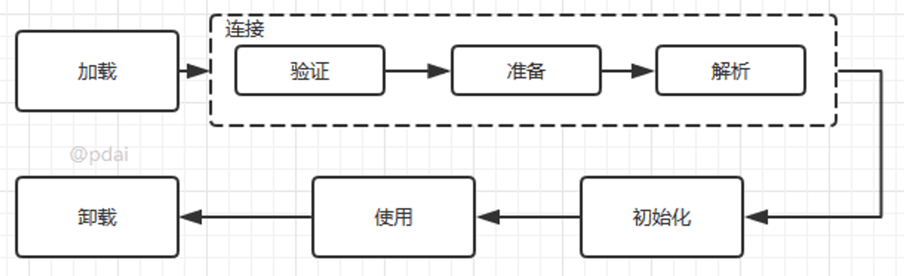

# 1- JAVA 基础 - 知识点 

[TOC]

```
1- JAVA 基础 - 知识点 
    1 JAVA 基础 - 实践常用
        1.1 代理模式
            1 什么是代理模式, 介绍一下静态代理
            2 什么是动态代理? 动态代理和静态代理的区别是什么?
            3 什么是 JDK 动态代理
            4 什么是 CGLIB 动态代理
            5 JDK动态代理和CGLIB动态代理对比
        1.2 泛型
            1 什么是泛型
            2 泛型的上下限如何理解
            3 泛型的类型擦除
            4 泛型中的 ? 代表什么
        1.3 反射
            1 什么是反射
            2 可以用简单的语言描述一下反射执行吗
            3 反射在平时写代码和框架中的应用场景?
            4 你认为反射有什么优缺点?
        1.4 注解
            1 什么是注解?
            2 JAVA 注解的作用域有了解吗?
        1.5 异常
            1 JAVA 中异常的分类
            2 throws 和 throw 的区别
            3 下面的语句会返回什么值?
            4 JVM 处理异常的机制
        1.6 SPI 机制
            1 什么是 SPI 机制
            2 SPI 和 API 的区别
        1.7 JAVA 中的序列化
            1 序列化和常见场景有哪些?
            2 常见的序列化协议有哪些？
            3 如果有些字段不想进行序列化怎么办？
            4 为什么不推荐使用 JDK 自带的序列化？
            5 怎么把一个对象从一个 JVM 转移到另一个 JVM?
            6 将对象转为二进制字节流具体怎么实现?
    2 JAVA 基础 - 常见知识点
        2.1 Java 基础类型
            1 Java 中的几种基本数据类型是什么?对应的包装类型是什么?各自占用多少字节呢?
            2 基本数据类型一定在栈中吗?
        2.2 Object 以及 String
            1 == 与 equals 的区别? hashCode 与 equals 的区别?
            2 HashCode 的作用及注意点
            3 String 、StringBuffer 和 StringBuilder 的区别是什么? 
            4 String 为什么是不可变的?
            5 String s1 = new String("abc"); 这段代码创建了几个字符串对象?
        2.3 包装类型 + 装箱拆箱
            1 有了基本数据类型，为什么需要包装类型?
            2 包装类型的缓存机制了解么?
            3 自动装箱与拆箱了解吗?原理是什么?
            4 自动装箱有什么缺点? 
            5 Java 为什么要有 Integer ? 为什么又要保留 int 类型?
        2.4 深拷贝与浅拷贝
            1 深拷⻉和浅拷⻉区别了解吗?什么是引用拷⻉?
            2 实现深拷贝的三种方式是什么? 
        2.5 IO 相关
            1 BIO,NIO,AIO 有什么区别?
            2 什么是 IO 多路复用(NIO 一般使用什么方式)
            3 实现 IO 多路复用有哪些方式? 
            4 你知道什么框架中使用到了 NIO 吗? 
        2.6 浮点数与Decimal
            1 为什么浮点数计算会丢失精度？如何解决？
            2 为什么用 BigDecimal 而不使用 double? 
        2.7 面向对象
            1 内部类和内部匿名类了解吗?
            2 所有对象都存放在堆上吗 - JIT 逃逸分析
            3 抽象类和接口有什么共同点和区别
            4 怎么理解面向对象, 简单说说封装继承多态?
            5 多态解决了什么问题 ? 
            6 面向对象的六大设计原则是什么? 如何理解 ? 
            7 重写和重载需要注意什么？
            8 抽象类和普通类有什么区别
            9 抽象类可以使用 final 修饰吗?
            10 接口中可以定义哪些方法?
            11 抽象类可以被实例化吗 ?
            12 接口可以包含构造函数吗?
            13 非静态内部类和静态内部类的区别?
            14 非静态内部类可以直接访问外部方法, 编译器是怎么做到的?
        2.8 Java 特性
            1 Java 的特性有什么
            2 为什么 JAVA 是跨平台的
            3 JVM、JDK、JRE 三者关系
            4 为什么 Java 解释和编译都有
            5 JVM 是什么
            6 编译型语言和解释型语言的语言
        2.9 JDK1.8 三大特性
            1 JAVA 中的 stream 流,常用的 API 介绍一下
            2 Stream 流中的并行 API 是什么
            3 CompletableFuture 如何使用
            2.10 Native 方法
            1 Native 方法是什么? 解释一下
        2.11 笔试
            1 有一个学生类，想按照分数排序，再按学号排序，应该怎么做
```

## 1 JAVA 基础 - 实践常用

### 1.1 代理模式

#### 1 什么是代理模式, 介绍一下静态代理

**代理模式是一种比较好理解的设计模式。简单来说就是：**

- 使用代理对象来代替对真实对象(real object)的访问
- 在不修改原目标对象的前提下扩展目标对象的功能。

**静态代理：**

- 静态代理：实际应用场景非常非常少，日常开发几乎看不到使用静态代理的场景。
  - 手动：我们对目标对象的每个方法的增强都是手动完成的，非常不灵活
  - 方法：接口一旦新增加方法，目标对象和代理对象都要进行修改且麻烦
  - 类：需要对每个目标类都单独写一个代理类。

之所以称之为静态代理，是因为从JVM层面来讲，静态代理在编译时就将接口、实现类、代理类这些都变成了一个个实际的class文件。

- 静态代理的实现步骤如下：
  - 定义一个接口及其实现类（目标类）
  - 创建一个代理类同样实现这个接口（代理类）
  - 将目标对象注入进代理类，然后在代理类的对应方法调用目标类中的对应方法。

静态代理的实现案例如下:

- 定义发送短信的接口

```java
public interface SmsService {
    String send(String message);
}
```

- 实现发送短信的接口（目标类）

```java
public class SmsServiceImpl implements SmsService {
    public String send(String message) {
        System.out.println("send message:" + message);
        return message;
    }
}
```

- 创建代理类并同样实现发送短信的接口（代理类）

```java
public class SmsProxy implements SmsService {

    private final SmsService smsService;

    public SmsProxy(SmsService smsService) {
        this.smsService = smsService;
    }

    @Override
    public String send(String message) {
        //调用方法之前，我们可以添加自己的操作
        System.out.println("before method send()");
        smsService.send(message);
        //调用方法之后，我们同样可以添加自己的操作
        System.out.println("after method send()");
        return null;
    }
}
```

- 使用静态代理

```java
public class Main {
    public static void main(String[] args) {
        SmsService smsService = new SmsServiceImpl();
        SmsProxy smsProxy = new SmsProxy(smsService);
        smsProxy.send("java");
    }
}
```

代码输出：

```java
before method send()
send message:java
after method send()
```

#### 2 什么是动态代理? 动态代理和静态代理的区别是什么?

动态代理是**一种在运行时动态生成代理对象的技术**，它通过代理对象来间接访问原始对象，并在访问前后执行额外的操作。 动态代理具有灵活性和可扩展性，广泛应用于各种领域。

动态代理又分为两种: JDK 动态代理和 CGLIB 动态代理

**静态代理与动态代理的区别：**

- 编译时间：
  - 从JVM层面来讲，静态代理在编译时就将接口、实现类、代理类这些都变成了一个个实际的class文件
  - 动态代理在运行时动态生成类字节码，并在运行时加载进入JVM中
- 灵活性：
  - 静态代理需要针对每个目标类都单独创建一个代理类，并进行相应操作的封装
  - 动态代理不需要单独创建代理类，甚至不需要继承于一个接口
- 适用范围：
  - 静态代理很少被使用
  - 动态代理在框架原理中经常被使用到，利用 Spring AOP 就是通过动态代理使用的

#### 3 什么是 JDK 动态代理

JDK 动态代理中，有两个核心： InvocationHandler 接口和 Proxy 类。

- Proxy 类中主要通过 newProxyInstance()  方法来生成一个代理对象
- 实现动态代理还需要实现InvocationHandler 来自定义处理逻辑
  - 动态代理会将方法转发到其中的 invokde 方法中
- 也就是说：你通过Proxy 类的 newProxyInstance() 创建的代理对象在调用方法的时候，实际会调用到实现InvocationHandler 接口的类的 invoke()方法。 你可以在 invoke() 方法中自定义处理逻辑，比如在方法执行前后做什么事情。
- JDK 动态代理的使用步骤：
  - 定义一个接口及其实现类 **（目标类）**
  - 自定义 InvocationHandler 并重写invoke方法，在 invoke 方法中我们会调用原生方法（被代理类的方法）并自定义一些处理逻辑 **（定义代理类）**
  - 通过 Proxy.newProxyInstance(ClassLoader loader,Class<?>[] interfaces,InvocationHandler h) 方法创建代理对象 **（代理类实例对象）**

JDK 动态代理代码示例如下:

- 定义发送短信的接口

```java
public interface SmsService {
    String send(String message);
}
```

- 实现发送短信的接口（目标类）

```java
public class SmsServiceImpl implements SmsService {
    public String send(String message) {
        System.out.println("send message:" + message);
        return message;
    }
}
```

- 定义一个JDK动态代理类，其自定义 `InvocationHandler` 并重写`invoke`方法（动态代理类）

```java
public class DebugInvocationHandler implements InvocationHandler {
    /**
     * 代理类中的真实对象
     */
    private final Object target;

    public DebugInvocationHandler(Object target) {
        this.target = target;
    }

    @Override
    public Object invoke(Object proxy, Method method, Object[] args) throws InvocationTargetException, IllegalAccessException {
        //调用方法之前，我们可以添加自己的操作
        System.out.println("before method " + method.getName());
        Object result = method.invoke(target, args);
        //调用方法之后，我们同样可以添加自己的操作
        System.out.println("after method " + method.getName());
        return result;
    }
}
```

`invoke()` 方法: 当我们的动态代理对象调用原生方法的时候，最终实际上调用到的是 `invoke()` 方法，然后 `invoke()` 方法代替我们去调用了被代理对象的原生方法。

- 获取代理对象的工厂类（动态代理对象）

```java
public class JdkProxyFactory {
    public static Object getProxy(Object target) {
        return Proxy.newProxyInstance(
                target.getClass().getClassLoader(), // 目标类的类加载器
                target.getClass().getInterfaces(),  // 代理需要实现的接口，可指定多个
                new DebugInvocationHandler(target)   // 代理对象对应的自定义 InvocationHandler
        );
    }
}
```

`getProxy()`：主要通过`Proxy.newProxyInstance（）`方法获取某个类的代理对象

- 实际使用

```java
SmsService smsService = (SmsService) JdkProxyFactory.getProxy(new SmsServiceImpl());
smsService.send("java");
```

控制台输出：

```java
before method send
send message:java
after method send
```

#### 4 什么是 CGLIB 动态代理

CGLIB动态代理机制是为了解决JDK动态代理的一个致命问题： **只能代理实现了接口的类。** CGLIB是一个字节码生成库，允许我们在运行时对字节码进行修改和动态生成。CGLIB 通过继承方式实现代理。**在 CGLIB 代理机制中，有两个核心：MethodInterceptor 接口和 Enhancer 类**

- 通过自定义 MethodInterceptor 并重写 intercept 方法来定义代理类，四个参数
- 通过 Enhancer类来动态获取被代理类，当代理类调用方法的时候，实际调用的是 MethodInterceptor 中的 intercept 方法
- CGLIB动态代理的使用步骤：
  - 定义一个目标类 **（目标类）** 
  - 自定义 MethodInterceptor 并重写 intercept 方法，intercept 用于拦截增强被代理类的方法 **（定义代理类）**
  - 通过 Enhancer 类的 create()创建代理类 **（代理类实例对象）** 

CGLIB 动态代理代码示例如下:

- **CGLIB** 实际是属于一个开源项目，如果你要使用它的话，需要手动添加相关依赖。

```java
<dependency>
  <groupId>cglib</groupId>
  <artifactId>cglib</artifactId>
  <version>3.3.0</version>
</dependency>
```

- **实现一个使用阿里云发送短信的类**

```java
public class AliSmsService {
    public String send(String message) {
        System.out.println("send message:" + message);
        return message;
    }
}
```

- **自定义 `MethodInterceptor`（方法拦截器）**

```java
public class DebugMethodInterceptor implements MethodInterceptor {
    @Override
    public Object intercept(Object o, Method method, Object[] args, MethodProxy methodProxy) throws Throwable {
        //调用方法之前，我们可以添加自己的操作
        System.out.println("before method " + method.getName());
        Object object = methodProxy.invokeSuper(o, args);
        //调用方法之后，我们同样可以添加自己的操作
        System.out.println("after method " + method.getName());
        return object;
    }
}
```

- **获取代理类**

```java
public class CglibProxyFactory {

    public static Object getProxy(Class<?> clazz) {
        // 创建动态代理增强类
        Enhancer enhancer = new Enhancer();
        // 设置类加载器
        enhancer.setClassLoader(clazz.getClassLoader());
        // 设置被代理类
        enhancer.setSuperclass(clazz);
        // 设置方法拦截器
        enhancer.setCallback(new DebugMethodInterceptor());
        // 创建代理类
        return enhancer.create();
    }
}
```

- **实际使用：**

```java
AliSmsService aliSmsService = (AliSmsService) CglibProxyFactory.getProxy(AliSmsService.class);
aliSmsService.send("java");
```

运行上述代码之后，控制台打印出：

```java
before method send
send message:java
after method send
```

#### 5 JDK动态代理和CGLIB动态代理对比

1. JDK 动态代理只能代理实现了接口的类或者直接代理接口，而 CGLIB 可以代理未实现任何接口的类。
2. CGLIB 动态代理是通过**生成一个被代理类的子类**来拦截被代理类的方法调用，因此不能代理声明为 final 类型的类和方法。
3. 就二者的效率来说，大部分情况都是 JDK 动态代理更优秀，随着 JDK 版本的升级，这个优势更加明显。

### 1.2 泛型

#### 1 什么是泛型

泛型是 Java 编程语言中的一个重要特性，它允许类、接口和方法在定义时使用一个或多个类型参数，这些类型参数在使用时可以被指定为具体的类型。

泛型的主要目的是在**编译时**提供更强的类型检查，并且在编译后能够保留类型信息，避免了在**运行时**出现类型转换异常。

**引入泛型的意义：**

1. 代码复用: 适用于多种数据类型，执行相同的代码逻辑

2. 类型安全及检查: 使用时不需要进行强制类型转换

   - 例如如果直接使用 List list = new ArrayList(); ，取出集合元素时需要人为强制类型转换到具体类型，容易出现 ClassCastException 异常

   - 引入泛型，它将提供类型的约束，提供编译前的检查：List<String> list = new ArrayList<String>();, list 中只能放 String , 不能放其它类型的元素

#### 2 泛型的上下限如何理解

Collection<? extends E> ? 只能是E类型 或者是E 类型的子类(否则编译报错)：这样的泛型称之受限泛型：**上限泛型**。

一般在存储元素时使用上限（? extends E）。因为一旦确定好类型，存入的就都是E或E的子类，取出时都按照上限类型E来运算，不会出现类型安全隐患

```java
Collection<? extends Animal> c10 = new ArrayList<Animal>();
Collection<? extends Animal> c11 = new ArrayList<Dog>();
Collection<? extends Animal> c12 = new ArrayList<Cat>();
```

Comparator<? super E> ? 只能是E类型或者是E类型的父类型(否则编译报错)：受限泛型的**下限泛型**。（一般只有比较器用到）

```java
//min比较器
min(Collection<? extends T> coll, Comparator<? super T> comp)
//sort排序比较器
sort(List<T> list, Comparator<? super T> c)
```

继续来看下面这个例子:

```java
class A{}
class B extends A {}

// 如下两个方法不会报错
public static void funA(A a) {
    // ...          
}
public static void funB(B b) {
    funA(b);
    // ...             
}

// 如下funD方法会报错
public static void funC(List<A> listA) {
    // ...          
}
public static void funD(List<B> listB) {
    funC(listB); // Unresolved compilation problem: The method doPrint(List<A>) in the type test is not applicable for the arguments (List<B>)
    // ...             
}
```

上述方法会报错：List A 无法转换成 List A , List B 在运行时会被擦出为 List Object

- 为了解决泛型中隐含的转换问题，Java泛型加入了类型参数的上下边界机制。
- <? extends A> 表示该类型参数可以是A(上边界)或者A的子类类型。编译时擦除到类型A，即用A类型代替类型参数。
- 这种方法可以解决开始遇到的问题，编译器知道类型参数的范围，如果传入的实例类型B是在这个范围内的话允许转换，这时只要一次类型转换就可以了，运行时会把对象当做A的实例看待。

**在使用泛型的时候，我们可以为参数进行上下边界的限制：**

- `<T extends Number>` 定义了参数的上限
- `? super String` 定义了参数的下限

**如何使用：PECS 原则**

- 使用 extends 来创建作为生产者的范型容器，该容器只能作为生产者，只能从该容器中读取元素
- 使用 super 来创建作为消费者的范型容器，该容器只能作为消费者，只能向该容器里写入元素
- 原因：泛型最后使用的时候还是需要固定类型的
  - 对于 List<? extends T> 而言，编译器只能推断出 List 中的元素肯定是 T 或其子类，但是不知道具体是哪个子类，所以无法向其中写入元素，但是从其中读出的元素肯定能转换成 T 或 T 的父类（向上类型转换是隐式的）
  - 对于 List<? super T> 而言，编译器只能推断出 List 中的元素肯定是 T 或 T 的父类，但是不知道具体是哪个父类，所以无法从其中读取元素，但是可以向其中写入 T 或 T 的子类，因为它们可以隐式地向上转换成 T 或 T 的父类

#### 3 泛型的类型擦除

Java 的泛型是伪泛型，因为 Java 在编译期间，所有的泛型类型都会被擦除掉，也就是常说的类型擦除。 编译器在编译的时候会将泛型 T 擦除为 Object，将 T extends xxx 擦除为 xxx 类型。

因此，泛型本质上还是编译器的行为，为了保证引入泛型机制但是不创建新的类型，创建虚拟机的运行开销，编译器通过擦除将泛型类转化为一般类。

根据类型参数的上下界推断并替换所有的类型参数为原生态类型：

- 如果类型参数是无限制通配符或没有上下界限定则替换为Object
- 如果存在上下界限定则根据子类替换原则取类型参数的最左边限定类型（即父类）。

#### 4 泛型中的 ? 代表什么

**常用的通配符 - 即泛型中的 ？：**

- 通配符解决的问题：泛型类型是固定的，某些场景下使用起来不太灵活，于是通配符就来了。通配符可以允许类型参数变化。
- 通配符 ？与泛型 T 之间有什么区别：
  - T 可以用于声明变量而 ？不可以
  - T 一般用于声明泛型类或方法，通配符 ？ 一般用于泛型方法的调用和行参
  - T 在编译器会被擦除为限定类型或 Object，通配符 ？用于捕获具体类型


### 1.3 反射

#### 1 什么是反射

**反射的作用：运行时识别一个对象的类型和类的信息，把java类中的各种成分映射成一个个的Java对象。** 例如：一个类有：成员变量、方法、构造方法、包等等信息，利用反射技术可以对一个类进行解剖，把个个组成部分映射成一个个对象。

想要理解反射，需要理解两个知识：Class 类和 Java 中的类加载机制

**什么是 Class 类：**

- Class类是一个实实在在的类，存在于JDK的java.lang包中。Class类的实例表示 java 应用运行时的类或接口：
  - 手动编写的类被编译后会产生一个Class对象，其表示的是创建的类的类型信息，而且这个Class对象保存在同名.class的文件中(字节码文件)
  - 每个通过关键字class标识的类，在内存中有且只有一个与之对应的Class对象来描述其类型信息，无论创建多少个实例对象，其依据的都是用一个Class对象。
  - Class类的对象作用是运行时提供或获得某个对象的类型信息，这点对于反射技术很重要。

**类加载机制和类的加载：**




对于一个Java类：Car 类型以及其产生的对象：Car c1 = new Car()，在内存中共产生三个结构：

- 方法区中存储：Car 类的数据结构
- 堆中存储：Car 类的 Class 对象
- 堆中存储：Car c1 对应的实例对象

**什么是反射：根据类名或者对象 → 类的 Class 对象 → Class类对象的内部信息，反向控制实例对象**

在类加载的时候，jvm会创建一个class对象

class对象是可以说是反射中最常用的，获取class对象的方式的主要有三种

1. 根据类名：类名.class
2. 根据对象：对象.getClass()
3. 根据全限定类名：Class.forName(全限定类名)

**利用获取到的 Class 对象可以进行以下操作：获取类对象、实例、方法 → 进行相应操作**

1. 获取反射机制允许程序在运行时获取类的完整结构信息
2. 获取 Constructor 对象并利用反射进行构造对象（使用 newInstance）
3. 获取 Field 对象，可以获取当前类中的所有字段或者根据字段名字获取
4. 获取 Method 对象，类或接口上单独某个方法（以及如何访问该方法）的信息，获取到的方法可能是类方法或者实例方法。
5. 可以使用获取到的 Method 和创建的实例 Object 进行对应的方法调用

#### 2 可以用简单的语言描述一下反射执行吗

**反射机制执行的总结：**

1. 反射类及反射方法的获取，都是通过从列表中搜寻查找匹配的方法，所以查找性能会随类的大小方法多少而变化；
2. **每个类都会有一个与之对应的Class实例，从而每个类都可以获取method反射方法，并作用到其他实例身上；（知道这个就可以）**
3. 反射也是考虑了线程安全的，放心使用；
4. 调度反射方法，最终是由 JVM 执行`invoke0()`执行；

####  3 反射在平时写代码和框架中的应用场景?

1. 加载数据库驱动: 我们的项目底层数据库有时是用mysql，有时用oracle，需要动态地根据实际情况加载驱动类，这个时候反射就有用了，假设 com.mikechen.java.myqlConnection，com.mikechen.java.oracleConnection这两个类我们要用。这时候我们在使用 JDBC 连接数据库时使用 Class.forName()通过反射加载数据库的驱动程序:

   ```java
   Class.forName("com.mysql.cj.jdbc.Driver");
   ```

2. 配置文件加载: Spring 框架的 IOC（动态加载管理 Bean），Spring通过配置文件配置各种各样的bean，你需要用到哪些bean就配哪些，spring容器就会根据你的需求去动态加载，你的程序就能健壮地运行。Spring通过XML配置模式装载Bean的过程：

   1. 将程序中所有XML或properties配置文件加载入内存
   2. Java类里面解析xml或者properties里面的内容，到对应实体类的字节码字符串以及相关的属性信息
   3. 使用反射机制，根据这个字符串获得某个类的Class实例
   4. 动态配置实例的属性

3. 动态代理使用了反射机制

4. 注解使用了反射机制（基于反射类获取类上的注解，进行下一步处理）

#### 4 你认为反射有什么优缺点?

**反射的优缺点：**

- 优点：让我们的代码更加灵活、为各种框架提供开箱即用的功能提供了便利
  - 具体表现就是，只需要添加了框架中给定的注解，那么在运行时框架中的代码就会捕捉到哪些方法上拥有这些注解，然后 分析注解 → 获取类的 Field 和 Method → 按照计划执行方法。
- 缺点：增加了安全问题，比如可以无视泛型参数的安全检查（泛型参数的安全检查发生在编译时），比如可以调用私有方法。


### 1.4 注解

#### 1 什么是注解?

注解本质是一个继承了Annotation的特殊接口，其具体实现类是Java运行时生成的动态代理类。

我们通过反射获取注解时，返回的是Java运行时生成的动态代理对象。通过代理对象调用自定义注解的方法，会最终调用AnnotationInvocationHandler的invoke方法。该方法会从memberValues这个Map中索引出对应的值。而memberValues的来源是Java常量池。

**注解有什么作用?**

**注解的作用：可以结合 AOP 来讲，用于对代码进行说明，可以对类、字段、方法参数等进行注解。**

- 生成文档：通过代码里标识的元数据生成javadoc文档。
- 编译检查：通过代码里标识的元数据让编译器在编译期间进行检查验证。
- 编译时动态处理：编译时通过代码里标识的元数据动态处理，例如动态生成代码。
- 运行时动态处理：运行时通过代码里标识的元数据动态处理，例如使用反射注入实例。

**注解的常见分类：AOP 中利用反射可以获取注解信息**

- Java自带的标准注解，用于编译器就会进行检查：

  - `@Override` ：用于标明重写某个方法
  - `@Deprecated` ：标明某个类或方法过时
  - `@SuppressWarnings`：标明要忽略的警告
  
- 元注解，元注解是用于定义注解的注解：

  - `@Target`：描述注解的使用范围
  - `@Retention`：描述注解保留的时间范围
  - `@Documented`：描述在使用 javadoc 工具为类生成帮助文档时是否要保留其注解信息
  - `@Inherited`用于标明注解可继承
  
- 自定义注解，可以根据自己的需求定义注解，并可用元注解对自定义注解进行注解。

  - 可以定义自己的注解
  - 在对应的方法或者类上使用注解
  - 可以通过反射方式来获取注解相关信息

比如 AOP 中通过反射来处理对应的注解

#### 2 JAVA 注解的作用域有了解吗?

注解的作用域（Scope）指的是注解可以应用在哪些程序元素上，例如类、方法、字段等。Java注解的作用域可以分为三种：

1. 类级别作用域：用于描述类的注解，通常放置在类定义的上面，可以用来指定类的一些属性，如类的访问级别、继承关系、注释等。
2. 方法级别作用域：用于描述方法的注解，通常放置在方法定义的上面，可以用来指定方法的一些属性，如方法的访问级别、返回值类型、异常类型、注释等。
3. 字段级别作用域：用于描述字段的注解，通常放置在字段定义的上面，可以用来指定字段的一些属性，如字段的访问级别、默认值、注释等。

除了这三种作用域，Java还提供了其他一些注解作用域，例如构造函数作用域和局部变量作用域.


### 1.5 异常

#### 1 JAVA 中异常的分类


**异常分类：**

Throwable 包含两个子类：Error（错误）和 Exception（异常），它们通常用于指示发生了异常情况。

- Error 类及其子类：程序中无法处理的错误，表示运行应用程序中出现了严重的错误。
  - OutOfMemoryError：内存不足错误
  - StackOverflowError：栈溢出错误
- 运行时异常：这些异常是不检查异常，程序中可以选择捕获处理
  - NullPointerException：空指针异常、
  - IndexOutOfBoundsException：下标越界异常
  - NullPointerException 空指针异常
  - ArithmeticException 算术条件异常
  - 运行时异常的特点是Java编译器不会检查它
- 非运行时异常（编译异常）：从程序语法角度讲是必须进行处理的异常，如果不处理，程序就不能编译通过。
  - IOException：文件读取相关的异常
  - SQLException：数据库操作相关的异常

#### 2 throws 和 throw 的区别

- throws：声明一个异常，告知方法调用者。（通常用在方法上）
- throw ：抛出一个异常，至于该异常被捕获还是继续抛出都与它无关。

#### 3 下面的语句会返回什么值?

```java
public static void simpleTryCatch() {
   try {
       return "a";
   } catch (Exception e) {
       return "b";
   }
}
```

finally 块中的 return 语句会覆盖 try 块中的 return 返回，因此，该语句将返回"b"。

**Finally 块中的代码在一些情况下不会被执行：**

- 程序所在的线程死亡。
- 关闭 CPU。

#### 4 JVM 处理异常的机制

可以使用 javac 编译 + javap 对 class 文件进行反汇编：

```java
public static void simpleTryCatch() {
   try {
       testNPE();
   } catch (Exception e) {
       e.printStackTrace();
   }
}
//javap -c Main
 public static void simpleTryCatch();
    Code:
       0: invokestatic  #3                  // Method testNPE:()V
       3: goto          11
       6: astore_0
       7: aload_0
       8: invokevirtual #5                  // Method java/lang/Exception.printStackTrace:()V
      11: return
    Exception table:
       from    to  target type
           0     3     6   Class java/lang/Exception
```

看到上面的代码，应该会有会心一笑，因为终于看到了Exception table，也就是我们要研究的异常表。异常表中包含了一个或多个异常处理者(Exception Handler)的信息，这些信息包含如下

- **from** 可能发生异常的起始点
- **to** 可能发生异常的结束点
- **target** 上述from和to之前发生异常后的异常处理者的位置
- **type** 异常处理者处理的异常的类信息

**答案是当一个异常发生时:**

1.JVM会在当前出现异常的方法中，查找异常表，是否有合适的处理者来处理

2.如果当前方法异常表不为空，并且异常符合处理者的from和to节点，并且type也匹配，则JVM调用位于target的调用者来处理。

3.如果上一条未找到合理的处理者，则继续查找异常表中的剩余条目

4.如果当前方法的异常表无法处理，则向上查找（**弹栈处理**）刚刚调用该方法的调用处，并重复上面的操作。

5.如果所有的栈帧被弹出，仍然没有处理，则抛给当前的Thread，Thread则会终止。

6.如果当前Thread为最后一个非守护程，且未处理异常，则会导致JVM终止运行。


### 1.6 SPI 机制

#### 1 什么是 SPI 机制


**什么是 SPI 机制：核心思想就是解耦**

JDK内置的一种服务提供发现机制，可以用来扩展和替换组件，主要是被框架的开发人员使用：

- 比如java.sql.Driver接口，其他不同厂商可以针对同一接口做出不同的实现，MySQL 和 PostgreSQL 都有不同的实现提供给用户。
- Java 中 SPI 机制主要思想是将装配的控制权移到程序之外，用于根据接口实现模块化设计

#### 2 SPI 和 API 的区别

- SPI - 接口位于调用方（基于服务调用方的特征定制一套执行流程）
  - 概念上更依赖调用方。
  - 组织上位于调用方所在的包中。
  - 实现位于独立的包中。
- API - 接口位于实现方所在的包中
  - 概念上更接近实现方。
  - 组织上位于实现方所在的包中。
  - 实现和接口在一个包中。

### 1.7 JAVA 中的序列化

#### 1 序列化和常见场景有哪些?

如果我们需要持久化 Java 对象比如将 Java 对象保存在文件中，或者在网络传输 Java 对象，这些场景都需要用到序列化。

- **序列化**：将数据结构或对象转换成二进制字节流的过程
- **反序列化**：将在序列化过程中所生成的二进制字节流转换成数据结构或者对象的过程

**常见应用场景：**

- 对象在进行网络传输（比如远程方法调用 RPC 的时候）之前需要先被序列化，接收到序列化的对象之后需要再进行反序列化；
- 将对象存储到文件之前需要进行序列化，将对象从文件中读取出来需要进行反序列化；
- 将对象存储到数据库（如 Redis）之前需要用到序列化，将对象从缓存数据库中读取出来需要反序列化；
- 将对象存储到内存之前需要进行序列化，从内存中读取出来之后需要进行反序列化。

综上：**序列化的主要目的是通过网络传输对象或者说是将对象存储到文件系统、数据库、内存中。**

#### 2 常见的序列化协议有哪些？

JDK 自带的序列化方式一般不会用 ，因为序列化效率低并且存在安全问题。比较常用的序列化协议有 Hessian、Kryo、Protobuf、ProtoStuff，这些都是基于二进制的序列化协议。

像 JSON 和 XML 这种属于文本类序列化方式。虽然可读性比较好，但是性能较差，一般不会选择。

**Kryo 序列化：**

- Kryo 是一个高性能的序列化/反序列化工具，由于其变长存储特性并使用了字节码生成机制，拥有较高的运行速度和较小的字节码体积。
- 另外，Kryo 已经是一种非常成熟的序列化实现了，已经在 Twitter、Groupon、Yahoo 以及多个著名开源项目（如 Hive、Storm）中广泛的使用。

**Protobuf 序列化：**

- Protobuf 出自于 Google，性能还比较优秀，也支持多种语言，同时还是跨平台的。就是在使用中过于繁琐，因为你需要自己定义 IDL 文件和生成对应的序列化代码。这样虽然不灵活，但是，另一方面导致 protobuf 没有序列化漏洞的风险。

#### 3 如果有些字段不想进行序列化怎么办？

对于不想进行序列化的变量，可以使用 transient 关键字修饰。

transient 关键字的作用是：阻止实例中那些用此关键字修饰的的变量序列化；当对象被反序列化时，被 transient 修饰的变量值不会被持久化和恢复。

关于 transient 还有几点注意：

- transient 只能修饰变量，不能修饰类和方法。
- transient 修饰的变量，在反序列化后变量值将会被置成类型的默认值。例如，如果是修饰 int 类型，那么反序列后结果就是 0。
- static 变量因为不属于任何对象(Object)，所以无论有没有 transient 关键字修饰，均不会被序列化。

我会考虑用主流序列化框架，比如FastJson、Protobuf来替代Java 序列化。

#### 4 为什么不推荐使用 JDK 自带的序列化？

我们很少或者说几乎不会直接使用 JDK 自带的序列化方式，主要原因有下面这些原因：

- **不支持跨语言调用** : 如果调用的是其他语言开发的服务的时候就不支持了。
- **性能差**：相比于其他序列化框架性能更低，主要原因是序列化之后的字节数组体积较大，导致传输成本加大。
- **存在安全问题**：序列化和反序列化本身并不存在问题。但当输入的反序列化的数据可被用户控制，那么攻击者即可通过构造恶意输入，让反序列化产生非预期的对象，在此过程中执行构造的任意代码。

#### 5 怎么把一个对象从一个 JVM 转移到另一个 JVM?

1. **使用序列化和反序列化**：将对象序列化为字节流，并将其发送到另一个 JVM，然后在另一个 JVM 中反序列化字节流恢复对象。这可以通过 Java 的 ObjectOutputStream 和 ObjectInputStream 来实现。
2. **使用消息传递机制**：利用消息传递机制，比如使用消息队列（如 RabbitMQ、Kafka）或者通过网络套接字进行通信，将对象从一个 JVM 发送到另一个。这需要自定义协议来序列化对象并在另一个 JVM 中反序列化。
3. **使用远程方法调用（RPC）**：可以使用远程方法调用框架，如 gRPC，来实现对象在不同 JVM 之间的传输。远程方法调用可以让你在分布式系统中调用远程 JVM 上的对象的方法。
4. **使用共享数据库或缓存**：将对象存储在共享数据库（如 MySQL、PostgreSQL）或共享缓存（如 Redis）中，让不同的 JVM 可以访问这些共享数据。这种方法适用于需要共享数据但不需要直接传输对象的场景。

#### 6 将对象转为二进制字节流具体怎么实现?

其实，像序列化和反序列化，无论这些可逆操作是什么机制，都会有对应的**处理和解析协议**，例如加密和解密，TCP的粘包和拆包，序列化机制是通过序列化协议来进行处理的，和 class 文件类似，它其实是定义了序列化后的字节流格式，然后对此格式进行操作，生成符合格式的字节流或者将字节流解析成对象。

在 Java 中通过序列化对象流来完成序列化和反序列化：

1. 让类实现Serializable接口
2. 创建输出流并写入对象, 对象obj会被序列化并写入到文件"object.ser"中
3. 创建输入流并读取对象, 从文件中读取字节流并恢复为对象newObj
4. 这种方式可以方便地将对象转换为字节流用于持久化存储、网络传输等操作。这种方式可以方便地将对象转换为字节流用于持久化存储、网络传输等操作。


## 2 JAVA 基础 - 常见知识点

### 2.1 Java 基础类型

#### 1 Java 中的几种基本数据类型是什么?对应的包装类型是什么?各自占用多少字节呢?


这八种基本类型都有对应的包装类分别为：Byte、Short、Integer、Long、Float、Double、Character、Boolean 。

**基本类型与包装类型的区别：**

- 用途：包装类型可用于泛型，而基本类型不可以
- 存储方式：
  - 基本数据类型的局部变量存放在 Java 虚拟机栈中的局部变量表中
  - 基本数据类型的成员变量（未被 static 修饰 ）存放在 Java 虚拟机的堆中
    - JDK1.7 静态变量从永久代移动了 Java 堆中
  - 包装类型属于对象类型，**几乎**所有对象实例都存在于堆中（JIT优化）。
- 占用空间：相比包装类型，基本数据类型占用的空间往往非常小
- 默认值：包装类型为 null ，基本类型拥有默认值
- 比较方式：使用 == 包装类型比较的是地址，基本类型比较的是数值

#### 2 基本数据类型一定在栈中吗?

**误区：基本数据类型不一定存放在栈中**

- 基本数据类型的存储位置取决于它们的作用域和声明方式。
  - 如果它们是局部变量，那么它们会存放在栈中；
  - 如果它们是成员变量，那么它们会存放在堆中。


### 2.2 Object 以及 String

#### 1 == 与 equals 的区别? hashCode 与 equals 的区别?

**比较一下 == 和 equals 的区别：**

- == 有两种情况：
  - 对于基本数据类型来说，== 比较的是值。
  - 对于引用数据类型来说，== 比较的是对象的内存地址。
- equals() 有两种情况：
  - 类没有重写 equals()方法：比较地址（与 == 起到的作用相同）
  - 类重写了 equals()方法：比较内容

#### 2 HashCode 的作用及注意点

**HashCode 的作用：**

- hashCode() 的作用是获取哈希码，也称为散列码。这个哈希码的作用是确定该对象在哈希表中的索引位置。
- 如果两个对象的hashCode 值相等，那这两个对象不一定相等（哈希碰撞）。
- 如果两个对象的hashCode 值相等并且equals()方法也返回 true，我们才认为这两个对象相等。
- 如果两个对象的hashCode 值不相等，我们就可以直接认为这两个对象不相等。

**为什么重写 equals 时必须重写 hashCode 方法：**

- 如果重写 equals() 时没有重写 hashCode() 方法的话就可能会导致 equals 方法判断是相等的两个对象，hashCode 值却不相等。
- **思考**：重写 equals() 时没有重写 hashCode() 方法的话，使用 HashMap 可能会出现什么问题。

#### 3 String 、StringBuffer 和 StringBuilder 的区别是什么? 

**三者的区别：**

- String 是不可变的，被声明为 final class，每次操作都会生成一个新的 String 对象
- StringBuffer 和 StringBuilder 都继承自 AbstractStringBuilder，内部使用字符数组保存字符串，都是可变的，并且提供了很多修改字符串的方法，例如 append
  - StringBuffer 中的方法加了同步锁，是线程安全的；StringBuilder 中没有对方法进行加锁，是非线程安全的
  - StringBuffer 性能更低，StringBuilder 性能更好一些

**三者使用上的总结：**

- 操作少量的数据: 适用 `String`
- 单线程操作字符串缓冲区下操作大量数据: 适用 `StringBuilder`
- 多线程操作字符串缓冲区下操作大量数据: 适用 `StringBuffer`

#### 4 String 为什么是不可变的?

**为什么 String 是不可变的：**

1. 保存字符串的数组被 `final` 修饰且为私有的，并且`String` 类没有提供/暴露修改这个字符串的方法。
2. `String` 类被 `final` 修饰导致其不能被继承，进而避免了子类破坏 `String` 不可变。

**额外知识点：**

Java9 之前，字符串对象通过“+”的字符串拼接方式，实际上是通过 `StringBuilder` 调用 `append()` 方法实现的，拼接完成之后调用 `toString()` 得到一个 `String` 对象 。


#### 5 String s1 = new String("abc"); 这段代码创建了几个字符串对象?

**字符串常量池：** JVM 为了提升性能和减少内存消耗针对字符串（String 类）专门开辟的一块区域，主要目的是为了避免字符串的重复创建。

执行 String s1 = new String("abc") 会创建 **1 个或者 2 个**字符串对象：

- 如果字符串常量池中不存在 “abc” 的引用，那么它会在堆上创建两个字符串对象，其中一个字符串对象的引用会被保存在字符串常量池中。
- 如果字符串常量池中已存在字符串对象“abc”的引用，则只会在堆中创建 1 个字符串对象“abc”。

**如何指向字符串池中特定的对象：** String s4 = s3.intern()

- String.intern() 是一个 native（本地）方法，其作用是将指定的字符串对象的引用保存在字符串常量池中
  - 如果字符串常量池中保存了对应的字符串对象的引用，就直接返回该引用。
  - 如果字符串常量池中没有保存了对应的字符串对象的引用，那就在常量池中创建一个指向该字符串对象的引用并返回。

**String类型的变量和常量 + 运算优化：**

- String str3 = "str" + "ing"; 会自动优化为 String str3 = "string";
- String str4 = str1 + str2; 会在堆上创建新对象，类似于 new String(”string”)


### 2.3 包装类型 + 装箱拆箱

#### 1 有了基本数据类型，为什么需要包装类型?

Java是一个面相对象的编程语言，基本类型并不具有对象的性质，为了让基本类型也具有对象的特征，就出现了包装类型。

1. 提供额外功能：通过包装类型，我们可以使用更多的方法和功能来处理数据。
2. 处理空值：基本数据类型无法表示空值，而包装类型可以处理空值的情况。
3. 支持面向对象编程：包装类型使得基本数据类型能够符合面向对象编程的特性。
4. 支持类型检查：包装类型可以用于泛型，而基本类型不可以。


#### 2 包装类型的缓存机制了解么?

**Java 基本数据类型的包装类型的大部分都用到了缓存机制来提升性能：**

- Byte,Short,Integer,Long 这 4 种包装类默认创建了数值 **[-128，127]** 的相应类型的缓存数据
- Character 创建了数值在 **[0,127]** 范围的缓存数据
- Boolean 直接返回 True or False
- 两种浮点数类型的包装类 Float, Double 并没有实现缓存机制

如果超出对应范围仍然会去创建新的对象，缓存的范围区间的大小只是在性能和资源之间的权衡。

**但是注意：只有使用了自动装箱 .valueOf() 函数的才会使用到缓存，反例就是下面这题：**

```java
Integer i1 = 40;
Integer i2 = new Integer(40);
System.out.println(i1==i2);
```

**答案是 false：**

- Integer i1=40 这一行代码会发生装箱，也就是说这行代码等价于 Integer i1=Integer.valueOf(40) 。因此，i1 直接使用的是缓存中的对象。
- 而Integer i2 = new Integer(40) 会直接创建新的对象。


#### 3 自动装箱与拆箱了解吗?原理是什么?

装箱（Boxing）和拆箱（Unboxing）是将基本数据类型和对应的包装类之间进行转换的过程。自动装箱主要发生在两种情况，一种是赋值时，另一种是在方法调用的时候。

```java
Integer i = 10;  //装箱
int n = i;   //拆箱
```

**什么是自动拆装箱？**

- 装箱：将基本类型用它们对应的引用类型包装起来；

  - 调用了包装类的 valueOf() 方法
  - Integer i = 10 等价于 Integer i = Integer.valueOf(10)
  
- 拆箱：将包装类型转换为基本数据类型；

  - 调用了包装类的 xxxValue()方法
- int n = i 等价于 int n = i.intValue()

**Integer 和 int 类型相比，会自动拆箱，然后比较栈内存中的数据；**

- 原因：int 是在栈里创建的，Integer是在堆里创建的
- 栈里创建的变量要比在堆创建的速度快得多


#### 4 自动装箱有什么缺点? 

自动装箱有一个问题，那就是在一个循环中进行自动装箱操作的情况，如下面的例子就会创建多余的对象，影响程序的性能。

```java
Integer sum = 0; 
for(int i=1000; i<5000; i++){
		sum += i;
}
```

上面的代码 sum+=i 可以看成sum = sum + i，但是 + 这个操作符不适用于 Integer 对象，首先 sum 进行自动拆箱操作，进行数值相加操作，最后发生自动装箱操作转换成Integer对象。其内部变化如下:

```java
int result = sum.intValue() + i;
Integer sum = new Integer(result); 
```

由于我们这里声明的 sum 为 Integer 类型，在上面的循环中会创建将近 4000 个无用的 Integer 对象，在这样庞大的循环中，会降低程序的性能并且加重了垃圾回收的工作量。

因此在我们编程时，需要注意到这一点，正确地声明变量类型，避免因为自动装箱引起的性能问题。


#### 5 Java 为什么要有 Integer ? 为什么又要保留 int 类型?

**为什么要有 Integer 类:**

Integer 对应是 int 类型的包装类，可以把属性也就是数据跟处理这些数据的方法结合在一起，比如 Integer 就有 parseInt() 等方法来专门处理 int 型相关的数据。

另一个非常重要的原因就是在Java中绝大部分方法或类都是用来处理类类型对象的，如 ArrayList 集合类就只能以类作为他的存储对象，所以Integer的存在是很必要的.

1. 泛型中的应用: 泛型只能使用引用类型，而不能使用基本类型
2. 转换中的应用: 在Java中，基本类型和引用类型不能直接进行转换，必须使用包装类来实现。例如，将一个 int 类型的值转换为 String 类型，必须首先将其转换为 Integer 类型，然后再转换为String 类型。
3. 集合中的应用: Java集合中只能存储对象，而不能存储基本数据类型。使用Integer包装类，我们可以直接使用 stream() 方法来计算所有元素的和。

**为什么要保留 int 类型:**

不管是读写效率，还是存储效率，基本类型都比包装类高效

1. 基本类型数据在读写效率方面，要比包装类高效。原因: 包装类是引用类型，对象的引用和对象本身是分开存储的，而对于基本类型数据，变量对应的内存块直接存储数据本身。
2. 在 64 位JVM上，在开启引用压缩的情况下，一个 Integer 对象占用16个字节的内存空间，而一个 int 类型数据只占用 4 字节的内存空间，前者对空间的占用是后者的 4 倍。


### 2.4 深拷贝与浅拷贝

#### 1 深拷⻉和浅拷⻉区别了解吗?什么是引用拷⻉?


- 浅拷贝：浅拷贝会在堆上创建一个新的对象（区别于引用拷贝的一点），不过，如果原对象内部的属性是引用类型的话，浅拷贝会直接复制内部对象的引用地址，也就是说拷贝对象和原对象共用同一个内部对象。
  - 直接调用 clone() 则是浅拷贝
- 深拷贝：深拷贝会完全复制整个对象，包括这个对象所包含的内部对象。
  - 深拷贝需要自己手动对引用对象进行设置
- **引用拷贝**：两个不同的引用指向同一个对象。


#### 2 实现深拷贝的三种方式是什么? 

在 Java 中，实现对象深拷贝的方法有以下几种主要方式：

1. 实现 Cloneable 接口并重写 clone() 方法
   1. 对象及其所有引用类型字段都实现 Cloneable 接口，并且重写 clone() 方法。
   2. 在 clone() 方法中，通过递归克隆引用类型字段来实现深拷贝。
2. 使用序列化和反序列化
   1. 通过将对象序列化为字节流，再从字节流反序列化为对象来实现深拷贝。
   2. 要求对象及其所有引用类型字段都实现 Serializable 接口。
3. 手动递归复制
   1. 针对特定对象结构，手动递归复制对象及其引用类型字段。
   2. 适用于对象结构复杂度不高的情况。


### 2.5 IO 相关

#### 1 BIO,NIO,AIO 有什么区别?

**可以将 IO 读取数据分为两个阶段：数据准备阶段以及数据拷贝阶段。**

- 准备阶段：内核将数据从网卡、输入设备读入到内核缓冲区
- 拷贝阶段：内核将数据拷贝到用户空间

**三种 IO 方式的区别：**

- BIO：应用程序发起 read 调用后，会一直阻塞，直到内核把数据拷贝到用户空间。
  - 准备阶段阻塞，拷贝阶段阻塞
- NIO：发起 read 之后如果内核数据没有准备好，会返回一个标志告诉用户线程，不会在准备阶段一直阻塞。
  - 准备阶段不阻塞，拷贝阶段阻塞
  - 优点：通过轮询操作，避免了一直阻塞
  - 缺点：应用程序不断进行 I/O 系统调用轮询数据是否已经准备好的过程是十分消耗 CPU 资源的。
- AIO：异步 IO 是基于事件和回调机制实现的，也就是应用操作之后会直接返回，不会堵塞在那里，当后台处理完成，操作系统会通知相应的线程进行后续的操作。
  - 准备阶段不阻塞，拷贝阶段不阻塞
  - 目前由于 AIO 增加了复杂性，但是与 IO 多路复用相比，性能上并没有明显提升，所以 AIO 应用的还不是很广泛

#### 2 什么是 IO 多路复用(NIO 一般使用什么方式)

NIO是一种同步非阻塞的IO模型，所以也可以叫NON-BLOCKINGIO。同步是指线程不断轮询IO事件是否就绪，非阻塞是指线程在等待IO的时候，可以同时做其他任务。

为了提高 NIO 使用时的性能, 提出了 IO 多路复用模型: 核心是 Selector（I/O多路复用），Selector代替了线程本身轮询IO事件，避免了阻塞同时减少了不必要的线程消耗。

- NIO由一个专门的线程处理所有IO事件，并负责分发。
- 事件驱动机制，事件到来的时候触发操作，不需要阻塞的监视事件。线程通过wait,notify 通信，减少线程切换。

IO 多路复用模型中：

- 线程首先发起 select 调用，询问内核数据是否准备就绪，等内核把数据准备好了
- 用户线程再发起 read 调用。read 调用的过程（数据从内核空间 -> 用户空间）还是阻塞的。


NIO主要有三大核心部分：**Channel(通道)，Buffer(缓冲区), Selector**。

- 传统IO基于字节流和字符流进行操作，而NIO基于Channel和Buffer(缓冲区)进行操作，数据总是从通道读取到缓冲区中，或者从缓冲区写入到通道中。
- Selector(选择区)用于监听多个通道的事件（比如：连接打开，数据到达）。因此，单个线程可以监听多个数据通道。


#### 3 实现 IO 多路复用有哪些方式? 

**目前 IO 多路复用的系统调用有：select、poll、epoll**

- 轮询开销：
  - select，poll实现需要自己不断轮询所有fd集合，直到设备就绪，期间可能要睡眠和唤醒多次交替，但是 select 和 poll 在“醒着”的时候要遍历整个fd集合。
  - epoll 其实也需要调用 epoll_wait 不断轮询就绪链表，但是设备就绪时，会使用回调函数把就绪 fd 放在就绪链表中，但是“醒着”的时候只要判断一下就绪链表是否为空就行了，这节省了大量的CPU时间。这就是回调机制带来的性能提升。
- 拷贝开销：
  - select，poll 每次调用都要把 fd 集合从用户态往内核态拷贝一次，并且要把 current 往设备等待队列中挂一次
  - epoll 只要一次拷贝，而且把 current 往等待队列上挂也只挂一次，这也能节省不少的开销。


#### 4 你知道什么框架中使用到了 NIO 吗? 

**Netty。**

Netty 的 I/O 模型是基于非阻塞 I/O 实现的，底层依赖的是 NIO 框架的多路复用器 Selector。

1. 采用 epoll 模式后，只需要一个线程负责 Selector 的轮询。
2. 当有数据处于就绪状态后，需要一个事件分发器（Event Dispather），它负责将读写事件分发给对应的读写事件处理器（Event Handler）。
3. 事件分发器有两种设计模式：Reactor 和 Proactor，Reactor 采用同步 I/O，Proactor 采用异步 I/O。
   1. Reactor 实现相对简单，适合处理耗时短的场景，对于耗时长的 I/O 操作容易造成阻塞。
   2. Proactor 性能更高，但是实现逻辑非常复杂，适合图片或视频流分析服务器。


### 2.6 浮点数与Decimal

#### 1 为什么浮点数计算会丢失精度？如何解决？

```java
float a = 2.0f - 1.9f;
float b = 1.8f - 1.7f;
System.out.println(a);  // 0.100000024
System.out.println(b);  // 0.099999905
System.out.println(a == b);  // false
```

浮点数丢失精度的原因：

- 计算机在表示一个数字时，宽度是有限的
- 无限循环的二进制数存储在计算机时，达到一定宽度，只能被截断

普通浮点数可以表示的小数范围：

- float：大约 6-7 位的有效数字
- double：大约 15 位的有效数字


#### 2 为什么用 BigDecimal 而不使用 double? 

解决方案：使用 BigDecimal 实现对浮点数的运算

BigDecimal 可以实现对浮点数的运算，不会造成精度丢失。通常情况下，大部分需要浮点数精确运算结果的业务场景（比如涉及到钱的场景）都是通过 BigDecimal 来做的。

```java
BigDecimal a = new BigDecimal("1.0");
BigDecimal b = new BigDecimal("0.9");
BigDecimal c = new BigDecimal("0.8");

BigDecimal x = a.subtract(b);
BigDecimal y = b.subtract(c);

System.out.println(x); /* 0.1 */
System.out.println(y); /* 0.1 */
System.out.println(x.compareTo(y)); /* true */
```

这样的使用 BigDecimal 可以确保精确的十进制数值计算，避免了使用 double 可能出现的舍入误差。需要注意的是: 在创建 BigDecimal 对象时，应该使用**字符串作为参数**，而不是直接使用浮点数值，以避免浮点数精度丢失.


### 2.7 面向对象

#### 1 内部类和内部匿名类了解吗?

**内部类：在描述事物时，若一个事物内部还包含其他事物，就可以使用内部类这种结构。**

- 比如汽车类Car中包含发动机类Engine。这时，Engine就可以使用内部类来描述，定义在成员位置。
- 内部类的访问特点：
  - 内部类可以直接访问外部类的成员，包括私有成员
  - 外部类要访问内部类的成员，必须要建立内部类的对象

**匿名内部类：内部类的简化写法，本质是一个带具体实现的父类或者父接口的匿名的子类对象。**

- 前提：匿名内部类必须继承一个父类或者实现一个父接口。
- 匿名内部类使用案例：Thread 类、Runnable 接口


#### 2 所有对象都存放在堆上吗 - JIT 逃逸分析

并不是： HotSpot 虚拟机引入了 JIT 优化之后，会对对象进行逃逸分析，如果发现某一个对象并没有逃逸到方法外部，那么就可能通过标量替换来实现栈上分配，而避免堆上分配内存。


#### 3 抽象类和接口有什么共同点和区别

**共同点：**

- 都不能被实例化。
- 都可以包含抽象方法。
- 都可以有默认实现的方法（Java 8 可以用 default 关键字在接口中定义默认方法）。

**区别：**

- 功能不同：接口主要用于对类的行为进行约束，你实现了某个接口就具有了对应的行为。抽象类主要用于代码复用，强调的是所属关系。
- 继承限制：一个类只能继承一个类，但是可以实现多个接口。
- 成员变量：
  - 接口中的成员变量只能是 public static final 类型的，不能被修改且必须有初始值
  - 而抽象类的成员变量默认 default，可在子类中被重新定义，也可被重新赋值。


#### 4 怎么理解面向对象, 简单说说封装继承多态?

面向对象是一种编程范式，它将现实世界中的事物抽象为对象，抽取属性和行为, 增强可拓展性.

1. 封装: 封装是指将对象的属性（数据）和行为（方法）结合在一起，对外隐藏对象的内部细节，仅通过对象提供的接口与外界交互。
2. 继承: 继承是一种可以使得子类自动共享父类数据结构和方法的机制。它是代码复用的重要手段，通过继承可以建立类与类之间的层次关系，使得结构更加清晰。
3. 多态: 同一个接口，使用不同的实例而执行不同操作。多态性可以分为编译时多态（重载）和运行时多态（重写）。它使得程序具有良好的灵活性和扩展性。


####  5 多态解决了什么问题 ? 

多态是指子类可以替换父类，在实际的代码运行过程中，调用子类的方法实现。

1. 多态可以提高代码的扩展性和复用性，是很多设计模式、设计原则、编程技巧的代码实现基础。
2. 比如策略模式、基于接口而非实现编程、依赖倒置原则、里式替换原则、利用多态去掉冗长的 if-else 语句等等


#### 6 面向对象的六大设计原则是什么? 如何理解 ? 

面向对象编程中的六大原则：

1. **单一职责原则（SRP）**：一个类应该只负责一项职责。
2. **开放封闭原则（OCP）**：软件实体应该对扩展开放，对修改封闭。
3. **里氏替换原则（LSP）**：子类对象应该能够替换掉所有父类对象。
4. **接口隔离原则（ISP）**：客户端不应该依赖那些它不需要的接口，即接口应该小而专。例子：通过接口抽象层来实现底层和高层模块之间的解耦，比如使用依赖注入
5. **依赖倒置原则（DIP）**：高层模块不应该依赖低层模块，二者都应该依赖于抽象；抽象不应该依赖于细节，细节应该依赖于抽象。
6. **最少知识原则 (Law of Demeter)**：一个对象应当对其他对象有最少的了解，只与其直接的朋友交互。


#### 7 重写和重载需要注意什么？

**重写和重载的区别：**

- 重载（Overloading）指的是在同一个类中，可以有多个同名方法，它们具有不同的参数列表（参数类型、参数个数或参数顺序不同），编译器根据调用时的参数类型来决定调用哪个方法。
- 重写（Overriding）指的是子类可以重新定义父类中的方法，方法名、参数列表和返回类型必须与父类中的方法一致，通过@override注解来明确表示这是对父类方法的重写。
- 重载是指在同一个类中定义多个同名方法，而重写是指子类重新定义父类中的方法。

**重载需要满足的条件：**

- 方法名必须相同
- 方法签名相同：**方法名称 + 参数类型 + 参数个数** 组成的一个唯一值，这个唯一值就是方法签名，而 JVM（Java 虚拟机）就是通过这个方法签名来决定调用哪个方法的。
- 为什么返回参数不能作为方法签名：
  - 如果方法的返回类型也作为方法签名的一部分，那么当程序员写了一个代码去调用“重载”的方法时，JVM 就不能分辨要调用哪个方法了

```java
public class OverloadExample {
    public static void main(String[] args) {
        OverloadExample example = new OverloadExample();
        example.method("..."); // JVM 应该调用哪个方法？
    }

    public int method(String name) {
        // doSomething
        return 666;
    }

    public String method(String name) {
        // doSomething
        return "...";
    }
}
```

**重写需要满足的条件：**

- 重写发生在运行期，是子类对父类的允许访问的方法的实现过程进行重新编写。
  - 方法名、参数列表必须相同
    - 子类方法返回值类型应比父类方法返回值类型更小或相等
    - 抛出的异常范围小于等于父类
    - 访问修饰符范围大于等于父类。
  - 如果父类方法访问修饰符为 `private/final/static` 则子类就不能重写该方法，但是被 `static` 修饰的方法能够被再次声明
  - 构造方法无法被重写


#### 8 抽象类和普通类有什么区别

1. 实例化：普通类可以直接实例化对象，而抽象类不能被实例化，只能被继承。
2. 方法实现：普通类中的方法可以有具体的实现，而抽象类中的方法可以有实现也可以没有实现。
3. 实现限制：普通类一般作为父类, 可以被其他类继承使用; 而抽象类一般用于作为基类，被其他类继承和扩展使用。


#### 9 抽象类可以使用 final 修饰吗?

不能，Java中的抽象类是用来被继承的，而final修饰符用于禁止类被继承或方法被重写，因此，抽象类和final修饰符是互斥的，不能同时使用。


#### 10 接口中可以定义哪些方法?

1. 抽象方法: 抽象方法是接口的核心部分，所有实现接口的类都必须实现这些方法。抽象方法默认是 public 和 abstract，这些修饰符可以省略。

   ```java
   public interface Animal {
       void makeSound();
   }
   ```

2. 默认方法: 默认方法是在 Java 8 中引入的，允许接口提供具体实现。实现类可以选择重写默认方法。

   ```java
   public interface Animal {
       void makeSound();
       
       default void sleep() {
   		    System.out.println("Sleeping...");
   		}
   }
   ```

3. 静态方法: 静态方法也是在 Java 8 中引入的，它们属于接口本身，可以通过接口名直接调用，而不需要实现类的对象。

   ```java
   public interface Animal {
       void makeSound();
       
       static void staticMethod() {
   		    System.out.println("Static method in interface");
   		}
   }
   ```

4. 私有方法: 私有方法是在 Java 9 中引入的，用于在接口中为默认方法或其他私有方法提供辅助功能。这些方法不能被实现类访问，只能在接口内部使用。

   ```java
   public interface Animal {
       void makeSound();
       
       default void sleep() {
   		    System.out.println("Sleeping...");
   		    logSleep();
   		}
   		
   		private void logSleep() {
   				System.out.println("Logging sleep");
   		}
   }
   ```


#### 11 抽象类可以被实例化吗 ?

在 Java 中，抽象类本身不能被实例化。

这意味着不能使用 new 关键字直接创建一个抽象类的对象。抽象类的存在主要是为了被继承，它通常包含一个或多个抽象方法（由 abstract 关键字修饰且无方法体的方法），这些方法需要在子类中被实现。

抽象类可以有构造器，这些构造器在子类实例化时会被调用，以便进行必要的初始化工作。然而，这个过程并不是直接实例化抽象类，而是创建了子类的实例，间接地使用了抽象类的构造器。

```java
public abstract class AbstractClass {
    public AbstractClass() {
            // 构造器代码
    }
    
    public abstract void abstractMethod();
}

public class ConcreteClass extends AbstractClass {
		public ConcreteClass() {
				super(); // 调用抽象类的构造器
		}
		
		@Override
    public void abstractMethod() {
	    // 实现抽象方法
	  }
}

// 下面的代码可以运行
ConcreteClass obj = new ConcreteClass();
```

在这个例子中，ConcreteClass 继承了 AbstractClass 并实现了抽象方法 abstractMethod() 。当我们创建 ConcreteClass 的实例时，AbstractClass 的构造器被调用，但这并不意味着 AbstractClass被实例化；实际上，我们创建的是 ConcreteClass 的一个对象。

简而言之，抽象类不能直接实例化，但通过继承抽象类并实现所有抽象方法的子类是可以被实例化的。


#### 12 接口可以包含构造函数吗?

在接口中，不可以有构造方法,在接口里写入构造方法时，编译器提示：Interfaces cannot have constructors，因为接口不会有自己的实例的，所以不需要有构造函数。

为什么呢？构造函数就是初始化class的属性或者方法，在 new 的一瞬间自动调用，那么问题来了Java 的接口，都不能 new 那么要构造函数干嘛呢？


#### 13 非静态内部类和静态内部类的区别?

1. 非静态内部类依赖于外部类的实例，而静态内部类不依赖于外部类的实例。
2. 非静态内部类可以访问外部类的实例变量和方法，而静态内部类只能访问外部类的静态成员。
3. 非静态内部类不能定义静态成员，而静态内部类可以定义静态成员。
4. 非静态内部类在外部类实例化后才能实例化，而静态内部类可以独立实例化。
5. 非静态内部类可以访问外部类的私有成员，而静态内部类不能直接访问外部类的私有成员，需要通过实例化外部类来访问。


#### 14 非静态内部类可以直接访问外部方法, 编译器是怎么做到的?

非静态内部类可以直接访问外部方法是因为编译器在生成字节码时会为非静态内部类维护一个指向**外部类实例**的引用。

- 这个引用使得非静态内部类能够访问外部类的实例变量和方法。
- 编译器会在生成非静态内部类的构造方法时，将外部类实例作为参数传入，并在内部类的实例化过程中建立外部类实例与内部类实例之间的联系，从而实现直接访问外部方法的功能。


### 2.8 Java 特性

#### 1 Java 的特性有什么

1. **平台无关性**：Java的“编写一次，运行无处不在”哲学是其最大的特点之一。Java编译器将源代码编译成字节码（bytecode），该字节码可以在任何安装了Java虚拟机（JVM）的系统上运行。
2. **面向对象**：面向对象的三大特性为封装、继承和多态
3. **内存管理:** Java有自己的垃圾回收机制，自动管理内存和回收不再使用的对象。开发者不需要手动管理内存，从而减少内存泄漏和其他内存相关的问题。


#### 2 为什么 JAVA 是跨平台的

Java 能支持跨平台，主要依赖于 JVM 关系比较大。

1. JVM也是一个软件，不同的平台有不同的版本; 我们编写的Java源码，编译后会生成一种 .class 文件，称为字节码文件。JVM 就是负责将字节码文件翻译成特定平台下的机器码然后运行。
2. 不同平台下编译生成的字节码是一样的，但是由JVM翻译成的机器码却不一样。
3. 跨平台的是Java程序，不是JVM。JVM是用C/C++开发的，是编译后的机器码，不能跨平台，不同平台下需要安装不同版本的JVM。


#### 3 JVM、JDK、JRE 三者关系


它们之间的关系如下:

1. JVM 是 Java 虚拟机，是 Java 程序运行的环境。它负责将 Java 字节码（由Java编译器生成）解释或编译成机器码，并执行程序。JVM 提供了**内存管理、垃圾回收、安全性**等功能，使得 Java程序具备跨平台性。
2. JRE 是 Java 运行时环境，是 Java 程序运行所需的**最小环境**。它包含了 JVM 和一组 Java 类库，用于支持 Java 程序的执行, JRE 不包含开发工具，只提供 Java 程序运行所需的运行环境。
3. JDK 是 Java 开发工具包，是开发 Java 程序所需的工具集合。JDK是Java开发工具包，是开发Java程序所需的工具集合。JDK提供了开发、编译、调试和运行Java程序所需的全部工具和环境。


#### 4 为什么 Java 解释和编译都有


首先在Java经过编译之后生成字节码文件，接下来进入JVM中，就有两个步骤编译和解释。

1. 编译性: Java源代码首先被编译成字节码，JIT 会把编译过的机器码保存起来,以备下次使用。
2. 解释性: JVM中一个方法调用计数器，当累计计数大于一定值的时候，就使用JIT进行编译生成机器码文件。否则就是用解释器进行解释执行，然后字节码也是经过解释器进行解释运行的。

所以Java既是编译型也是解释性语言，默认采用的是解释器和编译器混合的模式。


#### 5 JVM 是什么

JVM 是 JAVA 虚拟机, 主要工作是**解释**自己的指令集（即字节码）并映射到本地的CPU指令集和OS的系统调用。

JVM屏蔽了与操作系统平台相关的信息，使得Java程序只需要生成在Java虚拟机上运行的目标代码（字节码），就可在多种平台上不加修改的运行，这也是Java能够“**一次编译，到处运行的**”原因。


#### 6 编译型语言和解释型语言的语言

编译型语言和解释型语言的区别在于：

1. 编译型语言：在程序执行之前，整个源代码会被编译成机器码或者字节码，生成可执行文件。执行时直接运行编译后的代码，速度快，但跨平台性较差。
2. 解释型语言：在程序执行时，逐行解释执行源代码，不生成独立的可执行文件。通常由解释器动态解释并执行代码，跨平台性好，但执行速度相对较慢。
3. 典型的编译型语言如C、C++，典型的解释型语言如Python、JavaScript。

举例:

1. Java是一种编译型语言，Java编译器将源代码编译为字节码，而字节码则由Java虚拟机执行.
2. python是一种解释语言，翻译时会在执行程序的同时进行翻译。


### 2.9 JDK1.8 三大特性

#### 1 JAVA 中的 stream 流,常用的 API 介绍一下

Java 8引入了Stream API，它提供了一种高效且易于使用的数据处理方式，特别适合集合对象的操作，如过滤、映射、排序等。Stream API不仅可以提高代码的可读性和简洁性，还能利用多核处理器的优势进行并行处理。

对比在Stream API引入之前的传统做法。

**案例1：从一个列表中筛选出所有长度大于3的字符串，并收集到一个新的列表中。**

```java
List<String> originalList = Arrays.asList("apple", "fig", "banana", "kiwi");
List<String> newList = originalList.stream()
																	 .filter(s -> s.length() > 3)
																	 .collect(Collectors.toList());
```

**案例2：计算一个数字列表中所有元素的总和。**

```java
List<Integer> numbers = Arrays.asList(1, 2, 3, 4, 5);
int sum = numbers.stream().mapToInt(Integer::intValue).sum();
```


#### 2 Stream 流中的并行 API 是什么

是 ParallelStream。

并行流（ParallelStream）就是将源数据分为多个子流对象进行多线程操作，然后将处理的结果再汇总为一个流对象，底层是使用通用的 fork/join 池来实现，即将一个任务拆分成多个“小任务”并行计算，再把多个“小任务”的结果合并成总的计算结果.

Stream串行流与并行流的主要区别：


对CPU密集型的任务来说，并行流使用ForkJoinPool线程池，为每个CPU分配一个任务，这是非常有效率的. 但是如果任务不是CPU密集的，而是I/O密集的，并且任务数相对线程数比较大，那么直接用ParallelStream并不是很好的选择。


#### 3 CompletableFuture 如何使用

CompletableFuture是由Java 8引入的，在Java8之前我们一般通过Future实现异步。

- Future用于表示异步计算的结果，只能通过阻塞或者轮询的方式获取结果，而且不支持设置回调方法，Java 8之前若要设置回调一般会使用 guava 的 ListenableFuture ，回调的引入又会导致臭名昭著的回调地狱。
- CompletableFutur e对 Future 进行了扩展，可以通过设置回调的方式处理计算结果，同时也支持组合操作，支持进一步的编排，同时一定程度解决了回调地狱的问题。

下面将举例来说明，我们通过ListenableFuture、CompletableFuture来实现异步的差异。假设有三个操作step1、step2、step3存在依赖关系，其中step3的执行依赖step1和step2的结果。CompletableFuture的实现如下：

```java
ExecutorService executor = Executors.newFixedThreadPool(5);
CompletableFuture<String> cf1 = CompletableFuture.supplyAsync(() -> {
    System.out.println("执行step 1");
    return "step1 result";
}, executor);

CompletableFuture<String> cf2 = CompletableFuture.supplyAsync(() -> {
    System.out.println("执行step 2");
    return "step2 result";
}, executor);

cf1.thenCombine(cf2, (result1, result2) -> {
		System.out.println(result1 + " , " + result2);
		System.out.println("执行step 3");
		return "step3 result";
}).thenAccept(result3 -> System.out.println(result3));
```

CompletableFuture实现了两个接口（如上图所示)：Future、CompletionStage。

- Future表示异步计算的结果，CompletionStage用于表示异步执行过程中的一个步骤（Stage），这个步骤可能是由另外一个CompletionStage触发的，随着当前步骤的完成，也可能会触发其他一系列CompletionStage的执行。
- 从而我们可以根据实际业务对这些步骤进行多样化的编排组合，CompletionStage 接口正是定义了这样的能力，我们可以通过其提供的 thenAppy、thenCompose 等函数式编程方法来组合编排这些步骤。


### 2.10 Native 方法

#### 1 Native 方法是什么? 解释一下

在Java中，native方法是一种特殊类型的方法，它允许Java代码调用外部的本地代码，即用C、C++或其他语言编写的代码。native关键字是Java语言中的一种声明，用于标记一个方法的实现将在外部定义。

在Java类中，native方法看起来与其他方法相似，只是其方法体由native关键字代替，没有实际的实现代码。例如：

```java
public class NativeExample {
    public native void nativeMethod();
}
```

要实现native方法，你需要完成以下步骤：

1. **生成JNI头文件：** 使用 javah 工具从你的 Java 类生成 C/C++ 的头文件，这个头文件包含了所有 native 方法的原型。
2. **编写本地代码**：使用C/C++编写本地方法的实现，并确保方法签名与生成的头文件中的原型匹配。
3. **编译本地代码**：将C/C++代码编译成动态链接库（DLL，在Windows上），共享库（SO，在Linux上）。
4. **加载本地库**：在Java程序中，使用System.loadLibrary()方法来加载你编译好的本地库，这样JVM就能找到并调用native方法的实现了。


### 2.11 笔试

#### 1 有一个学生类，想按照分数排序，再按学号排序，应该怎么做？

**方法1:** 可以使用Comparable接口来实现按照分数排序，再按照学号排序。首先在学生类中实现Comparable接口，并重写compareTo方法，然后在compareTo方法中实现按照分数排序和按照学号排序的逻辑。然后在需要对学生列表进行排序的地方，使用Collections.sort()方法对学生列表进行排序即可：

```java
class Student implements Comparable<Student> {
    private int id;
    private int score;

    @Override
    public int compareTo(Student other) {
        // 先按照分数排序
        int scoreComparison = Integer.compare(other.score, this.score);
        if (scoreComparison != 0) {
            return scoreComparison;
        }
        // 如果分数相同，则按照学号排序
        return Integer.compare(this.id, other.id);
    }
    
    ...

    public static void main(String[] args) {
        List<Student> students = Arrays.asList(
            new Student(1, 90),
            new Student(2, 90),
            new Student(3, 85),
            new Student(4, 95)
        );

        Collections.sort(students);
        System.out.println(students);
    }
}
```

**方法2:** 可以在 sort 的时候直接传入 Comparator 并重写 compare 方法, 使用 lambda表达。

```java
class Student {
    private int id;
    private int score;
  
    ...

    public static void main(String[] args) {
        List<Student> students = Arrays.asList(
            new Student(1, 90),
            new Student(2, 90),
            new Student(3, 85),
            new Student(4, 95)
        );

        students.sort((s1, s2) -> {
            // 先按照分数排序
            int scoreComparison = Integer.compare(s2.getScore(), s1.getScore());
            if (scoreComparison != 0) {
                return scoreComparison;
            }
            // 如果分数相同，则按照学号排序
            return Integer.compare(s1.getId(), s2.getId());
        });
        
        // 简单的版本如下:
        students.sort(
					    (s1, s2) -> {
					        return s2.getScore() - s1.getScore() == 0
					            ? s1.getId() - s2.getId()
					            : s2.getScore() - s1.getScore();
					    }
					);
					
					
        System.out.println(students);
    }
}
```