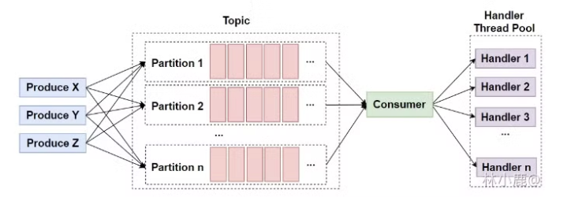

[TOC]

```
1 消息队列常见面试题
    1.1 为什么要使用消息队列？
    1.2 使用了消息队列会有什么缺点
    1.3 常见的消息队列对比
    1.4 如何保证消息队列的高可用？
    1.5 MQ常用协议
    1.6 MQ的通讯模式
    1.7 如何保证消息的顺序性？
    1.8 如何避免消息重复消费？
    1.9 大量消息在 MQ 里长时间积压，该如何解决？
    1.10 MQ 中的消息过期失效了怎么办？
    1.11 消息中间件如何做到高可用？
    1.12 如何保证数据一致性，事务消息如何实现？
    1.13 如何设计一个消息队列
    1.14 多线程异步和 MQ 的区别
2 RabbitMQ 常见面试题
    2.1 什么是 RabbitMQ
    2.2 RabbitMQ 的组件
    2.3 Exchange 交换机类型
    2.4 如何确保 MQ 可靠性? 消息不丢失？(重点!!!!)
    2.5 消息重复消费如何处理? (重点!!!)
    2.6 消费端如何进行限流
    2.7 什么是死信队列
    2.8 说说 pull 模式
    2.9 怎么设置消息的过期时间
    2.10 RabbitMQ 保证消息可靠传输
    2.11 RabbitMQ 如何实现延时发送(重点!!!)
    2.12 RabbitMQ 如何处理消息堆积(重点!!!)
    2.13 消息堆积为什么会导致cpu飙升呢？
    2.14 RabbitMQ中的交换器和队列如何绑定？绑定时可以设置哪些参数？
    2.15 RabbitMQ的镜像队列是什么？它的作用和实现原理是什么？
    2.16 RabbitMQ如何实现高可用性和故障转移？
    2.17 RabbitMQ 的消息分发机制
    2.18 由于消息积压导致过期被清理了怎么办 (重点!!!)
    2.19 如何保证消息的有序性(重点!!!)
    2.20 RabbitMQ 分布式
3 Kafka 常见面试题
    3.1 Kafka 有哪些特点
    3.2 请简述下你在哪些场景下会选择 Kafka
    3.3 Kafka 的设计架构你知道吗?
    3.4 Zookeeper 对于 Kafka 的作用是什么？
    3.5 Kafka分区的目的？
    3.6  Kafka 中的 ISR、AR 又代表什么？ISR 的伸缩又指什么？
    3.7 Kafka 中的 HW、LEO、LSO等分别代表什么？
    3.8  什么是Kafka Lag，怎么计算Kafka Lag ？
    3.9  Kafka 中的分区器、序列化器、拦截器是否了解？它们之间的处理顺序是什么？
    3.10 Kafka 生产者客户端的整体结构是什么样子的？
    3.11 消费者和消费者组有什么关系？
    3.12 消息队列模型知道吗?Kafka 是怎么做到支持这两种模型的？
    3.13 消费者是否可以消费指定分区消息？
    3.14 Kafka消费是采用Pull( 拉)模式，还是Push(推)模式？
    3.15 消费者提交消费位移时提交的是当前消费到的最新消息的 offset 还是 offset+1?
    3.16  Kafka 消费位移自动提交方式和手动提交方式了解多少？
    3.17 KafkaConsumer 是非线程安全的，那么怎么样实现多线程消费？
    3.18 Kafka 如何保证顺序消费(重要!!!)
    3.19 Kafka 为什么会重复消费? 如何保证不重复消费? (重要!!!)
    3.20 Kafka 如何防止消息丢失? (重要!!!)
    3.21 Kafka 的再均衡?
    3.22 Kafka 的消费流程？
    3.23 Kafka 分区数可以增加或减少吗？为什么？
    3.24 Kafka中每个分区的消息是有序的吗？每个主题呢？
    3.25 Kafka如何实现高性能IO？(重要!!!!)
    3.26 Kafka 如何保证一致性(重要!!!)
    3.27 Kafka 高效文件存储设计特点
    3.28 Kafka 创建 Topic 如何将分区放置到不同的 Broker 中
    3.29 谈一谈 Kafka 的再均衡
		3.30 Kafka 的缺点是什么
```


# 消息队列 MQ 知识点

本文知识点参考博客:

- https://topjavaer.cn/message-queue/mq.html
- [**RabbitMQ基础**](https://www.jianshu.com/p/79ca08116d57)
- [**RabbitMQ之消息持久化**](https://blog.csdn.net/u013256816/article/details/60875666)
- [**线上rabbitmq问题**](https://juejin.im/post/6844904088212094983#heading-0)


## 1 消息队列常见面试题

消息（Message）是指在应用间传送的数据。消息可以非常简单，比如只包含文本字符串，也可以更复杂，可能包含嵌入对象。

消息队列（Message Queue）是一种应用间的通信方式，消息发送后可以立即返回，由消息系统来确保消息的可靠传递。消息发布者只管把消息发布到 MQ 中而不用管谁来取，消息使用者只管从 MQ 中取消息而不管是谁发布的。这样发布者和使用者都不用知道对方的存在。

### 1.1 **为什么要使用消息队列？**

总结一下，主要三点原因：**解耦、异步、削峰**。

1. 解耦
   1. 直接访问的缺点: 用户下单后，订单系统需要通知库存系统，假如库存系统无法访问，则订单减库存将失败，从而导致订单操作失败。
   2. 使用消息队列的好处: 这个时候如果使用消息队列，可以返回给用户成功，先把消息持久化，等库存系统恢复后，就可以正常消费减去库存了。
2. 异步
   1. 将消息写入消息队列，非必要的业务逻辑以异步的方式运行，不影响主流程业务。
3. 削峰
   1. 消费端慢慢的按照数据库能处理的并发量，从消息队列中慢慢拉取消息。
   2. 在生产中，这个短暂的高峰期积压是允许的。比如秒杀活动，一般会因为流量过大，从而导致流量暴增，应用挂掉。这个时候加上消息队列，服务器接收到用户的请求后，首先写入消息队列，如果消息队列长度超过最大数量，则直接抛弃用户请求或跳转到错误页面。


### 1.2 **使用了消息队列会有什么缺点**

- 系统可用性降低。引入消息队列之后，如果消息队列挂了，可能会影响到业务系统的可用性。
- 系统复杂性增加。加入了消息队列，要多考虑很多方面的问题，比如：一致性问题、如何保证消息不被重复消费、如何保证消息可靠性传输等。
  - 面试常考: 一致性、重复消费、消息可靠性


### 1.3 **常见的消息队列对比**

| 对比方向 | 概要                                                         |
| -------- | ------------------------------------------------------------ |
| 吞吐量   | 万级的 ActiveMQ 和 RabbitMQ 的吞吐量（ActiveMQ 的性能最差）要比 十万级甚至是百万级的 RocketMQ 和 Kafka 低一个数量级。 |
| 可用性   | 都可以实现高可用。ActiveMQ 和 RabbitMQ 都是基于主从架构实现高可用性。RocketMQ 基于分布式架构。 kafka 也是分布式的，一个数据多个副本，少数机器宕机，不会丢失数据，不会导致不可用。 |
| 时效性   | RabbitMQ 基于 erlang 开发，所以并发能力很强，性能极其好，延时很低，达到微秒级。其他三个都是 ms 级。 |
| 功能支持 | 除了 Kafka，其他三个功能都较为完备。 Kafka 功能较为简单，主要支持简单的 MQ 功能，在大数据领域的实时计算以及日志采集被大规模使用，是事实上的标准。 |
| 消息丢失 | ActiveMQ 和 RabbitMQ 丢失的可能性非常低， RocketMQ 和 Kafka 理论上不会丢失。 |

总结:

- ActiveMQ 的社区算是比较成熟，但是较目前来说，ActiveMQ 的性能比较差，而且版本迭代很慢，不推荐使用。
- RabbitMQ 在吞吐量方面虽然稍逊于 Kafka 和 RocketMQ ，**但是由于它基于 erlang 开发，所以并发能力很强，性能极其好，延时很低，达到微秒级。**但是也因为 RabbitMQ 基于 erlang 开发，所以国内很少有公司有实力做 erlang 源码级别的研究和定制。如果业务场景对并发量要求不是太高（十万级、百万级），那这四种消息队列中，RabbitMQ 一定是你的首选。如果是大数据领域的实时计算、日志采集等场景，用 Kafka 是业内标准的，绝对没问题，社区活跃度很高，绝对不会黄，何况几乎是全世界这个领域的事实性规范。
- RocketMQ 阿里出品，Java 系开源项目，源代码我们可以直接阅读，然后可以定制自己公司的 MQ，并且 RocketMQ 有阿里巴巴的实际业务场景的实战考验。RocketMQ 社区活跃度相对较为一般，不过也还可以，文档相对来说简单一些，然后接口这块不是按照标准 JMS 规范走的有些系统要迁移需要修改大量代码。还有就是阿里出台的技术，你得做好这个技术万一被抛弃，社区黄掉的风险，那如果你们公司有技术实力我觉得用 RocketMQ 挺好的
- Kafka 的特点其实很明显，就是仅仅提供较少的核心功能，但是提供超高的吞吐量，ms 级的延迟，极高的可用性以及可靠性，而且分布式可以任意扩展。同时 kafka 最好是支撑较少的 topic 数量即可，保证其超高吞吐量。kafka 唯一的一点劣势是有可能消息重复消费，那么对数据准确性会造成极其轻微的影响，在大数据领域中以及日志采集中，这点轻微影响可以忽略这个特性天然适合大数据实时计算以及日志收集。


### 1.4 **如何保证消息队列的高可用？**

**RabbitMQ 高可用：镜像集群模式**

RabbitMQ 是基于主从做高可用性的，Rabbitmq有三种模式：单机模式、普通集群模式、镜像集群模式。单机模式一般在生产环境中很少用，普通集群模式只是提高了系统的吞吐量，让集群中多个节点来服务某个 Queue 的读写操作。那么真正实现 RabbitMQ 高可用的是镜像集群模式。

**镜像集群模式**跟普通集群模式不一样的是，创建的 Queue，无论元数据还是Queue 里的消息都会存在于多个实例上，然后每次你写消息到 Queue 的时候，都会自动和多个实例的 Queue 进行**消息同步**。这样设计，

- 好处在于：任何一个机器宕机不影响其他机器的使用。
- 坏处在于：
  - 1. 性能开销太大：消息同步所有机器，导致网络带宽压力和消耗很重；
  - 1. 扩展性差：如果某个 Queue 负载很重，即便加机器，新增的机器也包含了这个 Queue 的所有数据，并没有办法线性扩展你的 Queue。

**Kafka 高可用：partition 和 replica 机制**

Kafka 基本架构是多个 broker 组成，每个 broker 是一个节点。**创建一个 topic 可以划分为多个 partition，每个 partition 可以存在于不同的 broker 上**，每个 partition 就放一部分数据，这就是天然的分布式消息队列。就是说一个 topic 的数据，是分散放在多个机器上的，每个机器就放一部分数据。

Kafka 0.8 以前，是没有 HA 机制的，任何一个 broker 宕机了，它的 partition 就没法写也没法读了，没有什么高可用性可言。

Kafka 0.8 以后，提供了 HA 机制，就是 replica 副本机制。**每个 partition 的数据都会同步到其他机器上，形成自己的多个 replica 副本**。然后所有 replica 会选举一个 leader 出来，生产和消费都跟这个 leader 打交道，然后其他 replica 就是 follower。写的时候，leader 会负责把数据同步到所有 follower 上去，读的时候就直接读 leader 上数据即可。Kafka 会均匀的将一个 partition 的所有 replica 分布在不同的机器上，这样才可以提高容错性。


### 1.5 **MQ常用协议**

**AMQP协议**

- AMQP即Advanced Message Queuing Protocol,一个提供统一消息服务的应用层标准高级消息队列协议,是应用层协议的一个开放标准,为面向消息的中间件设计。基于此协议的客户端与消息中间件可传递消息，并不受客户端/中间件不同产品，不同开发语言等条件的限制
- 优点：可靠、通用

**MQTT协议**

- MQTT（Message Queuing Telemetry Transport，消息队列遥测传输）是IBM开发的一个即时通讯协议，有可能成为物联网的重要组成部分。该协议支持所有平台，几乎可以把所有联网物品和外部连接起来，被用来当做传感器和致动器（比如通过Twitter让房屋联网）的通信协议。
- 优点：格式简洁、占用带宽小、移动端通信、PUSH、嵌入式系统

**STOMP协议**

- STOMP（Streaming Text Orientated Message Protocol）是流文本定向消息协议，是一种为MOM(Message Oriented Middleware，面向消息的中间件)设计的简单文本协议。STOMP提供一个可互操作的连接格式，允许客户端与任意STOMP消息代理（Broker）进行交互。
- 优点：命令模式（非topic/queue模式）

**XMPP协议**

- XMPP（可扩展消息处理现场协议，Extensible Messaging and Presence Protocol）是基于可扩展标记语言（XML）的协议，多用于即时消息（IM）以及在线现场探测。适用于服务器之间的准即时操作。核心是基于XML流传输，这个协议可能最终允许因特网用户向因特网上的其他任何人发送即时消息，即使其操作系统和浏览器不同。
- 优点：通用公开、兼容性强、可扩展、安全性高，但XML编码格式占用带宽大

**其他基于TCP/IP自定义的协议**

- 有些特殊框架（如：redis、kafka、zeroMq等）根据自身需要未严格遵循MQ规范，而是基于TCP\IP自行封装了一套协议，通过网络socket接口进行传输，实现了MQ的功能。


### 1.6 **MQ的通讯模式**

1. **点对点通讯：**
   1. 点对点方式是最为传统和常见的通讯方式，它支持一对一、一对多、多对多、多对一等多种配置方式，支持树状、网状等多种拓扑结构。
2. **多点广播**：
   1. MQ适用于不同类型的应用。其中重要的，也是正在发展中的是"多点广播"应用，即能够将消息发送到多个目标站点(Destination List)。可以使用一条MQ指令将单一消息发送到多个目标站点，并确保为每一站点可靠地提供信息。
   2. MQ不仅提供了多点广播的功能，而且还拥有智能消息分发功能，在将一条消息发送到同一系统上的多个用户时，MQ将消息的一个复制版本和该系统上接收者的名单发送到目标MQ系统。目标MQ系统在本地复制这些消息，并将它们发送到名单上的队列，从而尽可能减少网络的传输量。
3. **发布/订阅(Publish/Subscribe)模式：**
   1. 发布/订阅功能使消息的分发可以突破目的队列地理指向的限制，使消息按照特定的主题甚至内容进行分发，用户或应用程序可以根据主题或内容接收到所需要的消息。
   2. 发布/订阅功能使得发送者和接收者之间的耦合关系变得更为松散，发送者不必关心接收者的目的地址，而接收者也不必关心消息的发送地址，而只是根据消息的主题进行消息的收发。
   3. 在MQ家族产品中，MQ Event Broker是专门用于使用发布/订阅技术进行数据通讯的产品，它支持基于队列和直接基于TCP/IP两种方式的发布和订阅。
4. **集群(Cluster)：**
   1. 为了**简化点对点通讯模式中的系统配置**，MQ提供 Cluster 的解决方案。集群类似于一个 域(Domain) ，集群内部的队列管理器之间通讯时，**不需要两两之间建立消息通道**，而是采用 Cluster 通道与其它成员通讯，从而大大简化了系统配置。
   2. 此外，集群中的队列管理器之间能够自动进行负载均衡，当某一队列管理器出现故障时，其它队列管理器可以接管它的工作，从而大大提高系统的高可靠性


### 1.7 **如何保证消息的顺序性？**

**RabbitMQ**

拆分多个 Queue，**每个 Queue一个 Consumer**；或者就一个 Queue 但是对应一个 Consumer，然后这个 Consumer 内部用内存队列做排队，然后分发给底层不同的 Worker 来处理。

**Kafka**

1. 一个 Topic，一个 Partition，一个 Consumer，内部单线程消费，单线程吞吐量太低，一般不会用这个。
2. 写 N 个内存 Queue，**具有相同 key 的数据都到同一个内存 Queue**；然后对于 N 个线程，每个线程分别消费一个内存 Queue 即可，这样就能保证顺序性。

> Kafka 将消息分配到不同的 Partition 可以基于 Key 来实现顺序性。具体来说，当你发送消息到 Kafka 时，你可以**指定一个 Key（通常是消息的某个属性）**，Kafka 会使用这个 Key 通过分区器（Partitioner）来决定将消息写入哪个 Partition。如果消息具有相同的 Key，Kafka 会确保这些消息被写入到同一个 Partition，从而在这个 Partition 内能够保持消息的顺序。
>
> 为了确保处理过程中的顺序性，可以采取以下几种策略：
>
> - **消息键（Key）**：通过消息的 Key 保证相关消息进入同一个 Partition，从而在 Partition 内维持顺序。
> - **处理逻辑**：在 Consumer 端的处理逻辑中，确保消息的处理是顺序的，避免乱序处理。


### 1.8 **如何避免消息重复消费？**

1. 生产:
   + 在消息生产时，MQ内部针对每条生产者**发送的消息生成一个唯一id，作为去重和幂等**的依据（消息投递失败并重传），避免重复的消息进入队列。
2. 消费:
   + 在消息消费时，**要求消息体中也要有一全局唯一id**作为去重和幂等的依据，避免同一条消息被重复消费。


### 1.9 **大量消息在 MQ 里长时间积压，该如何解决？**

一般这个时候，只能临时**紧急扩容**了，具体操作步骤和思路如下：

1. 先修复 consumer 的问题，确保其恢复消费速度，然后将现有 consumer 都停掉；
2. 新建一个 topic，partition 是原来的 10 倍，临时建立好原先 10 倍的 queue 数量；
3. 然后**写一个临时的分发数据的 consumer 程序**，这个程序部署上去消费积压的数据，消费之后不做耗时的处理，直接均匀轮询写入临时建立好的 10 倍数量的 queue；
4. 接着**临时用 10 倍的机器来部署 consumer，每一批 consumer 消费一个临时 queue 的数据**。这种做法相当于是临时将 queue 资源和 consumer 资源扩大 10 倍，以正常的 10 倍速度来消费数据；
5. 等快速消费完积压数据之后，得恢复原先部署的架构，重新用原先的 consumer 机器来消费消息。


### 1.10 **MQ 中的消息过期失效了怎么办？**

如果使用的是RabbitMQ的话，RabbtiMQ 是可以设置过期时间的（TTL）。**如果消息在 Queue 中积压超过一定的时间就会被 RabbitMQ 给清理掉，这个数据就没了**。这时的问题就不是数据会大量积压在 MQ 里，而是大量的数据会直接搞丢。这个情况下，就不是说要增加 Consumer 消费积压的消息，因为实际上没啥积压，而是丢了大量的消息。

我们可以采取一个方案，就是批量重导:

1. 就是大量积压的时候，直接将数据写到数据库;
2. 等过了高峰期以后将这批数据一点一点的查出来，然后重新灌入 MQ 里面去，把丢的数据给补回来。


### 1.11 **消息中间件如何做到高可用？**

以Kafka为例。

**Kafka 的基础集群架构，由多个broker组成，每个broker都是一个节点。**

- 当你创建一个topic时，它可以划分为多个partition，而每个partition放一部分数据，分别存在于不同的 broker 上。
- 也就是说，一个 topic 的数据，是分散放在多个机器上的，每个机器就放一部分数据。

每个partition放一部分数据，如果对应的broker挂了，那这部分数据是不是就丢失了？**那不是保证不了高可用吗？**

- Kafka 0.8 之后，提供了复制多副本机制来保证高可用，即每个 partition 的数据都会同步到其它机器上，形成多个副本。
- 然后所有的副本会选举一个 leader 出来，让leader去跟生产和消费者打交道，其他副本都是follower。
- 写数据时，leader 负责把数据同步给所有的follower，读消息时，直接读 leader 上的数据即可。
- 如何保证高可用的？就是假设某个 broker 宕机，这个broker上的partition 在其他机器上都有副本的。如果挂的是leader的broker呢？其他follower会重新选一个leader出来


### 1.12 **如何保证数据一致性，事务消息如何实现？**


**一条普通的MQ消息，从产生到被消费，大概流程如下：**

1. 生产者产生消息，发送带MQ服务器
2. MQ收到消息后，将消息持久化到存储系统。
3. MQ服务器返回ACk到生产者。
4. MQ服务器把消息push给消费者
5. 消费者消费完消息，响应ACK
6. MQ服务器收到ACK，认为消息消费成功，即在存储中删除消息。

举个下订单的例子吧。订单系统创建完订单后，再发送消息给下游系统。如果订单创建成功，然后消息没有成功发送出去，下游系统就无法感知这个事情，出导致数据不一致。 如何保证数据一致性呢？**可以使用事务消息。一起来看下事务消息是如何实现的吧。**


1. 生产者产生消息，发送一条半事务消息到MQ服务器
2. MQ收到消息后，将消息持久化到存储系统，这条消息的状态是待发送状态。
3. MQ服务器返回ACK确认到生产者，此时MQ不会触发消息推送事件
4. 生产者执行本地事务
5. **如果本地事务执行成功，即commit执行结果到MQ服务器；如果执行失败，发送rollback。**
6. 如果是正常的commit，MQ服务器更新消息状态为可发送；如果是rollback，即删除消息。
7. 如果消息状态更新为可发送，则MQ服务器会push消息给消费者。消费者消费完就回ACK。
8. 如果MQ服务器长时间没有收到生产者的commit或者rollback，它会反查生产者，然后根据查询到的结果执行最终状态。


### 1.13 如何设计一个消息队列

首先是消息队列的整体流程:

1. producer发送消息给broker
2. broker存储好，broker再发送给consumer消费
3. consumer回复消费确认等。

**对于详细的框架结果:**

1. RPC 框架: producer发送消息给broker，broker发消息给consumer消费，那就需要两次RPC了，RPC如何设计呢？可以参考开源框架Dubbo，你可以说说服务发现、序列化协议等等
2. 持久化机制: broker考虑如何持久化呢，是放文件系统还是数据库呢，会不会消息堆积呢，消息堆积如何处理呢。
3. 消费方式: 消费关系如何保存呢？ 点对点还是广播方式呢？广播关系又是如何维护呢？zk还是config server
4. 消息可靠性: 消息可靠性如何保证呢？如果消息重复了，如何幂等处理呢？
5. 消息队列高可用: 消息队列的高可用如何设计呢？ 可以参考Kafka的高可用保障机制。多副本 -> leader & follower -> broker 挂了重新选举 leader 即可对外服务。
6. 消息补偿机制: 消息事务特性，与本地业务同个事务，本地消息落库;消息投递到服务端，本地才删除；定时任务扫描本地消息库，补偿发送。
7. 伸缩性和可扩展性: 如果消息积压或者资源不够时，如何支持快速扩容，提高吞吐？可以参照一下 Kafka 的设计理念，broker -> topic -> partition，每个 partition 放一个机器，就存一部分数据。如果现在资源不够了，简单啊，给 topic 增加 partition，然后做数据迁移，增加机器，不就可以存放更多数据，提供更高的吞吐量了吗。


### 1.14 多线程异步和 MQ 的区别

- CPU消耗。多线程异步可能存在CPU竞争，而MQ不会消耗本机的CPU。
- MQ 方式实现异步是完全解耦的，适合于大型互联网项目。
- 削峰或者消息堆积能力。当业务系统处于高并发，MQ可以将消息堆积在Broker实例中，而多线程会创建大量线程，甚至触发拒绝策略。
- 使用MQ引入了中间件，增加了项目复杂度和运维难度。

总的来说，规模比较小的项目可以使用多线程实现异步，大项目建议使用MQ实现异步。


## 2 RabbitMQ 常见面试题

### 2.1 什么是  RabbitMQ

RabbitMQ是一个由erlang开发的消息队列。消息队列用于应用间的异步协作。

对于一些不需要立即生效的操作，可以拆分出来，异步执行，使用消息队列实现。

以常见的订单系统为例，用户点击下单按钮之后的业务逻辑可能包括：扣减库存、生成相应单据、发短信通知。这种场景下就可以用 MQ 。将短信通知放到 MQ 异步执行，在下单的主流程（比如扣减库存、生成相应单据）完成之后发送一条消息到 MQ， 让主流程快速完结，而由另外的线程消费MQ的消息。


所有 MQ 产品从模型抽象上来说都是一样的过程：

消费者（consumer）订阅某个队列。生产者（producer）创建消息，然后发布到队列（queue）中，最后将消息发送到监听的消费者。


### 2.2 RabbitMQ 的组件

**Rabbit 架构核心组件**

RabbitMQ的核心组件包括：

1. 生产者（Producer）： 生产者是发送消息到RabbitMQ的应用程序。
2. 消费者（Consumer）： 消费者是接收RabbitMQ消息的应用程序。
3. 交换器（Exchange）： 它负责接收生产者发送的消息并将其路由到一个或多个队列。
4. 队列（Queue）： 存储消息直到它们被消费或过期。
5. 绑定（Binding）： 用于连接交换器和队列的规则。

**Rabbit 架构详细组件**

上面只是最简单抽象的描述，具体到 RabbitMQ 则有更详细的概念需要解释。上面介绍过 RabbitMQ 是 AMQP 协议的一个开源实现，所以其内部实际上也是 AMQP 中的基本概念：

1. Message: 消息，消息是不具名的，它由消息头和消息体组成。消息体是不透明的，而消息头则由一系列的可选属性组成，这些属性包括routing-key（路由键）、priority（相对于其他消息的优先权）、delivery-mode（指出该消息可能需要持久性存储）等。
2. Publisher: 消息的生产者，也是一个向交换器发布消息的客户端应用程序。
3. Exchange: 交换器，用来接收生产者发送的消息并将这些消息路由给服务器中的队列。
4. Binding: 绑定，**用于消息队列和交换器之间的关联**。一个绑定就是基于路由键将交换器和消息队列连接起来的路由规则，所以可以将交换器理解成一个由绑定构成的路由表。
5. Queue: 消息队列，用来保存消息直到发送给消费者。它是消息的容器，也是消息的终点。一个消息可投入一个或多个队列。消息一直在队列里面，等待消费者连接到这个队列将其取走
6. Connection: 网络连接，比如一个TCP连接。
7. Channel: 信道，多路复用连接中的一条独立的双向数据流通道。信道是建立在真实的TCP连接内地虚拟连接，AMQP 命令都是通过信道发出去的，**不管是发布消息、订阅队列还是接收消息，这些动作都是通过信道完成**。因为对于操作系统来说建立和销毁 TCP 都是非常昂贵的开销，所以引入了信道的概念，以复用一条 TCP 连接。
8. Consumer: 消息的消费者，表示一个从消息队列中取得消息的客户端应用程序。
9. Virtual Host: 虚拟主机，表示一批交换器、消息队列和相关对象。虚拟主机是共享相同的身份认证和加密环境的独立服务器域。每个 vhost 本质上就是一个 mini 版的 RabbitMQ 服务器，拥有自己的队列、交换器、绑定和权限机制。vhost 是 AMQP 概念的基础，必须在连接时指定，RabbitMQ 默认的 vhost 是 / 。
10. Broker: 表示消息队列服务器实体。


### 2.3 Exchange 交换机类型

Exchange分发消息时根据类型的不同分发策略不同，目前共四种类型：direct、fanout、topic、headers 。**headers 模式根据消息的headers进行路由，此外 headers 交换器和 direct 交换器完全一致，但性能差很多。**Exchange规则:

| 类型名称 | 类型描述                                                     | 简述                            |
| -------- | ------------------------------------------------------------ | ------------------------------- |
| fanout   | 把所有发送到该Exchange的消息路由到所有与它绑定的Queue中      | 广播，发送到所有绑定的队列      |
| direct   | Routing Key==Binding Key                                     | 点对点，根据routing key精确匹配 |
| topic    | 模糊匹配                                                     | 主题，根据routing key的模式匹配 |
| headers  | Exchange不依赖于routing key与binding key的匹配规则来路由消息，而是根据发送的消息内容中的header属性进行匹配。 | 根据消息头的键值对匹配          |

- direct: direct交换机会将消息路由到**binding key 和 routing key完全匹配的队列中**。它是完全匹配、单播的模式。
- fanout: 所有发到 fanout 类型交换机的消息都会路由到所有与该交换机绑定的队列上去。fanout 类型转发消息是最快的。


- topic: **topic交换机使用routing key和binding key进行模糊匹配**，匹配成功则将消息发送到相应的队列。routing key和binding key都是句点号“. ”分隔的字符串，binding key中可以存在两种特殊字符“*”与“##”，用于做模糊匹配，其中“*”用于匹配一个单词，“##”用于匹配多个单词。

  

- headers: headers交换机是根据发送的消息内容中的headers属性进行路由的。在绑定Queue与Exchange时指定一组键值对；当消息发送到Exchange时，RabbitMQ会取到该消息的headers（也是一个键值对的形式），对比其中的键值对是否完全匹配Queue与Exchange绑定时指定的键值对；如果完全匹配则消息会路由到该Queue，否则不会路由到该Queue。


### 2.4 **如何确保 MQ 可靠性? 消息不丢失？(重点!!!!)**

要保证消息，就是保证三个环节都不能丢失数据

**消息丢失场景：**

- **生产者生产消息到RabbitMQ Server消息丢失**
- **RabbitMQ Server存储的消息丢失**
- **RabbitMQ Server到消费者消息丢失**


消息丢失从三个方面来解决：生产者确认机制、消费者手动确认消息和持久化。

**防止消息丢失 - 步骤1 - 生产者确认机制**

生产者发送消息到队列，无法确保发送的消息成功的到达server。

解决方法：

1. 事务机制。在一条消息发送之后会使发送端阻塞，等待RabbitMQ的回应，之后才能继续发送下一条消息。性能差。
2. 开启生产者确认机制，只要消息成功发送到交换机之后，RabbitMQ就会发送一个**ack**给生产者（即使消息没有Queue接收，也会发送ack）。如果消息没有成功发送到交换机，就会发送一条**nack**消息，提示发送失败。

在 Springboot 是通过 publisher-confirms 参数来设置 confirm 模式：

```java
spring:
    rabbitmq:   
        ##开启 confirm 确认机制
        publisher-confirms: true
```

在生产端提供一个回调方法，当服务端确认了一条或者多条消息后，生产者会回调这个方法，根据具体的结果对消息进行后续处理，比如重新发送、记录日志等。

```java
// 消息是否成功发送到Exchange
final RabbitTemplate.ConfirmCallback confirmCallback = (CorrelationData correlationData, boolean ack, String cause) -> {
            log.info("correlationData: " + correlationData);
            log.info("ack: " + ack);
            if(!ack) {
                log.info("异常处理....");
            }
    };

rabbitTemplate.setConfirmCallback(confirmCallback);
```

**防止消息丢失 - 步骤2 - 路由不可达消息**

生产者确认机制只确保消息正确到达交换机，对于从交换机路由到Queue失败的消息，会被丢弃掉，导致消息丢失。对于不可路由的消息，有两种处理方式：Return消息机制和备份交换机。

- **Return 消息机制:** Return消息机制提供了回调函数 ReturnCallback，当消息从交换机路由到Queue失败才会回调这个方法。需要将mandatory 设置为 true ，才能监听到路由不可达的消息。

```java
spring:
    rabbitmq:
        ##触发ReturnCallback必须设置mandatory=true, 否则Exchange没有找到Queue就会丢弃掉消息, 而不会触发ReturnCallback
        template.mandatory: true
```

通过 ReturnCallback 监听路由不可达消息。

```java
final RabbitTemplate.ReturnCallback returnCallback = (Message message, int replyCode, String replyText, String exchange, String routingKey) ->
            log.info("return exchange: " + exchange + ", routingKey: "
                    + routingKey + ", replyCode: " + replyCode + ", replyText: " + replyText);
rabbitTemplate.setReturnCallback(returnCallback);
```

当消息从交换机路由到Queue失败时，会返回 return exchange: , routingKey: MAIL, replyCode: 312, replyText: NO_ROUTE。

- **备份交换机:** 备份交换机alternate-exchange 是一个普通的exchange，当你发送消息到对应的exchange时，没有匹配到queue，就会自动转移到备份交换机对应的queue，这样消息就不会丢失。

**防止消息丢失 - 步骤3 - 消费者手动确认消息**

有可能消费者收到消息还没来得及处理MQ服务就宕机了，导致消息丢失。因为消息者默认采用自动ack，一旦消费者收到消息后会通知MQ Server这条消息已经处理好了，MQ 就会移除这条消息。

解决方法：

1. 消费者设置为手动确认消息。消费者处理完逻辑之后再给broker回复ack，表示消息已经成功消费，可以从broker中删除。
2. 当消息者消费失败的时候，给broker回复nack，根据配置决定重新入队还是从broker移除，或者进入死信队列。
3. 只要没收到消费者的 acknowledgment，broker 就会一直保存着这条消息，但不会 requeue，也不会分配给其他消费者。

消费者手动设置 ack:

```java
##设置消费端手动 ack
spring.rabbitmq.listener.simple.acknowledge-mode=manual
```

消息处理完之后, 手动确认:

```java
@RabbitListener(queues = RabbitMqConfig.MAIL_QUEUE)
    public void onMessage(Message message, Channel channel) throws IOException {

        try {
            Thread.sleep(5000);
        } catch (InterruptedException e) {
            e.printStackTrace();
        }
        long deliveryTag = message.getMessageProperties().getDeliveryTag();
        //手工ack；第二个参数是multiple，设置为true，表示deliveryTag序列号之前（包括自身）的消息都已经收到，设为false则表示收到一条消息
        channel.basicAck(deliveryTag, true);
        System.out.println("mail listener receive: " + new String(message.getBody()));
    }
```

当消息消费失败时，消费端给broker回复nack，如果consumer设置了requeue为false，则nack后broker会删除消息或者进入死信队列，否则消息会重新入队。

**防止消息丢失 - 步骤4 - 持久化机制 - 保证持久化**

如果RabbitMQ服务异常导致重启，将会导致消息丢失。RabbitMQ提供了持久化的机制，将内存中的消息持久化到硬盘上，即使重启RabbitMQ，消息也不会丢失。

消息持久化需要满足以下条件：

1. 消息设置持久化。发布消息前，设置投递模式delivery mode为2，表示消息需要持久化。
2. Queue设置持久化。
3. 交换机设置持久化。

**当发布一条消息到交换机上时，Rabbit会先把消息写入持久化日志，然后才向生产者发送响应。**一旦从队列中消费了一条消息的话并且做了确认，RabbitMQ会在持久化日志中移除这条消息。在消费消息前，如果RabbitMQ重启的话，服务器会自动重建交换机和队列，加载持久化日志中的消息到相应的队列或者交换机上，保证消息不会丢失。

**镜像队列 - 保证高可用**

当MQ发生故障时，会导致服务不可用。引入RabbitMQ的镜像队列机制，**将queue镜像到集群中其他的节点之上**。如果集群中的一个节点失效了，能自动地切换到镜像中的另一个节点以保证服务的可用性。

通常每一个镜像队列都包含一个master和多个slave，分别对应于不同的节点。

1. publish: 发送到镜像队列的所有消息总是被直接发送到master和所有的slave之上。
2. **除了publish外所有动作都只会向master发送**，然后由master将命令执行的结果广播给slave，从镜像队列中的消费操作实际上是在master上执行的。


### 2.5 消息重复消费如何处理? (重点!!!)

**消息重复的原因有两个：**

1. **生产时消息重复:** 生产者发送消息给MQ，在MQ确认的时候出现了网络波动，生产者没有收到确认，这时候生产者就会重新发送这条消息，导致MQ会接收到重复消息。
2. **消费时消息重复:** 消费者消费成功后，给MQ确认的时候出现了网络波动，MQ没有接收到确认，为了保证消息不丢失，MQ就会继续给消费者投递之前的消息。这时候消费者就接收到了两条一样的消息。由于重复消息是由于网络原因造成的，无法避免。

解决方法：发送消息时让每个消息携带一个**全局的唯一ID**，在消费消息时先判断消息是否已经被消费过，保证消息消费逻辑的幂等性。

**解决方案 - 引入数据库或者 redis:**

- 数据库唯一主键去重：主键是不能冲突的，重复的数据无法插入
- 引入Redis解决重复消费问题
  - 利用Redis，首先系统生成全局唯一的 id，用set操作放入Redis中
  - 如订单信息id，消费后存储在Redis中，如果下次再来，先查看Redis中是否存在
  - 如果存在，即此消息已经被消费过（后续不做消费处理）
  - 如果不存在，即未消费，此时再将此id存入Redis中，进行后续的逻辑操作

具体消费过程为：

1. 消费者获取到消息后先根据id去查询redis/db是否存在该消息
2. 如果不存在，则正常消费，消费完毕后写入redis/db
3. 如果存在，则证明消息被消费过，直接丢弃


### 2.6 消费端如何进行限流

当 RabbitMQ 服务器积压大量消息时，队列里的消息会大量涌入消费端，可能导致消费端服务器奔溃。这种情况下需要对消费端限流。

**Spring RabbitMQ 提供参数 prefetch 可以设置单个请求处理的消息个数**。如果消费者同时处理的消息到达最大值的时候，则该消费者会阻塞，不会消费新的消息，直到有消息 ack 才会消费新的消息。

开启消费端限流：

```java
##在单个请求中处理的消息个数，unack的最大数量
spring.rabbitmq.listener.simple.prefetch=2
```

原生 RabbitMQ 还提供 prefetchSize 和 global 两个参数。Spring RabbitMQ没有这两个参数。

```java
//单条消息大小限制，0代表不限制
//global：限制限流功能是channel级别的还是consumer级别。当设置为false，consumer级别，限流功能生效，设置为true没有了限流功能，因为channel级别尚未实现。
void basicQos(int prefetchSize, int prefetchCount, boolean global) throws IOException;
```


### 2.7 什么是死信队列

死信队列用于存储无法被正常消费或路由的消息。死信队列用于异常监控和消息审计，可以帮助开发者追踪无法处理的消息，并采取相应的补救措施。

**消费失败的消息存放在死信队列**。消息消费失败的原因：

- 消息被拒绝并且消息没有重新入队（requeue=false）
- 消息超时未消费
- 达到最大队列长度

设置死信队列的 exchange 和 queue，然后进行绑定：

```java
@Bean
public DirectExchange dlxExchange() {
    return new DirectExchange(RabbitMqConfig.DLX_EXCHANGE);
}

@Bean
public Queue dlxQueue() {
    return new Queue(RabbitMqConfig.DLX_QUEUE, true);
}

@Bean
public Binding bindingDeadExchange(Queue dlxQueue, DirectExchange deadExchange) {
    return BindingBuilder.bind(dlxQueue).to(deadExchange).with(RabbitMqConfig.DLX_QUEUE);
}
```

在普通队列加上两个参数，绑定普通队列到死信队列。当消息消费失败时，消息会被路由到死信队列。

```java
@Bean
public Queue sendSmsQueue() {
    Map<String,Object> arguments = new HashMap<>(2);
    // 绑定该队列到私信交换机
    arguments.put("x-dead-letter-exchange", RabbitMqConfig.DLX_EXCHANGE);
    arguments.put("x-dead-letter-routing-key", RabbitMqConfig.DLX_QUEUE);
    return new Queue(RabbitMqConfig.MAIL_QUEUE, true, false, false, arguments);
}
```

生产者完整代码：

```java
@Component
@Slf4j
public class MQProducer {

    @Autowired
    RabbitTemplate rabbitTemplate;

    @Autowired
    RandomUtil randomUtil;

    @Autowired
    UserService userService;

    final RabbitTemplate.ConfirmCallback confirmCallback = (CorrelationData correlationData, boolean ack, String cause) -> {
            log.info("correlationData: " + correlationData);
            log.info("ack: " + ack);
            if(!ack) {
                log.info("异常处理....");
            }
    };

    final RabbitTemplate.ReturnCallback returnCallback = (Message message, int replyCode, String replyText, String exchange, String routingKey) ->
            log.info("return exchange: " + exchange + ", routingKey: "
                    + routingKey + ", replyCode: " + replyCode + ", replyText: " + replyText);

    public void sendMail(String mail) {
        //貌似线程不安全 范围100000 - 999999
        Integer random = randomUtil.nextInt(100000, 999999);
        Map<String, String> map = new HashMap<>(2);
        String code = random.toString();
        map.put("mail", mail);
        map.put("code", code);

        MessageProperties mp = new MessageProperties();
        //在生产环境中这里不用Message，而是使用 fastJson 等工具将对象转换为 json 格式发送
        Message msg = new Message("tyson".getBytes(), mp);
        msg.getMessageProperties().setExpiration("3000");
        //如果消费端要设置为手工 ACK ，那么生产端发送消息的时候一定发送 correlationData ，并且全局唯一，用以唯一标识消息。
        CorrelationData correlationData = new CorrelationData("1234567890"+new Date());

        rabbitTemplate.setMandatory(true);
        rabbitTemplate.setConfirmCallback(confirmCallback);
        rabbitTemplate.setReturnCallback(returnCallback);
        rabbitTemplate.convertAndSend(RabbitMqConfig.MAIL_QUEUE, msg, correlationData);

        //存入redis
        userService.updateMailSendState(mail, code, MailConfig.MAIL_STATE_WAIT);
    }
}
```

消费者完整代码：

```java
@Slf4j
@Component
public class DeadListener {

    @RabbitListener(queues = RabbitMqConfig.DLX_QUEUE)
    public void onMessage(Message message, Channel channel) throws IOException {

        try {
            Thread.sleep(5000);
        } catch (InterruptedException e) {
            e.printStackTrace();
        }
        long deliveryTag = message.getMessageProperties().getDeliveryTag();
        //手工ack
        channel.basicAck(deliveryTag,false);
        System.out.println("receive--1: " + new String(message.getBody()));
    }
}
```

当普通队列中有死信时，RabbitMQ 就会自动的将这个消息重新发布到设置的死信交换机去，然后被路由到死信队列。**可以监听死信队列中的消息做相应的处理**。


### 2.8 说说 pull 模式

pull模式主要是通过channel.basicGet方法来获取消息，示例代码如下：

```java
GetResponse response = channel.basicGet(QUEUE_NAME, false);
System.out.println(new String(response.getBody()));
channel.basicAck(response.getEnvelope().getDeliveryTag(),false);
```


### 2.9 怎么设置消息的过期时间

在生产端发送消息的时候可以给消息设置过期时间，单位为毫秒(ms)

```java
Message msg = new Message("tyson".getBytes(), mp);
msg.getMessageProperties().setExpiration("3000");
```

也可以在创建队列的时候指定队列的ttl，从消息入队列开始计算，超过该时间的消息将会被移除。


### 2.10 RabbitMQ 保证消息可靠传输

RabbitMQ保证消息可靠传输的机制：

1. 消息确认机制（Acknowledgments）： 消费者处理完消息后发送ACK信号。
2. 持久化（Persistence）： 将消息和队列设置为持久化，防止服务器重启时消息丢失。
3. 事务支持： RabbitMQ支持事务，确保消息的原子性处理。


### 2.11 RabbitMQ 如何实现延时发送(重点!!!)

参考: https://blog.csdn.net/u014401141/article/details/130248529

延迟队列，即消息进入队列后不会立即被消费，只有到达指定时间后，才会被消费。需求：

- 下单后，30分钟未支付，取消订单，回滚库存。
- 新用户注册成功7天后，发送短信问候。

在RabbitMQ中并未提供延迟队列功能。但是可以使用：TTL+死信队列 组合实现延迟队列的效果。

RabbitMQ实现消息延迟发送的方法：

**1.死信交换器（DLX）和TTL（Time-To-Live）： 设置消息的TTL，过期后路由到DLX。**

简述：

- 使用两个队列，一个队列接收消息不消费，等待指定时间后消息死亡
  - 队列设置：x-message-ttl=60000 （队列中所有消息都只有60s存活时间）
  - 指定消息设置：expire=60000 指定消息只有60s存活时间
  - 如果队列和消息同时设置了ttl，则取较小的那个作为ttl, 消息死亡后不会被消费者消费。
- 再由该队列绑定的死信exchange再次将其路由到另一个队列提供业务消费, 死信队列存放什么信息:
  - 消费者使用 basic.reject 或 basic.nack 并将requeue参数设置为 false 来否定的消息
  - ttl到期的消息
  - 队列超过长度限制被丢弃的消息

当一个队列设置了死信exchange 后，这个队列的死信都会被投递到死信exchange中，然后可以再次路由到其他队列中（如果指定了死信routing key 则死信消息routing key 变为设置的routing key，未设置则为原始 routing key）。


如上图所示, 具体的使用和执行流程如下:

1. 先声明一个消费队列 queue_dlx，用来接收死信消息，并提供消费；
2. 然后声明一个死信 exchange_dlx, 绑定 queue_dlx，接收消息后路由至queue_dlx；
3. 声明一个延迟队列，queue_delay, 用来接收业务消息，但不提供消费，等待消息死亡后转至死信exchange。（即延迟）声明一个exchange，由业务发送消息到exchange，然后转至queue_delay。

缺点：

- 只能支持固定延迟等级的消息
- 使用较复杂，得声明一堆队列&exchange
- 一个致命的问题就是消息顺序，不会按照延迟时间的先后顺序输出，而是按照queue本身先进先出的规则。即10秒延迟的消息如果是在20秒延迟消息后扔入的，那么也要等20秒延迟的消息输出后才能输出。除非消息的延迟时间是一致的否则无法满足业务要求

优点：

- 支持镜像队列复制，实现高可用
- 支持大量消息（成千上万）
- 适用场景： 使用固定延迟时间的场景。

**2.插件： 使用RabbitMQ提供的延迟消息插件。**

RabbitMQ 提供的延迟消息插件如下:

1. 延时消息不直接投递到队列中，而是先转储到本地Mnesia数据库中，然后定时器在消息到期后再将其投递到队列中。
2. 其大概原理就是：指定了延时的消息，会被先保存在 Mnesia （erlang编写的数据库管理系统）中，然后有一个定时器去查询最近需要被投递的消息，将其投递到目标队列中。

优点:

- 基本支持任意延迟时间（最大延迟时间不应超过 24.8 天）
- 使用 rabbitmq 的延迟插件时，可以设置延迟的最大时间。但是，该最大时间会受到 rabbitmq 版本、erlang vm 版本以及操作系统等因素的影响。这是由于 erlang vm 定时器精度和 rabbitmq 的实现限制所导致的。对具体实现来说，还需要考虑消息数量、消息大小和队列容量等因素，以确保系统性能和可靠性。
- 如果需要发送长时间的延迟消息，可以使用缩短延迟时间的方法来实现，例如将一个延迟很长的消息分拆成多个延迟较短的子消息，在消息附加属性中指定分片信息，同时接收方在收到所有分片信息后再合并消息。

缺点:

- 延时不可靠，存在消息数量较大或使用很久后延迟不准确（会推迟）， 无备份机制，延时消息存在单个节点磁盘中,不支持ram类型的节点 （数据得存磁盘里面）增加大量内存的占用 （经测试发现，发送大量延时消息后，rabbitmq内存占用明显增高，比普通消息还要高很多那种。
- RabbitTransactionManager 会导致spring事务也无效，可能多数据源的问题


### 2.12 RabbitMQ 如何处理消息堆积(重点!!!)

参考: https://cloud.tencent.com/developer/article/2377506

导致消息积压突然增加，最粗粒度的原因，只有两种：

- 要么是发送变快了
- 要么是消费变慢了。

要解决积压的问题：

- 可以通过 扩容消费端的实例数来提升总体的消费能力。
- 如果短时间内没有足够的服务器资源进行扩容，那么就将系统降级，通过关闭一些不重要的业务，减少发送方发送的数据量，最低限度让系统还能正常运转，服务一些重要业务。

处理RabbitMQ消息堆积的策略：

**1. 增加消费者数量： 平衡生产和消费速度。**

- 第一我们想到的原因，流量激增，生成的订单速度远远大于消费者消费消息的速度，目前我们只部署了三个节点，那我们是否增加消费者，就可以解决这个问题，让**消费者消费消息的速度远远大于生成者生成消息的速度**，那消息就不存在堆积的问题，自然服务器压力也就下来了
- 通知运维，再部署三个点，也是就增加三个消费者，由原来的三个消费者变为6个消费者，信心满满的部署完成后，等待一段时间，不出意外还是出了意外，**消息还是在持续堆积**，没有任何改善，我心里那个急啊，为什么增加了消费者？一点改善没有呢

**2.优化消费者的处理逻辑**

- 持续分析，是不是消费者的逻辑有问题，处理速度还是慢？在消费逻辑分析中，发现在处理订单消息的逻辑里，调用了库存系统的一个接口，有可能是这个接口响应慢，导致消费的速度慢，跟不上生产消息的速度。
- 查看库存系统的运行情况，发现系统压力非常大，接口请求存在大量超时的情况，系统也在崩溃的边缘，因为我们上面的解决方案，增加了三个节点，间接的增大了并发。告知负责库存系统的同学，进行处理排查解决，但一时解决不了，如果持续这样，整体链路有可能全部崩掉，这怎么办呢？
- **消费者逻辑优化**，屏蔽掉调用库存的接口，直接处理消息，但这种我们的逻辑是不完成，虽然能减少服务器的压力，后续处理起来也非常的麻烦，这种方式不可取

**3.清空堆积的消息**

为了减少消息的堆积，减轻服务器的压力，我们是否可以把mq里面的消息拿出来，先存储，等服务恢复后，再把存储的消息推送到mq，再处理呢？

新建消费者，消费rabbitmq的消息，不做任何业务逻辑处理，直接快速消费消息，把消息存在一张表里，这样就没消息的堆积，服务器压力自然就下来了。


这方案上线后，过了一段时间观察，消息不再堆积，服务器的负载也下来了，我内心也不再慌了，那存储的那些消息，还处理吗？当然处理，怎么处理呢？

后续等库存服务问题解决后，停掉新的消费者，新建一个生产者，再把表里的订单数据推送到rabbitmq，进行业务逻辑的处理。


至此，问题就完美的解决了，悬着的心也放下了。

整个链路服务一直都是很稳定的，因为流量的激增，库存服务的服务能力跟不上，导致整个链路出了问题，如果平台要搞促销这种活动，我们还是要提前评估下系统的性能，对整个链路做一次压测，找出瓶颈，该优化的要优化，资源不足的加资源。

**4.资源优化： 优化RabbitMQ服务器的资源配置。**

- 避免频繁的消息重试：当消息无法处理时，可以根据错误类型进行不同的处理方式，如将无法处理的消息转移到死信队列中或进行日志记录。避免频繁地对同一消息进行重试，以减少额外的 CPU 开销。
- 调整 RabbitMQ 配置：可以调整 RabbitMQ 的参数来适应系统的需求，如增加内存、调整消息堆积的阈值和策略，调整网络连接等配置。
- 扩展硬件资源：如果以上措施无法解决问题，可能需要考虑增加 RabbitMQ 的集群节点或者扩容服务器的硬件资源，以提升整个系统的处理能力。


### **2.13 消息堆积为什么会导致cpu飙升呢？**

RabbitMQ 是一种消息中间件，用于在应用程序之间传递消息。当消息堆积过多时，可能会导致 CPU 飙升的原因有以下几点：

1. 消息过多导致消息队列堆积：当消息的产生速度大于消费者的处理速度时，消息会积累在消息队列中。如果消息堆积过多，RabbitMQ 需要不断地进行消息的存储、检索和传递操作，这会导致 CPU 使用率升高。
2. 消费者无法及时处理消息：消费者处理消息的速度不足以追赶消息的产生速度，导致消息不断积累在队列中。这可能是由于消费者出现瓶颈，无法处理足够多的消息，或者消费者的处理逻辑复杂，导致消费过程耗费过多的 CPU 资源。
3. 消息重试导致额外的 CPU 开销：当消息处理失败时，消费者可能会进行消息的重试操作，尝试再次处理消息。如果重试频率较高，会导致消息在队列中频繁流转、被重复消费，这会增加额外的 CPU 开销。
4. 过多的连接以及网络IO：当消息堆积过多时，可能会引发大量的连接请求和网络数据传输。这会增加网络 IO 的负载，并占用 CPU 资源。


### 2.14 **RabbitMQ中的交换器和队列如何绑定？绑定时可以设置哪些参数？**

RabbitMQ中交换器和队列的绑定以及可设置的参数：

1. 绑定过程： 通过RabbitMQ客户端或管理界面将**交换器和队列**绑定。在绑定时，指定一个routing key，用于消息路由的匹配。
2. 可设置参数： 在绑定时可以设置参数如arguments，这些参数用于扩展绑定的功能，例如设置header exchange的头信息匹配规则。


### 2.15 **RabbitMQ的镜像队列是什么？它的作用和实现原理是什么？**

RabbitMQ的镜像队列及其作用和原理：

1. 定义： 镜像队列是RabbitMQ的一个高可用性功能，它可以在多个节点上复制队列的全部数据。
2. 作用： 镜像队列通过在集群的多个节点复制相同的队列数据，增加了数据的冗余和可靠性，提高了系统的容错能力。
3. 实现原理： 当在队列上执行操作（如发布、消费消息）时，这些操作会被同步到镜像队列所在的所有节点上，确保每个节点的队列状态一致。


### 2.16 **RabbitMQ如何实现高可用性和故障转移？**

RabbitMQ实现高可用性和故障转移的策略：

1. 集群部署： 通过在多个节点上部署RabbitMQ实例形成集群，提高可用性。
2. 镜像队列： 在集群中的多个节点上创建队列的镜像，确保消息的副本在多个节点上可用。
3. 故障检测和自动故障转移： 当一个节点发生故障时，客户端可以自动连接到其他健康的节点。
4. 持久化： 将消息和队列配置为持久化，确保在节点重启后消息不丢失。


### 2.17 RabbitMQ 的消息分发机制

**消息基于什么传输:**

- 由于TCP连接的创建和销毁开销较大，且并发数受系统资源限制，会造成性能瓶颈。RabbitMQ 使用 信道 的方式来传输数据
- 信道是建立在真实的TCP连接内的虚拟连接，且每条TCP连接上的信道数量没有限制

**为什么需要信道? 为什么不是 TCP 直接通信?**

- TCP的创建和销毁开销大，创建需要三次握手，销毁需要四次分手
- 如果不使用信道，那么引用程序就会使用TCP的方式连接到rabbitmq，高峰时每秒成千上万条连接会造成资源的巨大浪费(一条tcp消耗资源，成千上万的tcp会非常消耗资源)，而且操作系统每秒处理TCP连接数量也是有限的，必定会造成性能瓶颈
- 信道的原理是一条线程一条信道，多条线程多条信道共同使用一条TCP连接。一条TCP连接可以容纳无限的信道，及时每秒造成成千上万的请求也不会造成性能瓶颈

**消息属性和有效载荷(消息主体)**

AMQP模型中的消息 (Message)对象是带有 属性(Attributes) 的。有些属性非常常见，例如：

- Content type: 内容类型
- Content encoding: 内容编码
- Routing Key: 路由键
- Delivery mode: 投递方式(持久化 or 非持久化)
- Message priority: 消息优先权
- Message publishing timestamp: 消息发布的时间戳
- Expiration period: 消息的有效期
- Publisher application id: 发布应用的id

有些属性是被 AMQP代理所使用的，比如 Routing Key，但是大多数是对给接收消息的消费者使用的，有些属性是可选为做消息头的。它们与HTTP协议的 X-headers很相似，比如 Content type、Content encoding 。

AMQP 的 消息除属性外，还含有一个消息体，即消息实际携带的数据，它对AMQP代理不透明。broker 不会检查或修改消息体，但是消息可以只包含属性而不携带消息体。

**消息分发机制**

主要有三种分发机制：轮训分发、不公平分发、预值分发

- 轮训分发: RabbitMQ默认采用的轮训分发，当消费者有多个，且处理速度不相等（例如一个快一个慢）的时候不适用
- 不公平分发: 通过设置参数 channel.basicQos(1)实现不公平分发策略，能者多劳
- 预值分发: 当消息被消费者接收后，但是没有确认，此时这里就存在一个未确认的消息缓冲区，用于存储非被确认的消息，该缓存区的大小是没有限制的。通过使用basic.qos方法设置“预取计数”值定义通道上允许的未确认消息的最大数量


### 2.18 **由于消息积压导致过期被清理了怎么办 (重点!!!)**

Rabbitmq是可以设置过期时间的，就是TTL，如果消息在queue中积压超过一定的时间就会被rabbitmq给清理掉，这个数据就没了。

不是说数据会大量积压在mq里，而是大量的数据会直接搞丢。

我们可以采取一个方案，就是批量重导。

- 就是大量积压的时候，我们当时就直接丢弃数据了，然后等过了高峰期以后，这个时候我们就开始写程序，将丢失的那批数据，写个临时程序，一点一点的查出来，然后重新灌入mq里面去，把白天丢的数据给他补回来。
- 假设1万个订单积压在mq里面，没有处理，其中1000个订单都丢了，你只能手动写程序把那1000个订单给查出来，手动发到mq里去再补一次


### 2.19 如何保证消息的有序性(重点!!!)

**方案1 : 一对一**

- 拆分queue，使得一个queue只对应一个消费者
- 由于MQ一般都能保证内部队列是先进先出的，所以把需要保持先后顺序的一组消息使用某种算法都分配到同一个消息队列中。然后只用一个消费者单线程去消费该队列，这样就能保证消费者是按照顺序进行消费的了
- 但是消费者的吞吐量会出现瓶颈。如果多个消费者同时消费一个队列，还是可能会出现顺序错乱的情况，这就相当于是多线程消费了

**方案2 : 重试机制**

- 对于多线程的消费同一个队列的情况，可以使用重试机制；
- 比如有一个微博业务场景的操作，发微博、写评论、删除微博，这三个异步操作，如果一个消费者先执行了写评论的操作，但是这时微博都还没发，写评论一定是失败的，等一段时间。等另一个消费者，先执行发微博的操作后，再执行，就可以成功


### 2.20 RabbitMQ 分布式

**什么是镜像队列**

当MQ发生故障时，会导致服务不可用。

- 引入RabbitMQ的镜像队列机制，将queue镜像到集群中其他的节点之上。
- 如果集群中的一个节点失效了，能自动地切换到镜像中的另一个节点以保证服务的可用性。

通常每一个镜像队列都包含一个master和多个slave，分别对应于不同的节点。发送到镜像队列的所有消息总是被直接发送到master和所有的slave之上。

除了publish外所有动作都只会向master发送，然后由master将命令执行的结果广播给slave，从镜像队列中的消费操作实际上是在master上执行的。

**什么是集群模式**

你创建的queue，无论元数据还是queue里的消息都会存在于多个实例上，然后每次你写消息到queue的时候，都会**自动把消息到多个实例的queue里进行消息同步。**

**集群模式的优势和劣势**

优势：

- 任何一个机器宕机了，没事儿，别的机器都可以用。

劣势：

- 性能开销大，消息同步所有机器，导致网络带宽压力和消耗很重
- 没有扩展性，如果某个Queue负载很重，加机器，新增的机器也包含了这个Queue的所有数据，并没有办法线性扩展Queue


## 3 Kafka 常见面试题

### 3.1 Kafka 有哪些特点

Kafka 起初是 由 LinkedIn（领英） 公司采用 Scala 语言开发的一个多分区、多副本且基于 ZooKeeper 协调的**分布式消息系统**，现已被捐献给 Apache 基金会。

目前 Kafka 已经定位为一个分布式流式处理平台，它以**高吞吐、可持久化、可水平扩展、支持流数据处理**等多种特性而被广泛使用。

**越来越多的开源分布式处理系统**如 Cloudera、Storm、Spark、Flink 等都支持与 Kafka 集成。

**Kafka 的优点:**

1. 高吞吐量、低延迟：kafka每秒可以处理几十万条消息，它的延迟最低只有几毫秒，每个topic可以分多个partition, consumer group 对partition进行consume操作。
2. 可扩展性：kafka集群支持热扩展
3. 持久性、可靠性：消息被持久化到本地磁盘，并且支持数据备份防止数据丢失
4. 容错性：允许集群中节点失败（若副本数量为n,则允许n-1个节点失败）
5. 高并发：支持数千个客户端同时读写

**Kafka 的缺点:**

1. 同步收发消息的响应时延比较高，因为当客户端发送一条消息的时候，Kafka 并不会立即发送出去，而是要等一会儿攒一批再发送。
2. Kafka 不太适合在线业务场景，由于是批量发送，所以数据达不到真正的实时。
3. 只支持统一分区内消息有序，无法实现全局消息有序。
4. 监控不完善，需要安装插件。


### 3.2 请简述下你在哪些场景下会选择 Kafka

1. 消息系统： Kafka 和传统的消息系统（也称作消息中间件）都具备系统解耦、冗余存储、流量削峰、缓冲、异步通信、扩展性、可恢复性等功能。与此同时，Kafka 还提供了大多数消息系统难以实现的消息顺序性保障及回溯消费的功能。
2. 存储系统： Kafka 把消息持久化到磁盘，相比于其他基于内存存储的系统而言，有效地降低了数据丢失的风险。也正是得益于 Kafka 的消息持久化功能和多副本机制，我们可以把 Kafka 作为长期的数据存储系统来使用，只需要把对应的数据保留策略设置为“永久”或启用主题的日志压缩功能即可。
3. 流式处理平台： Kafka 不仅为每个流行的流式处理框架提供了可靠的数据来源，还提供了一个完整的流式处理类库，比如窗口、连接、变换和聚合等各类操作。


### 3.3 Kafka 的设计架构你知道吗?

一个典型的 Kafka 体系架构包括若干 Producer、若干 Broker、若干 Consumer，以及一个 ZooKeeper 集群  。

- **ZooKeeper** 是 Kafka 用来负责集群元数据的管理、控制器的选举等操作的。
- **Producer** 将消息发送到 Broker，**Broker** 负责将收到的消息存储到磁盘中，而 **Consumer** 负责从 Broker 订阅并消费消息。


**Kafka 架构分为以下几个部分：**

对于消息的生产 → 发送 → 消费关系:

1. Producer: 消息生产者，就是向 Kafka broker 发消息的客户端。
2. Consumer ：消息消费者，向 Kafka broker 取消息的客户端。
3. Kafka Broker: 一台 Kafka 服务器就是一个 broker, 一个集群由多个 broker 组成, 一个 broker 可以容纳多个 topic。大多数情况下可以将 Broker 看作一台 Kafka 服务器，前提是这台服务器上只部署了一个 Kafka 实例。

生产者如何投递消息:

1. Topic ：Kafka 中的消息以主题为单位进行归类，生产者负责将消息发送到特定的主题（发送到 Kafka 集群中的每一条消息都要指定一个主题），而消费者负责订阅主题并进行消费。
2. Partition：
   - 主题是一个逻辑上的概念，它还可以细分为多个分区，一个分区只属于单个主题，很多时候也会把分区称为主题分区（Topic-Partition）。
   - 为了实现扩展性，一个非常大的 topic 可以分布到多个 broker上，每个 partition 是一个有序的队列。partition 中的每条消息都会被分配一个有序的id（offset）。
   - 将消息发给 consumer，Kafka 只保证按一个 partition 中的消息的顺序，不保证一个 topic 的整体（多个 partition 间）的顺序。
3. Offset：
   - 同一主题下的不同分区包含的消息是不同的，分区在存储层面可以看作一个可追加的日志（Log）文件，消息在被追加到分区日志文件的时候都会分配一个特定的偏移量（offset）。
   - Kafka 的存储文件都是按照 offset.kafka 来命名，用 offset 做名字的好处是方便查找。例如你想找位于 2049 的位置，只要找到 2048.kafka 的文件即可。当然 the first offset 就是 00000000000.kafka。


### 3.4 Zookeeper 对于 Kafka 的作用是什么？

**ZooKeeper** 是安装 Kafka 集群的必要组件，Kafka 通过 ZooKeeper 来实施对元数据信息的管理，包括集群、broker、主题、分区等内容。

ZooKeeper 是一个开源的分布式协调服务，是 Google Chubby的一个开源实现。分布式应用程序可以基于 ZooKeeper 实现诸如数据发布/订阅、负载均衡、命名服务、分布式协调/通知、集群管理、Master 选举、配置维护等功能。


### 3.5 Kafka分区的目的？

1. **提升性能** ：Kafka 中的分区可以分布在不同的服务器（broker）上，也就是说，一个主题可以横跨多个 broker，以此来提供比单个 broker 更强大的性能。
2. **实现水平扩展** ：在创建主题的时候可以通过指定的参数来设置分区的个数，当然也可以在主题创建完成之后去修改分区的数量，通过增加分区的数量可以实现水平扩展。
3. **提升容灾能力** ：Kafka 为分区引入了多副本（Replica）机制，通过增加副本数量可以提升容灾能力。
4. **可以提高并发:** 因为可以以分区为单位读写。


### 3.6  Kafka 中的 ISR、AR 又代表什么？ISR 的伸缩又指什么？

如下图所示，Kafka 集群中有4个 broker，某个主题 topic 中有3个分区，且副本因子（即副本个数）也为3，如此每个分区便有1个 leader 副本和2个 follower 副本。


**对于一个分区 partition 来讲:**

**AR**：分区中的所有副本统称为 AR（Assigned Replicas）。

**ISR**：所有与 leader 副本保持一定程度同步的副本（包括 leader 副本在内）组成ISR（In-Sync Replicas），ISR 集合是 AR 集合中的一个子集。

**OSR**：与 leader 副本同步滞后过多的副本（不包括 leader 副本）组成 OSR（Out-of-Sync Replicas）， 由此可见，AR=ISR+OSR。

**ISR 的伸缩:**

1. leader 副本负责维护和跟踪 ISR 集合中所有 follower 副本的滞后状态，当 follower 副本落后太多或失效时，leader 副本会把它从 ISR 集合中剔除。
2. 如果 OSR 集合中有 follower 副本“追上”了 leader 副本，那么 leader 副本会把它从 OSR 集合转移至 ISR 集合。
3. 默认情况下，当 leader 副本发生故障时，只有在 ISR 集合中的副本才有资格被选举为新的 leader，而在 OSR 集合中的副本则没有任何机会（不过这个原则也可以通过修改相应的参数配置来改变）。


### 3.7 Kafka 中的 HW、LEO、LSO等分别代表什么？

**HW** 是 High Watermark 的缩写，俗称高水位，它标识了一个特定的消息偏移量（offset），消费者只能拉取到这个 offset 之前的消息。

**LEO** 是 Log End Offset 的缩写，它标识当前日志文件中下一条待写入消息的 offset 。  LEO 的大小相当于当前日志分区中最后一条消息的 offset 值加1。


**LSO**：是 Last Stable Offset 的简称，对未完成的事务而言，LSO 的值等于事务中第一条消息的位置(firstUnstableOffset)，对已完成的事务而言，它的值同 HW 相同。

**LW**：Low Watermark 低水位, 代表 AR 集合中最小的 logStartOffset 值


### 3.8  什么是Kafka Lag，怎么计算Kafka Lag ？

**Kafka Lag，** 消费滞后量 ， 很多时候也会被称之为消息堆积量。

**如何计算？**

在下图中，对每一个分区而言，它的 Lag 等于 **HW(高水位)  –  ConsumerOffset( 当前的消费位移 )** 的值。当然这只是针对普通的情况。如果为消息引入了事务，那么 Lag 的计算方式就会有所不同。


如果消费者客户端的 isolation.level 参数配置为“read_uncommitted”(默认)，那么 Lag的计算方式不受影响；如果这个参数配置为“read_committed”，那么就要引入 LSO 来进行计算了。


对未完成的事务而言，LSO 的值等于事务中第一条消息的位置(firstUnstableOffset，如上图所示)，对已完成的事务而言，它的值同 HW 相同， 所以我们可以得出一个结论：**LSO≤HW≤LEO**。（如下图所示）


所以，对于分区中有未完成的事务，并且消费者客户端的 isolation.level 参数配置为“read_committed”的情况，它对应的 Lag 等于 **LSO – ConsumerOffset** 的值。


### 3.9  Kafka 中的分区器、序列化器、拦截器是否了解？它们之间的处理顺序是什么？

**分区器**

- 消息经过序列化之后就需要确定它发往的分区，如果消息 ProducerRecord 中指定了 partition 字段，那么就不需要分区器的作用，因为 partition 代表的就是所要发往的分区号。
- 如果消息 ProducerRecord 中没有指定 partition 字段，那么就需要依赖分区器，根据 key 这个字段来计算 partition 的值。**分区器的作用就是为消息分配分区**。

**序列化器**

- 生产者需要用序列化器（Serializer）把对象转换成字节数组才能通过网络发送给 Kafka。而在对侧，消费者需要用反序列化器（Deserializer）把从 Kafka 中收到的字节数组转换成相应的对象。
- 生产者使用的序列化器和消费者使用的反序列化器是需要一一对应的。

**拦截器**

- 拦截器（Interceptor）是早在 Kafka 0.10.0.0 中就已经引入的一个功能，Kafka 一共有两种拦截器：生产者拦截器和消费者拦截器。
- 生产者拦截器既可以用来在消息发送前做一些准备工作，比如按照某个规则过滤不符合要求的消息、修改消息的内容等，也可以用来在发送回调逻辑前做一些定制化的需求，比如统计类工作。

**处理顺序**

- 一条消息在通过 send() 方法发往 broker 的过程中，需要经过拦截器（Interceptor）、序列化器（Serializer）和分区器（Partitioner）的一系列作用之后才能被真正地发往 broker。


### 3.10 Kafka 生产者客户端的整体结构是什么样子的？

**生产者客户端的整体架构：**


Kafka 使用了 2 个线程来处理消息生产的过程, 分别为**主线程**和 **Sender 线程**（发送线程）。

- 在主线程中由 KafkaProducer 创建消息，然后通过可能的拦截器、序列化器和分区器的作用之后缓存到消息累加器（RecordAccumulator，也称为消息收集器）中。
- Sender 线程负责从 RecordAccumulator 中获取消息并将其发送到 Kafka 中。

Kafka 的 acks 参数的三种机制:

**acks参数** 用来指定分区中必须要有多少个副本收到这条消息，之后生产者才会认为这条消息是成功写入的。**acks 参数有3种类型的值**（都是字符串类型）:

- **acks = 1**：默认值即为1。生产者发送消息之后，只要分区的 leader 副本成功写入消息，那么它就会收到来自服务端的成功响应。
- **acks = 0**：生产者发送消息之后不需要等待任何服务端的响应。
- **acks = -1 或 acks = all**：生产者在消息发送之后，需要等待 ISR 中的所有副本都成功写入消息之后才能够收到来自服务端的成功响应。

**Kafka Producer 的执行过程:**

1. Producer 生产消息
2. 从 Zookeeper 找到 Partition 的 Leader
3. 推送消息
4. 通过 ISR 列表通知给 Follower
5. Follower 从 Leader 拉取消息，并发送 ack
6. Leader 收到所有副本的ack，更新Offset，并向Producer发送ack，表示消息写入成功。


### 3.11 **消费者和消费者组有什么关系？**

**消费者**（Consumer）负责订阅 Kafka 中的主题（Topic），并且从订阅的主题上拉取消息。

- 每个消费者都有一个对应的**消费组** ( Consumer Group）  ， 当消息发布到主题后，只会被投递给订阅它的每个消费组中的一个消费者。
- 每个消费者只能消费所分配到的分区中的消息。换言之，每一个分区只能被一个消费组中的一个消费者所消费。

如下图所示，某个主题中共有4个分区（Partition）：P0、P1、P2、P3


### 3.12 **消息队列模型知道吗?Kafka 是怎么做到支持这两种模型的？**

对于消息中间件而言，一般有两种消息投递模式：

**点对点**（P2P，Point-to-Point）模式和**发布/订阅**（Pub/Sub）模式。

- **点对点模式**是基于队列的，消息生产者发送消息到队列，消息消费者从队列中接收消息。
- **发布订阅模式**定义了如何向一个主题（Topic）发布和订阅消息，主题可以认为是消息传递的中介，消息发布者将消息发布到某个主题，而消息订阅者从主题中订阅消息。


**Kafka 同时支持两种消息投递模式 ：P0 被分发给 C0 和 C4**

- 如果所有的消费者都隶属于同一个消费组，那么所有的消息都会被均衡地投递给每一个消费者，即每条消息只会被一个消费者处理，这就相当于点对点模式的应用。
- 如果所有的消费者都隶属于不同的消费组，那么所有的消息都会被广播给所有的消费者，即每条消息会被所有的消费者处理，这就相当于发布/订阅模式的应用。


### 3.13 消费者是否可以消费指定分区消息？

**可以的**， 在 KafkaConsumer 中还提供了一个 assign() 方法来实现这些功能，此方法的具体定义如下：

```java
public void assign(Collection<TopicPartition> partitions)
```

这个方法只接受一个参数 partitions，用来指定需要订阅的分区集合。


### 3.14 **Kafka消费是采用Pull( 拉)模式，还是Push(推)模式？**

Kafka 中的消费是基于拉(Pull)模式的。消息的消费一般有两种模式：推模式和拉模式。

- 推(Push)模式是服务端主动将消息推送给消费者；
- 拉(Pull)模式是消费者主动向服务端发起请求来拉取消息。

拉(Pull)模式优缺点：

- 优点：在Pull模式下，消费者可以根据自身速率选择如何拉取数据，避免了低速率的消费者发生崩溃的问题
- 缺点：消费者需要不断的轮询broker是否有新数据，容易发生死循环，内存溢出。

------

Kafka最初考虑的问题是，customer应该从brokes拉取消息还是brokers将消息推送到consumer，也就是pull还push。在这方面，Kafka遵循了一种大部分消息系统共同的传统的设计：

- **producer将消息推送到broker**
- **consumer从broker拉取消息**

一些消息系统比如Scribe和Apache Flume采用了push模式，将消息推送到下游的consumer。这样做有好处也有坏处：由broker决定消息推送的速率，对于不同消费速率的consumer就不太好处理了。消息系统都致力于让consumer以最大的速率最快速的消费消息，但不幸的是，push模式下，当broker推送的速率远大于consumer消费的速率时，consumer恐怕就要崩溃了。最终Kafka还是选取了传统的pull模式。

Pull模式的另外一个好处是consumer可以自主决定是否批量的从broker拉取数据。Push模式必须在不知道下游consumer消费能力和消费策略的情况下决定是立即推送每条消息还是缓存之后批量推送。如果为了避免consumer崩溃而采用较低的推送速率，将可能导致一次只推送较少的消息而造成浪费。**Pull模式下，consumer就可以根据自己的消费能力去决定这些策略。**


### 3.15 消费者提交消费位移时提交的是当前消费到的最新消息的 offset 还是 offset+1?

消费者使用 offset 来表示消费到分区中某个消息所在的位置。

如下图所示： x表示某一次拉取操作中此分区消息的最大偏移量，假设当前消费者已经消费了x位置的消息，那么我们就可以说消费者的消费位移为x 。

当前消费者需要提交的消费位移并不是x，而是x+1，对应于下图中的 position，它表示下一条需要拉取的消息的位置。


因此消费者提交消费位移时提交的是当前消费到的**最新消息的 offset+1**。


### 3.16  Kafka 消费位移自动提交方式和手动提交方式了解多少？

**自动提交:**

- Kafka 中默认的消费位移的提交方式是**自动提交**，这个由消费者客户端参数 enable.auto.commit 配置，默认值为 true。
- 优点:
  - 自动提交消费位移的方式非常简便，它免去了复杂的位移提交逻辑，让编码更简洁。
- 缺点: 会有重复消费和消息丢失的问题
  - **重复消费：** 拉取一批消息进行消费，在下一次自动提交消费位移之前，消费者崩溃了，那么又得从上一次位移提交的地方重新开始消费，这样便发生了重复消费的现象
  - **消息丢失：** 假设拉取线程不断地拉取消息并提交消费位移 ，但是处理线程还没来得及处理新拉取的消息就发生了异常， 待其恢复之后会从提交消费位移处进行处理，这样中间的部分消息就没有得到相应的处理，便发生消息丢失的现象。

**手动提交:**

- 在 Kafka 中还提供了手动位移提交的方式，这样可以使得开发人员对消费位移的管理控制更加灵活。

- 优点:

  - 很多时候并不是说拉取到消息就算消费完成，而是需要将消息写入数据库、写入本地缓存，或者是更加复杂的业务处理。在这些场景下，所有的业务处理完成才能认为消息被成功消费，手动的提交方式可以让开发人员根据程序的逻辑在合适的地方进行位移提交。

- 开启手动提交功能的前提是消费者客户端参数 enable.auto.commit 配置为 false，示例如下：

  ```java
  props.put(ConsumerConfig.ENABLE_AUTO_COMMIT_CONFIG, false);
  ```


### 3.17 KafkaConsumer 是非线程安全的，那么怎么样实现多线程消费？

**KafkaProducer** 是线程安全的，然而 **KafkaConsumer** 却是非线程安全的。 KafkaConsumer 中定义了一个 acquire() 方法，用来检测当前是否只有一个线程在操作，若有其他线程正在操作则会抛出 ConcurrentModifcationException 异常：

```java
java.util.ConcurrentModificationException: KafkaConsumer is not safe for multi-threaded access.
```

KafkaConsumer 非线程安全并不意味着我们在消费消息的时候只能以单线程的方式执行。  我们可以通过多线程的方式来实现消息消费，多线程的目的就是为了提高整体的消费能力。

**第一种实现方式： 线程封闭**，即为每个线程实例化一个 KafkaConsumer 对象 。


- 一个线程对应一个 KafkaConsumer 实例，我们可以称之为消费线程。一个消费线程可以消费一个或多个分区中的消息，所有的消费线程都隶属于同一个消费组。
- **缺点**： 这种实现方式的并发度受限于分区的实际个数 ，当消费线程的个数大于分区数时，就有部分消费线程一直处于空闲的状态。

**第二种实现方式**：是多个消费线程同时消费同一个分区， 这个通过 assign()、seek() 等方法实现  。

- **优点**： 可以打破原有的消费线程的个数不能超过分区数的限制，进一步提高了消费的能力 ；
- **缺点**： 对于位移提交和顺序控制的处理就会变得非常复杂，实际应用中使用得极少 。

**第三种实现方式**：将处理消息模块改成多线程的实现方式



- **优点：** 可以横向扩展，通过开启多个 KafkaConsumerThread 实例来进一步提升整体的消费能力。 还可以减少TCP连接对系统资源的消耗 。
- **缺点**： 对于消息的顺序处理就比较困难了 。


### 3.18 Kafka 如何保证顺序消费(重要!!!)

对于 Kafka 来说，**一个 topic 下同一个 partition 中的消息肯定是有序的**，生产者在写的时候可以指定一个 key，通过我们会用订单号作为 key，这个 key 对应的消息都会发送到同一个 partition 中，所以消费者消费到的消息也一定是有序的。

**那么为什么 Kafka 还会存在消息错乱的问题呢？**

1. Kafka 从生产者到消费者消费消息这一整个过程其实都是可以保证有序的，导致最终乱序是由于**消费者端需要使用多线程并发处理消息来提高吞吐量**，比如消费者消费到了消息以后，开启 32 个线程处理消息，每个线程线程处理消息的快慢是不一致的，所以才会导致最终消息有可能不一致。
2. 所以对于 Kafka 的消息顺序性保证，其实我们只需要保证同一个订单号的消息只被同一个线程处理的就可以了。由此我们可以**在线程处理前增加个内存队列，每个线程只负责处理其中一个内存队列的消息，同一个订单号的消息发送到同一个内存队列中即可**。

总结: kafka 中的每个 partition 中的消息在写入时都是有序的，而且单独一个 partition 只能由一个消费者去消费，可以在里面保证消息的顺序性。但是**分区之间的消息是不保证有序的**。


### 3.19 Kafka 为什么会重复消费? 如何保证不重复消费? (重要!!!)

对于消费者而言，有一个 **offset** 的概念，消费者使用 **offset** 来表示**消费到分区中某个消息所在的位置**。

消费者消费该数据之后，隔一段时间，会把自己消费过的消息的offset提交一下，代表我已经消费过了。下次我要是重启，就会继续从上次消费到的offset来继续消费。

**2种情形会造成重复消费:**

- 位移提交的动作是在消费完所有拉取到的消息之后才执行的
  - 假设x+2 代表上一次提交的消费位移 ， 当消费 x+5 的时候遇到了异常，在故障恢复之后，我们重新拉取的消息是从 x+2 开始的。也就是说，x+2 至 x+4 之间的消息又重新消费了一遍，故而又发生了重复消费的现象。
- 自动提交消费位移会导致重复消费
  - 假设刚刚提交完一次消费位移，然后拉取一批消息进行消费，在下一次自动提交消费位移之前，消费者崩溃了，那么又得从上一次位移提交的地方重新开始消费，这样便发生了重复消费的现象 。

**如何保证不重复消费?**

其实重复消费不可怕，可怕的是你没考虑到重复消费之后，怎么保证幂等性。

**幂等（Idempotence）:**

- 一个幂等操作的特点是，**其任意多次执行所产生的影响均与一次执行的影响相同。**
- 一个幂等的方法，使用同样的参数，对它进行多次调用和一次调用，对系统产生的影响是一样的。所以，对于幂等的方法，不用担心重复执行会对系统造成任何改变。

**常用的设计幂等操作的方法：**

1. 利用数据库的唯一约束实现幂等: 建立唯一约束，相同的插入操作只能执行一次， 后续重复的插入操作都会失败， 样就实现了一个幂等的操作。
2. 为更新的数据设置前置条件：如果满足条件就更新数据，否则拒绝更新数据，在更新数据的时候，同时变更前置条件中需要判断的数据。 这样，重复执行这个操作时，由于第一次更新数据的时候已经变更了前置条件中需要判断的数据，不满足前置条件，则不会重复执行更新数据操作。
3. 记录并检查操作： 具体的实现方法是，在发送消息时，给每条消息指定一个全局唯一的 ID，消费时，先根据这个 ID 检查这条消息是否有被消费过，如果没有消费过，才更新数据，然后将消费状态置为已消费。


### 3.20 Kafka 如何防止消息丢失? (重要!!!)

**Kafka可能会在三个阶段丢失消息：**

**1、生产者发送数据：**

导致 Producer 端消息没有发送成功有以下原因：

- **网络原因：**由于网络抖动导致数据根本就没发送到 Broker 端。
- **数据原因：**消息体太大超出 Broker 承受范围而导致 Broker 拒收消息。

Kafka Producer 端可以通过配置acks来确认消息是否生产成功，那么这里就可能会丢数据：

- **如果acks配置为0**，发生网络抖动消息丢了，生产者不校验ACK就无从得知消息丢失了。
- **如果acks配置为1**，但是leader 副本在被其他 follower 副本拉取之前崩溃了 ， 新选举的 leader 副本中并没有这条对应的消息 ，此时发生了消息丢失。
- **如果acks配置为all**： 生产者在消息发送之后，需要等待 ISR 中的所有副本都成功写入消息之后才能够收到来自服务端的成功响应。 但这并不意味着消息就一定可靠，因为ISR中可能只有 leader 副本，这样就退化成了 acks=1 的情况。

**2、Kafka Broker 存储数据**

Kafka Broker 集群接收到数据后会将数据进行持久化存储到磁盘，为了提高吞吐量和性能，采用的是**异步批量刷盘的策略**，那么这里就可能会丢数据：

- 由于 Kafka 中并没有提供**同步刷盘**的方式，所以说从单个 Broker 来看还是很有可能丢失数据的。
- kafka 通过**多 Partition （分区）多 Replica（副本）机制**已经可以最大限度的保证数据不丢失，如果数据已经写入 PageCache 中但是还没来得及刷写到磁盘，此时如果所在 Broker 突然宕机挂掉或者停电，极端情况还是会造成数据丢失。

**3、消费者消费消息**

消费者消费主要分为两个阶段：

- 标识消息已被消费，commit offset坐标；
- 处理消息。

那么这里就可能会丢数据：

- **先commit再处理消息**。如果在处理消息的时候异常了，但是offset 已经提交了，这条消息对于该消费者来说就是丢失了，再也不会消费到了。
- **先处理消息再commit**。如果在commit之前发生异常，下次还会消费到该消息，重复消费的问题可以通过业务保证消息幂等性来解决。

**Kafka 如何保证不丢失消息：**

**1、生产者发送数据：**

**更换调用方式：**使用带回调通知函数的方法进行发送消息

- 网络抖动导致消息丢失，Producer 端可以进行重试。
- 消息大小不合格，可以进行适当调整，符合 Broker 承受范围再发送。

**acks配置为all**：all有多少个副本 Broker 全部收到消息，才认为是消息提交成功的标识。

**将 retries 设置为大于0的数**， 在 Kafka 2.4 版本中默认设置为Integer.MAX_VALUE。

**2、Kafka Broker 存储数据**

**replication.factor：**

- 该参数表示分区副本的个数。建议设置 **replication.factor >=3**, 这样如果 Leader 副本异常 Crash 掉，Follower 副本会被选举为新的 Leader 副本继续提供服务。

**min.insync.replicas：**

- 该参数表示消息至少要被写入成功到 ISR 多少个副本才算**"已提交"，**建议设置**min.insync.replicas > 1,** 这样才可以提升消息持久性，保证数据不丢失。

**3、消费者消费消息**

为了不丢数据，正确的做法是：**先拉取数据、然后业务逻辑处理、最后提交消费 Offset 位移信息。**

设置参数 **enable.auto.commit = false** , 采用手动提交位移的方式。

另外对于消费消息重复的情况，业务自己保证幂等性, **保证只成功消3.费一次即可**。


### 3.21 Kafka 的再均衡?

1. **再均衡**是指分区的所属权从一个消费者转移到另一消费者的行为，它为消费组具备高可用性和伸缩性提供保障，使我们可以既方便又安全地删除消费组内的消费者或往消费组内添加消费者。
2. 在再均衡发生期间，消费组内的消费者是无法读取消息的。也就是说，在再均衡发生期间的这一小段时间内，消费组会变得不可用。
3. 另外，当一个分区被重新分配给另一个消费者时，消费者当前的状态也会丢失。 一般情况下，应尽量避免不必要的再均衡的发生。


### 3.22 Kafka 的消费流程？

1. 消费者（Consumer）负责**订阅** Kafka 中的主题（Topic），并且**从订阅的主题上拉取消息。**
2. 在 Kafka 的消费理念中还有一层**消费组**（Consumer Group）的概念，每个消费者都有一个对应的消费组。当消息发布到主题后，只会被投递给订阅它的每个消费组中的一个消费者。
3. 每一个分区只能被一个消费组中的一个消费者所消费。


Kafka有两种消息投递模式：**点对点**（P2P，Point-to-Point）模式和**发布/订阅**（Pub/Sub）模式：

- 如果所有的消费者都隶属于同一个消费组，那么所有的消息都会被均衡地投递给每一个消费者，即每条消息只会被一个消费者处理，这就相当于点对点模式的应用。
- 如果所有的消费者都隶属于不同的消费组，那么所有的消息都会被广播给所有的消费者，即每条消息会被所有的消费者处理，这就相当于发布/订阅模式的应用。


### 3.23 Kafka 分区数可以增加或减少吗？为什么？

我们可以使用 bin/kafka-topics.sh 命令对 Kafka 增加 Kafka 的分区数据，但是 **Kafka 不支持减少分区数。**

Kafka 分区数据不支持减少是由很多原因的，比如减少的分区其数据放到哪里去？是删除，还是保留？

- 删除的话，那么这些没消费的消息不就丢了。
- 如果保留这些消息如何放到其他分区里面？追加到其他分区后面的话那么就破坏了 Kafka 单个分区的有序性。
- 如果要保证删除分区数据插入到其他分区保证有序性，那么实现起来逻辑就会非常复杂


### 3.24  kafka中每个分区的消息是有序的吗？每个主题呢？

每个消息在被追加到分区日志文件的时候都会分配一个特定的偏移量（offset）。

**offset 是消息在分区中的唯一标识**，Kafka 通过它来保证消息在分区内的顺序性，不过 offset 并不跨越分区，也就是说，**Kafka 保证的是分区有序而不是主题有序**。


### 3.25 Kafka如何实现高性能IO？(重要!!!!)

**1、使用批量处理的方式来提升系统吞吐能力。**

- Kafka 的客户端 SDK( 软件开发工具包 ) 在实现消息发送逻辑的时候，采用了异步批量发送的机制。
- 无论是同步发送还是异步发送，Kafka 都不会立即就把这条消息发送出去。它会先把这条消息，存放在内存中缓存起来，然后选择合适的时机把缓存中的所有消息组成一批，一次性发给 Broker。
- Broker 整个处理流程中，无论是写入磁盘、从磁盘读出来、还是复制到其他副本这些流程中，**批消息都不会被解开，一直是作为一条“批消息”来进行处理的。**
- 在消费时，消息同样是以批为单位进行传递的，Consumer 从 Broker 拉到一批消息后，在客户端把批消息解开，再一条一条交给用户代码处理。

**2、基于磁盘文件高性能顺序读写的特性来设计的存储结构。**

- 对于磁盘来说，它有一个特性，就是顺序读写的性能要远远好于随机读写。 因为顺序读写相比随机读写省去了大部分的寻址时间，它只要寻址一次，就可以连续地读写下去，所以说，性能要比随机读写要好很多。
- Kafka 存储设计非常简单，对于每个分区，它把从 Producer 收到的消息，顺序地写入对应的 log 文件中，一个文件写满了，就开启一个新的文件这样顺序写下去。消费的时候，也是从某个全局的位置开始，也就是某一个 log 文件中的某个位置开始，顺序地把消息读出来。
- Kafka充分利用了顺序读写这个特性，极大提升了 Kafka 在使用磁盘时的 IO 性能。

**3、利用操作系统的 PageCache 来缓存数据，减少 IO 并提升读性能。**

- PageCache 是现代操作系统都具有的一项基本特性，相当于操作系统在内存中给磁盘上的文件建立的缓存。
- Kafka 在读写消息文件的时候，充分利用了 PageCache 的特性。一般来说，消息刚刚写入到服务端就会被消费，按照 LRU 的“优先清除最近最少使用的页”这种策略，读取的时候，对于这种刚刚写入的 PageCache，命中的几率会非常高。
- 大部分情况下，消费读消息都会命中 PageCache，带来的好处有两个：一个是读取的速度会非常快，另外一个是，给写入消息让出磁盘的 IO 资源，间接也提升了写入的性能。

**4、使用零拷贝技术加速消费流程。**

**ZeroCopy：零拷贝技术：**

我们知道，在服务端，处理消费的大致逻辑是这样的：

- 首先，从文件中找到消息数据，读到内存中；
- 然后，把消息通过网络发给客户端。

这个过程中，数据实际上做了 2 次或者 3 次复制：

1. 从文件复制数据到 PageCache 中，如果命中 PageCache，这一步可以省掉；
2. 从 PageCache 复制到应用程序的内存空间中，也就是我们可以操作的对象所在的内存；
3. 从应用程序的内存空间复制到 Socket 的缓冲区，这个过程就是我们调用网络应用框架的 API 发送数据的过程。

**Kafka 使用零拷贝技术可以把这个复制次数减少一次**，上面的 2、3 步骤两次复制合并成一次复制。直接从 PageCache 中把数据复制到 Socket 缓冲区中，这样不仅减少一次数据复制，更重要的是，由于不用把数据复制到用户内存空间，DMA 控制器可以直接完成数据复制，不需要 CPU 参与，速度更快。


### 3.26 Kafka 如何保证一致性(重要!!!)

**一致性就是说不论是老的 Leader 还是新选举的 Leader，Consumer 都能读到一样的数据。**

假设分区的副本为3，其中副本0是 Leader，副本1和副本2是 follower，并且在 ISR 列表里面, Kafka 的数据一致性原理如下:

1. 虽然副本0已经写入了 Message4，但是 Consumer 只能读取到 Message2。
2. 因为所有的 ISR 都同步了 Message2，只有 High Water Mark 以上的消息才支持 Consumer 读取，而 High Water Mark 取决于 ISR 列表里面偏移量最小的分区，对应于上图的副本2，这个很类似于木桶原理。

**这样做的原因是还没有被足够多副本复制的消息被认为是“不安全”的**，如果 Leader 发生崩溃，另一个副本成为新 Leader，那么这些消息很可能丢失了。

1. 如果我们允许消费者读取这些消息，可能就会破坏一致性。试想，一个消费者从当前 Leader（副本0） 读取并处理了 Message4，这个时候 Leader 挂掉了
2. 选举了副本1为新的 Leader，这时候另一个消费者再去从新的 Leader 读取消息，发现这个消息其实并不存在，这就导致了数据不一致性问题。

当然，引入了 High Water Mark 机制，会导致 Broker 间的消息复制因为某些原因变慢，那么消息到达消费者的时间也会随之变长（因为我们会先等待消息复制完毕）。延迟时间可以通过参数 replica.lag.time.max.ms参数配置，它指定了副本在复制消息时可被允许的最大延迟时间。

**如何保证一致性？**

Kafka引入了**High Watermark** 机制，当我们将隔离级别isolation.level设置为：read_committed时，Kafka会保证所有消费者所消费的消息都是在High Water Mark之下。

所谓High Watermark ，俗称高水位，它标识了一个特定的消息偏移量（offset），消费者只能拉取到这个 offset 之前的消息。


### 3.27 Kafka 高效文件存储设计特点

**Kafka把topic中一个parition大文件分成多个小文件段**，通过多个小文件段，就容易定期清除或删除已经消费完文件，减少磁盘占用。

- 通过索引信息可以快速定位message和确定response的最大大小。
- 通过index元数据全部映射到memory，可以避免segment file的IO磁盘操作。

通过索引文件稀疏存储，可以大幅降低index文件元数据占用空间大小


### 3.28 Kafka 创建 Topic 如何将分区放置到不同的 Broker 中

副本因子不能大于 Broker 的个数；

第一个分区（编号为0）的第一个副本放置位置是随机从 brokerList 选择的；

其他分区的第一个副本放置位置相对于第0个分区依次往后移。也就是如果我们有5个 Broker，5个分区，假设第一个分区放在第四个 Broker 上，那么第二个分区将会放在第五个 Broker 上；第三个分区将会放在第一个 Broker 上；第四个分区将会放在第二个 Broker 上，依次类推；

剩余的副本相对于第一个副本放置位置其实是由 nextReplicaShift 决定的，而这个数也是随机产生的


### 3.29 谈一谈 Kafka 的再均衡

在Kafka中，当有新消费者加入或者订阅的topic数发生变化时，会触发Rebalance(再均衡：在同一个消费者组当中，分区的所有权从一个消费者转移到另外一个消费者)机制，**Rebalance顾名思义就是重新均衡消费者消费**。Rebalance的过程如下：

1. 所有成员都向coordinator发 送请求，请求入组。一旦所有成员都发送了请求，coordinator会从中选择一个consumer担任leader的角色，并把组成员信息以及订阅信息发给leader。
2. leader开始分配消费方案，**指明具体哪个consumer负责消费哪些topic的哪些partition**。一旦完成分配，leader会将这个方案发给coordinator。coordinator接收到分配方案之后会把方案发给各个consumer，这样组内的所有成员就都知道自己应该消费哪些分区了。

所以对于Rebalance来说，Coordinator起着至关重要的作用


### 3.30 Kafka 的缺点是什么

- 由于是批量发送，数据并非真正的实时；
- 对于mqtt协议不支持；
- 不支持物联网传感数据直接接入；
- 仅支持统一分区内消息有序，无法实现全局消息有序；
- 监控不完善，需要安装插件；
- 依赖zookeeper进行元数据管理；
