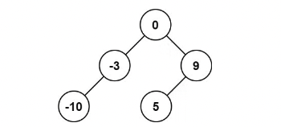

[TOC]

```
HOT-100 刷题总结
    1 数组(哈希、双指针、滑窗、数组) - 17 道题
        1.1 两数之和
        1.2 字母异位词分组
        1.3 最长连续序列
        1.4 移动零
        1.5 盛最多水的容器
        1.6 三数之和
        1.7 无重复子字符的最长子串
        1.8 找到字符串中所有字母异位词
        1.9 和为 K 的子数组
        1.10 最大子数组和
        1.11 合并区间
        1.12 轮转数组
        1.13 除自身以外数组的乘积
        1.14 接雨水
        1.15 滑动窗口最大值
        1.16 最小覆盖子串
        1.17 缺失的第一个正数
    2 回溯 - 8 道题
        2.1 全排列
        2.2 子集
        2.3 电话号码的字母组合
        2.4 组合总数
        2.5 括号生成
        2.6 单词搜索
        2.7 分割回文串
        2.8 N 皇后 - Hard
    3 动态规划 - 15 道题
        3.1 爬楼梯
        3.2 杨辉三角
        3.3 打家劫舍
        3.4 完全平方数
        3.5 零钱兑换
        3.6 单词拆分
        3.7 最长递增子序列
        3.8 乘积最大子数组
        3.9 分割等和子集
        3.10 最长有效括号
        3.11 不同路径
        3.12 最小路径和
        3.13 最长回文子串
        3.14 最长公共子序列
        3.15 编辑距离
    4 链表 - 14 道题
        4.1 相交链表
        4.2 反转链表
        4.3 回文链表
        4.4 环形链表
        4.5 环形链表 2
        4.6 合并两个有序链表
        4.7 两数相加
        4.8 删除链表的倒数第 N 个节点
        4.9 两两交换链表中的节点
        4.10 K 个一组翻转链表
        4.11 随机链表的复制
        4.12 排序链表
        4.13 合并 K 个升序链表
        4.14 LRU 缓存
    5 二叉树 - 15 道题
        5.1 二叉树前中后序 - 非递归遍历
        5.2 二叉树的最大深度
        5.3 翻转二叉树
        5.4 对称二叉树
        5.5 二叉树的直径
        5.6 二叉树的层序遍历
        5.7 将有序数组转换为二叉搜索树
        5.8 验证二叉搜索树
        5.9 二叉搜索树中第 K 小的元素
        5.10 二叉树的右视图
        5.11 二叉树展开为链表
        5.12 从前序与中序遍历序列构造二叉树
        5.13 路径总和 III → 比较难理解
        5.14 二叉树的最近公共祖先
        5.15 二叉树中的最大路径和
    6 栈 + 堆 - 8 道题
        6.1 有效的括号
        6.2 最小栈
        6.3 字符串解码
        6.4 每日温度
        6.5 柱状图中最大的矩形
        6.6 数组中的第K个最大元素
        6.7 前 K 个高频元素
        6.8 数据流的中位数
        7 二分 - 6道题
        7.1 搜索插入位置
        7.2 搜索二维矩阵
        7.3 在排序数组中查找元素的第一个和最后一个位置
        7.4 搜索旋转排序数组
        7.5 寻找旋转排序数组中的最小值
        7.6 寻找两个正序数组的中位数 - Hard
    8 矩阵 - 4 道题
        8.1 矩阵置0
        8.2 螺旋矩阵
        8.3 旋转图像
        8.4 搜索二维矩阵 II
    9 图论 - 4 道题
        9.1 岛屿数量
        9.2 腐烂的橘子
        9.3 课程表
        9.4 实现 Trie (前缀树)
    10 贪心 + 技巧 - 9 道题
        10.1 买卖股票的最佳时机
        10.2 跳跃游戏
        10.3 跳跃游戏 II
        10.4 划分字母区间
        10.5 只出现一次的数字
        10.6 多数元素
        10.7 颜色分类
        10.8 下一个排列
        10.9 寻找重复数
```

# HOT-100 刷题总结

## 1 数组(哈希、双指针、滑窗、数组) - 17 道题

### 1.1 两数之和

给定一个整数数组 nums 和一个整数目标值 target，请你在该数组中找出 **和为目标值** *target* 的那 **两个** 整数，并返回它们的数组下标。你可以假设每种输入只会对应一个答案，并且你不能使用两次相同的元素。你可以按任意顺序返回答案。

- 输入：nums = [2,7,11,15], target = 9
- 输出：[0,1]
- 解释：因为 nums[0] + nums[1] == 9 ，返回 [0, 1] 。

**思路:**

- 用哈希去存储 : key - value, key 存值, value
- 存 index, 这样遍历到一个数字 num, 去判断是否存在 target - num 存在

```java
public int[] twoSum(int[] nums, int target) {
    HashMap<Integer, Integer> map = new HashMap<>();
    for(int i = 0; i < nums.length; i ++){
        int num = nums[i];
        if(map.containsKey(target - num))
            return new int[]{map.get(target - num), i};
        map.put(num, i);
    }
    return new int[]{-1, -1};
}
```


### 1.2 **字母异位词分组**

给你一个字符串数组，请你将 **字母异位词** 组合在一起。可以按任意顺序返回结果列表。

**字母异位词** 是由重新排列源单词的所有字母得到的一个新单词。

- 输入: strs =["eat", "tea", "tan", "ate", "nat", "bat"]
- 输出:[["bat"],["nat","tan"],["ate","eat","tea"]]

**思路:**

- 是否是字母异位词的判断条件就是排序后是不是相同的, 记住这个就行
- 用一个 HashMap 去存储排序后的单词 → 输出结果队列的对应关系

```java
class Solution {
    public List<List<String>> groupAnagrams(String[] strs) {
        HashMap<String, List<String>> map = new HashMap<>();
        
        for(String str : strs){
            char[] flag = str.toCharArray();
            Arrays.sort(flag);
            String key = new String(flag);
            
            if(!map.containsKey(key)){
                List<String> list = new ArrayList<>();
                map.put(key, list);
            }
            map.get(key).add(str);
        }
        return new ArrayList<>(map.values());
    }
}
```


### 1.3 最长连续序列

给定一个未排序的整数数组 nums ，找出数字连续的最长序列（不要求序列元素在原数组中连续）的长度。请你设计并实现时间复杂度为 O(n) **的算法解决此问题。

- 输入：nums = [100,4,200,1,3,2]
- 输出：4
- 解释：最长数字连续序列是 [1, 2, 3, 4]。它的长度为 4。

**思路:**

- 对于每一个 num, 我要用 hashmap 维护一个信息, 就是 num → 对应的连续长度为多少, 比如 num = 4 时, 则 map.get(num + 1) = 2, map.get(num - 1) = 1, 则我会记录 map[num] = 1 + 2 + 1 = 4
- 注意使用 map.getOrDefault 来保证默认值
- 同时更新 num = 4 的时候, 也需要 num - 1 和 num + 1 的状态

```java
public int longestConsecutive2(int[] nums) {
    int n = nums.length;
    HashMap<Integer, Integer> map = new HashMap<>();
    int res = 0;

    for(int num: nums){
        if(!map.containsKey(num)){
            int left = map.getOrDefault(num - 1, 0);
            int right = map.getOrDefault(num + 1, 0);
            int cur = left + right + 1;
            if(cur > res)
                res = cur;

            map.put(num, cur);
            map.put(num - left, cur);
            map.put(num + right, cur);
        }
    }

    return res;
}
```


### 1.4 移动零

给定一个数组 nums，编写一个函数将所有 0 移动到数组的末尾，同时保持非零元素的相对顺序。

**请注意** ，必须在不复制数组的情况下原地对数组进行操作。

- 输入**:** nums = [0,1,0,3,12]
- 输出: [1,3,12,0,0]

**思路:**

- 双指针: 遇到不是 0 的放在指针的位置上 , 指针 ++
- 必须 3s 以内想到思路

```java
class Solution {
    public void moveZeroes(int[] nums) {
        int index = 0;
        for(int i = 0; i < nums.length; i++){
            int num = nums[i];
            if(num != 0)
                nums[index++] = num;
        }

        for(int i = index; i < nums.length; i++){
            nums[i] = 0;
        }
    }
}
```


### 1.5 盛最多水的容器


给定一个长度为 n 的整数数组 height 。有 n 条垂线，第 i 条线的两个端点是 (i, 0) 和 (i, height[i]) 。找出其中的两条线，使得它们与 x 轴共同构成的容器可以容纳最多的水。返回容器可以储存的最大水量。

- 输入:  [1,8,6,2,5,4,8,3,7]
- 输出: 49

**思路:**

1. left 指向最左边的数组, right 指向最右边的数组
2. 怎么去利用双指针找最大盛水量呢, 宽度为 right - left, 高度为 min(nums[right], nums[left]), 如果移动的话, 哪一个边比较小, 就去移动那个边

```java
class Solution {
    public int maxArea(int[] height) {
        int res = 0;
        int left = 0, right = height.length - 1;
        int h, w;
        while(left < right){
            h = Math.min(height[left], height[right]);
            w = right - left;
            int area = h * w;
            res = Math.max(res, area);

            if(height[left] < height[right])
                left++;
            else
                right--;
        }
        return res;

    }
}
```


### 1.6 三数之和

给你一个整数数组 nums ，判断是否存在三元组 [nums[i], nums[j], nums[k]] 满足 i != j、i != k 且 j != k ，同时还满足 nums[i] + nums[j] + nums[k] == 0 。请你返回所有和为 0 且不重复的三元组。

**注意：**答案中不可以包含重复的三元组。

- 输入：nums = [-1,0,1,2,-1,-4]
- 输出：[[-1,-1,2],[-1,0,1]]
- 注意，输出的顺序和三元组的顺序并不重要。

**思路: 先排序 + 双指针**

- 首先对数组元素从小到大先排个序
- 取出第一个元素 first
  - 由于需要去重, 需要 first 相同的进行去除
- 然后取出来第一个元素 num 之后, 用双指针判断剩下的元素可不可以满足条件 = -num
  - 由于需要去重, 需要 second 相同的进行去除
  - 为什么不需要考虑 third 去重, 因为 first 和 second 去重之后 third 一定不需要去重

```java
class Solution {
    public List<List<Integer>> threeSum(int[] nums) {
        int n = nums.length;
        Arrays.sort(nums);
        List<List<Integer>> ans = new ArrayList<List<Integer>>();
        // 枚举 a
        for (int first = 0; first < n; ++first) {
            // 需要和上一次枚举的数不相同
            if (first > 0 && nums[first] == nums[first - 1]) {
                continue;
            }
            // c 对应的指针初始指向数组的最右端
            int third = n - 1;
            int target = -nums[first];
            // 枚举 b
            for (int second = first + 1; second < n; ++second) {
                // 需要和上一次枚举的数不相同
                if (second > first + 1 && nums[second] == nums[second - 1]) {
                    continue;
                }
                // 需要保证 b 的指针在 c 的指针的左侧
                while (second < third && nums[second] + nums[third] > target) {
                    --third;
                }
                // 如果指针重合，随着 b 后续的增加
                // 就不会有满足 a+b+c=0 并且 b<c 的 c 了，可以退出循环
                if (second == third) {
                    break;
                }
                if (nums[second] + nums[third] == target) {
                    List<Integer> list = new ArrayList<Integer>();
                    list.add(nums[first]);
                    list.add(nums[second]);
                    list.add(nums[third]);
                    ans.add(list);
                }
            }
        }
        return ans;
    }
}
```


### 1.7 无重复子字符的最长子串

给定一个字符串 s, ，请你找出其中不含有重复字符的 **最长子串** 的长度。

**示例 1:**

> 输入:s = "abcabcbb" 输出:3 解释: 因为无重复字符的最长子串是"abc"，所以其长度为 3。

**思路: 滑动窗口**

1. 使用HashMap 记录新字符对应的数组下标的位置
2. map 中不包含字符, 则直接将数组下标放进去
3. 如果 map 中包含字符, 则证明现在不符合无重复子字符的最长子串了, 需要更新 left
   1. 更新 left 之前需要求当前的子串长度并记录在最长子串长度中

```java
class Solution {
    public int lengthOfLongestSubstring(String s) {
        int res = 0;
        HashMap<Character, Integer> map = new HashMap<>();
        int len = s.length();

        int left = 0;
        for(int i = 0; i < len; i++){
            char ch = s.charAt(i);
            if(!map.containsKey(ch)){
                map.put(ch, i);
            }else{
                res = Math.max(res, i - left);
                left = Math.max(left, map.get(ch) + 1);
                map.put(ch, i);
            }
        }
        res = Math.max(res, len - left);
        return res;
    }
}
```


### 1.8 找到字符串中所有字母异位词

给定两个字符串 s 和 p，找到 s ****中所有 p ****的 **异位词** 的子串，返回这些子串的起始索引。不考虑答案输出的顺序。

**异位词** 指由相同字母重排列形成的字符串（包括相同的字符串）。

**示例 1:**

> 输入:s = "cbaebabacd", p = "abc" 输出:[0,6] 解释: 起始索引等于 0 的子串是 "cba", 它是 "abc" 的异位词。 起始索引等于 6 的子串是 "bac", 它是 "abc" 的异位词。

**思路:**

1. 因为 

   异位词

    指由相同字母重排列形成的字符串, 所以我们可以直接用一个 int[] scount 来维护数量

   1. 放置字符: scount[s.charAt(i) - 'a']++;
   2. 判断相等: Arrays.equals(scount, pcount)

2. 之后就可以用滑动窗口开始遍历, 每次向后遍历一个字符, 则进行下面三个步骤:

   1. 删除: scount[s.charAt(i - p_len) - 'a']--;
   2. 新增: scount[s.charAt(i) - 'a']++;
   3. 判断: if(Arrays.equals(scount, pcount))

```java
class Solution {
    public List<Integer> findAnagrams(String s, String p) {
        List<Integer> res = new ArrayList<>();
        int s_len = s.length(), p_len = p.length();
        if(s_len < p_len)
            return res;
        
        int[] scount = new int[26];
        int[] pcount = new int[26];

        for(int i = 0; i < p_len; i++){
            scount[s.charAt(i) - 'a']++;
            pcount[p.charAt(i) - 'a']++;
        }
        if(Arrays.equals(scount, pcount))
            res.add(0);

        for(int i = p_len; i < s_len; i++){
            scount[s.charAt(i - p_len) - 'a']--;
            scount[s.charAt(i) - 'a']++;
            if(Arrays.equals(scount, pcount))
                res.add(i - p_len + 1);
        }

        return res;
    }
}
```


### 1.9 和为 K 的子数组

给你一个整数数组 nums 和一个整数 k ，请你统计并返回 该数组中和为 k ****的子数组的个数 。子数组是数组中元素的连续非空序列。

**示例 1：**

> 输入：nums = [1,1,1], k = 2 输出：2

**思路: 和为 K 的子数组 → 去联想前缀和的差值为 K**

1. 对数组进行求前缀和数组的操作, 上面的 [1,1,1] 就变成 [1,2,3]
2. 对于每一个遍历到的 index, 用 hashmap 记录当前的累计和对应的数量
3. res 用来作为结果, 累加之前出现过的值为 preArray[i] - k 的前缀和

```java
class Solution {
    public int subarraySum(int[] nums, int k) {
        HashMap<Integer, Integer> map = new HashMap<>();
        map.put(0, 1);
        int result = 0;
        
        int[] preArray = new int[nums.length];
        preArray[0] = nums[0];
        for(int i = 0 ; i < nums.length ; i ++){
            if(i > 0){
                preArray[i] += preArray[i-1] + nums[i];
            }
            if(map.containsKey(preArray[i] - k)){
								// 累加之前出现过的值为 preArray[i] - k 的前缀和
                result += map.get(preArray[i] - k);
            }
						// 用 hashmap 记录当前的累计和对应的数量
            map.put(preArray[i], map.getOrDefault(preArray[i], 0) + 1);
        }
        return result;
    }
}
```


### 1.10 最大子数组和

给你一个整数数组 nums ，请你找出一个具有最大和的连续子数组（子数组最少包含一个元素），返回其最大和。**子数组**是数组中的一个连续部分。

**示例 1：**

> 输入：nums = [-2,1,-3,4,-1,2,1,-5,4] 输出：6 解释：连续子数组 [4,-1,2,1] 的和最大，为 6 。

**思路: 动态规划, 要么累加前面要么从当前开始**

- 使用 tmp 来进行一个子数组和的统计
- 使用 res 来进行全局结果的保存

```java
class Solution {
    public int maxSubArray(int[] nums) {
        int res = nums[0];

        int tmp = nums[0];
        for(int i = 1; i < nums.length; i++){
            tmp = Math.max(nums[i], tmp + nums[i]);
            res = Math.max(res, tmp);
        }
        return res;
    }
}
```


### 1.11 合并区间

以数组 intervals 表示若干个区间的集合，其中单个区间为 intervals[i] = [starti, endi] 。请你合并所有重叠的区间，并返回 一个不重叠的区间数组，该数组需恰好覆盖输入中的所有区间 。

**示例 1：**

> 输入：intervals = [[1,3],[2,6],[8,10],[15,18]] 输出：[[1,6],[8,10],[15,18]] 解释：区间 [1,3] 和 [2,6] 重叠, 将它们合并为 [1,6].

**思路: 二维 int[] 排序, 先按照第一个字段从小到大排序, 再按照第二个字段从小到大排序**

比如说排序好的数组顺序就应该为  [[1,3],[2,6],[8,10],[15,18]]

- 排序好之后使用 List<int[]> res 来保存结果
- 当 [2,6] 的 2 落入了 [1,3] 之间, 则直接对 res 中最后一个的后区间进行修改: [1,3] → [1,6]
- 如果不在范围内, [8,10] 不在 [1,6] 范围内, 则直接 res.add(now_val);
- **注意: List<int[]> res → int[][] 使用 res.toArray(new int[0][0]);**

```java
class Solution {
    public int[][] merge(int[][] intervals) {
        List<int[]> res = new ArrayList<>();

        Arrays.sort(intervals, (a, b) -> {
            return a[0] != b[0] ? a[0] - b[0] : a[1] - b[1]; 
        });

        res.add(intervals[0]);
        for(int i = 1; i < intervals.length; i++){
            int[] now_val = intervals[i];
            if(now_val[0] <= res.get(res.size() - 1)[1]){
                res.get(res.size()-1)[1] = Math.max(res.get(res.size()-1)[1], now_val[1]);
            }else{
                res.add(now_val);
            }
        }

        return res.toArray(new int[0][0]);
    }
}
```


### 1.12 轮转数组

给定一个整数数组 nums，将数组中的元素向右轮转 k **个位置，其中 k **是非负数。

**示例 1:**

> 输入: nums = [1,2,3,4,5,6,7], k = 3 输出:[5,6,7,1,2,3,4]解释: 向右轮转 1 步:[7,1,2,3,4,5,6] 向右轮转 2 步:[6,7,1,2,3,4,5] 向右轮转 3 步:[5,6,7,1,2,3,4]

**思路: 三次反转**

1. 全局反转 reverse(nums, 0, nums.length - 1);
2. 反转前半部分 reverse(nums, 0, k -1);
3. 反转后半部分  reverse(nums, k, nums.length - 1);

```java
class Solution {
    public void rotate(int[] nums, int k) {
        k = k % nums.length;
        reverse(nums, 0, nums.length - 1);
        reverse(nums, 0, k -1);
        reverse(nums, k, nums.length - 1);
    }  

    public void reverse(int[] nums, int start, int end){
        int left = start;
        int right = end;
        while(left < right){
            int temp = nums[left];
            nums[left] = nums[right];
            nums[right] = temp;
            left++;
            right--;
        }
    }
}
```


### 1.13 除自身以外数组的乘积

给你一个整数数组 nums，返回 数组 answer ，其中 answer[i] 等于 nums 中除 nums[i] 之外其余各元素的乘积 。

题目数据 **保证** 数组 nums之中任意元素的全部前缀元素和后缀的乘积都在 **32 位** 整数范围内。

请 **不要使用除法，**且在 **O(n)** 时间复杂度内完成此题。

**示例 1:**

> 输入: nums =[1,2,3,4] 输出:[24,12,8,6]

**思路: 左边的累积 \* 右边的累积**

1. 求 left_products: 当前位置元素左边所有元素的累积乘积
2. 求 right_products: 当前位置元素右边所有元素的累积乘积
3. 除 nums[i] 之外其余各元素的乘积 = left_products[i] * right_products[i]

```java
class Solution {
    public int[] productExceptSelf(int[] nums) {
        int len = nums.length;
        int[] left_products = new int[len];
        int[] right_products = new int[len];

        left_products[0] = 1;
        for(int i = 1; i < len; i++){
            left_products[i] = nums[i - 1] * left_products[i - 1];
        }

        right_products[len - 1] = 1;
        for(int i = len - 2; i >= 0; i--){
            right_products[i] = nums[i + 1] * right_products[i + 1];
        }

        int[] res = new int[len];
        for(int i = 0; i < len; i++){
            res[i] = left_products[i] * right_products[i];
        }
        return res;
    }
}
```


### 1.14 接雨水

给定 n 个非负整数表示每个宽度为 1 的柱子的高度图，计算按此排列的柱子，下雨之后能接多少雨水。


> 输入：height = [0,1,0,2,1,0,1,3,2,1,2,1] 输出：6 解释：上面是由数组 [0,1,0,2,1,0,1,3,2,1,2,1] 表示的高度图，在这种情况下，可以接 6 个单位的雨水（蓝色部分表示雨水）

**思路1: 分别求出左右比自己高的高度 - 简单题**

1. left_h[i] 保留 index = i 左边的最高高度
2. right_h[i] 保留 index = i 右边的最高高度
3. 遍历每一个位置, 可以累积的雨水的量为 Math.min(left_h[i], right_h[i]) - height[i], 并且注意不能为负数
4. 累加到 res 之后返回就可以

```java
public int trap(int[] height){
    int len = height.length;
    int res = 0;
    int[] left_h = new int[len];
    int[] right_h = new int[len];

    left_h[0] = 0;
    for(int i = 1; i < len; i++){
        left_h[i] = Math.max(left_h[i-1], height[i-1]);
    }

    right_h[len-1] = 0;
    for(int i = len - 2; i >= 0; i--){
        right_h[i] = Math.max(right_h[i+1], height[i+1]);
    }

    for(int i = 0; i < len; i++){
        int num = Math.min(left_h[i], right_h[i]) - height[i];
        num = Math.max(num, 0);
        res += num;
    }
    return res;
}
```

**思路2:  单调栈**

1. 维护一个栈底到栈顶只能**从大到小**的单调栈

2. 如果栈顶元素小于当前 num, 则弹出来栈顶元素, 则可以计算一个累计面积, 高度就是左右的最高元素减去弹出元素代表的高度

   ```java
   int left_h = height[stack.peek()];
   int h = Math.min(left_h, num) - mid_h;
   int w = i - stack.peek() - 1;
   int hold = h * w;
   if(hold > 0)
       res += hold;
   ```

```java
public int trap2(int[] height) {
    int len = height.length;
    Deque<Integer> stack = new LinkedList<>();
    int res = 0;

    for(int i = 0; i < len; i++){
        int num = height[i];
        while(!stack.isEmpty() && height[stack.peek()] < num){
            int index = stack.pop();
            int mid_h = height[index];

            if(!stack.isEmpty()){
                int left_h = height[stack.peek()];
                int h = Math.min(left_h, num) - mid_h;
                int w = i - stack.peek() - 1;
                int hold = h * w;
                if(hold > 0)
                    res += hold;
            }
        }
        stack.push(i);
    }
    return res;
}
```


### 1.15 滑动窗口最大值

给你一个整数数组 nums，有一个大小为 k 的滑动窗口从数组的最左侧移动到数组的最右侧。你只可以看到在滑动窗口内的 k 个数字。滑动窗口每次只向右移动一位。

返回 滑动窗口中的最大值 。

**示例 1：**

> 输入：nums = [1,3,-1,-3,5,3,6,7], k = 3 
> 输出：[3,3,5,5,6,7]
>  解释： 滑动窗口的位置    最大值
> [1  3  -1] -3  5  3  6  7             3 
> 1 [3  -1  -3] 5  3  6  7              3 
> 1  3 [-1  -3  5] 3  6  7              5 
> 1  3  -1 [-3  5  3] 6  7              5 
> 1  3  -1  -3 [5  3  6] 7              6 
> 1  3  -1  -3  5 [3  6  7]             7

**思路: 优先级队列, 同时记录大小和位置, 并根据大小进行排序**

1. 使用优先级队列, int[], 第一个位置存放元素大小, 第二个位置存放元素下标, 都按照**从小到大**来进行排序
2. 如果滑动窗口大小为 k, 则新建一个大小为 k 的优先级队列, 并将元素全放进去
3. 然后遍历之后的元素, 将元素放进优先级队列中; 判断堆顶元素是不是在窗口内
   1. 在窗口内的话就是当前滑动窗口最大值
   2. 不在的话要一直弹出直到找到滑动窗口内的元素, 作为最大值

```java
class Solution {
    public int[] maxSlidingWindow(int[] nums, int k) {
        int[] result = new int[nums.length - k + 1];
        // a[0]表示当前num,b[0]当前num下标
        PriorityQueue<int[]> queue = new PriorityQueue<>(k, (a,b) -> {
            return a[0] != b[0] ? b[0] - a[0] : b[1] - a[1];
        });
        for(int i = 0; i < k; i++){
            queue.offer(new int[]{nums[i], i});
        }
        result[0] = queue.peek()[0];
        for(int i = k; i < nums.length; i++){
            queue.offer(new int[]{nums[i], i});
            while(i - k >= queue.peek()[1]){
                queue.poll();
            }
            result[i - k + 1] = queue.peek()[0];
        }
        return result;
    }
}
```


### 1.16 最小覆盖子串

给你一个字符串 s 、一个字符串 t 。返回 s 中涵盖 t 所有字符的最小子串。如果 s 中不存在涵盖 t 所有字符的子串，则返回空字符串 "" 。

**注意：**

- 对于 t 中重复字符，我们寻找的子字符串中该字符数量必须不少于 t 中该字符数量。
- 如果 s 中存在这样的子串，我们保证它是唯一的答案。

**示例 1：**

> 输入：s = "ADOBECODEBANC", t = "ABC" 输出："BANC" 解释：最小覆盖子串 "BANC" 包含来自字符串 t 的 'A'、'B' 和 'C'。

**思路:  滑动窗口 + 清晰的思维逻辑**

1. 使用 target 来存储目标串的字符和个数, 使用 origin 保存当前字符串的字符和个数
2. 使用 check 来判断当前字符串是否完全涵盖目标字符串
3. **使用滑动窗口,** 不段向 origin 中新增字符和个数; **满足 check 条件后, 不断收缩左边界,** 并且不段更新最小覆盖子串

```java
class Solution {
    HashMap<Character, Integer> target = new HashMap<>();
    HashMap<Character, Integer> origin = new HashMap<>();

    public String minWindow(String s, String t) {
        for(int i = 0; i < t.length(); i++){
            Character ch = t.charAt(i);
            target.put(ch, target.getOrDefault(ch, 0) + 1);
        }

        int l = 0, r = -1;
        int max_len = Integer.MAX_VALUE, max_l = -1, max_r = 0;

        while(r < s.length() - 1){
            r++;
            Character ch = s.charAt(r);
            origin.put(ch, origin.getOrDefault(ch, 0) + 1);
            
            while(check() && l <= r){
                if(r - l + 1 < max_len){
                    max_len = r - l + 1;
                    max_l = l;
                    max_r = r;
                }
                ch = s.charAt(l);
                origin.put(ch, origin.getOrDefault(ch, 0) - 1);
                l++;
            }
        }

        return max_len == Integer.MAX_VALUE ? "" : s.substring(max_l, max_r + 1);
    }

    public boolean check() {
        Iterator it = target.entrySet().iterator();
        while(it.hasNext()){
            Map.Entry entry = (Map.Entry) it.next();
            Character ch = (Character) entry.getKey();
            Integer val = (Integer) entry.getValue();

            Integer now_val = origin.getOrDefault(ch, 0);
            if(now_val < val)
                return false;
        }
        return true;
    }
}
```


### 1.17 缺失的第一个正数

给你一个未排序的整数数组 nums ，请你找出其中没有出现的最小的正整数。

请你实现时间复杂度为O(n), 并且只使用常数级别额外空间的解决方案。

**示例 1：**

> 输入：nums = [1,2,0] 输出：3 解释：范围 [1,2] 中的数字都在数组中。

**示例 2：**

> 输入：nums = [3,4,-1,1] 输出：2 解释：1 在数组中，但 2 没有。

**思路: 没什么办法, 记住下面三个步骤:**

1. 第一次循环: 把负数的位置变成 len + 1
2. 第二次循环: 将 nums[i] 的绝对值 - 1 作为下标, 将该下标的元素取反
3. 第三次循环: 遍历每个位置, 如果某个位置上的 nums[i] > 0, 未出现的最小正数就是 i + 1

```java
class Solution {
    public int firstMissingPositive(int[] nums) {
        int len = nums.length;
        for(int i = 0; i < len; i++){
            if(nums[i] <= 0){
                nums[i] = len + 1;
            }
        }

        for(int i = 0; i < len; i++){
            int index = Math.abs(nums[i]);
            if(index <= len){
                nums[index - 1] = -Math.abs(nums[index - 1]);
            }
        }

        for(int i = 0; i < len; i++){
            if(nums[i] > 0)
                return i + 1;
        }
        return len + 1;
    }
}
```


## 2 回溯 - 8 道题

### 2.1 全排列

给定一个不含重复数字的数组 nums ，返回其 *所有可能的全排列* 。你可以 **按任意顺序** 返回答案。

**示例 1：**

> 输入：nums = [1,2,3] 输出：[[1,2,3],[1,3,2],[2,1,3],[2,3,1],[3,1,2],[3,2,1]]

**思路: 回溯需要考虑的就是回溯终止条件和回溯的下一个状态**

- 回溯参数: n 表示数组长度, output 表示当前排列的状态, res 表示全局结果, first 表示当前 backtrack 中正在处理的下标位置
- 回溯终止条件:
  - 如果 first == n - 1, 证明当前情况遍历到了最后一个位置, 可以将该排列放在全局结果了
- 回溯的下一个状态:
  - **修改状态:** 对于当前的 first 下标, 可以将 first 下标之后的元素进行交换, 比如 [1,2,3], first == 0 && index == 1 时, 该操作将 [1,2,3] 转变为 [2,1,3], 之后操作的结果为 first 位置为 2 的排列情况
  - **进入回溯:** 只需要把 first+1 传入到回溯中就可以
  - **还原状态:** 要把刚刚的 [1,2,3] → [2,1,3] 还原回来, 即 [2,1,3] → [1,2,3]; 为什么呢 ? 因为这样的话  first == 0 && index == 2 的时候才可以将 [1,2,3] → [3,2,1], 开始操作第一个位置为 3 的情况
  - 不还原状态会发生错误, 不信去 lc 提交代码看一下

```java
class Solution {
    public List<List<Integer>> permute(int[] nums) {
        List<List<Integer>> res = new ArrayList<>();

        List<Integer> output = new ArrayList<Integer>();
        for (int num : nums) {
            output.add(num);
        }

        int n = output.size();
        backtrack(n, output, res, 0);
        return res;
    }

    public void backtrack(int n, List<Integer> output, List<List<Integer>> res, int first){
        if(first == n-1){
            res.add(new ArrayList(output));
            return;
        }

        for(int i = first; i < n; i++){
            Collections.swap(output, first, i);
            backtrack(n , output, res, first + 1);
            Collections.swap(output, i, first);
        }
    }
}
```


### 2.2 子集

给你一个整数数组 nums ，数组中的元素 **互不相同** 。返回该数组所有可能的

子集（幂集）。解集 **不能** 包含重复的子集。你可以按 **任意顺序** 返回解集。

**示例 1：**

> 输入：nums = [1,2,3] 输出：[[],[1],[2],[1,2],[3],[1,3],[2,3],[1,2,3]]

**思路: 回溯需要考虑的就是回溯终止条件和回溯的下一个状态**

- 回溯参数:
  - 全局变量: res 表示全局结果,path 代表当前生成的子集
  - 回溯参数: int[] nums 表示数组, int index 表示当前处理的位置下标
- 回溯终止条件:
  - 如果 index == nums.length, 证明遍历到了最后一个位置, 可以将子集放在全局结果了
- 回溯的下一个状态:
  - **修改状态:** 将当前 index 位置的元素加入 path 中
  - **进入回溯:** 只需要把 index+1 传入到回溯中就可以, 代表我要去处理 index + 1 位置的元素
  - **还原状态:** 将 path 的最后一个位置的元素进行移除, 表示下一次要将 path 中的该位置修改为下一个元素
  - 进入回溯: 用于遍历 [1, 3], [1] 这种中间不处理, 就直接到末尾的情况
    - 如果没有再次进入回溯, 错误答案: [[1,2,3]]
    - 有再次进入回溯的结果: [[1,2,3],[1,2],[1,3],[1],[2,3],[2],[3],[]]

```java
class Solution {
    List<Integer> path = new ArrayList<>();
    List<List<Integer>> res = new ArrayList<>();

    public List<List<Integer>> subsets(int[] nums) {
        backtrack(nums, 0);
        return res;
    }

    public void backtrack(int[] nums, int index){
        if(index == nums.length){
            res.add(new ArrayList<Integer>(path));
            return;
        }

        path.add(nums[index]);
        backtrack(nums, index + 1);
        path.remove(path.size() - 1);
        backtrack(nums, index + 1);
    }
}
```


### 2.3 电话号码的字母组合

给定一个仅包含数字 2-9 的字符串，返回所有它能表示的字母组合。答案可以按 **任意顺序** 返回。

给出数字到字母的映射如下（与电话按键相同）。注意 1 不对应任何字母。

**示例 1：**

> 输入：digits = "23" 输出：["ad","ae","af","bd","be","bf","cd","ce","cf"]

**思路: 回溯需要考虑的就是回溯终止条件和回溯的下一个状态**

- 回溯参数:

  - 固定参数: combinations 代表结果集, phoneMap 代表提前构建好的字母表, digits 代表输入的电话号码
  - 动态变化的参数: index 代表当前正在处理的下标, combination 代表动态变化的字符串

- 回溯终止条件:

  - 如果 index ==digits.length(), 证明遍历到了最后一个位置, 可以将子集放在全局结果了

- 回溯的下一个状态: 

  针对当前电话号码中 index 对应的字符, 可以对应多个字母, 所以最外层要套一个 for 循环遍历每一种情况

  - **修改状态:** 将当前 index 位置对应的字符加入到 combination 中
  - **进入回溯:** 只需要把 index+1 传入到回溯中就可以, 代表我要去处理 index + 1 位置的元素
  - **还原状态:** combination 去除刚刚修改状态时加入的字符

```java
class Solution {

    public List<String> letterCombinations(String digits) {
        List<String> combinations = new ArrayList<String>();
        if(digits.length() == 0){
            return combinations;
        }

        Map<Character, String> phoneMap = new HashMap<Character, String>();
        phoneMap.put('2', "abc");
        phoneMap.put('3', "def");
        phoneMap.put('4', "ghi");
        phoneMap.put('5', "jkl");
        phoneMap.put('6', "mno");
        phoneMap.put('7', "pqrs");
        phoneMap.put('8', "tuv");
        phoneMap.put('9', "wxyz");

        backtrack(combinations, phoneMap, digits, 0, new StringBuffer());
        return combinations;
    }

    public void backtrack(List<String> combinations, Map<Character, String> phoneMap, 
    String digits, int index, StringBuffer combination){
        if(index == digits.length()){
            combinations.add(combination.toString());
        }else{
            char digit = digits.charAt(index);
            String letters = phoneMap.get(digit);
            int letterCount = letters.length();
            for(int i = 0; i < letterCount; i++){
                combination.append(letters.charAt(i));
                backtrack(combinations, phoneMap, digits, index + 1, combination);
                combination.deleteCharAt(index);
            }
        }
    }
}
```


### 2.4 组合总数

给你一个 **无重复元素** 的整数数组 candidates 和一个目标整数 target ，找出 candidates 中可以使数字和为目标数 target 的 所有 ****不同组合** ，并以列表形式返回。你可以按 **任意顺序** 返回这些组合。

candidates 中的 **同一个** 数字可以 **无限制重复被选取** 。如果至少一个数字的被选数量不同，则两种组合是不同的。

对于给定的输入，保证和为 target 的不同组合数少于 150 个。

**示例 1：**

> 输入：candidates =[2,3,6,7],target =7输出：[[2,2,3],[7]] 解释： 2 和 3 可以形成一组候选，2 + 2 + 3 = 7 。注意 2 可以使用多次。 7 也是一个候选， 7 = 7 。 仅有这两种组合。

**思路: 回溯需要考虑的就是回溯终止条件和回溯的下一个状态**

- 为了方便提前终止, 我们在调用回溯之前先对数据排序, 之后只要放不下一个元素之后, 后面的元素肯定都放不下了, 可以直接返回

- 回溯参数:

  - 固定参数: res 代表结果集, candidate 代表排序好的数组, target 等于目标和
  - 动态参数: start 代表当前正在处理的下标, temp 代表当前构建的结果, sum 表示当前和

- 回溯终止条件:

  - 如果 sum == target, 证明满足了条件, 不需要继续放元素了, 直接返回

- 回溯的下一个状态: 

  由于可重复放元素, 每次进入回溯之后从 i 去遍历之后的候选者, 避免重复选取

  - **提前返回:** 如果 sum 和 target 之间的差距已经不足以放入当前的 candidate[i], 打破循环, 不进行下一次的回溯
  - **修改状态:** temp 中加入元素
  - **进入回溯:** 把 i 传入到下一个回溯中, 表示我后面的候选者要**从 i 以及 i 之后的位置进行挑选; 传入 sum + num, 其实这个也是修改 + 恢复, 只不过数值参数的话函数自动返回后就会恢复**
  - **还原状态:** temp 删除刚刚加入的元素

```java
class Solution {
    public List<List<Integer>> combinationSum(int[] candidates, int target) {
        List<List<Integer>> res = new ArrayList<>();
        List<Integer> temp = new ArrayList<>();
        Arrays.sort(candidates);

        int sum = 0;
        int start = 0;
        backTracking(res, temp, candidates, start, sum, target);

        return res;
    }

    public void backTracking(List<List<Integer>> res, List<Integer> temp, int[] candidate,
                             int start, int sum, int target){
        if(sum == target){
            res.add(new ArrayList<>(temp));
            return;
        }

        for (int i = start; i < candidate.length; i++) {
            int num = candidate[i];
            if(target - sum - num < 0)
                break;

            temp.add(num);
            backTracking(res, temp, candidate, i, sum + num, target);
            temp.remove((Integer) num);
            
        }
    }
}
```


### 2.5 **括号生成**

数字 n 代表生成括号的对数，请你设计一个函数，用于能够生成所有可能的并且 **有效的** 括号组合。

**示例 1：**

> 输入：n = 3 输出：["((()))","(()())","(())()","()(())","()()()"]

**思路: 使用回溯的方法来生成括号, 开始想一下回溯终止条件和下一个状态分别是啥**

- 回溯参数: 当前的动态字符串 sb, 当前左括号的剩余次数 left, 当前右括号的剩余次数 right
- 回溯终止条件:
  - 如果 left < 0 || left > right, 直接返回
  - 如果 left == 0 && right == 0, 说明出现了一种可能的组合, 放到结果集里面
- 回溯的下一个状态:  对于每一次回溯函数内部
  - 加入左括号 → 遍历下一个状态 → 移除左括号
  - 加入右括号 → 遍历下一个状态 → 移除右括号

```java
class Solution {
    List<String> res = new ArrayList<>();

    public List<String> generateParenthesis(int n) {
        StringBuilder sb = new StringBuilder();
        dfs(sb, n, n);
        return res;
    }

    public void dfs(StringBuilder sb, int left, int right){
        if(left < 0 || left > right)
            return;
        
        if(left == 0 && right == 0){
            res.add(sb.toString());
            return;
        }

        sb.append('(');
        dfs(sb, left - 1, right);
        sb.deleteCharAt(sb.length() - 1);

        sb.append(')');
        dfs(sb, left, right - 1);
        sb.deleteCharAt(sb.length() - 1);
    }
}

// another method
class Solution {
    public List<String> generateParenthesis(int n) {
        StringBuilder sb = new StringBuilder();
        List<String> res = new ArrayList<>();
        dfs(n, sb, res, 0, 0);
        return res;
    }
    //left 左括号用的个数
    //right 右括号用的个数
    public void dfs(int n, StringBuilder sb, List<String> res, int left, int right) {
        if(left == n && right == n) {//左右括号都用了n个
            res.add(sb.toString());
        }

        if(left < n) {//左括号剩余
            sb.append("(");
            dfs(n, sb, res, left + 1, right);
            sb.deleteCharAt(sb.length() - 1);
        }
        if(right < left) {//右括号数量小于左括号，如(()，这种情况下就可以添加右括号
            sb.append(")");
            dfs(n, sb, res, left, right + 1);
            sb.deleteCharAt(sb.length() - 1);
        }
    }
}
```


### 2.6 **单词搜索**

给定一个 m x n 二维字符网格 board 和一个字符串单词 word 。如果 word 存在于网格中，返回 true ；否则，返回 false 。

单词必须按照字母顺序，通过相邻的单元格内的字母构成，其中“相邻”单元格是那些水平相邻或垂直相邻的单元格。同一个单元格内的字母不允许被重复使用。

**示例 1：**

> 输入：board = [["A","B","C","E"],["S","F","C","S"],["A","D","E","E"]], word = "ABCCED" 输出：true

**思路: 上面的其他题目是回溯的时候有一个选择的空间, 比如选择数组中的一个数字; 这种二维数组的回溯一般就是上、下、左、右去选择, 一般在刚开始就可以先构建一个方向的数组**

- 使用 dfs 回溯来判断从二维数组的 i,j 出发是否可以得到单词 word
- 回溯传入参数:
  - 固定参数: 二维数组 board, 一维数组 words
  - 动态参数: 行下标 i, 列下标 j, 对应的单词下标 k
- 回溯终止条件:
  - 行下标 i, 列下标 j 超出了限制范围的话, 可以直接返回 false
  - 如果 board[i][j] != words[k] 也可以直接返回 false, 不匹配了
  - 如果 k == words.length - 1, 由于上面的条件已经排除不匹配的情况了, 可以直接返回 true
- 回溯的下一个条件:
  - 将 board[i][j] 设置为 ‘\0’, 防止重复
  - 分别从上、下、左、右进入下一次回溯, 字符串的下一个坐标为 k + 1
  - 将 board[i][j] 恢复为 words[k]
  - 上、下、左、右有一次可以成功就返回 true, 否则返回 false

```java
class Solution {
    public boolean exist(char[][] board, String word) {
        char[] words = word.toCharArray();
        for(int i = 0; i < board.length; i++){
            for(int j = 0; j < board[0].length; j++){
                if(dfs(board, words, i, j, 0))
                    return true;
            }
        }
        return false;
    }

    public boolean dfs(char[][] board, char[] words, int i, int j, int k){
        if(i >= board.length || i < 0 || j >= board[0].length || j < 0 || board[i][j] != words[k])
            return false;
        if(k == words.length - 1)
            return true;

        board[i][j] = '\\0';
        boolean res = dfs(board, words, i + 1, j, k + 1) || dfs(board, words, i, j + 1, k + 1) ||
                      dfs(board, words, i - 1, j, k + 1) || dfs(board, words, i, j - 1, k + 1);
        board[i][j] = words[k];
        return res;
    }
}
```


### 2.7 **分割回文串**

给你一个字符串 s, 请你将 s 分割成一些子串，使每个子串都是**回文串**。返回 s 所有可能的分割方案。

**示例 1：**

> 输入：s = "aab" 输出：[["a","a","b"],["aa","b"]]

**思路: 使用回溯来找到可能的划分方案, 同时定义一个函数用来判断字符串是否为回文字符串**

比较难的点是用了两套回溯: isPalindrome 和 backTracking 都是回溯函数

- **提前准备: isPalindrome(String s, int i, int j) + dp[i][j] 来判断 s[i] → s[j] 是否是回文串**
- 传入参数:
  - backTracking 传入的参数为字符串 s, 以及当前处理的字符串下标 i
  - isPalindrome 判断回文串, 传入字符串 s, 以及要判断的开始下标 i 以及结束下标 j
- 回溯终止条件:
  - backTracking 终止条件为 i ≥ n, 表示已经分割好字符串
  - isPalindrome 如果遇到 dp[i][j] ≠ 0 , 则直接返回
- 回溯的下一个状态:
  - backTracking 下一个状态将 s.substring(i, j + 1) 添加到 path 中 → 处理 j + 1 的字符串 → 移除 path 中刚刚加入的字符串
  - isPalindrome 必须满足 s.charAt(i) == s.charAt(j), 才会进入下一个状态 isPalindrome(s, i + 1, j - 1), 判断并返回回文结果

```java
class Solution {
    int[][] dp;
    public List<List<String>> res = new ArrayList<>();
    public List<String> path = new ArrayList<>();
    int n;

    public List<List<String>> partition(String s){
        n = s.length();
        dp = new int[n][n];

        backTracking(s, 0);
        return res;
    }

    private void backTracking(String s, int i){
        if(i >= n){
            res.add(new ArrayList<>(path));
            return;
        }
        
        for(int j = i; j < n; j++){
            if(isPalindrome(s, i, j) == 1){
                path.add(s.substring(i, j + 1));
                backTracking(s, j + 1);
                path.remove(path.size() - 1);
            }
        }
    }

    // 记忆化搜索: 1 表示是回文串，-1 表示不是回文串
    public int isPalindrome(String s, int i, int j){
        if(dp[i][j] != 0)
            return dp[i][j];
        
        if(i >= j){
            dp[i][j] = 1;
        }else if(s.charAt(i) == s.charAt(j)){
            dp[i][j] = isPalindrome(s, i + 1, j - 1);
        }else{
            dp[i][j] = -1;
        }
        return dp[i][j];
    }
}
```


### 2.8 **N 皇后 - Hard**

按照国际象棋的规则，皇后可以攻击与之处在同一行或同一列或同一斜线上的棋子。

**n 皇后问题** 研究的是如何将 n 个皇后放置在 n×n 的棋盘上，并且使皇后彼此之间不能相互攻击。

给你一个整数 n ，返回所有不同的 **n **皇后问题** 的解决方案。

每一种解法包含一个不同的 **n 皇后问题** 的棋子放置方案，该方案中 'Q' 和 '.' 分别代表了皇后和空位。

**示例 1：**

> 输入：n = 4 输出：[[".Q..","...Q","Q...","..Q."],["..Q.","Q...","...Q",".Q.."]] 解释：如上图所示，4 皇后问题存在两个不同的解法。

**思路: 使用回溯 + 判断当前是否符合 N 皇后的规范**

- 传入参数: 使用 solutions 存储全局答案, 使用 queens 来存储目前结果(表示第 queens[index] = i 表示第 index 行的第 i 列放置一个皇后), 使用 int row 来保存当前处理第几行
- 回溯终止条件:
  - row == n 代表已经在每个行上放置了一个皇后, 可以生成答案并添加
- 回溯的下一个状态:
  - 如果 columns.contains(i) 代表列冲突, continue
  - 如果 diagonal1 = row - i; diagonals1.contains(diagonal1) 代表对角线冲突, continue
  - 如果 diagonal2 = row + i; diagonals2.contains(diagonal2) 代表对角线冲突, continue
  - 设置状态 queens[row] = i; columns.add(i); diagonals1.add(diagonal1);  diagonals2.add(diagonal2);
  - 进入下一个回溯, 行数变成下一行
  - 恢复状态 queens[row] = -1; columns.remove(i); diagonals1.remove(diagonal1); diagonals2.remove(diagonal2);

```java
class Solution {
    public List<List<String>> solveNQueens(int n) {
        List<List<String>> solutions = new ArrayList<>();
        int[] queens = new int[n];
        Arrays.fill(queens, -1);

        Set<Integer> columns = new HashSet<>();
        Set<Integer> diagonals1 = new HashSet<>();
        Set<Integer> diagonals2 = new HashSet<>();

        backtrack(solutions, queens, n, 0, columns, diagonals1, diagonals2);
        return solutions;
    }

    public void backtrack(List<List<String>> solutions, int[] queens, int n, int row, 
                Set<Integer> columns, Set<Integer> diagonals1, Set<Integer> diagonals2){
        if(row == n){
            List<String> board = generateBoard(queens, n);
            solutions.add(board);
        }else{
            for(int i = 0; i < n; i++){
                if(columns.contains(i)) continue;

                int diagonal1 = row - i;
                if(diagonals1.contains(diagonal1)) continue;

                int diagonal2 = row + i;
                if(diagonals2.contains(diagonal2)) continue;

                queens[row] = i;
                columns.add(i);
                diagonals1.add(diagonal1);
                diagonals2.add(diagonal2);

                backtrack(solutions, queens, n, row + 1, columns, diagonals1, diagonals2);

                queens[row] = -1;
                columns.remove(i);
                diagonals1.remove(diagonal1);
                diagonals2.remove(diagonal2);
            }
        }
    }

    public List<String> generateBoard(int[] queens, int n){
        List<String> res = new ArrayList<>();
        for(int i = 0; i < n; i++){
            char[] row = new char[n];
            Arrays.fill(row, '.');
            row[queens[i]] = 'Q';
            res.add(new String(row));
        }
        return res;
    }
}
```


## 3 动态规划 - 15 道题

### 3.1 爬楼梯

假设你正在爬楼梯。需要 `n` 阶你才能到达楼顶。

每次你可以爬 `1` 或 `2` 个台阶。你有多少种不同的方法可以爬到楼顶呢？

**示例 1：**

> 输入：n = 3 输出：3 解释：有三种方法可以爬到楼顶。

1. 1 阶 + 1 阶 + 1 阶
2. 1 阶 + 2 阶
3. 2 阶 + 1 阶

> 

**思路:**

简单的动态规划: dp[n] 表示爬到第 n 层有多少种方法

- 在第 1 台台阶 dp[1] 时: 只有一种方法
- 在第 2 台台阶 dp[2] 时: 有两种方法, 从第一层爬过来或者直接爬到第二层
- 在第 n 台台阶 dp[n] 时:  dp[n] = dp[n-1] + dp[n-2]

```java
class Solution {
    public int climbStairs(int n) {
        if(n == 1){
            return 1;
        }
        if (n == 2)
            return 2;

        int p = 1, q = 2, tmp = 0;
        for(int i = 3;i <= n; i++){
            tmp = p;
            p = q;
            q = p + tmp;
        }
        return q;
    }
}
```


### 3.2 **杨辉三角**

给定一个非负整数 `*numRows`，*生成「杨辉三角」的前 `\*numRows`* 行。

在「杨辉三角」中，每个数是它左上方和右上方的数的和。

**示例 1:**

> 输入: numRows = 5 输出: [[1],[1,1],[1,2,1],[1,3,3,1],[1,4,6,4,1]]

**思路: 简单的模拟题, 按照题目的意思来模拟就可以**

- 注意点1: res.add(new ArrayList(row)); 添加的时候新建一个 ArrayList, 防止对原对象的修改影响结果集 (底层原理是 Java 对象引用指向了堆中的同一个对象)
- 注意点2: 及时清楚 row.clear();

```java
class Solution {
    public List<List<Integer>> generate(int numRows) {
        List<List<Integer>> res = new ArrayList<>();
        List<Integer> row = new ArrayList<>();
        List<Integer> old = new ArrayList<>();
        
        for(int i = 0; i < numRows; i++){
            int cnt = i + 1;
            for(int j = 0; j < cnt; j++){
                if(j == 0 || j == cnt - 1){
                    row.add(1);
                }else{
                    row.add(old.get(j - 1) + old.get(j));
                }
            }
            res.add(new ArrayList(row));
            old = res.get(res.size() - 1);
            row.clear();
        }

        return res; 
    }
}
```


### 3.3 **打家劫舍**

你是一个专业的小偷，计划偷窃沿街的房屋。每间房内都藏有一定的现金，影响你偷窃的唯一制约因素就是相邻的房屋装有相互连通的防盗系统，**如果两间相邻的房屋在同一晚上被小偷闯入，系统会自动报警**。

给定一个代表每个房屋存放金额的非负整数数组，计算你 **不触动警报装置的情况下** ，一夜之内能够偷窃到的最高金额。

**示例 1：**

> 输入：[1,2,3,1] 输出：4 解释：偷窃 1 号房屋 (金额 = 1) ，然后偷窃 3 号房屋 (金额 = 3)。     偷窃到的最高金额 = 1 + 3 = 4 。

**思路: 使用 dp[n] 表示如果要打劫 1,2…n 号房间可以获取的最高金额, 下面我们推导动态公式**

- dp[1] 可以获取的最高金额 : nums[0]
- dp[2] 可以获取的最高金额 : Math.max(nums[0], nums[1])
- dp[i] 可以获取的最高金额 : Math.max(dp[n-1], dp[n-2] + nums[i])

由于状态只和之前的两个状态相同, 所以我们可以简化 dp 推导, 代码如下:

```java
class Solution {
    public int rob(int[] nums) {
        int len = nums.length;
        if(len == 1) return nums[0];
        if(len == 2) return Math.max(nums[0], nums[1]);
        int r0 = nums[0], r1 = Math.max(nums[0], nums[1]);
        for(int i = 2; i < len; i++){
            int r = Math.max(r0 + nums[i], r1);
            r0 = r1;
            r1 = r;
        }
        return r1;
    }
}
```


### 3.4 **完全平方数**

给你一个整数 n ，返回 和为 n 的完全平方数的最少数量 。

**完全平方数** 是一个整数，其值等于另一个整数的平方；换句话说，其值等于一个整数自乘的积。例如，1、4、9 和 16 都是完全平方数，而 3 和 11 不是。

**示例 1：**

> 输入：n =12输出：3 解释：12 = 4 + 4 + 4

**思路: 可以转换为完全背包问题, 思路如下**

- 构建 nums 数组, 其中保存的是乘方小于等于 n 的数组元素, 可以当成我们背包中的元素
- 背包容量定义为 n, 则问题转换为: 从 nums 数组中取元素放到容量为 n 的背包中, 可以重复, 如何使背包中存放的元素个数最少
- dp[i] 表示填满背包容量为 i 的背包最少需要几个元素
  - 完全背包决定遍历顺序: for(int j = nums[i]; j <= n; j++)
  - 获取最小元素数量: dp[j] = Math.min(dp[j], dp[j - nums[i]] + 1);

```java
class Solution {
    public int numSquares(int n) {
        int t = 0;
        int[] nums = new int[n / 2 + 1];
        for(int i = 1; i <= n /2 + 1; i++){
            if(i * i <= n){
                nums[t++] = i * i;
            }
        }

        int[] dp = new int[n + 1];
        Arrays.fill(dp, Integer.MAX_VALUE);
        dp[0] = 0;
        for(int i = 0; i < t; i++){
            for(int j = nums[i]; j <= n; j++){
                dp[j] = Math.min(dp[j], dp[j - nums[i]] + 1);
            }
        }
        return dp[n];        
    }
}
```


### 3.5 **零钱兑换**

给你一个整数数组 coins ，表示不同面额的硬币；以及一个整数 amount ，表示总金额。

计算并返回可以凑成总金额所需的 **最少的硬币个数** 。如果没有任何一种硬币组合能组成总金额，返回 -1 。你可以认为每种硬币的数量是无限的。

**示例 1：**

> 输入：coins =[1, 2, 5], amount =11 输出：3 解释：11 = 5 + 5 + 1

**思路: 完全背包问题, 和 3.4 一样, 仔细思考发现递推公式都是一摸一样的**

- dp[i] 表示填满背包容量为 i 的背包最少需要几个元素, 即填满容量为 amount 的背包需要多少个元素
  - 完全背包决定遍历顺序: for(int j = coin; j <= amount; j++)
  - 获取最小元素数量: dp[j] = Math.min(dp[j], dp[j -coin] + 1);

```java
class Solution {
    public int coinChange(int[] coins, int amount) {
        int[] dp = new int[amount + 1];
        Arrays.fill(dp, Integer.MAX_VALUE - 2);

        dp[0] = 0;
        for(int coin: coins){
            for(int j = coin; j <= amount; j++){
                dp[j] = Math.min(dp[j], dp[j -coin] + 1);
            }
        }
       
        return dp[amount] == Integer.MAX_VALUE - 2 ? -1 : dp[amount];
    }
}
```


### 3.6 **单词拆分**

给你一个字符串 s 和一个字符串列表 wordDict 作为字典。如果可以利用字典中出现的一个或多个单词拼接出 s 则返回 true。

**注意：**不要求字典中出现的单词全部都使用，并且字典中的单词可以重复使用。

**示例 1：**

> 输入: s = "leetcode", wordDict = ["leet", "code"] 输出: true 解释: 返回 true 因为 "leetcode" 可以由 "leet" 和 "code" 拼接成。

**思路: 动态规划 → 字典中的单词, 可以无限选择, 是否可以拼接成要求的单词 ← 有很多类似的题目, 该题可以作为模版**

- 使用 dp[i] 表示字符串第 1 个位置 → 第 j 个位置是否可以用 wordDict中 的字符表示
- 初始化: dp[0] 一定为 true, 表示一定可以被成功拼接
- 对于 dp[j] 的值:
  - 遍历每一个单词: for(String word : wordDict){
  - 只要有一个单词使得 dp[j] 设置为 true, 则 dp[j] 可以设置为 true, 所以可以设置为 dp[j] = dp[j] || (dp[j - sublen] && word.equals(s.substring(j-sublen, j)));

```java
class Solution {
    public boolean wordBreak(String s, List<String> wordDict) {
        int len = s.length();
        // dp[i] 表示字符串第 1 个位置 - 第 len 个位置是否可以用 wordDict中 的字符表示
        boolean[] dp = new boolean[len + 1];
        Arrays.fill(dp, false);
        dp[0] = true;

        for(int j  = 0; j <= len; j++){
            for(String word : wordDict){
                int sublen = word.length();
                if(j >= sublen){
                    dp[j] = dp[j] || (dp[j - sublen] && word.equals(s.substring(j-sublen, j)));
                }
            }
        }

        return dp[len];
    }
}
```


### 3.7 **最长递增子序列**

给你一个整数数组 nums ，找到其中最长严格递增子序列的长度。

**子序列** 是由数组派生而来的序列，删除（或不删除）数组中的元素而不改变其余元素的顺序。例如，[3,6,2,7] 是数组 [0,3,1,6,2,2,7] 的子序列。

**示例 1：**

> 输入：nums = [10,9,2,5,3,7,101,18] 输出：4 解释：最长递增子序列是 [2,3,7,101]，因此长度为 4 。

**思路: 动态规划, 遍历之前的下标 + 全局结果**

- 使用 dp[i] 表示 nums[0] → nums[i] 的最长严格递增子序列, 全部初始化为 1
- 对于 index - i, 可以遍历其之前的所有 index - j, 如果满足条件 num > nums[j], 则可以更新 dp[i] 的最大值, 如下: dp[i] = Math.max(dp[i], dp[j] + 1);
- 同时, 最长递增子序列不一定以 nums[nums.length-1] 位置的元素作为结尾, 要有一个全局变量来记录 res = Math.max(res, dp[i]);

```java
class Solution {
    public int lengthOfLIS(int[] nums) {
        int len = nums.length;
        int[] dp = new int[len];
        Arrays.fill(dp, 1);

        int res = 1;
        for(int i = 1; i < len; i++){
            int num = nums[i];
            for(int j = 0; j < i; j++){
                if(num > nums[j]){
                    dp[i] = Math.max(dp[i], dp[j] + 1);
                }
            }
            res = Math.max(res, dp[i]);
        }
        return res;
    }
}
```


### 3.8 **乘积最大子数组**

给你一个整数数组 nums ，请你找出数组中乘积最大的非空连续子数组（该子数组中至少包含一个数字），并返回该子数组所对应的乘积。

测试用例的答案是一个 **32-位** 整数。

**示例 1:**

> 输入: nums = [2,3,-2,4] 输出:6 解释: 子数组 [2,3] 有最大乘积 6。

**思路: 动态规划, 要注意连续两数的乘积, 正 \* 正 = 正, 正 \* 负 = 负, 负 \* 负 = 正**

- 使用两个 dp 数组来维护过程中的最大值和最小值, 因为对于负数来讲, 乘一个最小值可能会产生最大值
  - max_dp[i] 表示数组 index-0 → index-i 累积的数值最大值
  - min_dp[i] 表示数组 index-0 → index-i 累积的数值最小值
- 对于最大值的推导: max_dp[i] = Math.max(nums[i], Math.max(nums[i] * max_dp[i - 1], nums[i] * min_dp[i - 1]));
- 对于最小值的推导: min_dp[i] = Math.min(nums[i], Math.min(nums[i] * max_dp[i - 1], nums[i] * min_dp[i - 1]));
- 同时, 最长递增子序列不一定以 nums[nums.length-1] 位置的元素作为结尾, 要有一个全局变量来记录 res = Math.max(res, max_dp[i]);

```java
class Solution {
    public int maxProduct(int[] nums) {
       int len = nums.length;

       int[] max_dp = new int[len];
       int[] min_dp = new int[len];
       for(int i = 0; i < len; i++){
            max_dp[i] = nums[i];
            min_dp[i] = nums[i];
       }

       int res = max_dp[0];
       for(int i = 1; i < len; i++){
           max_dp[i] = Math.max(nums[i], Math.max(nums[i] * max_dp[i - 1],
                                nums[i] * min_dp[i - 1]));
           min_dp[i] = Math.min(nums[i], Math.min(nums[i] * max_dp[i - 1],
                                nums[i] * min_dp[i - 1]));
           res = Math.max(res, max_dp[i]);
       }
       return res;
    }
}
```


### 3.9 **分割等和子集**

给你一个 **只包含正整数** 的 **非空** 数组 nums 。请你判断是否可以将这个数组分割成两个子集，使得两个子集的元素和相等。

**示例 1：**

> 输入：nums = [1,5,11,5] 输出：true 解释：数组可以分割成 [1, 5, 5] 和 [11] 。

**思路: 可以转换为背包问题, 是否可以分割成两个子集 → 0-1背包问题中, 容量为 sum/ 2 的背包是否可以被填满**

- 构建背包容量 int capacity = sum / 2;
- 使用 0 - 1背包框架, 求该背包最多可以放置的数值大小 dp[j] = Math.max(dp[j], dp[j - nums[i]] + nums[i]);
- 看背包可以装下的容量是否恰好 = capacity

```java
class Solution {
    public boolean canPartition(int[] nums) {
        int sum = Arrays.stream(nums).sum();
        if (sum % 2 == 1) return false;
        int capacity = sum / 2;

        int[] dp = new int[capacity + 1];
        for(int i = 0; i < nums.length; i++){
            for(int j = capacity; j >= nums[i]; j--){
                dp[j] = Math.max(dp[j], dp[j - nums[i]] + nums[i]);
            }
        }
        return dp[capacity] == capacity;
    }
}
```


### 3.10 **最长有效括号**

给你一个只包含 '(' 和 ')' 的字符串，找出最长有效（格式正确且连续）括号子串的长度。

**示例 1：**

> 输入：s = "(()" 输出：2 解释：最长有效括号子串是 "()"

**思路: 简单一点用栈直接做就可以了**

- 首先用一个栈来保存数组下标, 方便计算有效括号的的长度, 先默认在栈中添加下标 -1
- 如果是左括号, 则直接将左括号放到栈中
- 如果是右括号, 则将栈中原有元素下标弹出, 进行分类讨论
  - 栈为空, 证明右括号数量比左括号数量更多, 则更新位置: stack.push(i);
  - 否则证明可以匹配成功, 更新有效括号的最长长度: max_res = Math.max(max_res, i - stack.peek());

```java
class Solution {
    public int longestValidParentheses(String s) {
        int max_res = 0;
        Deque<Integer> stack = new LinkedList<>();
        stack.push(-1);

        for(int i = 0; i < s.length(); i++){
            if(s.charAt(i) == '('){
                stack.push(i);
            }else{
                stack.pop();
                if(stack.isEmpty()){
                    stack.push(i);
                }else{
                    max_res = Math.max(max_res, i - stack.peek());
                }    
            }
        }
        return max_res;
    }
}
```


### 3.11 **不同路径**


一个机器人位于一个 m x n **网格的左上角 （起始点在下图中标记为 “Start” ）。

机器人每次只能向下或者向右移动一步。机器人试图达到网格的右下角（在下图中标记为 “Finish”）。问总共有多少条不同的路径？

- input: m = 3, n = 7
- ouput: 28

**思路:**

- 简单的动态规划, 机器人只能从上方或者左侧过来, 所以开一个 dp 数组去计算即可
  - dp[i,j] = dp [i - 1] [j] + dp [i] [j - 1]
  - dp[i] += dp[i - 1]
- 初始化: 第一行上的路径肯定是 1, 第一列上的路径肯定是 1
- 优化, 只需要开一个一维数组来记录 dp 状态

```java
class Solution {
    public int uniquePaths(int m, int n) {
        int[] dp = new int[n];
        for(int i = 0; i < n; i++)
            dp[i] = 1;

        for(int i = 1; i < m; i++){
            for(int j = 1; j < n; j++){
                dp[j] += dp[j - 1];
            }
        }

        return dp[n - 1];
    }
}
```


### 3.12 最小路径和

给定一个包含非负整数的 *m* x *n* 网格 grid ，请找出一条从左上角到右下角的路径，使得路径上的数字总和为最小。**说明：**每次只能向下或者向右移动一步。

input: grid = [[1,3,1],[1,5,1],[4,2,1]]

output: 7

解释：因为路径 1→3→1→1→1 的总和最小。


**思路:**

- 用 dp 保留到当前格子的最小路径值, 状态只能从左边或者上边转移过来
  - dp[i,j] = Math.min(dp [i-1] [j], dp [i] [j - 1]) + nums [i] [j]
  - dp[i] = Math.min(dp[i], dp[i-1]) + nums [i] [j];
- 初始化: 第一行上的路径肯定是第一行数字逐步累加, 第一列上的路径肯定是第一列数字逐步累加
- 优化, 只需要开一个一维数组来记录 dp 状态
  - 注意每次新开一列的时候, 要对第一列元素进行处理

```java
class Solution {
    public int minPathSum(int[][] grid) {
        int m = grid.length, n = grid[0].length;
        int[] dp = new int[n];
        
        dp[0] = grid[0][0];
        for (int j = 1; j < n; j++) {
            dp[j] = dp[j - 1] + grid[0][j];
        }

        for(int i = 1; i < m; i++){
            // 更新第一列
            dp[0] += grid[i][0];
            for(int j = 1; j < n; j++){
                dp[j] = Math.min(dp[j - 1], dp[j]) + grid[i][j];
            }
        }

        return dp[n - 1];
    }
}
```


### 3.13 **最长回文子串**

给定一个字符串, 找到其中的最长回文子串

- 输入：s = "babad"
- 输出："bab"
- 解释："aba" 同样是符合题意的答案。

**思路:**

- 经典的动态规划, 但是由于符合标准的答案可能在中间, 所以需要一个全局 res 来保存结果
  - res 保存长度
  - start 保留最长回文子串开始的下标
- 递推公式, 对于字符串 s [i] [j] 表示字符串从第 i 个字符 → 第 j 个字符是否为回文子串以及长度
  - if(i == j) s [i] [j] == 1
  - s[i] == s[j] 的时候才进行判断, dp [i] [j] = dp [i + 1] [j - 1] > 0 ? dp [i + 1] [j - 1] + 2 : 0;
  - if s[i] != s[j], s [i] [j] = Math.max(s [i+1] [j], s [i] [j-1])
  - 所以要从后往前遍历

```java
public String longestPalindrome(String s) {
    int len = s.length();
    // dp[i][j] 表示s[i] -> s[j]形成的回文子串的长度
    int[][] dp = new int[len][len];

    int maxL = 0, maxLen = 1;
  
    for(int i = len - 1; i >= 0; i--){
        dp[i][i] = 1;
        for(int j = i + 1; j < len; j++){
            if(s.charAt(i) == s.charAt(j)){
                if(j - i == 1)
                    dp[i][j] = 2;
                else
                    dp[i][j] = dp[i + 1][j - 1] > 0 ? dp[i + 1][j - 1] + 2 : 0;

                if(dp[i][j] > maxLen){
                    maxLen = dp[i][j];
                    maxL = i;
                }
            }
        }
    }

    return s.substring(maxL, maxL + maxLen);
}
```

**相似的, 特别容易弄混的: 最长回文子序列:**

```java
class Solution {
    public int longestPalindromeSubseq(String s) {
        int len = s.length();
        // dp[i][j] 表示s[i] -> s[j]形成的回文子序列的长度
        int[][] dp = new int[len][len];
        // dp 公式: if(s[i] == s[j]) -> dp[i][j] = dp[i+1][j - 1] + 2;
        // dp 公式: if(s[i] != s[j]) -> dp[i][j] = Math.max(dp[i][j - 1], dp[i+1][j])
        for(int i = len - 1; i >= 0; i--){
            for(int j = i; j < len; j++){
                if (i == j){
                    dp[i][j] = 1;
                    continue;
                }
                if (s.charAt(i) == s.charAt(j)){
                    dp[i][j] = dp[i+1][j - 1] + 2;
                }else{
                    dp[i][j] = Math.max(dp[i+1][j], dp[i][j-1]);
                }
            }
        }
        return dp[0][len-1];
    }
}
```


### 3.14 **最长公共子序列**

给定两个字符串 text1 和 text2，返回这两个字符串的最长 **公共子序列** 的长度。如果不存在 **公共子序列** ，返回 0 。

一个字符串的 **子序列** **是指这样一个新的字符串：它是由原字符串在不改变字符的相对顺序的情况下删除某些字符（也可以不删除任何字符）后组成的新字符串。

- 例如，"ace" 是 "abcde" 的子序列，但 "aec" 不是 "abcde" 的子序列。

**两个字符串的 公共子序列 是这两个字符串所共同拥有的子序列。**

- 输入：text1 = "abcde", text2 = "ace"
- 输出：3
- 解释：最长公共子序列是 "ace" ，它的长度为 3 。

**思路:**

- 动态规划 dp[i] [j] 表示第一个字符串 text1[0] → text1[i] 到第二个字符串 text2[0] → text2[j] 的最长公共子序列
- 要多开一个 dp[i] [0] 以及 dp[0] [j] 来永远放置 0, 方便遍历过程中的计算
- if(text1[i] == text2[j]), dp[i] [j] = dp[i-1] [j-1] + 1
- if(text1[i] != text2[j]), dp[i] [j] = max(dp[i] [j-1], dp[i-1] [j])

```java
class Solution {
    public int longestCommonSubsequence(String text1, String text2) {
        int len1 = text1.length();
        int len2 = text2.length();
        int[][] dp = new int[len1 + 1][len2 + 1];

        for(int i = 1; i <= len1; i++){
            for(int j = 1; j <= len2; j++){
                if(text1.charAt(i - 1) == text2.charAt(j - 1)){
                    dp[i][j] = dp[i - 1][j - 1] + 1;
                }else{
                    dp[i][j] = Math.max(dp[i - 1][j], dp[i][j - 1]);
                }
            }
        }
        return dp[len1][len2];
    }
}
```


### 3.15 编辑距离

给你两个单词 word1 和 word2， *请返回将 word1 转换成 word2 所使用的最少操作数* 。你可以对一个单词进行如下三种操作：

- 插入一个字符
- 删除一个字符
- 替换一个字符

```
输入：word1 = "horse", word2 = "ros"
输出：3
解释：
horse -> rorse (将 'h' 替换为 'r')
rorse -> rose (删除 'r')
rose -> ros (删除 'e')
```

**思路:**

- 动态规划 dp[i] [j] 表示第一个字符串 word1[0] → word1[i] 到第二个字符串 word2[0] → word[j] 的编辑距离
- 要多开一个 dp[i] [0] 以及 dp[0] [j] 来永远放置对应的 i 或者 j 作为编辑距离, 方便遍历过程中的计算
- if(word1[i] == word2[j]), dp[i] [j] = dp[i-1] [j-1]
- if(word1[i] != word2[j]), dp[i] [j] = min(dp[i] [j-1] + 1, dp[i-1] [j] + 1, dp[i-1] [j-1] + 1)

```java
class Solution {
    public int minDistance(String word1, String word2) {
        int len_1 = word1.length(), len_2 = word2.length();
        // dp[i][j] 表示 word1(1-i) 转换成 word2(1-j)最少操作数
        int[][] dp = new int[len_1 + 1][len_2 + 1];

        for(int i = 1; i <= len_1; i++){
            dp[i][0] = i;
        }

        for(int j = 1; j <= len_2; j++){
            dp[0][j] = j;
        }

        for(int i = 1; i <= len_1; i++){
            for(int j = 1; j <= len_2; j++){
                if(word1.charAt(i - 1) == word2.charAt(j - 1)){
                    // 不用编辑
                    dp[i][j] = dp[i-1][j-1];
                }else{
                    // 删除 i, 删除 j, 或者直接修改成一样的
                    dp[i][j] = getMin(dp[i][j-1], dp[i-1][j], dp[i-1][j-1]) + 1;
                }
            }
        }

        return dp[len_1][len_2];
    }

    public int getMin(int a, int b, int c){
        return Math.min(a, Math.min(b, c));
    }    
}
```


## 4 链表 - 14 道题

### 4.1 相交链表

给你两个单链表的头节点 headA 和 headB ，请你找出并返回两个单链表相交的起始节点。如果两个链表不存在相交节点，返回 null 。

图示两个链表在节点 c1 开始相交**：**


**思路:如果两个链表相交，那么相交点之后的长度是相同的**

我们需要做的事情是，让两个链表从同距离末尾同等距离的位置开始遍历。这个位置只能是较短链表的头结点位置。为此，我们必须消除两个链表的长度差

- 指针 pA 指向 A 链表，指针 pB 指向 B 链表，依次往后遍历
- 如果 pA 到了末尾，则 pA = headB 继续遍历
- 如果 pB 到了末尾，则 pB = headA 继续遍历
- 比较长的链表指针指向较短链表head时，长度差就消除了
- 如此，只需要将最短链表遍历两次即可找到位置
- **注意判定条件: a = a == null ? headB : a.next;**

代码实现:

```java
public class Solution {
    public ListNode getIntersectionNode(ListNode headA, ListNode headB) {
        ListNode a = headA, b = headB;
        if(a == null || b == null)
            return null;
        
        while(a != b){
            a = a == null ? headB : a.next;
            b = b == null ? headA : b.next;
        }
        return a;
    }
}
```


### 4.2 反转链表

给你单链表的头节点 head ，请你反转链表，并返回反转后的链表。

**思路: 头插法**

- 新建一个 head, 遍历原来的节点
- 使用头插法, 依次插入元素, 即可实现反转链表

```java
class Solution {
    public ListNode reverseList(ListNode head) {
        ListNode dummy = new ListNode();
        ListNode p = head;
        while(p != null){
            ListNode next = p.next;
            p.next = dummy.next;
            dummy.next = p;
            p = next;
        }
        return dummy.next;
    }
}
```


### 4.3 回文链表

给你一个单链表的头节点 head ，请你判断该链表是否为回文链表。如果是，返回 true；否则，返回 false;

**示例 1：**


> 输入：head = [1,2,2,1] 输出：true

**思路: 找到链表的中间节点 endOfFirstHalf + 反转链表 + 比较**

- 找到中间节点: 构建函数 private ListNode endOfFirstHalf(ListNode head) 找到链表前半部分的末尾节点, 这里需要记住利用快慢指针去找
- 反转链表: 将后半部分节点进行反转
- first 指向 head, second 指向反转链表后的第一个节点, 开始比较是否相同

```java
class Solution {
    public boolean isPalindrome(ListNode head) {
        ListNode half = endOfFirstHalf(head);
        ListNode second = half.next;
        second = reverseList(second);

        ListNode first = head;
        while(second != null){
            if(first.val != second.val)
                return false;
            first = first.next;
            second = second.next;
        }
        return true;
    }

    private ListNode reverseList(ListNode head) {
        ListNode dummy = new ListNode();
        ListNode p = head;
        while(p != null){
            ListNode next = p.next;
            p.next = dummy.next;
            dummy.next = p;
            p = next;
        }
        return dummy.next;
    }

    private ListNode endOfFirstHalf(ListNode head) {
        ListNode slow = head;
        ListNode fast = head;
        while(fast.next != null && fast.next.next != null){
            slow = slow.next;
            fast = fast.next.next;
        }
        return slow;
    }
}
```


### 4.4 环形链表

给你一个链表的头节点 head ，判断链表中是否有环。如果链表中存在环 ，则返回 true 。 否则，返回 false 。

**示例 1：**


> 输入：head = [3,2,0,-4], pos = 1 输出：true 解释：链表中有一个环，其尾部连接到第二个节点。

**思路: 判断链表中有没有环, 则用一个快指针去追赶慢指针, 最后可以追上的话, 则存在环**

- 快指针如果指向空, 则返回 false
- 快指针如果追上慢指针且相等, 则执行 break, 返回 true, 证明有环

代码如下:

```java
public class Solution {
    public boolean hasCycle(ListNode head) {
        ListNode slow = head, fast = head;
        
        while(true){
            if(fast == null || fast.next == null){
                return false;
            }
            slow = slow.next;
            fast = fast.next.next;
            if(slow == fast)
                break;
        }

        return true;
    }
}
```


### 4.5 环形链表 2

给定一个链表的头节点  head ，返回链表开始入环的第一个节点。 如果链表无环，则返回 null。

和环形链表的区别在于, 环形链表只需要判断是否有环就可以.

**示例 1：**


> 输入：head = [3,2,0,-4], pos = 1 输出：返回索引为 1 的链表节点 解释：链表中有一个环，其尾部连接到第二个节点。

**思路: 判断链表中有没有环, 则用一个快指针去追赶慢指针, 最后可以追上的话, 则存在环**

- 快指针如果指向空, 则返回 false
- 快指针如果追上慢指针且相等, 则执行 break, 返回 true, 证明有环
  - 证明有环之后, 将 slow 指针停留在环形链表相交点
  - 将 fast 指针指向 head 节点
  - 同时进行移动 slow = slow.next, fast = fast.next, 相同的时候则是入口
  - 原理可以在数学上证明, 具体参考下面的数学证明

代码如下:

```java
public class Solution {
    public ListNode detectCycle(ListNode head) {
        ListNode slow = head, fast = head;
        
        while(true){
            if(fast == null || fast.next == null){
                return null;
            }

            slow = slow.next;
            fast = fast.next.next;
            if(slow == fast)
                break;
        }

        fast = head;
        while(slow != fast){
            slow = slow.next;
            fast = fast.next;
        }
        return fast;
    }
}
```

**数学证明**

**指针第一次相遇:**

设链表共有 a+b 个节点，其中 链表头部到链表入口 有 a 个节点（不计链表入口节点）， 链表环有 b 个节点（这里需要注意，a 和 b 是未知数，例如图解上链表 a=4 , b=5）；设两指针分别走了 f，s 步，则有：

- fast 走的步数是 slow 步数的 2 倍，即 f=2s；（解析： fast 每轮走 2 步）
- fast 比 slow 多走了 n 个环的长度，即 f=s+nb；（ 解析： 双指针都走过 a 步，然后在环内绕圈直到重合，重合时 fast 比 slow 多走环的长度整数倍 ）。
- 以上两式相减得到 f=2nb，s=nb，即 fast 和 slow 指针分别走了 2n，n 个环的周长。

我们只要想办法让 slow 再走 *a* 步停下来，就可以到环的入口。

**指针第二次相遇:**

令 fast 重新指向链表头部节点。此时 f=0，s=nb 。

- slow 和 fast 同时每轮向前走 1 步。
- 当 fast 指针走到 f=a 步时，slow 指针走到 s=a+nb 步。
- 此时两指针重合，并同时指向链表环入口，返回 slow 指向的节点即可。


### 4.6 合并两个有序链表

将两个升序链表合并为一个新的 **升序** 链表并返回。新链表是通过拼接给定的两个链表的所有节点组成的。

**示例 1：**


> 输入：l1 = [1,2,4], l2 = [1,3,4] 输出：[1,1,2,3,4,4]

**思路: 新建一个头节点, 走双指针 + 有序合并的过程, 代码如下:**

```java
class Solution {
    public ListNode mergeTwoLists(ListNode l1, ListNode l2) {
        ListNode prehead = new ListNode(-1);

        ListNode prev = prehead;
        while (l1 != null && l2 != null) {
            if (l1.val <= l2.val) {
                prev.next = l1;
                l1 = l1.next;
            } else {
                prev.next = l2;
                l2 = l2.next;
            }
            prev = prev.next;
        }

        // 合并后 l1 和 l2 最多只有一个还未被合并完，我们直接将链表末尾指向未合并完的链表即可
        prev.next = l1 == null ? l2 : l1;
        return prehead.next;
    }
}
```


### 4.7 两数相加

给你两个 **非空** 的链表，表示两个非负的整数。它们每位数字都是按照 **逆序** 的方式存储的，并且每个节点只能存储 **一位** 数字。请你将两个数相加，并以相同形式返回一个表示和的链表。

你可以假设除了数字 0 之外，这两个数都不会以 0 开头。

**示例 1：**


> 输入：l1 = [2,4,3], l2 = [5,6,4] 
> 输出：[7,0,8] 
>
> 解释：342 + 465 = 807.

**思路: 每位数字都是按照 逆序 的方式存储, 所以在进行加法的时候要记录相应的进位 carry**

- 分别取出链表-1的元素值为 l1.val, 链表-2的元素值为 l2.val, 初始化进位 carry = 0
- 取出元素和大小 sum = l1.val + l2.val + carry
  - 对于新节点进行处理: tail.next = new ListNode(sum % 10);
  - 对于进位值进行处理: carry = sum / 10;
- 最后需要对单独的进位 carry 新建一个节点: if(carry != 0)  tail.next = new ListNode(carry);

整体代码如下:

```java
class Solution {
    public ListNode addTwoNumbers(ListNode l1, ListNode l2) {
        ListNode head = null, tail = null;
        int carry = 0;
        while(l1 != null || l2 != null){
            int val1 = l1 == null ? 0 : l1.val;
            int val2 = l2 == null ? 0 : l2.val;
            int sum = val1 + val2 + carry;

            if(head == null){
                head = tail = new ListNode(sum % 10);
            }else{
                tail.next = new ListNode(sum % 10);
                tail = tail.next;
            }

            carry = sum / 10;
            if(l1 != null) l1 = l1.next;
            if(l2 != null) l2 = l2.next;
        }
        if(carry != 0)
            tail.next = new ListNode(carry);
        
        return head;
    }
}
```


### 4.8 删除链表的倒数第 N 个节点

给你一个链表，删除链表的倒数第 n 个结点，并且返回链表的头结点。


> 输入：head = [1,2,3,4,5], n = 2 
>
> 输出：[1,2,3,5]

思路: 要删除链表倒数第 n 个节点, 就要先找到链表的倒数第 n + 1 个节点

- **如何寻找倒数第 n + 1 个节点, 用快慢指针**
- 新建一个头节点 dummy, 方便删除第一个元素: ListNode dummy = new ListNode(0, head);
- 初始化节点: 注意 slow 放在 dummy 上, fast 放在 head 上, fast 向前走 n 步
- 一直遍历到最后, 调整节点之间的元素关系

```java
class Solution {
    public ListNode removeNthFromEnd(ListNode head, int n) {
       ListNode dummy = new ListNode(0, head);
       ListNode slow = dummy, fast = head;
       
       for(int i = 0; i < n; i++){
            fast = fast.next;
       }

       while(fast != null){
        slow = slow.next;
        fast = fast.next;
       }

       slow.next = slow.next.next;
       return dummy.next;
    }
}
```

**具体图示:**


### 4.9 两两交换链表中的节点

给你一个链表，两两交换其中相邻的节点，并返回交换后链表的头节点。你必须在不修改节点内部的值的情况下完成本题（即，只能进行节点交换）。

**示例 1：**


> 输入：head = [1,2,3,4] 
>
> 输出：[2,1,4,3]

**思路1: 使用遍历的方式进行交换**

```java
public ListNode swapPairs2(ListNode head) {
    ListNode dummy = new ListNode(0, head);

    ListNode t = dummy;
    while(t.next != null && t.next.next != null){
        ListNode p = t.next;
        ListNode q = t.next.next;
				
				// 1. p 的 next 指针指向 q.next
        p.next = q.next;
        // 2. q.next 设置为 p 进行交换
        q.next = p;
        // 3. t.next 修改为 q
        t.next = q;
        // 4. 指针 t 指向 p, 继续向后交换
        t = p;
    }
    return dummy.next;  
}
```

**思路2: 使用递归的方式进行交换**

```java
public ListNode swapPairs(ListNode head) {
    ListNode dummy = new ListNode(0, head);
    ListNode t = dummy;

    if(t.next == null || t.next.next == null)
        return t.next;

    ListNode p = t.next;
    ListNode q = t.next.next;
		
		// swapPairs 抽象理解: 已经两两反转后的链 
    p.next = swapPairs(q.next);
    q.next = p;
    t.next = q;
    t = p;

    return dummy.next;  
}
```


### 4.10 K 个一组翻转链表

给你链表的头节点 head ，每 k 个节点一组进行翻转，请你返回修改后的链表。

k 是一个正整数，它的值小于或等于链表的长度。如果节点总数不是 k **的整数倍，那么请将最后剩余的节点保持原有顺序。你不能只是单纯的改变节点内部的值，而是需要实际进行节点交换。

**示例 1：**


> 输入：head = [1,2,3,4,5], k = 2 
>
> 输出：[2,1,4,3,5]

**思路: 直接模拟就好了**

- 自定义一个函数 reverse 来反转链表
- 每 k 个节点来进行反转:
  - 反转前要先断开与后面节点的链接
  - 反转该部分节点

```java
class Solution {
    public ListNode reverseKGroup(ListNode head, int k) {
        ListNode dummy = new ListNode(0, head);
        ListNode pre = dummy, end = dummy;
        while(end != null){
            for(int i = 0;i < k && end != null;i++){
                end = end.next;
            }
            if(end == null) break;

            ListNode start = pre.next;
            ListNode next = end.next;

            end.next = null;
            pre.next = reverse(start);
            start.next = next;

            pre = start;
            end = start;
        } 
        return dummy.next;
    }

    private ListNode reverse(ListNode head){
        ListNode dummy = new ListNode();
        ListNode curr = head;
        while(curr != null){
            ListNode temp = curr.next;
            curr.next = dummy.next;
            dummy.next = curr;
            curr = temp;
        }
        return dummy.next;
    }
}
```


### 4.11 随机链表的复制

给你一个长度为 n 的链表，每个节点包含一个额外增加的随机指针 random ，该指针可以指向链表中的任何节点或空节点。

构造这个链表的 深拷贝。 深拷贝应该正好由 n 个 **全新** 节点组成，其中每个新节点的值都设为其对应的原节点的值。新节点的 next 指针和 random 指针也都应指向复制链表中的新节点，并使原链表和复制链表中的这些指针能够表示相同的链表状态。**复制链表中的指针都不应指向原链表中的节点** 。

例如，如果原链表中有 X 和 Y 两个节点，其中 X.random --> Y 。那么在复制链表中对应的两个节点 x 和 y ，同样有 x.random --> y 。

返回复制链表的头节点。

用一个由 n 个节点组成的链表来表示输入/输出中的链表。每个节点用一个 [val, random_index] 表示：

- val：一个表示 Node.val 的整数。
- random_index：随机指针指向的节点索引（范围从 0 到 n-1）；如果不指向任何节点，则为 null 。

你的代码 **只** 接受原链表的头节点 head 作为传入参数。

对链表实现深拷贝, 好像没什么可说的:

```java
class Solution {
    public Node copyRandomList(Node head) {
        if(head == null)
            return null;

        Node p = head;
        HashMap<Node, Node> map = new HashMap<>();
        while(p != null){
            map.put(p, new Node(p.val));
            p = p.next;
        }

        p = head;
        while(p != null){
            map.get(p).next = map.get(p.next);
            map.get(p).random = map.get(p.random);
            p = p.next;
        }

        return map.get(head);
    }
}
```


### 4.12 排序链表

给你链表的头结点 head ，请将其按 **升序** 排列并返回 **排序后的链表** 。

**示例 1：**


> 输入：head = [4,2,1,3] 
>
> 输出：[1,2,3,4]

**思路: 对于链表的归并排序**

- 首先找到找到链表的中间节点, slow 节点指向前半段的最后一个元素
- 对整个链表分割成左半 + 右半的方式
- 分别对左右进行递归排序的过程
- 递归排序之后, 左右都是有序数组, 进行归并操作 → 合并两个有序数组

```java
class Solution {
    public ListNode sortList(ListNode head) {
		    // 0. 递归终止条件
        if(head == null || head.next == null)
            return head;
        
        // 1. 找到前半段的最后一个节点 - slow
        ListNode fast = head.next, slow = head;
        while(fast != null && fast.next != null){
            slow = slow.next;
            fast = fast.next.next;
        }

        // 2. 对链表进行分割
        ListNode tmp = slow.next;
        slow.next = null;

        // 3. 左右分别进行递归操作
        ListNode left = sortList(head);
        ListNode right = sortList(tmp);
        
        // 4. 开始进行合并操作
        ListNode h = new ListNode(0);
        ListNode res = h;
        while(left != null && right != null){
            if(left.val < right.val){
                h.next = left;
                left = left.next;
            }else{
                h.next = right;
                right = right.next;
            }
            h = h.next;
        }

        h.next = left != null ? left : right;
        return res.next;
    }
}
```


### 4.13 合并 K 个升序链表

给你一个链表数组，每个链表都已经按升序排列。请你将所有链表合并到一个升序链表中，返回合并后的链表。

**示例 1：**

> 输入：lists = [[1,4,5],[1,3,4],[2,6]] 
>
> 输出：[1,1,2,3,4,4,5,6] 
>
> 解释：链表数组如下： 
>
> [ 
>
> 1->4->5,
>
>  1->3->4,
>
>  2->6 
>
> ] 
>
> 将它们合并到一个有序链表中得到。 1->1->2->3->4->4->5->6

**思路1: 转换成合并 k 个有序数组 → 使用一个大小为 k 的最小堆**

```java
public ListNode mergeKLists(ListNode[] lists) {
    if(lists == null || lists.length == 0)
        return null;
    
    PriorityQueue<ListNode> queue = new PriorityQueue<>(lists.length,(o1, o2)->{
        return o1.val - o2.val;
    });

    ListNode dummy = new ListNode(0);
    ListNode p = dummy;
		
		// 堆中的每个元素是一个链表, 可以向后延伸
    for(ListNode node : lists){
        if(node != null)
            queue.add(node);
    }
		
		// 取出堆中的元素, 利用尾插法插入
    while(!queue.isEmpty()){
        p.next = queue.poll();
        p = p.next;
        // 加入下一个节点
        if(p.next != null) 
            queue.add(p.next);
    }
    return dummy.next;
}
```

**思路2: 转换成合并两个有序数组, 两两合并**

```java
public ListNode mergeKLists(ListNode[] lists) {
    ListNode ans = null;
		// 两两合并有序数组
    for(int i = 0; i < lists.length; i++)
        ans = mergeTwoLists(ans, lists[i]);

    return ans;
}

// 合并两个有序数组
public ListNode mergeTwoLists(ListNode a, ListNode b){
    if(a == null || b == null){
        return a != null ? a : b;
    }

    ListNode head = new ListNode(0);
    ListNode tail = head, p = a, q = b;
    while(p != null && q != null){
        if(p.val <= q.val){
            tail.next = p;
            p = p.next;
        }else{
            tail.next = q;
            q = q.next;
        }
        tail = tail.next;
    }

    tail.next = p == null ? q : p;
    return head.next;
}
```


### 4.14 LRU 缓存

请你设计并实现一个满足 LRU (最近最少使用) 缓存 约束的数据结构。

实现 LRUCache 类：

- LRUCache(int capacity) 以 **正整数** 作为容量 capacity 初始化 LRU 缓存
- int get(int key) 如果关键字 key 存在于缓存中，则返回关键字的值，否则返回 1 。
- void put(int key, int value) 如果关键字 key 已经存在，则变更其数据值 value ；如果不存在，则向缓存中插入该组 key-value 。如果插入操作导致关键字数量超过 capacity ，则应该 **逐出** 最久未使用的关键字。

函数 get 和 put 必须以 O(1) 的平均时间复杂度运行。

**思路: 讲一个比较大的问题拆分成以下几个函数**

- 使用 Map<Integer, Node> keyToNode 来记录某一个 key 对应的节点, 使用双向链表方便操作
- 子方法 1 - 方法 private void pushFront(Node x) 在链表头添加一个节点
- 子方法 2 - 方法 private void remove(Node x) 删除一个节点
- 子方法 3 - 方法 private Node getNode(int key) 获取一个节点的值
- 方法 public void put(int key, int value) 新建一个节点或者覆盖原来节点的值
- 方法 public int get(int key) 对外提供获取服务

```java
class LRUCache {
    private static class Node{
        int key, value;
        Node prev, next;

        Node(int k, int v){
            key = k;
            value = v;
        }
    }

    private final int capacity;
    private final Node dummy = new Node(0, 0);
    private final Map<Integer, Node> keyToNode = new HashMap<>();

    public LRUCache(int capacity) {
        this.capacity = capacity;
        dummy.prev = dummy;
        dummy.next = dummy; 
    }
    
    public int get(int key) {
        Node node = getNode(key);
        return node != null ? node.value : -1;
    }
    
    public void put(int key, int value) {
        Node node = getNode(key);
        if(node != null){
            node.value = value;
            return;
        }

        // 生成一个新的节点
        node = new Node(key, value);
        keyToNode.put(key, node);
        pushFront(node);

        // 超出了 LRU 的容量
        if(keyToNode.size() > capacity){
            Node backNode = dummy.prev;
            keyToNode.remove(backNode.key);
            remove(backNode);
        }
    }
		
		// 获取一个节点
    private Node getNode(int key){
        if(!keyToNode.containsKey(key)){
            return null;
        }
        Node node = keyToNode.get(key);
        remove(node);
        pushFront(node);
        return node;
    }

    // 删除一个节点
    private void remove(Node x){
        x.prev.next = x.next;
        x.next.prev = x.prev;
    }

    // 在链表头添加一个节点
    private void pushFront(Node x){
        x.prev = dummy;
        x.next = dummy.next;
        dummy.next.prev = x;
        dummy.next = x;
    }
}
```


## 5 二叉树 - 15 道题

### 5.1 二叉树前中后序 - 非递归遍历

直接背会模版就好:

**前序:**

```java
public void preorder(TreeNode root){
    if(root == null) return;
    print(root.val);
    preorder(root.left, res);
    preorder(root.right, res);
}
public List<Integer> preOrder(TreeNode root) {
		List<Integer> res = new ArrayList<>();
		if(root == null) return res;
		
		LinkedList<TreeNode> stk = new LinkedList<>();
		stk.addFirst(root);
		while(!stk.isEmpty()){
				TreeNode node = stk.removeFirst();
				res.add(node.val);
				if(node.right != null) stk.addFirst(node.right);
				if(node.left != null) stk.addFirst(node.left);
		}
		return res;
}
```

**中序:**

```java
public void inorder(TreeNode root){
    if(root == null) return;
    inorder(root.left, res);
    print(root.val);
    inorder(root.right, res);
}
public List<Integer> inOrder(TreeNode root) {
		List<Integer> res = new ArrayList<>();
		if(root == null) return res;
		
		LinkedList<TreeNode> stk = new LinkedList<>();
		// 核心 : 双 while 循环
    while(root != null || !stk.isEmpty()){
        while(root != null){
            stk.addFirst(root);
            root = root.left;
        }

        root = stk.removeFirst();
        res.add(root.val);
        root = root.right;
    }

    return res;
}
```

**后序:**

```java
public void lastorder(TreeNode root){
    if(root == null) return;
    lastorder(root.left, res);
    lastorder(root.right, res);
    print(root.val);
}
public List<Integer> lastOrder(TreeNode root) {
		List<Integer> res = new ArrayList<>();
		if(root == null) return null;
		
		LinkedList<TreeNode> stk = new LinkedList<>();
		stk.addFirst(root);
		while(!stk.isEmpty()){
				TreeNode node = stk.removeFirst();
				res.add(node.val);
				if(node.left != null) stk.addFirst(node.left);
				if(node.right != null) stk.addFirst(node.right);
		}
		Collections.reverse(res);
		return res;
}
```


### 5.2 二叉树的最大深度

给定一个二叉树 root ，返回其最大深度。

二叉树的 **最大深度** 是指从根节点到最远叶子节点的最长路径上的节点数。

**示例 1：**


> 输入：root = [3,9,20,null,null,15,7] 
>
> 输出：3

**思路: 二叉树的核心就是递归**

1. **核心: 高度 = Max(左子树高度, 右子树高度) + 1**
2. 递归终止条件: 如果 root 为空, 直接返回 0

```java
class Solution {
    public int maxDepth(TreeNode root) {
        if(root == null) return 0;
        return Math.max(maxDepth(root.left), maxDepth(root.right)) + 1;
    }
}
```


### 5.3 翻转二叉树

给你一棵二叉树的根节点 root ，翻转这棵二叉树，并返回其根节点。

**示例 1：**


> 输入：root = [4,2,7,1,3,6,9] 
>
> 输出：[4,7,2,9,6,3,1]

**思路: 二叉树的核心就是递归**

1. **核心: 节点的左子树指向 invertTree(root.right); 节点的右子树指向 invertTree(root.left);**
2. 递归终止条件: 如果 root 为空, 或者 root 两边子树都为空, 直接返回 root 本身
3. 否则, 进行左右子树的交换, 代码如下:

```java
class Solution {
    public TreeNode invertTree(TreeNode root) {
        if(root == null) return root;
        if(root.left == null && root.right == null) return root;

        TreeNode tmp = root.left;
        root.left = invertTree(root.right);
        root.right = invertTree(tmp);
        return root;
    }
}
```


### 5.4 对称二叉树

给你一个二叉树的根节点 root ， 检查它是否轴对称。

**示例 1：**


> 输入：root = [1,2,2,3,4,4,3] 
>
> 输出：true

**思路: 二叉树的核心就是递归**

1. **核心: 需要新建一个递归函数 judge(TreeNode left, TreeNode right), 用来判断左子树和右子树是否为对称二叉树**
2. 递归终止条件:
   - 左右都为空, 直接返回 true
   - 只有左子树不为空或者只有右子树不为空, 直接返回 false
   - 值不相同 if(left.val != right.val) 返回 false
   - 递归调用判断: judge(left.right, right.left) && judge(left.left, right.right)
3. 否则, 进行左右子树的交换, 代码如下:

```java
class Solution {
    public boolean isSymmetric(TreeNode root) {
       if(root == null) return true;
       return judge(root.left, root.right);
    }
    
    public boolean judge(TreeNode left, TreeNode right){
        if(left == null && right == null){
            return true;
        }else if(left == null || right == null){
            return false;
        }else{
            if(left.val != right.val)
                return false;
            return judge(left.right, right.left) && judge(left.left, right.right);
        }
    }
    
}
```


### 5.5 二叉树的直径

给你一棵二叉树的根节点，返回该树的 **直径** 。

二叉树的 **直径** 是指树中任意两个节点之间最长路径的 **长度** 。这条路径可能经过也可能不经过根节点 root 。两节点之间路径的 **长度** 由它们之间边数表示。

**示例 1：**


> 输入：root = [1,2,3,4,5] 
>
> 输出：3 
>
> 解释：3 ，取路径 [4,2,1,3] 或 [5,2,1,3] 的长度。

**思路: 二叉树的核心就是递归**

1. **核心: 使用 depth(TreeNode root) 获取从节点 root 开始的深度**
2. 递归终止条件: 如果 root 为空, 直接返回深度为空
3. 深度的递归方程: return Math.max(ld, rd) + 1;
4. 在求深度的过程中, 记录最长的二叉树的直径 ans = Math.max(ans, ld + rd);

```java
class Solution {
    int ans;
    public int diameterOfBinaryTree(TreeNode root) {
        ans = 0;
        depth(root);
        return ans;
    }

    public int depth(TreeNode root){
        if(root == null)
            return 0;
        int ld = depth(root.left);
        int rd = depth(root.right);
        ans = Math.max(ans, ld + rd);
        return Math.max(ld, rd) + 1;
    }
}
```


### 5.6 二叉树的层序遍历

给你二叉树的根节点 root ，返回其节点值的 **层序遍历** 。 （即逐层地，从左到右访问所有节点）。

**示例 1：**


> 输入：root = [3,9,20,null,null,15,7] 
>
> 输出：[[3],[9,20],[15,7]]

**思路: 二叉树的核心就是递归**

1. **核心: 对于二叉树使用 bfs + 队列的方式进行层序遍历**
2. 每次进入 while 循环中, 如何决定遍历多少个元素: int len = deque.size();

```java
class Solution {
    public List<List<Integer>> levelOrder(TreeNode root) {
        List<List<Integer>> res = new ArrayList<>();
        Deque<TreeNode> deque = new LinkedList<>();
        if(root == null) return res;
        deque.addFirst(root);

        while(!deque.isEmpty()){
            List<Integer> tmp = new ArrayList<>();
            int len = deque.size();
            while(len > 0){
                TreeNode t = deque.removeLast();
                tmp.add(t.val);
                if(t.left != null) deque.addFirst(t.left);
                if(t.right != null) deque.addFirst(t.right);
                len--;
            }
            res.add(tmp);
        }
        return res;
    }
}
```


### 5.7 **将有序数组转换为二叉搜索树**

给你一个整数数组 nums ，其中元素已经按 **升序** 排列，请你将其转换为一棵平衡二叉搜索树。

**示例 1**



> 输入：nums = [-10,-3,0,5,9] 
>
> 输出：[0,-3,9,-10,null,5]

**思路: 由于是有序数组, 所以可以使用递归构建二叉树**

- helper(int[] nums, int left, int right) 用来标记当前二叉树的左子树位置和右子树位置
- 递归终止条件: if(left > right) return null;
- 递归构建: 分别构建左子树和右子树

```java
class Solution {
    public TreeNode sortedArrayToBST(int[] nums) {
        return helper(nums, 0, nums.length - 1);
    }

    public TreeNode helper(int[] nums, int left, int right){
        if(left > right) return null;
        int mid = (left + right) / 2;
        
        TreeNode root = new TreeNode(nums[mid]);
        root.left = helper(nums, left, mid - 1);
        root.right = helper(nums, mid + 1, right);
        return root;
    }
}
```


### 5.8 **验证二叉搜索树**

给你一个二叉树的根节点 root ，判断其是否是一个有效的二叉搜索树。

**有效** 二叉搜索树定义如下：

- 节点的左子树只包含 **小于** 当前节点的数。
- 节点的右子树只包含 **大于** 当前节点的数。
- 所有左子树和右子树自身必须也是二叉搜索树。

**思路:**

1. **核心: 中序遍历非递归写法**
2. 对于一个二叉搜索树, 其用中序遍历一定是有序的, 所以, 只需要走一遍中序遍历, 判断其是否每一个节点的值比前一个节点更大
3. 需要特殊处理的就是, 刚开始可以用  TreeNode max = null 来保存前一个节点的值, 这样在中序遍历的时候如果遇到 max = null, 则证明当前是第一个节点, 直接赋值给 max 往后走就可以

```java
class Solution {
    TreeNode max;
    public boolean isValidBST(TreeNode root) {
        Deque<TreeNode> deque = new LinkedList<>();

        while(!deque.isEmpty() || root != null){
		        // 1. 一直往左走
            while(root != null){
                deque.addFirst(root);
                root = root.left;
            }
						
						// 2. 取出栈顶第一个元素
            root = deque.removeFirst();
            if(max != null && max.val >= root.val)
                return false;
            max = root;
            // 3.往右走
            root = root.right;
        }

        return true;
    }
}
```


### 5.9 **二叉搜索树中第 K 小的元素**

给定一个二叉搜索树的根节点 root ，和一个整数 k ，请你设计一个算法查找其中第 k 小的元素（从 1 开始计数）。

**思路:**

1. **核心: 中序遍历非递归写法**
2. 对于一个二叉搜索树, 其用中序遍历一定是有序的, 所以, 只需要走一遍中序遍历, 并用一个下标 idx 来标记当前遍历的元素是第几小的元素
3. 当 idx == k 的时候, 将这个节点的值返回即可

```java
class Solution {
    public int kthSmallest(TreeNode root, int k) {
        if(root == null) 
            return -1;
        
        Deque<TreeNode> deque = new LinkedList<>();
        
        int idx = 0;
        while(!deque.isEmpty() || root != null){
            while(root != null){
                deque.addFirst(root);
                root = root.left;
            }

            root = deque.removeFirst();
            idx++;
            System.out.println(root.val);
            if(idx == k) 
                return root.val;
            root = root.right;
        }

        return -1;
    }
}
```


### 5.10 **二叉树的右视图**

给定一个二叉树的 **根节点** root，想象自己站在它的右侧，按照从顶部到底部的顺序，返回从右侧所能看到的节点值。

**思路:**

1. **核心: 层序遍历**
2. 用层序遍历的方式正常遍历, 当遇到每一层的最后一个节点(i == len-1) 的时候, 将这个节点的 value 放在结果集里, 最后返回结果即可

```java
class Solution {
    public List<Integer> rightSideView(TreeNode root) {
        List<Integer> res = new ArrayList<>();
        if(root == null) return res;

        Deque<TreeNode> deque = new LinkedList<>();
        deque.addFirst(root);

        while(!deque.isEmpty()){
            int len = deque.size();
            for(int i = 0; i < len; i++){
                TreeNode t = deque.removeFirst();
                if(t.left != null) deque.addLast(t.left);
                if(t.right != null) deque.addLast(t.right);
                if(i == len - 1){
                    res.add(t.val);
                }
            }
        }
        return res;
    }
}
```


### 5.11 **二叉树展开为链表**

给你二叉树的根结点 root ，请你将它展开为一个单链表：

- 展开后的单链表应该同样使用 TreeNode ，其中 right 子指针指向链表中下一个结点，而左子指针始终为 null 。
- 展开后的单链表应该与二叉树 **先序遍历** 顺序相同。

**思路:**

1. **核心: 前序遍历非递归方式**
2. 新建一个链表头 TreeNode head = new TreeNode(-1);
3. 使用前序遍历的非递归方式遍历一次原来的树, 然后每次遍历的时候将这个节点放到 head 的 right 部分,


```java
class Solution {
    public void flatten(TreeNode root) {
        if(root == null) return;
        TreeNode head = new TreeNode(-1);
        TreeNode flag = head;

        Deque<TreeNode> deque = new LinkedList<>();
        deque.addFirst(root);
        while(!deque.isEmpty()){
            TreeNode t = deque.removeFirst();
            head.right = t;
            if(t.right != null) deque.addFirst(t.right);
            if(t.left != null) deque.addFirst(t.left);
            t.left = null;
            t.right = null;
            head = head.right;
        }
        root = flag.right;
    }
}
```


### 5.12 **从前序与中序遍历序列构造二叉树**

给定两个整数数组 preorder 和 inorder ，其中 preorder 是二叉树的**先序遍历**， inorder 是同一棵树的**中序遍历**，请构造二叉树并返回其根节点。

**思路:**

1. **核心: 递归方式的灵活应用, 想想之前用有序数组构建一个二叉搜索树**
2. 可以来考虑一下, 我们取出来 preorder 数组中的第一个元素, 构建一个二叉树节点, 找到其在 inorder 数组中的位置, 则 inorder 左边的元素都是该节点的 left 子树,  inorder 右边的元素都是该节点的 right 子树, 可以递归构建
3. 可以提前使用 hashmap 记录下来inorder 每个元素在数组中的下标位置, 就是下面代码中 indexMap 的作用

```java
class Solution {
    private Map<Integer, Integer> indexMap = new HashMap<>();

    public TreeNode buildTree(int[] preorder, int[] inorder) {
        int len = inorder.length;
        for(int i = 0; i < len; i++)
            indexMap.put(inorder[i], i);
        return myBuildTree(preorder, inorder, 0, len - 1, 0, len - 1);
    }

    public TreeNode myBuildTree(int[] preorder, int[] inorder, 
                int preorder_left, int preorder_right, int inorder_left, int inorder_right){

        if(preorder_left > preorder_right)
            return null;
        
        int val = preorder[preorder_left];
        TreeNode tree = new TreeNode(val);
        
        int index = indexMap.get(val);
        int left_len = index - inorder_left;
        int right_len = inorder_right - index;

        tree.left = myBuildTree(preorder, inorder, 
        preorder_left + 1, preorder_left + left_len, inorder_left, index - 1);
        tree.right = myBuildTree(preorder, inorder, 
        preorder_left + left_len + 1, preorder_right, index + 1, inorder_right);
        return tree;
    }
}
```


### 5.13 **路径总和 III → 比较难理解**

给定一个二叉树的根节点 root ，和一个整数 targetSum ，求该二叉树里节点值之和等于 targetSum 的 **路径** 的数目。**路径** 不需要从根节点开始，也不需要在叶子节点结束，但是路径方向必须是向下的（只能从父节点到子节点）。

**思路:**

1. **核心: 递归方式的灵活应用**
2. 下面的话就用 dfs 来递归调用
   1. dfs 的 sum 表示从根节点走到当前节点, 过程中累积的和是多少
   2. 那么对于当前节点, 可以思考一下之前我们求数组中连续子数组和为 target 的题目, 不就是用了前缀和的方式, 来判断的吗; **这里在树中也用了前缀和的思想, 如果 root 到 node-a 的累积和为 30, 我们要寻找一个 node-x 到 node-a 累积和为15 的路径, 我们只需要找到 root-node-x 累计和为 30-15 = 15 的路径即可**
3. 所以, 当我们求出来 sum += root.val; 之后, 我们去看 ans = cnt.getOrDefault(sum - targetSum, 0); 之前有没有一些路径到这里符合条件; **之后的话我们将该点的sum放在map里面, 递归左右子树, 递归之后在取出来, 这是回溯的经典套路,这里需要好好理解, 可以去看代码随想录里的回溯**


```java
class Solution {
    private int ans;
    
    public int pathSum(TreeNode root, int targetSum) {
        Map<Long, Integer> cnt = new HashMap<>();
        cnt.put(0L ,1);
        ans = dfs(root, 0, targetSum, cnt);
        return ans;
    }

    public int dfs(TreeNode root, long sum, long targetSum, Map<Long, Integer> cnt){
        if(root == null)
            return 0 ;

        sum += root.val;
        ans = cnt.getOrDefault(sum - targetSum, 0);

        cnt.put(sum, cnt.getOrDefault(sum, 0) + 1);
        ans += dfs(root.left, sum , targetSum, cnt);
        ans += dfs(root.right, sum , targetSum, cnt);
        cnt.put(sum, cnt.getOrDefault(sum, 0) - 1);
        return ans;
    }
}
```


### 5.14 **二叉树的最近公共祖先**

给定一个二叉树, 找到该树中两个指定节点的最近公共祖先。

最近公共祖先的定义为：“对于有根树 T 的两个节点 p、q，最近公共祖先表示为一个节点 x，满足 x 是 p、q 的祖先且 x 的深度尽可能大（**一个节点也可以是它自己的祖先**）。”

**思路:**

1. **核心: 递归方式的灵活应用**
2. 递归终止条件: 如果 root == null 获取 root 就是 p 节点或者 q 节点其中一个, 那么直接返回 root 就可以
3. 开始递归并判断递归后返回什么:
   1. 求出来 p q 在 root.left 里面的 **最近公共祖先 →** TreeNode left = lowestCommonAncestor(root.left, p, q);
   2. 求出来 p q 在 root.right 里面的 **最近公共祖先 →** TreeNode right = lowestCommonAncestor(root.right, p, q);
   3. 如果


```java
class Solution {
    public TreeNode lowestCommonAncestor(TreeNode root, TreeNode p, TreeNode q) {
        if(root == null || root == p || root == q)
            return root;

        TreeNode left = lowestCommonAncestor(root.left, p, q);
        TreeNode right = lowestCommonAncestor(root.right, p, q);

        if(left != null && right != null){
            return root;
        }
        if(left == null && right != null){
            return right;
        }
        if(left != null && right == null){
            return left;
        }
        return null;
    }
}
```


### 5.15 **二叉树中的最大路径和**

二叉树中的 **路径** 被定义为一条节点序列，序列中每对相邻节点之间都存在一条边。同一个节点在一条路径序列中 **至多出现一次** 。该路径 **至少包含一个** 节点，且不一定经过根节点。

**路径和** 是路径中各节点值的总和。

给你一个二叉树的根节点 root ，返回其 **最大路径和** 。

```java
class Solution {
    int maxSum = Integer.MIN_VALUE;

    public int maxPathSum(TreeNode node){
        dfs(node);
        return maxSum;
    }

    public int dfs(TreeNode node){
        if(node == null) return 0;
        int left = Math.max(dfs(node.left), 0);
        int right = Math.max(dfs(node.right), 0);

        maxSum = Math.max(left + right + node.val, maxSum);
        return Math.max(left, right) + node.val;
    }
}
```


## 6 栈 + 堆 - 8 道题

### 6.1 **有效的括号**

给定一个只包括 '('，')'，'{'，'}'，'['，']' 的字符串 s ，判断字符串是否有效。

有效字符串需满足：

1. 左括号必须用相同类型的右括号闭合。
2. 左括号必须以正确的顺序闭合。
3. 每个右括号都有一个对应的相同类型的左括号。

**示例 1：**

> **输入：**s = "()" **输出：**true

**思路: 使用栈来判定规则, 使用 map 来保存映射关系**

- 遇到一个左括号时，将这个左括号放入栈顶。
- 当我们遇到一个右括号时，我们需要将一个相同类型的左括号闭合。
  - 此时，我们可以取出栈顶的左括号并判断它们是否是相同类型的括号。如果不是相同的类型，或者栈中并没有左括号，那么字符串 s 无效，返回 False。
  - 在遍历结束后，如果栈中没有左括号，说明我们将字符串 s 中的所有左括号闭合，返回 True，否则返回 False。

注意到有效字符串的长度一定为偶数，因此如果字符串的长度为奇数，我们可以直接返回 False，省去后续的遍历判断过程。

```java
class Solution {
    public boolean isValid(String s) {
        HashMap<Character, Character> map = new HashMap<>();
        map.put(')', '(');
        map.put('}', '{');
        map.put(']', '[');

        char[] chs = s.toCharArray();
        LinkedList<Character> list = new LinkedList<>();

        int len = chs.length;
        for(int i = 0; i < len; i++){
            if(chs[i] == '(' || chs[i] == '{' || chs[i] == '['){
                list.addFirst(chs[i]);
            }else{
                char c = map.get(chs[i]);
                if(list.size() > 0 && list.getFirst() == c){
                    list.removeFirst();
                }else{
                    return false;
                }
            }
        }
        return list.size() == 0;
    }
}
```


### 6.2 最小栈

设计一个支持 push ，pop ，top 操作，并能在常数时间内检索到最小元素的栈。

实现 MinStack 类:

- MinStack() 初始化堆栈对象。
- void push(int val) 将元素val推入堆栈。
- void pop() 删除堆栈顶部的元素。
- int top() 获取堆栈顶部的元素。
- int getMin() 获取堆栈中的最小元素。

**示例 1:**

> 输入： ["MinStack","push","push","push","getMin","pop","top","getMin"]
>
>  [[],[-2],[0],[-3],[],[],[],[]]
>
> 
>
> 输出： 
>
> [null,null,null,null,-3,null,0,-2]
>
> 
>
> 解释： 
> MinStack minStack = new MinStack(); 
> minStack.push(-2); 
> minStack.push(0); 
> minStack.push(-3); 
> minStack.getMin();   --> 返回 -3. 
> minStack.pop(); 
> minStack.top();      --> 返回 0. 
> minStack.getMin();   --> 返回 -2.

**思路: 使用两个栈, 一个栈记录真实的存放数据, 另一个栈存放当前最小值**

借用一个辅助栈 min_stk，用于存获取 stack 中最小值。

算法流程：

- push() 方法： 将当前值 val 放入 stk 栈, 将最小值 Math.min(val, min_stk.getFirst()) 放入 min_stk 栈中
- pop() 方法： 将 stk 栈和 min_stk 栈中的元素一起弹出
- getMin()方法： 返回 min_stk 栈顶即可
- top() 方法: 返回 min_stk 栈顶即可

min_stack 作用分析：维护一个当前的最小值

```java
class MinStack {
    private LinkedList<Integer> stk;
    private LinkedList<Integer> min_stk;

    public MinStack() {
         stk = new LinkedList<>();
         min_stk = new LinkedList<>();
    }
    
    public void push(int val) {
         stk.addFirst(val);
         if(min_stk.size() == 0){
            min_stk.addFirst(val);
         }else{
            min_stk.addFirst(Math.min(val, min_stk.getFirst()));
         }
    }
    
    public void pop() {
        stk.removeFirst();
        min_stk.removeFirst();
    }
    
    public int top() {
        return stk.getFirst();
    }
    
    public int getMin() {
        return min_stk.getFirst();
    }
}
```


### 6.3 字符串解码

给定一个经过编码的字符串，返回它解码后的字符串。

编码规则为: k[encoded_string]，表示其中方括号内部的 encoded_string 正好重复 k 次。注意 k 保证为正整数。你可以认为输入字符串总是有效的；输入字符串中没有额外的空格，且输入的方括号总是符合格式要求的。

此外，你可以认为原始数据不包含数字，所有的数字只表示重复的次数 k ，例如不会出现像 3a 或 2[4] 的输入。

**示例 1：**

> 输入：s = "3[a]2[bc]" 输出："aaabcbc"

**思路: 使用栈进行模拟操作, 遍历字符串 s 中每个字符 c；使用 stack_multi 来计算数字, 使用 stack_str 来记录累计字符串**

- 当 c 为数字时，将数字字符转化为数字 multi，用于后续倍数计算；
- 当 c 为字母时，在 res 尾部添加 c；
- 当 c 为 [ 时，将当前 multi 和 res 入栈，并分别置空置 0：
  - 记录此 [ 前的临时结果 res 至栈，用于发现对应 ] 后的拼接操作；
  - 记录此 [ 前的倍数 multi 至栈，用于发现对应 ] 后，获取 multi × [...] 字符串。
  - 进入到新 [ 后，res 和 multi 重新记录。
- 当 c 为 ] 时，stack 出栈，拼接字符串 res = last_res + cur_multi * res，其中:
  - last_res是上个 [ 到当前 [ 的字符串，例如 "3[a2[c]]" 中的 a；
  - cur_multi是当前 [ 到 ] 内字符串的重复倍数，例如 "3[a2[c]]" 中的 2。

```java
class Solution {
    public String decodeString(String s) {
       StringBuilder res = new StringBuilder();
       int multi = 0;

       LinkedList<Integer> stack_multi = new LinkedList<>();
       LinkedList<String> stack_str = new LinkedList<>();

       for(Character c : s.toCharArray()){
            if(c == '['){
		            // 3. 当 c 为 [ 时，将当前 multi 和 res 入栈，并分别置空置 0：
                stack_multi.addFirst(multi);
                stack_str.addFirst(res.toString());
                multi = 0;
                res = new StringBuilder();
            }else if(c == ']'){
		            // 4. 当 c 为 ] 时，stack 出栈
		            // 拼接字符串 res = last_res + cur_multi * res
                StringBuilder tmp = new StringBuilder();
                int cur_multi = stack_multi.removeFirst();
                for(int i = 0; i < cur_multi; i++){
                    tmp.append(res);
                }
                res = new StringBuilder(stack_str.removeFirst() + tmp);
            }else if (c >= '0' && c <= '9'){
		            // 1. 当 c 为数字时，将数字字符转化为数字 multi，用于后续倍数计算
                multi = multi * 10 + Integer.parseInt(c + "");
            }else{
		            // 2. 当 c 为字母时，在 res 尾部添加 c；
                res.append(c);
            }
       }
        return res.toString();
    }
}
```


### 6.4 **每日温度**

给定一个整数数组 temperatures ，表示每天的温度，返回一个数组 answer ，其中 answer[i] 是指对于第 i 天，下一个更高温度出现在几天后。如果气温在这之后都不会升高，请在该位置用 0 来代替。

- 输入: temperatures = [73,74,75,71,69,72,76,73]
- 输出: [1,1,4,2,1,1,0,0]

**思路:**

- 现在相当于对于元素 num, 找到这个元素右边第一个比他的数字
- 看到这样的描述, 或者这样的思想, 就要往单调栈上去想, 单调栈只不过是在放入元素的时候多个判断: **比如维护一个从小到大的单调栈, 就是把当前栈中比他更小的元素都弹出来,是否进行其他操作, 可以根据题目意思来操作**
- **注意:** 一般栈中放元素下标, 因为有了元素下标不仅可以计算宽度, 同时可以直接回数组拿到元素值
- 单调栈模版背下面这个:

```java
// 单调栈模版
public void card(int[] nums){
    // 从大到小维护的单调栈
    LinkedList<Integer> list = new LinkedList<>();
    for(int i = 0; i < nums.length; i++){
        while(!list.isEmpty() && nums[i] > list.getFirst()){
            list.removeFirst();
        }
        list.addFirst(nums[i]);`
    }
}
```

**本题答案: 可以看对于上面的单调栈进行了哪些修改**

```java
class Solution {
    public int[] dailyTemperatures(int[] temperatures) {
        int len = temperatures.length;
        int[] res = new int[len];
        
        LinkedList<Integer> stk = new LinkedList<>();
        for(int i = 0; i < len; i++){
            while(!stk.isEmpty() && temperatures[i] > temperatures[stk.getFirst()]){
                // 我要保持一个从大到小的单调栈
                // 中间的思路: 对于我栈里面的元素下标 index, 如果被弹出来了, 就说遇到了比他大的元素
                // 就需要对 res[index] 进行处理 -> res[index] = i - index
                int index = stk.removeFirst();
                res[index] = i - index;
            }
            stk.addFirst(i);
        }

        return res;
    }
}
```


### 6.5 **柱状图中最大的矩形**

给定 *n* 个非负整数，用来表示柱状图中各个柱子的高度。每个柱子彼此相邻，且宽度为 1 。

求在该柱状图中，能够勾勒出来的矩形的最大面积。


输入: heights = [2,1,5,6,2,3]

输出：10

解释：最大的矩形为图中红色区域，面积为 10

```java
class Solution {
    public int largestRectangleArea(int[] heights) {
        int res = 0;

        // 从小到大维护的单调栈
        LinkedList<Integer> list = new LinkedList<>();
        
        int[] t = new int[heights.length + 2];
        t[0] = -1;
        System.arraycopy(heights, 0, t, 1, heights.length);
        t[heights.length + 1] = -1;
        heights = t;

        for(int i = 0; i < heights.length; i++){
            // 从小到大维护的单调栈
            while(!list.isEmpty() && heights[i] < heights[list.getFirst()]){
                int index = list.removeFirst();
                // 左下标从栈里面拿 list.getFirst() + 1
                int left = list.getFirst() + 1;
                // 右下标就是当前 index - 1
                int right = i - 1;
                res = Math.max(res, (right - left + 1) * heights[index]);
            }
            list.addFirst(i);
        }

        return res;

    }
```


### 6.6 **数组中的第K个最大元素**

给定整数数组 nums 和整数 k，请返回数组中第 **k** 个最大的元素。

请注意，你需要找的是数组排序后的第 k 个最大的元素，而不是第 k 个不同的元素。

你必须设计并实现时间复杂度为 O(n) 的算法解决此问题。

- 输入: [3,2,1,5,6,4], k = 2
- 输出: 5

**思路: 求第 k 大、前 k 大使用小顶堆, 求第 k 小, 前 k 小使用大顶堆**

```java
class Solution {
    public int findKthLargest(int[] nums, int k) {
        int len = nums.length;
        PriorityQueue<Integer> queue = new PriorityQueue<>();

        for(int i = 0; i < len; i++){
            if(queue.size() < k){
                queue.offer(nums[i]);
            }else{
                if(nums[i] > queue.peek()){
                    queue.poll();
                    queue.offer(nums[i]);
                }
            }
        }

        return queue.poll();
    }
}
```


### 6.7 **前 K 个高频元素**

给你一个整数数组 nums 和一个整数 k ，请你返回其中出现频率前 k 高的元素。你可以按 **任意顺序** 返回答案。

- 输入: nums = [1,1,1,2,2,3], k = 2
- 输出: [1,2]

**思路 : 使用 HashMap 统计数量, 然后使用小顶堆来统计前 k 个高频元素**

```java
class Solution {
    public int[] topKFrequent(int[] nums, int k) {
        PriorityQueue<int[]> queue = new PriorityQueue<>((a , b)->(a[1] - b[1]));
        int len = nums.length;
        HashMap<Integer, Integer> map = new HashMap<>();

        for(int i = 0; i < len; i++){
            map.put(nums[i], map.getOrDefault(nums[i], 0) + 1);
        }

        
        for(Map.Entry<Integer, Integer> entry: map.entrySet()){
            if(queue.size() < k){
                queue.offer(new int[]{entry.getKey(), entry.getValue()});
            }else{
                if(entry.getValue() > queue.peek()[1]){
                    queue.poll();
                queue.offer(new int[]{entry.getKey(), entry.getValue()});
                }
                
            }
        }

        int[] res = new int[k];
        for(int i = 0; i < k; i++){
            res[i] = queue.poll()[0];
        }
        return res;
    }
}
```


### 6.8 **数据流的中位数**

**中位数**是有序整数列表中的中间值。如果列表的大小是偶数，则没有中间值，中位数是两个中间值的平均值。

- 例如 arr = [2,3,4] 的中位数是 3 。
- 例如 arr = [2,3] 的中位数是 (2 + 3) / 2 = 2.5 。

实现 MedianFinder 类:

- MedianFinder() 初始化 MedianFinder 对象。
- void addNum(int num) 将数据流中的整数 num 添加到数据结构中。
- double findMedian() 返回到目前为止所有元素的中位数。与实际答案相差 10^-5 以内的答案将被接受。

**思路:**

- 建立一个 小顶堆 A 和 大顶堆B，各保存列表的一半元素，且规定：
  - A 保存 **较大** 的一半，长度为 2N（ N 为偶数）或 2N+1（ N 为奇数）
  - B 保存 **较小** 的一半，长度为 2N（ N 为偶数）或 2N−1（ N 为奇数）
- 随后，中位数可仅根据 *A*,*B* 的堆顶元素计算得到。
- 当 m=n（即 N 为 偶数）：需向 A 添加一个元素。实现方法：将新元素 num 插入至 B ，再将 B 堆顶元素插入至 A 。
- 当 m != n（即 N 为 奇数）：需向 B 添加一个元素。实现方法：将新元素 num 插入至 A ，再将 A 堆顶元素插入至 B 。

```java
class MedianFinder {
    PriorityQueue<Integer> queMin;
    PriorityQueue<Integer> queMax;

    public MedianFinder() {
        queMin = new PriorityQueue<Integer>((a, b) -> (b - a));
        queMax = new PriorityQueue<Integer>((a, b) -> (a - b));
    }
    
    public void addNum(int num) {
        if(queMin.isEmpty() || num <= queMin.peek()){
            queMin.offer(num);
            // 小顶堆最大的范围 = 大顶堆.size() + 1
            if (queMax.size() + 1 < queMin.size()) {
                queMax.offer(queMin.poll());
            }
        }else{
            queMax.offer(num);
            // 大顶堆最大的范围 = 和小顶堆持平
            if(queMax.size() > queMin.size()){
                 queMin.offer(queMax.poll());
            }
        }
    }
    
    public double findMedian() {
        if(queMin.size() > queMax.size())
            return queMin.peek();
        return (queMin.peek() + queMax.peek()) / 2.0;
    }
}
```


## 7 二分 - 6道题

### 7.1 **搜索插入位置**

给定一个排序数组和一个目标值，在数组中找到目标值，并返回其索引。如果目标值不存在于数组中，返回它将会被按顺序插入的位置。

请必须使用时间复杂度为 O(log n) 的算法。

**示例 1:**

> 输入: nums = [1,3,5,6], target = 5 
> 输出: 2

**思路: 按照正常二分查找模版**

- nums[mid] == target 时, 直接返回 mid
- 经过合理推导, 直接返回 left 就是搜索好的插入位置

```java
class Solution {
    public int searchInsert(int[] nums, int target) {
        int len = nums.length ;
        int left = 0, right = len - 1;
        while(left <= right){
            int mid = (left + right) / 2;
            if(nums[mid] < target){
                left = mid + 1;
            }else if(nums[mid] > target){
                right = mid - 1;
            }else{
                return mid;
            }
        }
        return left;
    }
}
```


### 7.2 **搜索二维矩阵**

给你一个满足下述两条属性的 m x n 整数矩阵：

- 每行中的整数从左到右按非严格递增顺序排列。
- 每行的第一个整数大于前一行的最后一个整数。

给你一个整数 target ，如果 target 在矩阵中，返回 true ；否则，返回 false 。

**示例 1：**


> 输入：matrix = [[1,3,5,7],[10,11,16,20],[23,30,34,60]], target = 3 
> 输出：true

**思路: 使用 7.1 的搜索插入位置**

- 可以以第一列为数组, 利用 binarySearch 搜索插入位置 idx_r, 将 idx_r -= 1 则证明可能的整数在哪一行中
- 同样, 对于该行的整数, 利用 binarySearch 搜索二维矩阵

```java
class Solution {
    public boolean searchMatrix(int[][] matrix, int target) {
        int row = matrix.length;
        int col = matrix[0].length;

        int[] nums = new int[row];
        for(int i = 0; i < row; i++)
            nums[i] = matrix[i][0];

        int idx_r = binarySearch(nums, target);
        if(idx_r >=0 && idx_r < row && matrix[idx_r][0] == target) return true;
        if(idx_r == 0) return false;
        if(idx_r > row + 1) return false;
        idx_r -= 1;
        
        int nums2[] = matrix[idx_r];
        int idx = binarySearch(nums2, target);
        if(idx >= col || idx < 0) return false;
        return nums2[idx] == target ? true : false;
    }

    private int binarySearch(int[] nums, int target){
        int left = 0, right = nums.length - 1;
        while(left <= right){
            int mid = (left + right) / 2;
            if(nums[mid] < target){
                left = mid + 1;
            }else if(nums[mid] > target){
                right = mid - 1;
            }else{
                return mid;
            }
        }
        return left;
    }
}
```


### 7.3 **在排序数组中查找元素的第一个和最后一个位置**

给你一个按照非递减顺序排列的整数数组 nums，和一个目标值 target。请你找出给定目标值在数组中的开始位置和结束位置。

如果数组中不存在目标值 target，返回 [-1, -1]。

你必须设计并实现时间复杂度为 O(log n) 的算法解决此问题。

**示例 1：**

> 输入：nums = [5,7,7,8,8,10], target = 8
>
>  输出：[3,4]

**思路: 使用二分查找寻找第一个位置和最后一个位置, 有固定模版**

- 寻找第一个位置时
  - 当 nums[mid] == target, 要额外标记 first = mid, 并继续向前寻找: right = mid - 1
- 寻找最后一个位置时
  - 当 nums[mid] == target, 要额外标记 last = mid, 并继续向后寻找: left = mid + 1;
- 返回第一个和最后一个位置: return new int[]{first, last};

```java
class Solution {
    public int[] searchRange(int[] nums, int target) {
        int first = -1,last = -1;
        int left = 0, right = nums.length - 1;

        while(left <= right){
            int mid = left + ((right - left) >> 1);
            if(nums[mid] == target){
                first = mid;
                right = mid - 1;
            }else if (nums[mid] < target){
                left = mid + 1;
            }else{
                right = mid - 1;
            }
        }

        left = 0; 
        right = nums.length - 1;
        while(left <= right){
            int mid = left + ((right - left) >> 1);
            if(nums[mid] == target){
                last = mid;
                left = mid + 1;
            }else if (nums[mid] < target){
                left = mid + 1;
            }else{
                right = mid - 1;
            }
        }

        return new int[]{first, last};
    }
}
```


### 7.4 **搜索旋转排序数组**

整数数组 nums 按升序排列，数组中的值 **互不相同** 。

在传递给函数之前，nums 在预先未知的某个下标 k（0 <= k < nums.length）上进行了 **旋转**，使数组变为 [nums[k], nums[k+1], ..., nums[n-1], nums[0], nums[1], ..., nums[k-1]]（下标 **从 0 开始** 计数）。例如， [0,1,2,4,5,6,7] 在下标 3 处经旋转后可能变为 [4,5,6,7,0,1,2] 。

给你 **旋转后** 的数组 nums 和一个整数 target ，如果 nums 中存在这个目标值 target ，则返回它的下标，否则返回 -1 。你必须设计一个时间复杂度为 O(log n) 的算法解决此问题。

**示例 1：**

```
输入：nums = [4,5,6,7,0,1,2], target = 0
输出：4
```

**思路: 二分查找大概的思路如下**

1. 查看当前 mid 为分割位置分割出来的两个部分 [l, mid] 和 [mid + 1, r] 哪个部分是有序的，并根据有序的那个部分确定我们该如何改变二分查找的上下界，因为我们能够根据有序的那部分判断出 target 在不在这个部分
2. 如果 [l, mid - 1] 是有序数组，且 target 的大小满足 [nums[l],nums[mid])，则我们应该将搜索范围缩小至 [l, mid - 1]，否则在 [mid + 1, r] 中寻找
3. 如果 [mid, r] 是有序数组，且 target 的大小满足 (nums[mid+1],nums[r]]，则我们应该将搜索范围缩小至 [mid + 1, r]，否则在 [l, mid - 1] 中寻找

```java
class Solution {
    public int search(int[] nums, int target) {
        int left = 0, right = nums.length - 1;
        while(left <= right){
		        // 1.求中间值 mid 
            int mid = left + (right - left) / 2;
            if(nums[mid] == target){
                return mid;
            }
						
						// 2. 说明左半部分是有序的, 即 [l, mid - 1] 是有序数组
            if(nums[0] <= nums[mid]){
		            // 在这个有序部分中可以进行二分查找
                if(nums[left] <= target && nums[mid] > target){
                    right = mid - 1;
                }else{
                    left = mid + 1;
                }
            }
            // 3. 说明右半部分是有序的, 即 [mid, r] 是有序数组
            else{
		            // 在这个有序部分中可以进行二分查找
                if(nums[mid] < target && nums[right] >= target){
                    left = mid + 1;
                }else{
                    right = mid - 1;
                }
            }
        }
        return -1;
    }
}
```


### 7.5 **寻找旋转排序数组中的最小值**

已知一个长度为 n 的数组，预先按照升序排列，经由 1 到 n 次 **旋转** 后，得到输入数组。例如，原数组 nums = [0,1,2,4,5,6,7] 在变化后可能得到：

- 若旋转 4 次，则可以得到 [4,5,6,7,0,1,2]
- 若旋转 7 次，则可以得到 [0,1,2,4,5,6,7]

注意，数组 [a[0], a[1], a[2], ..., a[n-1]] **旋转一次** 的结果为数组 [a[n-1], a[0], a[1], a[2], ..., a[n-2]] 。给你一个元素值 **互不相同** 的数组 nums ，它原来是一个升序排列的数组，并按上述情形进行了多次旋转。请你找出并返回数组中的 **最小元素** 。

你必须设计一个时间复杂度为 O(log n) 的算法解决此问题。

**思路: 二分查找大概的思路如下, 这道题循环修改为 while(left < right), 画个图来看情况**

我们将中轴元素 nums[mid] 与右边界元素 nums[high] 进行比较，可能会有以下的三种情况：

- 第一种情况是 nums[pivot] < nums[high]。如下图所示，这说明 nums[pivot] 是最小值右侧的元素，因此我们可以忽略二分查找区间的右半部分。

  

- 第二种情况是 nums[pivot] > nums[high]。如下图所示，这说明 nums[pivot] 是最小值左侧的元素，因此我们可以忽略二分查找区间的左半部分。

  

- 由于数组不包含重复元素，并且只要当前的区间长度不为 1，pivot 就不会与 high 重合；而如果当前的区间长度为 1，这说明我们已经可以结束二分查找了。因此不会存在 nums[pivot]=nums[high] 的情况。

```java
class Solution {
    public int findMin(int[] nums) {
        int len = nums.length;
        int left = 0, right = nums.length - 1;

        while(left < right){
            int mid = (left + right) / 2;
            // 1. 可以忽略二分查找区间的右半部分
            if(nums[mid] < nums[right]){
                right = mid;
            }
            // 2. 可以忽略二分查找区间的左半部分
            else{
                left = mid + 1;
            }
        }
        return nums[left];
    }
}
```


### 7.6 **寻找两个正序数组的中位数 - Hard**

给定两个大小分别为 m 和 n 的正序（从小到大）数组 nums1 和 nums2。请你找出并返回这两个正序数组的 **中位数** 。

算法的时间复杂度应该为 O(log (m+n)) 。

**示例 1：**

> 输入：nums1 = [1,3], nums2 = [2] 
>
> 输出：2.00000 
>
> 解释：合并数组 = [1,2,3] ，中位数 2

**思路: 归并或者双指针 O(M+N) → 二分查找 O(log(m + n)) **

给定两个有序数组，要求找到两个有序数组的中位数，最直观的思路有以下两种：

- 使用归并的方式，合并两个有序数组，得到有序数组。有序数组的中间位置的元素，即为中位数。
  - 时间复杂度是 *O*(*m*+*n*)，空间复杂度是 *O*(*m*+*n*)。
- 不需要合并两个有序数组，只要找到中位数的位置即可。由于两个数组的长度已知，因此中位数对应的两个数组的下标之和也是已知的。维护两个指针，初始时分别指向两个数组的下标 0 的位置，每次将指向较小值的指针后移一位（如果一个指针已经到达数组末尾，则只需要移动另一个数组的指针），直到到达中位数的位置。
  - 空间复杂度降到 *O*(1)，但是时间复杂度仍是 *O*(*m*+*n*)。

------

------

如何把时间复杂度降低到 *O*(log(*m*+*n*)) 呢？如果对时间复杂度的要求有 log，通常都需要用到二分查找，这道题也可以通过**二分查找**实现。

根据中位数的定义，当 m+n 是奇数时，中位数是两个有序数组中的第 (m+n)/2 个元素，当 m+n 是偶数时，中位数是两个有序数组中的第 (m+n)/2 个元素和第 (m+n)/2+1 个元素的平均值。**因此，这道题可以转化成寻找两个有序数组中的第 k 小的数，其中 k 为 (m+n)/2 或 (m+n)/2+1。**

- 假设两个有序数组分别是 A 和 B。要找到第 k 个元素，我们可以比较 A[k/2−1] 和 B[k/2−1]，其中 / 表示整数除法。由于 A[k/2−1] 和 B[k/2−1] 的前面分别有 A[0..k/2−2] 和 B[0..k/2−2]，即 k/2−1 个元素，对于 A[k/2−1] 和 B[k/2−1] 中的较小值，最多只会有 (k/2−1)+(k/2−1)≤k−2 个元素比它小，那么它就不能是第 k 小的数了。

**因此我们可以归纳出三种情况：**

- 如果 A[k/2−1]<B[k/2−1]，则比 A[k/2−1] 小的数最多只有 A 的前 k/2−1 个数和 B 的前 k/2−1 个数，即比 A[k/2−1] 小的数最多只有 k−2 个，因此 A[k/2−1] 不可能是第 k 个数，A[0] 到 A[k/2−1] 也都不可能是第 k 个数，可以全部排除。
- 如果 A[k/2−1]>B[k/2−1]，则可以排除 B[0] 到 B[k/2−1]。
- 如果 A[k/2−1]=B[k/2−1]，则可以归入第一种情况处理。

```java
class Solution {
    public double findMedianSortedArrays(int[] nums1, int[] nums2) {
    int n = nums1.length;
    int m = nums2.length;
    int left = (n + m + 1) / 2;
    int right = (n + m + 2) / 2;
    //将偶数和奇数的情况合并，如果是奇数，会求两次同样的 k 。
    return (getKth(nums1, 0, n - 1, nums2, 0, m - 1, left) + getKth(nums1, 0, n - 1, nums2, 0, m - 1, right)) * 0.5;  
}
    // 二分过程的处理
    private int getKth(int[] nums1, int start1, int end1, int[] nums2, int start2, int end2, int k) {
        int len1 = end1 - start1 + 1;
        int len2 = end2 - start2 + 1;
        //让 len1 的长度小于 len2，这样就能保证如果有数组空了，一定是 len1 
        if (len1 > len2) return getKth(nums2, start2, end2, nums1, start1, end1, k);
        if (len1 == 0) return nums2[start2 + k - 1];

        if (k == 1) return Math.min(nums1[start1], nums2[start2]);
				
				// 取二分后的数字, 进行比较后排除一半元素
        int i = start1 + Math.min(len1, k / 2) - 1;
        int j = start2 + Math.min(len2, k / 2) - 1;

        if (nums1[i] > nums2[j]) {
            return getKth(nums1, start1, end1, nums2, j + 1, end2, k - (j - start2 + 1));
        }
        else {
            return getKth(nums1, i + 1, end1, nums2, start2, end2, k - (i - start1 + 1));
        }
    }
}
```


## 8 矩阵 - 4 道题

### 8.1 矩阵置0

给定一个 *m* x *n* 的矩阵，如果一个元素为 **0** ，则将其所在行和列的所有元素都设为 **0** 。请使用 **原地** 算法**。**

**示例 1：**


> 输入：matrix = [[1,1,1],[1,0,1],[1,1,1]] 
>
> 输出：[[1,0,1],[0,0,0],[1,0,1]]

**思路: 使用标记数组来标记一行或者一列是否需要设置为0**

- 我们可以用两个标记数组分别记录每一行和每一列是否有零出现。
- 具体地，我们首先遍历该数组一次，如果某个元素为 0，那么就将该元素所在的行和列所对应标记数组的位置置为 true。
- 最后我们再次遍历该数组，用标记数组更新原数组即可。

```java
class Solution {
    public void setZeroes(int[][] matrix) {
        int m = matrix.length, n = matrix[0].length;
        boolean[] row = new boolean[m];
        boolean[] col = new boolean[n];
        for (int i = 0; i < m; i++) {
            for (int j = 0; j < n; j++) {
                if (matrix[i][j] == 0) {
                    row[i] = col[j] = true;
                }
            }
        }
        for (int i = 0; i < m; i++) {
            for (int j = 0; j < n; j++) {
                if (row[i] || col[j]) {
                    matrix[i][j] = 0;
                }
            }
        }
    }
}
```


### 8.2 **螺旋矩阵**

给你一个 m 行 n 列的矩阵 matrix ，请按照 **顺时针螺旋顺序** ，返回矩阵中的所有元素。

**示例 1：**


> 输入：matrix = [[1,2,3],[4,5,6],[7,8,9]] 
>
> 输出：[1,2,3,6,9,8,7,4,5]

**思路: 模拟右 → 下 → 左 → 上 循环遍历即可**

- 使用 left, right, up, down 来标志当前的边界
- 例如向右遍历:
  - for(int i = left; i <= right; i++) , res.add(matrix[up] [i])
  - 什么时候结束呢: if(++up > down) break;
- 按照上面的方式, 向下遍历 → 向左遍历 → 向上遍历

```java
class Solution {
    public List<Integer> spiralOrder(int[][] matrix) {
        int n = matrix.length, m = matrix[0].length;
        List<Integer> res = new ArrayList<>();

        int left = 0, right = m - 1, up = 0, down = n - 1;
        while(true){
            for(int i = left; i <= right; i++)
                res.add(matrix[up][i]);
            if(++up > down) break;

            for(int i = up; i <= down; i++)
                res.add(matrix[i][right]);
            if(--right < left) break;

            for(int i = right; i >= left; i--)
                res.add(matrix[down][i]);
            if(--down < up) break;

            for(int i = down; i >= up; i--)
                res.add(matrix[i][left]);
            if(++left > right) break;
        }
        return res;
    }
}
```


### 8.3 **旋转图像**

给定一个 *n* × *n* 的二维矩阵 matrix 表示一个图像。请你将图像顺时针旋转 90 度。

你必须在 **原地** 旋转图像，这意味着你需要直接修改输入的二维矩阵。**请不要** 使用另一个矩阵来旋转图像。

**示例 1：**


> 输入：matrix = [[1,2,3],[4,5,6],[7,8,9]] 
>
> 输出：[[7,4,1],[8,5,2],[9,6,3]]

**思路: 更像是一个数学题 → 推导旋转后的位置**

```java
class Solution {
    public void rotate(int[][] matrix) {
        int n = matrix.length, m = matrix[0].length;
        for(int i = 0; i < n / 2; i++){
            for(int j = 0; j < (m + 1) / 2; j++){
                int temp = matrix[i][j];
                matrix[i][j] = matrix[n - 1 - j][i];
                matrix[n - 1 - j][i] = matrix[n - 1 - i][m - 1 - j];
                matrix[n - 1 - i][m - 1 - j] = matrix[j][m - 1 - i];
                matrix[j][m - 1 - i] = temp;
            }
        }
    }
}
```


### 8.4 **搜索二维矩阵 II**

编写一个高效的算法来搜索 *m* x *n* 矩阵 matrix 中的一个目标值 target 。该矩阵具有以下特性：

- 每行的元素从左到右升序排列。
- 每列的元素从上到下升序排列。

**示例 1：**


> 输入：matrix = [[1,4,7,11,15],[2,5,8,12,19],[3,6,9,16,22],[10,13,14,17,24],[18,21,23,26,30]], 
>
> target = 5 
>
> 输出：true

**思路: Z 字查找**

我们可以从矩阵 matrix 的右上角 (0,n−1) 进行搜索。在每一步的搜索过程中，如果我们位于位置 (x,y)：

- 如果 matrix[x,y]=target，说明搜索完成；
- 如果 matrix[x,y]>target，由于每一列的元素都是升序排列的，那么在当前的搜索矩阵中，所有位于第 y 列的元素都是严格大于 target 的，因此我们可以将它们全部忽略，即将 y 减少 1；
- 如果 matrix[x,y]<target，由于每一行的元素都是升序排列的，那么在当前的搜索矩阵中，所有位于第 x 行的元素都是严格小于 target 的，因此我们可以将它们全部忽略，即将 x 增加 1。

在搜索的过程中，如果我们超出了矩阵的边界，那么说明矩阵中不存在 target。

```java
class Solution {
    public boolean searchMatrix(int[][] matrix, int target) {
        int m = matrix.length, n = matrix[0].length;
        int x = 0, y = n - 1;
        while (x < m && y >= 0) {
            if (matrix[x][y] == target) {
                return true;
            }
            if (matrix[x][y] > target) {
                --y;
            } else {
                ++x;
            }
        }
        return false;
    }
}
```


## 9 图论 - 4 道题

### 9.1 **岛屿数量**

给你一个由 '1'（陆地）和 '0'（水）组成的的二维网格，请你计算网格中岛屿的数量。

岛屿总是被水包围，并且每座岛屿只能由水平方向和/或竖直方向上相邻的陆地连接形成。

此外，你可以假设该网格的四条边均被水包围。

**示例 1：**

> 输入：grid = [ 
>
> ["1","1","1","1","0"], 
>
> ["1","1","0","1","0"], 
>
> ["1","1","0","0","0"],
>
>  ["0","0","0","0","0"] 
>
> ] 
>
> 输出：1

**思路 - 1:  深度优先遍历 DFS**

- 目标是找到矩阵中 “岛屿的数量” ，上下左右相连的 1 都被认为是连续岛屿。
- dfs方法： 设目前指针指向一个岛屿中的某一点 (i, j)，寻找包括此点的岛屿边界。
  - 从 (i, j) 向此点的上下左右 (i+1,j),(i-1,j),(i,j+1),(i,j-1) 做深度搜索。
  - 终止条件：
    - (i, j) 越过矩阵边界;
    - grid[i][j] == 0，代表此分支已越过岛屿边界。
  - 搜索岛屿的同时，执行 grid[i][j] = '0'，即将岛屿所有节点删除，以免之后重复搜索相同岛屿。
- 主循环：
  - 遍历整个矩阵，当遇到 grid[i][j] == '1' 时，从此点开始做深度优先搜索 dfs，岛屿数 count + 1 且在深度优先搜索中删除此岛屿。
- 最终返回岛屿数 count 即可。

```java
class Solution {
    public int numIslands(char[][] grid) {
        int count = 0;
        for(int i = 0; i < grid.length; i++) {
            for(int j = 0; j < grid[0].length; j++) {
                if(grid[i][j] == '1'){
                    dfs(grid, i, j);
                    count++;
                }
            }
        }
        return count;
    }
    
    private void dfs(char[][] grid, int i, int j){
        if(i < 0 || j < 0 || i >= grid.length || j >= grid[0].length || grid[i][j] == '0') return;
        grid[i][j] = '0';
        dfs(grid, i + 1, j);
        dfs(grid, i, j + 1);
        dfs(grid, i - 1, j);
        dfs(grid, i, j - 1);
    }
}
```

**思路 - 2:  广度优先遍历 BFS**

- 主循环和思路一类似，不同点是在于搜索某岛屿边界的方法不同。
- bfs 方法：
  - 借用一个队列 queue，判断队列首部节点 (i, j) 是否未越界且为 1：
    - 若是则置零（删除岛屿节点），并将此节点上下左右节点 (i+1,j),(i-1,j),(i,j+1),(i,j-1) 加入队列；
    - 若不是则跳过此节点；
  - 循环 pop 队列首节点，直到整个队列为空，此时已经遍历完此岛屿。

```java
class Solution {
    public int numIslands(char[][] grid) {
        int count = 0;
        for(int i = 0; i < grid.length; i++) {
            for(int j = 0; j < grid[0].length; j++) {
                if(grid[i][j] == '1'){
                    bfs(grid, i, j);
                    count++;
                }
            }
        }
        return count;
    }
    private void bfs(char[][] grid, int i, int j){
        Queue<int[]> list = new LinkedList<>();
        list.add(new int[] { i, j });
        while(!list.isEmpty()){
            int[] cur = list.remove();
            i = cur[0]; j = cur[1];
            if(0 <= i && i < grid.length && 0 <= j && j < grid[0].length && grid[i][j] == '1') {
                grid[i][j] = '0';
                list.add(new int[] { i + 1, j });
                list.add(new int[] { i - 1, j });
                list.add(new int[] { i, j + 1 });
                list.add(new int[] { i, j - 1 });
            }
        }
    }
}
```


### 9.2 **腐烂的橘子**

在给定的 m x n 网格 grid 中，每个单元格可以有以下三个值之一：

- 值 0 代表空单元格；
- 值 1 代表新鲜橘子；
- 值 2 代表腐烂的橘子。

每分钟，腐烂的橘子 **周围 4 个方向上相邻** 的新鲜橘子都会腐烂。

返回 直到单元格中没有新鲜橘子为止所必须经过的最小分钟数。如果不可能，返回 -1 。

**示例 1：**


> 输入：grid = [[2,1,1],[1,1,0],[0,1,1]]
>
>  输出：4

**思路 - 1:  判断 BFS 遍历的最长长度即可, 因为最长分钟取决于从其中一个腐烂的橘子出发, 最长时间要多久才能将所有的橘子都传染**

- 使用一个队列 Queue<int[]> queue = new LinkedList<>(); 将所有腐烂的橘子放入队列中
- 使用 bfs, 开始记录轮次, 看最后到了第几轮, 所有的橘子都会变成腐烂的橘子

```java
class Solution {
    public int orangesRotting(int[][] grid) {
        int M = grid.length;
        int N = grid[0].length;

        Queue<int[]> queue = new LinkedList<>();

        // 记录新鲜橘子的数量
        int count = 0;
        for(int i = 0; i < M; i++){
            for(int j = 0; j < N; j++){
                if(grid[i][j] == 1)
                    count++;
                if(grid[i][j] == 2)
                    queue.offer(new int[]{i, j});
            }
        }

        // round 表示腐烂的轮数，或者分钟数
        int round = 0;
        while(count > 0 && !queue.isEmpty()){
            round++;

            int n = queue.size();
            for(int i = 0; i < n; i++){
                int[] orange = queue.poll();
                int r = orange[0], c = orange[1];

                if(r - 1 >= 0 && grid[r - 1][c] == 1){
                    grid[r - 1][c] = 2;
                    count--;
                    queue.offer(new int[]{r - 1, c});
                }

                if(r + 1 < M && grid[r + 1][c] == 1){
                    grid[r + 1][c] = 2;
                    count--;
                    queue.offer(new int[]{r + 1, c});
                }

                if(c - 1 >= 0 && grid[r][c - 1] == 1){
                    grid[r][c - 1] = 2;
                    count--;
                    queue.offer(new int[]{r, c - 1});
                }

                if(c + 1 < N && grid[r][c + 1] == 1){
                    grid[r][c + 1] = 2;
                    count--;
                    queue.offer(new int[]{r, c + 1});
                }
            }
        }

        if(count > 0)
            return -1;
        else
            return round;
    }
}
```


### 9.3 **课程表**

你这个学期必须选修 numCourses 门课程，记为 0 到 numCourses - 1 。

在选修某些课程之前需要一些先修课程。 先修课程按数组 prerequisites 给出，其中 prerequisites[i] = [ai, bi] ，表示如果要学习课程 ai 则 **必须** 先学习课程 bi 。

- 例如，先修课程对 [0, 1] 表示：想要学习课程 0 ，你需要先完成课程 1 。

请你判断是否可能完成所有课程的学习？如果可以，返回 true ；否则，返回 false 。

**示例 1：**

> 输入：numCourses = 2, prerequisites = [[1,0]] 输出：true 解释：总共有 2 门课程。学习课程 1 之前，你需要完成课程 0 。这是可能的。

**思路: 通过 DFS 判断图中是否有环。**

- 借助一个标志列表 flags，用于判断每个节点 i （课程）的状态：
  - 未被 DFS 访问：i == 0；
  - 已被其他节点启动的 DFS 访问：i == -1；
  - 已被当前节点启动的 DFS 访问：i == 1。
- 对 numCourses 个节点依次执行 DFS，判断每个节点起步 DFS 是否存在环，若存在环直接返回 False。DFS 流程；
  - 终止条件：
    - 当 flag[i] == -1，说明当前访问节点已被其他节点启动的 DFS 访问，无需再重复搜索，直接返回 True。
    - 当 flag[i] == 1，说明在本轮 DFS 搜索中节点 i 被第 2 次访问，即 课程安排图有环 ，直接返回 False。
  - 将当前访问节点 i 对应 flag[i] 置 1，即标记其被本轮 DFS 访问过；
  - 递归访问当前节点 i 的所有邻接节点 j，当发现环直接返回 False；
  - 当前节点所有邻接节点已被遍历，并没有发现环，则将当前节点 flag 置为 −1 并返回 True。
- 若整个图 DFS 结束并未发现环，返回 True。

```java
class Solution {
    public boolean canFinish(int numCourses, int[][] prerequisites) {
        List<List<Integer>> adjacency = new ArrayList<>();
        for(int i = 0; i < numCourses; i++)
            adjacency.add(new ArrayList<>());
        
        int[] flags = new int[numCourses];
        
        for(int[] cp : prerequisites)
            adjacency.get(cp[1]).add(cp[0]);
        
        for(int i = 0; i < numCourses; i++)
            if(!dfs(adjacency, flags, i)) 
		            return false;
        
        return true;
    }
    
    private boolean dfs(List<List<Integer>> adjacency, int[] flags, int i) {
        if(flags[i] == 1) return false;
        if(flags[i] == -1) return true;
        
        flags[i] = 1;
        
        for(Integer j : adjacency.get(i))
            if(!dfs(adjacency, flags, j)) 
	            return false;
        
        flags[i] = -1;
        
        return true;
    }
}
```


### 9.4 **实现 Trie (前缀树)**

**Trie**（发音类似 "try"）或者说 **前缀树** 是一种树形数据结构，用于高效地存储和检索字符串数据集中的键。这一数据结构有相当多的应用情景，例如自动补全和拼写检查。

请你实现 Trie 类：

- Trie() 初始化前缀树对象。
- void insert(String word) 向前缀树中插入字符串 word 。
- boolean search(String word) 如果字符串 word 在前缀树中，返回 true（即，在检索之前已经插入）；否则，返回 false 。
- boolean startsWith(String prefix) 如果之前已经插入的字符串 word 的前缀之一为 prefix ，返回 true ；否则，返回 false 。

**示例：**

> 输入 ["Trie", "insert", "search", "search", "startsWith", "insert", "search"] [[], ["apple"], ["apple"], ["app"], ["app"], ["app"], ["app"]] 
>
> 输出 [null, null, true, false, true, null, true]
>
> 解释 
> Trie trie = new Trie(); 
> trie.insert("apple"); trie.search("apple");   // 返回 True 
> trie.search("app");     // 返回 False 
> trie.startsWith("app"); // 返回 True
>  trie.insert("app");
>  trie.search("app");     // 返回 True

**思路: 字典树**

Trie，又称前缀树或字典树，是一棵有根树，其每个节点包含以下字段：

- 指向子节点的指针数组 children。对于本题而言，数组长度为 26，即小写英文字母的数量。此时 children[0] 对应小写字母 a，children[1] 对应小写字母 b，…，children[25] 对应小写字母 z。
- 布尔字段 isEnd，表示该节点是否为字符串的结尾。

**插入字符串**

我们从字典树的根开始，插入字符串。对于当前字符对应的子节点，有两种情况：

- 子节点存在。沿着指针移动到子节点，继续处理下一个字符。
- 子节点不存在。创建一个新的子节点，记录在 children 数组的对应位置上，然后沿着指针移动到子节点，继续搜索下一个字符。

重复以上步骤，直到处理字符串的最后一个字符，然后将当前节点标记为字符串的结尾。

**查找前缀**

我们从字典树的根开始，查找前缀。对于当前字符对应的子节点，有两种情况：

- 子节点存在。沿着指针移动到子节点，继续搜索下一个字符。
- 子节点不存在。说明字典树中不包含该前缀，返回空指针。 重复以上步骤，直到返回空指针或搜索完前缀的最后一个字符。

若搜索到了前缀的末尾，就说明字典树中存在该前缀。此外，若前缀末尾对应节点的 isEnd 为真，则说明字典树中存在该字符串。

```java
class Trie {
    private Trie[] children;
    private boolean isEnd;

    public Trie() {
        children = new Trie[26];
        isEnd = false;
    }
    
    public void insert(String word) {
        Trie node = this;

        for(int i = 0; i < word.length(); i++){
            char ch = word.charAt(i);
            int index = ch - 'a';

            if(node.children[index] == null)
                node.children[index] = new Trie();
            
            node = node.children[index];
        }

        node.isEnd = true;
    }
    
    public boolean search(String word) {
        Trie node = searchPrefix(word);
        return node != null && node.isEnd;
    }
    
    public boolean startsWith(String prefix) {
        Trie node = searchPrefix(prefix);
        return node != null;
    }

    private Trie searchPrefix(String prefix){
        Trie node = this;
        for(int i = 0; i < prefix.length(); i++){
            char ch = prefix.charAt(i);
            int index = ch - 'a';

            if(node.children[index] == null)
                return null;

            node = node.children[index];
        }
        return node;
    }
}
```


## 10 贪心 + 技巧 - 9 道题

### 10.1 **买卖股票的最佳时机**

给定一个数组 prices ，它的第 i 个元素 prices[i] 表示一支给定股票第 i 天的价格。

你只能选择 **某一天** 买入这只股票，并选择在 **未来的某一个不同的日子** 卖出该股票。设计一个算法来计算你所能获取的最大利润。

返回你可以从这笔交易中获取的最大利润。如果你不能获取任何利润，返回 0 。

**示例 1：**

> 输入：[7,1,5,3,6,4] 
>
> 输出：5 
>
> 解释：在第 2 天（股票价格 = 1）的时候买入，在第 5 天（股票价格 = 6）的时候卖出，最大利润 = 6-1 = 5 。 注意利润不能是 7-1 = 6, 因为卖出价格需要大于买入价格；同时，你不能在买入前卖出股票。

**思路: 直接用动态规划来理解吧**

- dp[i][0] 表示第 i 天不持有股票的最大利润, dp[i][1] 表示第 i 天持有股票的最大利润
- 初始化 dp[0] [0] = 0; dp[0] [1] = -prices[0]
- 动态规划推导:
  - dp[i][0] = Math.max(dp[i - 1] [0], dp[i-1] [1] + prices[i]);
  - dp[i][1] = Math.max(dp[i - 1] [1], -prices[i]); 这里 -prices[i] 是因为我们只能选择一天买入股票

```java
class Solution {
    public int maxProfit(int[] prices) {
       int len = prices.length;
       // dp[i][0] 表示不持有股票, dp[i][1] 表示持有股票
       int[][] dp = new int[len][2];
       dp[0][0] = 0;
       dp[0][1] = -prices[0];
    
       for(int i = 1; i < len; i++){
            dp[i][0] = Math.max(dp[i - 1][0], dp[i-1][1] + prices[i]);
            dp[i][1] = Math.max(dp[i - 1][1], -prices[i]);
       }
    
       return dp[len-1][0];
    }
}
```


### 10.2 **跳跃游戏**

给你一个非负整数数组 nums ，你最初位于数组的 **第一个下标** 。数组中的每个元素代表你在该位置可以跳跃的最大长度。

判断你是否能够到达最后一个下标，如果可以，返回 true ；否则，返回 false 。

**示例 1：**

> 输入：nums = [2,3,1,1,4]
>
>  输出：true 
>
> 解释：可以先跳 1 步，从下标 0 到达下标 1, 然后再从下标 1 跳 3 步到达最后一个下标。

**思路: 使用 far 来记录可以跳到的最远距离**

- 我们依次遍历数组中的每一个位置，并实时维护 最远可以到达的位置。
  - 对于当前遍历到的位置 x，如果它在 最远可以到达的位置 的范围内，那么我们就可以从起点通过若干次跳跃到达该位置，因此我们可以用 x+nums[x] 更新 最远可以到达的位置。
- 在遍历的过程中，如果 最远可以到达的位置 大于等于数组中的最后一个位置，那就说明最后一个位置可达，我们就可以直接返回 True 作为答案。
- 反之，如果在遍历结束后，最后一个位置仍然不可达，我们就返回 False 作为答案。

```java
public class Solution {
    public boolean canJump(int[] nums) {
        int n = nums.length;
        int rightmost = 0;
        for (int i = 0; i < n; ++i) {
            if (i <= rightmost) {
                rightmost = Math.max(rightmost, i + nums[i]);
                if (rightmost >= n - 1) {
                    return true;
                }
            }
        }
        return false;
    }
}
```


### 10.3 **跳跃游戏 II**

给定一个长度为 n 的 **0 索引**整数数组 nums。初始位置为 nums[0]。

每个元素 nums[i] 表示从索引 i 向前跳转的最大长度。换句话说，如果你在 nums[i] 处，你可以跳转到任意 nums[i + j] 处:

- 0 <= j <= nums[i]
- i + j < n

返回到达 nums[n - 1] 的最小跳跃次数。生成的测试用例可以到达 nums[n - 1]。

**示例 1:**

> 输入: nums = [2,3,1,1,4] 
>
> 输出: 2 
>
> 解释: 跳到最后一个位置的最小跳跃数是2。 从下标为 0 跳到下标为 1 的位置，跳1 步，然后跳3 步到达数组的最后一个位置。

**思路: 使用 far 来记录可以跳到的最远距离**


- 我们维护当前能够到达的最大下标位置，记为边界。我们从左到右遍历数组，到达边界时，更新边界并将跳跃次数增加 1。
- 在遍历数组时，我们不访问最后一个元素，这是因为在访问最后一个元素之前，我们的边界一定大于等于最后一个位置，否则就无法跳到最后一个位置了。如果访问最后一个元素，在边界正好为最后一个位置的情况下，我们会增加一次「不必要的跳跃次数」，因此我们不必访问最后一个元素。

```java
class Solution {
    public int jump(int[] nums) {
        int res = 0, far = 0, end = 0;
        for(int i = 0; i < nums.length - 1; i++){
		        // 1. 求最远距离
            far = Math.max(far, i + nums[i]);
            // 2. 重点: i == end 就要及时更新 end 的值
            if(i == end){
                end = far;
                res++;
            }
        }
        return res;
    }
}
```


### 10.4 **划分字母区间**

给你一个字符串 s 。我们要把这个字符串划分为尽可能多的片段，**同一字母最多出现在一个片段中**。注意，划分结果需要满足：将所有划分结果按顺序连接，得到的字符串仍然是 s 。

返回一个表示每个字符串片段的长度的列表。

**示例 1：**

> 输入：s = "ababcbacadefegdehijhklij" 
>
> 输出：[9,7,8] 
>
> 解释： 划分结果为 "ababcbaca"、"defegde"、"hijhklij" 。 每个字母最多出现在一个片段中。 像 "ababcbacadefegde", "hijhklij" 这样的划分是错误的，因为划分的片段数较少。

**思路: 贪心算法**

由于同一个字母只能出现在同一个片段，显然同一个字母的第一次出现的下标位置和最后一次出现的下标位置必须出现在同一个片段。因此需要遍历字符串，**得到每个字母最后一次出现的下标位置**。

在得到每个字母最后一次出现的下标位置之后，可以使用贪心的方法将字符串划分为尽可能多的片段，具体做法如下。

- 从左到右遍历字符串，遍历的同时维护当前片段的开始下标 start 和结束下标 end，初始时 start = end = 0。
- 对于每个访问到的字母 c，得到当前字母的最后一次出现的下标位置 end-c，则当前片段的结束下标一定不会小于 end-c ，因此令 end=max(end,end-c)。
- 当访问到下标 end 时，当前片段访问结束，当前片段的下标范围是 [start,end]，长度为 end−start+1，将当前片段的长度添加到返回值，然后令 start=end+1，继续寻找下一个片段。
- 重复上述过程，直到遍历完字符串。

由于每个片段访问结束的标志是访问到下标 end，因此对于每个片段，可以保证当前片段中的每个字母都一定在当前片段中，不可能出现在其他片段，可以保证同一个字母只会出现在同一个片段。

```java
class Solution {
    public List<Integer> partitionLabels(String s) {
        int[] last = new int[26];
        int length = s.length();
        for (int i = 0; i < length; i++) {
            last[s.charAt(i) - 'a'] = i;
        }
        
        List<Integer> partition = new ArrayList<Integer>();
        
        int start = 0, end = 0;
        for (int i = 0; i < length; i++) {
		        // 1. 更新 end 的位置
            end = Math.max(end, last[s.charAt(i) - 'a']);
            // 2. 将 [start, end] 加入到结果集中
            if (i == end) {
                partition.add(end - start + 1);
                start = end + 1;
            }
        }
        return partition;
    }
}
```


### 10.5 **只出现一次的数字**

给你一个 **非空** 整数数组 nums ，除了某个元素只出现一次以外，其余每个元素均出现两次。找出那个只出现了一次的元素。

你必须设计并实现线性时间复杂度的算法来解决此问题，且该算法只使用常量额外空间。

**题目的另一层意思: 只有一个数字出现奇数次，其他数字都出现偶数次**

**示例 1 ：**

> 输入：nums = [2,2,1]
>
>  输出：1

**思路: 只出现一次的数字可以使用异或来求解**

```java
class Solution {
    public int singleNumber(int[] nums) {
        int res = 0;
        for(int num : nums){
            res ^= num;
        }
        return res;
    }
}
```


### 10.6 多数元素

给定一个大小为 n **的数组 nums ，返回其中的多数元素。多数元素是指在数组中出现次数 **大于** ⌊ n/2 ⌋ 的元素。

你可以假设数组是非空的，并且给定的数组总是存在多数元素。

**进阶：**尝试设计时间复杂度为 O(n)、空间复杂度为 O(1) 的算法解决此问题。

**示例 1：**

> 输入：nums = [3,2,3]
>
> 输出：3

**本题常见的三种解法：**

- 哈希表统计法： 遍历数组 nums ，用 HashMap 统计各数字的数量，即可找出 众数 。此方法时间和空间复杂度均为 O(N) 。
- 数组排序法： 将数组 nums 排序，数组中点的元素 一定为众数。
- 摩尔投票法： 核心理念为 票数正负抵消 。此方法时间和空间复杂度分别为 O(N) 和 O(1) ，为本题的最佳解法。

**摩尔投票法算法流程:**

- 初始化： 票数统计 votes = 0 ， 众数 x。
- 循环： 遍历数组 nums 中的每个数字 num 。
  - 当 票数 votes 等于 0 ，则假设当前数字 num 是众数。
  - 当 num = x 时，票数 votes 自增 1 ；当 num != x 时，票数 votes 自减 1 。
- 返回值： 返回 x 即可。

```java
class Solution {
    public int majorityElement(int[] nums) {
        int flag = 0, num = 0;
        for(int i = 0; i < nums.length; i++){
            if(flag == 0){
                flag++;
                num = nums[i];
            }else{
                if(nums[i] == num){
                    flag++;
                }else{
                    flag--;
                }
            }
        }
        return num;
    }
}
```


### 10.7 **颜色分类**

给定一个包含红色、白色和蓝色、共 n **个元素的数组 nums ，**原地** 对它们进行排序，使得相同颜色的元素相邻，并按照红色、白色、蓝色顺序排列。

我们使用整数 0、 1 和 2 分别表示红色、白色和蓝色。

**必须在不使用库内置的 sort 函数的情况下解决这个问题。**

**示例 1：**

> 输入：nums = [2,0,2,1,1,0] 
>
> 输出：[0,0,1,1,2,2]

**思路: 「快速排序」的子过程 partition, 通过一次遍历，把数组分成三个部分。**

- 使用指针 p0 表示下一个 0 元素要放置的位置, 使用指针 p1 表示下一个 1 元素要放置的位置
- 当前元素值 nums[i] 为 1 的话, 进行操作: swap(nums, i, p1), p1++
- 当前元素值 nums[i] 为 0 的话, 进行操作: swap(nums, i, p0)
  - 当前序列为 0001120 的时候, 上述操作会导致 → 0000121x 的现象, 如果继续往后遍历就会发生错误
  - 所以需要继续添加一个步骤: if(p0 < p1) → swap(nums, p1, i), 经过这个步骤之后,上面的排列修改为 0000112x → 这时候继续遍历 2 后面的元素才会正确

```java
class Solution {
    public void sortColors(int[] nums) {
        int len = nums.length;
        int p0 = 0, p1 = 0;
        
        for(int i = 0; i < len; i++){
            int num = nums[i];
            if(num == 1){
                swap(nums, i, p1);
                p1++;
            }else if(num == 0){
                swap(nums, i, p0);
                if(p0 < p1){
                    swap(nums, p1, i);
                }
                p0++;
                p1++;
            }
        }
    }

    public void swap(int[] nums, int i, int j){
        int temp = nums[i];
        nums[i] = nums[j];
        nums[j] = temp;
    }
}
```


### 10.8 **下一个排列**

整数数组的一个 **排列** 就是将其所有成员以序列或线性顺序排列。

- 例如，arr = [1,2,3] ，以下这些都可以视作 arr 的排列：[1,2,3]、[1,3,2]、[3,1,2]、[2,3,1] 。

整数数组的 **下一个排列** 是指其整数的下一个字典序更大的排列。更正式地，如果数组的所有排列根据其字典顺序从小到大排列在一个容器中，那么数组的 **下一个排列** 就是在这个有序容器中排在它后面的那个排列。如果不存在下一个更大的排列，那么这个数组必须重排为字典序最小的排列（即，其元素按升序排列）。

- 例如，arr = [1,2,3] 的下一个排列是 [1,3,2] 。
- 类似地，arr = [2,3,1] 的下一个排列是 [3,1,2] 。
- 而 arr = [3,2,1] 的下一个排列是 [1,2,3] ，因为 [3,2,1] 不存在一个字典序更大的排列。

给你一个整数数组 nums ，找出 nums 的下一个排列。

**必须 原地 修改，只允许使用额外常数空间。**

**示例 1：**

> 输入：nums = [1,2,3] 
>
> 输出：[1,3,2]

**思路: 如何找到下一个排列, 记住下面的标准过程, 该方法支持数据重复，且在 C++ STL 中被采用**

- 步骤 1 : 从后向前查找第一个相邻升序的元素对 (i,j)，满足 A[i] < A[j]。此时 [j,end) 必然是降序
- 步骤 2 : 在 [j,end) 从后向前 查找第一个满足 A[i] < A[k] 的 k。
  - 将 A[i] 与 A[k] 交换
- 步骤 3: 可以断定这时 [j,end) 必然是降序，逆置 [j,end)，使其升序
- 如果在步骤 1 找不到符合的相邻元素对，说明当前 [begin,end) 为一个降序顺序，则直接跳到步骤 3

该方法支持数据重复，且在 C++ STL 中被采用。

```java
class Solution {
    public void nextPermutation(int[] nums) {
        if(nums.length <= 1)
            return;

        int len = nums.length;
        int i = len - 2, j = len - 1, k = len - 1;

        // find A[i] < A[j]
        while(i >= 0 && nums[i] >= nums[j]){
            i--;
            j--;
        }

        if(i >= 0){
            // find A[i] < A[k]
            while(nums[i] >= nums[k])
                k--;
            
            swap(nums, k, i);
        }

        int left = j, right = len - 1;
        while(left < right){
            swap(nums, left, right);
            left++;
            right--;
        }
    }

    private void swap(int[] nums, int left, int right){
        int t = nums[left];
        nums[left] = nums[right];
        nums[right] = t;
    }
}
```


### 10.9 **寻找重复数**

给定一个包含 n + 1 个整数的数组 nums ，其数字都在 [1, n] 范围内（包括 1 和 n），可知至少存在一个重复的整数。假设 nums 只有 **一个重复的整数** ，返回 **这个重复的数** 。

你设计的解决方案必须 **不修改** 数组 nums 且只用常量级 O(1) 的额外空间。

**示例 1：**

> 输入：nums = [1,3,4,2,2] 输出：2

**思路: 累计数组 + 二分查找**

- **核心:**  我们定义 cnt[i] 表示 nums 数组中小于等于 i 的数有多少个，假设我们重复的数是 target，那么 [1,target−1]里的所有数满足 cnt[i]≤i，[target,n] 里的所有数满足 cnt[i]>i，具有单调性。

  - 以示例 1 为例，我们列出每个数字的 cnt 值：示例中重复的整数是 2，我们可以看到 [1,1] 中的数满足 cnt[i]≤i，[2,4] 中的数满足 cnt[i]>i 。

    

- 如果知道 cnt[] 数组随数字 i 逐渐增大具有单调性（即 target 前 cnt[i]≤i，target 后 cnt[i]>i），那么我们就可以直接利用二分查找来找到重复的数。

- 时间复杂度：O(nlogn)，其中 n 为 nums 数组的长度。二分查找最多需要二分 O(logn) 次，每次判断的时候需要O(n) 遍历 nums 数组求解小于等于 mid 的数的个数，因此总时间复杂度为 O(nlogn)。

- 空间复杂度：O(1)。我们只需要常数空间存放若干变量。

```java
class Solution {
    public int findDuplicate(int[] nums) {
        int n = nums.length;
        // 1. 二分查找: l 设置为 1, r 设置为 n - 1
        int l = 1, r = n - 1, ans = -1;

        while(l <= r){
            int mid = (l + r) >> 1;
            int cnt = 0;
            // 2. 遍历数组, 计算小于等于 mid 的累计数量 cnt 
            for (int i = 0; i < n; ++i) {
                if (nums[i] <= mid) {
                    cnt++;
                }
            }
						
						// 3. 如果 cnt <= mid 证明重复数字在 mid 右边, 可以去看上面的图
            if(cnt <= mid){
                l = mid + 1;
            }else{
		            // 4. 重复数字在当前范围内, 有可能是 mid 也有可能不是, 但还需要继续二分
                r = mid - 1;
                ans = mid;
            }
        }

        return ans;
    }
}
```