# 2 - JAVA 集合 - 知识点

[TOC]

```
2 - JAVA 集合 - 知识点
    1 集合框架知识
        1.1 ArrayList 相关面试题
            1 讲一下 java 里面 list 的几种实现，几种实现有什么不同？
            2 ArrayList 扩容源码分析
            3 ArrayList list = new ArrayList(10) 中的 list 扩容了几次
            4 数组与 List 之间的转换 (重要!!!)
            5 ArrayList 和 LinkedList 的区别是什么
            6 为什么 ArrayList 扩容要扩容 1.5 倍
            7 ArrayList线程安全吗？把ArrayList变成线程安全有哪些方法？
            8 为什么ArrayList不是线程安全的，具体来说是哪里不安全？
            9 ArrayList的扩容机制说一下
        1.2 HashMap 相关面试题
            1 红黑树与二叉树
            2 Hash 表
            3 HashMap 实现原理
            4 讲一讲 HashMap 的扩容机制（重点）
            5 讲一讲 HashMap 的寻址算法（重点） 二次哈希 + 与运算
            6 为何 HashMap 的数组长度是 2 的n次幂？ - 能够使用位运算代替取模
            7 往 hashMap 中存 20 个元素, 会扩容几次?
            8 讲一讲 HashMap 在1.7情况下多线程死循环问题
            9 重写HashMap的equal和hashcode方法需要注意什么？
            10 重写HashMap的equal方法不当会出现什么问题？
            11 列举HashMap在多线程下可能会出现的问题？
            12 HashMap 调用 get 方法一定安全吗?
            13 HashMap一般用什么做Key？为啥String适合做Key呢？
            14 为什么HashMap要用红黑树而不是平衡二叉树？
            15 hashmap key可以为null吗？
            16 说说 hashMap 的扩容因子
            17 hashMap 和 hashTable 有什么不一样的地方? 
        1.3 ConcurrentHashMap - 并发
            1 ConcurrentHashMap 如何实现并发安全
            2 ConcurrentHashMap 中的 put 方法如何执行? 
            3 ConcurrentHashMap 中的 transfer 方法
            4 分段锁是怎么加锁的? 
            5 分段锁是可重入的吗？
            6 已经用了synchronized，为什么还要用CAS呢？
            7 ConcurrentHashMap用了悲观锁还是乐观锁?
            8 HashTable 底层实现原理是什么？
            9 hashtable 和concurrentHashMap有什么区别?
    		1.4 LinkedHashMap 
    		1.5 CopyOnWriteArrayList - 并发
            1 适用场景
            2 写时复制 COW
            3 CopyOnWriteArrayList 源码分析
            4 CopyOnWriteArrayList 的优缺点
        1.6 Set 集合
        		1 Set 集合的分类
    		1.7 BlockingQueue - 并发，线程池中也会用到的阻塞队列
            1 什么是阻塞队列
            2 手撕 - 阻塞队列
            3  put 方法和 take 方法阻塞原理
            4 谈一谈其他的阻塞队列
            5 可以使用 ReentranLock 实现阻塞队列吗?
    		1.8 PriorityQueue
            1 什么是优先级队列
            2 手撕 - 堆排序
    2 常见面试题总结
        1. 说说 List,Set,Map 三者的区别?三者底层的数据结构?
        2 有哪些集合是线程不安全的?怎么解决呢?
        3. 比较 HashSet、LinkedHashSet 和 TreeSet 三者的异同
        4. HashMap 和 Hashtable 的区别? HashMap 和 HashSet 区别? HashMap 和 TreeMap 区别?
        5. HashMap 的底层实现
        6. HashMap 的⻓度为什么是 2 的幂次方
        7. ConcurrentHashMap 和 HashTable 的区别?
        8. ConcurrentHashMap 线程安全的具体实现方式/底层具体实现
        9.ArrayList 以及 LinkedList 插入以及删除的时间复杂度
        10 ArrayList 以及 LinkedList 的区别
        11 如何对集合 List 进行排序
        11.ArrayBlockingQueue 和 LinkedBlockingQueue 有什么区别（线程池会问）
        12.HashMap 为什么线程不安全：死锁（1.8之前） + 数据覆盖
        13.Collections 工具类中有什么方法
        14 集合与数组的相互转换(重点!!!笔试常用)
        15.HashMap 中扩容为什么是 0.75
        16.HashMap 中为什么链表长度到达 8 之后要转为红黑树？为什么达到 6 又要转回链表？
        17.Collections 和 Collection 的区别
    3 补充知识 
        1 ConcurrentHashMap 中如何使用 CAS 的
        2 探究：ArrayList 遍历时删除元素的正确姿势
        3 探究：HashMap 遍历时删除元素的正确姿势
        4 深入探究: 生产者-消费者模式
```

## 1 集合框架知识

Java 集合中使用的主要集合框架如下：

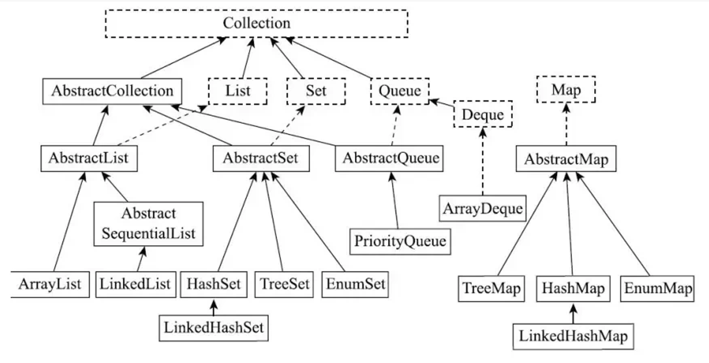

常见的一些 Java 集合类:

1. **ArrayList：** 动态数组，实现了List接口，支持动态增长。
2. **LinkedList：** 双向链表，也实现了List接口，支持快速的插入和删除操作。
3. **HashMap：** 基于哈希表的Map实现，存储键值对，通过键快速查找值。
4. **HashSet：** 基于HashMap实现的Set集合，用于存储唯一元素。
5. **TreeMap：** 基于红黑树实现的有序Map集合，可以按照键的顺序进行排序。
6. **TreeSet：** 通过TreeMap实现的，添加元素到集合时按照比较规则将其插入合适的位置，保证插入后的集合仍然有序。
7. **LinkedHashMap：** 基于哈希表和双向链表实现的Map集合，保持插入顺序或访问顺序。
8. **PriorityQueue：** 优先队列，可以按照比较器或元素的自然顺序进行排序。
9. **ConcurrentHashMap：** Node数组+链表+红黑树实现，线程安全的（jdk1.8以前Segment锁，1.8以后volatile + CAS 或者 synchronized）
10. **CopyOnWriteArrayList**：它是 ArrayList 的线程安全的变体，其中所有写操作（add，set等）都通过对底层数组进行全新复制来实现，允许存储 null 元素。即当对象进行写操作时，使用了Lock锁做同步处理，内部拷贝了原数组，并在新数组上进行添加操作，最后将新数组替换掉旧数组；若进行的读操作，则直接返回结果，操作过程中不需要进行同步。
11. **BlockingQueue**：主要功能并不是在于提升高并发时的队列性能，而在于简化多线程间的数据共享。BlockingQueue 提供一种读写阻塞等待的机制，即如果消费者速度较快，则 BlockingQueue 则可能被清空，此时消费线程再试图从 BlockingQueue 读取数据时就会被阻塞。反之，如果生产线程较快，则 BlockingQueue 可能会被装满，此时，生产线程再试图向 BlockingQueue 队列装入数据时，便会被阻塞等待。


### 1.1 ArrayList 相关面试题

#### 1 讲一下 java 里面 list 的几种实现，几种实现有什么不同？

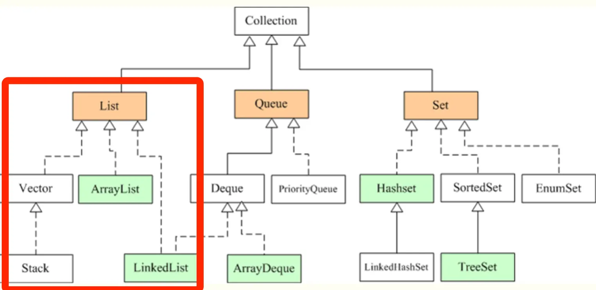

在 Java 中，List 接口是最常用的集合类型之一，用于存储元素的有序集合。以下是Java中常见的List 实现及其特点：

1. Vector 是 Java 早期提供的线程安全的动态数组，如果不需要线程安全，并不建议选择，毕竟同步是有额外开销的。Vector 内部是使用对象数组来保存数据，可以根据需要自动的增加容量，当数组已满时，会创建新的数组，并拷贝原有数组数据。
2. ArrayList 是应用更加广泛的动态数组实现，它本身不是线程安全的，所以性能要好很多。与 Vector 近似，ArrayList 也是可以根据需要调整容量，不过两者的调整逻辑有所区别，Vector 在扩容时会提高 1 倍，而ArrayList 则是增加 50%。
3. LinkedList 顾名思义是 Java 提供的双向链表，所以它不需要像上面两种那样调整容量，它也不是线程安全的。

这几种实现具体在什么场景下应该用哪种:

- Vector 和 ArrayList 作为动态数组，其内部元素以数组形式顺序存储的，所以非常适合随机访问的场合。除了尾部插入和删除元素，往往性能会相对较差，比如我们在中间位置插入一个元素，需要移动后续所有元素。
- 而 LinkedList 进行节点插入、删除却要高效得多，但是随机访问性能则要比动态数组慢。


#### 2 ArrayList 扩容源码分析

如下执行 `list.add(1)`  的执行原理是什么

```java
List<Integer> list = new ArrayList<Integer>();
list.add(1);
```

**ArrayList源码分析 - 成员变量：**

- **transisent Object[] elementData**
- **private int size**
- private static final int DEFAULF_CAPACITY = 10. 默认的初始容量
- private static final Object[] EMPTY_ELEMENTDATA = {} 空实例的共享空数组实例
- private static final Object[] DEFAULTCAPACITY_EMPTY_ELEMENTDATA = {} 用于默认大小的空实例的共享空数组实例

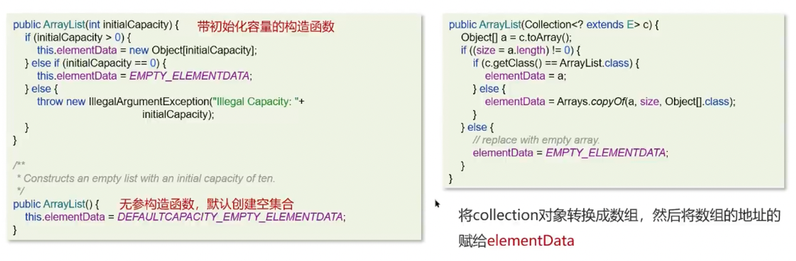

**ArrayList源码分析 - 构造函数：**

- 带初始化容量的构造函数
  - 容量 > 0，则创建初始容量
  - 容量 = 0，指向空实例的共享数组，指向 EMPTY_ELEMENTDATA
- 无参构造函数：默认创建空集合，指向 DEFAULTCAPACITY_EMPTY_ELEMENTDATA
- 使用 Collection 数组：
  - Collection 数组长度不为0：判断类型是否为 ArrayList，并将数组元素进行拷贝
  - Collection 数组长度为0：指向空实例的共享数组，指向 EMPTY_ELEMENTDATA

**可以看出：** 以无参数构造方法创建 ArrayList 时，实际上初始化赋值的是一个空数组。当真正对数组进行添加元素操作时，才真正分配容量。**即向数组中添加第一个元素时，数组容量扩为 10。**

**ArrayList 源码分析 - 添加和扩容操作（第一次添加数据）**

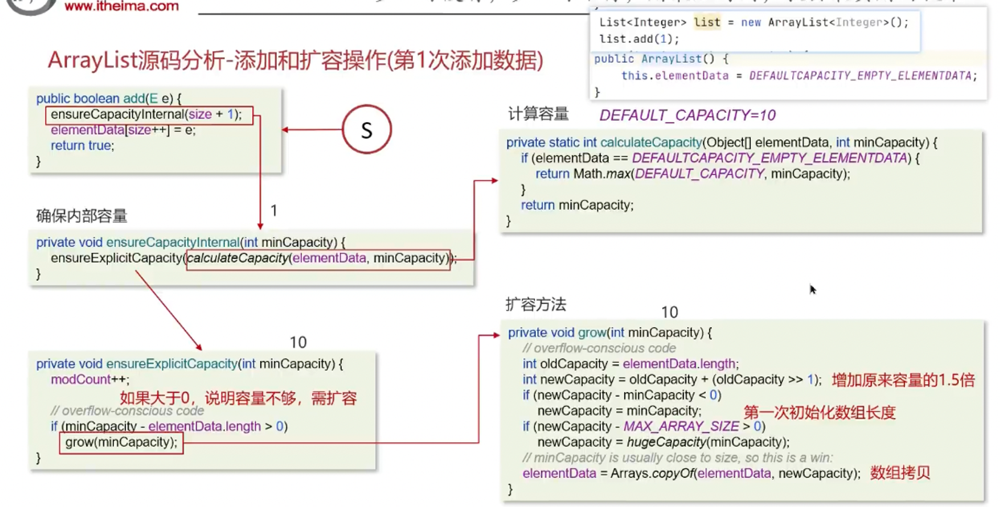

**ArrayList 源码分析 - 添加和扩容操作（第2-10次添加数据）**

- 由于第一次已经扩容到了 size = 10，所以第2-10次添加数据不会产生扩容
- 不会产生扩容

**ArrayList 源码分析 - 添加和扩容操作（第 11 次添加数据）**

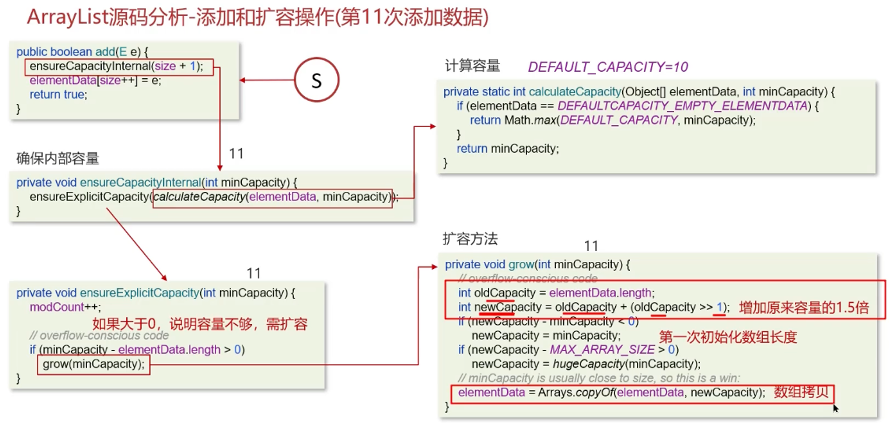

**ArrayList 底层的实现原理是什么**

- ArrayList 底层是用动态的数组实现的
- **ArrayList 初始容量为0，指向共享空数组，当第一次添加数据的时候才会初始化容量为10**
- ArrayList 在进行扩容的时候是原来容量的 1.5 倍，每次扩容都需要拷贝数组
- ArrayList 在添加数据的时候：
  - 确保数组已经使用 size + 1 来判断足够存入下一个数据
  - 计算数组的容量，如果当前数组已使用size + 1 之后大于当前数组长度，则调用 grow 方法扩容为原来的 1.5 倍
  - 确保新增的数据有地方存储之后，将新元素添加到 size 的位置山
  - 返回添加成功的 true


#### 3 ArrayList list = new ArrayList(10) 中的 list 扩容了几次

直接创建数组，并没有进行扩容


#### 4 数组与 List 之间的转换 (重要!!!)

**如何实现数组和 List 之间的转换!!!**

- 将数组转换成 List：调用 `Arrays.asList()`;
- 将List转换成数组：调用 `list.toArray(new String[list.size()])`

**用 Arrays.asList 转成 List 之后，如果修改了数组内容，list 受影响吗？**

- 修改原数组会受到影响，因为其内部仅仅是使用了对象的引用，不涉及创建新对象
- 其内部主要依赖 `E[] a = array` 来进行引用，数组和List中的 E[] a 指向同一个地址

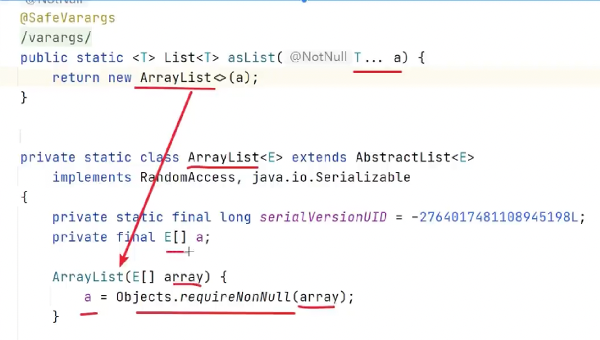

**List 用 toArray() 转成数组后，如果修改了 List 内容，数组受影响吗？**

- 修改原List不会受到影响，因为 `toArray` 内部调用了`System.arraycopy`  重新赋值到了新的数组中。

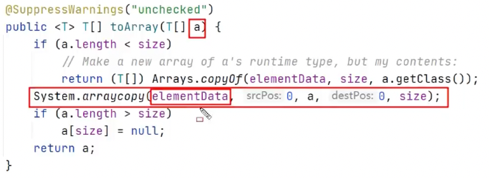


#### 5 ArrayList 和 LinkedList 的区别是什么

- 底层数据结构
  - ArrayList 是动态数组的数据结构
  - LinkedList 是双向链表的数据结构实现
- 操作数据效率
  - ArrayList 适用于查找较多的时候
  - LinkedList 适用头尾插入的情况
- 内存空间占用
  - ArrayList 底层是数组，内存连续，节省内存
  - LinkedList 是双向链表存储数据，以及两个指针，更占用内存
- 线程安全
  - 而这都是线程不安全的，但是 ArrayList  可以使用 CopyOnWriteList


#### 6 为什么 ArrayList 扩容要扩容 1.5 倍

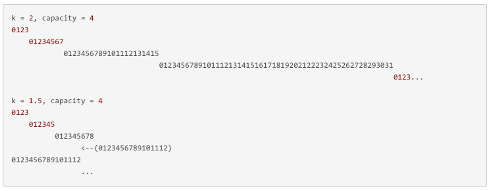

扩容 k=1.5 时，能避免了浪费过多空间，又防止了频繁扩容

**首先要明确两点：**

- 扩容容量不能太小，防止频繁扩容，频繁申请内存空间 + 数组频繁复制
- 扩容容量不能太大，需要充分利用空间，避免浪费过多空间

为什么不能扩容1.2倍、1.3倍：

- 因为1.5 可以充分利用**移位**操作，减少浮点数或者运算时间和运算次数。

为什么不扩容2倍：

- k >= 2，新容量刚刚好永远大于过去所有废弃的数组容量。


#### 7 ArrayList线程安全吗？把ArrayList变成线程安全有哪些方法？

不是线程安全的，ArrayList变成线程安全的方式有：

1. 使用 Collections 类的 synchronizedList 方法将 ArrayList 包装成线程安全的 List
2. 使用 CopyOnWriteArrayList 类代替 ArrayList，它是一个线程安全的List实现
3. 使用 Vector 类代替ArrayList，Vector 是线程安全的 List 实现


#### 8 为什么ArrayList不是线程安全的，具体来说是哪里不安全？

在高并发添加数据下，ArrayList 会暴露**三个**问题;

1. 部分值为null（我们并没有add null进去）
2. 索引越界异常
3. size 与我们 add 的数量不符

为了知道这三种情况是怎么发生的，ArrayList，add 增加元素的代码如下：

```java
public boolean add(E e) {
	ensureCapacityInternal(size + 1); // Increments modCount!!
	elementData[size++] = e;
  return true;
}
```

ensureCapacityInternal()这个方法的详细代码我们可以暂时不看，它的作用就是如果size + 1的这个需求长度大于了elementData这个数组的长度，那么就要对这个数组进行扩容。add 方法大体分为三步:

1. 判断数组需不需要扩容，如果需要的话，调用grow方法进行扩容；
2. 将数组的size位置设置值（因为数组的下标是从0开始的）；
3. 将当前集合的大小加1, 执行 size++( 注意 size++ 本身也不是原子操作)

下面我们来分析三种情况都是如何产生的：

1. 部分值为null：当线程1走到了扩容那里发现当前size是9，而数组容量是10，所以不用扩容，这时候cpu让出执行权，线程2也进来了，发现size是9，而数组容量是10，所以不用扩容，这时候线程1继续执行，将数组下标索引为9的位置set值了，还没有来得及执行size++，这时候线程2也来执行了，又把数组下标索引为9的位置set了一遍，这时候两个先后进行size++，导致下标索引10的地方就为null了。
2. 索引越界异常：线程1走到扩容那里发现当前size是9，数组容量是10不用扩容，cpu让出执行权，线程2也发现不用扩容，这时候数组的容量就是10，而线程1 set完之后size++，这时候线程2再进来size就是10，数组的大小只有10，而你要设置下标索引为10的就会越界（数组的下标索引从0开始）；
3. size与我们add的数量不符：因为size++本身就不是原子操作，可以分为三步：获取size的值，将size的值加1，将新的size值覆盖掉原来的，线程1和线程2拿到一样的size值加完了同时覆盖，就会导致一次没有加上，所以肯定不会与我们add的数量保持一致的；


#### 9 ArrayList的扩容机制说一下

ArrayList在添加元素时，如果当前元素个数已经达到了内部数组的容量上限，就会触发扩容操作。ArrayList的扩容操作主要包括以下几个步骤：

1. 计算新的容量：一般情况下，新的容量会扩大为原容量的1.5倍, 然后检查是否超过了最大容量限制。
2. 创建新的数组：根据计算得到的新容量，创建一个新的更大的数组。
3. 将元素复制：将原来数组中的元素逐个复制到新数组中。
4. 更新引用：将ArrayList内部指向原数组的引用指向新数组。
5. 完成扩容：扩容完成后，可以继续添加新元素。

ArrayList的扩容操作涉及到数组的复制和内存的重新分配，所以在频繁添加大量元素时，扩容操作可能会影响性能。为了减少扩容带来的性能损耗，可以在初始化ArrayList时预分配足够大的容量，避免频繁触发扩容操作。

之所以扩容是 1.5 倍，是因为 1.5 可以充分利用**移位操作**，减少浮点数或者运算时间和运算次数。


### 1.2 HashMap 相关面试题

#### 1 红黑树与二叉树

HashMap底层使用的数据结构：

- 红黑树
- 散列表
- 链表

**讲一讲你对二叉树的认识**

- 每个节点有两个子节点：左子节点和右子节点
- 二叉树有两种实现方式：可以使用数组存储也可以使用链式存储
- 二叉树的分类有：满二叉树，完全二叉树，二叉搜索树，红黑树
- 二叉搜索树的缺点：对于左右子树极不平衡的情况下，二叉搜索树就会退化成链表，此时查找的时间复杂度为O(n)

**讲一讲你对红黑树的认识**

红黑树也是一种自平衡的二叉搜索树，红黑树的性质如下：**黑路同，根叶黑，不红红**

- 性质1：节点要么是红色，要么是黑色
- 性质2：根节点是黑色
- 性质3：叶子结点都是黑色的空节点
- 性质4：红黑树中红色节点的子节点都是黑节点
- 性质5：从任意节点到子节点的所有路径都包含相同数目的黑色路径

在添加或者删除节点的时候，如果不符合这些性质，会发生对应的旋转，以保证红黑树的平衡。


#### 2 Hash 表

 散列表又名哈希表，是根据键(key) 直接访问在内存存储位置值(value) 的数据结构，它是由数组演化而来的，利用了数组支持按照下标进行随机访问的特性。

- 将键(key)映射为数组下标的函数叫做散列函数
- 如果键相等，则经过hash之后的哈希值也必须相同

解决 Hash 冲突的办法：

1. 拉链法，使用链表存储多个数据
   - 平均情况下，基于链表法解决冲突时查询的时间复杂度为O(1)
   - 拉链法可能会退化为链表，查询的时间复杂度可能从O(1)退化成为O(n)
   - 将链表法中的链表改造为其他高效的动态数据结构，比如红黑树，可以稳定在O(logn)
2. 开放寻址法：在哈希表中找到另一个可用的位置来存储冲突的键值对，而不是存储在链表中。
3. 再哈希法（Rehashing）：当发生冲突时，使用另一个哈希函数再次计算键的哈希值，直到找到一个空槽来存储键值对。
4. 哈希桶扩容：当哈希冲突过多时，可以动态地扩大哈希桶的数量，重新分配键值对，以减少冲突的概率。


#### 3 HashMap 实现原理

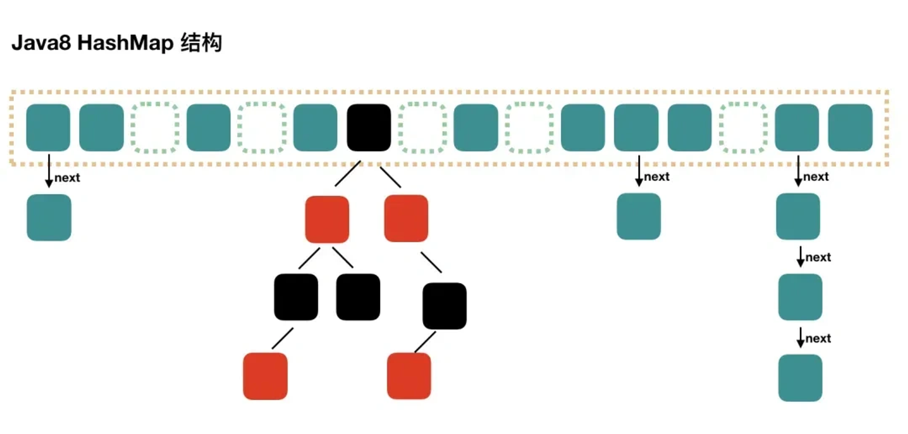

HashMap底层使用 hash 表的数据结构，即数组和链表或者红黑树

- 当我们往 HashMap 中 put 元素时，利用 key 的 hashCode 重新 hash 计算出当前对象的元素在数组中的下标
  - 如何计算数组下标：调用 key.hashCode() 并进行异或运算
    - `h = (key.hashCode()) ^ (h >>> 16)`
- 存储时，如果出现 hash 值相同的 key，此时有两种情况
  - 如果 key 相同，则覆盖原始值
  - 如果 key 不相同，则将当前的 key-value 放入链表或者红黑树中
  - 链表的长度大于 8 但是数组长度小于 64 时，优先进行数组扩容
  - 链表的长度大于 8 且数组长度大于 64 时，转换成红黑树
- 获取数据时，直接找到 hash 值对应的下标，再进一步**判断 key 是否相同**，从而找到对应值

**HashMap的 JDK1.7 与 JDK1.8 有什么区别**

- JDK1.8 之前采用的是拉链法。拉链法：将链表和数组相结合，也就是创建一个数组链表，数组中的每一格就是一个链表。若遇到哈希冲突，则将冲突的值加入到链表中即可。
- JDK1.8 在解决哈希冲突时有了较大的变化，当链表长度大于阈值(8)时并且数组长度达到 64 时，将链表转化为红黑树，以减少搜索时间。扩容 resize() 的时候，红黑树拆分成的树的节点数小于临界点 6 个，则会退化成链表。
- 将链表改为红黑树还有一个非常重要的原因，即可以防止DDOS攻击
  - DDOS即分布式拒绝服务攻击，指位于不同位置的多个攻击者同时对一个或者多个目标发动攻击，由于攻击的发出点是分布在不同地方的，这类攻击被称为分布式拒绝服务攻击
  - 使用红黑树可以避免大量链表导致查询效率过低，提升HashMap的查询效率

**HashMap 中的 put 方法的具体流程**

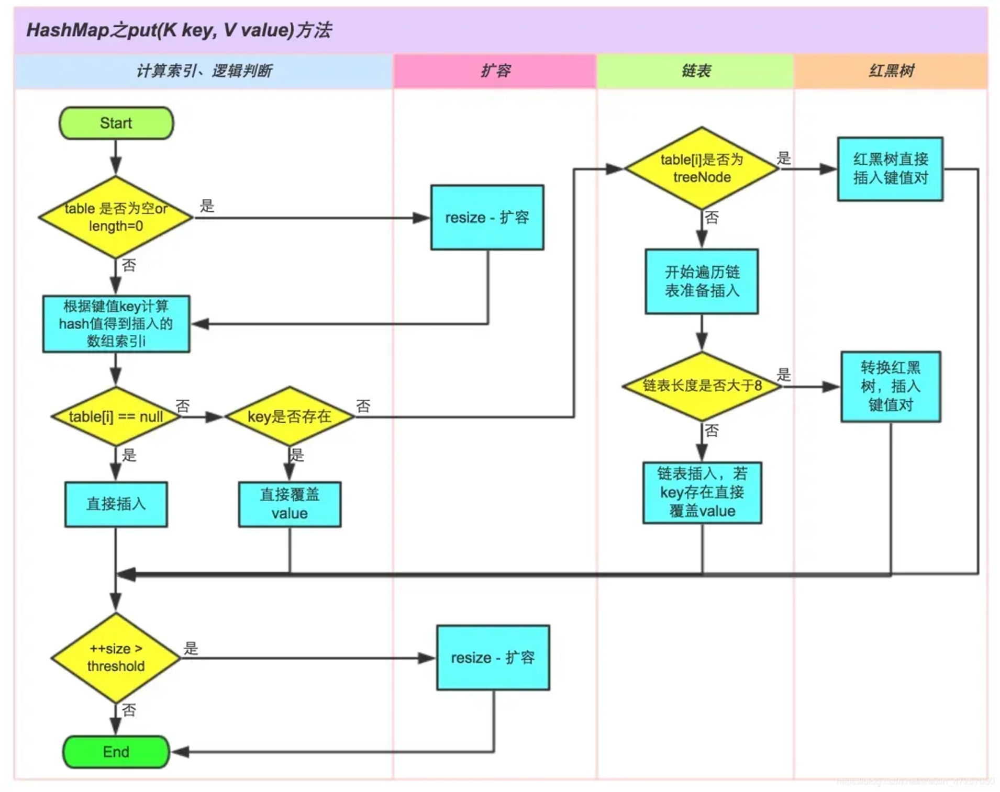

- 第一步：根据要添加的键的哈希码计算在数组中的位置（索引）。
- 第二步：检查该位置是否为空（即没有键值对存在）
  - 如果为空，则直接在该位置创建一个新的Entry对象来存储键值对。
  - 将要添加的键值对作为该Entry的键和值，并保存在数组的对应位置。
  - 将HashMap的修改次数（modCount）加1，以便在进行迭代时发现并发修改。
- 第三步：如果该位置已经存在其他键值对，检查该位置的第一个键值对的哈希码和键是否与要添加的键值对相同？
  - 如果相同，则表示找到了相同的键，直接将新的值替换旧的值，完成更新操作。
- 第四步：第一个键值对的哈希码和键不相同，则需要遍历链表或红黑树来查找是否有相同的键：
  - 如果键值对集合是链表结构：
    - 从链表的头部开始逐个比较键的哈希码和equals()方法，直到找到相同的键或达到链表末尾。
    - 如果找到了相同的键，则使用新的值取代旧的值，即更新键对应的值。
    - 如果没有找到相同的键，则将新的键值对添加到链表的头部。
  - 如果键值对集合是红黑树结构：
    - 在红黑树中使用哈希码和equals()方法进行查找。根据键的哈希码，定位到红黑树中的某个节点，然后逐个比较键，直到找到相同的键或达到红黑树末尾。
    - 如果找到了相同的键，则使用新的值取代旧的值，即更新键对应的值。
    - 如果没有找到相同的键，则将新的键值对添加到红黑树中。
- 第五步：检查链表长度是否达到阈值（默认为8）：
  - 如果链表长度超过阈值，且HashMap的数组长度大于等于64，则会将链表转换为红黑树，以提高查询效率。
- 第六步：检查负载因子是否超过阈值（默认为0.75）：
  - 如果键值对的数量（size）与数组的长度的比值大于阈值，则需要进行扩容操作。
- 第七步：扩容操作：
  - 创建一个新的两倍大小的数组。
  - 将旧数组中的键值对重新计算哈希码并分配到新数组中的位置。
  - 更新HashMap的数组引用和阈值参数。
- 第八步：完成添加操作。

需要注意的是，**HashMap中的键和值都可以为null**。此外，HashMap是非线程安全的，如果在多线程环境下使用，需要采取额外的同步措施或使用线程安全的ConcurrentHashMap。

HashMap的 put 方法的具体流程：

- HashMap中的常见属性：
  - static final int DEFAULT_INITIAL_CAPACITY = 1 << 4：默认初始容量 = 16
  - static final float DEFAULT_LOAD_FACTOR = 0.75f：默认的加载因子
  - transient HashMap.Node<K,V>[] table;
  - transient int size：哈希表中的个数

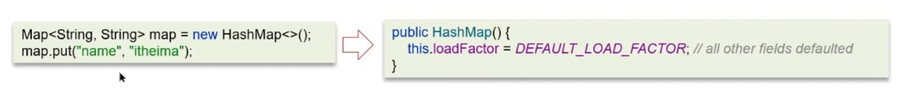

- HashMap源码分析：
  - **HashMap 是懒惰加载，在创建对象时并没有初始化数组**
  - 在无参的构造函数中，设置了默认的加载因子是0.75

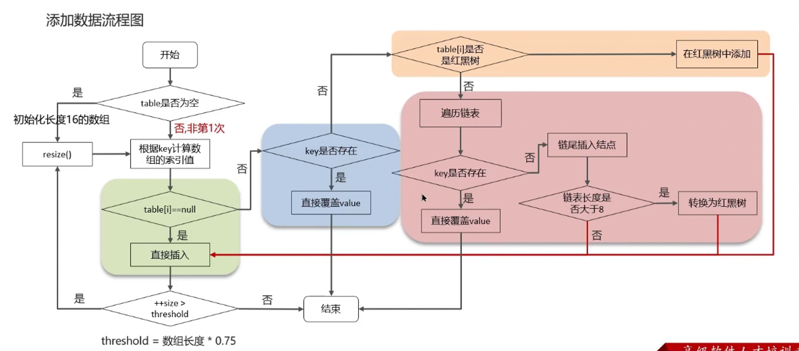

具体流程：

- **判断数组table是否为空或者为null，如果为空则执行 resize() 进行扩容（初始化）**
- 根据键值 key 计算 hash 值得到数组索引
  - 原始哈希
  - 二次哈希
  - 桶下标
- 判断 table[i] == null，条件成立，直接新建节点添加
- 如果 table[i] ≠ null，则条件不成立
  - 判断 table[i] 的首个元素是否和 key 一样，如果相同直接覆盖 value
  - 判断 table[i] 是否为 treeNode，即 table[i] 是否为红黑树，如果是红黑树，则直接在树中插入键值对
  - 遍历 table[i]，链表的尾部插入数据，然后判断链表长度是否大于 8， 大于 8 的话把链表转换成红黑树，在红黑树中执行操作，遍历过程中若发现 key 已经存在则直接覆盖 value
- 插入成功后，判断实际存在的**键值对数量 size** 是否超过了最大容量 threshold（数组长度 * 0.75），如果超过则进行扩容


#### 4 讲一讲 HashMap 的扩容机制（重点）

hashMap默认的负载因子是0.75，即如果hashmap中的元素个数超过了总容量75%，则会触发扩容，扩容分为两个步骤：

1. **第1步**是对哈希表长度的扩展（2倍）
2. **第2步**是将旧哈希表中的数据放到新的哈希表中。

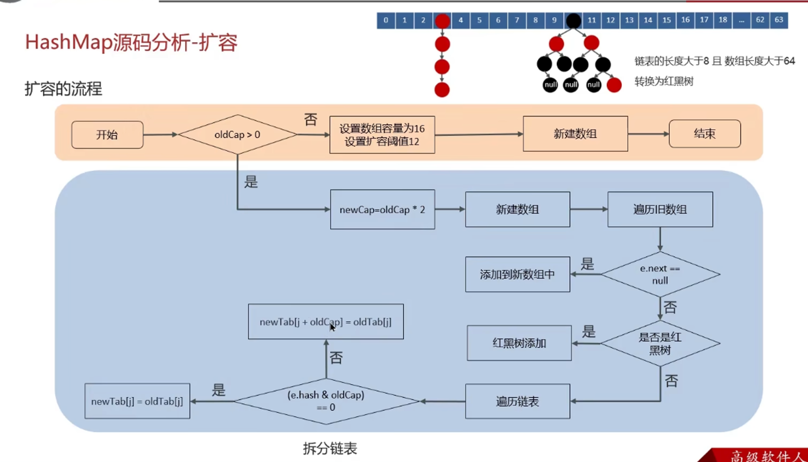

具体流程：

- 在添加元素或者初始化的时候需要调用扩容 resize 方法进行扩容，第一次添加数据初始化数组长度为 16，以后每次扩容都是达到了扩容阈值(数组长度 * 0.75)
- 每次扩容的时候，都是扩容之前容量的两倍
- 扩容之后，会创建一个新数组，需要把老数组中的数据挪动到新数组中
  - 没有 hash 冲突的节点，则直接使用 e.hash & (newCap - 1) 计算新数组的索引位置
  - 如果是红黑树，走红黑树的添加逻辑
  - 如果是链表，则需要进行链表拆分，判断 **e.hash & oldCap** 是否为 0，该元素的位置要么停留在原始位置，要么移动到（原始位置 + 增加的数组大小）这个位置上

值得注意的是, 因为我们使用的是2次幂的扩展(指长度扩为原来2倍)，所以，元素的位置要么是在原位置，要么是在原位置再移动2次幂的位置。

如我们从16扩展为32时，具体的变化如下所示：

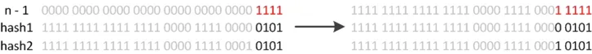

因此元素在重新计算hash之后，因为n变为2倍，那么n-1的mask范围在高位多1bit(红色)，因此新的index就会发生这样的变化：

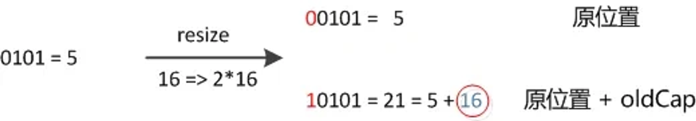

因此，我们在扩充HashMap的时候，不需要重新计算hash，只需要看看原来的hash值新增的那个bit是1还是0就好了，是0的话索引没变，是1的话索引变成“原索引+oldCap”。可以看看下图为16扩充为32的resize示意图：

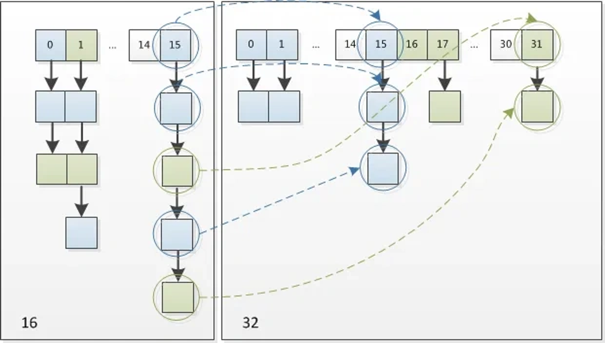

这个设计确实非常的巧妙，既省去了重新计算hash值的时间，而且同时，由于新增的1bit是0还是1可以认为是随机的，因此resize的过程，均匀的把之前的冲突的节点分散到新的bucket了。


#### 5 讲一讲 HashMap 的寻址算法（重点） 二次哈希 + 与运算

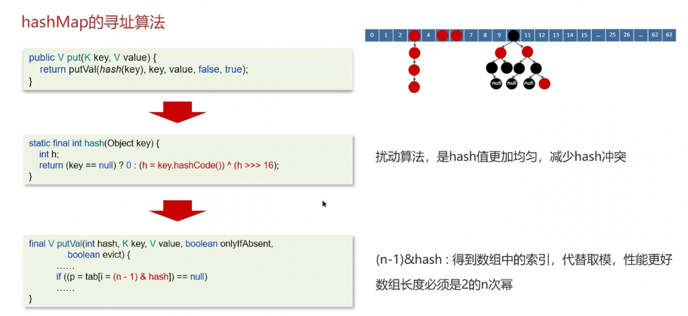

- 即如何定位某个对象的索引（桶下标）

  - 当调用 put 方法的时候 → 会调用 putVal(hash(key), key, value)

    - 其中 h = (key.hashCode()) ^ (h >>> 16) 被称为

      二次哈希

      - 先讲 hash 值右移 16 位
      - 再将 hash 值与右移 16 位的值进行异或运算得到二次哈希值

    - 当得到二次哈希之后，使用与运算进行取模运算，不使用 % 运算

      - (capacity - 1) & hash  n 必须是 2 的次方幂

  原因：如果直接使用 key.hashCode() % 16  通过实验证明：

  - 如果数据分布比较平均的话，则可以比较平均的将数字存放在不同的下标中
  - 如果数据分布不平均的话，则不能平均的将数字放在不同的下标中

  **所以，HashMap中使用 h = (key.hashCode()) ^ (h >>> 16) 使哈希值更加均匀**

  - 采用扰动算法，使哈希值更加均匀，减少哈希冲突


#### 6 为何 HashMap 的数组长度是 2 的n次幂？ - 能够使用位运算代替取模

1. **计算桶下标效率更高**：计算索引时效率更高，因为如果是 2 的 n 次幂可以使用位与运算代替取模 (n - 1) & hash
2. 扩容时重新计算索引效率更高：扩容时重新计算索引效率更高， hash & oldCap = 0 的元素留在原来位置，否则新位置 = 旧位置 + oldCap
   - 其实就是取 hash 的高一位，来判断元素是否需要移动位置
   - 扩容时重新计算索引效率更高


#### 7 往 hashMap 中存 20 个元素, 会扩容几次?

当插入 20 个元素时，HashMap 的扩容过程如下：

1. 初始容量：16
   1. 插入第 1 到第 12 个元素时，不需要扩容。
   2. 插入第 13 个元素时，达到负载因子限制，需要扩容。此时，HashMap 的容量从 16 扩容到 32。
2. 扩容后的容量：32
   1. 插入第 14 到第 24 个元素时，不需要扩容。

因此，总共会进行一次扩容。


#### 8 讲一讲 HashMap 在1.7情况下多线程死循环问题

HashMap 之所以在并发下的扩容造成死循环，是因为多个线程并发进行时，因为：

- 一个线程先期完成了扩容，将原 Map 的链表重新散列到自己的表中，并且链表变成了倒序
- 后一个线程再扩容时，又进行自己的散列，再次将倒序链表变为正序链表
- 于是形成了一个环形链表，两种场景造成死循环：
  - 在扩容场景后面的元素移动过程中，造成死循环。
  - 由于环形链表的存在，在后面 get 表中不存在的元素时，也造成死循环。

JDK7 的数据结构是：数组 + 链表

在数组进行扩容的时候，因为链表是**头插法**，在进行数据迁移的过程中，有可能导致死循环

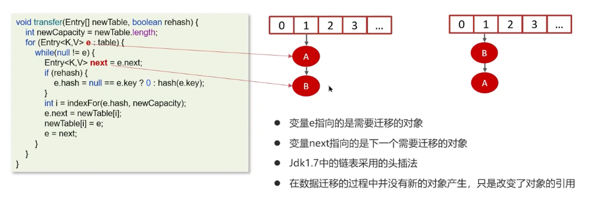

- 由于使用了头插法，所以链表上的元素顺序会进行反转

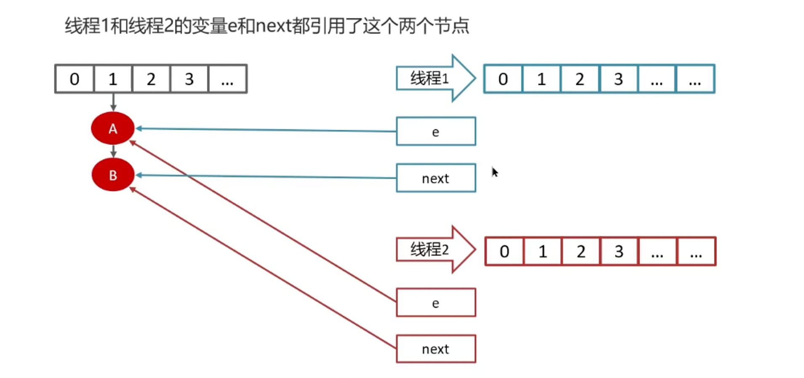

**第一步：对于原来 HashMap 中链表上的元素：**

- 线程 1 ：Entry-e 指向了链表元素 A，Entry-next 指向了链表元素 B
- 线程 2 ：Entry-e 指向了链表元素 A，Entry-next 指向了链表元素 B
- 线程2 抢到了时间片，对数组进行了扩容，由于使用了头插法

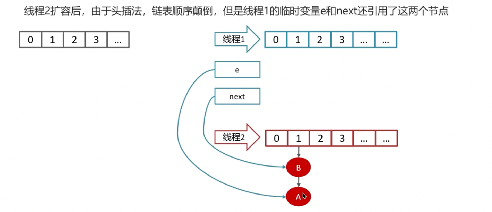

**第二步 第一次循环：线程1抢占时间片，对数组扩容，继续使用头插法，发生死锁**

- 线程 1 ：Entry-e 指向了链表元素 A，Entry-next 指向了链表元素 B
- 将 A 进行迁移，这时 e 就指向了 next 标记的位置，即 e 也指向了 B
- 同时将 next 进行更改， next 指向了 B 之后的元素 A 的位置

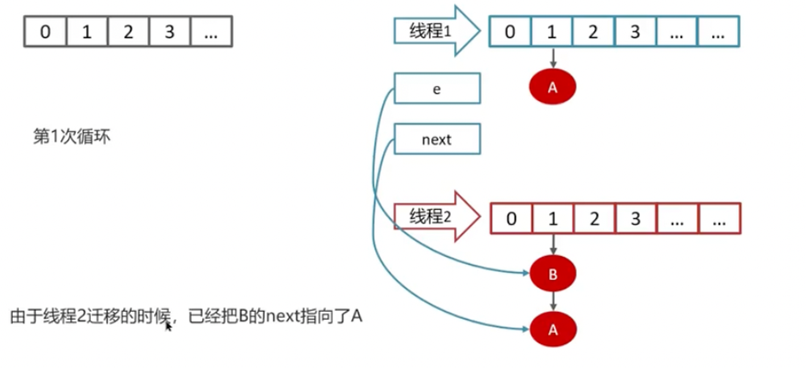

**第三步 第二次循环：**

- 将 B 利用头插法插入到上面
- 此时 e 指向了 A
- 之后 next 指向了 null

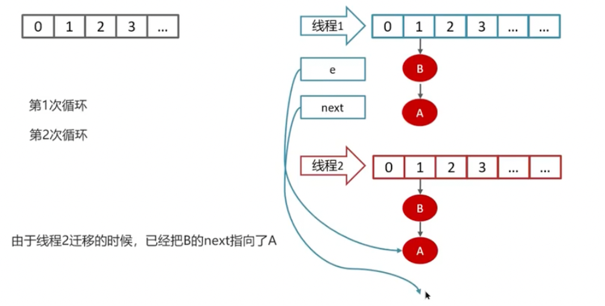

**第四步 第三次循环：**

- 由于 e 指向了 A，那么还是要对A进行头插法
- 此时利用头插法，就发生了死循环，如下图所示

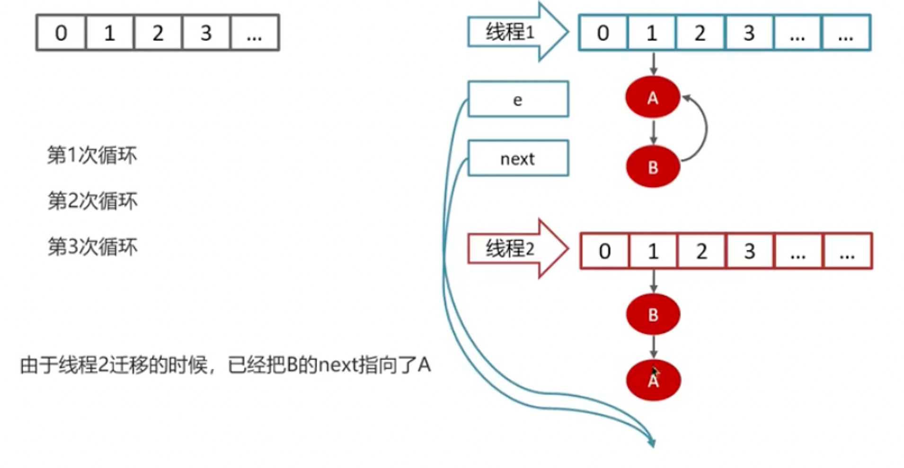

在 JDK 8 中，将扩容算法做了调整，不再将元素加入链表头，而是使用**尾插法**解决了死循环的问题。


#### 9 重写HashMap的equal和hashcode方法需要注意什么？

HashMap使用Key对象的 hashCode() 和 equals() 方法去决定key-value对的索引。当我们试着从HashMap中获取值的时候，这些方法也会被用到。

如果这些方法没有被正确地实现，两个不同Key也许会产生相同的hashCode()和equals()输出，HashMap将会认为它们是相同的，然后覆盖它们，而非把它们存储到不同的地方。

equals()和hashCode()的实现应该遵循以下规则：

- 如果o1.equals(o2)，那么o1.hashCode() == o2.hashCode()总是为true的。
- 如果o1.hashCode() == o2.hashCode()，并不意味着o1.equals(o2)会为true。


#### 10 重写HashMap的equal方法不当会出现什么问题？

重写了equals方法，不重写hashCode方法时，可能会出现equals方法返回为true，而hashCode方法却返回false，这样的一个后果会导致在hashmap等类中存储多个一模一样的对象，导致出现覆盖存储的数据的问题，这与hashmap只能有唯一的key的规范不符合


#### 11 列举HashMap在多线程下可能会出现的问题？

hashmap不是线程安全的，hashmap在多线程会存在下面的问题：

- JDK1.7中的 HashMap 使用头插法插入元素，在多线程的环境下，扩容的时候有可能导致环形链表的出现，形成死循环。因此，JDK1.8使用尾插法插入元素，在扩容时会保持链表元素原本的顺序，不会出现环形链表的问题。
- 多线程同时执行 put 操作，如果计算出来的索引位置是相同的，那会造成前一个 key 被后一个 key 覆盖，从而导致元素的丢失。此问题在JDK 1.7和 JDK 1.8 中都存在。

如果要保证线程安全，可以通过这些方法来保证：

1. 多线程环境可以使用Collections.synchronizedMap同步加锁的方式
2. 使用HashTable，但是同步的方式显然性能不达标
3. ConurrentHashMap更适合高并发场景使用


#### 12 HashMap 调用 get 方法一定安全吗?

不是，调用 get 方法有几点需要注意的地方：

1. **空指针异常（NullPointerException）**：如果你尝试用 null 作为键调用get 方法，而 HashMap 没有被初始化（即为 null），那么会抛出空指针异常。不过，如果 HashMap 已经初始化，使用 null 作为键是允许的，因为 HashMap 支持 null 键。
2. **线程安全**：HashMap 本身不是线程安全的。如果在多线程环境中，没有适当的同步措施，同时对 HashMap 进行读写操作可能会导致不可预测的行为。例如，在一个线程中调用 get 方法读取数据，而另一个线程同时修改了结构（如增加或删除元素），可能会导致读取操作得到错误的结果或抛出ConcurrentModificationException。如果需要在多线程环境中使用类似 HashMap 的数据结构，可以考虑使用 ConcurrentHashMap。


#### 13 HashMap一般用什么做Key？为啥String适合做Key呢？

用 string 做 key，因为 String对象是不可变的，一旦创建就不能被修改，这确保了Key的稳定性。如果Key是可变的，可能会导致hashCode和equals方法的不一致，进而影响HashMap的正确性。


#### 14 为什么HashMap要用红黑树而不是平衡二叉树？

1. 平衡二叉树追求的是一种 **“完全平衡”** 状态：任何结点的左右子树的高度差不会超过 1，优势是树的结点是很平均分配的。每次进行插入/删除节点的时候，几乎都会破坏平衡树的第二个规则，进而我们都需要通过**左旋**和**右旋**来进行调整，使之再次成为一颗符合要求的平衡树。
2. 红黑树不追求这种完全平衡状态，而是追求一种 **“弱平衡”** 状态：整个树最长路径不会超过最短路径的 2 倍。优势是虽然牺牲了一部分查找的性能效率，是能够换取一部分维持树平衡状态的成本。
3. 与平衡树不同的是，红黑树在插入、删除等操作，**不会像平衡树那样，频繁着破坏红黑树的规则，所以不需要频繁调整**，这也是我们为什么大多数情况下使用红黑树的原因。


#### 15 hashmap key可以为null吗？

可以为 null。

1. hashMap中使用hash()方法来计算key的哈希值，当key为空时，直接另key的哈希值为0，不走key.hashCode()方法；
2. hashMap虽然支持key和value为null，但是null作为key只能有一个，null作为value可以有多个；
3. 因为hashMap中，如果key值一样，那么会覆盖相同key值的value为最新，所以key为null只能有一个。


#### 16 说说 hashMap 的扩容因子

HashMap 负载因子 loadFactor 的默认值是 0.75，当 HashMap 中的元素个数超过了容量的 75% 时，就会进行扩容。

1. 默认负载因子为 0.75，是因为它提供了空间和时间复杂度之间的良好平衡。
2. 负载因子太低会导致大量的空桶浪费空间
3. 负载因子太高会导致大量的碰撞，降低性能。


#### 17 hashMap 和 hashTable 有什么不一样的地方? 

- **HashMap线程不安全**，效率高一点, 默认初始容量为16，每次扩充变为原来2倍。
- **HashTable线程安全**，效率低一点，其内部方法基本都经过synchronized修饰，不可以有null的key和value。默认初始容量为11，每次扩容变为原来的2n+1。底层数据结构为数组+链表


### 1.3 ConcurrentHashMap - 并发

#### 1 ConcurrentHashMap 如何实现并发安全

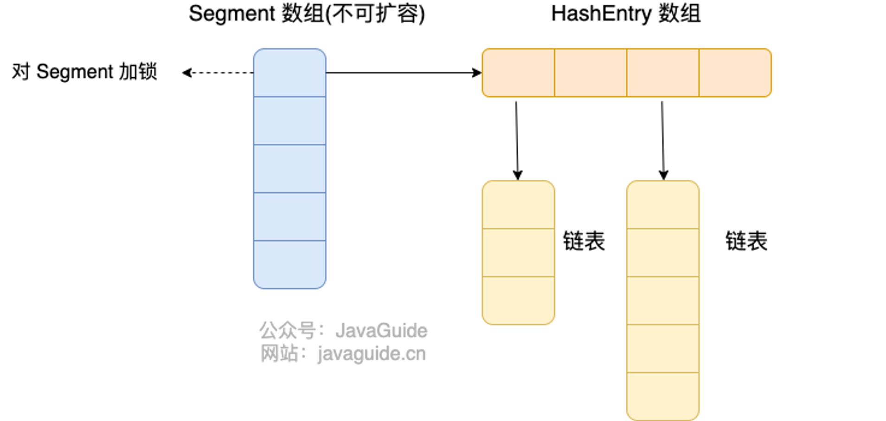


**JDK 1.7 实现线程安全：**

- 首先将数据分为 Segment，每个 Segment 配一把锁，当一个线程占用锁访问其中一个段数据时，其他 Segment 的数据也能被其他线程访问。

- Segment 继承了 ReentrantLock, 所以 Segment 是一种可重入锁，扮演锁的角色

- Segment 默认初始个数为 16 个，一旦初始化就不能改变，默认同时支持 16 个线程并发写，Segment 中的 Entry 结构和 HashMap 中类似

- 使用分段数组 + 链表实现的逻辑如下：

  - 使用 map.put() 方法时，通过 hash(key) 找到对应的 Segment 分段

  - 使用 ReentrantLock（底层基于 AQS+CAS） 的方式

    尝试获取分段锁

    - 如果获取锁失败，则使用 AQS 进行排队等待，阻塞获取锁
    - 且 Segment 不可扩容，导致效率较低

  - 成功获取分段锁之后再通过 hash(key) 定位在 hasEntry 数组中的下标

**JDK 1.8 实现线程安全：**

- 采用 Node + CAS + synchronized 来保证并发安全。
- Java 8 中，锁粒度更细，synchronized 只锁定当前链表或红黑二叉树的首节点，这样只要 hash 不冲突，就不会产生并发，就不会影响其他 Node 的读写，效率大幅提升。
- 主要通过 volatile + CAS 或者 synchronized 来实现的线程安全的, 添加元素时首先会判断容器是否为空：
  - 如果为空则使用 volatile 加 CAS 来初始化容器
  - 如果容器不为空，则根据存储的元素计算该位置是否为空
    - 如果根据存储的元素计算结果为空，则利用 CAS 设置该节点
    - 如果根据存储的元素计算结果不为空，则使用 synchronized ，然后，遍历桶中的数据，并替换或新增节点到桶中，最后再判断是否需要转为红黑树，这样就能保证并发访问时的线程安全了。

如果把上面的执行用一句话归纳的话，就相当于是ConcurrentHashMap通过对头结点加锁来保证线程安全的，锁的粒度相比 Segment 来说更小了，发生冲突和加锁的频率降低了，并发操作的性能就提高了。


#### 2 ConcurrentHashMap 中的 put 方法如何执行? 

1. 哈希: 对传入的键的哈希值进行散列，这有助于减少哈希冲突的可能性。使用 spread 方法可以保证不同的键更均匀地分布在桶数组中。
2. 直接查找: 查找的第一步是检查键的哈希值是否位于表的正确位置。如果在该桶的第一个元素中找到了键，则直接返回该元素的值。这里使用了 == 操作符和 equals 方法来比较键，这有助于处理可能的 null 值和确保正确的相等性比较。
3. 红黑树查找: 如果第一个节点的哈希值小于 0，那么这个桶的数据结构是红黑树（Java 8 引入了树化结构来改进链表在哈希冲突时的性能）。在这种情况下，使用 find 方法在红黑树中查找键。
4. 链表查找: 如果前两个条件都不满足，那么代码将遍历该桶中的链表。如果在链表中找到了具有相同哈希值和键的元素，则返回其值。如果遍历完整个链表都未找到，则返回 null。


#### 3 ConcurrentHashMap 中的 transfer 方法

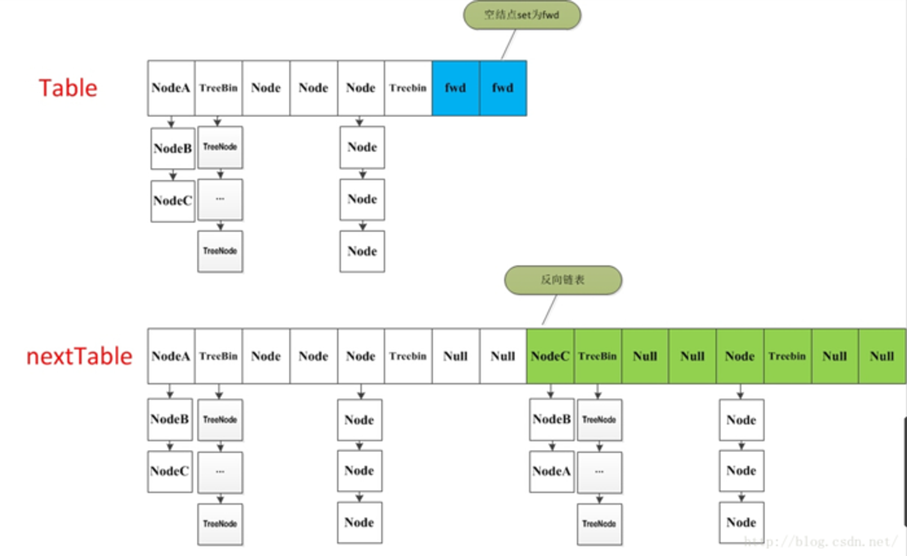


当 ConcurrentHashMap 容量不足的时候，需要对 table 进行扩容。这个方法的基本思想跟 HashMap 很像，但由于支持并发扩容，所以要复杂一些。

整个扩容操作分为**两个部分**：

**第一部分**是构建一个 nextTable，它的容量是原来的两倍，这个操作是单线程完成的。

**第二个部分**是将原来 table 中的元素复制到 nextTable 中，主要是遍历复制的过程。

得到当前遍历的数组位置 i，然后利用 tabAt 方法获得 i 位置的元素，主要利用到了 CAS：

1. 如果这个位置为空，就在原 table 中的 i 位置放入 forwardNode 节点，这个也是触发并发扩容的关键；
2. 如果这个位置是 Node 节点（fh>=0），并且是链表的头节点，就把这个链表分裂成两个链表，把它们分别放在 nextTable 的 i 和 i+n 的位置上；
3. 如果这个位置是 TreeBin 节点（fh<0），也做一个反序处理，并且判断是否需要 untreefi，把处理的结果分别放在 nextTable 的 i 和 i+n 的位置上；
4. 遍历所有的节点，就完成复制工作，这时让 nextTable 作为新的 table，并且更新 sizeCtl 为新容量的 0.75 倍 ，完成扩容。


#### 4 分段锁是怎么加锁的? 

在 ConcurrentHashMap 中，将整个数据结构分为多个 Segment，每个 Segment 都类似于一个小的 HashMap，每个 Segment 都有自己的锁，不同 Segment 之间的操作互不影响，从而提高并发性能。

在 ConcurrentHashMap 中，对于插入、更新、删除等操作，需要先定位到具体的Segment，然后再在该 Segment 上加锁，而不是像传统的 HashMap 一样对整个数据结构加锁。这样可以使得不同 Segment 之间的操作并行进行，提高了并发性能。


#### 5 分段锁是可重入的吗？

JDK 1.7 ConcurrentHashMap中的分段锁是用了 ReentrantLock，是一个可重入的锁。


#### 6 已经用了synchronized，为什么还要用CAS呢？

ConcurrentHashMap 使用这两种手段来保证线程安全主要是一种权衡的考虑，在某些操作中使用synchronized，还是使用 CAS，主要是根据锁竞争程度来判断的。

1. **元素较少的时候:** 在 putVal 中，如果计算出来的 hash 槽没有存放元素，那么就可以直接使用 CAS 来进行设置值，这是因为在设置元素的时候，因为 hash 值经过了各种扰动后，**造成 hash 碰撞的几率较低**，那么我们可以预测使用较少的自旋来完成具体的 hash 落槽操作。
2. **元素较多的时候:** 当**发生了 hash 碰撞的时候说明容量不够用了或者已经有大量线程访问**了，因此这时候使用 synchronized 来处理 hash 碰撞比 CAS 效率要高，因为发生了 hash 碰撞大概率来说是线程竞争比较强烈。


#### 7 ConcurrentHashMap用了悲观锁还是乐观锁?

悲观锁和乐观锁**都有用到**。添加元素时首先会判断容器是否为空：

1. 如果为空则使用 volatile 加 **CAS （乐观锁）** 来初始化。
2. 如果容器不为空，则根据存储的元素计算该位置是否为空。
3. 如果根据存储的元素计算结果为空，则利用 **CAS（乐观锁）** 设置该节点；
4. 如果根据存储的元素计算结果不为空，则使用 **synchronized（悲观锁）** ，然后，遍历桶中的数据，并替换或新增节点到桶中，最后再判断是否需要转为红黑树，这样就能保证并发访问时的线程安全了。


#### 8 HashTable 底层实现原理是什么？

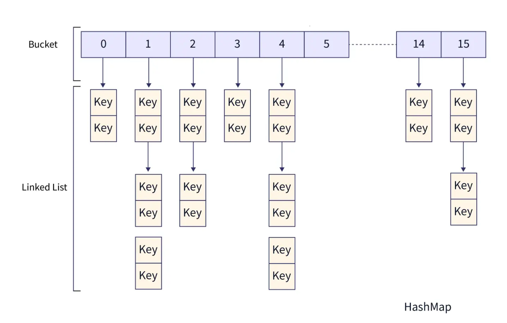

Hashtable的底层数据结构主要是数组加上链表，数组是主体，链表是解决hash冲突存在的。

HashTable是线程安全的，实现方式是**Hashtable的所有公共方法均采用synchronized关键字**，当一个线程访问同步方法，另一个线程也访问的时候，就会陷入阻塞或者轮询的状态。由此带来的问题任何一个时刻**只能有一个线程可以操纵Hashtable，所以其效率比较低**。


#### 9 hashtable 和concurrentHashMap有什么区别?

**底层数据结构：**

- jdk7之前的ConcurrentHashMap底层采用的是**分段的数组+链表**实现，jdk8之后采用的是**数组+链表/红黑树；**
- HashTable采用的是数组+链表，数组是主体，链表是解决hash冲突存在的。

**实现线程安全的方式：**

- ConcurrentHashMap: jdk8以前，ConcurrentHashMap 采用分段锁，对整个数组进行了分段分割，每一把锁只锁容器里的一部分数据，多线程访问不同数据段里的数据，就不会存在锁竞争，提高了并发访问；jdk8以后，直接采用数组+链表/红黑树，并发控制使用 CAS 和 synchronized 操作，更加提高了速度。
- HashTable：所有的方法都加了锁来保证线程安全，但是效率非常的低下，当一个线程访问同步方法，另一个线程也访问的时候，就会陷入阻塞或者轮询的状态。


### 1.4 LinkedHashMap 

LinkedHashMap 是 Java 提供的一个集合类，它继承自 HashMap，并在 HashMap 基础上维护一条双向链表，使得具备如下特性:

- 支持遍历时会按照插入顺序有序进行迭代。
- 支持按照元素访问顺序排序,适用于封装 LRU 缓存工具。
- 因为内部使用双向链表维护各个节点，所以遍历时的效率和元素个数成正比，相较于和容量成正比的 HashMap 来说，迭代效率会高很多。

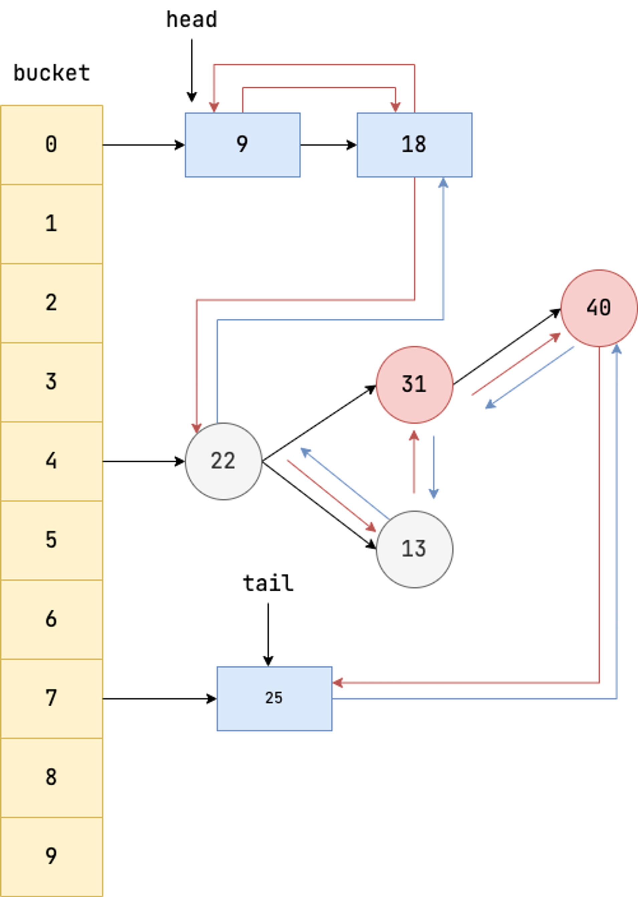

LinkedHashMap 定义了排序模式 accessOrder(boolean 类型，默认为 false)，访问顺序则为 true，插入顺序则为 false。

```java
LinkedHashMap<Integer, String> map = new LinkedHashMap<>(16, 0.75f, true);
```

**如何快速使用 LRU 缓存，具体实现思路如下：**

- 继承 LinkedHashMap;
- 构造方法中指定 accessOrder 为 true ，这样在访问元素时就会把该元素移动到链表尾部，链表首元素就是最近最少被访问的元素；
- 重写removeEldestEntry 方法，该方法会返回一个 boolean 值，告知 LinkedHashMap 是否需要移除链表首元素（缓存容量有限）。

```java
public class LRUCache<K, V> extends LinkedHashMap<K, V> {
    private final int capacity;

    public LRUCache(int capacity) {
        super(capacity, 0.75f, true);
        this.capacity = capacity;
    }

    /**
     * 判断size超过容量时返回true，告知LinkedHashMap移除最老的缓存项(即链表的第一个元素)
     */
    @Override
    protected boolean removeEldestEntry(Map.Entry<K, V> eldest) {
        return size() > capacity;
    }
}

LRUCache<Integer, String> cache = new LRUCache<>(3);
cache.put(1, "one");
cache.put(2, "two");
cache.put(3, "three");
cache.put(4, "four");
for (int i = 0; i <= 4; i++) {
    System.out.println(cache.get(i));
}

null
two
three
four

// 遍历方法
for (Map.Entry < String, String > entry: map.entrySet()) {
    System.out.println(entry.getKey() + ":" + entry.getValue());
}
```


### 1.5 CopyOnWriteArrayList - 并发

#### 1 适用场景

**设计背景：**

ArrayList 是一个线程不安全的容器，如果在多线程环境下使用，需要手动加锁，或者使用 Collections.synchronizedList() 方法将其转换为线程安全的容器。

**设计目的：非常适合读多写少的场景**

- 对于大部分业务场景来说，读取操作往往是远大于写入操作的。
  - 读取操作不会对原有数据进行修改
  - 对于每次读取都进行加锁其实是一种资源浪费
- 与读写锁不同的是，CopyOnWriteArrayList 进行了进一步优化：
  - 为了将读操作性能发挥到极致，CopyOnWriteArrayList 中的读取操作是完全无需加锁的；
  - 写入操作也不会阻塞读取操作，只有**写写才会互斥；**
  - 每当对列表进行修改（例如添加、删除或更改元素）时，都会创建列表的一个新副本，这个新副本会替换旧的列表，而对旧列表的所有读取操作仍然可以继续。


#### 2 写时复制 COW

制出一个新的容器，然后在新的容器里添加元素，添加完之后，再将原容器的引用指向新的容器。多个线程在读的时候，不需要加锁，因为当前容器不会添加任何元素。

- 在操作系统中的应用：COW 是一种计算机程序设计领域的优化策略，核心思想如下
  - 同时读取：如果有多个调用者（callers）同时请求相同资源（如内存或磁盘上的数据存储），他们会共同获取相同的指针指向相同的资源
  - 调用者写：直到某个调用者试图修改资源的内容时，系统才会真正复制一份专用副本（private copy）给该调用者，而其他调用者所见到的最初的资源仍然保持不变
- 在 CopyOnWriteArrayList 中的应用：
  - 当多个线程读取时，直接读取原有位置的数据
  - 当有线程要对数据进行修改时，不会直接修改原数组，而是会先创建底层数组的副本
  - 对副本数组进行修改，修改完之后再将修改后的数组赋值回去，这样就可以保证写操作不会影响读操作了。

**写时复制 COW 有什么缺点：**

- 内存占用：写操作都需要复制原始数据，会占用额外的内存空间
- 写操作开销：写操作都需要复制一份原始数据，然后再进行修改和替换，所以开销相对较大
- 数据一致性问题：修改操作不会立即反映到最终结果中，还需要等待复制完成，这可能会导致一定的数据一致性问题。


#### 3  CopyOnWriteArrayList 源码分析

CopyOnWriteArrayList底层也是通过一个数组保存数据，使用volatile关键字修饰数组，保证当前线程对数组对象重新赋值后，其他线程可以及时感知到。

```java
private transient volatile Object[] array;
```

在写入操作时，加了一把互斥锁ReentrantLock以保证线程安全。

```java
// 插入元素到 CopyOnWriteArrayList 的尾部
public boolean add(E e) {
		// 获取锁
    final ReentrantLock lock = this.lock;
    // 加锁：保证同一时刻只有一个写线程正在进行数组的复制
    lock.lock();
    try {
        // 获取原来的数组
        Object[] elements = getArray();
        // 重点: 原来数组的长度
        int len = elements.length;
        // 创建一个长度+1的新数组，并将原来数组的元素复制给新数组
        Object[] newElements = Arrays.copyOf(elements, len + 1);
        // 元素放在新数组末尾
        newElements[len] = e;
        // array指向新数组
        setArray(newElements);
        return true;
    } finally {
        // 解锁
        lock.unlock();
    }
}

public E get(int index) {
	return get(getArray(), index);
}
```

- 插入元素 add() 有三个版本，尾部插入-指定位置插入-元素不存在则插入：
  - add 方法内部用到了 ReentrantLock 加锁，保证同步，避免多线程写的时候会复制出来多个副本出来。使用 fincal 保证锁的内存地址不会被修改，且使用 finally 保证锁能被释放。
  - 底层使用 COW，先创建一个新的数组来容纳新添加的元素，然后在新的数组中进行写操作，最后将新数组赋值给底层数组的应用。
  - 每次写操作都需要通过 Arrays.copyOf 复制底层数组，因此会造成额外的性能损失。
  - **CopyOnWriteArrayList 中并没有类似于 grow 的扩容机制。后者默认为0，每次加一个就新建长度+1的新数组然后copy。**
- 读取元素：
  - CopyOnWriteArrayList 的读取操作是基于内部数组 array 并没有发生实际的修改，因此在读取操作时不需要进行同步控制和锁操作，可以保证数据的安全性。


#### 4 CopyOnWriteArrayList 的优缺点

- 优点：
  - CopyOnWriteArrayList经常被用于“读多写少”的并发场景
  - CopyOnWriteArrayList由于其"读写分离"，遍历和修改操作分别作用在不同的数组，所以在使用迭代器遍历的时候，则不会抛出异常。
- 缺点：
  - **内存消耗高**：每次执行写操作都会将原容器进行拷贝了一份，数据量大的时候，内存会存在较大的压力，可能会引起频繁Full GC
  - **弱一致性（读取的不是最新数据）**：写和读分别作用在不同数组上，在写操作执行过程中，读不会阻塞，但读取到的却是老容器的数据。

CopyOnWriteArrayList 适用于读操作远远大于写操作的场景，比如说缓存。因为 CopyOnWriteArrayList 采用写时复制的思想，所以写操作的性能较低，因此不适合写操作频繁的场景。


### 1.6 Set 集合

#### 1 Set 集合的分类

**Set 集合有什么特点? 如何实现 key 无重复的?**

1. **set集合特点**：Set集合中的元素是唯一的，不会出现重复的元素。
2. **set实现原理**：Set集合通过内部的数据结构（如哈希表、红黑树等）来实现 key 的无重复。当向Set 集合中插入元素时，会先根据元素的 hashCode 值来确定元素的存储位置，当向 Set 集合中插入元素时，会先根据元素的 hashCode 值来确定元素的存储位置，

**有序的 Set 是什么? 记录插入顺序的是什么?**

1. **有序的 Set 是 TreeSet** 。TreeSet是基于红黑树实现，保证元素的自然顺序。
2. **记录插入顺序的集合通常指的是LinkedHashSet**，它不仅保证元素的唯一性，还可以保持元素的插入顺序。当需要在Set集合中记录元素的插入顺序时，可以选择使用LinkedHashSet来实现。


### 1.7 BlockingQueue - 并发，线程池中也会用到的阻塞队列

#### 1 什么是阻塞队列

**阻塞队列的分类：它们都是线程安全的，可以在多线程环境下使用**

1. ArrayBlockingQueue
2. LinkedBlockingQueue
3. PriorityBlockingQueue
4. SynchronousQueue
5. LinkedTransferQueue
6. LinkedBlockingDeque
7. DelayQueue

阻塞队列是一个非常有用的工具，可以用于实现生产者-消费者模式，或者在多线程环境下进行线程间通信。它们还可以用于实现线程池和其他数据结构，如优先级队列、延迟队列等。

**阻塞队列的思想：底层 Condition 通知机制被屏蔽，只需要调用 put、take、offer、pol**

- 当阻塞队列数据为空时，所有的消费者线程都会被阻塞，等待队列非空。
  - 生产者填充数据后，队列就会通知消费者队列非空，消费者此时就可以进来消费。
- 队列填满时，生产者就会被阻塞，等待队列非满时继续存放元素。
  - 消费者消费元素后，队列就会通知生产者队列非满，生产者可以继续填充数据了。
- **阻塞存和阻塞取：使用 put 和 take**
- 非阻塞存和非阻塞取（返回 false 或者 null）：使用 offer 和 poll


#### 2 手撕 - 阻塞队列

生产者-生产10个元素-2个消费者-消费10个元素（开多线程）

```java
package com.tjyy.abs;
import java.util.concurrent.ArrayBlockingQueue;
import java.util.concurrent.atomic.AtomicInteger;

/**
 * @author: Tjyy
 * @date: 2024-04-13 14:49
 * @description:
 */
public class ProducerConsumer { 
    public static void main(String[] args) throws InterruptedException {
        int sum = 10;
        ArrayBlockingQueue<Integer> queue = new ArrayBlockingQueue<>(5);

        Thread producer = new Thread(()->{
            for (int i = 0; i <= sum; i++) {
                try {
                    System.out.println(Thread.currentThread().getName() + " produce number: " + i);
                    queue.put(i);
                } catch (InterruptedException e) {
                    e.printStackTrace();
                }
            }
        });

        Thread consumer1 = new Thread(()->{
            while (true){
                try {
                    int num = queue.take();
                    if(num == -1){
                        queue.put(num);
                        break;
                    }
                    System.out.println(Thread.currentThread().getName() + " consume number: " + num);
                } catch (InterruptedException e) {
                    e.printStackTrace();
                }
            }
        });

        Thread consumer2 = new Thread(()->{
            while (true){
                try {
                    int num = queue.take();
                    if(num == -1){
                        queue.put(num);
                        break;
                    }
                    System.out.println(Thread.currentThread().getName() + " consume number: " + num);
                } catch (InterruptedException e) {
                    e.printStackTrace();
                }
            }
        });

        // 启动线程
        producer.start();
        consumer1.start();
        consumer2.start();

        producer.join();
        // 生产者结束之后放入 -1（毒丸策略）
        try {
            queue.put(-1);
        } catch (InterruptedException e) {
            e.printStackTrace();
        }

        consumer1.join();
        consumer2.join();

        producer.interrupt();
        consumer1.interrupt();
        consumer2.interrupt();
    }
}
```


#### 3  put 方法和 take 方法阻塞原理

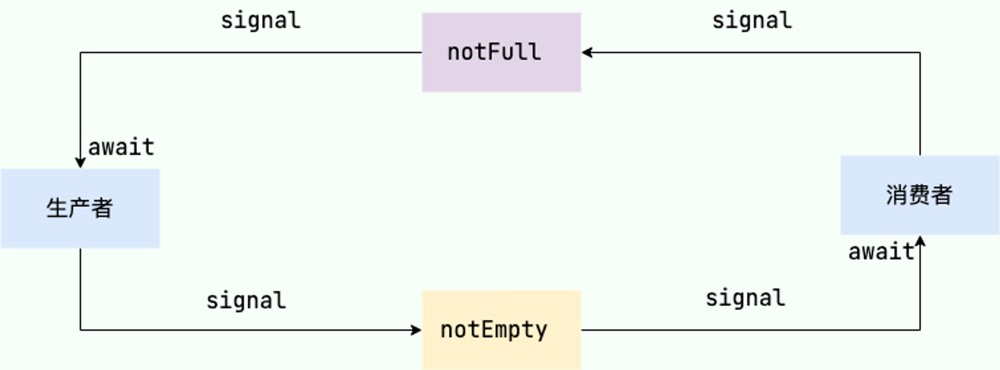

ArrayBlockingQueue 的实现原理主要分为以下几点（这里以阻塞式获取和新增元素为例介绍）：

- ArrayBlockingQueue 内部维护一个定长的数组用于存储元素。
- 通过使用 ReentrantLock 锁对象对读写操作进行同步，即通过锁机制来实现线程安全。
- 通过 Condition 实现线程间的等待和唤醒操作。 

```java
//创建阻塞队列流程控制的锁
lock = new ReentrantLock(fair);

//用lock锁创建两个条件控制队列生产和消费
notEmpty = lock.newCondition();
notFull =  lock.newCondition();
```

**这里再详细介绍一下线程间的等待和唤醒具体的实现：await() 和 singal() 方法**

- 当队列已满时，生产者线程会调用 notFull.await() 方法让生产者进行等待，等待队列非满时插入（非满条件）。
- 当队列为空时，消费者线程会调用 notEmpty.await()方法让消费者进行等待，等待队列非空时消费（非空条件）。
- 当有新的元素被添加时，生产者线程会调用 notEmpty.signal()方法唤醒正在等待消费的消费者线程。
- 当队列中有元素被取出时，消费者线程会调用 notFull.signal()方法唤醒正在等待插入元素的生产者线程。

**LinkedBlockingQueue - put 方法和 take 方法阻塞原理**

LinkedBlockingQueue 是一个基于链表的线程安全的阻塞队列：

- 可以在队列头部和尾部进行高效的插入和删除操作。
- 当队列为空时，取操作会被阻塞，直到队列中有新的元素可用。当队列已满时，插入操作会被阻塞，直到队列有可用空间。
- 可以在构造时指定最大容量。如果不指定，默认为 Integer.MAX_VALUE，这意味着队列的大小受限于可用内存。

```java
private final ReentrantLock takeLock = new ReentrantLock();
private final Condition notEmpty = takeLock.newCondition();

private final ReentrantLock putLock = new ReentrantLock();
private final Condition notFull = putLock.newCondition();
```

put 以及 take 方法的逻辑基本上和 ArrayBlockingQueue 的一样。

**ArrayBlockingQueue 和 LinkedBlockingQueue 的区别以及比较**

- 相同点：
  - 都是通过 Condition 通知机制来实现可阻塞的插入和删除
- 不同点：
  - ArrayBlockingQueue 基于数组实现，而 LinkedBlockingQueue 基于链表实现；
  - ArrayBlockingQueue 使用一个单独的 ReentrantLock 来控制对队列的访问，而 LinkedBlockingQueue 使用两个锁（putLock 和 takeLock），一个用于放入操作，另一个用于取出操作。这可以提供更细粒度的控制，并可能减少线程之间的竞争。


#### 4 谈一谈其他的阻塞队列

1. **PriorityBlockingQueue**

PriorityBlockingQueue 是一个具有优先级排序特性的无界阻塞队列，元素在队列中的排序遵循自然排序或者通过提供的比较器进行定制排序。可以通过 Comparable 接口来定义自然排序。

当需要根据优先级来执行任务时，PriorityBlockingQueue 会非常有用。下面的代码演示了如何使用 PriorityBlockingQueue 来管理具有不同优先级的任务。

```java
class Task implements Comparable<Task> {
    private int priority;
    private String name;

    public Task(int priority, String name) {
        this.priority = priority;
        this.name = name;
    }

    public int compareTo(Task other) {
        return Integer.compare(other.priority, this.priority); // higher values have higher priority
    }

    public String getName() {
        return name;
    }
}

public class PriorityBlockingQueueDemo {
    public static void main(String[] args) throws InterruptedException {
        PriorityBlockingQueue<Task> queue = new PriorityBlockingQueue<>();
        queue.put(new Task(1, "Low priority task"));
        queue.put(new Task(50, "High priority task"));
        queue.put(new Task(10, "Medium priority task"));

        while (!queue.isEmpty()) {
            System.out.println(queue.take().getName());
        }
    }
}
```

上例创建了一个优先级阻塞队列，并添加了三个具有不同优先级的任务。它们会按优先级从高到低的顺序被取出并打印。运行结果如下：

```java
High priority task
Medium priority task
Low priority task
```

1. **SynchronousQueue**

SynchronousQueue 是一个非常特殊的阻塞队列，它不存储任何元素。

- 每一个插入操作必须等待另一个线程的移除操作，反之亦然。
- **SynchronousQueue 的内部实际上是空的**，但它允许一个线程向另一个线程逐个传输元素。

SynchronousQueue 允许线程直接将元素交付给另一个线程。**因此，如果一个线程尝试插入一个元素，并且有另一个线程尝试移除一个元素，则插入和移除操作将同时成功。**

如果想让一个线程将确切的信息直接发送给另一个线程的情况下，可以使用 SynchronousQueue。下面的代码展示了如何使用 SynchronousQueue 进行线程间的通信：

```java
public class SynchronousQueueDemo {
    public static void main(String[] args) {
        SynchronousQueue<String> queue = new SynchronousQueue<>();

        // Producer Thread
        new Thread(() -> {
            try {
                String event = "SYNCHRONOUS_EVENT";
                System.out.println("Putting: " + event);
                queue.put(event);
                System.out.println("Put successfully: " + event);
            } catch (InterruptedException e) {
                Thread.currentThread().interrupt();
            }
        }).start();

        // Consumer Thread
        new Thread(() -> {
            try {
                String event = queue.take();
                System.out.println("Taken: " + event);
            } catch (InterruptedException e) {
                Thread.currentThread().interrupt();
            }
        }).start();
    }
}
```

上例创建了一个 SynchronousQueue，并在一个线程中插入了一个元素，另一个线程中移除了这个元素。运行结果如下：

```java
Putting: SYNCHRONOUS_EVENT
Put successfully: SYNCHRONOUS_EVENT
Taken: SYNCHRONOUS_EVENT
```

1. **LinkedTransferQueue**

LinkedTransferQueue 是一个基于链表结构的无界传输队列，它提供了一种强大的线程间交流机制。它的功能与其他阻塞队列类似，但还包括“转移”语义：

- 允许一个元素直接从生产者传输给消费者，如果消费者已经在等待。
- 如果没有等待的消费者，元素将入队。

常用方法有两个：

- transfer(E e)：将元素转移到等待的消费者，如果不存在等待的消费者，则元素会入队并阻塞直到该元素被消费。
- tryTransfer(E e)：尝试立即转移元素，如果有消费者正在等待，则传输成功；否则，返回 false。

如果想要更紧密地控制生产者和消费者之间的交互，可以使用 LinkedTransferQueue。

1. **LinkedBlockingDeque**

LinkedBlockingDeque 是一个基于链表结构的双端阻塞队列；它同时支持从队列头部插入和移除元素，也支持从队列尾部插入和移除元素。因此，LinkedBlockingDeque 可以作为 FIFO 队列或 LIFO 队列来使用。

常用方法有：

- addFirst(E e), addLast(E e): 在队列的开头/结尾添加元素。
- takeFirst(), takeLast(): 从队列的开头/结尾移除和返回元素，如果队列为空，则等待。
- putFirst(E e), putLast(E e): 在队列的开头/结尾插入元素，如果队列已满，则等待。
- pollFirst(long timeout, TimeUnit unit), pollLast(long timeout, TimeUnit unit): 在队列的开头/结尾移除和返回元素，如果队列为空，则等待指定的超时时间。

1. **DelayQueue**

DelayQueue 是一个无界阻塞队列，用于存放实现了 Delayed 接口的元素，这些元素只能在其到期时才能从队列中取走；这使得 DelayQueue 成为实现时间基于优先级的调度服务的理想选择。


#### 5 可以使用 ReentranLock 实现阻塞队列吗?

可以使用 `ReentrantLock` 和 `Condition` 来实现一个简单的阻塞队列。

```java
import java.util.LinkedList;
import java.util.Queue;
import java.util.concurrent.locks.Condition;
import java.util.concurrent.locks.Lock;
import java.util.concurrent.locks.ReentrantLock;

public class BlockingQueueWithLock<T> {
    private Queue<T> queue;
    private int capacity;

    private Lock lock = new ReentrantLock();
    private Condition notFull = lock.newCondition();
    private Condition notEmpty = lock.newCondition();

    public BlockingQueueWithLock(int capacity) {
        this.capacity = capacity;
        this.queue = new LinkedList<>();
    }

    public void enqueue(T item) throws InterruptedException {
        lock.lock();
        try {
            while (queue.size() == capacity) {
                notFull.await(); // wait until queue is not full
            }
            queue.offer(item);
            notEmpty.signal(); // signal that queue is not empty now
        } finally {
            lock.unlock();
        }
    }

    public T dequeue() throws InterruptedException {
        lock.lock();
        try {
            while (queue.isEmpty()) {
                notEmpty.await(); // wait until queue is not empty
            }
            T item = queue.poll();
            notFull.signal(); // signal that queue is not full now
            return item;
        } finally {
            lock.unlock();
        }
    }

    public int size() {
        lock.lock();
        try {
            return queue.size();
        } finally {
            lock.unlock();
        }
    }

    public static void main(String[] args) {
        BlockingQueueWithLock<Integer> queue = new BlockingQueueWithLock<>(5);

        // Producer thread
        Thread producer = new Thread(() -> {
            try {
                for (int i = 0; i < 10; i++) {
                    queue.enqueue(i);
                    System.out.println("Produced: " + i);
                    Thread.sleep(500); // simulate some work
                }
            } catch (InterruptedException e) {
                e.printStackTrace();
            }
        });

        // Consumer thread
        Thread consumer = new Thread(() -> {
            try {
                for (int i = 0; i < 10; i++) {
                    int item = queue.dequeue();
                    System.out.println("Consumed: " + item);
                    Thread.sleep(1000); // simulate some work
                }
            } catch (InterruptedException e) {
                e.printStackTrace();
            }
        });

        producer.start();
        consumer.start();

        try {
            producer.join();
            consumer.join();
        } catch (InterruptedException e) {
            e.printStackTrace();
        }
    }
}

```

这段代码实现了一个简单的阻塞队列，使用 `ReentrantLock` 和 `Condition` 来实现线程的阻塞和唤醒机制。关键点包括：

- `enqueue()` 方法在队列已满时阻塞生产者线程，直到队列有空间。
- `dequeue()` 方法在队列为空时阻塞消费者线程，直到队列有元素。
- 使用 `notFull.await()` 和 `notEmpty.await()` 来让线程等待条件。
- 使用 `notFull.signal()` 和 `notEmpty.signal()` 来唤醒等待的线程。

这种实现保证了线程安全，并且能够有效地处理并发情况下的队列操作。


### 1.8 PriorityQueue

#### 1 什么是优先级队列

**PriorityQueue 又称为优先级队列：**

- 底层基于 Object 数组 + 小顶堆，简化了父子间的关系维护，节省了占用空间
  - leftChild = 2 * parentIndex + 1
  - rightChild = 2 * parentIndex + 2
  - parentIndex = (childIndex - 1) / 2
- 常用于解决最大值或者最小值，甚至任务调度、时间处理、图论算法等场景
- 默认初始化大小为 11

`PriorityQueue` 是 Java 中的一个优先级队列实现，它基于堆数据结构实现，具有以下特点：

1. **优先级排序**：元素按照其自然顺序（实现了 `Comparable` 接口）或者通过构造函数提供的 `Comparator` 排序。
2. **插入和删除效率**：插入和删除操作的时间复杂度为 O(log n)，其中 n 是队列中的元素个数。
3. **非线程安全**：`PriorityQueue` 不是线程安全的类，如果需要在多线程环境中使用，需要进行外部同步。

下面是一个简单的示例演示如何使用 `PriorityQueue`：

```java
import java.util.PriorityQueue;

public class PriorityQueueExample {
    public static void main(String[] args) {
        // 创建一个默认自然顺序的 PriorityQueue
        PriorityQueue<Integer> pq1 = new PriorityQueue<>();

        // 插入元素
        pq1.offer(3);
        pq1.offer(1);
        pq1.offer(2);

        // 输出队列中的元素
        System.out.println("PriorityQueue with natural ordering:");
        while (!pq1.isEmpty()) {
            System.out.println(pq1.poll()); // 按照自然顺序弹出元素
        }

        // 创建一个使用自定义 Comparator 的 PriorityQueue
        PriorityQueue<Integer> pq2 = new PriorityQueue<>((a, b) -> b - a); // 逆序排列

        // 插入元素
        pq2.offer(3);
        pq2.offer(1);
        pq2.offer(2);

        // 输出队列中的元素
        System.out.println("\nPriorityQueue with custom comparator (reverse order):");
        while (!pq2.isEmpty()) {
            System.out.println(pq2.poll()); // 按照逆序弹出元素
        }
    }
}

```

在这个示例中：

- `pq1` 是一个使用默认的自然顺序排序的 `PriorityQueue`。元素插入后会按照升序排列。
- `pq2` 是一个使用自定义的比较器（逆序）排序的 `PriorityQueue`。元素插入后会按照降序排列。

主要方法包括：

- `offer(E e)`：将元素插入队列。
- `poll()`：弹出并返回队列中最小（或最大，根据排序顺序）的元素。
- `peek()`：返回队列中最小（或最大）的元素，但不移除它。

`PriorityQueue` 在很多场景下非常有用，例如任务调度、事件处理等需要按照优先级处理的场景。


#### 2 手撕 - 堆排序

**手撕算法 - 最小堆排序 - 使用动态数组实现**

- 维护最小堆长度 static int heapLen;
- 编写元素交换： swap(int[] arr, int i, int j)
- 编写最小堆向下调整：heapify(int[] arr, int i)
- 编写对构建算法：heapify(int[] arr, int i)
- 对一个数组进行堆排序的步骤
  - 构建最大堆
  - 将堆顶元素和数组最后的元素进行交换，并将堆大小 - 1
  - 重新调整最大堆，并反复进行上述操作

```java
// Global variable that records the length of an array;
static int heapLen;

private static void swap(int[] arr, int i, int j) {
    int tmp = arr[i];
    arr[i] = arr[j];
    arr[j] = tmp;
}

private static void buildMaxHeap(int[] arr) {
    for (int i = arr.lengt h / 2 - 1; i >= 0; i--) {
        heapify(arr, i);
    }
}

// 向下调整
private static void heapify(int[] arr, int i) {
    int left = 2 * i + 1;
    int right = 2 * i + 2;
    int largest = i;
    
    if (right < heapLen && arr[right] > arr[largest]) {
        largest = right;
    }
    if (left < heapLen && arr[left] > arr[largest]) {
        largest = left;
    }
    
    if (largest != i) {
        swap(arr, largest, i);
        heapify(arr, largest);
    }
}

public static int[] heapSort(int[] arr) {
    // index at the end of the heap
    heapLen = arr.length;
    
    // build MaxHeap
    buildMaxHeap(arr);
    
    for (int i = arr.length - 1; i > 0; i--) {
        // Move the top of the heap to the tail of the heap in turn
        swap(arr, 0, i);
        heapLen -= 1;
        heapify(arr, 0);
    }
    return arr;
}
```

**如何使用 Priority 构建最大堆：**

```java
PriorityQueue<Integer> queue = 
		new PriorityQueue<Integer>((a,b) -> (b.compareTo(a)));
```


## 2 常见面试题总结

#### 1. 说说 List,Set,Map 三者的区别?三者底层的数据结构?

**无序性和不可重复性：**

- 无序性不等于随机性 ，无序性是指存储的数据在底层数组中并非按照数组索引的顺序添加 ，而是根据数据的哈希值决定的。
- 不可重复性是指添加的元素按照 equals() 判断时 ，返回 false，需要同时重写 equals() 方法和 hashCode() 方法。

**三者区别：**

- List ：有序、可重复
- Set：不可重复
- Queue：按照特定的先后顺序存储，存储的元素是有序、可重复的
- Map：key 是无序、不可重复的，value 是无序的、可重复的

**三者的底层结构：**

- List：
  - ArrayList 底层是 Object[] 数组
  - LinkedList 底层是 双向链表
- Set：
  - HashSet 底层基于 HashMap 是实现
  - LinkedHashSet：内部通过 LinkedHashMap 来实现
  - TreeSet：底层采用红黑树（自平衡的有序二叉树）
- Queue：
  - PriorityQueue：Object[] 数组实现小顶堆
  - DelayQueue：基于 PriorityQueue 实现
  - ArrayDeque：可扩容的动态双向数组
- Map：
  - HashMap：JDK-1.8 之前由数组 + 链表组成，数组是 HashMap 的主体；JDK 1.8 以后使用数组 + 链表 + 红黑树来构成
  - LinkedHashMap：LinkedHashMap 继承 HashMap，在 HashMap 的基础上增加了一条双向链表，使得上面的结构可以保持键值的相对插入顺序。
  - HashTable：采用数组 + 链表组成。
  - TreeMap：底层由红黑树构成


#### 2 有哪些集合是线程不安全的?怎么解决呢?

我们常⽤的 ArrayList，LinkedList，Hashmap，HashSet，TreeSet，TreeMap 都不是线程安全的。解决办法很简单，可以使⽤线程安全的集合来代替。

**JUC 包中提供了很多并发容器供你使⽤：**

- ConcurrentHashMap：可以看作是线程安全的 HashMap
- CopyOnWriteArrayList：可以看作是线程安全的 ArrayList ，在读多写少的场合性能⾮常好，远远好于 Vector .
- ConcurrentLinkedQueue：⾼效的并发队列，使⽤链表实现。可以看做⼀个线程安全的LinkedList ，这是⼀个⾮阻塞队列。
- BlockingQueue：这是⼀个接⼝，JDK 内部通过链表、数组等⽅式实现了这个接⼝。表示阻塞队列，⾮常适合⽤于作为数据共享的通道。
- ConcurrentSkipListMap：跳表的实现。这是⼀个 Map ，使⽤跳表的数据结构进⾏快速查找。


#### **3. 比较 HashSet、LinkedHashSet 和 TreeSet 三者的异同**

- 线程安全：三者都不是线程安全的
- 主要区别在于底层数据结构的不同：
  - HashSet：底层数据结构是哈希表
  - LinkedHashSet：底层数据结构是链表 + 哈希表
  - TreeSet：底层数据结构是红黑树
- 三者应用场景不同：
  - HashSet 用于不需要保证元素插入和取出顺序
  - LinkedHashSet 用于保证元素插入和顺序取出满足 FIFO 的场景
  - TreeSet 用于支持对元素自定义排序


#### 4. HashMap 和 Hashtable 的区别? HashMap 和 HashSet 区别? HashMap 和 TreeMap 区别?

**HashMap 和 HashTable 的区别：**

- 线程安全：HashMap是线程安全，HashTable 是线程安全的
- 接受 null 值：HashMap可以接受为 null 的键和值，而 HashTable 则不行
- 底层数据结构：hashTable 底层没有链表和红黑树相互转换的过程
- 初始容量大小和每次扩充容量大小不同：Hashtable 初始大小默认为 11，之后每次扩充成 2n+1；HashMap 初始化大小为16，每次扩容两倍。
- 迭代器：
  - HashMap 的迭代器是 fail-fast 迭代器，所以当有其它线程改变了 HashMap 的结构（增加或者移除元素），将会抛出 ConcurrentModificationException ，但迭代器本身的 remove() 方法移除元素则不会抛出异常。
  - HashTable 的迭代器不是 fail-fast 的。

**HashMap 和 HashSet 区别：**

- 存储元素：HashMap 存储键值对，HashSet 仅仅存储对象
- 存储原理：HashMap 使用键对象来计算 hashCode 值，HashSet 使用成员对象来计算 hashCode 值

HashSet 底层完全就是在 HashMap 的基础上包了一层，只不过存储的时候 value 是默认存储了一个 Object 的静态常量，取的时候也是只返回 key ，所以看起来就像 List 一样。

**HashMap 和 TreeMap 区别：**

- 数据结构：HashMap 基于散列表+链表+红黑树，TreeMap 基于红黑树实现
- 元素排序：HashMap 无序，TreeSet 有序
- 常规性能：HashMap 适用于在Map中插入、删除和定位元素；TreeMap 适用于按自然顺序或自定义顺序遍历元素。
- HashMap通常比TreeMap快一点(树和哈希表的数据结构使然)，建议多使用HashMap，在需要排序的Map时候才用TreeMap。


#### 5. HashMap 的底层实现

HashMap底层使用 hash 表的数据结构，即数组和链表或者红黑树

- 当我们往 HashMap 中 put 元素时，利用 key 的 hashCode 重新 hash 计算出当前对象的元素在数组中的下标
  - 如何计算数组下标：调用 key.hashCode() → 二次散列 → 取模运算（计算桶下标）
    - h = (key.hashCode()) ^ (h >>> 16)
- 存储时，如果出现 hash 值相同的 key，此时有两种情况
  - 如果 key 相同，则覆盖原始值
  - 如果 key 不相同，则将当前的 key-value 放入链表或者红黑树中
  - 链表的长度大于 8 但是数组长度小于 64 时，优先进行数组扩容
  - 链表的长度大于 8 且数组长度大于 64 时，转换成红黑树
- 获取数据时，直接找到 hash 值对应的下标，再进一步**判断 key 是否相同**，从而找到对应值


#### 6. HashMap 的⻓度为什么是 2 的幂次方

**首先要说明一个数学原理：**

- 取余(%)操作中如果除数是 2 的幂次则等价于与其除数减一的与(&)操作
- 位操作 &，相对于%能够提高运算效率

**所以 HashMap 保证长度是 2 的幂次方的原因为：**

- **计算桶下标效率更高**：计算索引时效率更高，因为如果是 2 的 n 次幂可以使用位与运算代替取模 (n - 1) & hash
- 扩容时重新链表索引效率更高：扩容时重新计算索引效率更高， hash & oldCap = 0 的元素留在原来位置，否则新位置 = 旧位置 + oldCap
  - 其实就是取 hash 的高一位，来判断元素是否需要移动位置
  - 扩容时重新计算索引效率更高


#### 7. ConcurrentHashMap 和 HashTable 的区别?

**底层数据结构：**

- JDK 1.7 ConcurrentHashMap：分段数组（Segment 数组 + HashEntry 数组） + 链表
- JDK 1.8 ConcurrentHashMap：数组 + 链表 + 红黑树（与 HashMap 相同结构）
- HashTable 底层采用：数组 + 链表

**实现线程安全的方式（重要）：**

- JDK1.7 ConcurrentHashMap ：Segment 继承了 ReentrantLock
  - 对整个桶数组进行了分段(Segment，分段锁)，锁容器其中一部分数据
  - 多线程访问容器里不同数据段的数据，就不会存在锁竞争，提高并发访问率
- JDK1.8 ConcurrentHashMap ：
  - 而是直接用 Node 数组+链表+红黑树 的数据结构来实现
  - 并发控制使用 synchronized 和 CAS 来操作
- Hashtable 全局只有一把锁 :
  - 使用 synchronized 来保证线程安全，效率非常低下。
  - 多个线程访问同步方法，可能会进入阻塞或轮询状态


#### 8. ConcurrentHashMap 线程安全的具体实现方式/底层具体实现

**JDK 1.7 实现线程安全：**

- 首先将数据分为 Segment，每个 Segment 配一把锁，当一个线程占用锁访问其中一个段数据时，其他 Segment 的数据也能被其他线程访问。
- Segment 继承了 ReentrantLock, 所以 Segment 是一种可重入锁，扮演锁的角色
- Segment 默认初始个数为 16 个，一旦初始化就不能改变，默认同时支持 16 个线程并发写，Segment 中的 Entry 结构和 HashMap 中类似

**JDK 1.8 实现线程安全：**

- 采用 Node + CAS + synchronized 来保证并发安全。
- Java 8 中，锁粒度更细，synchronized 只锁定当前链表或红黑二叉树的首节点，这样只要 hash 不冲突，就不会产生并发，就不会影响其他 Node 的读写，效率大幅提升。

**JDK 1.7 和 JDK 1.8 中 ConcurrentHashMap 区别：**

- 线程安全实现方式：
  - JDK 1.7 采用 Segment 分段锁来保证安全， Segment 是继承自 ReentrantLock。
  - JDK1.8 采用 Node + CAS + synchronized 保证线程安全，锁粒度更细，synchronized 只锁定当前链表或红黑二叉树的首节点。
- Hash 碰撞解决方法:
  - JDK 1.7 采用拉链法
  - JDK1.8 采用拉链法结合红黑树。
- 并发度：
  - JDK 1.7 最大并发度是 Segment 的个数，默认是 16
  - JDK 1.8 最大并发度是 Node 数组的大小，并发度更大


#### 9.ArrayList 以及 LinkedList 插入以及删除的时间复杂度

**对于 ArrayList：**

- 对于插入：
  - 头部插入 O(n)
  - 尾部插入 O(1)，扩容则需要 O(n)
  - 指定位置插入，平均需要移动 n / 2，因此时间复杂度为 O(n)
- 对于删除：
  - 头部删除 O(n)
  - 尾部删除 O(1)
  - 指定位置删除，平均需要移动 n / 2，因此时间复杂度为 O(n)

**对于 LinkedList：**

- 对于插入和删除：
  - 头部插入和删除 O(1)
  - 尾部插入和删除 O(1)
  - 指定位置插入和删除，平均需要移动 n / 2，因此时间复杂度为 O(n)


#### 10 ArrayList 以及 LinkedList 的区别

- 线程安全：都不能保证
- 底层数据结构：Object 数组和双向链表
- 插入和删除是否受元素位置影响：LinkedList 头插法和尾插法更好一些
- 快速随机访问：ArrayList 支持随机访问，LinkedList 不支持高效随机访问
- 内存空间占用：ArrayList 的浪费体现在需要预留一定空间，LinkedList 的空间占用体现在前驱结点和后续结点会占用更多空间


#### 11 如何对集合 List 进行排序

Comparable 接口和 Comparator 接口都是 Java 中用于排序的接口，它们在实现类对象之间比较大小、排序等方面发挥了重要作用：

- Comparable 接口实际上是出自java.lang包 它有一个 compareTo(Object obj)方法用来排序
- Comparator接口实际上是出自 java.util 包它有一个compare(Object obj1, Object obj2)方法用来排序

**使用 Comparator 定制排序：**

```java
ArrayList<Integer> arrayList = new ArrayList<Integer>();

Collections.reverse(arrayList);
Collections.sort(arrayList);

// 定制排序的用法
Collections.sort(arrayList, new Comparator<Integer>() {
    @Override
    public int compare(Integer o1, Integer o2) {
        return o2.compareTo(o1);
    }
});
```

**使用 CompareTo 实现排序：**

```java
public class Person implements Comparable<Person>{
		...

		@Override
    public int compareTo(Person o) {
        if (this.age > o.getAge()) {
            return 1;
        }
        if (this.age < o.getAge()) {
            return -1;
        }
        return 0;
    }
}

TreeMap<Person, String> pdata = new TreeMap<Person, String>();
```


#### **11.ArrayBlockingQueue 和 LinkedBlockingQueue 有什么区别（线程池会问）**

- 底层实现：
  - ArrayBlockingQueue 基于数组实现
  - LinkedBlockingQueue 基于链表实现
- 是否有界：
  - ArrayBlockingQueue 是有界队列，在创建时必须指定大小，且支持公平和非公平两种方式的锁访问机制
  - LinkedBlockingQueue 基于链表实现，可以不指定容量，不指定容量默认使用 Integer.MAX_VALUE
- 锁是否分离：
  - ArrayBlockingQueue 生产和消费使用同一个锁
  - LinkedBlockingQueue 实现了锁分离，即生产使用 putLock，消费使用 takeLock，可以防止消费者和生产者之间的锁争夺
- 内存占用：
  - ArrayBlockingQueue 需要提前分配数组内存，在占用时就会占用一定的内存空间
  - LinkedBlockingQueue 动态分配链表结点内存，根据元素的增加逐渐占用内存空间


#### **12.HashMap 为什么线程不安全：死锁（1.8之前） + 数据覆盖**

JDK 1.8 之前，会出现多线程操作导致死锁的问题。

JDK 1.8 至今，多线程操作 HashMap 都会出现数据丢失的问题。举个例子：

- 两个线程 1,2 同时进行 put 操作，并且发生了哈希冲突（hash 函数计算出的插入下标是相同的）。
- 不同的线程可能在不同的时间片获得 CPU 执行的机会，当前线程 1 执行完哈希冲突判断后，由于时间片耗尽挂起。线程 2 先完成了插入操作。
- 随后，线程 1 获得时间片，由于之前已经进行过 hash 碰撞的判断，所有此时会直接进行插入，这就导致线程 2 插入的数据被线程 1 覆盖了。

还有一种情况是这两个线程同时 put 操作导致 size 的值不正确，导致数据覆盖：

1. 线程 1 执行 if(++size > threshold) 判断时，假设获得 size 的值为 10，由于时间片耗尽挂起。
2. 线程 2 也执行 if(++size > threshold) 判断，获得 size 的值也为 10，并将元素插入到该桶位中，并将 size 的值更新为 11。
3. 随后，线程 1 获得时间片，它也将元素放入桶位中，并将 size 的值更新为 11。
4. 线程 1、2 都执行了一次 put 操作，但是 size 的值只增加了 1，也就导致实际上只有一个元素被添加到了 HashMap 中。


#### 13.Collections 工具类中有什么方法

```java
void reverse(List list)//反转
void shuffle(List list)//随机排序
void sort(List list)//按自然排序的升序排序
void sort(List list, Comparator c)//定制排序，由Comparator控制排序逻辑
void swap(List list, int i , int j)//交换两个索引位置的元素
void rotate(List list, int distance)//旋转。当distance为正数时，将list后distance个元素整体移到前面。当distance为负数时，将 list的前distance个元素整体移到后面

int binarySearch(List list, Object key)//对List进行二分查找，返回索引，注意List必须是有序的
int max(Collection coll)//根据元素的自然顺序，返回最大的元素。 类比int min(Collection coll)
int max(Collection coll, Comparator c)//根据定制排序，返回最大元素，排序规则由Comparatator类控制。类比int min(Collection coll, Comparator c)
void fill(List list, Object obj)//用指定的元素代替指定list中的所有元素
int frequency(Collection c, Object o)//统计元素出现次数
int indexOfSubList(List list, List target)//统计target在list中第一次出现的索引，找不到则返回-1，类比int lastIndexOfSubList(List source, list target)
boolean replaceAll(List list, Object oldVal, Object newVal)//用新元素替换旧元素
```


#### 14 集合与数组的相互转换(重点!!!笔试常用)

集合转数组：

```java
String [] s= new String[]{
    "dog", "lazy", "a", "over", "jumps", "fox", "brown", "quick", "A"
};

List<String> list = Arrays.asList(s);
Collections.reverse(list);

//没有指定类型的话会报错
s=list.toArray(new String[0]);
```

数组转集合：

```java
List list = new ArrayList<>(Arrays.asList("a", "b", "c"));

Integer [] myArray = { 1, 2, 3 };
List myList = Arrays.stream(myArray).collect(Collectors.toList());

//基本类型也可以实现转换（依赖boxed的装箱操作）
int [] myArray2 = { 1, 2, 3 };
List myList = Arrays.stream(myArray2).boxed().collect(Collectors.toList());
```


#### **15.HashMap 中扩容为什么是 0.75**

HashMap中加载因子为0.75，是考虑到了性能和容量的平衡。

由加载因子的定义，可以知道它的取值范围是(0, 1]。

- 如果加载因子过小：
  - 扩容门槛低，扩容频繁
  - 虽然能使元素存储得更稀疏，有效避免了哈希冲突发生，同时操作性能较高
  - 但是会占用更多的空间。
- 如果加载因子过大：
  - 那么扩容门槛高，扩容不频繁
  - 虽然占用的空间降低了
  - 导致元素存储密集，发生哈希冲突的概率大大提高，从而导致存储元素的数据结构更加复杂（用于解决哈希冲突），最终导致操作性能降低。

**那为什么不能是 0.6？为什么不能是 0.8？**

那么为什么选择了0.75作为HashMap的加载因子呢？这个跟一个统计学里很重要的原理——泊松分布有关。在HashMap的源码中有这么一段注释：

- 在理想情况下，使用随机哈希码，在扩容阈值（加载因子）为0.75的情况下，节点出现在频率在Hash桶（表）中遵循参数平均为0.5的泊松分布
- 通过泊松分布可以计算得到：当一个bin中的链表长度达到8个元素的时候，概率为0.00000006，几乎是一个不可能事件。
- 所以可以降低链表转化为红黑树的概率，**通常情况下，不会发生链表向红黑树的转换**


#### **16.HashMap 中为什么链表长度到达 8 之后要转为红黑树？为什么达到 6 又要转回链表？**

链表长度达到 8 就转成红黑树，而当长度降到 6 就转换回去，这体现了时间和空间平衡的思想.

**为什么转换的时候选择 8 ：**

- 达到 8 之后认为链表查询时间过长，需要使用红黑树加速查询
- 根据 0.75 + 泊松分布可以得到，链表能够达到 8 的概率仅仅为 0.000000006，这是一个非常小的概率，设置为 8 可以最小化链表 → 红黑树的概率

**为什么退化的时候选择 6 ：**

- 树化和树退化方法的判断都是闭区间，如果都是 8, 则可能陷入 (树化<=>树退化) 的死循环中.
- 若是 7, 则当极端情况下(频繁插入和删除的都是同一个哈希桶)对一个链表长度为 8 的的哈希桶进行频繁的删除和插入，同样也会导致频繁的树化 <=> 非树化。
- 由此, 选定 6 的原因一部分是需要低于 8，但过于接近也会导致频繁的结构变化。

**为什么不选 4 再退化：**

- 红黑树在元素较少时效率不一定更好
- 红黑树相比链表占用了更多的引用


#### **17.Collections 和 Collection 的区别**

- Collection是Java集合框架中的一个接口，它是所有集合类的基础接口。它定义了一组通用的操作和方法，如添加、删除、遍历等，用于操作和管理一组对象。Collection接口有许多实现类，如List、Set和Queue等。
- Collections（注意有一个s）是Java提供的一个工具类，位于java.util包中。它提供了一系列静态方法，用于对集合进行操作和算法。Collections类中的方法包括排序、查找、替换、反转、随机化等等。这些方法可以对实现了Collection接口的集合进行操作，如List和Set。


## 3 补充知识 

#### 1  ConcurrentHashMap 中如何使用 CAS 的

ConcurrentHashMap 中大概的伪代码如下：

```java
    final V putVal(K key, V value, boolean onlyIfAbsent) {
        if (key == null || value == null) throw new NullPointerException();
        int hash = spread(key.hashCode());//哈希算法
        
        int binCount = 0;
        for (Node<K,V>[] tab = table;;) {//无限循环，确保插入成功
            Node<K,V> f; int n, i, fh; K fk; V fv;
            
            if (tab == null || (n = tab.length) == 0)//表为空或表长度为0
                tab = initTable();//初始化表
            
            //i = (n - 1) & hash为索引值，查找该元素，
            else if ((f = tabAt(tab, i = (n - 1) & hash)) == null) {
            // 如果为null,说明第一次插入，使用 cas 进行插入
                if (casTabAt(tab, i, null, new Node<K,V>(hash, key, value)))
                    break; 
            }
             
            // 省略：相应的扩容机制
            else {
                V oldVal = null;
                synchronized (f) { //其他情况加锁同步
                    // 省略：链表和红黑树的插入过程
                }
                // 省略：链表与红黑树的转换
            }
        }
        addCount(1L, binCount);
        return null;
    }
    
    //哈希算法
    static final int spread(int h) {
        return (h ^ (h >>> 16)) & HASH_BITS;
    }
    
    //保证拿到最新的数据
    static final <K,V> Node<K,V> tabAt(Node<K,V>[] tab, int i) {
        return (Node<K,V>)U.getObjectAcquire(tab, ((long)i << ASHIFT) + ABASE);
    }
    
    //CAS操作插入节点，比较数组下标为i的节点是否为c，若是，用v交换，否则不操作。
    //如果CAS成功，表示插入成功，结束循环进行addCount(1L, binCount)看是否需要扩容
    static final <K,V> boolean casTabAt(Node<K,V>[] tab, int i,
                                        Node<K,V> c, Node<K,V> v) {
        return U.compareAndSetObject(tab, ((long)i << ASHIFT) + ABASE, c, v);
    }
```

ConcurrentHashMap 在 JDK8 中进行了巨大改动它摒弃了Segment（锁段）的概念，而是启用了一种全新的方式实现：

- 利用 CAS 算法 + Synchronized 实现并发控制
- 底层依然由 数组 + 链表 + 红黑树的方式思想
- 为了做到并发，又增加了很多辅助的类，例如T reeBin，Traverser 等对象内部类

**ConcurrentHashMap 的 put 方法整体流程如下：**

1. 算出当前 key 的 hash 值之后，外层有个大的循环，就是不断的尝试
2. 如果其他线程正在修改tab，那么尝试就会失败，所以这边要加一个for循环，不断的尝试
3. 看看有没有整个 table 初始化，然后看看某个 hash 有没有值（cas）
4. 如果桶下标为 null，说明第一次插入，使用 cas 进行插入
5. 接下来就是使用 synchronized 加同步锁进行插入数据
   1. 锁是 node 锁，只会针对某个节点进行加锁，进一步减少线程冲突
   2. 如果是链表，就对链表中进行插入；如果是红黑树，进行红黑树元素的冲突
   3. 如果节点数过大，会转换成红黑树结构
6. 最后会调用 addCount 来看是否触发扩容

**那么上述过程中 CAS 体现在了哪里：**

CAS：在判断数组中当前位置为null的时候，使用CAS来把这个新的Node写入数组中对应的位置

synchronized ：当数组中的指定位置不为空时，通过加锁来添加这个节点进入数组(链表<8)或者是红黑树（链表>=8）

所以这部分是进行了cas：

```java
else if ((f = tabAt(tab, i = (n - 1) & hash)) == null) {
		// no lock when adding to empty bin
    if (casTabAt(tab, i, null,
                 new Node<K,V>(hash, key, value, null)))
        break;                   
}
```

关于有了node，那么能插入数据了之后，插入数据是加的同步锁。


#### 2 探究：ArrayList 遍历时删除元素的正确姿势

我们在项目开发过程中，经常会有需求需要删除ArrayList中的某个元素，而使用不正确的删除方式，就有可能抛出异常。

**正确的删除方法：**

- **普通 for 循环倒序删除（结果：正确删除）**
- **Iterator 遍历，使用 Iterator 的 remove 删除元素（结果：正确删除）**

错误的删除方法：

- 普通for循环正序删除（结果：会漏掉元素判断）
- for-each循环删除（结果：抛出异常）
- Iterator遍历，使用ArrayList.remove()删除元素（结果：抛出异常）

首先初始化一个数组arrayList，假设我们要删除等于3的元素：

```java
   public static void main(String[] args) {
        ArrayList<Integer> arrayList = new ArrayList();
        arrayList.add(1);
        arrayList.add(2);
        arrayList.add(3);
        arrayList.add(3);
        arrayList.add(4);
        arrayList.add(5);
        removeWayOne(arrayList);
    }
```

**错误方法 - 1: 普通for循环正序删除（结果：会漏掉元素判断）**

```java
for (int i = 0; i < arrayList.size(); i++) {
	if (arrayList.get(i) == 3) {//3是要删除的元素
		arrayList.remove(i);
		//解决方案: 加一行代码i = i - 1; 删除元素后，下标减1
	}
    System.out.println("当前arrayList是"+arrayList.toString());
}
//原ArrayList是[1, 2, 3, 3, 4, 5]
//删除后是[1, 2, 3, 4, 5]
```

输出结果：

```java
当前arrayList是[1, 2, 3, 3, 4, 5]
当前arrayList是[1, 2, 3, 3, 4, 5]
当前arrayList是[1, 2, 3, 4, 5]
当前arrayList是[1, 2, 3, 4, 5]
当前arrayList是[1, 2, 3, 4, 5]
```

可以看到少删除了一个3，具体原因分析：

1. 调用 remove 删除元素时，remove 方法调用 System.arraycopy() 方法将后面的元素移动到前面的位置，也就是第二个 3 会移动到数组下标为 2 的位置
2. 下一次循环时，i+1 之后， i 会为 3，不会对数组下标为2这个位置进行判断
3. 所以在删除元素时，被删除元素 a 的后一个元素 b 会移动 a 的位置，而 i 已经加1，会忽略对元素b的判断，所以如果是连续的重复元素，会导致少删除。

解决方案：可以在删除元素后，执行 i = i - 1，使得下次循环时再次对该数组下标进行判断。

**错误方法 - 2: for-each 循环删除（结果：抛出异常）**

```java
public static void removeWayThree(ArrayList<Integer> arrayList) {
    for (Integer value : arrayList) {
        if (value.equals(3)) {//3是要删除的元素
            arrayList.remove(value);
        }
    System.out.println("当前arrayList是"+arrayList.toString());
    }
}
```

输出结果：

```java
当前arrayList是[1, 2, 3, 3, 4, 5]
当前arrayList是[1, 2, 3, 3, 4, 5]
当前arrayList是[1, 2, 3, 4, 5]
Exception in thread "main" java.util.ConcurrentModificationException
	at java.util.ArrayList$Itr.checkForComodification(ArrayList.java:901)
	at java.util.ArrayList$Itr.next(ArrayList.java:851)
	at com.test.ArrayListTest1.removeWayThree(ArrayListTest1.java:50)
	at com.test.ArrayListTest1.main(ArrayListTest1.java:24)
```

会抛出 ConcurrentModificationException 异常，主要在于 for-each 的底层实现是使用 ArrayList.iterator 的 hasNext() 方法和 next() 方法实现的。其执行过程如下：

1. 在删除元素时，remove() 方法会调用 fastRemove() 方法，其中会对 modCount + 1，代表对数组进行了修改，将修改次数 + 1。
2. 当删除完元素后，进行下一次循环时，会调用 next() 方法获取下一个元素，会调用checkForComodification() 方法对 ArrayList 进行校验，判断在遍历ArrayList是否已经被修改
3. 由于 expectedModCount 还是初始化 ArrayList 对象时赋的值，所以会不相等，然后抛出ConcurrentModificationException异常。

解决方案：删除元素时同时更新 expectModCount。

在 Iterator.remove() 方法中删除元素后会对 expectedModCount更新，所以我们在使用删除元素时使用 Iterator.remove() 方法来删除元素就可以保证expectedModCount的更新了。

**错误方法 - 3: Iterator 遍历，使用 ArrayList.remove() 删除元素（结果：抛出异常）**

错误方法 - 3 在编译后的代码与错误方法 - 2 相同，所以其报错原因与错误方法 - 2相同。

**正确方法 - 1: 普通 for 循环倒序删除（结果：正确删除）**

```java
 for (int i = arrayList.size() - 1 ; i >= 0; i--) {
    if (arrayList.get(i).equals(3)) {
        arrayList.remove(i);
    }
    System.out.println("当前arrayList是"+arrayList.toString());
}
```

输出结果：

```java
当前arrayList是[1, 2, 3, 3, 4, 5]
当前arrayList是[1, 2, 3, 3, 4, 5]
当前arrayList是[1, 2, 3, 4, 5]
当前arrayList是[1, 2, 4, 5]
当前arrayList是[1, 2, 4, 5]
当前arrayList是[1, 2, 4, 5]
```

这种方法可以正确删除元素，因为调用 remove 删除元素时， remove 方法调用 System.arraycopy() 将被删除元素 a 后面的元素向前移动，而不会影响元素 a 之前的元素，所以倒序遍历可以正常删除元素。

**正确方法 - 2: Iterator遍历，使用 Iterator 的 remove 删除元素（结果：正确删除）**

```java
Iterator<Integer> iterator = arrayList.iterator();
while (iterator.hasNext()) {
    Integer value = iterator.next();
    if (value.equals(3)) {//3是需要删除的元素
        iterator.remove();
    }
}
```

输出结果：

```java
当前arrayList是[1, 2, 3, 3, 4, 5]
当前arrayList是[1, 2, 3, 3, 4, 5]
当前arrayList是[1, 2, 3, 4, 5]
当前arrayList是[1, 2, 4, 5]
当前arrayList是[1, 2, 4, 5]
当前arrayList是[1, 2, 4, 5]
```

可以正确删除元素。

使用 iterator.remove() 来移除元素，会对 iterator 的 expectedModCount 变量进行更新；所以在下次循环调用 iterator.next() 方法时，expectedModCount 与 modCount 相等，不会抛出异常。


#### 3 探究：HashMap 遍历时删除元素的正确姿势

**正确的删除方式：**

- **使用 HashMap.entrySet().iterator() 遍历删除（结果：删除正确）**

错误的删除方式：

- for-each 遍历 HashMap.entrySet，使用 HashMap.remove() 删除（结果：抛出异常）
- for-each 遍历 HashMap.keySet，使用 HashMap.remove() 删除（结果：抛出异常）

HashMap 的遍历删除方法与 ArrayList 的大同小异，只是 api 的调用方式不同。首先初始化一个HashMap，我们要删除 key 包含 "3" 字符串的键值对。

```java
HashMap<String,Integer> hashMap = new HashMap<String,Integer>();
hashMap.put("key1",1);
hashMap.put("key2",2);
hashMap.put("key3",3);
hashMap.put("key4",4);
hashMap.put("key5",5);
hashMap.put("key6",6);
```

**错误方法 - 1:  for-each 遍历 HashMap.entrySet，使用 HashMap.remove() 删除（结果：抛出异常）**

```java
for (Map.Entry<String,Integer> entry: hashMap.entrySet()) {
        String key = entry.getKey();
        if(key.contains("3")){
            hashMap.remove(entry.getKey());
        }
     System.out.println("当前HashMap是"+hashMap+" 当前entry是"+entry);

}
```

输出结果： 

```java
当前HashMap是{key1=1, key2=2, key5=5, key6=6, key3=3, key4=4} 当前entry是key1=1
当前HashMap是{key1=1, key2=2, key5=5, key6=6, key3=3, key4=4} 当前entry是key2=2
当前HashMap是{key1=1, key2=2, key5=5, key6=6, key3=3, key4=4} 当前entry是key5=5
当前HashMap是{key1=1, key2=2, key5=5, key6=6, key3=3, key4=4} 当前entry是key6=6
当前HashMap是{key1=1, key2=2, key5=5, key6=6, key4=4} 当前entry是key3=3
Exception in thread "main" java.util.ConcurrentModificationException
	at java.util.HashMap$HashIterator.nextNode(HashMap.java:1429)
	at java.util.HashMap$EntryIterator.next(HashMap.java:1463)
	at java.util.HashMap$EntryIterator.next(HashMap.java:1461)
	at com.test.HashMapTest.removeWayOne(HashMapTest.java:29)
	at com.test.HashMapTest.main(HashMapTest.java:22)
```

**错误方法 - 2: for-each 遍历 HashMap.keySet，使用 HashMap.remove() 删除（结果：抛出异常）**

```java
Set<String> keySet = hashMap.keySet();
for(String key : keySet){
    if(key.contains("3")){
       hashMap.remove(key);
    }
    System.out.println("当前HashMap是"+hashMap+" 当前key是"+key);
}
```

输出结果和错误方法 - 1 中相同，错误原因也是并发修改检查错误，可以参考 ArrayList 中删除元素的报错原因。

**正确方法 - 1: 使用 HashMap.entrySet().iterator() 遍历删除（结果：删除正确）**

```java
Iterator<Map.Entry<String, Integer>> iterator  = hashMap.entrySet().iterator();
while (iterator.hasNext()) {
    Map.Entry<String, Integer> entry = iterator.next();
    if(entry.getKey().contains("3")){
        iterator.remove();
    }
    System.out.println("当前HashMap是"+hashMap+" 当前entry是"+entry);
}
```

输出结果：

```java
当前HashMap是{key1=1, key2=2, key5=5, key6=6, key4=4, deletekey=3} 当前entry是key1=1
当前HashMap是{key1=1, key2=2, key5=5, key6=6, key4=4, deletekey=3} 当前entry是key2=2
当前HashMap是{key1=1, key2=2, key5=5, key6=6, key4=4, deletekey=3} 当前entry是key5=5
当前HashMap是{key1=1, key2=2, key5=5, key6=6, key4=4, deletekey=3} 当前entry是key6=6
当前HashMap是{key1=1, key2=2, key5=5, key6=6, key4=4, deletekey=3} 当前entry是key4=4
当前HashMap是{key1=1, key2=2, key5=5, key6=6, key4=4} 当前entry是deletekey=3
```

HashIterator 也有一个 expectedModCount ，在遍历时获取下一个元素时，会调用 next()方法 ，然后对expectedModCount 和 modCount 进行判断，不一致就抛出 ConcurrentModificationException异常。

**什么是 fail-fast Iterator（作用于迭代器）**

根据 ConcurrentModificationException 的文档介绍，一些对象不允许并发修改，当这些修改行为被检测到时，就会抛出这个异常。

一些集合（例如 ArrayList）的 Iterator 实现中，如果提供这种并发修改异常检测，那么这些 Iterator 可以称为是 "fail-fast Iterator" ，意思是快速失败迭代器，就是检测到并发修改时，直接抛出异常，而不是继续执行。

异常检测主要是通过 modCount 和 expectedModCount 两个变量来实现的：

1. modCount：集合被修改的次数，一般是被集合 (ArrayList之类的) 持有，每次调用add()，remove() 方法会导致 modCount+1；
2. expectedModCount：期待的modCount，一般是被 Iterator (ArrayList.iterator()方法返回的iterator对象)持有，一般在 Iterator 初始化时会赋初始值，在调用 Iterator 的 remove() 方法时会对expectedModCount进行更新。
3. 在 Iterator 调用 next() 遍历元素时，会调用 checkForComodification() 方法比较 modCount 和expectedModCount，不一致就抛出 ConcurrentModificationException 。

需要注意的是，不止并发操作才会产生 CME 异常，但线程操作 Iterator 不当时也会抛出异常。


#### 4 深入探究: 生产者-消费者模式

所谓的生产者-消费者，实际上包含了两类线程：

- 为了解耦生产者和消费者的关系，通常会采用共享的数据区域；
- 生产者线程用于生产数据，放置在共享数据区中，并不需要关心消费者的行为；
- 消费者线程用于消费数据，只需要从共享数据区中获取数据，不需要关心生产者的行为。

这个共享数据区域中应该具备这样的线程间并发协作功能：

1. 如果共享数据区已满的话，阻塞生产者继续生产数据；
2. 如果共享数据区为空的话，阻塞消费者继续消费数据；

**实现生产者 - 消费者的三种方式：**

1. 使用 Object 的 wait/notify 的消息通知机制；
2. 使用 Lock Condition 的 await/signal 消息通知机制；
3. 使用 BlockingQueue 实现。

**wait - notify 的消息通知机制：**

- wait 方法：
  - 该方法用来将当前线程置入休眠状态，直到接到通知或被中断为止。
  - 在调用 wait 之前，线程必须获得该对象的监视器锁，即只能在**同步方法或同步块**中调用 wait 方法。调用 wait 方法之后，当前线程会释放锁。
- notify 方法：
  - 该方法会从 WAITTING 状态的线程中挑选一个进行通知，使得调用 wait 方法的线程从等待队列移入到同步队列中，等待机会再一次获取到锁。
- notifyAll 方法：
  - notifyAll 会使所有原来在该对象上 wait 线程统统退出 WAITTING 状态，使得他们全部从等待队列中移入到同步队列中去，等待下一次获取到对象监视器锁的机会。

**不过，wait - notify 消息通知存在这样一些问题：**

**notify 早期通知**

- 现象：notify 通知的遗漏，即 threadA 还没开始 wait，threadB 已经 notify 了，这样，threadB 通知是没有任何响应的，当 threadB 退出 synchronized 代码块后，threadA 再开始 wait，便会一直阻塞等待，直到被别的线程打断。
- 解决方案：添加一个状态标志，让 waitThread 调用 wait 方法前先判断状态是否已经改变了，如果通知已经发出，WaitThread 就不再去 wait。

**等待 wait 的条件发生变化**

- 现象：如果线程在等待时接收到了通知，但是之后等待的条件发生了变化，并没有再次对等待条件进行判断，也会导致程序出现错误。
- 解决方案： 在 wait 退出之后再对条件进行判断，在判断 lock 条件时使用 while 循环
- 下面是一个错误案例：

```java
public class ConditionChange {
	private static List<String> lockObject = new ArrayList();

	public static void main(String[] args) {
	    Consumer consumer1 = new Consumer(lockObject);
	    Consumer consumer2 = new Consumer(lockObject);
	    Productor productor = new Productor(lockObject);
	    consumer1.start();
	    consumer2.start();
	    productor.start();
	}

	static class Consumer extends Thread {
	    private List<String> lock;

	    public Consumer(List lock) {
	        this.lock = lock;
	    }

	    @Override
	    public void run() {
	        synchronized (lock) {
	            try {
	                //这里使用if的话，就会存在wait条件变化造成程序错误的问题
	                if (lock.isEmpty()) {
	                    System.out.println(Thread.currentThread().getName() + " list为空");
	                    System.out.println(Thread.currentThread().getName() + " 调用wait方法");
	                    lock.wait();
	                    System.out.println(Thread.currentThread().getName() + "  wait方法结束");
	                }
	                String element = lock.remove(0);
	                System.out.println(Thread.currentThread().getName() + " 取出第一个元素为：" + element);
	            } catch (InterruptedException e) {
	                e.printStackTrace();
	            }
	        }
	    }

	}

	static class Productor extends Thread {
	    private List<String> lock;

	    public Productor(List lock) {
	        this.lock = lock;
	    }

	    @Override
	    public void run() {
	        synchronized (lock) {
	            System.out.println(Thread.currentThread().getName() + " 开始添加元素");
	            lock.add(Thread.currentThread().getName());
	            lock.notifyAll();
	        }
	    }

	}
}
```

在这个例子中，一共开启了 3 个线程，Consumer1, Consumer2 以及 Productor：

1. Consumer1 调用了 wait 方法后，线程处于了 WAITTING 状态，并且将对象锁释放；
2. 此时，Consumer2 获取到对象锁，进入到同步代块中，当执行到 wait 方法时，同样的也会释放对象锁；
3. productor 获取到对象锁，进入到同步代码块中，向 list 中插入数据，通过 notifyAll 方法通知处于 WAITING 状态的 Consumer1 和 Consumer2 线程；
4. consumer1 得到对象锁后，从 wait 方法处退出，删除一个元素让 List 为空，方法执行结束，退出同步块，释放掉对象锁；
5. 这个时候 Consumer2 获取到对象锁后，从 wait 方法退出，继续往下执行，这个时候 Consumer2 再执行 lock.remove(0); 就会**出错**，因为 List 已经为空了。

**假死状态**

- 现象：如果是多消费者和多生产者情况，使用 notify 方法可能会出现“假死”的情况，即所有的线程都处于等待状态，无法被唤醒。
- 原因分析：假设当前有多个生产者线程调用了 wait 方法阻塞等待，其中一个生产者线程获取到对象锁之后使用 notify 通知处于 WAITTING 状态的线程，如果唤醒的仍然是生产者线程，就会造成所有的生产者线程都处于等待状态。
- 解决方案：将 notify 方法替换成 notifyAll 方法，如果使用的是 lock 的话，就将 signal 方法替换成 signalAll 方法。

**使用 wait - notify 的三大结论（必须记住）**

1. **永远在 while 循环中对条件进行判断而不是在 if 语句中进行 wait 条件的判断；**
2. **使用 NotifyAll 而不是使用 notify。**

基本的使用范式如下：

```java
// The standard idiom for calling the wait method in Java
synchronized (sharedObject) {
    while (condition) {
    sharedObject.wait();
        // (Releases lock, and reacquires on wakeup)
    }
    // do action based upon condition e.g. take or put into queue
}
```

**使用 wait - notifyAll 实现生产者 - 消费者**

```java
public class ProductorConsumer {
    public static void main(String[] args) {
        LinkedList linkedList = new LinkedList();
        ExecutorService service = Executors.newFixedThreadPool(15);
        for (int i = 0; i < 5; i++) {
            service.submit(new Productor(linkedList, 8));
        }

        for (int i = 0; i < 10; i++) {
            service.submit(new Consumer(linkedList));
        }

    }

    static class Productor implements Runnable {
        private List<Integer> list;
        private int maxLength;
        public Productor(List list, int maxLength) {
            this.list = list;
            this.maxLength = maxLength;
        }

        @Override
        public void run() {
            while (true) {
                synchronized (list) {
                    try {
                        while (list.size() == maxLength) {
                            System.out.println("生产者" + Thread.currentThread().getName() + "  list以达到最大容量，进行wait");
                            list.wait();
                            System.out.println("生产者" + Thread.currentThread().getName() + "  退出wait");
                        }
                        Random random = new Random();
                        int i = random.nextInt();
                        System.out.println("生产者" + Thread.currentThread().getName() + " 生产数据" + i);
                        list.add(i);
                        list.notifyAll();
                    } catch (InterruptedException e) {
                        e.printStackTrace();
                    }
                }

            }
        }
    }

    static class Consumer implements Runnable {
        private List<Integer> list;
        public Consumer(List list) {
            this.list = list;
        }

        @Override
        public void run() {
            while (true) {
                synchronized (list) {
                    try {
                        while (list.isEmpty()) {
                            System.out.println("消费者" + Thread.currentThread().getName() + "  list为空，进行wait");
                            list.wait();
                            System.out.println("消费者" + Thread.currentThread().getName() + "  退出wait");
                        }
                        Integer element = list.remove(0);
                        System.out.println("消费者" + Thread.currentThread().getName() + "  消费数据：" + element);
                        list.notifyAll();
                    } catch (InterruptedException e) {
                        e.printStackTrace();
                    }
                }
            }
        }
    }

}
```

输出结果：

```java
生产者pool-1-thread-1 生产数据-232820990
生产者pool-1-thread-1 生产数据1432164130
生产者pool-1-thread-1 生产数据1057090222
生产者pool-1-thread-1 生产数据1201395916
生产者pool-1-thread-1 生产数据482766516
生产者pool-1-thread-1  list以达到最大容量，进行wait
消费者pool-1-thread-15  退出wait
消费者pool-1-thread-15  消费数据：1237535349
消费者pool-1-thread-15  消费数据：-1617438932
消费者pool-1-thread-15  消费数据：-535396055
消费者pool-1-thread-15  消费数据：-232820990
消费者pool-1-thread-15  消费数据：1432164130
消费者pool-1-thread-15  消费数据：1057090222
消费者pool-1-thread-15  消费数据：1201395916
消费者pool-1-thread-15  消费数据：482766516
消费者pool-1-thread-15  list为空，进行wait
生产者pool-1-thread-5  退出wait
生产者pool-1-thread-5 生产数据1442969724
生产者pool-1-thread-5 生产数据1177554422
生产者pool-1-thread-5 生产数据-133137235
生产者pool-1-thread-5 生产数据324882560
生产者pool-1-thread-5 生产数据2065211573
生产者pool-1-thread-5 生产数据253569900
生产者pool-1-thread-5 生产数据571277922
生产者pool-1-thread-5 生产数据1622323863
生产者pool-1-thread-5  list以达到最大容量，进行wait
消费者pool-1-thread-10  退出wait
```

**使用 await - signalAll 实现生产者 - 消费者**

参照 Object 的 wait 和 notify/notifyAll 方法，Condition 也提供了同样的方法，即 await 方法和 signal/signalAll 方法。

那如果采用 Conditon 的消息通知原理来实现生产者-消费者模型，原理同使用 wait/notifyAll 一样。

```java
public class ProductorConsumer {

    private static ReentrantLock lock = new ReentrantLock();
    private static Condition full = lock.newCondition();
    private static Condition empty = lock.newCondition();

    public static void main(String[] args) {
        LinkedList linkedList = new LinkedList();
        ExecutorService service = Executors.newFixedThreadPool(15);
        for (int i = 0; i < 5; i++) {
            service.submit(new Productor(linkedList, 8, lock));
        }
        for (int i = 0; i < 10; i++) {
            service.submit(new Consumer(linkedList, lock));
        }

    }

    static class Productor implements Runnable {

        private List<Integer> list;
        private int maxLength;
        private Lock lock;

        public Productor(List list, int maxLength, Lock lock) {
            this.list = list;
            this.maxLength = maxLength;
            this.lock = lock;
        }

        @Override
        public void run() {
            while (true) {
                lock.lock();
                try {
                    while (list.size() == maxLength) {
                        System.out.println("生产者" + Thread.currentThread().getName() + "  list以达到最大容量，进行wait");
                        full.await();
                        System.out.println("生产者" + Thread.currentThread().getName() + "  退出wait");
                    }
                    Random random = new Random();
                    int i = random.nextInt();
                    System.out.println("生产者" + Thread.currentThread().getName() + " 生产数据" + i);
                    list.add(i);
                    empty.signalAll();
                } catch (InterruptedException e) {
                    e.printStackTrace();
                } finally {
                    lock.unlock();
                }
            }
        }
    }

    static class Consumer implements Runnable {

        private List<Integer> list;
        private Lock lock;

        public Consumer(List list, Lock lock) {
            this.list = list;
            this.lock = lock;
        }

        @Override
        public void run() {
            while (true) {
                lock.lock();
                try {
                    while (list.isEmpty()) {
                        System.out.println("消费者" + Thread.currentThread().getName() + "  list为空，进行wait");
                        empty.await();
                        System.out.println("消费者" + Thread.currentThread().getName() + "  退出wait");
                    }
                    Integer element = list.remove(0);
                    System.out.println("消费者" + Thread.currentThread().getName() + "  消费数据：" + element);
                    full.signalAll();
                } catch (InterruptedException e) {
                    e.printStackTrace();
                } finally {
                    lock.unlock();
                }
            }
        }
    }

}
```

**使用 BlockingQueue 实现生产者 - 消费者**

BlockingQueue 非常适合用来实现生产者-消费者模型。

其原因是 BlockingQueue 提供了可阻塞的插入和移除的方法。当队列容器已满，生产者线程会被阻塞，直到队列未满；当队列容器为空时，消费者线程会被阻塞，直至队列非空时为止。

有了这个队列，生产者就只需要关注生产，而不用管消费者的消费行为，更不用等待消费者线程执行完；消费者也只管消费，不用管生产者是怎么生产的，更不用等着生产者生产。

```java
public class ProductorConsumer {

    private static LinkedBlockingQueue<Integer> queue = new LinkedBlockingQueue<>();

    public static void main(String[] args) {
        ExecutorService service = Executors.newFixedThreadPool(15);
        for (int i = 0; i < 5; i++) {
            service.submit(new Productor(queue));
        }
        for (int i = 0; i < 10; i++) {
            service.submit(new Consumer(queue));
        }
    }

    static class Productor implements Runnable {
        private BlockingQueue queue;
        public Productor(BlockingQueue queue) {
            this.queue = queue;
        }

        @Override
        public void run() {
            try {
                while (true) {
                    Random random = new Random();
                    int i = random.nextInt();
                    System.out.println("生产者" + Thread.currentThread().getName() + "生产数据" + i);
                    queue.put(i);
                }
            } catch (InterruptedException e) {
                e.printStackTrace();
            }
        }
    }

    static class Consumer implements Runnable {
        private BlockingQueue queue;
        public Consumer(BlockingQueue queue) {
            this.queue = queue;
        }

        @Override
        public void run() {
            try {
                while (true) {
                    Integer element = (Integer) queue.take();
                    System.out.println("消费者" + Thread.currentThread().getName() + "正在消费数据" + element);
                }
            } catch (InterruptedException e) {
                e.printStackTrace();
            }
        }
    }

}
```

**生产者 - 消费者应用场景**

- Executor 、线程池的任务执行框架：
  - 通过将任务的提交和任务的执行解耦开来，提交任务的操作相当于生产者，执行任务的操作相当于消费者。
  - 例如使用 Excutor 构建 Web 服务器，用于处理线程的请求：生产者将任务提交给线程池，线程池创建线程处理任务，如果需要运行的任务数大于线程池的基本线程数，那么就把任务扔到阻塞队列
- 消息中间件 MQ：
  - 双十一的时候，用户下单就是生产者，处理订单的线程就是消费者；
  - 12306 的抢票功能，先由一个容器存储用户提交的订单，然后再由专门处理订单的线程慢慢处理，这样可以在短时间内支持高并发服务；
- 任务的处理时间比较长的情况：
  - 比如上传附件并处理，用一个队列暂时存储用户上传的附件，然后立刻返回用户上传成功，然后有专门的线程处理队列中的附件。

**生产者 - 消费者的优点：**

1. 解耦：将生产者类和消费者类进行解耦，消除代码之间的依赖性，简化工作负载的管理。
2. 复用：通过将生产者类和消费者类独立开来，对生产者类和消费者类进行独立的复用与扩展
3. 调整并发数：由于生产者和消费者的处理速度是不一样的，可以调整并发数，给予慢的一方多的并发数，来提高任务的处理速度
4. 异步：对于生产者和消费者来说能够各司其职，生产者只需要关心缓冲区是否还有数据，不需要等待消费者处理完；对于消费者来说，也只需要关注缓冲区的内容，不需要关注生产者，通过异步的方式支持高并发，将一个耗时的流程拆成生产和消费两个阶段，这样生产者因为执行 put 的时间比较短，可以支持高并发
5. 支持分布式：生产者和消费者通过队列进行通讯，所以不需要运行在同一台机器上，在分布式环境中可以通过 redis 的 list 作为队列，而消费者只需要轮询队列中是否有数据。同时还能支持集群的伸缩性，当某台机器宕掉的时候，不会导致整个集群宕掉