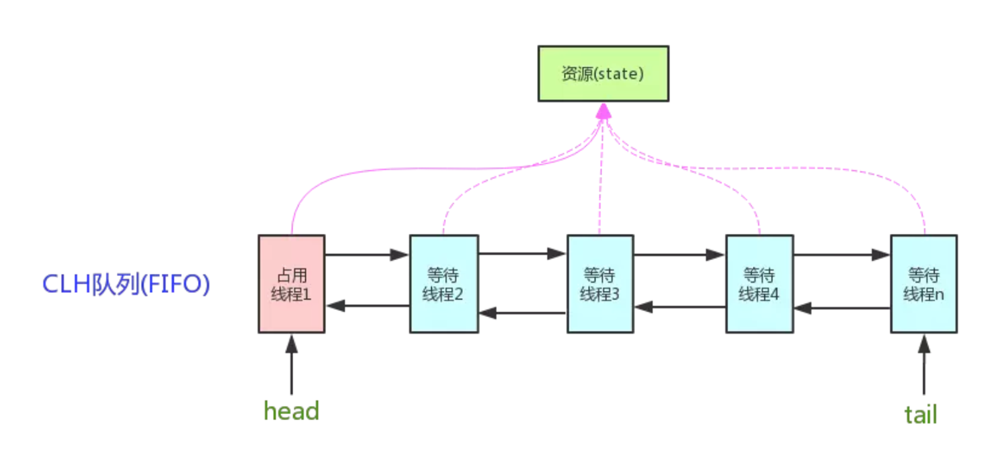

# 3 - JUC 多线程 - 知识点

[TOC]

```
3 - JUC 多线程 - 知识点
    1 线程基础知识
        1.1  线程与进程的区别
        1.2 并行和并发有什么区别
        1.3 创建线程的方式有哪些（高频）
        1.4 线程包含哪些状态-状态之间如何变化（高频）
        1.5 新建三个线程，如何保证它们按顺序执行
        1.6 wait 和 sleep 方法有什么不同
        1.7 如何停止一个正在运行的线程
        1.8 如何获取 Java 线程执行结果
        1.9 线程正确的中断方式 - interrupt
        1.10 使用多线程要注意哪些问题？
        1.11 保证数据的一致性有哪些方案呢？
    2 线程中并发安全（常问 - 锁机制）
        2.0 - 1 多线程带来的并发安全问题
        2.0 - 2 如何保证线程安全
        2.0- 3 Java 中有哪些常用的锁, 在什么场景下使用
        2.1 - 1 synchronized 关键字的底层原理
        2.1 - 2 锁升级过程详解
        2.2 - 1 谈一谈 JMM - Java内存模型
        2.2 - 2 谈一谈 JMM 中的重排序、顺序一致性以及 happens-before
        2.2 - 3 如何理解 JMM 与 happens-before
        2.3 谈谈 CAS
        2.4 如何理解 volatile
        2.5 什么是抽象队列同步器 AQS
        2.6 ReentrantLock 的实现原理
        2.7 死锁产生的条件是什么
        2.8 并发出现问题的根本原因是什么？
        2.9 并发读写锁 ReentrantReadWriteLock
        2.10 条件通知等候 Condition
        2.11 并发线程唤醒类 Lock Support
        2.12 如何理解可重入锁? sychronized 支持可重入吗? 如何实现?
        2.13 Java中想实现一个乐观锁，都有哪些方式？
        2.14 指令重排序的原理是什么？
        2.15 什么是公平锁和非公平锁
        2.16 ReentrantLock是怎么实现公平锁的？
    3 线程池（常问 - 项目）
        3.1 线程池的核心参数与执行原理
        3.2 自定义线程池中哪些常见的阻塞队列
        3.3 如何确定核心线程数
        3.4 线程池的种类有哪些
        3.5 为什么不推荐使用 Executors 类
        3.6 拒绝策略
        3.7 线程池 - 源码解析
        3.8 submit 提交的原理
        3.9 定时任务 ScheduledThreadPoolExecutor
        3.10 线程池中shutdown ()，shutdownNow()这两个方法有什么作用？
        3.11 提交给线程池中的任务可以被撤回吗？
    4 使用场景
        4.1 CountDownLatch - 等待多个线程完成
        4.2 Semaphore - 控制并发线程数量
        4.3 CyclicBarrier 公共屏障点
        4.4 ThreadLocal  以及其注意事项
        4.5 CompletableFuture
        4.6 原子操作类 Atomic - 底层是 CAS
        4.7 多线程打印奇偶数，怎么控制打印的顺序(重点重点重点!!!)
```

## 1 线程基础知识

### 1.1  线程与进程的区别

程序由**指令**和**数据**组成，但是这些指令要运行，数据要读写，就必须：

- 将指令加载到CPU中，
- 数据加载到内存中。
- 在指令运行过程中可能还需要用到磁盘，网络等性能。

**进程就是用来加载指令，管理内存，管理IO的。** 在电脑上开启一个浏览器、开启一个文本都是开启了一个进程。  **当一个程序被运行，从磁盘加载这个程序到内存中，这时候就开启了一个进程。**


**进程和线程的区别是什么：** 一个线程就是一个指令流，将指令流中的一条条指令以一定的顺序交给CPU执行，所以线程是使用CPU的最小单位。一个进程内可以划分为多个进程。

**二者对比：**

进程，**是对运行时程序的封装**，是系统进行资源调度和分配的基本单位，实现了操作系统的并发。进程让操作系统的并发性成为了可能，而线程让进程的内部并发成为了可能。

线程，**是进程的子任务**，是 CPU 调度和分派的基本单位，实现了进程内部的并发。

- 进程是正在执行的程序的实例；进程中包含了线程，每个线程占用CPU核心去执行不同的任务
- 进程之间不会相互影响；主线程结束会导致整个进程结束。
- 不同的进程之间数据难共享；进程下的所有线程可以共享内存空间。
- 进程切换成本比较高；线程更轻量，线程上下文切换成本更低，速度更快。

**进程和线程的本质：是否独占内存空间 + 分配资源 or CPU 调度**

他们两个本质的区别是**是否单独占有内存地址空间及其它系统资源（比如 I/O）**：

- 进程单独占有一定的内存地址空间，所以进程间存在内存隔离，数据是分开的，数据共享复杂但是同步简单，各个进程之间互不干扰；而线程共享所属进程占有的内存地址空间和资源，数据共享简单，但是同步复杂。
- 进程单独占有一定的内存地址空间，一个进程出现问题不会影响其他进程，不影响主程序的稳定性，可靠性高；一个线程崩溃可能影响整个程序的稳定性，可靠性较低。
- 进程单独占有一定的内存地址空间，进程的创建和销毁不仅需要保存**寄存器和栈**信息，还需要资源的分配回收以及页调度，开销较大；线程只需要保存寄存器和栈信息，开销较小。

另外一个重要区别是，**进程是操作系统进行资源分配的基本单位，而线程是操作系统进行调度的基本单位**，即 CPU 分配时间的单位 。

**操作系统的设计，因此可以归结为三点：**

- 以多进程形式，允许多个任务同时运行；
- 以多线程形式，允许单个任务分成不同的部分运行；
- 提供协调机制，一方面防止进程之间和线程之间产生冲突，另一方面允许进程之间和线程之间共享资源。


### 1.2 并行和并发有什么区别


**单核CPU的情况下：**

- 线程实际上还是串行执行的
- 操作系统中有一个任务调度器，将CPU的时间（时间片大约为15ms）分给不同的程序使用，只是由于cpu在线程间的切换非常快，感觉上是同时运行的
- 总结一句话就是：微观串行，宏观并行
- **一般将这种线程轮流使用CPU的方式叫做并发执行（Concurrent）**


**多核CPU情况下：**

- 每个核心可以调度运行线程，这时候线程可以是并行执行的
- **将这中同一个时间片内运行多个线程的模式叫做并行（Parallel）**

**并发与并行的区别：**

当代计算机都是多核CPU，在多核CPU下：

- 并发是指多一个时间段内多个线程轮流使用一个或多个CPU的过程
- 并行是指类似于4个CPU同时执行4个线程的过程


### 1.3 创建线程的方式有哪些（高频）

**创建线程共有四种方法：**

- 继承 Thread 类：继承 Thread 类并重写 run() 方法，之后通过 start() 开启线程
  - public class MyThread extends Thread
  - MyThread t1 = new MyThread()
  - t1.start()
- 实现 Runnable 接口：实现 Runnable 接口并重写 run() 方法，之后通过 start() 开启线程，不过注意实现 Runnable 接口的类要传入线程中
  - public class MyRunnble implements Runnable
  - MyRunnable mr = new MyRunnable()
  - Thread t1 = new Thread(mr)
  - t1.start()
- 实现 Callable 接口：实现 Callable 接口，并重写 call() 方法定义返回类型和返回值，并通过 FutureTask 来进行相应的包装，之后通过 start() 开启线程
  - public class MyCallable implements Callable<String>
  - MyCallable mc = new MyCallable()
  - FutureTask<String> ft = new FutureTask<String>(mc)
  - Thread t1 = new Thread(ft)
  - t1.start()
  - String res = ft.get()
- 线程池创建线程：创建一个类实现了 Runnable 接口，创建一个线程池，并将任务类提交到线程池中，该过程会完成自动的线程创建过程
  - public class MyExecutors implements Runnable
  - ExecutorService threadPool = Executors.newFixedThreadPool(3);
  - threadPool.submit(new MyExecutors());
  - threadPool.shutdown();

**使用 Runnable 和 Callable 的区别是什么：**

- 是否有返回值：
  - Runnable 接口中的 run 方法没有返回值
  - Callable 接口中的 call 方法有返回值，是个泛型类型，可以和 Futrue、FutureTask 来配合获取异步执行的结果
- 是否抛出异常：
  - Callable 接口的 call 方法允许抛出异常
  - Runnable 接口的 run 方法的异常只能在内部消化，不能抛出异常

**Future 和 FutureTask 的关系：**

- Future 是一个接口，无法直接创建对象，需配合**线程池**使用 .submit() 方法返回值来保存执行结果；而使用 .execute() 方法传入 Runnable 接口无返回值。
- FutureTask 是一个类，可以直接创建对象，其实现了 RunnableFuture 接口（继承Future接口）

**在启动线程的时候，可以使用 run 方法吗？run 和 start 有什么区别？**

- start ：用来开启线程，通过该线程调用 run 方法来执行对应的逻辑操作，start 方法只能被调用一次。
- run：run 方法封装了线程要执行的代码，但是直接使用 run 方法还是在主线程运行，不会开启新线程。

**如果想要 Thread 放弃时间片，可以使用什么方法？ - yield() 方法**

yield() 方法是一个静态方法，用于暗示当前线程愿意放弃其当前的时间片，允许其他线程执行。然而，它只是向线程调度器提出建议，调度器可能会忽略这个建议。具体行为取决于操作系统和 JVM 的线程调度策略。

```java
class YieldExample {
    public static void main(String[] args) {
        Thread thread1 = new Thread(YieldExample::printNumbers, "刘备");
        Thread thread2 = new Thread(YieldExample::printNumbers, "关羽");

        thread1.start();
        thread2.start();
    }

    private static void printNumbers() {
        for (int i = 1; i <= 5; i++) {
            System.out.println(Thread.currentThread().getName() + ": " + i);

            // 当 i 是偶数时，当前线程暂停执行
            if (i % 2 == 0) {
                System.out.println(Thread.currentThread().getName() + " 让出控制权...");
                Thread.yield();
            }
        }
    }
}
```


### 1.4 线程包含哪些状态-状态之间如何变化（高频）


Java中有个 Thread 类中有个枚举类 State，将**线程状态分为了六个**：

- **NEW：** 尚未启动的线程的线程状态，没有调用 start 之前的方法
  - 反复调用同一个线程的 start 方法是否可行？ - 会报错
  - 假如一个线程执行完毕（此时处于 TERMINATED 状态），再次调用这个线程的 start 方法是否可行？ - 会报错
  - 都不行，在调用 start 之后，threadStatus 的值会改变（`threadStatus !=0`），再次调用 start 方法会抛出 IllegalThreadStateException 异常。
- **RUNNABLE**：可运行线程的线程状态，处于 RUNNABLE 状态的线程在 Java 虚拟机中运行，也有可能在等待 CPU 分配资源。
- **BLOCKED**：线程阻塞等待 **监视器锁 Monitor** 的线程状态。
- **WAITING： ** 等待线程的线程状态，调用下面三个方法会进行到等待状态
  - Object.wait()：使当前线程处于等待状态直到另一个线程唤醒它；
  - Thread.join()：等待线程执行完毕，底层调用的是 Object 的 wait 方法；
  - LockSupport.park()：除非获得调用许可，否则禁用当前线程进行线程调度。
- **TIMED_WAITING：** 具有指定等待时间的等待线程的线程状态，调用如下方法会使线程进入超时等待状态：
  - Thread.sleep(long millis)：使当前线程睡眠指定时间；
  - Object.wait(long timeout)：线程休眠指定时间
  - Thread.join(long millis)：等待当前线程最多执行 millis 毫秒
- **TERMINATED**：线程已完成，终止状态

**Blocking 和 Waiting 有什么区别:**

1. 触发条件:
   1. 线程进入BLOCKED状态通常是因为试图获取一个对象的锁（monitorlock），但该锁已经被另一个线程持有。这通常发生在尝试进入synchronized块或方法时，如果锁已被占用，则线程将被阻塞直到锁可用。
   2. 线程进入WAITING状态是因为它正在等待另一个线程执行某些操作，例如调用Object.wait()方法、Thread.join()方法或LockSupport.park()方法。在这种状态下，线程将不会消耗CPU资源，并且不会参与锁的竞争。
2. 唤醒机制:
   1. 当一个线程被阻塞等待锁时，一旦锁被释放，线程将有机会重新尝试获取锁。如果锁此时未被其他线程获取，那么线程可以从BLOCKED状态变为RUNNABLE状态。
   2. 线程在WAITING状态中需要被显式唤醒。例如，如果线程调用了Object.wait()，那么它必须等待另一个线程调用同一对象上的Object.notify()或Object.notifyAll()方法才能被唤醒。

**wait 状态下的线程如何进行恢复到 running 状态?**

1. 等待的线程**被其他线程对象唤醒**，notify()和notifyAll()。
2. 执行了 LockSupport.park() 方法进入了Waiting 状态，那么解锁的时候会执行LockSupport.unpark(Thread)，与上面park方法对应，给出许可证，**解除等待状态**。

**notify 和 notifyAll 的区别?**

同样是唤醒等待的线程，同样最多只有一个线程能获得锁，同样不能控制哪个线程获得锁。

区别在于：

- notify：唤醒一个线程，其他线程依然处于wait的等待唤醒状态，如果被唤醒的线程结束时没调用notify，其他线程就永远没人去唤醒，只能等待超时，或者被中断
- notifyAll：所有线程退出wait的状态，开始竞争锁，但只有一个线程能抢到，这个线程执行完后，其他线程又会有一个幸运儿脱颖而出得到锁(因为 blocking 状态一旦锁被释放，线程将有机会重新尝试获取锁)

**notify 选择哪个线程?**

notify在源码的注释中说到notify选择唤醒的线程是任意的，但是依赖于具体实现的jvm。

JVM有很多实现，比较流行的就是hotspot，hotspot对notofy()的实现并不是我们以为的随机唤醒,，而是“先进先出”的顺序唤醒。


### 1.5 新建三个线程，如何保证它们按顺序执行

**最简单的方式是使用线程中的`join` 方法**

- 阻塞调用此方法的线程，使其进入到 **TIMED_WAITING 状态**
- 直到线程 t 执行完成之后，该线程再继续执行

但是这样其实是串行执行的，并没有起到按顺序执行之后 → 并发处理的过程


### 1.6 wait 和 sleep 方法有什么不同

**对比一下 wait 方法和 sleep 方法的区别：**

- 共同点：
  - wait(), wait(long), sleep(long) 的效果都可以让当前线程暂时放弃CPU的使用权
  - 都可以让线程进入阻塞状态
- 不同点：
  - 方法归属不同：
    - sleep(long) 是 Thread 的静态方法
    - wait(), wait(long) 都是 Object 的成员方法，每个对象都有
  - 醒来时机不同：
    - 执行 sleep(long) 和 wait(long) 的线程都会在等待响应毫秒之后醒来
    - wait(), wait(long) 还可以被 notify 唤醒，wait() 如果不唤醒就一直等待下去
    - 它们都可以被打断唤醒
  - 锁的特性不同：
    - wait 方法的调用必须**先获取 wait 对象的锁**，而 sleep 无此限制
    - wait 方法执行后会**释放**对象锁，允许其他线程获得该对象锁
    - 而 sleep 如果在 synchronized 代码块中执行，则**不会释放**对象锁


### 1.7 如何停止一个正在运行的线程

有三种方式可以停止线程：

- 使用

  退出标记

  ，使线程正常退出，就是当 run 方法完成之后终止线程

  - 注意退出标记上使用 volatile

- 使用 stop 方法强行中断线程（不推荐，并且方法已作废）

- 使用 interrupt 方法中断线程（也是退出标记）

  - 打断阻塞的线程（sleep、wait、join）的线程，线程会抛出 InterruptedException 异常
  - 打断正常的线程，可以根据打断状态来标记是否退出线程
    - 内部原理是对 `thread.isInterrupted()` 状态进行更改，调用 interrupt 方法放将状态更改为true，可以按照标记进行退出


### 1.8 如何获取 Java 线程执行结果

获取 Java 线程执行结果，共有三种常用的方法：

- Callable 配合 ExecutorService 获取执行结果
- Future 接口获取执行结果
- FutureTask 实现类获取执行结果

首先介绍 Callable 配合 ExecutorService 获取执行结果：ExecutorService 是一个接口，它是 Java 线程池框架的核心接口，用来异步执行任务。使用示例如下：

```java
// 创建一个包含5个线程的线程池
ExecutorService executorService = Executors.newFixedThreadPool(5);

// 创建一个Callable任务
Callable<String> task = new Callable<String>() {
    public String call() {
        return "Hello from " + Thread.currentThread().getName();
    }
};

// 提交任务到ExecutorService执行，并获取Future对象
Future[] futures = new Future[10];
for (int i = 0; i < 10; i++) {
    futures[i] = executorService.submit(task);
}

// 通过Future对象获取任务的结果
for (int i = 0; i < 10; i++) {
    System.out.println(futures[i].get());
}

// 关闭ExecutorService，不再接受新的任务，等待所有已提交的任务完成
executorService.shutdown();
```

在前面的例子中，我们通过 Future 来获取 Callable 任务的执行结果，Future 是一个接口，其中提供了三种功能：

1）判断任务是否完成；

2）能够中断任务；

3）能够获取任务执行结果。

FutureTask 是 Future 接口的一个唯一实现类，我们在前面的例子中 executorService.submit() 返回的就是 FutureTask。也可以直接使用 FutureTask 类得到线程的返回值，其构造器和使用过程如下：

```java
public FutureTask(Callable<V> callable) {}
public FutureTask(Runnable runnable, V result) {}
// 创建一个固定大小的线程池
ExecutorService executorService = Executors.newFixedThreadPool(3);

// 创建一系列 Callable
Callable<Integer>[] tasks = new Callable[5];
for (int i = 0; i < tasks.length; i++) {
    final int index = i;
    tasks[i] = new Callable<Integer>() {
        @Override
        public Integer call() throws Exception {
            TimeUnit.SECONDS.sleep(index + 1);
            return (index + 1) * 100;
        }
    };
}

// 将 Callable 包装为 FutureTask，并提交到线程池
FutureTask<Integer>[] futureTasks = new FutureTask[tasks.length];
for (int i = 0; i < tasks.length; i++) {
    futureTasks[i] = new FutureTask<>(tasks[i]);
    executorService.submit(futureTasks[i]);
}

// 获取任务结果
for (int i = 0; i < futureTasks.length; i++) {
    System.out.println("Result of task" + (i + 1) + ": " + futureTasks[i].get());
}

// 关闭线程池
executorService.shutdown();
```


### 1.9 线程正确的中断方式 - interrupt

**如何正确中断线程:**

目前在 Java 里还没有安全方法来直接停止线程，但是 Java 提供了线程中断机制来处理需要中断线程的情况。线程中断机制是一种协作机制。需要注意，通过中断操作并不能直接终止一个线程，而是**通知需要被中断的线程自行处理**。

简单介绍下 Thread 类里提供的关于线程中断的几个方法：

- Thread.interrupt()：中断线程。这里的中断线程并不会立即停止线程，而是设置线程的中断状态为 true（默认是 flase）；
- Thread.currentThread().isInterrupted()：测试当前线程是否被中断。线程的中断状态会受这个方法的影响，调用一次可以使线程中断状态变为 true，调用两次会使这个线程的中断状态重新转为 false；
- Thread.isInterrupted()：测试当前线程是否被中断。与上面方法不同的是调用这个方法并不会影响线程的中断状态。

在线程中断机制里，当其他线程通知需要被中断的线程后，线程中断的状态被设置为 true，但是**具体被要求中断的线程要怎么处理，完全由被中断线程自己决定**，可以在合适的时机中断请求，也可以完全不处理继续执行下去。

**调用 interrupt 是如何让线程抛出异常的:**

每个线程都一个与之关联的布尔属性来表示其中断状态，中断状态的初始值为false，当一个线程被其它线程调用Thread.interrupt()方法中断时，会根据实际情况做出响应。

- 如果该线程正在执行低级别的可中断方法如 Thread.sleep()、Thread.join()或Object.wait()），则会解除阻塞并**抛出 InterruptedException 异常**。
- 否则Thread.interrupt()仅设置线程的中断状态，在该被中断的线程中稍后可通过轮询中断状态来决定是否要停止当前正在执行的任务。


### 1.10 **使用多线程要注意哪些问题？**

Java 底层会调用 pthread_create 来创建线程，所以本质上 java 程序创建的线程，就是和操作系统线程是一样的，是 1 对 1 的线程模型。

要注意的问题是保证多线程的安全，不要出现数据竞争造成的数据混乱的问题。

Java的线程安全在三个方面体现：

- **原子性**：提供互斥访问，同一时刻只能有一个线程对数据进行操作，在Java中使用了synchronized 关键字来确保原子性；
- **可见性**：一个线程对主内存的修改可以及时地被其他线程看到，在Java中使用了synchronized和volatile这两个关键字确保可见性；
- **有序性**：一个线程观察其他线程中的指令执行顺序，由于指令重排序，该观察结果一般杂乱无序，在Java中使用了happens-before原则来确保有序性。


### 1.11 **保证数据的一致性有哪些方案呢？**

- **事务管理**：使用数据库事务来确保一组数据库操作要么全部成功提交，要么全部失败回滚。通过ACID（原子性、一致性、隔离性、持久性）属性，数据库事务可以保证数据的一致性。
- **锁机制**：使用锁来实现对共享资源的互斥访问。在 Java 中，可以使用 synchronized 关键字、ReentrantLock 或其他锁机制来控制并发访问，从而避免并发操作导致数据不一致。
- **版本控制**：通过乐观锁的方式，在更新数据时记录数据的版本信息，从而避免同时对同一数据进行修改，进而保证数据的一致性。


## 2 线程中并发安全（常问 - 锁机制）

### 2.0 - 1 多线程带来的并发安全问题

有时候我们会发现，明明在单线程环境中正常运行的代码，在多线程环境中就会出现意料之外的结果，这就是大家常说的『线程不安全』。线程安全问题主要分为以下几点：

**1.原子性**

```java
int i = 0; // 操作1
i++;       // 操作2
int j = i; // 操作3
i = i + 1; // 操作4
```

上面这四个操作中，其实只有操作 1 和操作 3 是原子操作。

- 操作 1：这是原子操作，因为它是一个单一的、不可分割的步骤。
- 操作 2：这不是原子操作。这实际上是一个 "read-modify-write" 操作，它包括了读取 i 的值，增加 i，然后写回 i。
- 操作 3：这是原子操作，因为它是一个单一的、不可分割的步骤。
- 操作 4：这不是原子操作。和 i++ 一样，这也是一个 "read-modify-write" 操作。

在单线程环境下上述四个操作都不会出现问题，但是在多线程环境下，如果不加锁的话，可能会得到意料之外的值。**例如，当两个线程并发执行 i++ 的时候，会出现并发问题。**

**2.可见性**

```java
class Test {
  int i = 50;
  int j = 0;

  public void update() {
    // 线程1执行
    i = 100;
  }

  public int get() {
    // 线程2执行
    j = i;
    return j;
  }
}
```

可见性：当多个线程访问同一个变量时，一个线程修改了这个变量的值，其他线程能够立即看得到修改的值。可见性带来的问题，如下：

- 线程 1 执行 update 方法将 i 赋值为 100，一般情况下线程 1 会在自己的工作内存中完成赋值操作，但不会及时将新值刷新到主内存中。
- 线程 2 执行 get 方法，首先会从主内存中读取 i 的值，然后加载到自己的工作内存中，此时读到 i 的值仍然是 50，再将 50 赋值给 j，最后返回 j 的值就是 50 了。
- 原本期望返回 100，结果返回 50，这就是可见性问题，线程 1 对变量 i 进行了修改，线程 2 并没有立即看到 i 的新值。

为了解决多线程的可见性问题，Java 提供了`volatile`这个关键字：

- 当一个共享变量被 volatile 修饰时，它会保证修改的值立即更新到主存当中
- 当有其他线程需要读取时，就会从内存中读到新值

当然 Java 的锁机制如 synchronized 和 lock 也是可以保证可见性的。

**3.活跃性**

活跃性问题一般分为三类：死锁、活锁、饥饿问题

- 死锁：死锁是指多个线程因为环形等待锁的关系而永远地阻塞下去。
- 活锁：当多个线程都在运行并且都在修改各自的状态，而其他线程又依赖这个状态，就导致任何一个线程都无法继续执行，只能**重复**着自身的动作，于是就发生了活锁。
- 饥饿：如果一个线程无其他异常却迟迟不能继续运行，那基本上是处于饥饿状态了。
  - 高优先级的线程一直在运行消耗 CPU，所有的低优先级线程一直处于等待；
  - 一些线程被永久堵塞在一个等待进入同步块的状态，而其他线程总是能在它之前持续地对该同步块进行访问；

**多线程带来了两个必须考虑的性能开销：**

- 创建线程和销毁线程的开销：
  - 创建线程是直接向系统申请资源的，对操作系统来说，创建一个线程的代价是十分昂贵的，需要给它分配内存、列入调度等。
- 线程上下文切换的开销：
  - 上下文切换：保存当前线程的本地数据，程序指针等状态，并加载下一个要执行线程的本地数据，程序指针等。
- 一般减少上下文切换的方法：
  - 无锁并发编程：可以参照 ConcurrentHashMap 锁分段的思想，不同的线程处理不同段的数据，这样在多线程竞争的条件下，可以减少上下文切换的时间。
  - CAS 算法，利用 Atomic + CAS 算法来更新数据，采用乐观锁的方式，可以有效减少一部分不必要的锁竞争带来的上下文切换。
  - 使用最少线程：避免创建不必要的线程，如果任务很少，但创建了很多的线程，这样就会造成大量的线程都处于等待状态。
  - 协程：在单线程里实现多任务的调度，并在单线程里维持多个任务间的切换。


### 2.0 - 2 如何保证线程安全

1. **synchronized关键字**:可以使用synchronized关键字来同步代码块或方法，确保同一时刻只有一个线程可以访问这些代码。对象锁是通过synchronized关键字锁定对象的监视器（monitor）来实现的。
2. **volatile关键字**:volatile关键字用于变量，确保所有线程看到的是该变量的最新值，而不是可能存储在本地寄存器中的副本。
3. **Lock接口和ReentrantLock类** :java.util.concurrent.locks.Lock接口提供了比synchronized更强大的锁定机制，ReentrantLock是一个实现该接口的例子，提供了更灵活的锁管理和更高的性能。
4. **原子类**：Java并发库（java.util.concurrent.atomic）提供了原子类，如AtomicInteger、AtomicLong等，这些类提供了原子操作，可以用于更新基本类型的变量而无需额外的同步。
5. **线程局部变量**:ThreadLocal类可以为每个线程提供独立的变量副本，这样每个线程都拥有自己的变量，消除了竞争条件。
6. **并发集合**:使用java.util.concurrent包中的线程安全集合，如ConcurrentHashMap、ConcurrentLinkedQueue等，这些集合内部已经实现了线程安全的逻辑。
7. **JUC工具类**: 使用java.util.concurrent包中的一些工具类可以用于控制线程间的同步和协作。例如：Semaphore和CyclicBarrier等。


### 2.0- 3 Java 中有哪些常用的锁, 在什么场景下使用

锁可以确保在任意给定时间内只有一个线程可以访问特定的资源，从而避免数据竞争和不一致性。Java提供了多种锁机制，可以分为以下几类：

1. **内置锁（synchronized）：** Java中的synchronized关键字是内置锁机制的基础，可以用于方法或代码块。当一个线程进入synchronized代码块或方法时，它会获取关联对象的锁；当线程离开该代码块或方法时，锁会被释放。如果其他线程尝试获取同一个对象的锁，它们将被阻塞，直到锁被释放。其中，syncronized加锁时有无锁、偏向锁、轻量级锁和重量级锁几个级别。
   1. 偏向锁用于当一个线程进入同步块时，如果没有任何其他线程竞争，就会使用偏向锁，以减少锁的开销。
   2. 轻量级锁使用线程栈上的数据结构，避免了操作系统级别的锁。
   3. 重量级锁则涉及操作系统级的互斥锁。
2. **ReentrantLock:** 是一个显式的锁类，提供了比synchronized更高级的功能，如可中断的锁等待、定时锁等待、公平锁选项等。ReentrantLock使用lock()和unlock()方法来获取和释放锁。其中，公平锁按照线程请求锁的顺序来分配锁，保证了锁分配的公平性，但可能增加锁的等待时间。非公平锁不保证锁分配的顺序，可以减少锁的竞争，提高性能，但可能造成某些线程的饥饿。
3. **读写锁（ReadWriteLock）：** 接口定义了一种锁，允许多个读取者同时访问共享资源，但只允许一个写入者。读写锁通常用于读取远多于写入的情况，以提高并发性。
4. **乐观锁和悲观锁：** 悲观锁（Pessimistic Locking）通常指在访问数据前就锁定资源，假设最坏的情况，即数据很可能被其他线程修改。synchronized和ReentrantLock都是悲观锁的例子。乐观锁（Optimistic Locking）通常不锁定资源，而是在更新数据时检查数据是否已被其他线程修改。乐观锁常使用版本号或时间戳来实现。
5. **自旋锁 CAS：** 自旋锁是一种锁机制，线程在等待锁时会持续循环检查锁是否可用，而不是放弃CPU并阻塞。通常可以使用CAS来实现。这在锁等待时间很短的情况下可以提高性能，但过度自旋会浪费CPU资源。


### 2.1 - 1 synchronized 关键字的底层原理

synchronized关键字的使用方法：**并发控制 - 保证原子性、有序性、可见性**

- 可以使用在需要加锁控制的地方，例如抢票过程（如何控制防止抢到同一张票）

- synchronized 是一个对象锁，采用互斥的方式让

  同一时刻至多只有一个线程

  可以持有对象锁，其他线程再想获取该对象锁时就会被阻塞住。

  - 同步方法，为当前对象（this）加锁，进入同步代码前要获得当前对象的锁；
  - 同步静态方法，为当前类加锁（锁的是 class 对象），进入同步代码前要获得当前类的锁；
  - 同步代码块，指定加锁对象，对给定对象加锁，进入同步代码库前要获得给定对象的锁。

**快手面经 - synchronized关键字的底层原理是什么？**


synchronized是java提供的原子性内置锁，这种内置的并且使用者看不到的锁也被称为**监视器锁**，使用synchronized之后，其执行流程如下：

- 会在编译之后在**同步的代码块前后加上monitorenter和monitorexit字节码指令**，他依赖操作系统底层互斥锁实现。主要就是实现原子性操作和解决共享变量的内存可见性问题。
- **执行monitorenter指令**时会尝试获取对象锁，如果对象没有被锁定或者已经获得了锁，锁的计数器+1。此时其他竞争锁的线程则会进入等待队列中。
- **执行monitorexit指令**时则会把计数器-1，当计数器值为0时，则锁释放，处于等待队列中的线程再继续竞争锁。
- synchronized是排它锁，当一个线程获得锁之后，其他线程必须等待该线程释放锁后才能获得锁，而且由于Java中的线程和操作系统原生线程是一一对应的，线程被阻塞或者唤醒时时会从用户态切换到内核态，这种转换非常消耗性能。

实际上大部分时候我认为说到monitorenter就行了，但是为了更清楚的描述，还是再具体一点。

**如果再深入到源码来说，synchronized 实际上有两个队列 waitSet 和 entryList ：**

1. 当多个线程进入同步代码块时，首先进入entryList
2. 有一个线程获取到monitor锁后，就赋值给当前线程，并且计数器+1
3. 如果线程调用wait方法，将释放锁，当前线程置为null，计数器-1，同时进入waitSet等待被唤醒，调用notify或者notifyAll之后又会进入entryList竞争锁
4. 如果线程执行完毕，同样释放锁，计数器-1，当前线程置为null

**synchronized 底层如何实现 - Monitor**


synchronized 底层是使用 **monitor 监视器**对代码块进行上锁和解锁的过程：

- monitorenter 用于对对象进行加锁，线程获取锁需要使用对象去关联monitor
- monitorexit 用于对对象进行解锁（两次解锁防止异常抛出）
- monitor 监视器中的结构如下：
  - **Owner**：当第一个线程 Thread-1 **获取锁**时，设置 monitor 监视器的 Owner 为 Thread-1
  - **WaitSet**：关联调用了 **wait** 方法的线程，记录处于 Waiting 状态的线程
  - EntryList：
    - 当第二个线程 Thread-2 获取锁失败，则需要将 Thread-2 设置为 BLOCKED，并将其放入到 EntryList 中进行等待
    - 当线程 Thread-1 执行完之后，会让EntryList 中的等待线程进行争抢（**非公平**）

**synchronized 底层如何实现 - 进阶 - Monitor时重量级锁**

**Monitor实现的锁属于重量级锁，你了解过锁升级吗？**

- Monitor 实现的锁属于重量级锁，底层由C++实现
  - 使用 synchronized 加锁里面涉及到了用户态和内核态的切换、进程的上下文切换。
  - Monitor实现的锁成本较高，性能比较低。
- 在 JDK 1.6 中引入了两种新型锁机制：**偏向锁和轻量级锁**，他们的引入是为了解决在**没有多线程竞争或者基本没有竞争**的场景下使用传统锁机制带来的性能开销问题

**对象的内存结构：**

在 HotSpot 虚拟机中，**对象在内存中的存储布局可以分为三个区域：**

- 对象头：
  - MarkWork 描述对象与Monitor是如何关联的
  - Class Word：描述对象实例的具体类型
- 实例数据：类中的成员变量
- 对象填充：补充对其到 8 的整数倍 - 因为是以字节存取的

**将 Mark Word 的结构抽取出来分析：每一行代表不同状态的时候 mark down 分别是什么样子的：**

- 可以根据 state 字段判断当前的锁类型
- 可以根据 markdown 中字段获取到**关联**到哪个 monitor 重量级锁


### 2.1 - 2 锁升级过程详解

**锁升级的背景：**

在 JDK 1.6 以前，所有的锁都是”重量级“锁，因为使用的是操作系统的互斥锁，当一个线程持有锁时，其他试图进入synchronized块的线程将被阻塞，直到锁被释放。涉及到了线程上下文切换和用户态与内核态的切换，因此效率较低。

那为了减少获得锁和释放锁带来的性能消耗，JDK 1.6 引入了“偏向锁”和“轻量级锁” 的概念，对 synchronized 做了一次重大的升级，升级后的 synchronized 性能可以说上了一个新台阶。

**具体的锁升级的过程是：无锁->偏向锁->轻量级锁->重量级锁。**

1. **无锁**：这是没有开启偏向锁的时候的状态，在JDK1.6之后偏向锁的默认开启的，但是有一个偏向延迟，需要在JVM启动之后的多少秒之后才能开启，这个可以通过JVM参数进行设置，同时是否开启偏向锁也可以通过JVM参数设置。
2. **偏向锁**：这个是在偏向锁开启之后的锁的状态，如果还没有一个线程拿到这个锁的话，这个状态叫做匿名偏向，当一个线程拿到偏向锁的时候，下次想要竞争锁只需要拿线程ID跟MarkWord当中存储的线程ID进行比较，如果线程ID相同则直接获取锁（相当于锁偏向于这个线程），不需要进行CAS操作和将线程挂起的操作。
3. **轻量级锁**：在这个状态下线程主要是通过CAS操作实现的。将对象的MarkWord存储到线程的虚拟机栈上，然后通过CAS将对象的MarkWord的内容设置为指向Displaced Mark Word的指针，如果设置成功则获取锁。在线程出临界区的时候，也需要使用CAS，如果使用CAS替换成功则同步成功，如果失败表示有其他线程在获取锁，那么就需要在释放锁之后将被挂起的线程唤醒。
4. **重量级锁**：当有两个以上的线程获取锁的时候轻量级锁就会升级为重量级锁，因为CAS如果没有成功的话始终都在自旋，进行while循环操作，这是非常消耗CPU的，但是在升级为重量级锁之后，线程会被操作系统调度然后挂起，这可以节约CPU资源。

几种锁会随着竞争情况逐渐升级，锁的升级很容易发生，但是锁降级发生的条件就比较苛刻了，锁降级发生在 STW 期间，当 JVM 进入安全点的时候，会检查是否有闲置的锁，然后进行降级。


**先简单看一下锁升级的过程:**

1. 线程A进入 synchronized 开始抢锁，JVM 会判断当前是否是偏向锁的状态，如果是就会根据 Mark Word 中存储的线程 ID 来判断，当前线程A是否就是持有偏向锁的线程。如果是，则忽略 check，线程A直接执行临界区内的代码。
2. 但如果 Mark Word 里的线程不是线程 A，就会通过自旋尝试获取锁，如果获取到了，就将 Mark Word 中的线程 ID 改为自己的;如果竞争失败，就会立马撤销偏向锁，膨胀为轻量级锁。
3. 后续的竞争线程都会通过自旋来尝试获取锁，如果自旋成功那么锁的状态仍然是轻量级锁。然而如果竞争失败，锁会膨胀为重量级锁，后续等待的竞争的线程都会被阻塞。

**synchronized 锁升级 - 偏向锁**


Hotspot 的作者经过以往的研究发现大多数情况下**锁不仅不存在多线程竞争，而且总是由同一线程多次获得**，于是引入了偏向锁。

- 偏向锁会偏向于第一个访问锁的线程，如果在接下来的运行过程中，该锁没有被其他的线程访问，则持有偏向锁的线程将永远不需要触发同步。
- 也就是说，**偏向锁在资源无竞争情况下消除了同步语句。**

大白话就是对锁设置个变量，如果发现为 true，代表资源无竞争，则无需再走各种加锁/解锁流程。如果为 false，代表存在其他线程竞争资源，那么就会走后面的流程。

**偏向锁的加锁过程：**

1. 一个线程在第一次进入同步块时，会在对象头和栈帧中的锁记录里存储锁偏向的线程 ID。
2. 当下次该线程进入这个同步块时，会去检查锁的 Mark Word 里面是不是放的自己的线程 ID。
3. 如果是，表明该线程已经获得了锁，以后该线程在进入和退出同步块时不需要花费 CAS 操作来加锁和解锁。
4. 如果不是，就代表有另一个线程来竞争这个偏向锁。这个时候会尝试使用 CAS 来替换 Mark Word 里面的线程 ID 为新线程的 ID，这个时候要分两种情况：（只有为无锁状态 CAS 才会成功）
   1. 成功，表示之前的线程不存在了， Mark Word 里面的线程 ID 为新线程的 ID，锁不会升级，仍然为偏向锁；
   2. 失败，表示之前的线程仍然存在，那么暂停之前的线程，设置偏向锁标识为 0，并设置锁标志位为 00，升级为轻量级锁，会按照轻量级锁的方式进行竞争锁。

**偏向锁的撤销过程：**

偏向锁使用了一种**等到竞争出现才释放锁的机制**，所以当其他线程尝试竞争偏向锁时，持有偏向锁的线程才会释放锁。

偏向锁升级成轻量级锁时，会暂停拥有偏向锁的线程，重置偏向锁标识，这个过程看起来容易，实则开销还是很大的，大概的过程如下：

1. 在一个安全点（在这个时间点上没有字节码正在执行）停止拥有锁的线程。
2. 遍历线程栈，如果存在锁记录的话，需要修复锁记录和 Mark Word，使其变成无锁状态。
3. 唤醒被停止的线程，将当前锁升级成轻量级锁。

**synchronized 锁升级 - 轻量级锁如何实现**


多个线程在不同时段获取同一把锁，即不存在锁竞争的情况，也就没有线程阻塞。针对这种情况，JVM 采用轻量级锁来避免线程的阻塞与唤醒。

- JVM 会为每个线程在当前线程的栈帧中创建用于存储锁记录的空间，我们称为 Displaced Mark Word。
- 如果一个线程获得锁的时候发现是轻量级锁，会把锁的 Mark Word 复制到自己的 Displaced Mark Word 里面。

**轻量级锁的加锁过程：**

1. 锁对象 Obj 对象头中的 Mark Word 刚开始时无锁状态
2. 线程的虚拟机栈中创建一个栈帧，栈帧中包含了一个锁记录 Lock Record：
   1. 锁记录中的 Object Reference 指向了锁对象 Obj
   2. 线程尝试用 CAS 将锁的 Mark Word 替换为指向锁记录的指针。
   3. 成功，当前线程获得锁：锁对象 Obj 拥有了轻量级锁记录的地址；轻量级锁记录中保存了锁对象 Obj 原有的 hashcode-age 等信息。
   4. 失败，表示 Mark Word 已经被替换成了其他线程的锁记录，说明在与其它线程竞争锁，当前线程就尝试使用自旋来获取锁。
3. 适应性自旋，简单来说就是线程如果自旋成功了，则下次自旋的次数会更多，如果自旋失败了，则自旋的次数就会减少。
4. 如果自旋到一定程度（和 JVM、操作系统相关），依然没有获取到锁，称为自旋失败，那么这个线程会阻塞。同时这个锁就会**升级成重量级锁**。

**轻量级锁的释放过程：**

在释放锁时：

- 当前线程会使用 CAS 操作将 Displaced Mark Word 的内容复制回锁的 Mark Word 里面。
  - 如果没有发生竞争，那么这个复制的操作会成功。
  - 如果有其他线程因为自旋多次导致轻量级锁升级成了重量级锁，那么 CAS 操作会失败，此时会释放锁并唤醒被阻塞的线程。

**偏向锁和轻量级锁的区别：**

- 轻量级锁在没有竞争时，每次重入操作仍然需要进行一次 CAS 操作。
- Java6 中引入了偏向锁来进一步优化：只有第一次使用 CAS 将线程ID（Lock Record）设置到对象的Mark Word 中
  - 之后发现该线程 ID 是自己的线程就表示没有竞争，不用重新 CAS
  - 以后只要不发生竞争，这个对象就归该线程所有

**synchronized 锁升级 - 重量级锁如何实现**

重量级锁依赖于操作系统的**互斥锁（mutex**，用于保证任何给定时间内，只有一个线程可以执行某一段特定的代码段） 实现，而操作系统中线程间状态的转换需要相对较长的时间，所以重量级锁效率很低，但被阻塞的线程不会消耗 CPU。

每一个对象都可以当做一个锁，当多个线程同时请求某个对象锁时，对象锁会设置几种状态用来区分请求的线程：

- Contention List：所有请求锁的线程将被首先放置到该竞争队列
- Entry List：Contention List 中那些有资格成为候选人的线程被移到 Entry List
- Wait Set：那些调用 wait 方法被阻塞的线程被放置到 Wait Set
- Owner：获得锁的线程称为 Owner

**重量级锁的加锁过程：**

1. 当一个线程尝试获得锁时，如果该锁已经被占用，则会将该线程封装成一个`ObjectWaiter`对象插入到 Contention List 队列的队首，然后调用`park` 方法挂起当前线程。

2. 当线程释放锁时，会从 Contention List 或 EntryList 中挑选一个线程唤醒，被选中的线程会尝试获得锁，如果线程尝试获取锁失败，它会直接进入阻塞状态，等待操作系统的调度。

3. 如果线程获得锁后调用

   ```
   Object.wait
   ```

   方法，则会将线程加入到 WaitSet 中，当被

   ```
   Object.notify
   ```

   唤醒后，会将线程从 WaitSet 移动到 Contention List 或 EntryList 中去。

   1. 需要注意的是，当调用一个锁对象的`wait`或`notify`方法时，**如当前锁的状态是偏向锁或轻量级锁则会先膨胀成重量级锁**。

**synchronized 锁升级 - 锁升级过程**

每一个线程在准备获取共享资源时：

1. 检查 MarkWord 里面是不是放的自己的 ThreadId ,如果是，表示当前线程是处于 “偏向锁” 。
2. 如果 MarkWord 不是自己的 ThreadId，锁升级，这时候，用 CAS 来执行切换，新的线程根据 MarkWord 里面现有的 ThreadId，通知之前线程暂停，之前线程将 Markword 的内容置为空。
3. 两个线程都把锁对象的 HashCode 复制到自己新建的用于存储锁的记录空间，接着开始通过 CAS 操作，把锁对象的 MarKword 的内容修改为自己新建的记录空间的地址的方式竞争 MarkWord。
4. 第三步中成功执行 CAS 的获得资源，失败的则进入自旋 。
5. 自旋的线程在自旋过程中，成功获得资源(即之前获的资源的线程执行完成并释放了共享资源)，则整个状态依然处于 轻量级锁的状态，如果自旋失败 。
6. 进入重量级锁的状态，这个时候，自旋的线程进行阻塞，等待之前线程执行完成并唤醒自己。


### 2.2 - 1 谈一谈 JMM - Java内存模型

Java 内存模型（Java Memory Model，JMM）定义了 Java 程序中的变量、线程如何和主存以及工作内存进行交互的**规则**。它主要涉及到多线程环境下的共享变量可见性、指令重排等问题，是理解并发编程中的**关键概念**。

JMM 采用了共享内存模型解决了并发编程的线程之间存在两个问题：

- 线程间如何通信？即：线程之间以何种机制来交换信息
- 线程间如何同步？即：线程以何种机制来控制不同线程间发生的相对顺序


在运行时数据区中，堆和方法区是共享的，所以内存可见性也是针对堆中的共享变量。

**既然堆是共享的，为什么堆中会有内存不可见问题？**

这是因为现代计算机为了高效，往往会在CPU、Cache、内存高速缓存区中缓存共享变量，因为 CPU 访问缓存区比访问内存要快得多。

- 线程之间的共享变量存在于主存中，每个线程都有一个私有的本地内存，存储了该线程的读、写共享变量的副本。**本地内存是 Java 内存模型的一个抽象概念**，并不真实存在。它涵盖了缓存、写缓冲区、寄存器等。
- Java 线程之间的通信由 Java 内存模型（简称 JMM）控制，从抽象的角度来说，JMM 定义了线程和主存之间的抽象关系。

**根据 JMM 定义，我们可以抽象出多线程工作的一些基本机制：**

1. 所有的共享变量都存在主存中。
2. 每个线程都保存了一份该线程使用到的共享变量的副本。
3. 如果线程 A 与线程 B 之间要通信的话，必须经过主从，即必须经历下面 2 个步骤：
   1. 线程 A 将本地内存 A 中更新过的共享变量刷新到主存中去。
   2. 线程 B 到主存中去读取线程 A 之前已经更新过的共享变量。

根据 JMM 的规定，**线程对共享变量的所有操作都必须在自己的本地内存中进行，不能直接从主存中读取**。

**如何保障内存可见性？**

JMM 通过控制主存与每个线程的本地内存之间的交互，来提供内存可见性保证。

Java 中的 volatile 关键字可以保证多线程操作共享变量的可见性以及禁止指令重排序，sychronized 关键字不仅保证了可见性，也同时保证了原子性。

在更底层，JMM 通过**内存屏障**来实现内存的可见性以及禁止重排序。为了程序员更方便地理解，设计者提出了 **happens-before 的概念**（下文会细讲），它更加简单易懂，从而避免了程序员为了理解内存可见性而去学习复杂的重排序规则，以及这些规则的具体实现方法。

**JMM 与 Java 运行时内存区域的区别**

- 区别：两者是不同的概念
  - JMM 是抽象的，主要针对的是多线程环境下，如何在主内存与工作内存之间安全地执行操作，围绕原子性、有序性、可见性等展开。
    - 可见性：当一个线程修改了共享变量的值，这个新值对于其他线程来说可以立即知道。
    - 原子性：一个或多个操作在整个过程中，不会被其他的线程或者操作所打断，这些操作是一个整体，要么都执行，要么都不执行。
    - 有序性：程序执行的顺序按照代码的先后顺序执行的。
  - JVM 是具体的，Java 运行时内存区域描述的是在 JVM 运行时，如何将内存划分为不同的区域，并且每个区域的功能和工作机制。
- 联系：都存在私有数据区域和共享数据区域
  - JMM 中的主存属于共享数据区域，包含了堆和方法区；
  - JMM 中的本地内存属于私有数据区域，包含了程序计数器、本地方法栈、虚拟机栈。


### 2.2 - 2 谈一谈 JMM 中的重排序、顺序一致性以及 happens-before

JMM 定义了多线程之间如何互相交互的规则，主要目的是为了解决由于编译器优化、处理器优化和缓存系统等导致的可见性、原子性和有序性。

**JMM 与 重排序：**

计算机在执行程序时，为了提高性能，编译器和处理器常常会对指令做重排。

**为什么指令重排序可以提高性能？**

- 简单地说，每一个指令都会包含多个步骤，每个步骤可能使用不同的硬件。因此，**流水线技术**产生了，它的原理是指令 1 还没有执行完，就可以开始执行指令 2，而不用等到指令 1 执行结束后再执行指令 2，这样就大大提高了效率。
- 但是，流水线技术最害怕**中断**，恢复中断的代价是比较大的，所以我们要想尽办法不让流水线中断。指令重排就是减少中断的一种技术。

我们分析一下下面这段代码的执行情况：

```java
a = b + c;
d = e - f ;
```

先加载 b、c（**注意，有可能先加载 b，也有可能先加载 c**），但是在执行 `add(b,c)` 的时候，需要等待 b、c 装载结束才能继续执行，也就是需要增加停顿，那么后面的指令（加载 e 和 f）也会有停顿，这就降低了计算机的执行效率。

为了减少停顿，我们可以在加载完 b 和 c 后把 e 和 f 也加载了，然后再去执行 `add(b,c)`，这样做对程序（串行）是没有影响的，但却减少了停顿。

换句话说，既然 `add(b,c)` 需要停顿，那还不如去做一些有意义的事情（加载 e 和 f）。

综上所述，**指令重排对于提高 CPU 性能十分必要，但也带来了乱序的问题。**

**指令重排一般分为以下三种：**

- **编译器优化重排**，编译器在**不改变单线程程序语义**的前提下，重新安排语句的执行顺序。
- **指令并行重排**，现代处理器采用了指令级并行技术来将多条指令重叠执行。如果**不存在数据依赖性**(即后一个执行的语句无需依赖前面执行的语句的结果)，处理器可以改变语句对应的机器指令的执行顺序。
- **内存系统重排**，由于处理器使用缓存和读写缓冲区，这使得加载(load)和存储(store)操作看上去可能是在乱序执行，因为三级缓存的存在，导致内存与缓存的数据同步存在时间差。

**指令重排可以保证串行语义一致，但是没有义务保证多线程间的语义也一致**。所以在多线程下，指令重排序可能会导致一些问题。

**JMM 与顺序一致性模型**

当程序未正确同步的时候，就可能存在数据竞争：

- 数据竞争：一个线程中写一个变量，另一个线程读同一个变量，并且写读没有同步排序。
- 如果程序中包含了数据竞争，那么运行的结果往往充满了不确定性。

JMM 正确同步多线程程序的内存一致性做了以下保证：如果程序是正确同步的，程序的执行将具有顺序一致性，\即程序的执行结果和该程序顺序执行的结果相同。**顺序一致性模型有两大特性：**

- 一个线程中的所有操作必须按照程序的顺序（即 Java 代码的顺序）来执行。
- 不管程序是否同步，所有线程都只能看到一个单一的操作执行顺序。即在顺序一致性模型中，每个操作必须是原子性的，且立刻对所有线程可见。

假设有两个线程 A 和 B 并发执行，线程 A 有 3 个操作，他们在程序中的顺序是 A1->A2->A3，线程 B 也有 3 个操作，B1->B2->B3。

- 假设使用同步，顺序一致性执行效果：A1->A2->A3→B1->B2->B3
- 假设没有使用同步，顺序一致性执行效果：B1->A1->B2->A2->A3→B3，操作的执行整体上无序，但是两个线程都只能看到这个执行顺序。

**JMM 没有保证未同步程序的执行结果与该程序在顺序一致性中执行结果一致。因为如果要保证执行结果一致，那么 JMM 需要禁止大量的优化，对程序的执行性能会产生很大的影响。**

未同步程序在 JMM 和顺序一致性内存模型中的执行特性有如下差异：

1. 顺序一致性保证单线程内的操作会按程序的顺序执行；JMM 不保证单线程内的操作会按程序的顺序执行。（因为重排序，但是 JMM 保证单线程下的重排序不影响执行结果）
2. 顺序一致性模型保证所有线程只能看到一致的操作执行顺序，而 JMM 不保证所有线程能看到一致的操作执行顺序。（因为 JMM 不保证所有操作立即可见）
3. 顺序一致性模型保证对所有的内存读写操作都具有原子性，而 JMM 不保证对 64 位的 long 型和 double 型变量的写操作具有原子性。


### 2.2 - 3 如何理解 JMM 与 happens-before

**happens-before 规则是 JMM 提供的强大的内存可见性保证，只要遵循 happens-before 规则，那么我们写的程序就能保证在 JMM 中具有强的内存可见性。**

我们使用 JMM 有两个需求：

- 一方面，我们开发者需要 JMM 提供一个强大的内存模型来编写代码
- 另一方面，编译器和处理器希望 JMM 对它们的束缚越少越好，这样它们就可以尽可能多的做优化来提高性能

所以，JMM 分别对编译器和开发者进行了相应的约束：

- JMM 综合考虑两点需求对编译器和处理器提出要求，**只要不改变程序的执行结果，编译器和处理器怎么优化都行。**
- 对于开发者来说，JMM 提供了happens-before 规则，简单易懂，并且提供了足够强的内存可见性保证。 **只要遵循 happens-before 规则，写的程序就能保证在 JMM 中具有强的内存可见性。**

JMM 使用 happens-before 的概念来定制两个操作之间的执行顺序。这两个操作可以在一个线程内，也可以是不同的线程间。happens-before 关系的定义如下：

1. 如果一个操作 happens-before 另一个操作，那么第一个操作的执行结果将对第二个操作可见。
2. 如果重排序之后的执行结果，与按 happens-before 关系来执行的结果一致，那么 JMM 也允许这样的重排序。

总之，**如果操作 A happens-before 操作 B，那么操作 A 在内存上所做的操作对操作 B 都是可见的，不管它们在不在一个线程。**

**happens-before 关系有哪些？**

Java 中，有以下天然的 happens-before 关系：

- 程序顺序规则：一个线程中的每一个操作，happens-before 于该线程中的任意后续操作。
- 监视器锁规则：对一个锁的解锁，happens-before 于随后对这个锁的加锁。
- volatile 变量规则：对一个 volatile 域的写，happens-before 于任意后续对这个 volatile 域的读。
- 传递性：如果 A happens-before B，且 B happens-before C，那么 A happens-before C。
- start 规则：如果线程 A 执行操作 `ThreadB.start()`启动线程 B，那么 A 线程的 `ThreadB.start()`操作 happens-before 于线程 B 中的任意操作。
- join 规则：如果线程 A 执行操作 `ThreadB.join()`并成功返回，那么线程 B 中的任意操作 happens-before 于线程 A 从 `ThreadB.join()`操作成功返回。

举例：

```java
int a = 1; // A操作
int b = 2; // B操作
int sum = a + b;// C 操作
System.out.println(sum);
```

根据以上介绍的 happens-before 规则，假如只有一个线程，那么不难得出：

```java
1> A happens-before B
2> B happens-before C
3> A happens-before C
```

真正在执行指令的时候，其实 JVM 有可能对操作 A & B 进行重排序，因为无论先执行 A 还是 B，他们都对对方是可见的，并且不影响执行结果。如果这里发生了重排序，这在视觉上违背了 happens-before 原则，但是 JMM 是允许这样的重排序的。

所以，我们只关心 happens-before 规则，不用关心 JVM 到底是怎样执行的。只要确定操作 A happens-before 操作 B 就行了。

**重排序有两类，JMM 对这两类重排序有不同的策略：**

- 会改变程序执行结果的重排序，比如 A -> C，JMM 要求编译器和处理器都禁止这种重排序。
- 不会改变程序执行结果的重排序，比如 A -> B，JMM 对编译器和处理器不做要求，允许这种重排序。


### 2.3 谈谈 CAS

CAS 是乐观锁的一种实现方式，其出现主要是为了解决悲观锁（synchronized）效率低的缺点。

- **悲观锁：** 总是认为每次访问共享资源时会发生冲突，所以必须对每次数据操作加上锁，以保证临界区的程序同一时间只能有一个线程在执行。
  - 悲观锁多用于”写多读少“的环境，避免频繁失败和重试影响性能
- **乐观锁：** 假设对共享资源的访问没有冲突，线程可以不停地执行，无需加锁也无需等待。一旦多个线程发生冲突，乐观锁通常使用一种称为 CAS 的技术来保证线程执行的安全性。
  - 乐观锁天生免疫死锁
  - 乐观锁多用于“读多写少“的环境，避免频繁加锁影响性能

CAS的全称是：Compare And Swap，它是一种乐观锁的思想，在无锁情况下保证线程操作共享数据的**原子性**。在 JUC 包下实现的很多类都用到了 CAS 操作，例如 AQS 框架、Atomic类等。

在 CAS 中，有这样三个值：**V：要更新的变量(var) - E：预期值(expected)-  N：新值(new)**。比较并交换的过程如下： **判断 V 是否等于 E，如果等于，将 V 的值设置为 N；如果不等，说明已经有其它线程更新了 V，于是当前线程放弃更新，什么都不做。**

我们以一个简单的例子来解释这个过程：

1. 如果有一个多个线程共享的变量`i`原本等于 5，我现在在线程 A 中，想把它设置为新的值 6;
2. 我们使用 CAS 来做这个事情；
3. 首先我们用 i 去与 5 对比，发现它等于 5，说明没有被其它线程改过，那我就把它设置为新的值 6，此次 CAS 成功，`i`的值被设置成了 6；
4. 如果不等于 5，说明`i`被其它线程改过了（比如现在`i`的值为 2），那么我就什么也不做，此次 CAS 失败，`i`的值仍然为 2。

在这个例子中，`i`就是 V，5 就是 E，6 就是 N。

**思考：有没有在判断了`i`为 5 之后，正准备更新它的新值的时候，被其它线程更改了`i`的值呢？**

- 不会的。因为 CAS 是一种原子操作，它是一种系统原语，是一条 CPU 的原子指令，从 CPU 层面已经保证它的原子性。
- 当多个线程同时使用 CAS 操作一个变量时，只有一个会胜出，并成功更新，其余均会失败。
- 失败的线程并不会被挂起，仅是被告知失败，允许再次尝试，也允许失败的线程放弃操作。

**CAS+自旋策略的优势：**

- 因为没有加锁，所以线程不会进入阻塞状态，效率非常高
- 如果竞争激烈，重试频繁发生，则效率会受到影响

**CAS 底层是如何实现的：**

CAS 是一种原子操作。在 Java 中，如果一个方法是 native 的，那 Java 就不负责具体实现它，而是交给底层的 JVM 使用 C 语言 或者 C++ 去实现。在 Java 中，CAS底层依赖于一个 Unsafe 类来直接调用操作系统底层的 CAS 指令：

```java
boolean compareAndSwapObject(Object o, long offset,Object expected, Object x);
boolean compareAndSwapInt(Object o, long offset,int expected,int x);
boolean compareAndSwapLong(Object o, long offset,long expected,long x);
```

Unsafe 对 CAS 的实现是通过 C++ 实现的，它的具体实现和操作系统、CPU 都有关系。

Linux 的 X86 下主要是通过 cmpxchgl 这个指令在 CPU 上完成 CAS 操作的，但在多处理器情况下，必须使用 lock 指令加锁来完成。不同的操作系统和处理器在实现方式上肯定会有所不同。

**CAS 如何实现原子操作（原子类 ）：**

上面介绍了 Unsafe 类的几个支持 CAS 的方法。那 Java 具体是如何通过这几个方法来实现原子操作的呢？JDK 提供了一些用于原子操作的类，在 JUC 包下面。在 JDK 8 中，有以下这些类：

- 原子更新基本类型
- 原子更新数组
- 原子更新引用
- 原子更新字段（属性）

这里我们以 AtomicInteger 类的 getAndAdd(int delta) 方法为例，来看看 Java 是如何实现原子操作的。先来看 getAndAdd 方法的源码：

```java
public final int getAndAdd(int delta) {
    return unsafe.getAndAddInt(this, valueOffset, delta);
}

// setup to use Unsafe.compareAndSwapInt for updates
// 这里的 unsafe 其实就是一个 Unsafe 对象：
private static final Unsafe unsafe = Unsafe.getUnsafe();
```

所以，AtomicInteger 类的 getAndAdd() 方法是通过调用 Unsafe 类的方法实现的：

```java
public final int getAndAddInt(Object var1, long var2, int var4) {
    int var5;
    do {
        var5 = this.getIntVolatile(var1, var2);
    } while(!this.compareAndSwapInt(var1, var2, var5, var5 + var4));

    return var5;
}
```

让我们详细分析下这段代码，先看参数：

1. Object var1，这个参数代表你想要进行操作的对象。
2. long var2，这个参数是你想要操作的 var1 对象中的某个字段的偏移量。这个偏移量可以通过 Unsafe 类的 objectFieldOffset 方法获得。
3. int var4，这个参数是你想要增加的值。

再来看方法执行的过程：

1. 首先，在 do while 循环开始，通过 `this.getIntVolatile(var1, var2)` 获取当前对象指定字段的值，将其存入临时变量 var5 中。getIntVolatile 方法能保证读操作的可见性，不会因为 JVM 的优化策略或 CPU 的缓存导致读取到过期的数据。
2. 执行 `compareAndSwapInt(var1, var2, var5, var5 + var4)` 进行 CAS 操作。如果对象 var1 在内存地址 var2 处的值等于预期值 var5，则将该位置的值更新为 var5 + var4，并返回 true；否则，不做任何操作并返回 false。
3. 如果 CAS 操作成功，更新操作是原子性的，跳出循环并返回原来的值 var5。
4. 如果 CAS 操作失败，说明有其他线程修改了该字段的值，可以再次尝试进行 CAS 操作。

这里使用的是 **do-while  循环**。这种循环不多见，它的目的是**保证循环体内的语句至少会被执行一遍**。这样才能保证 return 的值是我们期望的值。

**CAS 的三大问题有哪些：**

尽管 CAS 提供了一种有效的同步手段，但也存在一些问题，主要有以下三个：

1. ABA问题

   ：所谓的 ABA 问题，就是一个值原来是 A，变成了 B，又变回了 A。这个时候使用 CAS 是检查不出变化的，但实际上却被更新了两次。

   1. 解决思路：在变量前面追加上版本号或者时间戳。
   2. 从 JDK 1.5 开始，JDK 的 atomic 包里提供了一个类 AtomicStampedReference 类来解决 ABA 问题。

2. 长时间自旋

   ：CAS 多与自旋结合。如果自旋 CAS 长时间不成功，会占用大量的 CPU 资源。

   1. 解决思路：让 JVM 支持处理器提供的 pause 指令。
   2. pause 指令能让自旋失败时 cpu 睡眠一小段时间再继续自旋，使自旋操作没那么频繁。

3. 只能保证一个共享变量的原子操作

   ：当对一个共享变量执行操作时，CAS 能够保证该变量的原子性。但是对于多个共享变量，CAS 就无法保证操作的原子性，这时通常有两种做法：

   1. 使用 AtomicReference 类保证对象的原子性，多个变量放到一个对象里面进行 CAS 。
   2. 使用锁，锁内的临界区代码可以保证只有当前线程能操作。


### 2.4 如何理解 volatile

volatile 可以保证线程可见性且提供了一定的有序性，但是无法保证原子性。**在 JVM 底层 volatile 是采用“内存屏障”来实现的**。加入 volatile 关键字时，会多出一个 lock 前缀指令，lock 前缀指令实际上相当于一个内存屏障（也称内存栅栏），内存屏障会提供 2 个功能：

- 保证线程间的可见性（强制写入主内存、从主内存读取）
  - 当写一个 volatile 变量时，JMM 会把该线程在本地内存中的变量强制刷新到主内存中去；
  - 这个写操作会导致其他线程中的 volatile 变量缓存无效。
- 禁止进行指令重排序（防止指令重排）
  - 也就是说，执行到 volatile 变量时，其前面的所有语句都必须执行完，后面所有得语句都未执行。且前面语句的结果对 volatile 变量及其后面语句可见

用 volatile 修饰共享变量，能够防止编译器等优化发生，让一个线程对共享变量的修改对于另一个线程**可见**。需要注意的是，volatile 可以保证可见性，但是不能保证原子性。

**内存屏障的分类：**

1. **写-写（Write-Write）屏障**：在对volatile变量执行写操作之前，会插入一个写屏障。这确保了在该变量写操作之前的所有普通写操作都已完成，防止了这些写操作被移到volatile写操作之后。
2. **读-写（Read-Write）屏障**：在对volatile变量执行读操作之后，会插入一个读屏障。它确保了对volatile变量的读操作之后的所有普通读操作都不会被提前到volatile读之前执行，保证了读取到的数据是最新的。
3. **写-读（Write-Read）屏障**：这是最重要的一个屏障，它发生在volatile写之后和volatile读之前。这个屏障确保了volatile写操作之前的所有内存操作（包括写操作）都不会被重排序到volatile读之后，同时也确保了volatile读操作之后的所有内存操作（包括读操作）都不会被重排序到volatile写之前。

**使用 volatile 的作用举例：**

**未使用 volatile 的代码：因为重排序影响，所以最终的输出可能是 0**

```java
class ReorderExample {
  int a = 0;
  boolean flag = false;
  public void writer() {
      a = 1;                   //1
      flag = true;             //2
  }
  Public void reader() {
      if (flag) {                //3
          int i =  a * a;        //4
          System.out.println(i);
      }
  }
}
```

**如果引入 volatile，我们再看一下代码：**

```java
class ReorderExample {
  int a = 0;
  boolean volatile flag = false;
  public void writer() {
      a = 1;                   //1
      flag = true;             //2
  }
  Public void reader() {
      if (flag) {                //3
          int i =  a * a;        //4
          System.out.println(i);
      }
  }
}
```

这时候，volatile 会禁止指令重排序，这个过程建立在 happens before 关系的基础上：

1. 根据程序次序规则，1 happens before 2; 3 happens before 4。
2. 根据 volatile 规则，2 happens before 3。
3. 根据 happens before 的传递性规则，1 happens before 4。

这里 A 线程写一个 volatile 变量后，B 线程读同一个 volatile 变量。A 线程在写 volatile 变量之前所有可见的共享变量，在 B 线程读同一个 volatile 变量后，将立即变得对 B 线程可见。

**volatile 在双重检查锁定 DCL - 单例模式的实现：**

```java
public class penguin {
    private static volatile penguin m_penguin = null;
    
    // 避免通过new初始化对象
    private void penguin() {}
    
    public static penguin getInstance() {      //1
        if (null == m_penguin) {               //2
            synchronized(penguin.class) {      //3
                if (null == m_penguin) {       //4
                    m_penguin = new penguin(); //5
                }
            }
        }
        return m_penguin;                      //6
    }
}
```

在这个例子中，penguin 类只能被实例化一次。首先看代码解释：

- 声明了一个类型为 penguin 的 volatile 变量 m_penguin，它是类的静态变量，用来存储 penguin 类的唯一实例。
- `penguin()` 构造方法被声明为 private，这样就阻止了外部代码使用 new 来创建 penguin 实例，保证了只能通过 `getInstance()` 方法获取实例。
- `getInstance()` 方法是获取 penguin 类唯一实例的公共静态方法。
- `if (null == m_penguin)` 检查是否已经存在实例。如果不存在，才进入同步代码块。
- `synchronized(penguin.class)` 对类的 Class 对象加锁，这是确保在多线程环境下，同时只能有一个线程进入同步代码块。在同步代码块中，再次检查实例是否已经存在，如果不存在，则创建新的实例。这就是所谓的"双重检查锁定"。
- 最后返回 m_penguin，也就是 penguin 的唯一实例。

**其中 volatile 作用是什么：**

使用 volatile 关键字是为了防止 `m_penguin = new penguin()` 这一步被指令重排序。实际上，`new penguin()` 这一步分为三个子步骤：

1. 分配对象的内存空间。
2. 初始化对象。
3. 将 m_penguin 指向分配的内存空间。

如果不使用 volatile 关键字，JVM 可能会对这三个子步骤进行指令重排序，如果步骤 2 和步骤 3 被重排序，那么线程 A 可能在对象还没有被初始化完成时，线程 B 已经开始使用这个对象，从而导致问题。而使用 volatile 关键字可以防止这种指令重排序。

伪代码代码如下：

```java
a. memory = allocate() //分配内存
b. ctorInstanc(memory) //初始化对象
c. instance = memory   //设置instance指向刚分配的地址
```

上面的代码在编译运行时，可能会出现重排序从 a-b-c 排序为 a-c-b。在多线程的情况下会出现以下问题。

**具体来说：**

当线程 A 在执行第 5 行代码时，B 线程进来执行到第 2 行代码。假设此时 A 执行的过程中发生了指令重排序，即先执行了 a 和 c，没有执行 b。那么由于 A 线程执行了 c 导致 instance 指向了一段地址，所以 B 线程判断 instance 不为 null，会直接跳到第 6 行并返回一个未初始化的对象。

**volatile 可以保证线程安全吗?**

volatile关键字可以保证可见性，但不能保证原子性，因此不能完全保证线程安全。

volatile关键字用于修饰变量，当一个线程修改了volatile修饰的变量的值，其他线程能够立即看到最新的值，从而避免了线程之间的数据不一致。

但是，volatile并不能解决多线程并发下的复合操作问题，比如i++这种操作不是原子操作，如果多个线程同时对i进行自增操作，volatile不能保证线程安全。对于复合操作，需要使用synchronized关键字或者Lock来保证原子性和线程安全。

**volatile和sychronized比较？**

Synchronized解决了多线程访问共享资源时可能出现的竞态条件和数据不一致的问题，保证了线程安全性。Volatile解决了变量在多线程环境下的可见性和有序性问题，确保了变量的修改对其他线程是可见的。

- Synchronized: Synchronized是一种排他性的同步机制，保证了多个线程访问共享资源时的互斥性，即同一时刻只允许一个线程访问共享资源。通过对代码块或方法添加Synchronized关键字来实现同步。
- Volatile: Volatile是一种轻量级的同步机制，用来保证变量的可见性和禁止指令重排序。当一个变量被声明为Volatile时，线程在读取该变量时会直接从内存中读取，而不会使用缓存，同时对该变量的写操作会立即刷回主内存，而不是缓存在本地内存中。


### 2.5 什么是抽象队列同步器 AQS

AQS全称为 **A**bstract**Q**ueued**S**ynchronizer，即抽象队列同步器，它是构建锁或者其他同步组建的**基础框架**。许多同步类的实现都依赖于它，如 ReentrantLock、Semaphore、CountDownLatch 等。

- 抽象：抽象类，只实现一些主要逻辑，有些方法由子类实现；
- 队列：使用先进先出（FIFO）的队列存储数据；
- 同步：实现了同步的功能。

**AQS的核心思想**：

AQS核心思想是，如果被请求的共享资源空闲，那么就将当前请求资源的线程设置为有效的工作线程，将共享资源设置为锁定状态；如果共享资源被占用，就需要一定的阻塞等待唤醒机制来保证锁分配。

这个机制主要用的是CLH队列的变体实现的，将暂时获取不到锁的线程加入到队列中。AQS是通过将每条请求共享资源的线程封装成一个节点来实现锁的分配。



AQS 内部使用了一个 volatile 的变量 state 来作为资源的标识。同时定义了几个获取和改变 state 的 protected 方法，子类可以覆盖这些方法来实现自己的逻辑：三种方法均是原子操作。

```java
private volatile int state;

getState()
setState()
compareAndSetState()
```

AQS 内部使用了一个先进先出（FIFO）的双端队列，并使用了两个引用 head 和 tail 用于标识队列的头部和尾部。但它并不直接储存线程，而是储存拥有线程的 Node 节点。

**AQS 的工作流程如下：**

1. 如果被请求的共享资源空闲，则当前线程能够成功获取资源；
2. 否则，它将进入一个等待队列，当有其他线程释放资源时，系统会挑选等待队列中的一个线程，赋予其资源。
3. 通过维护一个 int 类型的状态和一个先进先出（FIFO）的队列，来实现对共享资源的管理。
   - 同步状态 state 由 volatile 修饰，保证了多线程之间的可见性
   - state 初始化为 0，表示没有任何线程持有锁；当有线程持有锁时，就会在原来基础上 +1。
   - 同步队列是通过内部定义的 Node 类来实现的，每个 Node 包含了等待状态、前后节点、线程的引用等

- AQS 支持两种同步方式：
  - 独占模式：这种方式下，每次只能有一个线程持有锁，例如 ReentrantLock。
  - 共享模式：这种方式下，多个线程可以同时获取锁，例如 Semaphore 和 CountDownLatch。
  - 一般情况下，子类只需要根据需求实现其中一种模式就可以，当然也有同时实现两种模式的同步类，如 ReadWriteLock。
- 在 CLH 锁中，当一个线程尝试获取锁并失败时，它会将自己添加到队列的尾部并自旋，等待前一个节点的线程释放锁。
  - 为了保证原子性操作，使用了 **CAS** 的方式修改了状态 state 值
  - 公平锁：队列中 head 指向的线程-1使用锁资源，新来的线程-4进行排队
  - 非公平锁：队列中 head 指向的线程-1需要和新来的线程-4去抢占锁资源

**AQS 源码解析：**

AQS 的设计是基于**模板方法模式**的，它有一些方法必须要子类去实现的，它们主要有：

- `isHeldExclusively()`：该线程是否正在独占资源。只有用到 condition 才需要去实现它。
- `tryAcquire(int)`：独占方式。尝试获取资源，成功则返回 true，失败则返回 false。
- `tryRelease(int)`：独占方式。尝试释放资源，成功则返回 true，失败则返回 false。
- `tryAcquireShared(int)`：共享方式。尝试获取资源。负数表示失败；0 表示成功，但没有剩余可用资源；正数表示成功，且有剩余资源。
- `tryReleaseShared(int)`：共享方式。尝试释放资源，如果释放后允许唤醒后续等待结点返回 true，否则返回 false。

这些方法虽然都是 protected 的，但是它们并没有在 AQS 具体实现，而是直接抛出异常：

```java
protected boolean tryAcquire(int arg) {
    throw new UnsupportedOperationException();
}
```

这里不使用抽象方法的目的是：避免强迫子类中把所有的抽象方法都实现一遍，减少无用功，这样子类只需要实现自己关心的抽象方法即可，比如**信号 Semaphore** 只需要实现 tryAcquire 方法而不用实现其余不需要用到的模版方法。

其余的核心方法，由 AQS 负责实现主要逻辑；下面来分析一下获取和释放资源的主要逻辑。

**获取资源：**

```java
public final void accquire(int arg) {
    // tryAcquire 再次尝试获取锁资源，如果尝试成功，返回true，尝试失败返回false
    if (!tryAcquire(arg) &&
        // 走到这，代表获取锁资源失败，需要将当前线程封装成一个Node，追加到AQS的队列中
        acquireQueued(addWaiter(Node.EXCLUSIVE), arg))
        // 线程中断
        selfInterrupt();
}
```

获取资源的入口是 acquire(int arg) 方法，arg 是要获取的资源个数，在独占模式下始终为 1。我们先来看看这个方法的逻辑：

1. 首先调用 tryAcquire 尝试去获取资源，这个方法是用模版方式在子类中具体实现的。

2. 如果获取资源失败，就通过 

   ```
   addWaiter(Node.EXCLUSIVE)
   ```

    方法把这个线程插入到等待队列中。其中传入的参数代表要插入的 Node 是独占式的。

   1. 就是在队列的尾部插入新的 Node 节点，但是需要注意的是由于 AQS 中会存在多个线程同时争夺资源的情况，因此肯定会出现多个线程同时插入节点的操作。
   2. 通过 CAS 自旋的方式保证了操作的线程安全性。

3. 通过 addWaiter 方法，已经把一个 Node 放到等待队列尾部了。而处于等待队列的结点是从头结点一个一个去获取资源的。具体的实现我们来看看 acquireQueued 方法：

   1. 获取当前结点的前驱结点，如果前驱结点是 head 结点且尝试获取同步成功，则设置当前结点为 head 结点，并返回线程是否被中断过
   2. 否则，如果当前结点的前驱结点不是 head 结点或者获取同步失败，则应该用 park 使当前线程阻塞，并将中断设置为 true
   3. 综上，结点进入等待队列后，只有头结点的线程是处于活跃状态的，其他节点需要调用 park 使它进入阻塞状态。


**释放资源：**

释放资源相比于获取资源来说，会简单许多，在 AQS 中只有一小段实现。主要的实现流程：

1. 首选调用 tryRelease(arg) 减少持有锁的数量，如果持有锁的数量变为0，释放锁并返回true。
2. 如果 tryRelease(arg) 成功释放了锁，那么接下来会检查队列的头结点。
3. 如果头结点存在并且 waitStatus 不为0（这意味着有线程在等待），那么会调用 unparkSuccessor(Node h) 方法来唤醒等待的线程。

**AQS 与 Synchronized 的区别：**

- 实现方式：
  - Synchronized 是关键字，通过 C++ 语言实现
  - AQS 是通过 Java 语言实现的抽象类
- 释放原理：
  - Synchronized 属于悲观锁，但是可以自动释放锁
  - AQS 属于悲观锁，但是需要手动开启和关闭锁
- 锁竞争情况下的性能：
  - Synchronized 在锁竞争情况升级为重量级锁，性能差
  - AQS 在锁竞争情况可以选择提供的多种解决方案，性能比较好


### 2.6 ReentrantLock 的实现原理

ReentrantLock 重入锁，是实现 Lock 接口的一个类，也是在实际编程中使用频率很高的一个锁，支持重入性，表示能够对共享资源重复加锁，即当前线程获取该锁后再次获取不会被阻塞。

**ReentrantLock** 翻译过来是可重入锁，相对于 synchronized 它具备以下特点：

- **支持重入:** 通过内部的 holdCount 计数来实现的。当一个线程多次获取锁时，holdCount 递增，释放锁时递减，只有当 holdCount 为零时，其他线程才有机会获取锁。

- **可中断:** ReentrantLock 实现了可中断性，这意味着线程在等待锁的过程中，可以被其他线程中断而提前结束等待。在底层，ReentrantLock 使用了与LockSupport.park() 和 LockSupport.unpark() 相关的机制来实现可中断性。

- **可以设置超时时间:** ReentrantLock 支持在尝试获取锁时设置超时时间，即等待一定时间后如果还未获得锁，则放弃锁的获取。这是通过内部的 tryAcquireNanos 方法来实现的。

- **可以设置公平锁:** 在直接创建 ReentrantLock 对象时，默认情况下是非公平锁。公平锁是按照线程等待的顺序来获取锁，而非公平锁则允许多个线程在同一时刻竞争锁，不考虑它们申请锁的顺序。公平锁可以通过在创建 ReentrantLock 时传入 true 来设置

- **可以支持多个条件变量:**  ReentrantLock 支持多个条件变量，每个条件变量可以与一个ReentrantLock 关联。这使得线程可以更灵活地进行等待和唤醒操作，而不仅仅是基于对象监视器的 wait() 和 notify()。多个条件变量的实现依赖于 Condition 接口

  ```java
  ReentrantLock lock = new ReentrantLock();
  Condition condition = lock.newCondition();
  // 使用下面方法进行等待和唤醒
  condition.await();
  condition.signal();
  ```

要想支持重入性，就要解决两个问题：

1. 在线程获取锁的时候，如果已经获取锁的线程是当前线程的话则直接再次获取成功。
2. 由于锁会被获取 n 次，那么只有锁在被释放同样的 n 次之后，该锁才算是完全释放成功。

**ReentrantLock 底层实现原理是什么？**

**ReentrantLock 加锁逻辑：**

1. 如果该锁未被任何线程占有，该锁能被当前线程获取。
2. 如果该锁已经被线程占有了，会继续检查占有线程是否为当前线程，如果是的话，同步状态加 1 返回 true，表示可以再次获取成功。
3. 否则，不是当前线程占有锁，则加锁失败。

**ReentrantLock 解锁逻辑：**

1. 同步状态减 1
2. 只有当同步状态为0时，锁成功被释放，返回true；锁未完全释放返回 false

**ReentrantLock 支持两种锁：公平锁和非公平锁。**

何谓公平性，是针对获取锁而言的，如果一个锁是公平的，那么锁的获取顺序就应该符合请求上的绝对时间顺序，满足 FIFO。

- 公平参数设置为 true 时，表示公平锁；公平锁的效率在多线程下较低，容易导致低吞吐量。
- 公平参数设置为 false 时（默认参数设置），表示非公平锁。


公平锁工作机制：公平锁每次都是从同步队列中的第一个节点获取到锁，而非公平性锁则不一定，有可能刚释放锁的线程能再次获取到锁。

1. 线程来抢锁之后使用 CAS 的方式修改 state 状态，修改状态成功则为 1，让 exclusiveOwnerThread 属性指向当前线程，表示获取锁成功
2. 假如修改状态失败，则会进入双向队列中等待
3. 当 exclusiveOwnerThread 为 null 的时候，则会唤醒在双向队列中等待的线程
4. 如果是公平锁：判断当前节点在同步队列中是否有前驱节点的，如果有前驱节点，说明有线程比当前线程更早的请求资源，根据公平性，当前线程请求资源失败。

**使用 Lock 时需要注意什么？**

需要注意的是，使用 ReentrantLock 时，锁必须在 try 代码块开始之前获取，并且加锁之前不能有异常抛出，否则在 finally 块中就无法释放锁（ReentrantLock 的锁必须在 finally 中手动释放）。

```java
// 错误示例
Lock lock = new XxxLock();
// ...
try {
    // 如果在此抛出异常，会直接执行 finally 块的代码
    doSomething();
    // 不管锁是否成功，finally 块都会执行
    lock.lock();
    doOthers();

} finally {
    lock.unlock();
} 
// 正确示例
Lock lock = new XxxLock();
// ...
lock.lock();
try {
    doSomething();
    doOthers();
} finally {
    lock.unlock();
}
```

**Lock 与 Synchronized 有什么区别？（非常重要）**

- 语法层面：实现原理 + 锁是否需要手动释放
  - synchronized 是 JVM 层面通过监视器实现的，而ReentrantLock 是基于 AQS 实现的。
  - 使用 synchronized 时，退出同步代码块之后锁会自动释放；而使用 Lock 时，需要手动调用 unlock 方法释放锁
- 功能层面：
  - Lock 提供了许多 synchronized 不具备的功能，例如**公平锁、可打断、可超时、多条件变量**
  - Lock 适用于不同场景的实现，如 ReentrantLock，ReentrantReadWriteLock 读写锁
- 性能层面：
  - 在没有竞争时，synchronized 做了很多优化，如偏向锁、轻量级锁，性能比较好
  - 在竞争激烈时，Lock 的实现通常会提供更好的性能
- 通知机制：
  - ReentrantLock 可以实现多路选择通知（可以绑定多个Condition）
  - synchronized 只能通过 wait 和 notify/notifyAll 方法唤醒一个线程或者唤醒全部线程（单路通知）

**Lock 与 Synchronized 应用场景有什么区别？（非常重要）**

**synchronized**：

1. **简单同步需求**： 当你需要对代码块或方法进行简单的同步控制时，synchronized是一个很好的选择。它使用起来简单，不需要额外的资源管理，因为锁会在方法退出或代码块执行完毕后自动释放。
2. **代码块同步**： 如果你想对特定代码段进行同步，而不是整个方法，可以使用synchronized代码块。这可以让你更精细地控制同步的范围，从而减少锁的持有时间，提高并发性能。
3. **内置锁的使用**： synchronized关键字使用对象的内置锁（也称为监视器锁），这在需要使用对象作为锁对象的情况下很有用，尤其是在对象状态与锁保护的代码紧密相关时。

**ReentrantLock：**

1. **高级锁功能需求**： ReentrantLock 提供了synchronized 所不具备的高级功能，如公平锁、响应中断、定时锁尝试、以及多个条件变量。当你需要这些功能时，ReentrantLock 是更好的选择。
2. **性能优化**： 在高度竞争的环境中，ReentrantLock 可以提供比 synchronized 更好的性能，因为它提供了更细粒度的控制，如尝试锁定和定时锁定，可以减少线程阻塞的可能性。
3. **复杂同步结构**： 当你需要更复杂的同步结构，如需要多个条件变量来协调线程之间的通信时，ReentrantLock 及其配套的 Condition 对象可以提供更灵活的解决方案。

综上，synchronized适用于简单同步需求和不需要额外锁功能的场景，而ReentrantLock适用于需要更高级锁功能、性能优化或复杂同步逻辑的情况。选择哪种同步机制取决于具体的应用需求和性能考虑。


### 2.7 死锁产生的条件是什么

死锁：一个线程需要获取到多把锁，这时候就容易发生死锁

**如何进行死锁检测：**

- 可以使用 jdk 自带的工具进行死锁检测：jps 和 jstack
  - 使用 `jps`：输出 JVM 中运行的进程状态信息
  - 使用 `jstack`：查看 Java 进程内的线程的堆栈信息
  - jstack 会在最下面输出 **Found 1 deadlock**
- 也可以使用 jconsole 以及 VisualVm 来检测死锁

**死锁的四个必要条件：**

- 互斥条件：该资源任意一个时刻只由一个线程占用。
- 请求与保持条件：一个线程因请求资源而阻塞时，对已获得的资源保持不放。
- 不剥夺条件：线程已获得的资源在未使用完之前不能被其他线程强行剥夺，只有自己使用完毕后才释放资源。
- 循环等待条件：若干线程之间形成一种头尾相接的循环等待资源关系。

**如何预防和避免死锁：**

- **破坏请求与保持条件**：一次性申请所有的资源。
- **破坏不剥夺条件**：占用部分资源的线程进一步申请其他资源时，如果申请不到，可以主动释放它占有的资源。
- **破坏循环等待条件**：靠按序申请资源来预防。按某一顺序申请资源，释放资源则反序释放。破坏循环等待条件


### 2.8 并发出现问题的根本原因是什么？

Java并发编程中有三大特性：

- 原子性：一个线程在CPU中的操作不可暂停，也不可中断，要么执行完成，要么不执行。
  - 最常见的方式可以加锁保证原子性
- 可见性：让一个线程对共享变量的修改对另一个线程可见
  - 不需要线程竞争资源（同步控制）的情况下通常可以加 volatile
  - 通过加 synchronized 以及 lock 也可以保证可见性，不过会降低性能
- 有序性：处理器为了提高程序的运行效率，可能会对输入代码进行优化，它不保证程序中各个语句的执行先后顺序同代码中的顺序一致，但是他会保证程序最终执行结果和代码顺序是一致的。
  - 通常可以加 volatile通常可以加 volatile通常可以加 volatile通常可以加 volatile通常可以加 volatile

**出现并发的根本原因：没有保证原子性、可见性以及有序性**

**如何保证多线程的执行安全：保证并发过程中的原子性、可见性以及有序性**


### 2.9 并发读写锁 ReentrantReadWriteLock

而在一些业务场景中，大部分只是读数据，写数据很少，如果仅仅是读数据的话并不会影响数据正确性，而如果在这种业务场景下，依然使用独占锁的话会出现性能瓶颈。

**读写锁允许同一时刻被多个读线程访问，但是在写线程访问时，所有的读线程和其他的写线程都会被阻塞。** 读写锁的特性如下：

- 公平性选择：支持非公平性（默认）和公平的锁获取方式，非公平的吞吐量优于公平；
- 重入性：读锁获取后能再次获取，写锁获取之后能够再次获取写锁，同时也能够获取读锁；
- 锁降级：写锁降级是一种允许写锁转换为读锁的过程。写锁降级为读锁的过程有助于保持数据的一致性，而不影响并发读取的性能。

**如何使用锁降级排序其他线程的写操作？**

通常在读写锁中按照如下的顺序进行锁降级：

1. 获取写锁：线程首先获取写锁，确保在修改数据时排它访问。
2. 获取读锁：在写锁保持的同时，线程可以再次获取读锁。
3. 释放写锁：线程保持读锁的同时释放写锁。

这样，写锁就降级为读锁，允许其他线程进行并发读取，但仍然排除其他线程的写操作。下面的代码展示了如何使用 ReentrantReadWriteLock 来降级写锁：

```java
ReentrantReadWriteLock lock = new ReentrantReadWriteLock();
ReentrantReadWriteLock.WriteLock writeLock = lock.writeLock();
ReentrantReadWriteLock.ReadLock readLock = lock.readLock();

writeLock.lock(); // 获取写锁
try {
    // 执行写操作
    readLock.lock(); // 获取读锁
} finally {
    writeLock.unlock(); // 释放写锁
}

try {
    // 执行读操作
} finally {
    readLock.unlock(); // 释放读锁
}
```

写锁降级为读锁的过程有助于保持数据的一致性，而不影响并发读取的性能。

通过这种方式，线程可以继续保持对数据的独占访问权限，直到它准备允许其他线程共享读取访问。这样可以**确保在写操作和随后的读操作之间的数据一致性**，并且允许其他读取线程并发访问。


### 2.10 条件通知等候 Condition


每个对象都可以调用 Object 的 wait/notify 方法来实现等待/通知机制。而 Condition 接口也提供了类似的方法。Condition 主要功能如下：

1. await()：线程等待直到被通知或者中断。
2. signal()：唤醒一个等待的线程。
3. signalAll()：唤醒所有等待的线程。

创建一个 Condition 对象可以通过 `lock.newCondition()` 来创建，这个方法实际上会 new 一个 **ConditionObject** 的对象，ConditionObject 是 AQS 的一个内部类。

**Condition 使用示例：**

```java
public class AwaitSignal {
    private static ReentrantLock lock = new ReentrantLock();
    private static Condition condition = lock.newCondition();
    private static volatile boolean flag = false;

    public static void main(String[] args) {
        Thread waiter = new Thread(new waiter());
        waiter.start();
        Thread signaler = new Thread(new signaler());
        signaler.start();
    }

    static class waiter implements Runnable {
        @Override
        public void run() {
            lock.lock();
            try {
                while (!flag) {
                    System.out.println(Thread.currentThread().getName() + "当前条件不满足等待");
                    try {
                        condition.await();
                    } catch (InterruptedException e) {
                        e.printStackTrace();
                    }
                }
                System.out.println(Thread.currentThread().getName() + "接收到通知条件满足");
            } finally {
                lock.unlock();
            }
        }
    }

    static class signaler implements Runnable {
        @Override
        public void run() {
            lock.lock();
            try {
                flag = true;
                condition.signalAll();
            } finally {
                lock.unlock();
            }
        }
    }
}
```

操作步骤：

1. 开启了两个线程 waiter 和 signaler
2. waiter 线程开始执行的时候由于条件不满足，执行 condition.await 方法使该线程进入等待状态，同时释放锁
3. signaler 线程获取到锁之后更改条件，并通知所有的等待线程，然后释放锁。
4. 这时，waiter 线程获取到锁，由于 signaler 线程更改了条件，此时相对于 waiter 来说，条件满足，继续执行。

输出结果为：

```java
Thread-0 当前条件不满足等待
Thread-0 接收到通知，条件满足
```


### 2.11 并发线程唤醒类 Lock Support

LockSupprot 用来阻塞和唤醒线程，底层实现依赖于 Unsafe 类。

该类包含一组用于阻塞和唤醒线程的静态方法，这些方法主要是围绕 park 和 unpark 展开，话不多说，直接来看一个简单的例子吧。

```java
public class LockSupportDemo1 {
    public static void main(String[] args) {
        Thread mainThread = Thread.currentThread();

        // 创建一个线程从1数到1000
        Thread counterThread = new Thread(() -> {
            for (int i = 1; i <= 1000; i++) {
                System.out.println(i);
                if (i == 500) {
                    // 当数到500时，唤醒主线程
                    LockSupport.unpark(mainThread);
                }
            }
        });

        counterThread.start();

        // 主线程调用park
        LockSupport.park();
        System.out.println("Main thread was unparked.");
    }
}
```

上面的代码中，当 counterThread 数到 500 时，它会唤醒 mainThread。而 mainThread 在调用 park 方法时会被阻塞，直到被 unpark。

LockSupport 中的方法不多，这里将这些方法做一个总结：

1. `void park()`：阻塞当前线程，如果调用 unpark 方法或线程被中断，则该线程将变得可运行。
2. `void unpark(Thread thread)`：唤醒一个由 park 方法阻塞的线程。如果该线程未被阻塞，那么下一次调用 park 时将立即返回。这允许“先发制人”式的唤醒机制。

LockSupport 会为使用它的线程关联一个许可证（permit）状态，permit 的语义「是否拥有许可」，0 代表否，1 代表是，默认是 0。

- LockSupport.unpark：指定线程关联的 permit 直接更新为 1，如果更新前的 permit < 1 ，唤醒指定线程。
- LockSupport.park：当前线程关联的 permit 如果>0，直接把 permit 更新为 0，否则阻塞当前线程。

**阿里面试题：** 有 3 个独立的线程，一个只会输出 A，一个只会输出 B，一个只会输出 C，在三个线程启动的情况下，请用合理的方式让他们按顺序打印 ABCABC。

```java
public class ABCPrinter {
    private static Thread t1, t2, t3;

    public static void main(String[] args) {
        t1 = new Thread(() -> {
            for (int i = 0; i < 2; i++) {
                LockSupport.park();
                System.out.print("A");
                LockSupport.unpark(t2);
            }
        });

        t2 = new Thread(() -> {
            for (int i = 0; i < 2; i++) {
                LockSupport.park();
                System.out.print("B");
                LockSupport.unpark(t3);
            }
        });

        t3 = new Thread(() -> {
            for (int i = 0; i < 2; i++) {
                LockSupport.park();
                System.out.print("C");
                LockSupport.unpark(t1);
            }
        });

        t1.start();
        t2.start();
        t3.start();

        // 主线程稍微等待一下，确保其他线程已经启动并且进入park状态。
        try {
            Thread.sleep(100);
        } catch (InterruptedException e) {
            e.printStackTrace();
        }

        // 启动整个流程
        LockSupport.unpark(t1);
    }
}
```

1. 我们首先为每个线程创建一个 Runnable，使其在循环中 park 自身，然后输出其对应的字符，并 unpark 下一个线程。
2. 所有线程在启动后会先调用 park 将自己阻塞。
3. 主线程稍微延迟后调用 t1 的 unpark，启动整个打印流程。这样可以保证每个线程按照预期的顺序进行工作。


### 2.12 如何理解可重入锁? sychronized 支持可重入吗? 如何实现?

可重入锁是指同一个线程在获取了锁之后，可以再次重复获取该锁而不会造成死锁或其他问题。当一个线程持有锁时，如果再次尝试获取该锁，就会成功获取而不会被阻塞。

**ReentrantLock 的可重入锁:**

ReentrantLock实现可重入锁的机制是基于线程持有锁的计数器。

- 当一个线程第一次获取锁时，计数器会加1，表示该线程持有了锁。在此之后，如果同一个线程再次获取锁，计数器会再次加1。每次线程成功获取锁时，都会将计数器加1。
- 当线程释放锁时，计数器会相应地减1。只有当计数器减到0时，锁才会完全释放，其他线程才有机会获取锁。

这种计数器的设计使得同一个线程可以多次获取同一个锁，而不会造成死锁或其他问题。

ReentrantLock通过这种计数器的方式，实现了可重入锁的机制。它允许同一个线程多次获取同一个锁，并且能够正确地处理锁的获取和释放，避免了死锁和其他并发问题。

**synchronized 的可重入锁:**

synchronized是基于原子性的内部锁机制，是可重入的，因此在一个线程调用synchronized方法的同时在其方法体内部调用该对象另一个synchronized方法。

synchronized底层是利用计算机系统mutex Lock实现的。每一个可重入锁都会关联一个**线程ID和一个锁状态status**。

当一个线程请求方法时，会去检查锁状态。

1. 如果锁状态是0，代表该锁没有被占用，使用CAS操作获取锁，将线程ID替换成自己的线程ID。
2. 如果锁状态不是0，代表有线程在访问该方法。此时，如果线程ID是自己的线程ID，如果是可重入锁，会将status自增1，然后获取到该锁，进而执行相应的方法；如果是非重入锁，就会进入阻塞队列等待。

在释放锁时:

1. 如果是可重入锁的，每一次退出方法，就会将status减1，直至status的值为0，最后释放该锁。
2. 如果非可重入锁的，线程退出方法，直接就会释放该锁


### 2.13 **Java中想实现一个乐观锁，都有哪些方式？**

1. **CAS（Compare and Swap）操作：** CAS 是乐观锁的基础。Java 提供了java.util.concurrent.atomic 包，包含各种原子变量类（如 AtomicInteger、AtomicLong），这些类使用 CAS 操作实现了线程安全的原子操作，可以用来实现乐观锁。
2. 版本号控制：增加一个版本号字段记录数据更新时候的版本，每次更新时递增版本号。在更新数据时，同时比较版本号，若当前版本号和更新前获取的版本号一致，则更新成功，否则失败。
3. 时间戳：使用时间戳记录数据的更新时间，在更新数据时，在比较时间戳。如果当前时间戳大于数据的时间戳，则说明数据已经被其他线程更新，更新失败。


### 2.14 **指令重排序的原理是什么？**

执行程序时，为了提高性能，处理器和编译器常常会对指令进行重排序，但是重排序要满足下面 2 个条件才能进行：

- 在单线程环境下不能改变程序运行的结果
- 存在数据依赖关系的不允许重排序。

所以重排序不会对单线程有影响，只会破坏多线程的执行语义。

我们看这个例子，A和C之间存在数据依赖关系，同时B和C之间也存在数据依赖关系。因此在最终执行的指令序列中，C不能被重排序到A和B的前面，如果C排到A和B的前面，那么程序的结果将会被改变。但A和B之间没有数据依赖关系，编译器和处理器可以重排序A和B之间的执行顺序。


### 2.15 什么是公平锁和非公平锁

Synchronized不属于公平锁，ReentrantLock是公平锁。

**公平锁和非公平锁:**

- **公平锁：** 指多个线程按照申请锁的顺序来获取锁，线程直接进入队列中排队，队列中的第一个线程才能获得锁。公平锁的优点在于各个线程公平平等，每个线程等待一段时间后，都有执行的机会，而它的缺点就在于整体执行速度更慢，吞量更小。
- **非公平锁：** 多个线程加锁时直接尝试获取锁，能抢到锁到直接占有锁，抢不到才会到等待队列的队尾等待。非公平锁的优势就在于整体执行速度更快，吞吐量更大，但同时也可能产生线程饥饿问题，也就是说如果一直有线程插队，那么在等待队列中的线程可能长时间得不到运行。

**非公平说吞吐量为什么比公平锁大 ?**

- 公平锁执行流程：

  - 获取锁时，先将线程自己添加到等待队列的队尾并休眠
  - 当某线程用完锁之后，会去唤醒等待队列中队首的线程尝试去获取锁，锁的使用顺序也就是队列中的先后顺序
  - 在整个过程中，线程会从运行状态切换到休眠状态，再从休眠状态恢复成运行状态，但线程每次休眠和恢复都需要从用户态转换成内核态，而这个状态的转换是比较慢的，所以公平锁的执行速度会比较慢。

- 非公平锁执行流程

  ：

  - 当线程获取锁时，会先通过 CAS 尝试获取锁，如果获取成功就直接拥有锁，
  - 如果获取锁失败才会进入等待队列，等待下次尝试获取锁。
  - 这样做的好处是，获取锁不用遵循先到先得的规则，从而避免了线程休眠和恢复的操作，这样就加速了程序的执行效率。


### 2.16 **ReentrantLock是怎么实现公平锁的？**

我们来看一下公平锁与非公平锁的加锁方法的源码。

**公平锁的锁获取源码如下：**

```java
protected final boolean tryAcquire(int acquires) {
		final Thread current = Thread.currentThread();
		int c = getState();
		
		if(c == 0){
				// 这里判断了 hasQueuedPredecessors()
				if(!hasQueuedPredecessors() && compareAndSetState(0, acquires)){
						setExclusiveOwnerThread(current);
						return true;
				}
		}else if(current == getExclusiveOwnerThread()){
				int nextc = c + acquires;
				if (nextc < 0) {
						throw new Error("Maximum lock count exceeded");
				}
				setState(nextc);
				return true;
		}
		return false;
}
```

**非公平锁的锁获取源码如下：**

```java
protected final boolean nonfairTryAcquire(int acquires) {
		final Thread current = Thread.currentThread();
		int c = getState();
		
		if(c == 0){
				// 这里没有判断 hasQueuedPredecessors()
				if(compareAndSetState(0, acquires)){
						setExclusiveOwnerThread(current);
						return true;
				}
		}else if(current == getExclusiveOwnerThread()){
				int nextc = c + acquires;
				if (nextc < 0) {
						throw new Error("Maximum lock count exceeded");
				}
				setState(nextc);
				return true;
		}
		return false;
}
```

通过对比，我们可以明显的看出公平锁与非公平锁的 lock() 方法唯一的区别就在于通过对比，我们可以明显的看出公平锁与非公平锁的 lock() 方法唯一的区别就在于方法就是**判断在等待队列中是否已经有线程在排队了**。

这也就是公平锁和非公平锁的核心区别:

- 如果是公平锁，那么一旦已经有线程在排队了，当前线程就不再尝试获取锁；
- 对于非公平锁而言，无论是否已经有线程在排队，都会尝试获取一下锁，获取不到的话，再去排队。
- 这里有一个特例需要我们注意，针对 tryLock() 方法，它不遵守设定的公平原则。

例如，当有线程执行 tryLock() 方法的时候，一旦有线程释放了锁，那么这个正在 tryLock 的线程就能获取到锁，即使设置的是公平锁模式，即使在它之前已经有其他正在等待队列中等待的线程，简单地说就是 tryLock 可以插队。

看它的源码就会发现：

```java
public boolean tryLock() {
	return sync.nonfairTryAcquire(1);
}
```

这里调用的就是 nonfairTryAcquire()，表明了是不公平的，和锁本身是否是公平锁无关。综上所述，公平锁就是会按照多个线程申请锁的顺序来获取锁，从而实现公平的特性。

非公平锁加锁时不考虑排队等待情况，直接尝试获取锁，所以存在后申请却先获得锁的情况，但由此也提高了整体的效率。


## 3 线程池（常问 - 项目）

线程池其实是一种池化的技术实现，池化技术的核心思想就是实现资源的复用，避免资源的重复创建和销毁带来的性能开销。**线程池的好处：**

1. 降低资源消耗。通过重复利用已创建的线程降低线程创建和销毁造成的消耗。
2. 提高响应速度。当任务到达时，任务可以不需要等到线程创建就能立即执行。
3. 提高线程的可管理性。线程是稀缺资源，如果无限制的创建，不仅会消耗系统资源，还会降低系统的稳定性，使用线程池可以进行统一的分配，调优和监控。


### 3.1 线程池的核心参数与执行原理

**线程池 ThreadPoolExecutor 共有七个线程参数：**

- **corePoolSize：** 核心线程数
- **maximumPoolSize：** 最大线程数目 = 核心线程 + 救急线程的最大数目
- keepAliveTime ：救急线程的生存时间，生存时间内没有新任务，该线程资源会释放
- unit：时间单位，秒、毫秒等
- **workQueue：任务队列**，新来任务会加入到此队列排队，**队列满**之后会创建救急线程执行任务
- threadFactory：线程工厂，可以定制线程对象的创建，如设置线程名字、是否为守护线程
  - 构建线程的时候设置线程的名称，查日志的时候就方便知道是哪个线程执行的代码。
- **handler：拒绝策略**，当所有线程都在繁忙，workQueue也放满的时候，会触发拒绝策略


**执行原理：**

- 判断核心线程是否已满
- 判断阻塞队列是否已满（首先第一反应是放到阻塞**队列**中）
- 判断当前线程数是否小于最大线程数 → 如果小于则创建救急线程
  - 救急线程和核心线程**都会检查**阻塞队列中是否还有其他任务
- 否则，采用拒绝策略：
  - **AbortPolicy：直接抛出异常**
  - CallerRunsPolicy：用调用者所在的线程来执行任务（主线程执行任务）
  - DiscardOldestPolicy：丢弃阻塞队列中最靠前的任务，并执行当前任务
  - DiscardPolicy：直接丢弃任务

当然，你也可以自己实现 RejectedExecutionHandler 接口，比如将任务存在数据库或者缓存中，这样就可以从数据库或者缓存中获取被拒绝掉的任务了。

**线程池的五种状态（shutdown 和 shutdownNow 的区别）**


1. RUNNING：能够接收新任务，以及对已添加的任务进行处理。
2. SHUTDOWN：调用 shutdown 方法，线程池就会转换成 SHUTDOWN 状态，此时线程池不再接收新任务，但能继续处理已添加到队列中的任务。
3. STOP：调用 shutdownNow 方法，线程池就会转换成 STOP 状态，不接收新任务，也不能继续处理已添加的任务到队列中任务，并且会尝试中断正在处理的任务的线程。
4. TIDYING：队列任务为空且执行中任务为空，线程池会变为 TIDYING 状态。
5. TERMINATED：线程池彻底终止。

其实，在线程池运行过程中，绝大多数操作执行前都得判断当前线程池处于哪种状态，再来决定是否继续执行该操作。

**线程池的关闭方法：**

线程池提供了 shutdown 和 shutdownNow 两个方法来关闭线程池。

shutdown 方法和 shutdownNow 方法的主要区别就是，shutdown 之后还能处理在队列中的任务，shutdownNow 直接就将任务从队列中移除，线程池里的线程就不再处理了

1. shutdown 方法：
   1. 启动一次顺序关闭，在这次关闭中，执行器不再接受新任务，但会继续处理队列中的已存在任务；当所有任务都完成后，线程池中的线程会逐渐退出。
2. shutdownNow 方法：
   1. 就是将线程池的状态修改为 STOP，然后尝试打断所有的线程，从阻塞队列中移除剩余的任务，这也是为什么 shutdownNow 不能执行剩余任务的原因。

**线程池的监控方案：**

在项目中使用线程池的时候，一般需要对线程池进行监控，方便出问题的时候快速定位。线程池本身提供了一些方法来获取线程池的运行状态：

- getCompletedTaskCount：已经执行完成的任务数量
- getLargestPoolSize：线程池里曾经创建过的最大的线程数量。这个主要是用来判断线程是否满过。
- getActiveCount：获取正在执行任务的线程数据
- getPoolSize：获取当前线程池中线程数量的大小

除了线程池提供的上述已经实现的方法，同时线程池也预留了很多扩展方法。

比如在 runWorker 方法里面，执行任务之前会回调 beforeExecute 方法，执行任务之后会回调 afterExecute 方法，而这些方法默认都是空实现，可以自己继承 ThreadPoolExecutor 来重写这些方法，实现自己想要的功能。

**常见的线程池的使用场景：**

在 Java 程序中，不建议频繁创建及销毁线程，同时创建过多的线程也可能引发资源耗尽的风险。以下是几个线程池使用场景的简单示例：

1. Web服务器：接受请求并使用线程池进行处理。
2. 并行计算：使用线程池进行并行的数值计算。
3. 异步任务处理：模拟处理异步任务。


### 3.2 自定义线程池中哪些常见的阻塞队列

自定义 WorkQueue：当没有空闲核心线程时，新来任务会加入到此队列排队，队列满时会创建救急线程执行任务。

- **ArrayBlockingQueue**：基于数组结构的有界阻塞队列，FIFO。
- **LinkedBlockingQueue**：基于链表结构的有界阻塞队列，FIFO。
- DelayedWorkQueue：是一个优先级队列，它可以保证每次出队的任务都是当前队列中执行时间最靠前的。
- SynchronousQueue：不存储元素的阻塞对列，每次插入操作必须等待一个移出操作。

**ArrayBlockingQueue 和 LinkedBlockingQueue 的区别：**

- 是否有界：
  - ArrayBlockingQueue 强制有界
  - LinkedBlockingQueue 默认无界，支持有界
- 底层结构：
  - ArrayBlockingQueue 底层是数组
  - LinkedBlockingQueue 底层是链表
- 创建时间：
  - ArrayBlockingQueue 提前初始化Node节点
  - LinkedBlockingQueue 是懒惰加载，入队的时候再创建节点
- 锁机制：
  - ArrayBlockingQueue 只有一把锁
  - LinkedBlockingQueue 拥有头节点和尾节点两把锁
- 再使用过程中一般会使用 LinkedBlockingQueue，且设置最大容量值


### 3.3 如何确定核心线程数

如何确定本地CPU核心数：`Runtime.getRuntime().availableProcessors()`

- IO 密集型任务：文件读写、DB读写、网络请求
  - 核心线程数大小设置为 **2\*N + 1**
- CPU 密集型任务：计算行代码
  - 核心线程数设置为 **N + 1**
- Web 服务器：
  - Web服务器通常需要处理 I/O 操作，比如网络 I/O ，因此它们被视为 I/O 密集型任务；因此，我们将线程数设置为 2 * CPU 核心数。
- 并行计算：
  - 并行计算任务主要用于计算，没有 I/O 阻塞，所以它们是 CPU 密集型的；线程数设置为 CPU 核心数 + 1。
- 异步任务处理：
  - 异步任务通常涉及到 I/O 操作，比如数据库查询或文件读写，因此它们被视为I/O密集型任务；因此，我们将线程数设置为 2 * CPU 核心数。


### 3.4 线程池的种类有哪些

在 JUC-Executors 类中，提供了大量创建连接池的静态方法，常见的有四种：

- 创建使用固定线程数的线程池 newFixedThreadPool(int nThreads)
  - 核心线程数与最大线程数一样，没有急救线程
  - 阻塞队列使用 LinkedBlockingQueue，最大容量为 Integer.MAX_VALUE
  - **适用于任务量已知，相对耗时的任务**
- 使用单线程化的线程池：newSingleThreadExecutor()
  - 核心线程数与最大线程数都是1
  - 阻塞队列是 LinkedBlockingQueue，最大容量为 Integer.MAX_VALUE
  - **适用于按照顺序执行的任务**
- 使用可缓存的线程池：newCachedThreadPool()
  - 核心线程数为0，代表每次都是创建临时线程
  - 最大线程数为 Integer.MAX_VALUE
  - 阻塞对列使用 SynchronousQueue，SynchronousQueue队列不存储元素
  - **适合任务数比较密集，但是每个执行任务比较短的情况**
- 提供了延迟和周期执行的线程池：newScheduledThreadPool()
  - 可以设置核心线程数，最大线程数为无穷大
  - 阻塞队列使用 DelayedWorkQueue，最大容量为 Integer.MAX_VALUE
  - 支持定时以及周期性任务执行
- SingleThreadScheduledExecutor：它实际和 ScheduledThreadPool 线程池非常相似，它只是 ScheduledThreadPool 的一个特例，内部只有一个线程。


### 3.5 为什么不推荐使用 Executors 类

Java 中的 Executors 类定义了一些快捷的工具方法，来帮助我们快速创建线程池。《阿里巴巴 Java 开发手册》中提到，禁止使用这些方法来创建线程池，而应该手动new ThreadPoolExecutor 来创建线程池。这一条规则的背后，是大量血淋淋的生产new ThreadPoolExecutor 来创建线程池。这一条规则的背后，是大量血淋淋的生产资源耗尽导致 OOM 问题。

在 JUC-Executors 类中，阿里明确使用不使用 **Executors** 去创建线程池：

- 若使用newFixedThreadPool(int nThreads) 以及 newSingleThreadExecutor()
  - 由于其底层使用了**最大容量**为 Integer.MAX_VALUE 的阻塞队列
  - 可能会在**阻塞队列**中堆积大量的请求，导致OOM
- 若使用 CachedThreaPool
  - 由于其使用 SynchronousQueue ，且允许创建的线程数量为 Integer.MAX_VALUE
  - 可能会在高并发情况下创建**大量线程**，导致OOM
- 任何时候，都应该为自定义线程池指定有意义的名称，以方便排查问题。当出现线程数量暴增、线程死锁、线程占用大量 CPU、线程执行出现异常等问题时，我们往往会抓取线程栈。此时，有意义的线程名称，就可以方便我们定位问题。

除了建议手动声明线程池以外，我还建议用一些监控手段来观察线程池的状态。线程池这个组件往往会表现得任劳任怨、默默无闻，除非是出现了拒绝策略，否则压力再大都不会抛出一个异常。如果我们能提前观察到线程池队列的积压，或者线程数量的快速膨胀，往往可以提早发现并解决问题。


### 3.6 拒绝策略

**线程池中的拒绝策略总共有四种：**

- **AbortPolicy：直接抛出异常，内部通过 throw 直接new一个异常抛出去**
- CallerRunsPolicy：用调用者所在的线程来执行任务（主线程执行任务），内部是通过传入的 Runnable r 的 r.run()
- DiscardOldestPolicy：丢弃阻塞队列中最靠前的任务，并执行当前任务，内部将阻塞队列头部出队，之后再次尝试执行该任务
- DiscardPolicy：直接丢弃任务，内部函数为空，直接丢弃任务

**1.在进行线程池设计时，如何选择拒绝策略？**

- 如果我们的任务不算耗时还要保证能够被执行，那么`CallerRunsPolicy`则是第一选择。
- 若突增大量任务导致无法及时处理从业务的角度认为是异常的话，那么我们则建议抛出`AbortPolicy`让开发介入及时调优处理，前提是当前业务正处于业务提测阶段。
- 对于那些需要提交实时性消息的监控型任务，那么新提交的任务势必实时性会优于更早的任务，这种场景使用`DiscardOldestPolicy` 即可。
- 如果这些任务相较于系统可靠性来说，如果不是很重要，那么直接采用`DiscardPolicy`即可。

只要继承`RejectedExecutionHandler` 就可以实现相应的拒绝策略，所以我们也不妨看看一些主流的框架是如何使用拒绝策略的吧。

- Tomcat：拒绝策略为抛出异常
- Dubbo：打印一个日志，并抛出异常
- Netty：创建一个线程池以外的线程处理任务
- ActiveMQ：尝试在指定的时效内尽量争取将任务入队，保证最大交付

**2.如果不允许丢弃任务任务，应该选择哪个拒绝策略？**

不允许丢弃任务，则使用 CallerRunPolicy

**3.使用`CallerRunsPolicy`这个拒绝策略有什么风险？有没有更好的处理方式呢？**

默认情况下，大部分使用线程池的我们都会为了：

- 保证任务不被丢弃都优先考虑`CallerRunsPolicy`，这也是相对维稳的做法
- 唯一不好的一点就是如果走到`CallerRunsPolicy`的任务是个非常耗时的任务，且处理提交任务的线程是主线程就很可能导致任务卡死

在内存允许的情况下，我们建议增加阻塞队列`BlockingQueue`的大小并调整堆内存以容纳更多的任务，确保任务能够被准确执行。

若当前服务器内存资源紧张，但我们配置线程池还未尽可能利用到`CPU资源`，我们建议调整线程中`maximumPoolSize`以保证尽可能压榨`CPU`资源。

如果服务器资源已达到可利用的极限，这就意味我们要在设计策略上改变线程池的调度了，我们都知道，导致主线程卡死的本质就是因为我们不希望任何一个任务被丢弃。换个思路，有没有办法既能保证任务不被丢弃且在服务器有余力时及时处理呢？这里笔者提供的一种思路，即任务持久化，注意这里笔者更多强调的是思路而不是实现，这里所谓的任务持久化，包括但不限于:

1. `Redis`缓存数据库
2. 设计一张任务表存储到`MySQL`数据库中。
3. 通过延迟消息提交到消息队列中。

以方案二为例，通过继承`BlockingQueue`实现一个混合式阻塞队列，该队列包含`JDK`自带的`ArrayBlockingQueue`和一个自定义的队列(数据表)，通过魔改队列的添加逻辑达到任务可以存入`ArrayBlockingQueue`或者数据表的目的。

如此一来，一旦我们的线程池中线程以达到满载时，我们就可以通过拒绝策略将最新任务持久化到`MySQL`数据库中，等到线程池有了有余力处理所有任务时，让其优先处理数据库中的任务以避免"饥饿"问题。


### 3.7 线程池 - 源码解析

**首先需要明确 ThreadPoolExecutor 中的 submit 方法和 execute 方法有什么区别：**

- 方法参数不同：
  - execute 只能提交Runnable接口的对象，Runnable接口的run方法是没有返回值的。
  - submit 方法可以提交Runnable也可以提交Callable对象，即可以有返回值，也可以没有
- 异常处理不同：
  - execute方法提交的任务异常是直接抛出的submit
  - submit方法是是捕获了异常的，当调用FutureTask的get方法时，才会抛出异常

**submit 和 execute 的关系：**

```java
public Future<?> submit(Runnable task) {
    //task对象不能为空
    if (task == null) throw new NullPointerException();
    
    //将task构造成一个RunnableFuture对象
    RunnableFuture<Void> ftask = newTaskFor(task, null);
    
    //调用execute方法执行RunnableFuture对象
    execute(ftask);
    return ftask;
}

//构造FutureTask返回
protected <T> RunnableFuture<T> newTaskFor(Runnable runnable, T value) {
    return new FutureTask<T>(runnable, value);
}

public class FutureTask<V> implements RunnableFuture<V> {}

public interface RunnableFuture<V> extends Runnable, Future<V> {}
```

在 submit 内部，其实就是将传入的 Runnable task 封装成为一个 RunnableFuture 类，并使用 execute 执行封装后的 RunnableFuture 类。

由于 RunnableFuture<V> 同时继承了 Runnable 接口以及 Future 接口，所以其不仅可以传给 execute 执行，同时可以调用 Future 接口的 get 方法获取结果。

**ThreadPoolExecutor 提交任务的 execute 方法的源码：**

```java
public void execute(Runnable command) {
    // 首先检查提交的任务是否为null，是的话则抛出NullPointerException。
    if (command == null)
        throw new NullPointerException();

    // 获取线程池的当前状态（ctl是一个AtomicInteger，其中包含了线程池状态和工作线程数）
    int c = ctl.get();

    // 1. 检查当前运行的工作线程数是否少于核心线程数（corePoolSize）
    if (workerCountOf(c) < corePoolSize) {
        // 如果少于核心线程数，尝试添加一个新的工作线程来执行提交的任务
        // addWorker方法会检查线程池状态和工作线程数，并决定是否真的添加新线程
        if (addWorker(command, true))
            return;
        // 重新获取线程池的状态，因为在尝试添加线程的过程中线程池的状态可能已经发生变化
        c = ctl.get();
    }

    // 2. 尝试将任务添加到任务队列中
    if (isRunning(c) && workQueue.offer(command)) {
        int recheck = ctl.get();
        // 双重检查线程池的状态
        if (! isRunning(recheck) && remove(command))  // 如果线程池已经停止，从队列中移除任务
            reject(command);
        // 如果线程池正在运行，但是工作线程数为0，尝试添加一个新的工作线程
        else if (workerCountOf(recheck) == 0)
            addWorker(null, false);
    }
    // 3. 如果任务队列满了，尝试添加一个新的非核心工作线程来执行任务
    else if (!addWorker(command, false))
        // 如果无法添加新的工作线程（可能因为线程池已经停止或者达到最大线程数限制），则拒绝任务
        reject(command);
}
```

**线程池的核心功能就是实现线程的重复利用，那么线程池是如何实现线程的复用呢？**

线程在线程池内部其实被封装成了一个 Worker 对象，Worker 继承了 AQS，具有一定的锁的特性。

创建线程来执行任务的方法，是通过 addWorker 方法。在创建 Worker 对象的时候，**会把线程和任务一起封装到 Worker 内部，然后调用 runWorker 方法来让线程执行任务。**

- 线程启动：
  - 在 addWorker 方法中，调用 Worker 的 thread.start() 方法启动线程。
  - 启动的线程会调用 Worker 实现的 run 方法，即 runWorker 方法。
- 执行任务：
  - 当工作线程启动时，它会执行 runWorker 方法。
  - runWorker 方法会循环从任务队列中取出任务并执行。它首先会执行 firstTask（如果有的话），然后进入一个循环，调用 getTask 方法从任务队列中获取后续任务，并调用 task.run() 执行任务。

**addWorker 和 runWorker 的关系如下:**

```java
// ThreadPoolExecutor 类中的 addWorker 方法
private boolean addWorker(Runnable firstTask, boolean core) {
    // ...状态检查和增加工作线程数的逻辑...
    
    Worker w = new Worker(firstTask); // 创建 Worker 实例
    final Thread t = w.thread; // 获取线程对象
    if (t != null) {
        t.start(); // 启动线程
    }
    // ...添加 Worker 到工作线程集合的逻辑...
    return true;
}

// Worker 类中的 run 方法
@Override
public void run() {
    runWorker(this); // 调用 runWorker 方法
}

// Worker 类中的 runWorker 方法
final void runWorker(Worker w) {
    // ...任务执行逻辑...
}
```

接下来我们就来看一下 runWorker 方法：

```java
final void runWorker(Worker w) {
    // 获取当前工作线程
    Thread wt = Thread.currentThread();
    
    // 从 Worker 中取出第一个任务
    Runnable task = w.firstTask;
    w.firstTask = null;
    
    // 解锁 Worker（允许中断）
    w.unlock(); 
    
    boolean completedAbruptly = true;
    try {
        // 当有任务需要执行或者能够从任务队列中获取到任务时，工作线程就会持续运行
        while (task != null || (task = getTask()) != null) {
            // 锁定 Worker，确保在执行任务期间不会被其他线程干扰
            w.lock();
            
            // 如果线程池正在停止，并确保线程已经中断
            // 如果线程没有中断并且线程池已经达到停止状态，中断线程
            if ((runStateAtLeast(ctl.get(), STOP) ||
                 (Thread.interrupted() &&
                  runStateAtLeast(ctl.get(), STOP))) &&
                !wt.isInterrupted())
                wt.interrupt();
            
            try {
                // 在执行任务之前，可以插入一些自定义的操作
                beforeExecute(wt, task);
                
                Throwable thrown = null;
                try {
                    // 实际执行任务
                    task.run();
                } catch (RuntimeException x) {
                    ...
                } finally {
                    // 执行任务后，可以插入一些自定义的操作
                    afterExecute(task, thrown);
                }
            } finally {
                // 清空任务，并更新完成任务的计数
                task = null;
                w.completedTasks++;
                // 解锁 Worker
                w.unlock();
            }
        }
        completedAbruptly = false;
    } finally {
        // 工作线程退出的后续处理
        processWorkerExit(w, completedAbruptly);
    }
}
```

**线程执行完任务不会退出原因：**

1. 主要原因：runWorker 内部使用了 while 死循环，当第一个任务执行完之后，会不断地通过 getTask 方法获取任务，只要能获取到任务，就会调用 run 方法继续执行任务。
2. 如果从 getTask 获取不到方法的话，调用 finally 中的 processWorkerExit 方法，将线程退出。

有一个细节：因为 Worker 继承了 AQS，每次在执行任务之前都会调用 Worker 的 lock 方法，执行完任务之后，会调用 unlock 方法，这样做的目的就可以通过 Woker 的加锁状态判断出当前线程是否正在执行任务。

如果想知道线程是否正在执行任务，调用 Woker 的 tryLock 方法，根据是否加锁成功就能判断：

1. 加锁成功说明当前线程没有加锁，也就没有执行任务了
2. 在调用 shutdown 方法关闭线程池的时候，就时用这种方式来判断线程有没有在执行任务
3. 如果没有的话，会尝试打断没有执行任务的线程

**线程是如何获取任务以及如何实现超时**


线程在执行完任务之后，会继续从 getTask 方法中获取任务，获取不到就会退出。接下来我们就来看一看 getTask 方法的实现：

```java
private Runnable getTask() {
    // 标志，表示最后一个poll()操作是否超时
    boolean timedOut = false;

    // 无限循环，直到获取到任务或决定工作线程应该退出
    for (;;) {
        int c = ctl.get();
        int rs = runStateOf(c);

        // 如果线程池状态是SHUTDOWN或更高（如STOP）并且任务队列为空，那么工作线程应该减少并退出
        if (rs >= SHUTDOWN && (rs >= STOP || workQueue.isEmpty())) {
            decrementWorkerCount();
            return null;
        }

        int wc = workerCountOf(c);

        // 检查工作线程是否应当在没有任务执行时，经过keepAliveTime之后被终止
        boolean timed = allowCoreThreadTimeOut || wc > corePoolSize;

        // 如果工作线程数超出最大线程数或者超出核心线程数且上一次poll()超时，并且队列为空或工作线程数大于1，
        // 则尝试减少工作线程数
        if ((wc > maximumPoolSize || (timed && timedOut))
            && (wc > 1 || workQueue.isEmpty())) {
            if (compareAndDecrementWorkerCount(c))
                return null;
            continue;
        }

        try {
            // 根据timed标志，决定是无限期等待任务，还是等待keepAliveTime时间
            Runnable r = timed ?
            workQueue.poll(keepAliveTime, TimeUnit.NANOSECONDS) :  // 指定时间内等待
            workQueue.take();  // 无限期等待
            
            if (r != null)  // 成功获取到任务
                return r;
            // 如果poll()超时，则设置timedOut标志
            timedOut = true;
        } catch (InterruptedException retry) {
            // 如果在等待任务时线程被中断，重置timedOut标志并重新尝试获取任务
            timedOut = false;
        }
    }
}
```

前面就是线程池的一些状态判断，这里有一行代码

```java
boolean timed = allowCoreThreadTimeOut || wc > corePoolSize;
```

这行代码是用来判断当前过来获取任务的线程是否可以超时退出。

如果 allowCoreThreadTimeOut 设置为 true 或者**线程池当前的线程数大于核心线程数**，也就是 corePoolSize，那么该获取任务的线程就可以超时退出。

怎么做到超时退出呢，就是这行核心代码：

```java
Runnable r = timed ? workQueue.poll(keepAliveTime, TimeUnit.NANOSECONDS) :
workQueue.take();
```

会根据是否允许超时来选择调用阻塞队列 workQueue 的 poll 方法或者 take 方法。

1. 如果允许超时，利用了阻塞队列的 poll 方法，指定超时时间，一旦线程达到了 keepAliveTime 还没有获取到任务，就会返回 null，一旦 getTask 方法返回 null，线程就会退出。
2. 如果不允许超时，就会调用 take 方法，这个方法会一直阻塞获取任务，直到从队列中获取到任务为止。
3. 这里也有一个细节，如果将 allowCoreThreadTimeOut 设置为 true，那么所有线程包括核心线程都可以做到超时退出。如果线程池需要将核心线程超时退出，可以将 allowCoreThreadTimeOut 变量设置为 true 来完成。


### 3.8 submit 提交的原理

```java
public class FutureTaskTest {
    public static void main(String[] args) throws InterruptedException, ExecutionException {
        ExecutorService threadPool = Executors.newCachedThreadPool();

        System.out.println("====执行FutureTask线程任务====");
        Future<String> futureTask = threadPool.submit(new Callable<String>() {
            @Override
            public String call() throws Exception {
                System.out.println("FutureTask执行业务逻辑");
                Thread.sleep(2000);
                System.out.println("FutureTask业务逻辑执行完毕！");
                return "欢迎关注: 一枝花算不算浪漫！";
            }
        });

        threadPool.shutdown();
    }
}
```

上面的使用很简单，submit() 内部传递的实际上是个 Callable 接口，我们自己实现其中的call() 方法，我们通过 futureTask 既可以获取到具体的返回值。

```java
public class ThreadPoolExecutor extends AbstractExecutorService {
    public <T> Future<T> submit(Callable<T> task) {
        if (task == null) throw new NullPointerException();
        RunnableFuture<T> ftask = newTaskFor(task);
        execute(ftask);
        return ftask;
    }
}

public abstract class AbstractExecutorService implements ExecutorService {
    protected <T> RunnableFuture<T> newTaskFor(Callable<T> callable) {
        return new FutureTask<T>(callable);
    }
}
```

**submit 底层原理：**

1. 将提交的 Callable 任务封装成为一个 RunnableFuture 任务，也就是一个 FutureTask 类
2. **之后，submit 提交任务底层还是执行  execute() 方法**
3. 在 excute()中启动线程后会执行 FutureTask.run() 方法，执行任务后获取 Future


### 3.9 定时任务 ScheduledThreadPoolExecutor


定时任务 ScheduledThreadPoolExecutor 类有两个用途：指定时间延迟后执行任务；周期性重复执行任务。

JDK 1.5 之前，主要使用 Timer 类来完成定时任务，但是 Timer 有以下缺陷：

- Timer 是**单线程**模式；执行任务期间某个 TimerTask 耗时较久，就会影响其它任务的调度；
- Timer 的任务调度是基于绝对时间的，对**系统时间**敏感；
- Timer 不会捕获执行 TimerTask 时所抛出的**异常**，由于 Timer 是单线程的，所以一旦出现异常，线程就会终止，其他任务无法执行。

于是 JDK 1.5 之后，开发者就抛弃了 Timer ，开始使用 ScheduledThreadPoolExecutor。

**谈一谈如何理解 ScheduledThreadPoolExecutor：**

ScheduledThreadPoolExecutor 继承了 ThreadPoolExecutor，并实现了ScheduledExecutorService接口，并增加了几个定时相关的接口方法：

1. schedule：
   1. 安排一个 Runnable 任务在给定的延迟后执行：
   2. 安排一个 Callable 任务在给定的延迟后执行
2. scheduleAtFixedRate：安排一个  Runnable 任务在给定的初始延迟后首次执行，随后每个 period 时间间隔执行一次。
3. scheduleWithFixedRate：安排一个  Runnable 任务在给定的初始延迟后首次执行，随后每次完成任务后等待指定的延迟再次执行。

**scheduleAtFixedRate 和 scheduleWithFixedRate 的区别：**

scheduleAtFixedRate 方法在 initialDelay 时长后第一次执行任务，以后每隔 period 时长再次执行任务。注意，period 是从任务开始执行算起的。**开始执行任务后，定时器每隔 period 时长检查该任务是否完成** ，如果完成则再次启动任务，否则等该任务结束后才启动任务。看下图：


scheduleWithFixedRate 在 initialDelay 时长后第一次执行任务，以后每当任务执行**完成后**，等待delay 时长，再次执行任务。


**DelayedWorkQueue 核心原理：堆**

ScheduledThreadPoolExecutor 使用了 DelayedWorkQueue 来保存等待的任务。

- 该等待队列的队首应该保存的是**最近将要执行的任务**，所以 worker 只关心队首任务，如果队首任务的开始执行时间还未到，worker 也应该继续等待。
- DelayedWorkQueue 是一个无界优先队列，使用数组存储。
- 底层使用堆结构来实现优先队列的功能。

**ScheduledThreadPoolExecutor 使用案例：**

假设我们有这样一个需求，指定时间给其他人发送消息。那么我们会将消息（包含发送时间）存储在数据库中，然后用一个定时任务，每隔 1 秒检查数据库在当前时间有没有需要发送的消息，那这个计划任务怎么完成呢？下面是一个 Demo:

```java
public class ThreadPool {

    private static final ScheduledExecutorService executor = new
        ScheduledThreadPoolExecutor(1, Executors.defaultThreadFactory());

    private static SimpleDateFormat df = new SimpleDateFormat("yyyy-MM-dd HH:mm:ss");

    public static void main(String[] args){
        // 新建一个固定延迟时间的计划任务
        executor.scheduleWithFixedDelay(new Runnable() {
            @Override
            public void run() {
                if (haveMsgAtCurrentTime()) {
                    System.out.println(df.format(new Date()));
                    System.out.println("大家注意了，我要发消息了");
                }
            }
        }, 1, 1, TimeUnit.SECONDS);
    }

    public static boolean haveMsgAtCurrentTime(){
        //查询数据库，有没有当前时间需要发送的消息
        //这里省略实现，直接返回true
        return true;
    }
}
```

下面截取一段输出（demo 会一直运行下去）：

```java
2023-08-24 16:16:48
大家注意了，我要发消息了
2023-08-24 16:16:49
大家注意了，我要发消息了
...
```


### 3.10 **线程池中shutdown ()，shutdownNow()这两个方法有什么作用？**

从源码【高亮】注释可以很清晰的看出两者的区别：

1. shutdown使用了以后会置状态为SHUTDOWN，正在执行的任务会继续执行下去，没有被执行的则中断。此时，则不能再往线程池中添加任何任务，否则将会抛出 RejectedExecutionException 异常
2. 而 shutdownNow 为STOP，并试图停止所有正在执行的线程，不再处理还在池队列中等待的任务，当然，它会返回那些未执行的任务。 它试图终止线程的方法是通过调用 Thread.interrupt() 方法来实现的，但是这种方法的作用有限，如果线程中没有sleep 、wait、Condition、定时锁等应用, interrupt()方法是无法中断当前的线程的。所以，ShutdownNow()并不代表线程池就一定立即就能退出，它可能必须要等待所有正在执行的任务都执行完成了才能退出。

**shutdown 源码：**

```java
public void shutdown() {
	final ReentrantLock mainLock = this.mainLock;
	mainLock.lock();
	try {
		checkShutdownAccess();
		// 注意下面这行
		advanceRunState(SHUTDOWN);
		interruptIdleWorkers();
		onShutdown();
	} finally {
		mainLock.unlock();
	}
	tryTerminate();
}
```

**shutdownNow 源码：**

```java
public List<Runnable> shutdownNow() {
	List<Runnable> tasks;
	final ReentrantLock mainLock = this.mainLock;
	mainLock.lock();
	try {
		checkShutdownAccess();
		// 注意下面这行
		advanceRunState(STOP);
		interruptIdleWorkers();
		// 高亮
		tasks = drainQueue();
	} finally {
		mainLock.unlock();
	}
	tryTerminate();
	
	// 高亮 
	return tasks;
}
```


### 3.11 **提交给线程池中的任务可以被撤回吗？**

可以，当向线程池提交任务时，会得到一个 Future 对象。这个 Future 对象提供了几种方法来管理任务的执行，包括取消任务。

取消任务的主要方法是 Future 接口中的 cancel(boolean mayInterruptIfRunning) 方法。这个方法尝试取消执行的任务。参数 mayInterruptIfRunning 指示是否允许中断正在执行的任务。

- 如果设置为true，则表示如果任务已经开始执行，那么允许中断任务；
- 如果设置为false，任务已经开始执行则不会被中断。

```java
public interface Future<V> {
		// 是否取消线程的执行
		boolean cancel(boolean mayInterruptIfRunning);
		// 线程是否被取消
		boolean isCancelled();
		//线程是否执行完毕
		boolean isDone();
		// 立即获得线程返回的结果
		V get() throws InterruptedException, ExecutionException;
		// 延时时间后再获得线程返回的结果
		V get(long timeout, TimeUnit unit) throws InterruptedException, ExecutionException, TimeoutException;
}
```

取消线程池中任务的方式，代码如下，通过 future 对象的 cancel(boolean) 函数来定向取消特定的任务。

```java
public static void main(String[] args) {
		ExecutorService service = Executors.newSingleThreadExecutor();
		Future future = service.submit(new TheradDemo());
		
		try {
			// 可能抛出异常
      future.get();
		}catch(...){
			...
		}finally {
				// 终止任务的执行
				future.cancel(true);
		}
}
```


## 4 使用场景

### 4.1 CountDownLatch - 等待多个线程完成

CountDownLatch 是一个同步工具类，它允许一个或多个线程一直等待，直到其他线程的操作执行完后再执行。


CountDownLatch 用来进行线程同步协作，等待所有线程完成倒计时（等待其他多个线程完成某件事情之后才能执行），即可以让某个线程一直等待直到倒计时结束，再开始执行。

- 其中构造参数用来初始化等待计数值
- 使用 `await()` 用来等待计数归0
- 使用 `countDown()` 用来让计数减1


**使用场景1：可以使用 CountDownLatch 批量将数据库中的数据导入ES**

- 分页查询数据库中每页的数据
- 使用 CountDownLatch 开启一个倒计时锁
- 将每页的数据插入封装成一个子任务，交给线程池去使用，并提交给**线程池**运行
- 线程池完成任务之后 - 调用  `countDown()`  将计数器 - 1

**CountDownLatch 使用示例：**

```java
public class InitializationDemo {

    public static void main(String[] args) throws InterruptedException {
        // 创建一个倒计数为 3 的 CountDownLatch
        CountDownLatch latch = new CountDownLatch(3);

        Thread service1 = new Thread(new Service("服务 1", 2000, latch));
        Thread service2 = new Thread(new Service("服务 2", 3000, latch));
        Thread service3 = new Thread(new Service("服务 3", 4000, latch));

        service1.start();
        service2.start();
        service3.start();

        // 等待所有服务初始化完成
        latch.await();
        System.out.println("所有服务都准备好了");
    }

    static class Service implements Runnable {
        private final String name;
        private final int timeToStart;
        private final CountDownLatch latch;

        public Service(String name, int timeToStart, CountDownLatch latch) {
            this.name = name;
            this.timeToStart = timeToStart;
            this.latch = latch;
        }

        @Override
        public void run() {
            try {
                Thread.sleep(timeToStart);
            } catch (InterruptedException e) {
                e.printStackTrace();
            }
            System.out.println(name + " 准备好了");
            latch.countDown(); // 减少倒计数
        }
    }
}
```

我们有三个服务，每个服务都在一个单独的线程中启动，并需要一些时间来初始化。主线程使用 CountDownLatch 等待这三个服务全部启动完成后，再继续执行。

每个服务启动完毕后都会调用 `countDown()` 方法。主线程通过调用 `await()` 方法等待，直到倒计数变为零，然后继续执行。运行结果如下：

```java
服务 1 准备好了
服务 2 准备好了
服务 3 准备好了
所有服务都准备好了
```

### 4.2 Semaphore - 控制并发线程数量

Semaphore 是一个计数信号量，它的作用是限制可以访问某些资源（物理或逻辑的）的线程数目。Semaphore 的构造方法可以指定信号量的数目，也可以指定是否是公平的。

**Semaphore 信号量使用步骤：**

1. 创建 Semaphore 对象，可以给一个容量
2. `semaphore.acquire()`：请求一个信号量，这时候的信号量个数 - 1（一旦没有可以使用的信号量，也即信号量个数变为负数的时候，再次请求就会阻塞，直到其他线程释放了信号量）
3. `semaphore.release()`：释放一个信号量，此时信号量个数 + 1

Semaphore 用来控制同时访问某个特定资源的操作数量，它并不保证线程安全，所以要保证线程安全，还需要加上同步锁。来看一个 Semaphore 的使用示例：

```java
public class ResourcePool {
    private final Semaphore semaphore;

    public ResourcePool(int limit) {
        this.semaphore = new Semaphore(limit);
    }

    public void useResource() {
        try {
            semaphore.acquire();
            // 使用资源
            System.out.println("资源开始使用了 " + Thread.currentThread().getName());
            Thread.sleep(1000); // 模拟资源使用时间
        } catch (InterruptedException e) {
            e.printStackTrace();
        } finally {
            semaphore.release();
            System.out.println("资源释放了 " + Thread.currentThread().getName());
        }
    }

    public static void main(String[] args) {
        ResourcePool pool = new ResourcePool(3); // 限制3个线程同时访问资源

        for (int i = 0; i < 10; i++) {
            new Thread(pool::useResource).start();
        }
    }
}
```

来看一下输出结果：

```java
资源开始使用了 Thread-0
资源开始使用了 Thread-2
资源开始使用了 Thread-1
资源释放了 Thread-0
资源释放了 Thread-2
资源开始使用了 Thread-4
资源开始使用了 Thread-3
资源开始使用了 Thread-5
资源释放了 Thread-1
资源开始使用了 Thread-6
资源开始使用了 Thread-8
资源开始使用了 Thread-7
资源释放了 Thread-4
资源释放了 Thread-3
资源释放了 Thread-5
资源释放了 Thread-8
资源释放了 Thread-6
资源开始使用了 Thread-9
资源释放了 Thread-7
资源释放了 Thread-9
```


### 4.3 CyclicBarrier 公共屏障点

CyclicBarrier 是一个同步工具类，它允许一组线程互相等待，直到到达某个公共屏障点：

- CyclicBarrier 可以用于多线程计算数据，最后合并计算结果的应用场景。
  - 比如我们用一个 Excel 保存了用户所有银行流水，每个 sheet 保存一个账户近一年的每笔银行流水
  - 现在需要统计用户的日均银行流水，先用多线程处理每个 sheet 里的银行流水，都执行完之后，得到每个 sheet 的日均银行流水
  - 最后，再用 barrierAction 用这些线程的计算结果，计算出整个 Excel 的日均银行流水。
- CyclicBarrier 的计数器可以通过 `reset()` 方法重置，所以它能处理循环使用的场景。
  - 比如，我们将一个大任务分成 10 个小任务，用 10 个线程分别执行这 10 个小任务
  - 当 10 个小任务都执行完之后，再合并这 10 个小任务的结果，这个时候就可以用 CyclicBarrier 来实现。
- CyclicBarrier 还有一个有参构造方法，可以指定一个 Runnable，这个 Runnable 会在 CyclicBarrier 的计数器为 0 的时候执行，用来完成更复杂的任务。

来看一下使用示例用：

```java
public class CyclicBarrierDemo {

    public static void main(String[] args) {
        int numberOfThreads = 3; // 线程数量
        CyclicBarrier barrier = new CyclicBarrier(numberOfThreads, () -> {
            // 当所有线程都到达障碍点时执行的操作
            System.out.println("所有线程都已到达屏障，进入下一阶段");
        });

        for (int i = 0; i < numberOfThreads; i++) {
            new Thread(new Task(barrier), "Thread " + (i + 1)).start();
        }
    }

    static class Task implements Runnable {
        private final CyclicBarrier barrier;

        public Task(CyclicBarrier barrier) {
            this.barrier = barrier;
        }

        @Override
        public void run() {
            try {
                System.out.println(Thread.currentThread().getName() + " 正在屏障处等待");
                barrier.await(); // 等待所有线程到达障碍点
                System.out.println(Thread.currentThread().getName() + " 已越过屏障.");
            } catch (Exception e) {
                e.printStackTrace();
            }
        }
    }
}
```

输出结果如下所示：

```java
Thread 1 正在屏障处等待
Thread 3 正在屏障处等待
Thread 2 正在屏障处等待
所有线程都已到达屏障，进入下一阶段
Thread 2 已越过屏障.
Thread 1 已越过屏障.
Thread 3 已越过屏障.
```


### 4.4 ThreadLocal  以及其注意事项

**线程安全问题的核心在于多个线程会对同一个临界区的共享资源进行访问**，那如果每个线程都拥有自己的“共享资源”，各用各的，互不影响，这样就不会出现线程安全的问题了。

ThreadLocal 是多线程中对于解决线程安全的一个操作类，它会**为每个线程都分配一个独立的线程副本**，从而解决了变量并发访问冲突的问题。

- ThreadLocal 通过空间上的牺牲实现了线程内部的资源共享。
- 举例：使用 JDBC 操作数据库时，会将每一个线程的 Connection 放入各自的 ThreadLocal中，从而保证每个线程在各自的 Connection 上进行数据库的操作，避免了 A 线程关闭了 B 线程的连接。


从内存结构图，我们可以看到：

- Thread类中，有个ThreadLocal.ThreadLocalMap 的成员变量。
- ThreadLocalMap内部维护了Entry数组，每个Entry代表一个完整的对象，key是ThreadLocal本身，value是ThreadLocal的泛型对象值。

ThreadLocal的作用

- 线程隔离：ThreadLocal为每个线程提供了独立的变量副本，这意味着线程之间不会相互影响，可以安全地在多线程环境中使用这些变量而不必担心数据竞争或同步问题。
- 降低耦合度：在同一个线程内的多个函数或组件之间，使用ThreadLocal可以减少参数的传递，降低代码之间的耦合度，使代码更加清晰和模块化。
- 性能优势：由于ThreadLocal避免了线程间的同步开销，所以在大量线程并发执行时，相比传统的锁机制，它可以提供更好的性能。

**ThreadLocal 的实现原理以及源码解析**

ThreadLocal的实现依赖于Thread类中的一个ThreadLocalMap字段，这是一个存储ThreadLocal变量本身和对应值的映射。每个线程都有自己的ThreadLocalMap实例，用于存储该线程所持有的所有ThreadLocal变量的值。

当你创建一个ThreadLocal变量时，它实际上就是一个ThreadLocal对象的实例。每个ThreadLocal对象都可以存储任意类型的值，这个值对每个线程来说是独立的。

**set 方法：** 用于设置当前线程中 ThreadLocal 的变量值

set 方法的重要性在于它确保了每个线程都有自己的变量副本。由于这些变量是存储在与线程关联的映射表中的，所以不同的线程之间的这些变量互不影响。

```java
public void set(T value) {
		//1. 获取当前线程实例对象
    Thread t = Thread.currentThread();

		//2. 通过当前线程实例获取到ThreadLocalMap对象
    ThreadLocalMap map = getMap(t);

    if (map != null)
		   //3. 如果Map不为null,则以当前ThreadLocal实例为key,值为value进行存入
       map.set(this, value);
    else
		  //4.map为null,则新建ThreadLocalMap并存入value
      createMap(t, value);
}
```

**get 方法：** get 方法用于获取当前线程中 ThreadLocal 的变量值

在 get 方法中，可以通过 setInitialValue 方法确保每个线程在第一次尝试访问其 ThreadLocal 变量时都有一个合适的值。

这种“懒惰”初始化的方法确保了仅在实际需要特定于线程的值时才创建这些值。

```java
public T get() {
  //1. 获取当前线程的实例对象
  Thread t = Thread.currentThread();

  //2. 获取当前线程的ThreadLocalMap
  ThreadLocalMap map = getMap(t);
  if (map != null) {
		//3. 获取map中当前ThreadLocal实例为key的值的entry
    ThreadLocalMap.Entry e = map.getEntry(this);

    if (e != null) {
		  //4. 当前entitiy不为null的话，就返回相应的值value
      T result = (T)e.value;
      return result;
    }
  }
  
  //5. 若map为null或者entry为null的话通过该方法初始化，并返回该方法返回的value
  return setInitialValue();
}
```

**remove 方法**：从当前线程的 ThreadLocalMap 中删除与当前 ThreadLocal 实例关联的条目。这个方法在释放线程局部变量的资源或重置线程局部变量的值时特别有用。

```java
public void remove() {
	//1. 获取当前线程的ThreadLocalMap
	ThreadLocalMap m = getMap(Thread.currentThread());
 	if (m != null)
		//2. 从map中删除以当前ThreadLocal实例为key的键值对
		m.remove(this);
}
```

**ThreadLocal的内存泄漏问题**

ThreadLocalMap 是 ThreadLocal 类的静态内部类，它是一个定制的哈希表，专门用于保存每个线程中的线程局部变量。和大多数容器一样，ThreadLocalMap 内部维护了一个 Entry 类型的数组 类型的数组 table，长度为 2 的幂次方：

```java
static class ThreadLocalMap {}

/**
 * The table, resized as necessary.
 * table.length MUST always be a power of two.
 */
private Entry[] table;
```

Entry 的定义如下：

```java
static class Entry extends WeakReference<ThreadLocal<?>> {
    /** The value associated with this ThreadLocal. */
    Object value;

    Entry(ThreadLocal<?> k, Object v) {
        super(k);
        value = v;
    }
}
```

Entry 继承了弱引用 `WeakReference<ThreadLocal<?>>`，它的 value 字段用于存储与特定 ThreadLocal 对象关联的值。

- key为使用弱引用的 ThreadLocal 实例
- value 为线程变量的副本


注意，Entry 的 key 为弱引用，意味着当 ThreadLocal 外部强引用被置为 null 时，根据可达性分析，ThreadLocal 实例此时没有任何一条链路引用它，所以系统 GC 的时候 ThreadLocal 会被回收。

这样一来，ThreadLocalMap 就会出现 key 为 null 的 Entry，也就没办法访问这些 key 对应的 value，如果线程迟迟不结束的话，这些 key 为 null 的 value 就会一直存在一条强引用链：Thread Ref -> Thread -> ThreaLocalMap -> Entry -> value，无法回收就会造成内存泄漏。

当然，如果 thread 运行结束，ThreadLocal、ThreadLocalMap、Entry 没有引用链可达，在垃圾回收时都会被系统回收。**但实际开发中，线程为了复用是不会主动结束的，比如说数据库连接池，** 过大的线程池可能会增加内存泄漏的风险，因此合理配置线程池的大小和线程的存活时间有助于减轻这个问题。

**为了防止内存泄漏问题，最好明确调用 ThreadLocal 的 remove 方法来删除与当前线程关联的值。这样可以确保线程再次使用时不会存储旧的、不再需要的值。**

**ThreadLocal 的使用场景**

1. 用于保存数据库连接、Session 对象等，这样在同一个线程中的任何地方都可以获取到数据库连接、Session 对象等。
2. 用于保存事务上下文传递，这样在同一个线程中的任何地方都可以获取到事务上下文，例如用户登录信息、userId。
3. 保存 traceId 定位项目之间的调用关系：通过 Http 请求上的 Header 字段在不同请求之间进行传递；服务接收到请求时先判断是否有 traceId，再保存到自己的 ThreadLocal 中。

------

ThreadLocalMap 是 ThreadLocal 的核心，它是一个以 ThreadLocal 实例为 key，任意对象为 value 的哈希表。ThreadLocalMap 使用开放地址法来处理哈希冲突，它的初始容量为 16，加载因子为 2/3，扩容时会将容量扩大为原来的两倍。

**ThreadLocal 如何在父子线程之间传递消息（面试常问）**

总结出如下三种传递方式：

1. 新建线程时通过参数进行传递
2. 使用线程池，重写线程池的 execute 方法
3. 使用 InheritThreadLocal 类进行传递

**使用线程池，重写线程池的 execute 方法如下：**

```java
public class MyThreadPoolTaskExecutor extends ThreadPoolTaskExecutor {

    @Override
    public void execute(Runnable runnable) {
        Map<String, String> context = MDC.getCopyOfContextMap();
        super.execute(() -> run(runnable, context));
    }

    @Override
    private void run(Runnable runnable, Map<String, String> context) {
        if (context != null) {
            MDC.setContextMap(context);
        }
        try {
            runnable.run();
        } finally {
            MDC.remove();
        }
    }
}
```

- 当线程池使用 execute 任务提交 Runnable 任务的时候，该过程还是在主线程中执行的，所以可以获取到当前的上下文环境 context
- 将获取的上下文环境 context 传递给 run 方法，在调用 [runnable.run](http://runnable.run) 方法之前首先设置threadLocal；执行完之后即时清空 ThreadLocal
- 注意线程池调用的时候要使用 super.execute 调用线程池的 execute 方法，自定义线程池仅仅是进行了封装。

**使用 InheritThreadLocal 类进行传递：**

很多时候我们是有子线程获得父线程 ThreadLocal 的需求的，要如何解决这个问题呢？这就是 InheritableThreadLocal 这个类所做的事情。

InheritableThreadLocal 原理：将父线程的所有值 copy 到子线程中

```java
private void init(ThreadGroup g, Runnable target, String name,
                     long stackSize, AccessControlContext acc) {
       //省略上面部分代码
       if (parent.inheritableThreadLocals != null)
       //这句话的意思大致不就是，copy父线程parent的map，创建一个新的map赋值给当前线程的inheritableThreadLocals。
           this.inheritableThreadLocals =
               ThreadLocal.createInheritedMap(parent.inheritableThreadLocals);
      //省略下面部分代码
   }
```

而且，在copy过程中是浅拷贝，key和value都是原来的引用地址。所以，InheritableThreadLocal 解决父子线程传递 ThreadLocal 值的流程如下：

1. 在创建 InheritableThreadLocal 对象的时候赋值给线程的 t.inheritableThreadLocals 变量。
2. 在创建新线程的时候会 check 父线程中 t.inheritableThreadLocals 变量是否为null，如果不为 null 则copy一份 ThreadLocalMap 到子线程的 t.inheritableThreadLocals 成员变量中去。
3. 因为覆写了 getMap(Thread) 和 CreateMap() 方法，所以 get 的时候，就可以在 getMap(t) 的时候就会从 t.inheritableThreadLocals 中拿到map对象，从而实现了可以拿到父线程 ThreadLocal中的值。

使用案例如下：

```java
public class ThreadLocalTest {

    public static void main(String[] args) throws  Exception{
        final ThreadLocal<String> threadLocal=new InheritableThreadLocal<>();
        threadLocal.set("Java架构沉思录");
        System.out.println("父线程的值："+threadLocal.get());
        new Thread(new Runnable() {
            @Override
            public void run() {
                System.out.println("子线程的值："+threadLocal.get());
            }
        }).start();

        Thread.sleep(2000);
    }
}
```

**InheritThreadLocal 类问题以及解决方案（了解）：**

我们在使用线程的时候往往不会只是简单的 new Thrad 对象，而是使用线程池，当然线程池的好处多多。线程池会给 InheritableThreadLocal 带来什么问题呢？我们列举一下线程池的特点：

1. 为了减小创建线程的开销，线程池会缓存已经使用过的线程
2. 生命周期统一管理,合理的分配系统资源

对于第一点，如果一个子线程已经使用过，并且会 set 新的值到 ThreadLocal中，那么第二个 task 提交进来的时候就无法获取父类的值了。比如下面这种情况

```java
public class InheritableThreadLocalTest {

    public static void main(String[] args) throws Exception{
        final ThreadLocal<Person> threadLocal=new InheritableThreadLocal<>();
        threadLocal.set(new Person("Java架构沉思录"));
        System.out.println("初始值："+threadLocal.get());
        Runnable runnable=()->{
            System.out.println("----------start------------");
            System.out.println("父线程的值："+threadLocal.get());
            threadLocal.set(new Person("沉思君"));
            System.out.println("子线程覆盖后的值："+threadLocal.get());
            System.out.println("------------end---------------");
        };
        ExecutorService executorService= Executors.newFixedThreadPool(1);
        executorService.submit(runnable);
        TimeUnit.SECONDS.sleep(1);
        executorService.submit(runnable);
        TimeUnit.SECONDS.sleep(1);
        executorService.submit(runnable);
    }
}
```


可以看到，当第一个线程覆盖了父线程的值后，后面的子线程就拿不到父线程的值了。

无法获取对应值的原因：

- 由于 B 任务提交的时候使用了 A 任务的缓存线程， A 缓存线程的InheritableThreadLocal中的value已经被更新了。
- B任务在代码内获得值的时候，直接从 t.InheritableThreadLocal 中获得值，所以就获得了线程 A中设置的值，而不是父线程中 InheritableThreadLocal 的值。

解决方案：Alibaba的一个库解决了这个问题github:alibaba/transmittable-thread-local

1. 在使用完这个线程的时候清除所有的 threadLocalMap
2. 在 submit 新任务的时候在重新从父线程中 copy 所有的 Entry ，然后重新给当前线程的 t.InheritableThreadLocal 赋值。
3. 线程池中每一个新的任务都能够获得父线程中 ThreadLocal 中的值而不受其他任务的影响，因为在生命周期完成的时候会自动 clear 所有的数据。


### 4.5 CompletableFuture

**为什么要使用 CompletableFuture：**

用户登录成功，需要返回前端用户角色，菜单权限，个人信息，用户余额，积分情况等。正常逻辑是依次查询不同表，得到对应的数据封装返回给前端，代码如下：

```java
@Test
public void login(Long userId){
    log.info("开始查询用户全部信息---串行！");
    // 查询用户角色信息
    getUserRole(userId);
    // 查询用户菜单信息
    getUserMenu(userId);
    // 查询用户余额信息
    getUserAmount(userId);
    // 查询用户积分信息
    getUserIntegral(userId);
    log.info("封装用户信息返回给前端！");
}
```

假如查询用户角色，用户菜单，用户余额，用户积分分别耗时500，200，200，100毫秒，则登录接口耗时为1秒。

如果采用异步（多线程并行）形式，则登录接口耗时以单个查询最慢的任务为主，为查询用户角色信息500毫秒。相当于登录接口性能提升一倍！查询任务越多，则其性能提升越大！

**首先需要明确 Future 和 FutureTask 是什么：**

- Java 1.5中引入Callable解决多线程执行无返回值的问题。
- Future是为了配合Callable/Runnable而产生的。简单来讲，我们可以通过future来对任务查询、取消、执行结果的获取，是调用方与异步执行方之间沟通的桥梁。
- FutureTask实现了RunnableFuture接口，同时具有Runnable、Future的能力，即既可以作为Future得到Callable的返回值，又可以作为一个Runnable。

```java
Callable amountCall = new Callable() {...}
FutureTask<Map> amountFuture = new FutureTask<>(amountCall);
new Thread(amountFuture).start();
...
amountFuture.get();
```

**CompletableFuture 的使用场景：**

- 创建异步任务
  - supplyAsync执行CompletableFuture任务，支持返回值
  - runAsync执行CompletableFuture任务，没有返回值。
- 简单任务异步回调
- 多个任务组合处理

**使用 CompletableFuture 写一个并行运行的案例**

实际项目中，我们经常需要并行运行多个互不相关的任务，这些任务之间没有依赖关系，可以互相独立地运行。

比说我们要读取处理 6 个文件，这 6 个任务都是没有执行顺序依赖的任务，但是我们需要返回给用户的时候将这几个文件的处理的结果进行统计整理。像这种情况我们就可以使用并行运行多个 CompletableFuture 来处理。

```java
private ThreadPoolExecutor executor = new ThreadPoolExecutor(10, 10,
        0L, TimeUnit.MILLISECONDS,
        new LinkedBlockingQueue<Runnable>());

Random rand = new Random();
CompletableFuture<String> future1 = CompletableFuture.supplyAsync(() -> {
    try {
        Thread.sleep(1000 + rand.nextInt(1000));
    } catch (InterruptedException e) {
        e.printStackTrace();
    } finally {
        System.out.println("future1 done...");
    }
    return "abc";
}, executor);

CompletableFuture<String> future2 = CompletableFuture.supplyAsync(() -> {
    try {
        Thread.sleep(1000 + rand.nextInt(1000));
    } catch (InterruptedException e) {
        e.printStackTrace();
    } finally {
        System.out.println("future2 done...");
    }
    return "efg";
}, executor);

CompletableFuture<Void> completableFuture = CompletableFuture.allOf(future1, future2);
completableFuture.orTimeout(2000, TimeUnit.MILLISECONDS);
completableFuture.join();
System.out.println("all futures done...");

String result = future1.get(5, TimeUnit.SECONDS);
```

CompletableFuture 的 get() 方法是阻塞的，尽量避免使用。如果必须要使用的话，需要添加超时时间，否则可能会导致主线程一直等待，无法执行其他任务。

上面这段代码在调用 get() 时抛出了 TimeoutException 异常。这样我们就可以在异常处理中进行相应的操作，比如取消任务、重试任务、记录日志等。


### 4.6 原子操作类 Atomic - 底层是 CAS

Java 中的原子操作类，如 AtomicInteger ，底层就是利用 CAS 来确保变量更新的原子性的。

像递增运算 count++ 就不是一个原子操作，在多线程环境下并不能得到正确的结果，因为 count++ 操作实际上分为三个步骤：

1. 读取 count 变量的值；
2. 将 count 变量的值加 1；
3. 将 count 变量的值写入到内存中；

假定线程 A 正在修改 count 变量，为了保证线程 B 在使用 count 的时候是线程 A 修改过后的状态，可以用 synchronized 关键字同步一手。

```java
private long count = 0;
public synchronized void write() {
    count++;
}
```

但多个线程之间访问 write() 方法是互斥的，线程 B 访问的时候必须要等待线程 A 访问结束，有没有更好的办法呢？

AtomicInteger 是 JDK 提供的一个原子操作的 Integer 类，它提供的加减操作是线程安全的。于是我们可以这样：

```java
private AtomicInteger count = new AtomicInteger(0);
public void write() {
    count.incrementAndGet();
}
```

这下，不用加锁，也可以保证线程安全。

**基本数据类型**

基本类型的原子操作主要有这些：

1. AtomicBoolean：以原子更新的方式更新 boolean；
2. AtomicInteger：以原子更新的方式更新 Integer;
3. AtomicLong：以原子更新的方式更新 Long；

这几个类的用法基本一致，这里以 AtomicInteger 为例：

1. addAndGet(int delta) ：增加给定的 delta，并获取新值。
2. incrementAndGet()：增加 1，并获取新值。
3. getAndSet(int newValue)：获取当前值，并将新值设置为 newValue。
4. getAndIncrement()：获取当前值，并增加 1。

为了能够弄懂 AtomicInteger 的实现原理，以 getAndIncrement 方法为例，来看下源码：

```java
public final int getAndIncrement() {
    // 使用Unsafe类中的getAndAddInt方法原子地增加AtomicInteger的当前值
    // 第一个参数this是AtomicInteger的当前实例
    // 第二个参数valueOffset是一个偏移量，它指示在AtomicInteger对象中的哪个位置可以找到实际的int值
    // 第三个参数1表示要加到当前值上的值（即增加的值）
    // 此方法返回的是增加前的原始值
    return unsafe.getAndAddInt(this, valueOffset, 1);
}
```

可以看出，该方法实际上是调用了 unsafe 对象的 getAndAddInt 方法。

Unsafe 类是 Java 中的一个特殊类，用于执行低级、不安全的操作。getAndIncrement 方法就是利用了 Unsafe 类提供的 CAS（Compare-And-Swap）操作来实现原子的 increment 操作。CAS 是一种常用的无锁技术，允许在多线程环境中原子地更新值。

**数组类型**

如果需要原子更新数组里的某个元素，atomic 也提供了相应的类：

1. AtomicIntegerArray：这个类提供了一些原子更新 int 整数数组的方法。
2. AtomicLongArray：这个类提供了一些原子更新 long 型证书数组的方法。
3. AtomicReferenceArray：这个类提供了一些原子更新引用类型数组的方法。

这几个类的用法一致，就以 AtomicIntegerArray 来总结下常用的方法：

1. addAndGet(int i, int delta)：以原子更新的方式将数组中索引为 i 的元素与输入值相加；
2. getAndIncrement(int i)：以原子更新的方式将数组中索引为 i 的元素自增加 1；
3. compareAndSet(int i, int expect, int update)：将数组中索引为 i 的位置的元素进行更新

**引用类型**

如果需要原子更新引用类型的话，atomic 也提供了相关的类：

1. AtomicReference：原子更新引用类型；
2. AtomicReferenceFieldUpdater：原子更新引用类型里的字段；
3. AtomicMarkableReference：原子更新带有标记位的引用类型；

**原子更新字段类型**

如果需要更新对象的某个字段，atomic 同样也提供了相应的原子操作类：

1. AtomicIntegeFieldUpdater：原子更新整型字段类；
2. AtomicLongFieldUpdater：原子更新长整型字段类；
3. AtomicStampedReference：原子更新引用类型，这种更新方式会带有版本号，是为了解决 CAS 的 ABA 问题，ABA 问题我们前面也讲过。

使用原子更新字段需要两步：

1. 通过静态方法 newUpdater 创建一个更新器，并且设置想要更新的类和字段；
2. 字段必须使用 public volatile 进行修饰；


### 4.7 **多线程打印奇偶数，怎么控制打印的顺序(重点重点重点!!!)**

可以利用 wait() 和 notify( )来控制线程的执行顺序。

**以下是一个基于wait() 和 notify( )方法的简单示例：**

```java
public class PrintOddEven{
		private static final Object lock = new Object;
		private static int count = 1;
		private static final int MAX_COUNT = 10;
		
		public static void main(String[] args) {
				Runnable printOdd  = () -> {
						synchronized(lock){
								while(count <= MAX_COUNT){
										if(count % 2 == 1){
												System.out.println(Thread.currentThread().getName() + ": " + count++);
												lock.notify();
										}else{
												try{
														lock.wait();
												}catch(InterruptedException e){
														e.printStackTrace();
												}
										}
								}
						}
				};
				
				Runnable printEven  = () -> {
						synchronized(lock){
								while(count <= MAX_COUNT){
										if(count % 2 == 0){
												System.out.println(Thread.currentThread().getName() + ": " + count++);
												lock.notify();
										}else{
												try{
														lock.wait();
												}catch(InterruptedException e){
														e.printStackTrace();
												}
										}
								}
						}
				};
				
				Thread oddThread = new Thread(printOdd, "oddThread");
				Thread evenThread = new Thread(printOdd, "evenThread");
				
				oddThread.start();
				evenThread.start();
		}
}
```

在上面的示例中，通过一个共享的锁对象 lock 来控制两个线程的交替执行。一个线程负责打印奇数，另一个线程负责打印偶数，通过 **wait()** 和 **notify()** 方法来在两个线程之间实现顺序控制。当当前应该打印奇数时，偶数线程会进入等待状态，反之亦然。

**下面补充一个基于 ReentrantLock 的实现方法:**

```java
public class OddEvenPrinter {
    private static final int MAX = 20; // 打印的最大数
    private int current = 1; // 当前数
    private final ReentrantLock lock = new ReentrantLock();
    private final Condition oddCondition = lock.newCondition();
    private final Condition evenCondition = lock.newCondition();
    private boolean isOddTurn = true; // 当前是否是奇数线程的轮次

    public static void main(String[] args) {
        OddEvenPrinter printer = new OddEvenPrinter();
        
        Thread oddThread = new Thread(() -> {
            for (int i = 1; i <= MAX; i += 2) {
                printer.printOdd(i);
            }
        });
        
        Thread evenThread = new Thread(() -> {
            for (int i = 2; i <= MAX; i += 2) {
                printer.printEven(i);
            }
        });
        
        oddThread.start();
        evenThread.start();
    }

    public void printOdd(int number) {
        lock.lock();
        try {
            while (!isOddTurn) {
                oddCondition.await();
            }
            System.out.println("Odd: " + number);
            isOddTurn = false;
            evenCondition.signal();
        } catch (InterruptedException e) {
            Thread.currentThread().interrupt(); // Restore interrupt status
        } finally {
            lock.unlock();
        }
    }

    public void printEven(int number) {
        lock.lock();
        try {
            while (isOddTurn) {
                evenCondition.await();
            }
            System.out.println("Even: " + number);
            isOddTurn = true;
            oddCondition.signal();
        } catch (InterruptedException e) {
            Thread.currentThread().interrupt(); // Restore interrupt status
        } finally {
            lock.unlock();
        }
    }
}
```

在使用 Condition 和 while 循环时，循环的作用是确保线程在条件不满足时能够等待，并且当条件满足时重新检查，防止线程在竞争条件下被错误地唤醒。如果将 while 循环去掉，可能会导致潜在的同步问题和逻辑错误。让我们详细讨论一下这种情况。

**去掉 while 循环潜在影响**

1. 虚假唤醒：
   - 如果没有 while 循环，线程在被 await() 唤醒时可能会继续执行，而不检查条件是否仍然满足。这可能导致线程在条件不符合的情况下继续执行，从而导致错误的行为或结果。
2. 逻辑错误：
   - 如果线程在没有条件检查的情况下继续执行，可能会出现线程之间的同步错误。例如，偶数线程可能会在奇数线程尚未完成其打印操作之前继续执行，导致打印结果混乱。

考虑以下改进后的代码：

```java
public void printEven(int number) {
    lock.lock();
    try {
        // 去掉 while 循环后的代码
        if (isOddTurn) {
            evenCondition.await(); // 线程在这里被唤醒，但可能条件未必满足
        }
        System.out.println("Even: " + number);
        isOddTurn = true;
        oddCondition.signal();
    } catch (InterruptedException e) {
        Thread.currentThread().interrupt(); // 恢复中断状态
    } finally {
        lock.unlock();
    }
}
```

在这个修改后的代码中：

- 如果 isOddTurn 为 true，线程会被挂起，但没有 while 循环来确保在被唤醒后再检查 isOddTurn 的状态。
- 如果线程被虚假唤醒（即被唤醒但 isOddTurn 仍然为 true），它可能会错误地执行打印操作，从而导致同步问题。