# 4 - JVM - 知识点

[TOC]

```
4 - JVM - 知识点
    1 JVM组成
        1.1 JVM介绍以及组成部分
        1.2 什么是程序计数器
        1.3 什么是Java的堆（详细一点）
        1.4 什么是虚拟机栈
        1.5 什么是方法区（元空间）
        1.6  什么是直接内存
        1.7 JVM 如何运行 Java 代码
        1.8 方法区中的 Class 数据与堆中的 Class 对象是什么关系
        1.9 String 在 JVM 中保存在哪里
        1.10 OOM发生在JVM的哪一块内存空间？
    2 类加载器
        2.1 什么是类加载器，类加载器有哪些
        2.2 什么是双亲委派机制
        2.3 说一下类加载过程（重点!!!）
        2.4 对象的创建过程(重点!!!)
        2.5 对象的内存布局是什么
        2.6 对象的访问定位有哪两种方式
        2.7 对象的生命周期
    3 垃圾回收
        3.1 对象什么时候可以被GC回收
        3.2 JVM 垃圾回收算法有哪些
        3.3 说一下JVM中的分代回收
        3.4 说一下 JVM 中有哪些垃圾回收器
        3.5 详细讲一下 G1 垃圾回收器（JDK 9 之后默认）
        3.6 强引用、软引用、弱引用以及虚引用别
        3.7 Minor GC 和 Full GC ？什么时候发生？
        3.8 创建的对象在新生代还是老年代？
        3.9 Full GC 的触发条件有哪些
        3.10 CMS 和 G1 收集器的区别
        3.11 什么情况下使用CMS，什么情况使用G1?
        3.12 GC只会对堆进行GC吗？
    4 JVM实践 - 结合实践操作来看
        4.1 JVM 的调优参数在哪里设置
        4.2 JVM 调优参数有哪些
        4.3 JVM 性能监控 - 命令行 + 可视化
        4.4 Java 内存泄漏的排查思路
        4.5 CPU 飙高排查方案以及思路（常问 ）
        4.8 系统运行缓慢怎么办 - FUll GC 次数过高、CPU 飙高(重点!!!!)
        4.9 死锁如何检测
```

## 1 JVM组成

### 1.1 JVM介绍以及组成部分

JVM是什么 - **Java虚拟机**

- Java程序的运行环境 - 也是Java二进制字节码的运行环境
  - 一次编写，到处运行（JVM底层，程序运行与底层进行分离）
  - 自动的内存管理和垃圾回收机制

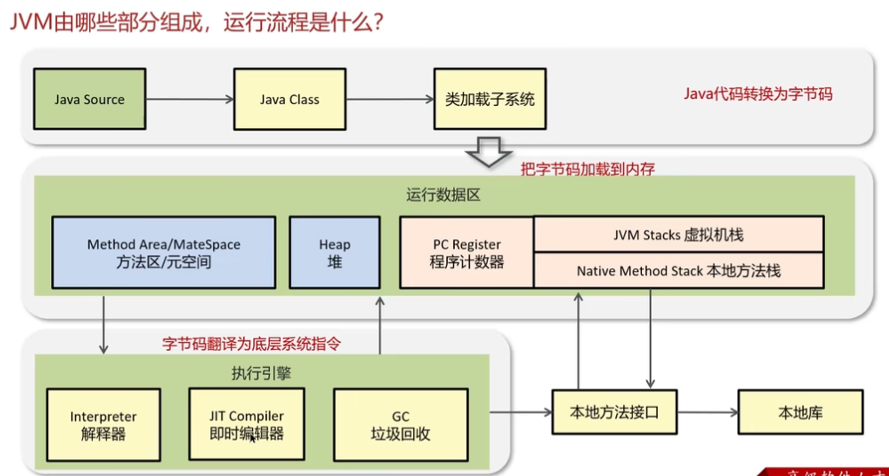

**JVM组成部分：类机载器 + 运行时数据区 + 执行引擎**

- 类加载子系统：用来加载类文件（class文件），将字节码文件加载到内存中，主要会经历加载->连接->实例化这三个阶段。
- 运行数据区：Java 程序运行期间需要使用到的内存区域，简单来说，这块内存区域存放了字节码信息以及程序执行过程的数据。
  - 线程共享空间：
    - 堆：垃圾回收针对的主要区域
    - 方法区：JDK-7 叫方法区，JDK-8之后为元空间，并处于本地内存中
  - 线程私有空间：
    - 程序计数器
    - 虚拟机栈
    - 本地方法栈
- 执行引擎：将字节码指令解释为对应平台上的本地机器指令，即将高级语言翻译为机器语言
  - 解释器：读取字节码，然后执行指令。
  - 即时编译器 JIT：时编译器会选择性的把一些热点代码编译成本地代码，加快执行速度。
  - 垃圾回收器：回收堆内存中的垃圾对象。


### 1.2 什么是程序计数器

**程序计数器（PC Register）**：

- 线程私有，即没有线程安全问题
- 程序计数器内部保存字节码的行号，用于记录正在执行的字节码指令的地址
  - 理解：Java程序运行时要把程序编译成相应的字节码文件，字节码文件中有代码的执行过程
  - 可以使用 `javap -v xx.class` 打印堆栈大小，局部变量的数量和方法的参数
  - IDEA Build → Build Project → 查看 target 包 → jvm包下有Application，输入 javap命令

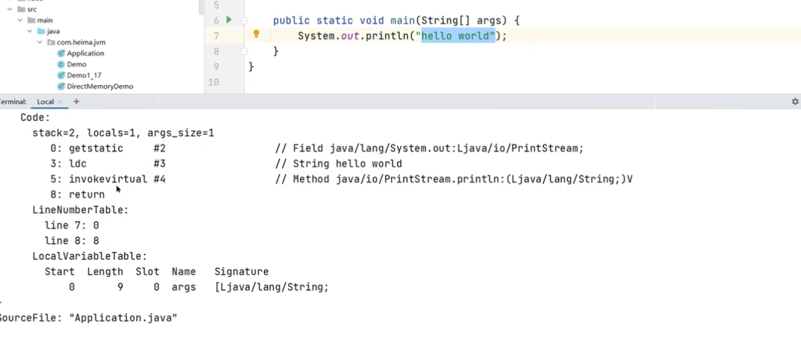

- 可以看到代码的执行行号：0 3 5 8
  - 0 对应获取一个静态变量 `#2` ，即获取静态变量 System.out
  - 3 对应 ldc `#3` ，即加载一个常量，常量对应的 String hello world
  - 5 invokevirtual  `#4` 对应调用一个方法，即调用方法 println
  - 8 return 对应返回
- 可以看出，二进制字节码中有多行代码进行执行，执行顺序就是代码行号
  - 程序计数器的作用就是记录每一个线程的**行号**（0-3-5-8）

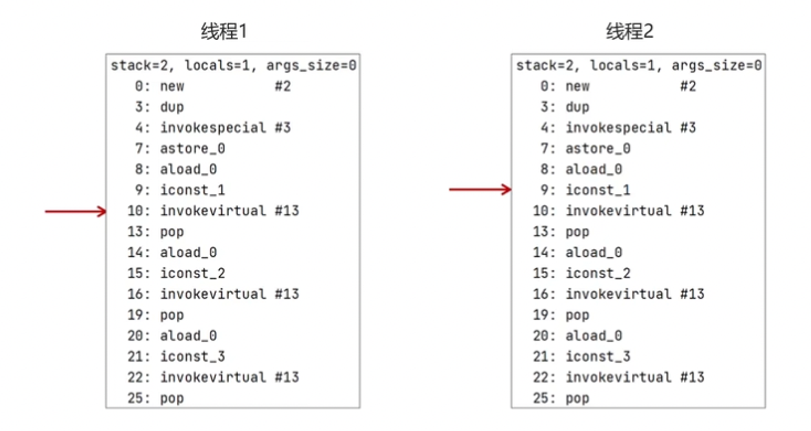

**程序计数器的作用，为什么是私有的？**

Java程序是支持多线程一起运行的，多个线程一起运行的时候cpu会有一个调动器组件给它们分配时间片，比如说会给线程1分给一个时间片，它在时间片内如果它的代码没有执行完，它就会把线程1的状态执行一个暂存，切换到线程2去，执行线程2的代码，等线程2的代码执行到了一定程度，线程2的时间片用完了，再切换回来，再继续执行线程1剩余部分的代码。

1. 我们考虑一下，如果在线程切换的过程中，下一条指令执行到哪里了，是不是还是会用到我们的程序计数器啊。
2. 每个线程都有自己的程序计数器，因为它们各自执行的代码的指令地址是不一样的呀，所以每个线程都应该有自己的程序计数器


### 1.3 什么是Java的堆（详细一点）

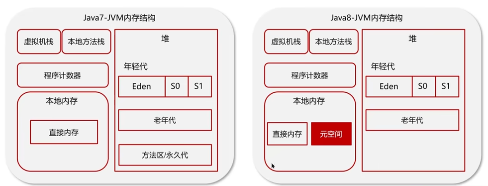

Java堆是一个**线程共享的区域**：

- Java堆主要用来保存**对象实例，数组**等，当**堆中没有内存空间**可以分配给实例的时候，也无法再扩展时，就会跑出**OOM异常**
- 堆中又可以分为：
  - **年轻代**：年轻Eden - S0 - S1，年轻代被划分为三个部分，Eden区和两个大小严格相同的Survivor幸存者区，根据JVM的策略，在经过几次垃圾回收之后，仍然存活于Survivor的对象会被移动到老年代区间。
  - **老年代**：老年代主要保存生命周期长的对象，一般是比较老一些的对象。

**还需要关注的一个地方为元空间：**

- 元空间

  保存的是

  类信息、静态变量、常量以及编译后的代码

  - Java-7中，**堆中存放的是方法区或者叫永久代**；
  - Java-8中，方法区被**移出了堆中**，而在本地内存中存放了一个相同功能的区域叫做元空间。
  - 元空间并不在Java堆中，而是使用本地内存，这解决了永久代容易出现的内存溢出问题。

- 为什么要放到本地内存：

  - 元空间主要存储的是类信息或者常量，随着类加载的情况越来越多，方法区的内存会变的不可控（堆太小-OOM报错；堆太大，浪费资源）
  - 而堆中的其他对象实例可以被自动回收
  - Java8中将元空间放到本地内存，**为了堆可以节省空间，防止OOM**

**大对象存放在哪个内存结构中：**

- 当对象所需要的内存空间大于Eden中可以存放最大的对象内存，就是大对象。
- 大对象直接进入到老年代中
- 元空间并不在Java堆中，而是使用本地内存，这解决了永久代容易出现的内存溢出问题。（如G1垃圾收集器），为大对象分配了专门的区域，称为大对象区或Humongous Objects区域。这类对象直接分配在老年代，以避免因频繁的年轻代晋升而导致的内存碎片化问题。

**对象一定存在堆中吗？**

不一定。随着 JIT 的发展和逃逸技术的逐渐成熟，所有的对象都分配到堆上渐渐变得不那么“绝对”了。

从 JDK 7 开始，Java 虚拟机已经默认开启逃逸分析了，意味着如果某些方法中的对象引用没有被返回或者未被外面使用（也就是未逃逸出去），那么对象可以直接在栈上分配内存。


### 1.4 什么是虚拟机栈

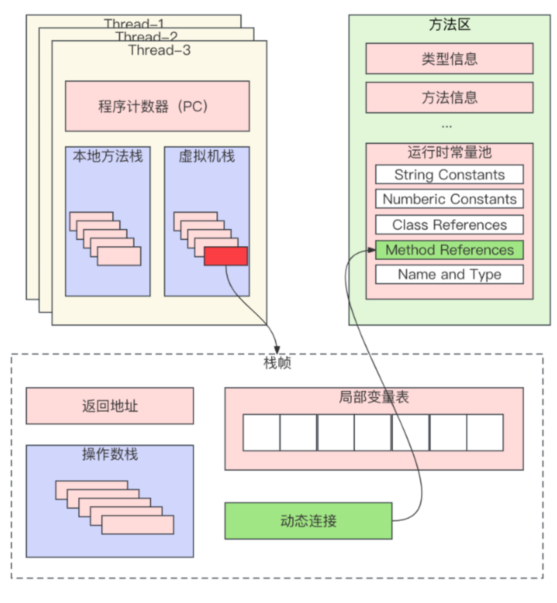

Java Virtual Machine Stacks - Java虚拟机栈

虚拟机栈是线程私有的，每个线程都有自己的 Java 虚拟机栈。方法调用时都会创建一个新的栈帧，该栈帧被推入虚拟机栈，成为当前活动栈帧。所以虚拟机栈的特点如下：

- 保存了**每个线程运行时所需要的内存**，称为虚拟机栈，先进后出
- 如果有多个线程运行，**则为每个线程创建一个虚拟机栈**
- 每个栈由**多个栈帧（frame）** 组成，对应着每次方法调用时所占用的内存
  - 每个栈帧代表了一个**方法运行时所需要的内存**
  - **栈帧1（局部变量、操作数栈、动态链接、方法返回地址）**
  - 每个线程中只有一个**活动栈帧**，对应当前正在执行的方法

**栈帧的详细结构：**

1. 局部变量表：存储方法的参数和局部变量，由基本数据类型或对象引用组成。
2. 操作数栈：后进先出（LIFO）的栈结构，用于存储操作数和中间计算结果。
3. 动态链接：关联到方法所属类的常量池，支持动态方法调用。
4. 方法返回地址：记录方法结束后控制流应返回的位置。

**虚拟机栈相关的面试题**

- 面试题1：垃圾回收GC是否涉及栈内存
  - 垃圾回收主要指的是堆内存，当栈帧弹栈之后，栈内存自动就会进行释放
- 面试题2：栈内存分配越大越好吗
  - 不一定，一个栈默认的栈内存为1024k，假设机器虚拟机栈为512M
    - 栈内存太大，则会导致线程数变少，例如当栈内存从1024k改成2048k时，能活动的总线程数就会从512个降低到256个
  - 没创建一个线程，则至少要使用1024k的内存空间（虚拟机栈的默认大小
- 面试题3：方法内的局部变量是否是线程安全的
  - 局部变量是线程安全的，从参数传递进来的变量（外部变量）不是线程安全的
- 面试题4：堆和栈的区别是什么？
  - 栈内存一般用来保存局部变量和方法调用，但堆内存是用来存储Java对象和数组的；Java对象通过垃圾回收来释放内存，但是栈不会
  - 栈内存线程私有，堆内存是线程共享的
  - 两者异常错误不同，栈内存空间不足是SOF，堆内存空间不足是OO

**栈内存溢出的情况：栈内存溢出情况主要分为两种**

- 栈帧过多导致栈内存溢出，典型问题：递归调用
- 栈帧过大导致栈内存溢出

**堆和栈有什么区别？**

1. **用途**：栈主要用于存储局部变量、方法调用的参数、方法返回地址以及一些临时数据。每当一个方法被调用，一个栈帧（stack frame）就会在栈中创建，用于存储该方法的信息，当方法执行完毕，栈帧也会被移除。堆用于存储对象的实例（包括类的实例和数组）。当你使用new关键字创建一个对象时，对象的实例就会在堆上分配空间。
2. **生命周期**：栈中的数据具有确定的生命周期，当一个方法调用结束时，其对应的栈帧就会被销毁，栈中存储的局部变量也会随之消失。堆中的对象生命周期不确定，对象会在垃圾回收机制（Garbage Collection, GC）检测到对象不再被引用时才被回收。
3. **存取速度**：栈的存取速度通常比堆快，因为栈遵循先进后出（LIFO, Last In FirstOut）的原则，操作简单快速。堆的存取速度相对较慢，因为对象在堆上的分配和回收需要更多的时间，而且垃圾回收机制的运行也会影响性能。
4. **存储空间**：栈的空间相对较小，且固定，由操作系统管理。当栈溢出时，通常是因为递归过深或局部变量过大。堆的空间较大，动态扩展，由JVM管理。堆溢出通常是由于创建了太多的大对象或未能及时回收不再使用的对象。
5. **可见性**：栈中的数据对线程是私有的，每个线程有自己的栈空间。堆中的数据对线程是共享的，所有线程都可以访问堆上的对象。

**栈中存的到底是指针还是对象？**

在JVM内存模型中，栈（Stack）主要用于管理线程的局部变量和方法调用的上下文，而堆（Heap）则是用于存储所有类的实例和数组。

当我们在栈中讨论“存储”时，实际上指的是存储基本类型的数据（如int, double等) 和对象的引用，而不是对象本身。

这里的关键点是，栈中存储的**不是**对象，而是**对象的引用**。也就是说，当你在方法这里的关键点是，栈中存储的**不是**对象，而是**对象的引用**。也就是说，当你在方法是一个存储在栈上的引用，指向堆中实际的对象实例。这个引用是一个固定大小的数据（例如在64位系统上是8字节），它指向堆中分配给对象的内存区域。


### 1.5 什么是方法区（元空间）

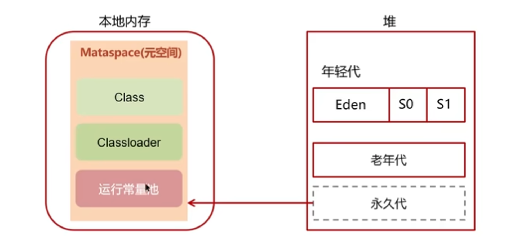

方法区（元空间）主要存在于本地内存中，它和堆一样，属于各个**线程共享的内存区域**

- 方法区中主要存储：
  - **类信息 Class ：类的结构、字段、方法等**
  - **常量信息：运行时常量池**
  - **ClassLoader：用于加载类信息**
- 虚拟机启动的时候创建方法区，虚拟机关闭的时候释放方法区
- 方法区域中的内存无法满足分配请求时，则会抛出异常OOM：Metaspace

**如何理解常量池？**

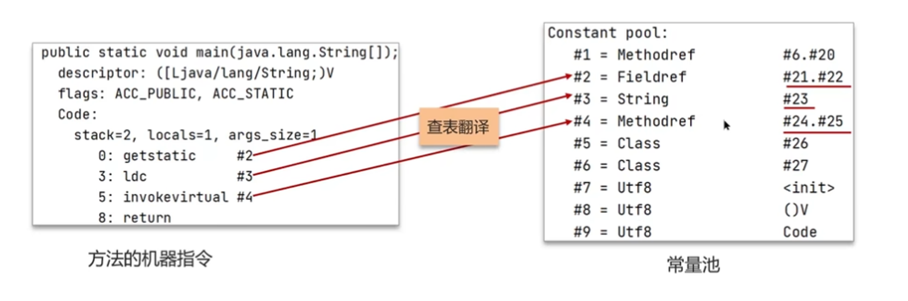

**常量池可以看作是一张表**，虚拟机指令根据这张常量表找到要执行的**类名、方法名、参数类型以及字面量**等信息。可以通过 javap 命令查看字节码结构：

- **字节码文件（class文件）** 结构分为三个主要部分，可以在下面的图中找到
  - **类的基本信息：** 包括类的结构信息、类的访问修饰符、父类与接口等信息。
  - **常量池：** 存储类和接口中的常量，包括字面值常量、符号引用，以及运行时常量池。
  - **方法定义：** 存储类的方法字节码，即编译后的代码。
- **第一部分是类的基本信息**，包含类所在地址、最后修改时间、检验码、编译来源、版本、访问修饰符等

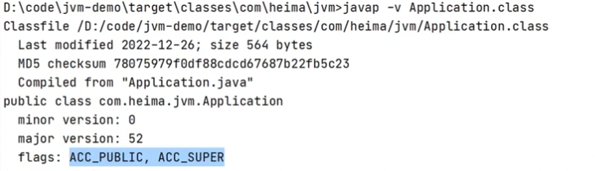

- 第二部分就是类的常量池：其中主要形式为 

  常量符号(#2) - 常量地址(#21, #22)

   的形式，用于告诉字节码文件中的方法

  去哪里寻找目标常量

  - **虚拟机指令通过去查找常量池表来完成方法操作**
  - **虚拟机指令根据这张常量表找到要执行的类名、方法名、参数类型以及字面量等信息**

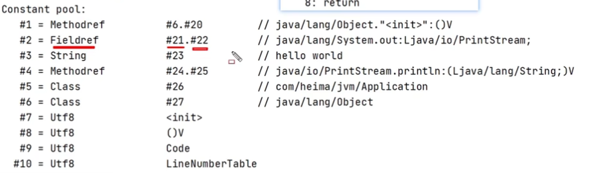

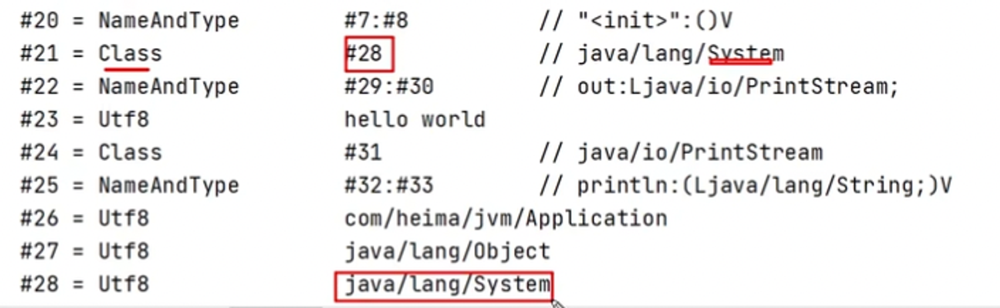

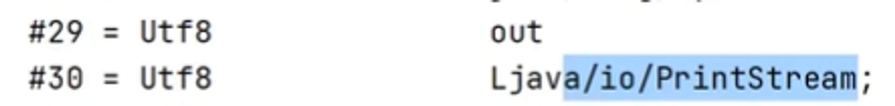

- **第三部分是方法定义：** 其中主要形式为 **方法行号 - 方法命令 - 常量符号** 的形式展示每行执行指令，其中带 # 号的符号就需要去常量池中进行查表翻译

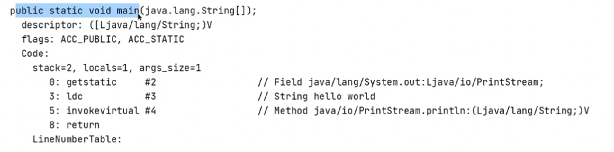

**上面是常量池的定义，什么是运行时常量池呢？**

- 常量池指的是class文件中的
- 当字节码文件被加载之后，它的常量池信息就会放入到运行时常量池，并将里面的**符号地址变为真实地址 （将 #2、#3 等符号地址变为真正的内存地址）**

总结：

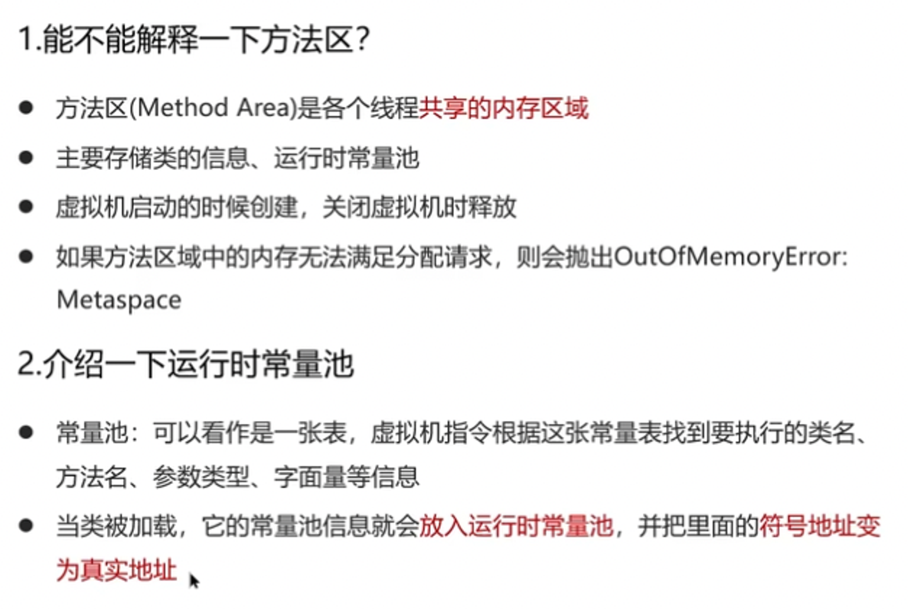

**为什么 JDK8 之后要移除永久代，将元空间放置在本地内存中？**

两者之间存储的内容几乎没怎么变化，而是在**内存限制、垃圾回收**等机制上改变较大：

1. 由于Permanent Generation内存经常不够用或发生内存泄露，引发的内存溢出 OOM 在 Java Web 开发中非常常见，元空间解决元数据过多导致的OOM问题。
2. 如果使用永久代，则在 JVM 启动时需要确定大小。类及方法的信息等比较难确定其大小，因此对于永久代的大小指定比较困难，太小容易出现永久代溢出，太大则容易导致老年代溢出。
3. 永久代会为 GC 带来不必要的复杂度，并且回收效率偏低。本地内存可以自动扩展调节，内存不足也不会触发Full GC。

**方法区中的方法的执行过程？**

当程序中通过对象或类直接调用某个方法时，主要包括以下几个步骤：

1. **解析方法调用**：JVM会根据方法的符号引用找到实际的方法地址（如果之前没有解析过的话）。
2. **栈帧创建**：在调用一个方法前，JVM会在当前线程的Java虚拟机栈中为该方法分配一个新的栈帧，用于存储局部变量表、操作数栈、动态链接、方法出口等信息。
3. **执行方法**：执行方法内的字节码指令，涉及的操作可能包括局部变量的读写、操作数栈的操作、跳转控制、对象创建、方法调用等。
4. **返回处理**：方法执行完毕后，可能会返回一个结果给调用者，并清理当前栈帧，恢复调用者的执行环境。

**方法区中还有哪些东西？**

《深入理解Java虚拟机》书中对方法区（Method Area）存储内容描述如下：它用于存储已被虚拟机加载的**类型信息、常量、静态变量、即时编译器编译后的代码缓存**等。

1. 类信息：包括类的结构信息、类的访问修饰符、父类与接口等信息。
2. 常量池：存储类和接口中的常量，包括字面值常量、符号引用，以及运行时常量池。
   1. 运行时常量池：存储着在类文件中的常量池数据，类加载后在方法区生成该运行时常量池。
3. 静态变量：存储类的静态变量，这些变量在类初始化的时候被赋值。
4. 方法字节码：存储类的方法字节码，即编译后的代码。
5. 符号引用：存储类和方法的符号引用，是一种直接引用不同于直接引用的引用类型。
6. 常量池缓存：用于提升类加载的效率，将常用的常量缓存起来方便使用。


### 1.6  什么是直接内存

直接内存：

- 直接内存并不是JVM中的内存结构，也不由JVM进行管理。
- 直接内存是**虚拟机（也就是操作系统）的系统内存**，通常见于NIO操作时，数据缓冲区拷贝比较慢
- 直接内存的分配回收成本比较高，但是读写性能也比较高

举例：使用Java代码完成文件拷贝：

- 使用BIO进行（直接使用`FileInputStream`），消耗时间为 182 ms
- 使用NIO进行（使用`FileChannel`），消耗时间为  98 ms

**原因如下：BIO的流程如下**

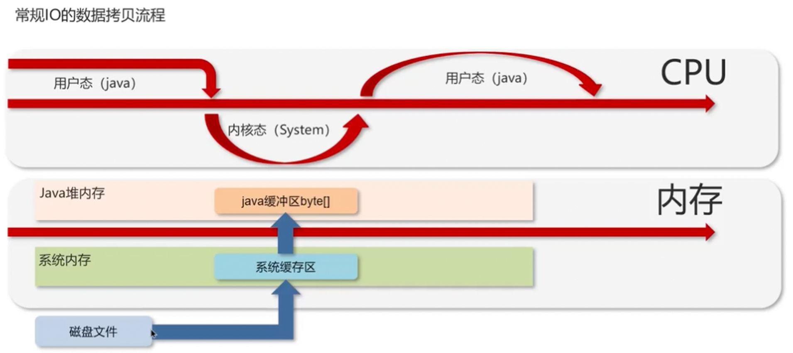

- Java代码不能直接访问系统的缓冲区
- Java代码从用户态 - 内核态 执行工作：将系统缓冲区的内容拷贝到用户缓冲区
- Java代码回到用户态开始进一步的处理
- 这中间由于有数据的复制，则数据的读取效率不是很高

**NIO如何加快速度，NIO的流程如下：**

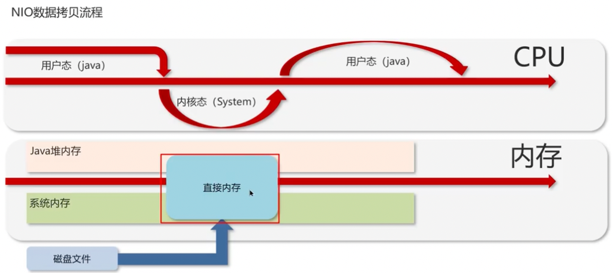

- NIO开辟了一个直接内存，作为一块缓冲区，Java代码可以从直接内存中进行读取


### 1.7 JVM 如何运行 Java 代码

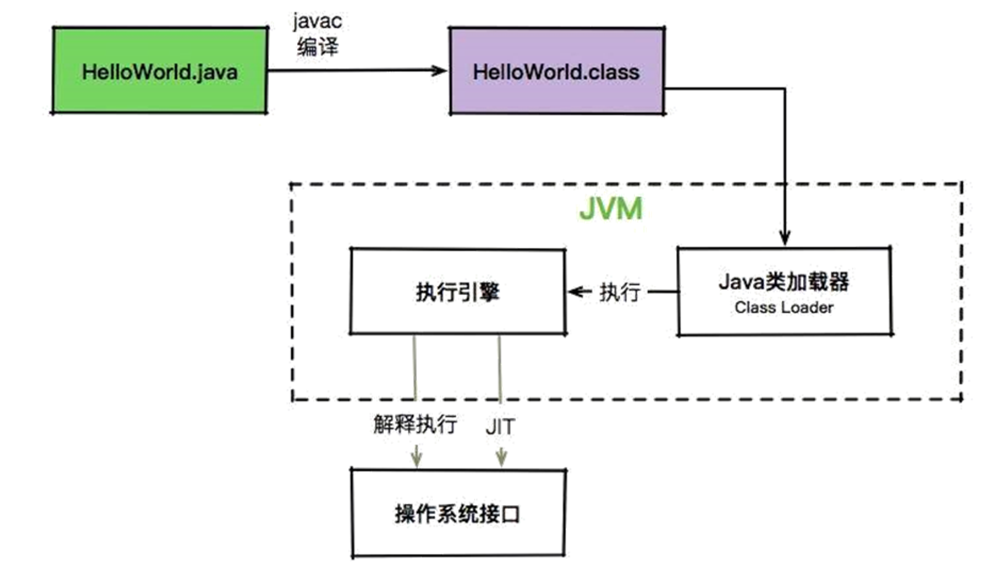

Java 代码的执行过程要分两个阶段来阐述：**编译期 和 运行期。**

- **编译期：** 写好 Java 代码之后，点击 IDEA 工具栏中的锤子按钮（Build Project）可以进行编译，编译之后就可以在 target 目录下找到一个 class 字节码文件。
  - 字节码文件中包含了 JVM 执行的指令，还有类的元数据信息，例如类名、方法和属性等。
  - 字节码是二进制文件，但是其不能被系统直接执行，而是需要 JVM 来执行
- 运行期：启动 JVM 来运行字节码文件。
  - JVM 通过类加载器加载字节码文件，将字节码加载到运行时数据区，通过执行引擎转化为机器码最终交给操作系统执行
  - 常见的执行方式有两种，一种是解释执行，对字节码逐条解释执行；另一种是 JIT，也就是即时编译，它会在运行时将热点代码优化并缓存起来，直接执行。

**补充知识：JDK→JRE→JVM之间的关系**

字节码并不是机器码，操作系统无法直接识别，需要在操作系统上安装不同版本的 JVM 来识别。

通常情况下，我们只需要安装不同版本的 JDK（Java Development Kit，Java 开发工具包）就行了，它里面包含了 JRE（Java Runtime Environment，Java 运行时环境），而 JRE 又包含了 JVM。

Windows、Linux、MacOS 等操作系统都有相应的 JDK，只要安装好了 JDK 就有了 Java 的运行时环境，就可以把 Java 源代码编译为字节码，然后字节码又可以在不同的操作系统上运行了。

**JVM 执行 Java 代码举例说明**

以这段代码为例，一个 Test 类，main 方法里 new 了一个 Uesr 对象，会将 User 的 age 作为参数传递给静态方法 calculate 进行一个简单的加法操作并返回，最后打印到控制台。

```java
public class Test {
    public static void main(String[] args) {
        User user  = new User();
        Integer result = calculate(user.getAge());
        System.out.println(result);
    }

    private static Integer calculate(Integer age) {
        Integer data = age + 3;
        return data;
    }
}
```

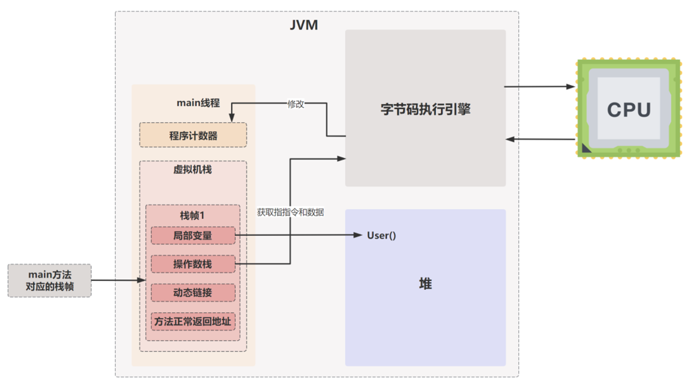

1. JVM 完成 .class 文件加载之后，会创建一个名为"main"的线程，该线程会自动调用名为"main"的静态方法，这是 Java 程序的入口点；

2. main 线程在执行 main 方法时，JVM 会在虚拟机栈中压入 main 方法对应的栈帧；

3. 栈帧的操作数栈中存储了操作的数据，JVM 执行字节码指令的时候会从操作数栈中获取数据，执行计算操作后会将结果再次压入操作数栈中；

4. 当进行 calculate 方法调用的时候，虚拟机栈继续压入 calculate 方法对应的栈帧。

   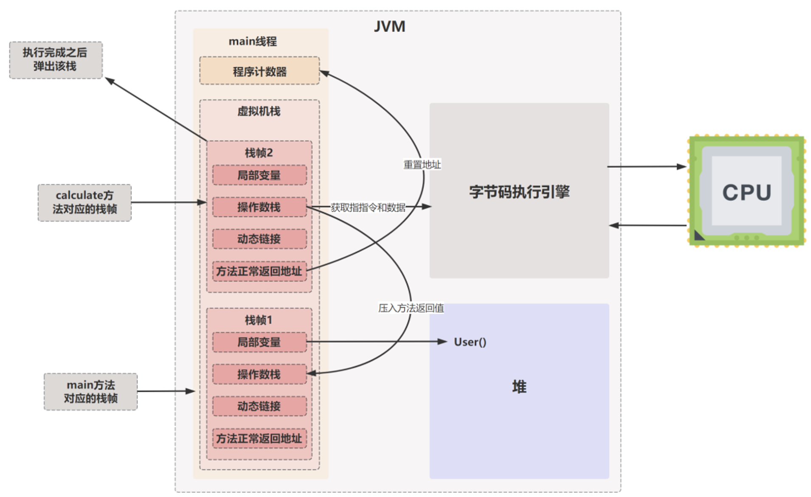

5. 对于 age + 3 这条加法指令，在执行该指令前，JVM 会将操作数栈顶部的两个元素弹出，并将它们相加，然后将结果压入操作数栈中。

6. PC 寄存器中存储了下一条需要执行的字节码指令地址。

7. 当 calculate 方法执行完成后，对应的栈帧将从虚拟机栈中弹出，方法执行的结果会被压入 main 栈帧中的操作数栈中，而方法返回地址被重置到 main 线程的 PC 寄存器中，以便于后续字节码执行引擎从 PC 寄存器中获取下一条命令的地址。

8. 执行引擎中的解释器会从程序计数器中获取下一个字节码指令的地址，也就是元空间中对应的字节码指令，在获取到指令之后，通过解释器解释为对应的机器指令，最终由 CPU 进行执行。


### 1.8 方法区中的 Class 数据与堆中的 Class 对象是什么关系

众所周知， Java 中 new 出的对象存放在堆中，而对象的引用存放在虚拟机栈中。

Java 中的 Class 也是一个类，所以 Class 对象也存放在堆当中，存放在方法区当中的是类的元数据，即类加载器从 Class 文件中提取出来的类型信息、方法信息、字段信息等

关系：Java 对象中保存着指向方法区中类的元数据的引用，元数据中又保存着指向 Class 对象的引用。

**问题 - 1：创建对象时符号引用指向了方法区的Class数据，还是堆内存中Class对象？**

**方法区中的类数据和堆中 Class 对象的区别：**

- 堆中的 Class 对象本质上是对方法区类型数据的一个访问接口。
- 在类加载过程中，首先会把 .class 二进制文件转化为方法区的运行时数据结构，然后会在Java堆内存中实例化一个 java.lang.Class 类的对象，用来访问方法区中的类型数据。
- 因此，堆中的 Class 并不存储静态变量、常量、方法等实际信息。

创建对象时符号表引用指向的类肯定是方法区中的类数据，因为没有必要通过Class对象来间接访问方法区，这样需要两次引用解析，开销更大。

**问题 - 2: 对象头中的类型指针指向了方法区的Class数据，还是堆内存中Class对象？**

首先要搞清楚，对象为什么要引用方法区中的类型数据？

- 进行类型强转（cast）操作或者 instanceof 判断时，虚拟机需要查看目标类型是不是当前对象的类型或者父类之一。
- 当调用实例方法时，需要进行动态绑定，动态绑定的过程需要类的信息。

所以，和问题 - 1一样，我们需要引用的最终目标是方法区中类有关的信息，所以类型指针直接指向方法区中的类型数据。

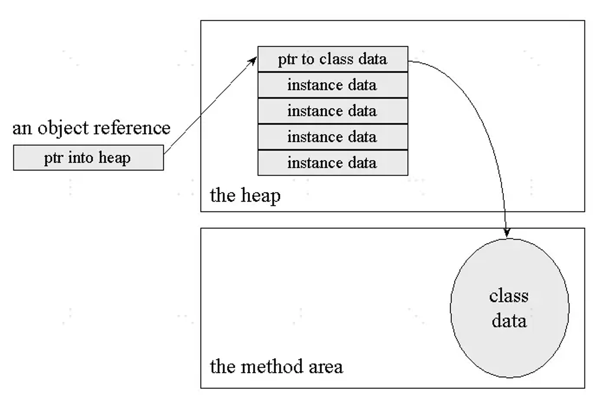

**问题 - 3: 那么堆中的Class对象有什么用？- 为反射提供接口**

Class 对象为程序员提供了查看方法区类型信息的接口（如类名，当前对象的父类，方法，变量等）。对于同一个 ClassLoader, 只存在一个Class对象。Class对象可以提供两种类获取方式：

- 根据实例对象获得：ref.getClass()
- 根据类名获得：ClassName.class , 基本类型只可以通过这种方式获得Class对象。

**问题 - 4: JVM 中的 Java 对象是如何表示的？**

JVM 中，使用了 OOP-KLASS 模型来表示 Java 对象：

- instanceKlass：类加载时会创建一个instanceKlass，用来表示这个类的元数据（包括常量池、字段、方法等），存放在方法区。

- instanceOopDesc：在 new 一个对象时，JVM 创建 instanceOopDesc 来表示这个对象，存放在

  堆区，其引用存放在栈区（即 Java 对象实例）。

  - 对象头：存储对象运行时记录信息，如hashcode、GC分代年龄、时间戳等;
  - 元数据指针：指向方法区的 instanceKlass 实例
  - 实例数据

- **class对象是java访问类的元数据的入口：** HotSpot 并没有把 instanceKlass 直接暴露给Java，而会另外创建对应的 instanceOopDesc 来表示 java.lang.Class 对象，并将后者称为前者的 “Java镜像” ，instanceKlass 持有指向instanceOopDesc 的引用。

因此，可以回答下述问题：

**问：new 操作返回的 instanceOopDesc 类型指针指向 instanceKlass ，既然已经指向了方法区的类数据，那为什么方法区中的 instanceKlass 还要指回 Class 实例？**

答：因为对象指向的是方法区，所以要想得到 Class 实例的引用，就必须通过方法区的数据，instanceKlass 保留对 Class 实例的引用是必要的。

**总结：**

Person类的实例 → Person类的元数据 → Person类的class对象：

1. 每一个类的实例可以有多个，每个实例对象对应的 Oop 中对 klass 的引用都是同一个。
2. 每一个类的元数据 instanceKlass 只有一个
3. 每一个类的 class 对象（Oop）也只有一个
4. 唯一的 Klass 与唯一的 class 对象一一对应，互相保存着对彼此的引用。

这些引用关系支持着获取 class 对象三种方式的实现:

1. Class.forName("ClassName")：通过类的元数据中的 class 对象引用获得 class 对象
2. object.getClass()：通过实例对象中保存的对类的元数据的引用获取类的元数据（instanceKlass），通过instanceKlass中对class对象的引用获取class对象（instanceOopDesc）
3. ClassName.class：通过类的元数据中的 class 对象引用获得 class 对象

[Class对象存储在Java堆中_class对象在堆还是方法区-CSDN博客](https://blog.csdn.net/weixin_44250483/article/details/121338111)


### 1.9 String 在 JVM 中保存在哪里

String 保存在字符串常量池中，不同于其他对象，它的值是不可变的，且可以被多个引用共享。

**String s = new String（“abc”）执行过程中分别对应哪些内存区域？**

在执行 String s = new String("abc"); 这个语句时，实际上会创建两个不同的对象。让我们逐步分析这个过程：

1. 字符串字面量 "abc"：
   - 首先，Java 在常量池中查找 "abc" 这个字面量。如果常量池中已经存在这个字面量（通常在程序编译时就会加入），那么不会创建新的对象。常量池中保存的是 String 对象 "abc"。
2. new String("abc")：
   - 当你使用 new String("abc") 时，Java 会首先使用 new 操作符创建一个新的 String 对象。这个新的对象是堆内存中的一个 String 实例，它是对常量池中 "abc" 对象的拷贝。

所以，总结一下：

- **常量池中的 "abc"** 对象：这是在编译时已经存在于常量池中的对象。
- **通过 new String("abc") 创建的新 String 对象**：这是在堆内存中创建的对象，它具有与常量池中 "abc" 对象相同的内容，但它是一个不同的实例。

因此，执行 String s = new String("abc"); 时，总共会生成两个 String 对象。


### 1.10 **OOM发生在JVM的哪一块内存空间？**

1. **堆内存溢出**：当出现java.lang.OutOfMemoryError:Java heap space异常时，就是堆内存溢出了。原因是代码中可能存在大对象分配，或者发生了内存泄露，导致在多次GC之后，还是无法找到一块足够大的内存容纳当前对象。
2. **栈溢出**：如果我们写一段程序不断的进行递归调用，而且没有退出条件，就会导致不断地进行压栈。类似这种情况，JVM 实际会抛出 StackOverFlowError；当然，如果 JVM 试图去扩展栈空间的的时候失败，则会抛出OutOfMemoryError。
3. **元空间溢出**：元空间的溢出，系统会抛出java.lang.OutOfMemoryError:Metaspace。出现这个异常的问题的原因是系统的代码非常多或引用的第三方包非常多或者通过动态代码生成类加载等方法，导致元空间的内存占用很大
4. **直接内存内存溢出**：在使用ByteBuffer中的allocateDirect()的时候会用到，很多javaNIO(像netty)的框架中被封装为其他的方法，出现该问题时会抛出java.lang.OutOfMemoryError: Direct buffer memor异常。


## 2 类加载器

### 2.1 什么是类加载器，类加载器有哪些

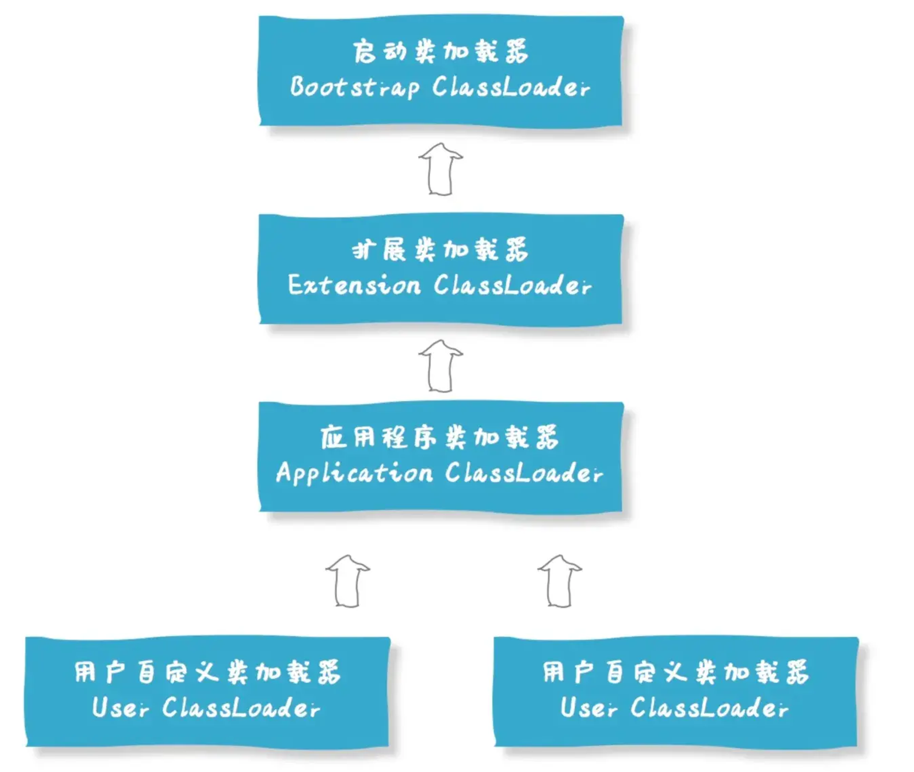

对于任意一个类，都需要由它的类加载器和这个类本身一同确定其在 JVM 中的唯一性。也就是说，如果两个类的加载器不同，即使两个类来源于同一个字节码文件，那这两个类就必定不相等(比如两个类的 Class 对象不equals )。

每个 Java 类都维护着一个指向定义它的类加载器的引用：

- 通过 类名.class.getClassLoader() 可以获取到类加载器的引用
- 然后通过 loader.getParent() 可以获取类加载器的上层类加载器

**类加载器的定义以及分类：**

- 类加载器：JVM只会运行二进制文件，类加载器的作用就是将**字节码文件能够加载到JVM中**，从而让Java文件能够跑起来。
- 类加载器的分类：
  - **启动类加载器**：由C++语言编写，主要用于加载Java的核心库（加载 `JAVA_HOME/jre/lib` 中的所有的库包）
  - **扩展类加载器**：用来加载扩展目录中的jar包（加载 `JAVA_HOME/jre/lib/ext` 中的所有的库包），用户自己的 jar 包放在 ext 包下也会用扩展类加载器去加载
  - **应用类加载器**：这也是Java语言实现的，负责加载用户类路径（ClassPath）上的指定类库，是我们平时编写Java程序时默认使用的类加载器。系统类加载器的父加载器是扩展类加载器。它可以通过ClassLoader.getSystemClassLoader()方法获取到。
  - **自定义类加载器：** Java 允许用户创建自己的类加载器，通过继承 java.lang.ClassLoader 类的方式实现。 开发者可以根据需求定制类的加载方式，比如从网络加载class文件、数据库、甚至是加密的文件中加载类等。自定义类加载器可以用来扩展Java应用程序的灵活性和安全性，是Java动态性的一个重要体现。

**如何自定义类加载器：**

1. 构造器:接受一个字符串参数，这个字符串指定了类文件的存放路径。
2. 覆写 findClass 方法:当父类加载器无法加载类时，findClass 方法会被调用。在这个方法中，首先使用loadClassData 方法读取类文件的字节码，然后调用 defineClass 方法来将这些字节码转换为 Class 对象。
3. loadClassData 方法:读取指定路径下的类文件内容，并将内容作为字节数组返回。


### 2.2 什么是双亲委派机制

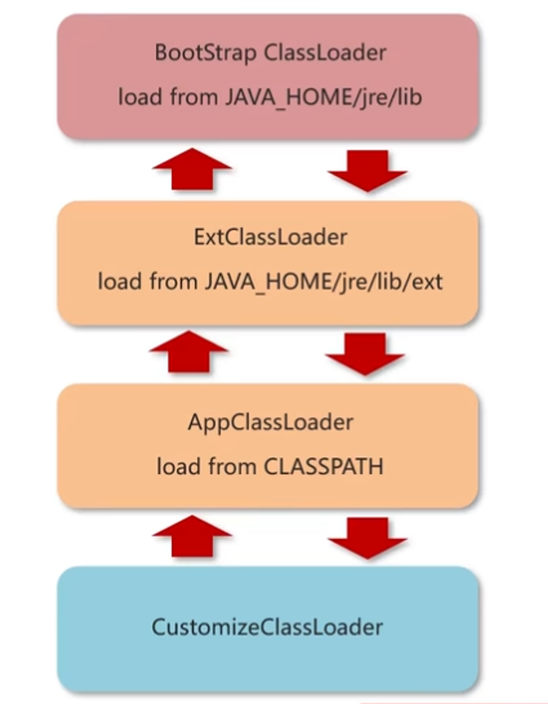

双亲委派模型(Parent Delegation Model)是 Java 类加载器使用的一种机制，用于确保 Java 程序的稳定性和安全性。

**首先解释什么是双亲委派模型：选择哪个类加载器进行加载类**

- 加载某一个类，先委托上一级的加载器进行加载，如果上级加载器也有上级，继续向上委托
- 如果该类委托上级之后没有被加载，则子加载器尝试加载该类
- 自定义 Student 类的加载过程：AppClassLoader → ExtClassLoader → BootStrap ClassLoader → ExtClassLoader → AppClassLoader
- 自定义 String 类的加载过程：AppClassLoader → ExtClassLoader → BootStrap ClassLoader

**JVM为什么要采用双亲委派机制：避免重复加载 + 核心 API 不被替换**

1. **保证类的唯一性**：通过委托机制，确保了所有加载请求都会传递到启动类加载器，避免了不同类加载器重复加载相同类的情况，保证了Java核心类库的统一性，也防止了用户自定义类覆盖核心类库的可能。
2. **保证安全性**：由于Java核心库被启动类加载器加载，而启动类加载器只加载信任的类路径中的类，这样可以防止不可信的类假冒核心类，增强了系统的安全性。例如，恶意代码无法自定义一个java.lang.System类并加载到JVM中，因为这个请求会被委托给启动类加载器，而启动类加载器只会加载标准的Java库中的类。
3. **支持隔离和层次划分**：双亲委派模型支持不同层次的类加载器服务于不同的类加载需求，如应用程序类加载器加载用户代码，扩展类加载器加载扩展框架，启动类加载器加载核心库。这种层次化的划分有助于实现沙箱安全机制，保证了各个层级类加载器的职责清晰，也便于维护和扩展。
4. **简化了加载流程**：通过委派，大部分类能够被正确的类加载器加载，减少了每个加载器需要处理的类的数量，简化了类的加载过程，提高了加载效率。

通用的加载规则：JDK 类中的本地方法类一般由根加载器装载，JDK 内部实现的扩展类一般由扩展加载器实现装载，而程序中的类文件则由应用类加载器进行加载。

**打破双亲委派机制**

打破双亲委派机制：在加载类的时候，不是从 AppClassLoader → ExtClassLoader → BootStrap ClassLoader 这个顺序上寻找加载类，就是打破双亲委派机制。

- 因为加载 class 核心的方法在类加载器的 loadClass 方法上（双亲委派机制的核心实现）
- 所以只要自定义一个 ClassLoader 类加载器，并重写 loadClass 方法（不按照从上开始寻找类加载器），就算是打破双亲委派机制了

**Tomcat 如何打破双亲委派机制**

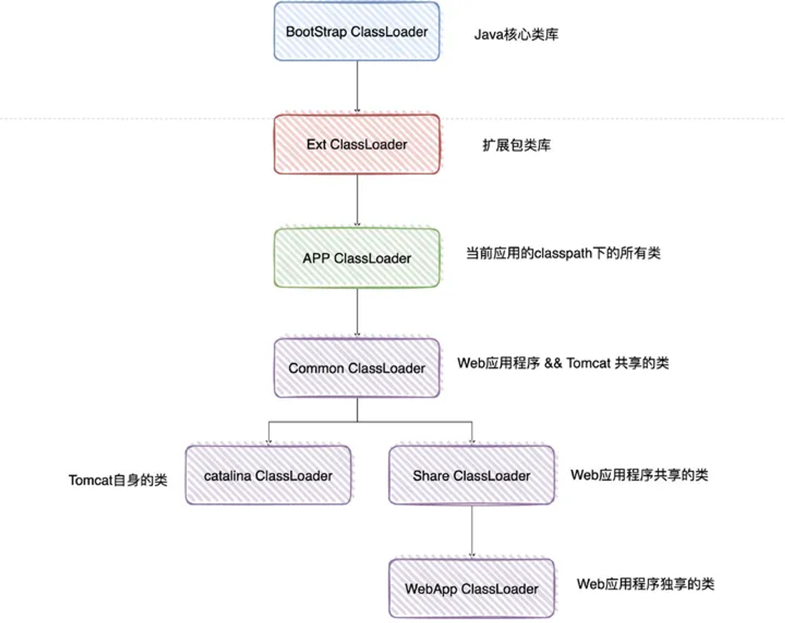

在部署项目时，可以将 war 包放在 tomcat 的 webapp 下，这意味着一个 tomcat 可以运行多个 Web 应用程序。

假设现在有两个 Web 应用程序，它们都有一个类叫 User 类，并且它们的类全限定名都一样，但是它们具体实现是不一样的。Tomcat 给每个 Web 应用创建一个类加载器实例（WebAppClassLoader），该加载器优先加载当前目录下的类，做到了 Web 应用层面的隔离。


### 2.3 说一下类加载过程（重点!!!）

类从加载到虚拟机中，直到卸载为止，它的整个生命周期包括了七个阶段：**加载 - 验证 - 准备 - 解析 - 初始化 - 使用 - 卸载** 这七个阶段。其中，验证、准备和解析这三个部分统称为连接。

JVM 类加载器负责将类的二进制数据加载到内存中，生成一个对应的 java.lang.Class 对象。

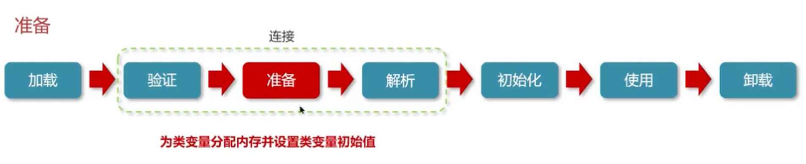

1. **首先是第一步的加载过程，由类加载器对类进行加载：** 它是 Java 将字节码数据从不同的数据源读取到 JVM 中，并映射为 JVM 认可的数据结构（Class 对象），这里的数据源可能是各种各样的形态，如 jar 文件、class 文件，甚至是网络数据源等；如果输入数据不是ClassFile 的结构，则会抛出 ClassFormatError。
   - 通过类的全名，通过字节码获取类的二进制数据流
   - 解析类的二进制数据流 → **方法区**内的数据结构（Java类的构造函数、方法、字段等）
   - 创建**堆的 java.lang.Class 对象**，表示该类型，作为方法区的各种数据的访问入口

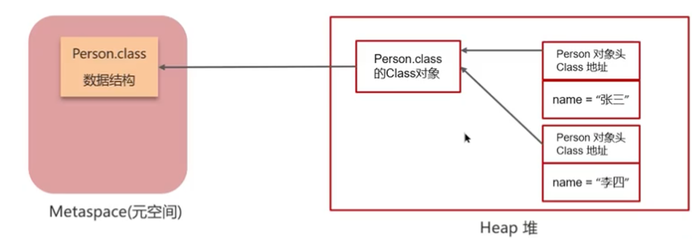

2. **第二步是验证过程：验证类是否符合JVM规范，进行安全性的检查**

- 确保class文件中的字节流包含的信息，符合当前虚拟机的要求，保证这个被加载的class类的正确性，不会危害到虚拟机的安全。验证阶段大致会完成以下四个阶段的检验动作：文件格式校验、元数据验证、字节码验证、符号引用验证
  - 文件格式验证：方法调用的参数个数和类型是否正确
  - 元数据验证：确保遵守访问控制关键字的限定
  - 字节码验证：确保二进制字节流格式符合预期
  - 符号引用验证：Class 文件中会在其常量池通过字符串记录自己将要使用的其他类或者方法，检查它们是否存在

3. 准备阶段：为类中的静态字段分配内存，并设置默认的初始值，比如int类型初始值是0。被final修饰的static字段不会设置，因为final在编译的时候就分配了

- static变量： 分配空间在准备阶段完成（设置默认值），赋值会在初始化阶段完成
- static变量是final的基本类型以及字符串常量，值已经确定：在准备阶段完成
- static变量是final的引用变量，赋值会在初始化阶段完成

4. **解析阶段：** 将类中的符号引用转换为直接引用, 符号引用是以一组符号来描述所引用的目标，符号可以是任何形式的字面量，只要使用的时候可以无歧义地定位到目标即可。

   直接引用可以是直接指向目标的指针、相对偏移量或是一个能间接定位到目标的句柄，直接引用是和虚拟机实现的内存布局相关的。如果有了直接引用， 那引用的目标必定已经存在在内存中了。

   - 符号引用：方法中调用了其他方法，则使用

     方法名

     来表示就代表它是个符号引用

     - 如图中的 # 开头的字符表示的就是符号引用

   - 直接引用：方法中调用了其他方法，直接使用

     指针

     来指向被调用的方法

     - 直接引用通过对符号引用进行解析，找到引用的实际内存地址
     - 在运行时生成，依赖于具体的内存布局，访问对象的效率较高

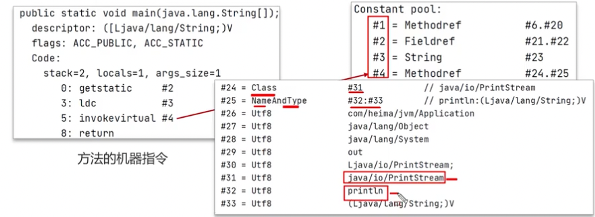

5. 初始化阶段：对类的静态变量以及静态代码块执行初始化操作

   - 如果初始化一个类的时候，其父类尚未初始化，则会优先初始化其父类
     - 首次访问当前类的静态变量，则会引起类的静态变量和静态代码块的初始化
     - 子类初始化时父类还没有初始化，会优先引起父类的初始化
     - 子类访问父类静态变量时，只会触发父类的初始化

   - 如果同时包含多个静态变量和静态代码块，则会自上而下的顺序依次执行

6. **使用阶段：JVM开始从入口方法执行用户的程序代码, 可以使用类或者创建对象**

7. 卸载阶段：用户程序全部执行之后，类就可以销毁创建的class对象了, 如果有下面的情况，类就会被卸载：
   1. 该类所有的实例都已经被回收，也就是java堆中不存在该类的任何实例。
   2. 加载该类的ClassLoader已经被回收。
   3. 类对应的java.lang.Class对象没有任何地方被引用，无法在任何地方通过反射访问该类的方法。


### 2.4 对象的创建过程(重点!!!)

**掌握对象每一步都在执行什么流程：**

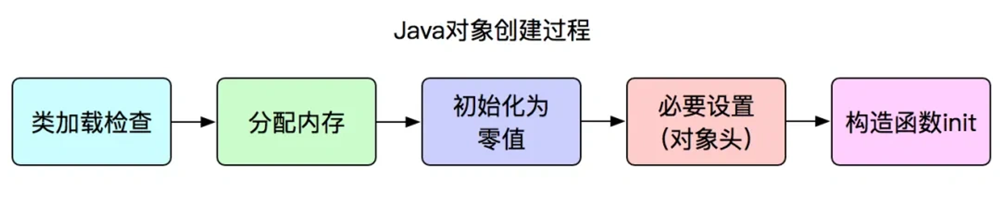

**Step1：类加载检查**

- 虚拟机遇到一条 new 指令时，首先将去检查这个指令的参数是否能在**常量池**中定位到一个类的**符号引用**
- 检查这个符号引用代表的类是否已被是否已被**加载过、解析和初始化**过。如果没有，那必须先执行相应的**类加载过程**。

**Step2：分配内存**

- 在**类加载检查**通过后，接下来虚拟机将为新生对象**分配内存**。
- 对象所需的内存大小在类加载完成后便可确定，为对象分配空间的任务等同于把一块确定大小的内存从 Java 堆中划分出来。
- 分配方式有 “指针碰撞”和 “空闲列表”两种:
  - 选择哪种分配方式由 Java 堆是否规整决定，而 Java 堆是否规整又由所采用的垃圾收集器是否带有压缩整理功能决定。
  - 指针碰撞：CAS+失败重试
    - 适用场合：堆内存规整（即没有内存碎片）的情况下。
    - 用过的内存全部整合到一边，没有用过的内存放在另一边，中间有一个分界指针，只需要向着没用过的内存方向将该指针移动对象内存大小位置即可。
    - 使用该分配方式的 GC 收集器：Serial, ParNew
  - 空闲列表：
    - 适用场合：堆内存不规整的情况下。
    - 原理：虚拟机会维护一个列表，该列表中会记录哪些内存块是可用的，在分配的时候，找一块儿足够大的内存块儿来划分给对象实例，最后更新列表记录。
    - 使用该分配方式的 GC 收集器：CMS

**Step3：初始化零值**

- 内存分配完成后，虚拟机需要将分配到的内存空间都初始化为零值（不包括对象头）
- 这一步操作保证了对象的实例字段在 Java 代码中可以不赋初始值就直接使用，程序能访问到这些字段的数据类型所对应的零值。

**Step4：设置对象头**

- 设置对象头：虚拟机要对对象进行**必要的设置**，例如这个对象是哪个类的实例、如何才能找到类的元数据信息、对象的哈希码、对象的 GC 分代年龄等信息。
- 根据虚拟机当前运行状态的不同，如是否启用偏向锁等，对象头会有不同的设置方式。

**Step5：执行 init 方法(初始化)**

- 在上面工作都完成之后，从虚拟机的视角来看，一个新的对象已经产生了，但从 Java 程序的视角来看，对象创建才刚开始
- 构造函数，即class文件中的方法还没有执行，所有的字段都还为零，**对象需要的其他资源和状态信息**还没有按照预定的意图构造好。所以一般来说，执行 new 指令之后会接着执行方法，把对象按照程序员的意愿进行初始化，这样一个真正可用的对象才算完全被构造出来。


### 2.5 对象的内存布局是什么

在 JVM 中，对象在内存中的布局可以分成 3 个区域：**对象头、实例数据和对象填充**

**对象头：共有两部分信息**

- 第一部分 MarKWord：存储对象自身的运行时数据（哈希码、GC分代年龄、锁状态标志等）
- 第二部分 类型指针：即对象指向它的类元数据的指针，虚拟机通过这个指针来确定这个对象是哪个类的实例。

**实例数据：**

- 实例数据部分是对象真正存储的有效信息，也是在程序中所定义的各种类型的字段内容

**对象填充：**

- 对象的大小必须是 8 字节的整数倍；当对象实例数据部分没有对齐时，就需要通过对齐填充来补全。


### 2.6 对象的访问定位有哪两种方式

建立对象就是为了使用对象，我们的 Java 程序通过栈上的 reference 数据来操作堆上的具体对象。对象的访问方式由虚拟机实现而定，目前主流的访问方式有：**使用句柄**、**直接指针**。

- 使用句柄：
  - Java 堆中将会划分出一块内存来作为句柄池
  - reference 中存储的就是对象的句柄地址，而句柄中包含了对象实例数据与对象类型数据各自的具体地址信息。
  - **优点**：reference 中存储的是稳定的句柄地址，在对象被移动时只会改变句柄中的实例数据指针
  - 缺点：定位复杂，查找时间开销比较大
- 直接指针：
  - 如果使用直接指针访问，reference 中存储的直接就是对象的地址。
  - 优点：一次定位，时间开销比较少
  - 缺点：如果更新了对象地址，栈中指向的地址波动比较大


### 2.7 对象的生命周期

对象的生命周期包括创建、使用和销毁三个阶段：

1. 创建：对象通过关键字new在堆内存中被实例化，构造函数被调用，对象的内存空间被分配。
2. 使用：对象被引用并执行相应的操作，可以通过引用访问对象的属性和方法，在程序运行过程中被不断使用。
3. 销毁：当对象不再被引用时，通过垃圾回收机制自动回收对象所占用的内存空间。垃圾回收器会在适当的时候检测并回收不再被引用的对象，释放对象占用的内存空间，完成对象的销毁过程。


## 3 垃圾回收

### 3.1 对象什么时候可以被GC回收

**为什么要进行垃圾回收？垃圾回收哪里的空间呢？**

- 垃圾回收主要是对堆中产生的垃圾进行回收，保证堆空间的持续可用。

- 如果一个对象或者多个对象

  没有任何的引用指向它

  了，那么这个对象就可以被标记为垃圾，则有可能会被垃圾回收器回收。定位方式有两种：

  - **引用计数法**
  - **可达性分析算法**

**什么是引用计数法？**

当一个对象被引用了一次，可以在当前的对象头上递增一次引用次数，如果这个对象的引用次数为0，则可以表示这个对象可以被回收。

如下图：栈帧中存放了参数、局部变量、返回地址；堆中则存放了对象实例或数组。

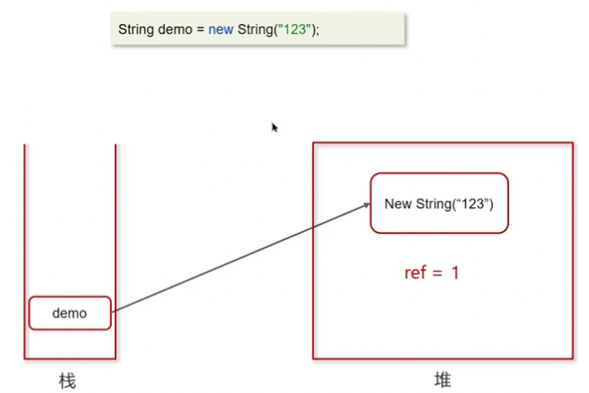

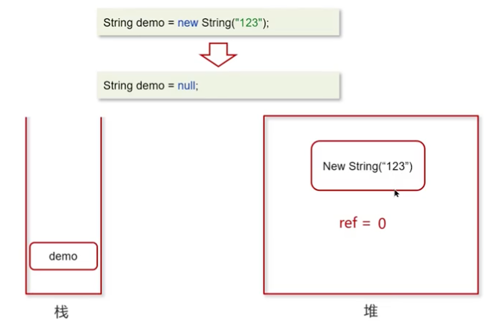

引用计数法也会存在一定的问题：当对象之间出现了循环引用的话，引用计数法就会失效。

- 图中 Demo a 和 Demo b 的引用计数都为2
- 当 Demo a 和 Demo b 都指向 null 的时候，ref 引用计数就变成了 1。
- 但是引用次数相互引用，不会被垃圾回收器回收 - **导致循环引用，进而导致内存泄漏**

**什么是可达性分析算法，现在虚拟机常采用的方法？**

使用可达性分析算法可以确定哪些内容是垃圾：

- 其主要原理是通过 GC Root 出发（沿着引用链进行查找），查找可以被关联到的对象，就是有用的对象
- 无法从 GC Root 出发找到的对象，就是可以被回收的对象

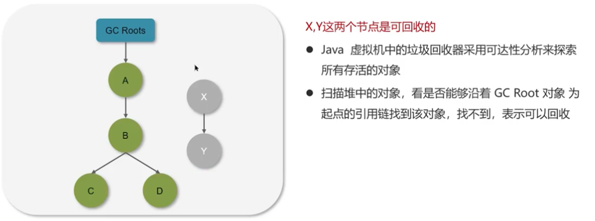

**哪些对象可以作为GC Root呢？共有四种**

1. 虚拟机栈（栈帧中的本地变量）中引用的对象实例
   - 如使用 `Demo demo = new Demo()` 中创建的Demo对象实例可以作为GC Root
2. 方法本地栈中JNI（即Native本地方法）引用的对象
3. 方法区类静态变量引用的对象
   - 方法区中存放的是**类型信息、常量、静态变量、域信息、方法信息等**。
   - `public static Demo a = new Demo` 中创建的Demo对象实例可以作为GC Root
4. 方法区中常量引用的对象、字符串常量池引用的对象
   - `public static final Demo a = new Demo()`


### 3.2 JVM 垃圾回收算法有哪些

JVM有垃圾回收机制的原因是为了解决内存管理的问题。

垃圾回收机制的主要目标是**自动检测和回收**不再使用的对象，从而释放它们所占用的内存空间。这样可以避免内存泄漏（一些对象被分配了内存却无法被释放，导致内存资源的浪费）。同时，垃圾回收机制还可以防止内存溢出（即程序需要的内存超过了可用内存的情况）。

通过垃圾回收机制，JVM可以在程序运行时自动识别和清理不再使用的对象，使得开发人员无需手动管理内存。这样可以提高开发效率、减少错误，并且使程序更加可靠和稳定。

**常用的垃圾回收算法有三种：**

- **标记清除算法 - 只有CMS中使用**
- **复制算法（新生代常用）**
- **标记整理算法（老年代常用）**

**什么是标记清除算法？**

标记清除算法，将垃圾回收分为了两个阶段，第一个阶段是标记，第二个阶段是清除

- 标记阶段：根据可达性分析算法得到的垃圾进行标记
- 清除阶段：对这些标记为可回收的内容进行GC垃圾回收
- 优点：标记和清除的速度比较快
- 缺点：
  - 碎片化较为严重，内存空间不连续导致过多的内存碎片（比如数组需要连续空间）；
  - 当程序运行过程中需要分配较大对象时，因无法找到足够的连续内存而不得不提前触发新一轮的垃圾收集。

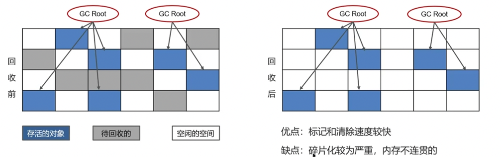

**什么是标记整理算法？**

- 标记阶段：根据可达性分析算法得到的垃圾进行标记
- 清除阶段：对这些标记为可回收的内容进行GC垃圾回收，清除之后将存活的对象向一端移动进行对应的整理；对象在内存中的地址移动，导致：
  - 对象引用要进行相应的更改
  - 移动位置导致效率比较低，性能受到影响
  - 老年代经常使用

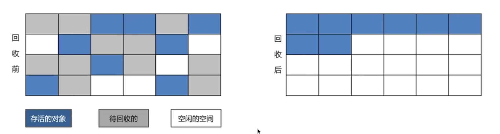

**什么是复制算法？**

- 标记阶段：根据可达性分析算法得到的垃圾进行标记

- 清除阶段：复制算法内存空间划分为两个

  相同大小

  的区域

  - 每次使用只使用一半区域
  - 垃圾回收的时候将存活的对象直接复制到另一个区域内存中，复制过程中顺带整理
  - 新生代经常使用

- 优点：在垃圾比较多的时候，效率比较高；清理后内存无碎片产生

- 缺点：需要两块内存空间，在同一个时刻只能使用一半内存，内存使用率比较低

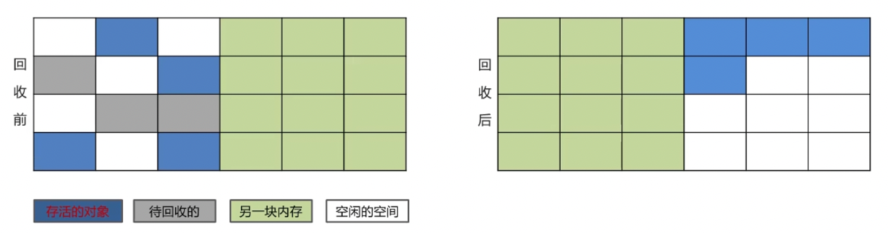

**对比一下复制算法和标记清除算法：**

两个算法都是要解决标记清除的内存碎片问题。

- 标记整理需要，标记完全部存活对象后，才能向一边移动。否则就不知道那些内存区域是空的。
- 复制算法是从gc roots开始，遇到活对象就复制走了。gc roots找可达对象的过程结束就复制完了。

也就是差异不在找到存活的对象，而是找完存活对象标记整理还要在来一个一个从头开始挪动存活对象，当然还要记下每个对象的大小。


### 3.3 说一下JVM中的分代回收

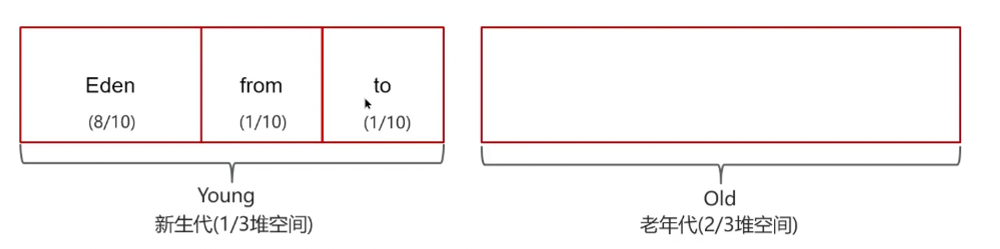

**分代收集算法的区域划分：**

- 在Java8中，堆被分为了两份：

  新生代和老年代[1 : 2]

  - 对于新生代，内部又被分为了三个区域：
    - 伊甸园区 Eden，新生的对象都被分配在这里
    - 幸存者区 survivor（分成了 from 和 to）
    - Eden区，from区以及to区，**占用比例为 [8:1:1]**

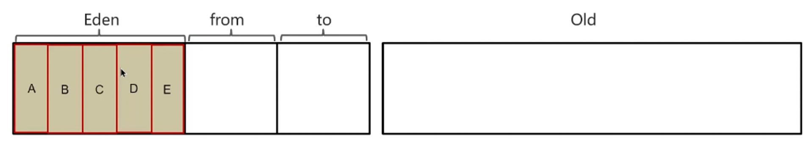

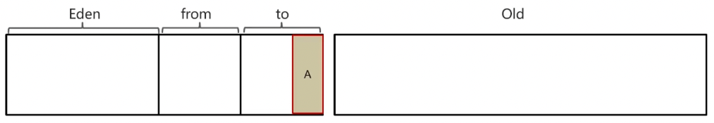

**分代收集算法的工作机制：**

- 新创建的对象，都会分配到 Eden 区
- **当 Eden 区中内存不足时**，会标记 Eden 区以及 From 区的存活对象
- 将存活对象采用**复制算法**复制到 To 区中，复制完毕之后，Eden 区和 From 区的内存被释放
- 经过一段时间内存继续不足，标记Eden 区和 To 区的存活对象，采用**复制算法**复制到 From 区中

**什么时候会被分配到老年代呢？- 进入老年代的时机**

老年代占据着 2/3 的堆内存空间，只有在 Major GC 的时候才会进行清理，每次 GC 都会触发“Stop-The-World”。内存越大，STW 的时间也越长，所以内存也不仅仅是越大就越好。

1. 当幸存者区的对象熬过几次回收（最多15次），会晋升到老年代
2. 当幸存者内存区内存不足，会导致提前晋升（内存担保机制）
3. 大对象指需要大量连续内存空间的对象，这部分对象不管是不是“朝生夕死”，都会直接进到老年代。
4. 动态年龄判定规则：JVM 并不强制要求对象年龄必须到 15 岁才会放入老年区，如果 Survivor 空间中某个年龄段的对象总大小超过了 Survivor 空间的一半，那么该年龄段及以上年龄段的所有对象都会在下一次垃圾回收时被晋升到老年代，无需等你“成年”。

**说一下 MinorGC、MixedGC 以及 FullGC 的区别分别是什么？**

- Minor GC：即 Young GC，发生在新生代的垃圾回收，暂停时间比较短（STW）
  - STW：Stop-The-World，暂停所有应用程序线程，等待垃圾回收的完成
- Mixed GC：新生代 + 老年代的部分区域的垃圾回收，是 **G1 收集器**特有的策略
- Full GC：新生代 + 老年代完整的垃圾回收策略，暂停时间长（STW），应该尽量避免

**为什么需要 Survivor 区 - 减少被送到老年代的对象**

不就是新生代到老年代吗，直接 Eden 到 Old 不好了吗，为啥要这么复杂。

- 如果没有 Survivor 区，Eden 区每进行一次 Minor GC，存活的对象就会被送到老年代，老年代很快就会被填满。
- 有很多对象虽然一次 Minor GC 没有消灭，但其实也并不会蹦跶多久，或许第二次，第三次就需要被清除。

这时候移入老年区，很明显不是一个明智的决定。

所以，Survivor 的存在意义就是减少被送到老年代的对象，进而减少 Major GC 的发生。Survivor 的预筛选保证，只有经历 16 次 Minor GC 还能在新生代中存活的对象，才会被送到老年代。

**Survivor 区为什么划分为两块 - 解决内存碎片化**

设置两个 Survivor 区最大的好处就是解决内存碎片化，**我们先假设一下，Survivor 只有一个区域会怎样。**

- Minor GC 执行后，Eden 区被清空，存活的对象放到了 Survivor 区，而之前 Survivor 区中的对象，可能也有一些是需要被清除的。
- 在这种场景下，我们只能标记清除，标记清除最大的问题就是内存碎片，在新生代这种经常会消亡的区域，采用标记清除必然会让内存产生严重的碎片化。

但因为 Survivor 有 2 个区域，所以每次 Minor GC，会将之前 Eden 区和 From 区中的存活对象复制到 To 区域。第二次 Minor GC 时，From 与 To 职责兑换，这时候会将 Eden 区和 To 区中的存活对象再复制到 From 区域，以此反复。

这种机制最大的好处就是，整个过程中，永远有一个 Survivor space 是空的，另一个非空的 Survivor space 是无碎片的。

那么，Survivor 为什么不分更多块呢？比方说分成三个、四个、五个？

显然，如果 Survivor 区再细分下去，每一块的空间就会比较小，容易导致 Survivor 区满，两块 Survivor 区可能是经过权衡之后的最佳方案。

**什么是 STW**

STW 是 Java 垃圾收集中的一个重要概念。在垃圾收集过程中，JVM 会暂停所有的用户线程，这种暂停被称为"Stop The World"事件。

这么做的主要原因是为了防止在垃圾收集过程中，用户线程修改了堆中的对象，导致垃圾收集器无法准确地收集垃圾。

- STW 事件会对 Java 应用的性能产生影响。如果停顿时间过长，就会导致应用的响应时间变长，对于对实时性要求较高的应用，如交易系统、游戏服务器等，这种情况是不能接受的。
- 因此，在选择和调优垃圾收集器时，需要考虑其停顿时间。Java 中的一些垃圾收集器，如 G1 和 ZGC，都会尽可能地减少了"Stop The World"的时间，通过并发的垃圾收集，提高应用的响应性能。

总的来说，"Stop The World"是 Java 垃圾收集中必须面对的一个挑战，其目标是在保证内存的有效利用和应用的响应性能之间找到一个平衡。


### 3.4 说一下 JVM 中有哪些垃圾回收器

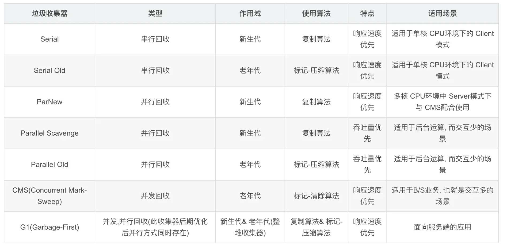

**JDK8 默认的JVM垃圾回收器：Parallel New（新生代）+Parallel Old（老年代)**

JVM中，实现了多种垃圾收集器，包括：

- 串行垃圾收集器
- 并行垃圾收集器
- CMS（并发）垃圾收集器
- G1 垃圾收集器

**介绍一下串行垃圾收集器 - Serial** 和 **Serial Old**

**Serial** 和 **Serial Old** 串行垃圾收集器，使用单线程进行垃圾回收，堆内存比较少，是和个人电脑

- **Serial** 作用于新生代，采用复制算法
- **Serial Old** 作用于老年代，采用标记-整理算法

垃圾回收时，只有一个线程在工作，Java应用中其他线程都要暂停（STW），等待垃圾回收完成

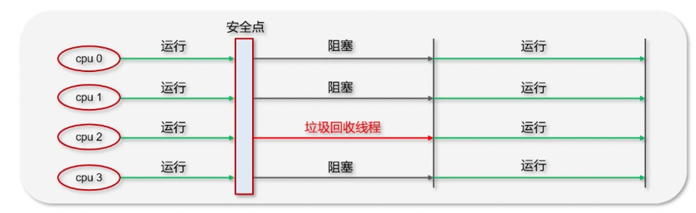

**介绍一下并行垃圾收集器 - Parallel New** 和 **Parallel Old**

**Parallel New** 和 **Parallel Old** 是并行垃圾回收器，JDK8中默认使用该回收器

- **Parallel New**  作用于新生代，采用复制算法
- **Parallel Old** 作用于老年代，采用标记-整理算法

垃圾回收时，多个线程在工作，Java应用中其他线程都要暂停（STW），等待垃圾回收完成

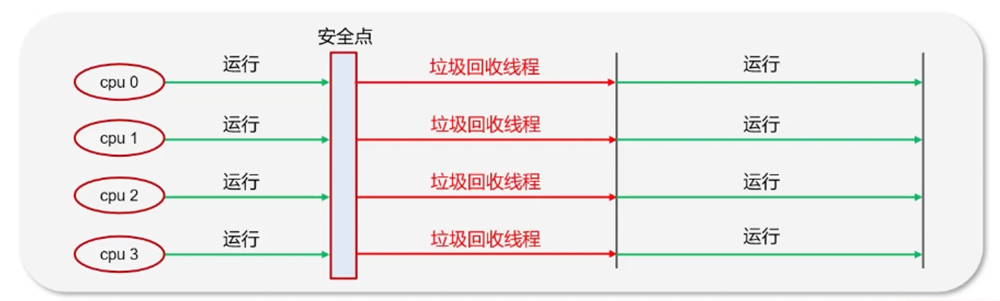

**介绍一下CMS（并发）垃圾收集器 - CMS 针对老年代**

CMS（Concurrent Mark Sweep）垃圾收集器是第一个关注 GC 停顿时间（STW 的时间）的垃圾收集器。之前的垃圾收集器，要么是串行的垃圾回收方式，要么只关注系统吞吐量。CMS 的特点：

- 是一款**并发**的、使用**标记-清除**算法的垃圾回收器
- 针对**老年代垃圾**进行回收
- 目标是获取最短回收停顿时间，最大特定是在垃圾回收的时候，**应用可以正常运行**

CMS 垃圾收集器之所以能够实现对 GC 停顿时间的控制，**其本质来源于对「可达性分析算法」的改进，即三色标记算法**。

在 CMS 出现之前，无论是 Serious 垃圾收集器，还是 ParNew 垃圾收集器，以及 Parallel Scavenge 垃圾收集器，它们在进行垃圾回收的时候都需要 Stop the World，无法实现垃圾回收线程与用户线程的并发执行。

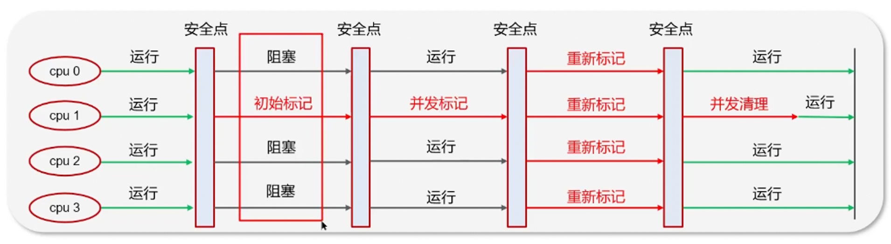

CMS 垃圾收集器通过三色标记算法，实现了垃圾回收线程与用户线程的并发执行，从而极大地降低了系统响应时间，提高了强交互应用程序的体验。它的运行过程分为 4 个步骤，包括：

- **初始标记：** 标记与GCRoot直接相连的对象（例如对象A），**该阶段需要「Stop the World」**，仅仅标记 GC Roots 能直接关联到的对象，因此速度很快。
- **并发标记：** 指的是对「初始标记阶段」标记的对象进行整个引用链的扫描，该阶段不需要「Stop the World」。对整个引用链做扫描需要花费非常多的时间，因此通过垃圾回收线程与用户线程并发执行，可以降低垃圾回收的时间。
  - 这也是 CMS 能极大降低 GC 停顿时间的核心原因，但这也带来了一些问题，即：并发标记的时候，引用可能发生变化，因此可能发生漏标和多标了。
- **重新标记：** 解决并发标记过程中发生的漏标和多标的问题，该阶段需要「Stop the World」
  - CMS 采用增量更新的方式解决漏标，即当黑色对象新增对于白色对象的引用时，将黑色变为灰色等待之后重新扫描。
- **并发清理：** 将标记为垃圾的对象进行清除，该阶段不需要「Stop the World」。 在这个阶段，垃圾回收线程与用户线程可以并发执行，因此并不影响用户的响应时间。

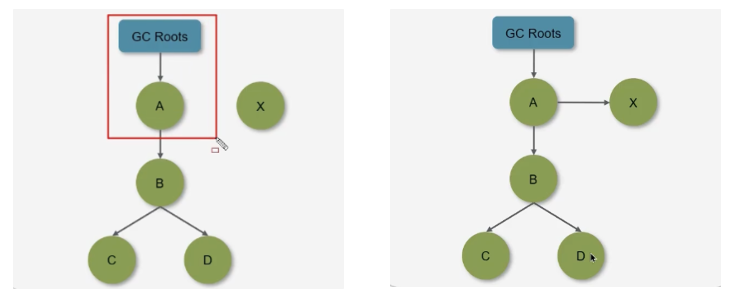

CMS 的优点是：并发收集、低停顿。但缺点也很明显：

1. 对 CPU 资源非常敏感，因此在 CPU 资源紧张的情况下，CMS 的性能会大打折扣。
   1. 默认情况下，CMS 启用的垃圾回收线程数是`（CPU数量 + 3)/4`，当 CPU 数量很大时，启用的垃圾回收线程数占比就越小。但如果 CPU 数量很小，例如只有 2 个 CPU，垃圾回收线程占用就达到了 50%，这极大地降低系统的吞吐量，无法接受。
2. CMS 采用的是「标记-清除」算法，会产生大量的内存碎片，导致空间不连续，当出现大对象无法找到连续的内存空间时，就会触发一次 Full GC，这会导致系统的停顿时间变长。
3. CMS 无法处理浮动垃圾，当 CMS 在进行垃圾回收的时候，应用程序还在不断地产生垃圾，这些垃圾会在 CMS 垃圾回收结束之后产生，这些垃圾就是浮动垃圾，CMS 无法处理这些浮动垃圾，只能在下一次 GC 时清理掉。

**讲一讲三色标记法中的漏标和多标**

**三色标记算法：** GCRoot如果想查找到存活对象，会根据可达分析算法分析，遍历整个引用链 ,按照是否访问过该对象分成三种不同的颜色盒子：白色、灰色、黑色盒子。

1. **白色：** 本对象没有被访问过 ，有可能是为垃圾对象。
2. **灰色：** 本对象已经被访问过，本对象中的属性没有被GCRoot扫描，该对象就是为灰色对象；如果该对象的属性被扫描的情况下，从灰色变为黑色。
3. **黑色：** 本对象已经被访问过（被 GCRoot 扫描过），且本对象中的属性已经被 GCRoot 扫描过，该对象就是为黑色对象。

**三色标记的过程如下：**

1. 在初始阶段的时候，所有的对象都是存放在白色容器中；
2. 初始标记阶段，GCRoot标记直接关联对象置为灰色；
3. 并发标记阶段，扫描整个引用链，有子节点的话，则当前节点变为黑色，子节点变为灰色；
4. 在白色盒子剩下的对象都是为没有被GCRoot关联的对象，可能会被垃圾回收机制清理；

**三色标记的缺陷：**

- 在并发标记阶段的时候，因为用户线程与GC线程同时运行，会产生两个问题：
  - 多标--多标记（浮动垃圾）
  - 漏标--漏标记（比较严重，可能引起程序崩溃）

**浮动垃圾的产生：**

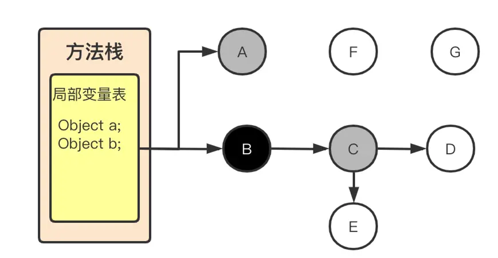

1. 并发标记：用户与GC线程同时运行，假设现在扫描到 C 对象， B 对象变为黑色，用户线程执行C 的属性 E = null , GC 线程扫描 C 对象引用链，认为 E 对象是为可达对象，但是 C 对象根本没有引用到 E 对象， E 对象应该是为垃圾对象。
2. 并发清除阶段：用户与 GC 线程同时运行，会产生新的对象但是没有及时被 GC 清理。 只能在下一次 GC 清理垃圾的修复。

**漏标问题的解决方案：CMS 和 G1 解决方案不同**

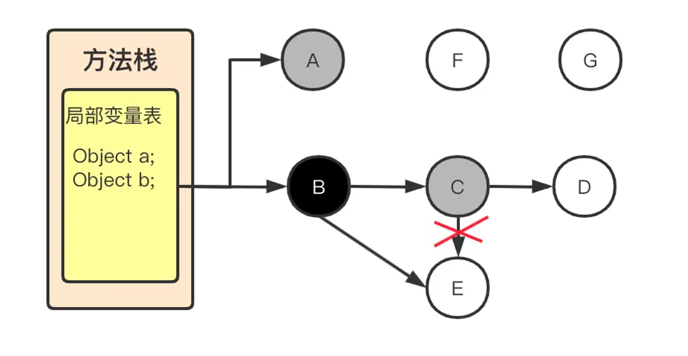

问题发生的原因：

1. 用户线程先执行 C 的 E 属性 = null；GC线程的 GcRoot 就扫描不到 E 。Gc就认为 E 对象就是为垃圾对象，不可达对象。
2. 用户线有执行 B.E 属性 = E；E 对象就是应该是为可达对象。
3. 因为 GCRoot 是从 C 开始，不会从黑色的 B 开始，就会导致漏标的情况发生。

漏标至少满足以下两个条件：

1. 至少有一个黑色对象指向了白色对象；
2. 所有灰色对象取消堆白色对象的引用。

**CMS 如何解决漏标问题 - 增量更新方式：**

当黑色对象新增对于白色对象的引用时，将黑色对象进行记录（记录下黑色对象）；在重新标记阶段，将所有记录的黑色对象变为灰色，并将整个引用链全部扫描。

缺点：遍历整个链的效率非常低，有可能会导致用户线程等待的时间非常长。

**G1 如何解决漏标问题 - 原始快照方式：**

当灰色对象断开对于白色对象的引用时，会记录原始快照（记录下白色对象）；重新标记的阶段将白色对象变为灰色，并扫描整个引用链，本次 GC 不会清理。

优点：从白色对象开始出发进行扫描，扫描效率比较高。

缺点：如果并没有黑色对象引用该白色对象，该白色对象会在本次 GC 的时候继续存活，并只能在下一次 GC 时清理（产生了浮动垃圾）。

[CMS和G1的漏标问题解决及三色标记算法图解](https://www.jianshu.com/p/bbc10c98d0d6)


### 3.5 详细讲一下 G1 垃圾回收器（JDK 9 之后默认）

G1（Garbage-First Garbage Collector）在 JDK 1.7 时引入，在 JDK 9 时取代 CMS 成为了默认的垃圾收集器。G1 有五个属性：分代、增量、并行、标记复制 + 标记整理、STW。

**特征1 - 分代：**

- 应用于新生代和老年代，在JDK9之后**默认**使用垃圾回收器G1
- 将堆空间划分为大小相等的**多个区域 Region**：
- 每个区域都可以用充当 eden、survivor 以及 old 区域
- 还有个**区域 humongous**，专门为大对象准备：在 G1 中，大对象的判定规则就是一个大对象超过了一个 Region 大小的 50%，比如每个 Region 是 2M，只要一个对象超过了 1M，就会被放入 Humongous 中，而且一个大对象如果太大，可能会横跨多个 Region 来存放。

**特征2 - 增量：**

G1 可以以增量方式执行垃圾回收，这意味着它不需要一次性回收整个堆空间，而是可以逐步、增量地清理。有助于控制停顿时间，尤其是在处理大型堆时。

**特征3 - 并行：**

G1 垃圾回收器可以并行回收垃圾，这意味着它可以利用多个 CPU 来加速垃圾回收的速度，这一特性在年轻代的垃圾回收（Minor GC）中特别明显，因为年轻代的回收通常涉及较多的对象和较高的回收速率。

**特征4 - 标记复制 + 标记整理：**

1. 在进行老年代的垃圾回收时，G1 使用标记-整理算法。这个过程分为两个阶段：标记存活的对象和整理（压缩）堆空间。通过整理，G1 能够避免内存碎片化，提高内存利用率。
2. 年轻代的垃圾回收（Minor GC）使用复制算法，因为年轻代的对象通常是朝生夕死的。
3. 将垃圾回收分为了三个阶段：
   1. 新生代回收 Young Collection（Young GC）
   2. 并发标记 Concurrent Mark + 重新标记
   3. 混合回收 Mixed Collection（Mixed GC）
   4. 如果并发失败（回收速度赶不上新对象创建速度），会触发 Full GC

**特征5 - STW：初始标记、重新标记、筛选回收都会触发STW**

G1 也是基于「标记-复制」和 「标记-整理」算法，因此在进行垃圾回收的时候，仍然需要「Stop the World」。不过，G1 在停顿时间上添加了预测机制，用户可以指定期望停顿时间。

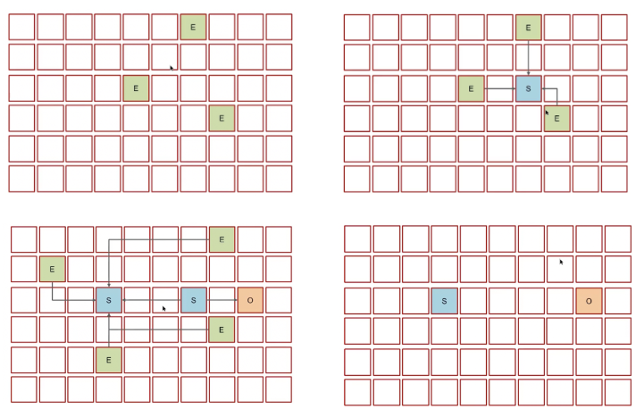

**第一步：介绍一下 Young Collection （Young GC）新生代垃圾回收（如上图）**

- 初始时，所有区域都处于空闲状态
- 创建一些对象，挑出一些空闲区域作为 **Eden 区**存储这些对象
- 当 Eden 区需要垃圾回收时，挑出一个空闲区域作为 Survival 区，用复制算法复制存活对象
  - 该过程需要暂停用户线程（**STW**）
  - Eden区的占比通常在5% - 6% 之间进行调整
- 随着时间流逝，Eden区的内存又有不足：
  - 将 Eden 区以及之前的 Survival 区存活对象，采用复制算法，复制到新的 Survival 区
  - 较老对象**晋升**至老年代中

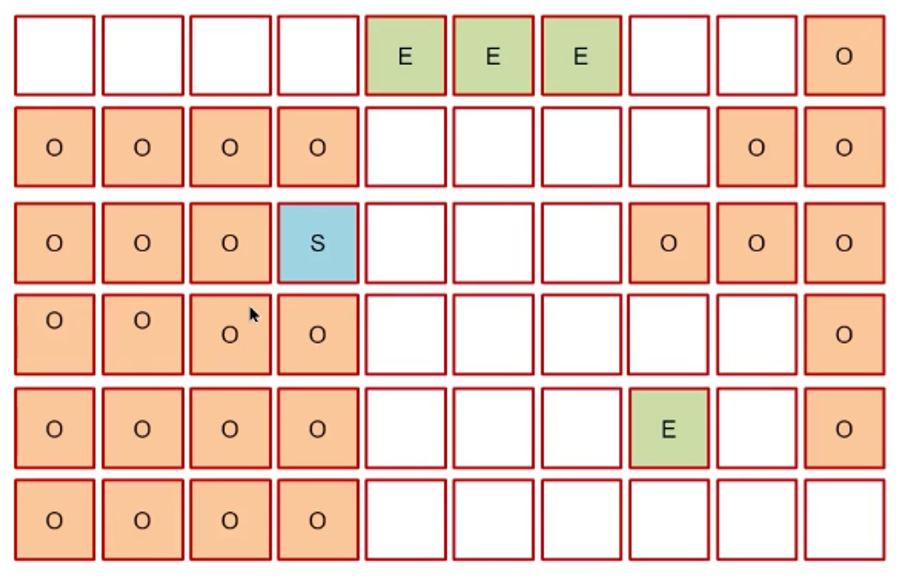

**第二步：介绍一下 并发标记 + 重新标记 Concurrent Mark 阶段（如上图）**

- 当老年代占用内存超过阈值（默认是45%）后，就会触发

  并发标记：

  - 这时无需暂停用户线程
  - 给老年代中**存活的对象**加上相应的标记

- 并发标记之后，会有

  重新标记

  解决漏标问题：

  - 此时需要暂停用户线程

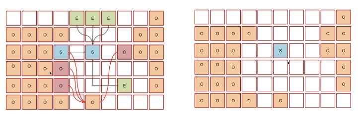

**第三步：介绍一下 混合回收 Mixed Collection（Mixed GC）（如上图）**

完成 **并发标记 + 重新标记** 可以知道老年代有哪些存活对象，随后进入混合收集阶段：

- 不会回收所有老年代
- 根据**暂停时间目标**优先回收回收价值高（存活对象少的）区域，即Garbage First
- 联合 Eden + Survival + 挑选出的Old进行一次混合回收，释放相应的内存
  - Eden + Survival → 新的 Survival 区
  - Survival + Old → 新的 Old 区
- 混合回收可能执行多次，即利用多个短暂停让内存降低到阈值之下

之后，进入下一轮的 新生代回收 - 并发标记 - 混合回收 过程。

**当垃圾回收速度小于对象生成速度会导致什么？**

导致 **Full GC** - 新生代 + 老年代完整的垃圾回收策略，暂停时间长（STW）

**当遇到大对象时，G1怎么处理？**

- G1将其装在一个humongous区域中，专门为大对象准备。
- 一个对象不够，就多分配几个humongous区域
- 在新生代和老年代回收的时候，就会顺带着对大对象一并回收了，所以这就是G1内存模型下对大对象的分配和回收的策略。

[24-一步一图带你理清G1垃圾回收流程](https://zhuanlan.zhihu.com/p/405142523)

**为什么JDK1.9之后使用G1不使用Parallel算法：**

JDK9之后默认的垃圾回收器是G1（Garbage First）垃圾回收器。

- Parallel Scavenge关注吞吐量，允许用户设置最大暂停时间 ，但是会减少年轻代可用空间的大小。
- CMS关注暂停时间，但是吞吐量方面会下降。
- 而G1设计目标就是将上述两种垃圾回收器的优点融合：
  - 支持巨大的堆空间回收，并有较高的吞吐量。
  - 支持多CPU并行垃圾回收。
  - 允许用户设置最大暂停时间。

**G1回收器的特色是什么？**

**G1 的特点：**

- G1最大的特点是引入分区的思路，弱化了分代的概念。
- 合理利用垃圾收集各个周期的资源，解决了其他收集器、甚至 CMS 的众多缺陷

**G1 相比较 CMS 的改进：**

- **算法**： G1 基于标记--整理算法, 不会产生空间碎片，在分配大对象时，不会因无法得到连续的空间，而提前触发一次 FULL GC 。
- **停顿时间可控**： G1可以通过设置预期停顿时间（Pause Time）来控制垃圾收集时间避免应用雪崩现象。
- **并行与并发**：G1 能更充分的利用 CPU 多核环境下的硬件优势，来缩短 stop the world 的停顿时间。


### 3.6 强引用、软引用、弱引用以及虚引用别

在进行垃圾回收的时候，不同的引用进行垃圾回收的策略是不一样的。

- 强引用：只有所有 GC Root 对象都不通过强引用引用该对象，该对象才能被垃圾回收
  - 即使抛出OOM异常都不会回收强引用
  - 平时我们创建对象就是强引用

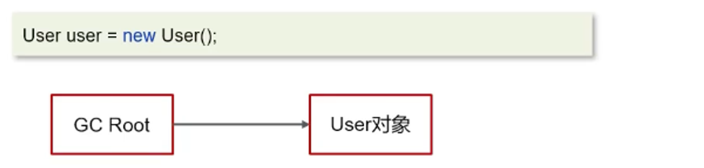

- **软引用**：仅有软引用引用该对象时，在垃圾回收之后，如果内存仍然不足会再次发生垃圾回收

  - 配合 SoftReference 使用
  - 迫不得已，内存空间不足会回收软引用

  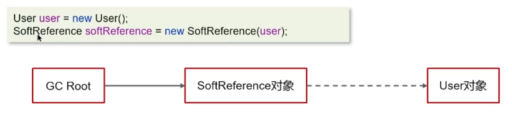

- **弱引用**：仅有弱引用引用该对象时，在垃圾回收时，无论内存是否充足，都会回收弱引用

  - 垃圾回收一定会被回收，配合 WeakReference 使用
  - ThreadLocal中内存泄漏涉及到弱引用

​	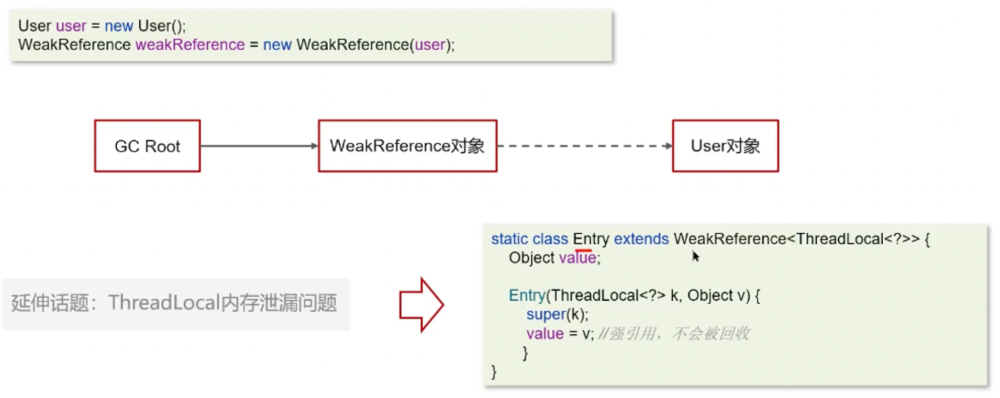

- 虚引用：必须配合引用队列使用，当引用对象回收时，会将虚引用入队，由 Reference Handler 线程调用虚引用相关方法释放内存
  - **引用对象被垃圾回收之后，会将虚引用入队**
  - 谁的虚引用进入队列中，谁就要被释放使用到的**外部资源**（可能是系统占用、直接内存等）
  - 可以想象成一个标记，可以服务于强、软、弱引用

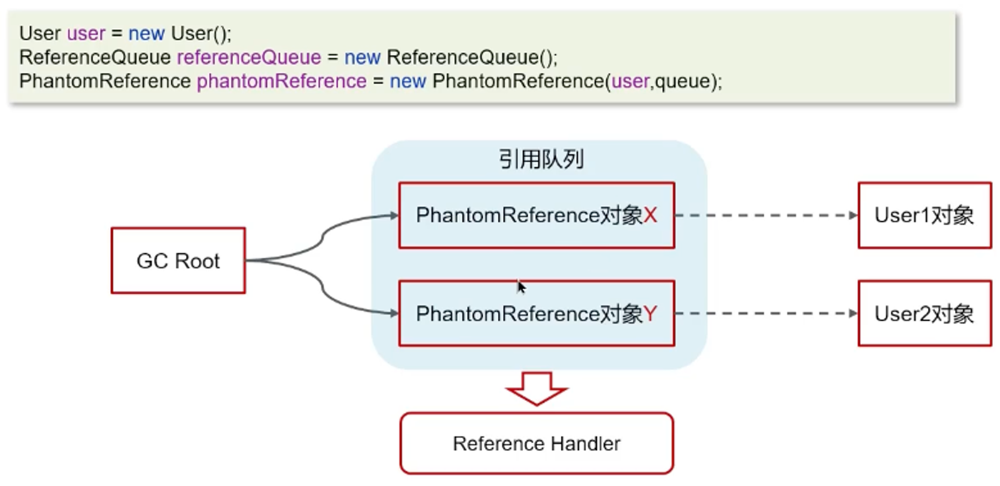

**弱引用了解吗?举例说明在哪里可以用?**

Java中的弱引用是一种引用类型，它不会阻止一个对象被垃圾回收。

在Java中，弱引用是通过`java.lang.ref.WeakReference`类实现的。弱引用的一个主要用途是创建非强制性的对象引用，这些引用可以在内存压力大时被垃圾回收器清理，从而避免内存泄露。

弱引用的使用场景：

1. **缓存系统**：弱引用常用于实现缓存，特别是当希望缓存项能够在内存压力下自动释放时。如果缓存的大小不受控制，可能会导致内存溢出。使用弱引用来维护缓存，可以让JVM在需要更多内存时自动清理这些缓存对象。
2. **对象池**：在对象池中，弱引用可以用来管理那些暂时不使用的对象。当对象不再被强引用时，它们可以被垃圾回收，释放内存。
3. **避免内存泄露**：当一个对象不应该被长期引用时，使用弱引用可以防止该对象被意外地保留，从而避免潜在的内存泄露。

假设我们有一个缓存系统，我们使用弱引用来维护缓存中的对象：

```java
public class CacheExample {
		private Map<String, WeakReference<MyHeavyObject>> cache = new HashMap<>();
		
		public MyHeavyObject get(String key) {
				WeakReference<MyHeavyObject> ref = cache.get(key);
				if (ref != null) {
						return ref.get();
				} else {
						MyHeavyObject obj = new MyHeavyObject();
						cache.put(key, new WeakReference<>(obj));
						return obj;
				}
		}
		
		// 假设MyHeavyObject是一个占用大量内存的对象
		private static class MyHeavyObject {
				private byte[] largeData = new byte[1024 * 1024 * 10]; // 10MB data
		}
}
```

在这个例子中，使用 WeakReference 来存储 MyHeavyObject 实例，当内存压力增大时，垃圾回收器可以自由地回收这些对象，而不会影响缓存的正常运行。

如果一个对象被垃圾回收，下次尝试从缓存中获取时，get()方法会返回null，这时我们可以重新创建对象并将其放入缓存中。因此，使用弱引用时要注意，一旦对象被垃圾回收，通过弱引用获取的对象可能会变为null，因此在使用前通常需要检查这一点。


### 3.7 Minor GC 和 Full GC ？什么时候发生？

**针对 HotSpot VM 的实现，它里面的 GC 其实准确分类只有两大种：**

部分收集 (Partial GC)：

- 新生代收集（Minor GC / Young GC）：只对新生代进行垃圾收集；
  - 当Eden区空间不足时，JVM会触发一次Minor GC，将Eden区和一个Survivor区中的存活对象移动到另一个Survivor区或老年代（Old Generation）。
  - 通常发生得非常频繁，因为年轻代中对象的生命周期较短，回收效率高，暂停时间相对较短。
- 老年代收集（Major GC / Old GC）：只对老年代进行垃圾收集。需要注意的是 Major GC 在有的语境中也用于指代整堆收集；
  - 主要针对老年代进行回收，但不一定只回收老年代。
  - 当老年代空间不足时，或者系统检测到年轻代对象晋升到老年代的速度过快，可能会触发Major GC。
  - 相比Minor GC，Major GC发生的频率较低，但每次回收可能需要更长的时间，因为老年代中的对象存活率较高。
- 混合收集（Mixed GC）：对整个新生代和部分老年代进行垃圾收集。
- 整堆收集 (Full GC)：收集整个 Java 堆和方法区。
  - 直接调用System.gc()或Runtime.getRuntime().gc()方法时，虽然不能保证立即执行，但JVM会尝试执行Full GC。
  - Minor GC（新生代垃圾回收）时，如果存活的对象无法全部放入老年代，或者老年代空间不足以容纳存活的对象，则会触发Full GC，对整个堆内存进行回收。
  - 当永久代（Java 8之前的版本）或元空间（Java 8及以后的版本）空间不足时。
  - Full GC是最昂贵的操作，因为它需要停止所有的工作线程（Stop TheWorld），遍历整个堆内存来查找和回收不再使用的对象，因此应尽量减少FullGC的触发。

**Minor GC 与 Full GC 分别在什么时候发生?**

分别发生在新生代空间不够和老年代空间不足的时候。

**Minor GC 会发生 stop the world 现象吗?**

会，只要涉及收集就会有 STW 现象。


### 3.8 创建的对象在新生代还是老年代？

对象是在堆中创建的，但堆又分为新生代和老年代，新生代又细分为 Eden、From Survivor、To Survivor。**那我们创建的对象到底在哪里**？

**对象优先在 Eden 区分配：**

堆分为新生代和老年代，新生代用于存放使用后就要被回收的对象（朝生夕死），老年代用于存放生命周期比较长的对象。

1. 我们创建的大部分对象，都属于生命周期较短的对象，所以会存放在新生代。新生代又细分 Eden、From Survivor、To Survivor，那我们创建的对象会优先在 Eden 区分配。
2. 随着对象的不断创建，Eden 剩余地内存空间就会越来越少，随后就会触发 Minor GC，于是 JVM 会把 Eden 区存活的对象转入 From Survivor 空间。
3. Minor GC 后，又创建的新对象会继续往 Eden 区分配。
4. 随着新对象的创建，Eden 的剩余内存空间就会越来越少，又会触发 Minor GC，此时，JVM 会对 Eden 区和 From Survivor 区中的对象进行存活判断，对于存活的对象，会转移到 To Survivor 区。
5. 下一次 Minor GC，存活的对象又会从 To 到 From，这样就总有一个 Survivor 区是空的，而另外一个是无碎片的。

**大对象直接进入老年代：**

对于上面的流程，也有例外的存在，如果一个对象很大，一直在 Survivor 空间复制来复制去，就会很浪费性能，所以这些大对象会直接进入老年代。

这种策略的目的是减少垃圾回收时的复制开销，因为大对象的复制比小对象更耗时。

可以通过 -XX:PretenureSizeThreshold 参数设置直接分配大对象到老年代的阈值。如果对象的大小超过这个阈值，它将直接在老年代中分配。

**长期存活的对象将进入老年代：**

对象在每次从一个 Survivor 区转移到另外一个 Survivor 区时，它的年龄就会增加；当对象的年龄达到一定阈值（默认为 15），则它会被转移到老年代。

虚拟机为了给对象计算他到底经历了几次 Minor GC，会给每个对象定义了一个对象年龄计数器。如果对象在 Eden 中经过第一次 Minor GC 后仍然存活，移动到 Survivor 空间年龄加 1，在 Survivor 区中每经历过 Minor GC 后仍然存活年龄再加 1。年龄到了 15，就到了老年代。

**动态年龄判断：**

除了年龄达到 MaxTenuringThreshold，还有另外一个方式进入老年代，那就是动态年龄判断：

1. JVM 会检查每个年龄段的对象大小，并估算它们在 Survivor 空间中所占的总体积。
2. JVM 会选择一个最小的年龄，使得该年龄及以上的对象可以填满 Survivor 空间的一部分（通常小于总空间的一半），然后将这些对象晋升到老年代。

比如 Survivor 是 100M，Hello1 和 Hello2 都是 3 岁，且总和超过了 50M，Hello3 是 4 岁，这个时候，这三个对象都将到老年代。

**空间分配担保：**

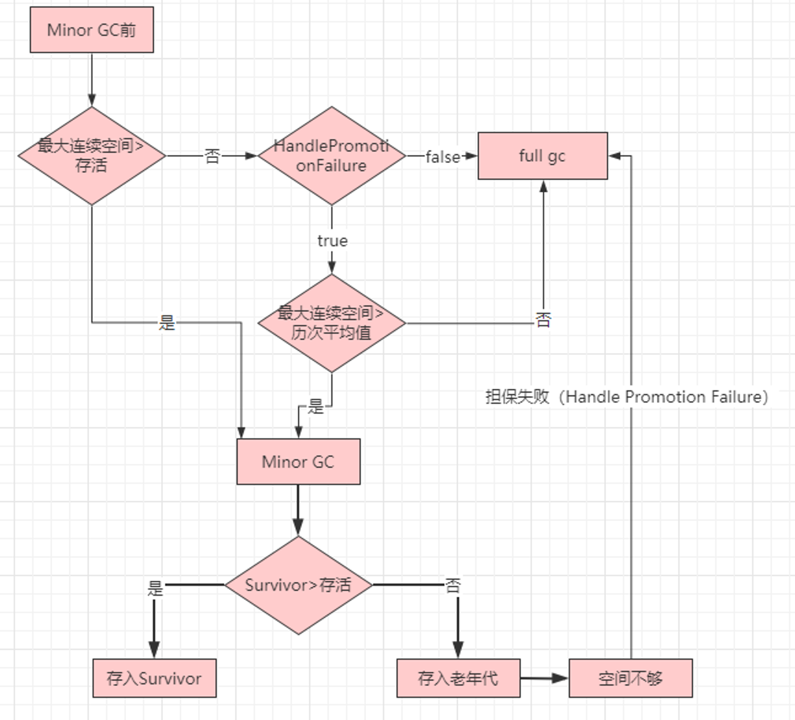

上面提到过，存活的对象会放入另外一个 Survivor 空间，如果这些存活的对象比 Survivor 空间还大呢？整个流程如下：

1. Minor GC 之前，JVM 会先检查老年代最大可用的连续空间是否大于新生代所有对象的总空间，如果大于，则发起 Minor GC。
2. 如果小于，则看 HandlePromotionFailure 有没有设置，如果没有设置，就发起 Full GC。
3. 如果设置了 HandlePromotionFailure，则看老年代最大可用的连续空间是否大于**历次晋升到老年代对象的平均大小**，如果小于，就发起 Full GC。
4. 如果大于，发起 Minor GC。Minor GC 后，看 **Survivor 空间是否足够存放存活对象**，如果不够，就放入老年代，如果够放，就直接存放 Survivor 空间。
5. 如果老年代都不够放存活对象，担保失败（Handle Promotion Failure），发起 Full GC。

**栈和方法区：**

Java 创建的对象几乎都在堆中，这包括通过 new 关键字创建的对象和数组。

- 对象的引用，通常存放在栈中，比如说当你在方法中声明一个变量 MyClass obj = new MyClass(); 时，变量 obj（一个指向堆中对象的引用）存储在栈上。
- 方法区用于存储已被 JVM 加载的类信息、常量、静态变量以及即时编译器编译后的代码。

Java 8 中，永久代被元空间（Metaspace）所取代。元空间使用本地内存（操作系统的内存），而非 JVM 内存。


### 3.9 Full GC 的触发条件有哪些

在 Java 虚拟机 (JVM) 中，Full GC（也称为全面垃圾回收或全量垃圾回收）是指对堆内存的所有区域（包括年轻代和老年代）进行垃圾回收的过程。Full GC 触发的条件有很多种，主要包括以下几个：

1. **老年代空间不足**：如果老年代（Old Generation）空间不足，JVM 会触发 Full GC 来尝试回收老年代中的无用对象。
2. **系统调用 System.gc()**：当代码中调用 System.gc() 或 Runtime.getRuntime().gc() 时，JVM 会建议进行 Full GC。这种调用不一定会立即触发 Full GC，但 JVM 通常会响应这个请求。
3. **大对象的分配**：当分配一个大对象时，如果老年代空间不足，JVM 会触发 Full GC 以释放老年代空间。
4. **永久代或元空间（Metaspace）不足**：对于一些 JVM 实现（如 Java 7 及以前版本的 HotSpot JVM），永久代（PermGen space）的空间不足也会触发 Full GC。对于 Java 8 及以后版本，永久代被元空间（Metaspace）替代，Metaspace 空间不足也会触发 Full GC。
5. **内存碎片**：如果堆内存由于碎片化严重而无法分配连续的大块内存，也可能触发 Full GC。
6. **类卸载**：在某些情况下，如果卸载了大量类（例如，在长时间运行的应用中动态加载和卸载类），可能会触发 Full GC。
7. **JVM 参数设置**：JVM 参数（如 XX:+UseConcMarkSweepGC 和 XX:+UseG1GC）可以影响 Full GC 的触发条件和频率。例如，G1 垃圾收集器会在满足一定条件时触发 Full GC。
8. **JVM 运行时错误**：在某些特殊情况下，JVM 可能因为内部错误或资源不足而触发 Full GC。

Full GC 通常比 Young GC（年轻代垃圾回收）耗时更长，因为它涉及整个堆的扫描和回收。优化垃圾回收性能和减少 Full GC 的频率是性能调优中的一个重要方面。


### 3.10 CMS 和 G1 收集器的区别

**区别一：使用的范围不一样**

- CMS收集器是老年代的收集器，可以配合新生代的Serial和ParNew收集器一起使用
- G1收集器收集范围是老年代和新生代。不需要结合其他收集器使用

**区别二：STW的时间**

- CMS收集器以最小的停顿时间为目标的收集器。
- G1收集器可预测**垃圾回收 (opens new window)** 的停顿时间（建立可预测的停顿时间模型）

**区别三： 垃圾碎片**

- CMS收集器是使用“标记-清除”算法进行的垃圾回收，容易产生内存碎片
- G1收集器使用的是“标记-整理”算法，进行了空间整合，没有内存空间碎片。

**区别四： 垃圾回收的过程不一样, 注意这两个收集器第四阶段得不同**

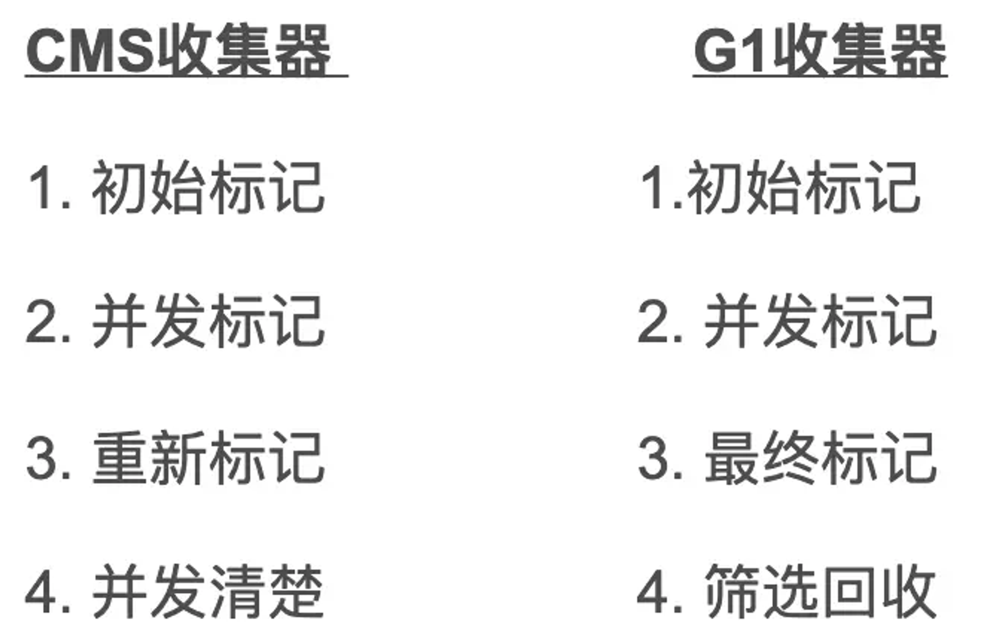

**区别五: CMS会产生浮动垃圾**

- CMS产生浮动垃圾过多时会退化为serial old，效率低，因为在上图的第四阶段，CMS清除垃圾时是并发清除的，这个时候，垃圾回收线程和用户线程同时工作会产生浮动垃圾，也就意味着CMS垃圾回收器必须预留一部分内存空间用于存放浮动垃圾
- 而G1没有浮动垃圾，G1的筛选回收是多个垃圾回收线程并行gc的，没有浮动垃圾的回收，在执行‘并发清理’步骤时，用户线程也会同时产生一部分可回收对象，但是这部分可回收对象只能在下次执行清理是才会被回收。如果在清理过程中预留给用户线程的内存不足就会出现‘Concurrent Mode Failure’,一旦出现此错误时便会切换到SerialOld收集方式。


### 3.11 **什么情况下使用CMS，什么情况使用G1?**

CMS适用场景：

1. **低延迟需求**：适用于对停顿时间要求敏感的应用程序。
2. **老生代收集**：主要针对老年代的垃圾回收。
3. **碎片化管理**：容易出现内存碎片，可能需要定期进行Full GC来压缩内存空间。

G1适用场景：

1. **大堆内存**：适用于需要管理大内存堆的场景，能够有效处理数GB以上的堆内存。
2. **对内存碎片敏感**：G1通过紧凑整理来减少内存碎片，降低了碎片化对性能的影响。
3. **比较平衡的性能**：G1在提供较低停顿时间的同时，也保持了相对较高的吞吐量。


### 3.12 **GC只会对堆进行GC吗？**

JVM 的垃圾回收器不仅仅会对堆进行垃圾回收，它还会对方法区进行垃圾回收。

1. **堆（Heap）：** 堆是用于存储对象实例的内存区域。大部分的垃圾回收工作都发生在堆上，因为大多数对象都会被分配在堆上，而垃圾回收的重点通常也是回收堆中不再被引用的对象，以释放内存空间。
2. **方法区（Method Area）：** 方法区是用于存储类信息、常量、静态变量等数据的区域。虽然方法区中的垃圾回收与堆有所不同，但是同样存在对不再需要的常量、无用的类信息等进行清理的过程。


## 4 JVM实践 - 结合实践操作来看

### 4.1 JVM 的调优参数在哪里设置

项目开发中通常有两种项目部署方式：

- war 包部署在tomcat中设置
  - 修改 `TOMCAT_HOME/bin/catalina.sh` 文件
  - JAVA_OPTS
    - `Xms512m` 堆的初始空间大小
    - `Xmx1024m` 堆的最大空间大小
- jar 包部署在启动参数时设置
  - 通常在linux系统下面直接加参数启动 springboot 项目
  - `nohup java -Xms512m -Xmx1024m -jar xxxx.jar —spring.profiles.avtive=prod &`


### 4.2 JVM 调优参数有哪些

调优参数主要分为以下几类：

- 设置堆空间大小：为了防止GC在初始大小以及最大大小之间收缩堆产生额外的时间，通常吧最大值以及初始大小设置成相同的值

  - 堆的初始化大小 **Xms**
  - 堆的最大大小 **Xmx**
  - 堆空间设置多少合适：
    - 最大大小的默认值是物理内存的1/4，初始大小是物理内存的1/64
    - 堆太小，可能导致频繁的年轻代和老年代之间的垃圾回收，产生stw，暂停用户线程
    - 堆太大，如果发生了full-gc，会扫描整个堆空间，暂停用户线程的时间比较长
    - 推荐设置：考虑其他程序的情况下尽量大些

- 虚拟机栈的设置：

  每个线程默认会开启1M的内存，用于存放栈帧、调用参数、局部变量等，但是一般256k就够用，通常减少每个线程的堆栈，可以产生更多的线程

  - 栈的大小设置 **Xss**

- 年轻代中Eden和两个S区的大小比例设置

  - 不设置的话，默认比例为8:1:1 - 即设置**XXSurvivorRatio** = 8

- 年轻代晋升老年代阈值

  - 默认值是15，可以设置在0-15之间
  - `XX：MaxTenuringThreshold`

- 设置垃圾回收器

  - 设置垃圾回收收集器
    - 增大吞吐量，提升性能可以设置并行垃圾回收器
    - XX:+UseParallelGC
    - XX:+UseParallelOldGC
    - XX:+UseG1GC


### 4.3 JVM 性能监控 - 命令行 + 可视化

**性能监控 - 命令行**

JDK 为性能监控提供了一系列对应的命令行，比如说用于性能监控的 jps、jstat、jinfo、jmap、jstack、jcmd 等等。首先对可能用到的命令行工具进行说明。

**jps: 查看虚拟机进程**

jps 类似 Linux 下的 ps，用于快速查看哪些 Java 应用正在运行，以及它们的进程 ID，这对于进一步使用其他 JVM 工具进行诊断是必要的。

jps 命令示例：


前面的数字表示 pid：pid 是进程 ID，是操作系统分配给进程的唯一标识符，可以用来查看进程的详细信息。有了 pid，我们可以直接在命令行通过 kill 命令来关闭进程，比如：

```java
kill -9 pid
```

**jstat：查看 JVM 运行时信息**

jstat 用于监控 JVM 的各种运行时状态信息，提供有关垃圾回收、类加载、JIT 编译等运行数据。

jstat 命令格式为：

```java
jstat [ option vmid [interval[s|ms] [count]] ]
```

选项 option 主要分为三类：类加载、垃圾收集、运行期编译状况。

1. -class：监视类装载、卸载数量、总空间以及类装载所耗费的时间。例如 jstat -class -t 75952 1000 2 会输出进程为 75952 的类装载信息，每秒（1000ms）统计一次，一共输出 2 次。
2. -gc：监视 Java 堆状况，包括 Eden 区、2 个 Survivor 区、老年代等容量、已用空间、GC 时间合计等信息。例如 jstat -gc 75952 1000 2 会输出进程 75952 的 GC 信息，每秒统计一次，一共输出两次。
3. -compiler：监视 JIT 编译器编译过的方法、耗时等信息。
4. -gcutil ： 总垃圾回收统计；监视内容与-gc 基本相同，但输出主要关注已使用空间占总空间的百分比。

**jinfo：查看进程所用的 JVM 配置信息**

jinfo 用于在补重启应用的情况下，调整虚拟机的各项参数，或者输出 Java 进程的详细信息。

如下命令 jinfo -flags 88952 会输出进程 88952 的 JVM 参数信息。

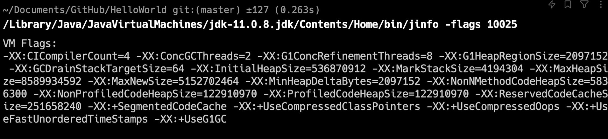

**jamp：导出堆快照**

jmap 命令用于生成堆转储快照（一般称为 heap dump 或 dump 文件），堆转储包含了 JVM 堆中所有对象的信息，包括类、属性、引用等。这对于分析内存泄漏和优化内存使用非常有帮助。

jmap 命令格式：

- jmap -histo 10025 会输出进程 10025 的堆内存中所有对象的数量和占用内存大小的汇总信息，按照内存使用量排序。
- jamp -heap pid 显示 Java 堆详细信息，比如：用了哪种回收器、参数配置、分代情况。
- jmap -dump:format=b,file=heap.hprof pid  保存到对应文件中（生成快照）

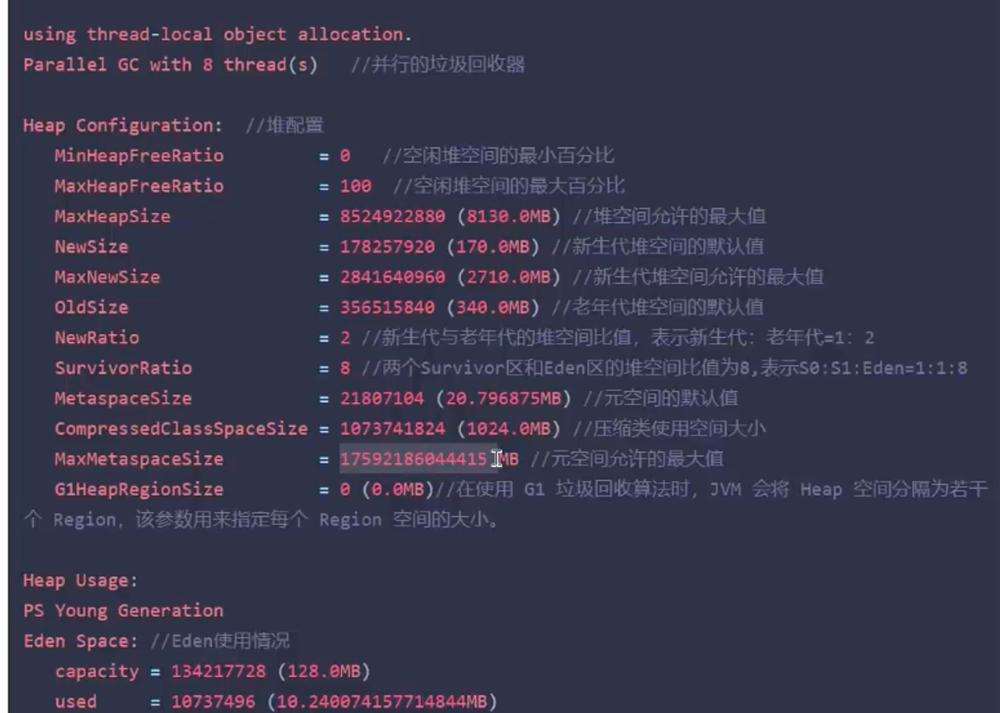

**jstack：跟踪 Java 堆栈**

jstack 用于打印出 JVM 中某个进程或远程调试服务的线程堆栈信息（一般称为 threaddump 或者 javacore 文件）。它常用于诊断应用程序中的线程问题，比如线程死锁、死循环或长时间等待。

如下 `jstack -l 10025` 会输出进程 10025 的线程堆栈信息，包括锁信息。

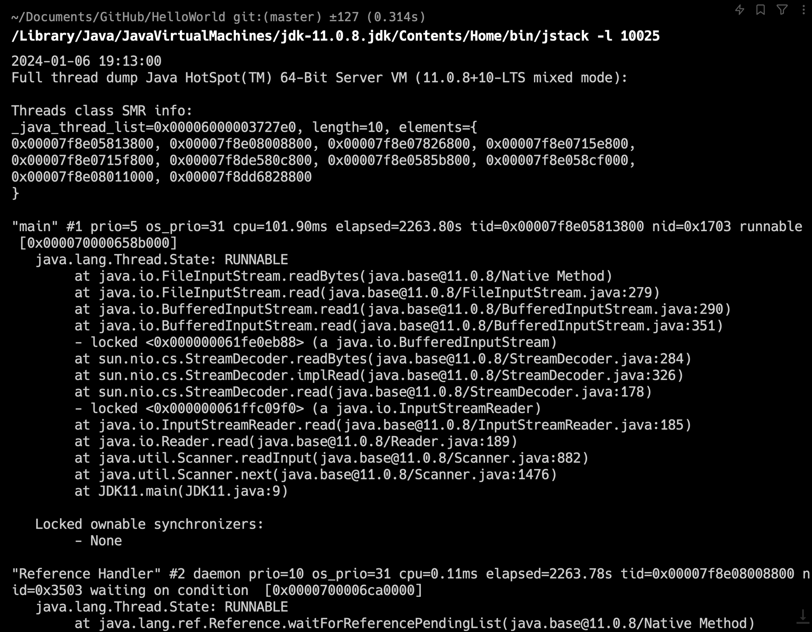

**操作系统性能监控命令**

除了 JDK 自带的命令行，我们很多时候还要使用操作系统为我们提供的命令行工具，来完成性能监控的监测。比如说 top、vmstat、iostat、netstat 等等。

1. top：用于实时显示系统中各个进程的资源占用情况，如 CPU 和内存使用率。常用于快速查看哪些进程占用了较高的资源。
2. vmstat：统计 CPU、内存、swap 的使用情况。vmstat 工具的使用是通过两个数字参数来完成的，第一个参数是采样的时间间隔数，单位是秒，第二个参数是采样的次数。
3. iostat：iostat 用于统计 CPU 使用信息和磁盘的 IO 信息。
4. netstat：用于监控和显示网络相关信息。
   1. 查看端口占用情况：`netstat -tunlp | grep 端口号`

**性能监控 - 可视化工具：**

1. JConsole ：可以用来监视 Java 应用程序的运行状态，包括内存使用、线程状态、类加载、GC 等，还可以进行一些基本的性能分析。
2. VisualVm ：一款功能强大的运行监视和故障处理工具之一，在很长一段时间内，VisualVM 都是 Oracle 官方主推的故障处理工具。
3. Arthas：线上 Java 诊断神器，通过全局的视角可以查看应用程序的内存、GC、线程等状态信息，并且能够在不修改代码的情况下，对业务问题进行诊断，包括查看方法的参数调用、执行时间、异常堆栈等信息，大大提升了生产环境中问题排查的效率。


### 4.4 Java 内存泄漏的排查思路

**解决Java内存泄漏的步骤:**

1. 在项目开启时，配置堆内存快照信息
   - **-XX:+HeapDumpOnOutMemoryError  进行相应配置**
   - **-XX:HeapDumpPath=/dump/filename/   保存到对应文件中**
2. **VisualVM 分析dump 文件：文件 - 装入 - 选择 dump 文件 - 打开**
3. **通过查看堆信息，定位内存溢出问题**

------

OutOfMemoryError，也就是臭名昭著的 OOM（内存溢出），相对于常见的业务异常，如数组越界、空指针等，OOM 问题更难难定位和解决。

在 Java 中，和内存相关的问题主要有两种，内存溢出和内存泄漏。

- **内存溢出**（Out Of Memory）：就是申请内存时，JVM 没有足够的内存空间。

- 内存泄露

  （Memory Leak）：就是申请了内存，但是没有释放，导致内存空间浪费。

  - 例如：ThreadLocal 内存泄漏，开启 connection 之后没有 close 造成的内存泄漏

内存泄漏和内存溢出可能存在哪里：

- JVM虚拟机栈、本地方法栈：StackOverFlowError
- 方法区：OOM：Meta
- 堆空间：OOM：Java heap space

**堆空间溢出的案例有什么？设置JVM Option: -Xmx10m**

```java
List<String> list = new ArrayList<>();
while(true){
	list.add("北京");
}
```

系统上通常部署了很多个微服务，这时候服务器的OOM可能出现的症状：

- 启动闪退
- 运行一段时间宕机
- OOM 现象出现异常的频次越来越多。

**这时，如何去排查内存泄漏：通常都是大对象没有被回收的情况**

1. 获取堆内存快照 dump：内存溢出直接闪退，建议通过参数方式
   1. -XX:+HeapDumpOnOutMemoryError  进行相应配置
   2. -XX:HeapDumpPath=/dump/filename/   保存到对应文件中
2. VisualVM 分析dump 文件：文件 - 装入 - 选择 dump 文件 - 打开
3. 通过查看堆信息，**定位内存溢出问题** - 查看当前哪一行出现了错误，进行检查

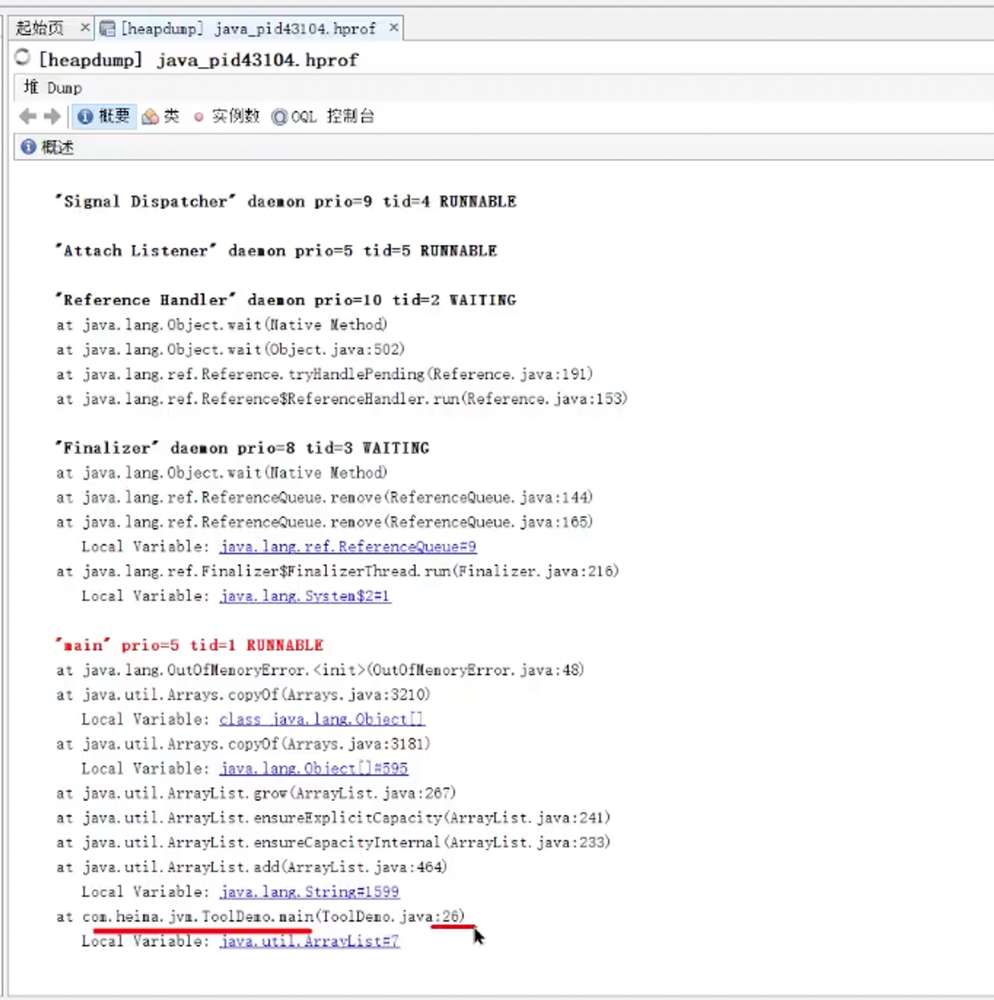


### 4.5 CPU 飙高排查方案以及思路（常问 ）

**解决CPU飙高的步骤：**

- **使用 top 命令查看哪个进程占用 CPU 最高**
- **使用 ps H -eo pid,tid,%cpu | grep pid 查看哪个线程占用CPU比较高**
- **使用 printf “%x\n” tid 查看线程的十六进制名称**
- **在 jstack pid 中寻找对应的线程，根据得到的代码行号 + cat 的方式来找到哪一行代码有问题**

------

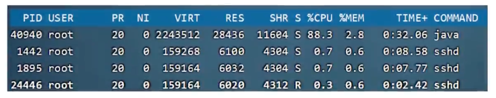

- **使用 top 命令可以查看占用cpu的情况**

  - 可以查看哪一个进程占用cpu比较高，如上图中的进程为：40940

- 使用命令查看进程中的哪个线程占用CPU比较高

  - 对应指令为：ps H -eo pid,tid,%cpu | grep 2266

  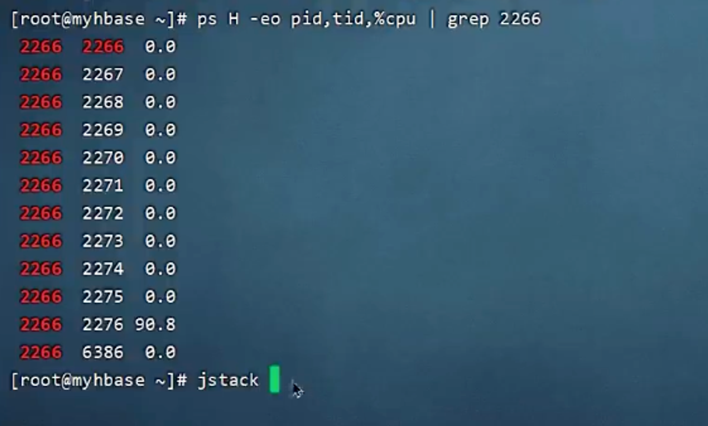

- 使用命令 jstack 2266 查看进程内的**线程信息** - 可以看到 2276 占用线程比较高

  - printf “%x\n” 2276  → 8e4  则是十六进制信息

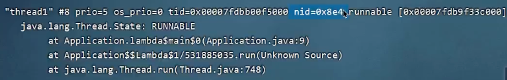

可以看到是当前第9行出现了问题

- 查看当前代码的第九行
  - cat Application.java 查看当前代码，定位发生了什么问题


### 4.8 系统运行缓慢怎么办 - FUll GC 次数过高、CPU 飙高(重点!!!!)

**系统缓慢的原因：**

对于线上系统突然产生的运行缓慢问题，如果该问题导致线上系统不可用，那么首先需要做的就是，导出jstack和内存信息，然后重启系统，尽快保证系统的可用性。**这种情况可能的原因主要有两种：**

- 代码中某个位置读取数据量较大，导致系统内存耗尽，从而导致**Full GC**次数过多，系统缓慢；
- 代码中有比较耗**CPU**的操作，导致CPU过高，系统运行缓慢；

**另外有几种情况也会导致某个功能运行缓慢，但是不至于导致系统不可用：**

- 代码某个位置有阻塞性的操作，导致该功能调用整体比较耗时，但出现是比较随机的；
- 某个线程由于某种原因而进入WAITING状态，此时该功能整体不可用，但是无法复现；
- 由于锁使用不当，导致多个线程进入死锁状态，从而导致系统整体比较缓慢。

对于这三种情况，通过查看CPU和系统内存情况是无法查看出具体问题的，因为它们相对来说都是具有一定阻塞性操作，CPU和系统内存使用情况都不高，但是功能却很慢。

**Full GC次数过多**

相对来说，这种情况是最容易出现的，尤其是新功能上线时。对于Full GC较多的情况，其主要有如下两个特征：

- 线上多个线程的 CPU 都超过了100%，通过 jstack 命令可以看到这些线程主要是垃圾回收线程
- 通过 jstat 命令监控GC情况，可以看到Full GC次数非常多，并且次数在不断增加。
- FUll GC 次数过高的排查办法：
  - 使用 top 命令查询使用 CPU 消耗最高的 pid
  - 使用 top -Hp pid 去查询该进程中消耗 CPU 消耗最高的 tid
  - 由于在 jstack 中，线程 id 都转换成了十六进制形式，所以需要转换一下 printf “%x\\n” 10a
  - 如果发现 nid 指向了一个垃圾回收线程 - VM Thread
  - 可以通过 jstat -gcutil pid 查看垃圾回收数量，可以看到 FULL GC 数量非常高，所以证实了式内存溢出导致的系统缓慢
  - jmap 导出堆快照信息：jmap -dump: format=b, file=heap.hprof pid
  - 将内存日志通过 Visual VM 进行分析，可以确定内存中哪个对象比较消耗内存，然后可以找到该对象的创建位置，进行处理
- 总结来说，对于Full GC次数过多，主要有以下两种原因：
  - 代码中一次获取了大量的对象，导致内存溢出，此时可以通过eclipse的mat工具查看内存中有哪些对象比较多；
  - 内存占用不高，但是Full GC次数还是比较多，此时可能是显示的 System.gc()调用导致GC次数过多，这可以通过添加 XX:+DisableExplicitGC来禁用JVM对显示GC的响应。

**CPU 飙高**

除了 FULL GC 可能造成 CPU 飙高之外，还有可能的就是代码中遇到了比较耗时的计算。其排查过程如下：

- 使用 top 命令查询使用 CPU 消耗最高的 pid
- 使用 top -Hp pid 去查询该进程中消耗 CPU 消耗最高的 tid
- 由于在 jstack 中，线程 id 都转换成了十六进制形式，所以需要转换一下 printf “%x\\n” 10a
- 在 jstack，我们就可以区分具体是 CPU 计算导致 CPU 过高的原因还是 FULL GC 导致内存消耗过高
  - 如果是Full GC次数过多，那么通过jstack得到的线程信息会是类似于VM Thread之类的线程
  - 而如果是代码中有比较耗时的计算，那么我们得到的就是一个线程的具体堆栈信息

**不定期出现的接口耗时现象**

比较典型的例子就是，我们某个接口访问经常需要2~3s才能返回。

这是比较麻烦的一种情况，因为一般来说，其消耗的CPU不多，而且占用的内存也不高，也就是说，我们通过上述两种方式进行排查是无法解决这种问题的。

**我们通常的方法是：**

- 首先找到该接口，通过压测工具不断加大访问力度，如果说该接口中有某个位置是比较耗时的
- 由于我们的访问的频率非常高，那么大多数的线程最终都将阻塞于该阻塞点
- 多个线程具有相同的堆栈日志，我们基本上就可以定位到该接口中比较耗时的代码的位置


### 4.9 死锁如何检测

对于死锁，这种情况基本上很容易发现，因为jstack可以帮助我们检查死锁，并且在日志中打印具体的死锁线程信息。如下是一个产生死锁的一个jstack 日志示例：

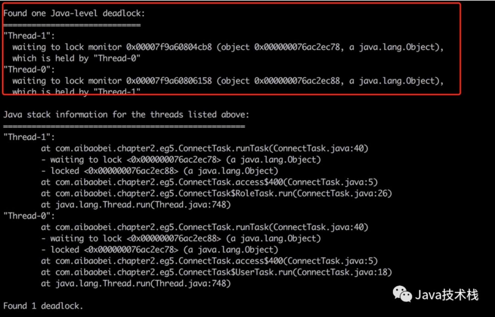