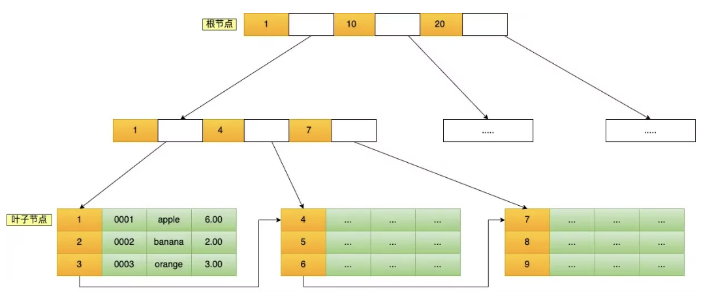

[TOC]

```
MySql 考点
    1 Mysql - 面试题
        1.1 什么是关系型数据库、其特性是什么
        1.2 char 和 varchar 的区别是什么?
        1.3 varchar(100)和 varchar(10)的区别是什么?
        1.4 decimal 和 float/double 的区别是什么?存储金钱应该用哪一种?
        1.5 为什么不推荐使用 text 和 blob?
        1.6 Mysql中有几种保存日期的类型？其区别是什么？
        1.7 Mysql 中的列如果是 NULL 会引发什么问题？NULL 和 ‘’ 相同吗？
        1.8 数据库中有哪些常见概念
        1.9 数据库三范式 - 一般满足 2NF 即可
        1.10 什么是 ER 图？数据库的设计步骤有哪些？
        1.11 主键和外键有什么区别
        1.12 drop、delete 和 truncate 区别？
        1.13 NoSqL 是什么？常见的 NoSql 有哪些？
        1.14 Mysql 中的字符集需要注意什么
        1.15 说一下外键约束
    2 SQL 基础
        2.1 where 和 having 的区别
        2.2 内连接、左连接和右连接的区别
        2.3 union 和 union all 的区别
        2.4 SQL 语句的执行顺序
        2.5 如何创建索引？索引的优缺点？
        2.6 数据库字段上常用的约束有哪些？
        2.7 NOSQL和SQL的区别？
        2.8 Mysql 如何避免重复插入数据?
        2.9 MySQL的关键字 in 和 exist
        2.10 Mysql 中的一些基本函数, 你知道哪些
        2.11 sql 题目: 给学生表、课程成绩表，求不存在01课程但存在02课程的学生的成绩
        2.12 sql 题目:  给定一个学生表 student_score（stu_id，subject_id，score），查询总分排名在5-10名的学生id及对应的总分
    3 MySQL 存储引擎
        3.1 MySQL 支持哪些存储引擎?默认使用哪个?
        3.2 MyISAM 和 InnoDB 有什么区别?（常问）
        3.3 执行一条SQL请求的过程是什么？
        3.4 MySQL为什么InnoDB是默认引擎？
        3.5 数据管理里，数据文件大体分成哪几种数据文件？
    4 MySQL 事务
        4.1 事务的四大特性了解么?
        4.2 并发事务带来了哪些问题?不可重复读和幻读有什么区别?
        4.3 MySQL 事务隔离级别?默认是什么级别?
        4.4 并发事务的控制方式有哪些？
        4.5 MySQL 的隔离级别是基于锁实现的吗?
        4.6 InnoDB 对 MVCC 的具体实现
        4.7 MySQL 中不同隔离级别的实现机制
        4.8 MySQL 对于幻读的解决
        4.9 举个例子说可重复读下的幻读问题
        4.10 Mysql 设置了可重读隔离级后，怎么保证不发生幻读？
        4.11 介绍MVCC实现原理?
        4.12 一条update是不是原子性的？为什么？
        4.13 滥用事务，或者一个事务里有特别多sql的弊端？
    5 MySQL 锁机制
        5.1 表级锁和行级锁有什么区别?
        5.2 哪些操作会加表级锁?哪些操作会加行级锁?请简单举例说一下
        5.3 InnoDB 有哪几类行锁?
        5.4 Next-Key Lock 的加锁范围?
        5.5 当前读和快照读有什么区别?
        5.6 MySQL 如何使用乐观锁和悲观锁?
        5.7 行级锁的使用有什么注意？（索引失效？）
        5.8 MySQL 不同隔离级别的加锁情况
        5.9 意向锁有什么作用？
        5.10 MySQL 自增锁有了解吗？
        5.11 Mysql 中死锁的发生，举个例子？优化方式？
        5.12 锁 - 相关判断
    6 MySQL 索引
        6.1 为什么索引能提高查询速度?
        6.2 聚集索引和非聚集索引的区别?非聚集索引一定回表查询吗?
        6.3 索引这么多优点，为什么不对表中的每一个列创建一个索引呢?(使用索引一定能提高查 询性能吗?)
        6.4 索引底层的数据结构了解么?Hash 索引和 B+树索引优劣分析
        6.5 B+树做索引比红黑树好在哪里?
        6.6 最左前缀匹配原则了解么?
        6.7 什么是回表?什么是覆盖索引？什么是索引下推？
        6.8 如何查看某条 SQL 语句是否用到了索引?(重点!!!!)
        6.9 索引类型有哪些？可以按什么维度分类？
        6.10 MySQL主键是聚簇索引吗？什么字段适合当主键?
        6.11 Mysql中的索引是怎么实现的 ？
        6.12 B+树的叶子节点链表是单向还是双向？
        6.13 为什么 MysSQL 不用 跳表？
        6.14 联合索引的实现原理？
        6.15 索引失效有哪些？
        6.16 如果一个列即使单列索引，又是联合索引，单独查它的话先走哪个？
        6.17 索引已经建好了，那我再插入一条数据，索引会有哪些变化 ?
        6.18 索引优化详细讲讲
    7 MySQL 日志
        7.1 MySQL 中常⻅的日志有哪些?
        7.2 慢查询日志有什么用?
        7.3 binlog 主要记录了什么?
        7.4 redo log 如何保证事务的持久性?
        7.5 ⻚修改之后为什么不直接刷盘呢?
        7.6 bin log 和 redo log 有什么区别？
        7.7 undo log 如何保证事务的原子性?
        7.8 如果整个数据库数据被删除了，可以使用 redo log 文件恢复数据吗？
        7.9 binlog 两阶段提交过程是怎么样的？
        7.10 update语句的具体执行过程是怎样的？
    8 MySQL 性能优化
        8.1 能用 MySQL 直接存储文件(比如图片)吗?
        8.2 MySQL 如何存储 IP 地址?
        8.3 Mysql EXPLAIN 有什么作用(重点!!!!!)
        8.4 有哪些常⻅的 SQL 优化手段
        8.5 简单说一下大表优化的思路
        8.6 读写分离如何实现?
        8.7 为什么要分库分表?有哪些常⻅的分库分表工具?
        8.8 深度分⻚如何优化?
        8.9 数据冷热分离如何做?
        8.10 常⻅的数据库优化方法有哪些?
        8.11 超 100 万行的批量写入操作，如何优化？
        8.12 数据库中如何存储日期字段？
        8.13 给你张表，发现查询速度很慢，你有那些解决方案
        8.14 如果Explain用到的索引不正确的话，有什么办法干预吗？
    9 Mysql 进阶 - 补充知识
        9.1 Mysql 中如何定位慢查询
        9.2 SQL 语句执行很慢，如何分析
        9.3 主键自增是否会降低数据库insert性能？
        9.4 MySQL 中 in 与 exists 的区别
        9.5 小表驱动大表
        9.6 SQL 注入是什么？
    10 Mysql 架构
        10.1 MySQL主从复制了解吗
        10.2 主从延迟都有什么处理方法？
        10.3 分库分表是什么? 有什么区别?
        10.4 分库分表面试连环问
        10.5 分库分表面试连环问解答（重点）
        10.6 Mysql 扩容策略
```


# MySql 考点

## 1 Mysql - 面试题

### 1.1 什么是关系型数据库、其特性是什么

关系型数据库（RDB，Relational Database）就是一种建立在**关系模型**的基础上的数据库。关系模型表明了数据库中所存储的数据之间的联系（一对一、一对多、多对多）。四个特性：

- 存储方式：采用表格的储存方式，数据以行和列的方式进行存储，要读取和查询都十分方便。
- 结构化存储：按照结构化的方法存储数据，每个数据表都必须对各个字段定义
- SQL查询：采用结构化查询语言（即SQL）来对数据库进行查询
- 保持事务性：强调ACID规则


### **1.2 char 和 varchar 的区别是什么?**

两者的主要区别在于：**CHAR 是定长字符串，VARCHAR 是变长字符串。**

不同点：

1. 存储空间：
   1. CHAR 在存储时会在右边填充空格以达到指定的长度，检索时会去掉空格。
   2. VARCHAR 在存储时需要使用 1 或 2 个额外字节记录字符串的长度，检索时不需要处理。
2. 适用类型：
   1. CHAR 更适合存储长度较短或者长度都差不多的字符串，例如 Bcrypt 算法、MD5 算法加密后的密码、身份证号码。
   2. VARCHAR 类型适合存储长度不确定或者差异较大的字符串，例如用户昵称、文章标题等。


### **1.3 varchar(100)和 varchar(10)的区别是什么?**

二者区别：

1. 区别 1 - 可以存储的字符大小不同：
   1. VARCHAR(100) 表示能存储最多 100 个字符；
   2. VARCHAR(10)存储超过 10 个字符时，就需要修改表结构才可以。
2. 区别 2 - 消耗内存不同：
   1. 二者存储相同的字符串，所占用磁盘的存储空间其实是一样的。
   2. VARCHAR 类型在内存中操作时，通常会分配固定大小的内存块来保存值。例如在进行排序的时候，VARCHAR(100) 是按照 100 这个长度来进行的，也就会消耗更多内存。


### **1.4 decimal 和 float/double 的区别是什么?存储金钱应该用哪一种?**

**主要区别：是否精确**

- DECIMAL 是定点数，FLOAT/DOUBLE 是浮点数。
- DECIMAL 可以存储精确的小数值，FLOAT/DOUBLE 只能存储近似的小数值。

DECIMAL 用于存储具有精度要求的小数，例如与货币相关的数据，可以避免浮点数带来的精度损失。在 Java 中，MySQL 的 DECIMAL 类型对应的是 Java 类 java.math.BigDecimal。


### **1.5 为什么不推荐使用 text 和 blob?**

MySQL 3 种text类型的最大长度如下：

- TEXT：65,535 bytes ~64kb
- MEDIUMTEXT：16,777,215 bytes ~16Mb
- LONGTEXT：4,294,967,295 bytes ~4Gbc

text 和 blob 的应用场景：

1. TEXT：TEXT 类型类似于 CHAR 和 VARCHAR，但可以存储更长的字符串，即长文本数据，例如博客内容。
2. BLOB：主要用于存储二进制大对象，例如图片、音视频等文件。

在日常开发中，很少使用 TEXT 类型，但偶尔会用到，而 BLOB 类型则基本不常用。如果预期长度范围可以通过 VARCHAR 来满足，建议避免使用 TEXT。

不推荐使用 BLOB 和 TEXT 类型，是因为这两种类型具有一些缺点和限制，例如：

1. 不能有默认值
2. 在使用临时表时无法使用内存临时表，只能在磁盘上创建临时表
3. 检索效率较低
4. 不能直接创建索引，需要指定前缀长度
5. 可能会消耗大量的网络和 IO 带宽


### **1.6 Mysql中有几种保存日期的类型？其区别是什么？**

Mysql 中主要有两种保存日期的类型，分别为 DATATIME 和 TIMESTAMP。主要区别如下：

- 时区信息：
  - DATETIME 类型没有时区信息；
  - TIMESTAMP 和时区有关。
- 存储空间：
  - DATETIME 需要耗费 8 个字节的存储空间，表示时间范围比较大；
  - TIMESTAMP 只需要使用 4 个字节的存储空间，表示的时间范围更小（2037年）。


### **1.7 Mysql 中的列如果是 NULL 会引发什么问题？NULL 和 ‘’ 相同吗？**

NULL 是一个不确定的值，就算是两个 NULL 它们之间也不一定相同。例如，select null = null 的结果返回为 false，但是我们在使用 distinct、group by 以及 order by 时，null 又被认为是相等的。

**为什么 MySQL 不建议使用 NULL 作为列默认值：**

1. 使用 count(*) 或者 count(null column) 结果不同，count(null column) <= count(*)。
2. 虽然 select NULL=NULL 的结果为 false ，但是在我们使用 distinct，group by，order by时，NULL又被认为是相同值。
3. NULL 值需要为每个记录多申请一个字节来标志是否为空。

**NULL 和 空字符串 ‘’ 的区别：**

1. 空字符串的长度为 0，是不占用空间的；而 NULL 是需要占用空间的。
2. NULL 会影响聚合函数的结果，聚合函数会忽略 NULL 值；例如在使用 COUNT 时，COUNT(*) 会统计所有的记录数，而 COUNT(列名) 则会忽略 NULL 值，只统计非空值的个数。
3. 查询 NULL 值时，必须使用 IS NULL 和 IS NOT NULL 来判断，而不能使用比较运算例如 = 、≠ 之类的比较运算符；而空字符串是可以用这些比较运算符的。


### **1.8 数据库中有哪些常见概念**

- **元组**：元组（tuple）是关系数据库中的基本概念，关系是一张表，表中的每行（即数据库中的每条记录）就是一个元组，每列就是一个属性。 在二维表里，元组也称为行。
- **码**：码就是能唯一标识实体的属性，对应表中的列。
- **候选码**：若关系中的某一属性或属性组的值能唯一的标识一个元组，而其**任何子集**都不能再标识，则称该属性组为候选码。
- **主码** : 主码也叫主键。主码是从候选码中选出来的。 一个实体集中只能有一个主码，但可以有多个候选码。
- **外码** : 外码也叫外键。关系中的一个属性是另外一个关系中的主码则这个属性为外码。
- **主属性**：候选码中出现过的属性称为主属性。
- **非主属性：** 不包含在任何一个候选码中的属性称为非主属性。


### **1.9 数据库三范式 - 一般满足 2NF 即可**

- 1NF(第一范式)：属性不可再分, 数据库表的每一列都是不可分割的原子数据项
  - 属性（对应于表中的字段）不能再被分割，也就是这个字段只能是一个值
  - 1NF 是所有关系型数据库的最基本要求 ，也就是说关系型数据库中创建的表一定满足第一范式。

举例:


在上面的表中，“家庭信息”和“学校信息”列均不满足原子性的要求，故不满足第一范式，调整如下：


可见，调整后的每一列都是不可再分的，因此满足第一范式（1NF）

- 2NF(第二范式)：1NF 的基础之上，消除了非主属性对于主码的部分函数依赖
  - 非主属性只依赖于主键，不依赖于部分主键
  - 第二范式需要确保数据库表中的每一列都和主键相关，而不能只与主键的某一部分相关（主要针对联合主键而言）

举例说明


在上图所示的情况中，同一个订单中可能包含不同的产品，因此主键必须是“订单号”和“产品号”联合组成，但可以发现，产品数量、产品折扣、产品价格与“订单号”和“产品号”都相关，**但是订单金额和订单时间仅与“订单号”相关，与“产品号”无关**

这样就不满足第二范式的要求，调整如下，需分成两个表：


- 3NF(第三范式)：3NF 在 2NF 的基础之上，消除了非主属性对于码的传递函数依赖
  - 3NF 在 2NF 的基础之上，消除了非主属性对于码的传递函数依赖
  - **第三范式需要确保数据表中的每一列数据都和主键直接相关，而不能间接相关。**
  - 符合 3NF 要求的数据库设计，**基本**上解决了数据冗余的问题。
  - 比如在关系 R(学号 , 姓名, 系名，系主任)中，学号 → 系名，系名 → 系主任，所以存在非主属性系主任对于学号的传递函数依赖，所以该表的设计，不符合 3NF 的要求

举例说明：


上表中，所有属性都完全依赖于学号，所以满足第二范式，但是“班主任性别”和“班主任年龄”直接依赖的是“班主任姓名”，而不是主键“学号”，所以需做如下调整：


这样以来，就满足了第三范式的要求。


### 1.10 什么是 ER 图？数据库的设计步骤有哪些？


**ER 图** 全称是 Entity Relationship Diagram（实体联系图），提供了表示实体类型、属性和联系的方法。ER 图由下面 3 个要素组成：

- **实体**：通常是现实世界的业务对象，比如对于一个校园管理系统，会涉及学生、教师、课程、班级等等实体。
- **属性**：即某个实体拥有的属性，属性用来描述组成实体的要素，对于产品设计来说可以理解为字段。在 ER 图中，属性使用椭圆形表示。
- **联系**：即实体与实体之间的关系，在 ER 图中用菱形表示，关系可以是一对一，一对多以及多对多。

**数据库的设计步骤？**

1. **需求分析** : 分析用户的需求，包括数据、功能和性能需求。
2. **概念结构设计** : 主要采用 E-R 模型进行设计，包括画 E-R 图。
3. **逻辑结构设计** : 通过将 E-R 图转换成表，实现从 E-R 模型到关系模型的转换。
4. **物理结构设计** : 主要是为所设计的数据库选择合适的存储结构和存取路径。
5. **数据库实施** : 包括编程、测试和试运行
6. **数据库的运行和维护** : 系统的运行与数据库的日常维护。


### 1.11 主键和外键有什么区别

- 主键(主码)：主键用于唯一标识一个元组，不能有重复，不允许为空。
  - 一个表只能有一个主键
- 外键(外码)：外键用来和其他表建立联系用，外键是另一表的主键。
  - 外键是可以有重复的，可以是空值
  - 一个表可以有多个外键


### 1.12 drop、delete 和 truncate 区别？

- 用法不同：
  - **drop（drop 表结构）**：直接将表都删除掉，在删除表的时候使用。
  - truncate :  只删除表中的数据，再插入数据的时候自增长 id 又从 1 开始，在清空表中数据的时候使用。
  - delete :  delete from 表名 where 列名=值，删除某一行的数据，如果不加 where 子句和truncate table 表名作用类似。
- 属于不同的数据库语言：
  - `truncate` 和 `drop` 属于 DDL(数据定义语言)语句，操作立即生效，原数据不放到 rollback segment 中，不能回滚，操作不触发 trigger。
  - `delete` 语句是 DML (数据库操作语言)语句，这个操作会放到 rollback segment 中，事务提交之后才生效。


### 1.13 NoSqL 是什么？常见的 NoSql 有哪些？

NoSQL（Not Only SQL 的缩写）泛指非关系型的数据库，主要针对的是键值、文档以及图形类型数据存储。NoSQL 数据库代表：MongoDB、Redis、Neo4j。

NoSQL 数据库非常适合许多现代应用程序，例如移动、Web 和游戏等应用程序，它们需要灵活、可扩展、高性能和功能强大的数据库以提供卓越的用户体验。

**NoSQL 的优点：**

1. 灵活性：NoSQL 数据库通常提供灵活的架构，以实现更快速、更多的迭代开发。
2. 可扩展性： NoSQL 数据库通常被设计为通过使用分布式硬件集群来横向扩展，而不是通过添加昂贵和强大的服务器来纵向扩展。
3. 高性能：NoSQL 数据库针对特定的数据模型和访问模式进行了优化，通常比关系数据库拥有更高的性能。
4. 强大的功能：NoSQL 数据库提供功能强大的 API 和数据类型，专门针对其各自的数据模型而构建。

**SQL 和 NoSQL 有什么区别：**

- 数据存储模型：
  - SQL：结构化存储，具有固定行和列的表格；
  - NoSQL：文档：JSON 文档，键值：键值对，图：节点和边，宽列：Hbase。
- ACID 属性：SQL 通常支持 ACID 属性，而 NoSQL 通常不支持 ACID 事务。
- 性能：
  - SQL：性能通常取决于磁盘子系统。要获得最佳性能，通常需要优化查询、索引和表结构；
  - NoSQL：性能通常由底层硬件集群大小、网络延迟以及调用应用程序来决定。
- 扩展：
  - SQL：垂直（使用性能更强大的服务器进行扩展）、读写分离、分库分表；
  - NoSQL：横向（增加服务器的方式横向扩展，通常是基于分片机制）。


### **1.14 Mysql 中的字符集需要注意什么**

首先需要注意的是：

- MySQL 字符编码集中有两套 UTF-8 编码实现：**utf8** 和 **utf8mb4**。
- 如果使用 **utf8** 的话，存储 emoji 符号和一些比较复杂的汉字、繁体字就会出错。

**字符和字符集的基本概念：**

1. 字符：各种文字和符号的统称，包括各个国家文字、标点符号、表情、数字等等。
2. 字符集：一系列字符的集合；字符集的种类较多，每个字符集可以表示的字符范围通常不同，就比如说有些字符集是无法表示汉字的。
3. 字符编码：将字符对应二进制数据的过程；常用的字符集编码规则有 ASCII 编码、 GBK 编码、UTF-8 编码、UTF-16 编码。
4. 字符解码：二进制数据解析成字符的过程。

**Unicode 和 UTF-8 字符集**

不同的字符集的主要区别在于：

- 可以表示的字符范围
- 编码方式

我们上面也说了不同的字符集可以表示的字符范围以及编码规则存在差异。这就导致了一个非常严重的问题：**使用错误的编码方式查看一个包含字符的文件就会产生乱码现象。**

所以，乱码的本质就是：**编码和解码时用了不同或者不兼容的字符集** 。

为了解决这个问题，人们就想：“如果我们能够有一种字符集将世界上所有的字符都纳入其中就好了！”；然后，**Unicode** 带着这个使命诞生了。

Unicode 字符集中包含了世界上几乎所有已知的字符。不过，Unicode 字符集并没有规定如何存储这些字符（也就是如何使用二进制数据表示这些字符）；因此就产生了:

1. UTF-8 ：使用 1 到 4 个字节为每个字符编码
2. UTF-16 ：使用 2 或 4 个字节为每个字符编码
3. UTF-32： 固定位 4 个字节为每个字符编码

**Mysql 字符集 - utf8 编码的不完整性**

在 MySQL5.7 中，默认字符集是 latin1 ；在 MySQL8.0 中，默认字符集是 utf8mb4。

MySQL 中的字符集有以下的层次级别：

- server（MySQL 实例级别）
- database（库级别）
- table（表级别）
- column（字段级别）

它们的优先级可以简单的认为是从上往下依次增大，也即 column 的优先级会大于 table 等其余层次的。如指定 MySQL 实例级别字符集是utf8mb4，指定某个表字符集是latin1，那么这个表的所有字段如果不指定的话，编码就是latin1。

通常情况下，我们建议使用 UTF-8 作为默认的字符编码方式。

不过，这里有一个小坑。MySQL 字符编码集中有两套 UTF-8 编码实现：

1. **utf8**：utf8 编码只支持 1-3 个字节 。 在 utf8 编码中，中文是占 3 个字节，其他数字、英文、符号占一个字节。但 emoji 符号占 4 个字节，一些较复杂的文字、繁体字也是 4 个字节。
2. **utf8mb4**：UTF-8 的完整实现，正版！最多支持使用 4 个字节表示字符，因此，可以用来存储 emoji 符号。

正因为MySql中的 utf8 只支持 1-3 个字节，所以遇到一些比较复杂的问题、繁体字或者表情包的话是不支持存储的，所以就会发生报错问题。


### **1.15 说一下外键约束**

外键约束的作用是维护表与表之间的关系，确保数据的完整性和一致性。让我们举一个简单的例子：

假设你有两个表，一个是学生表，另一个是课程表，这两个表之间有一个关系，即一个学生可以选修多门课程，而一门课程也可以被多个学生选修。在这种情况下，我们可以在学生表中定义一个指向课程表的外键，如下所示：

```sql
CREATE TABLE students (
		id INT PRIMARY KEY,
		name VARCHAR(50),
		course_id INT,
		FOREIGN KEY (course_id) REFERENCES courses(id)
);
```

这里，students表中的course_id字段是一个外键，它指向courses表中的id字段。这个外键约束确保了每个学生所选的课程在courses表中都存在，从而维护了数据的完整性和一致性。

如果没有定义外键约束，那么就有可能出现学生选了不存在的课程或者删除了一个课程而忘记从学生表中删除选修该课程的学生的情况，这会破坏数据的完整性和一致性。因此，使用外键约束可以帮助我们避免这些问题。


## 2 SQL 基础

### **2.1 where 和 having 的区别**

使用 where 和 having 可以同时过滤数据，如下：

```java
SELECT cust_name, COUNT(*) AS num
FROM Customers
WHERE cust_email IS NOT NULL
GROUP BY cust_name
HAVING COUNT(*) >= 1;
```

但是，在使用的时候需要注意 where 和 having 的区别：

1. where：过滤过滤指定的行，where 使用在 group by 前。
2. having：过滤分组，一般都是和 group by 连用，不能单独使用；having 在 group by 之后。


### **2.2 内连接、左连接和右连接的区别**

SQL 语句中经常使用的连接方式：

- inner join 内连接：（默认连接方式）只有当两个表都存在满足条件的记录时才会返回行。

  ```sql
  select employees.name, departments.name 
  from employees
  inner join departments
  on employees.department_id = departments.id;
  ```

  这个查询返回每个员工及其所在的部门名称。

- left join 左连接：返回左表中的所有行，即使右表中没有满足条件的行也是如此。未匹配的右表列会包含NULL。

  ```sql
  select employees.name, departments.name 
  from employees
  left join departments
  on employees.department_id = departments.id;
  ```

  这个查询返回所有员工及其部门名称，包括那些没有分配部门的员工。

- right join 右连接：返回右表中的所有行，即使左表中没有满足条件的行也是如此。未匹配的左表列会包含NULL。

  ```sql
  select employees.name, departments.name 
  from employees
  right join departments
  on employees.department_id = departments.id;
  ```

  这个查询返回所有部门及其员工，包括那些没有分配员工的部门。

- full join 全连接：只要其中有一个表存在满足条件的记录，就返回行。在MySQL中，FULL JOIN 需要使用 UNION 来实现，因为 MySQL 不直接支持 FULL JOIN。

  ```sql
  select employees.name, departments.name 
  from employees
  left join departments
  on employees.department_id = departments.id
  
  union
  
  select employees.name, departments.name 
  from employees
  right join departments
  on employees.department_id = departments.id;
  ```

  这个查询返回所有员工和所有部门，包括没有匹配行的记录。

- self 自连接：将一个表连接到自身，就像该表是两个表一样；为了区分两个表，在 SQL 语句中需要至少重命名一个表。

- cross join：返回两个记录的笛卡尔积。

如果不加任何修饰词，只写 JOIN，那么默认为 INNER JOIN

对于 INNER JOIN 来说，还有一种隐式的写法，称为 “**隐式内连接**”，也就是没有 INNER JOIN 关键字，使用 WHERE 语句实现内连接的功能

```java
# 隐式内连接
select c.cust_name, o.order_num
from Customers c, Orders o
where c.cust_id = o.cust_id
order by c.cust_name;

# 显式内连接
select c.cust_name, o.order_num
from Customers c inner join Orders o
using(cust_id)
order by c.cust_name;
```


### **2.3 union 和 union all 的区别**

union 或者 union all 关键字将两个 select 语句的结果作为一个整体显示出来：

- union ：自动进行去重；对所产生的结果集进行排序运算，删除重复的记录再返回结果。
- union all ：将所有的结果全部显示出来，不管是不是重复。

使用 union 的基本规则：

1. 所有查询的列数和列顺序必须相同。
2. 每个查询中涉及表的列的数据类型必须相同或兼容。
3. 通常返回的列名取自第一个查询。


### **2.4 SQL 语句的执行顺序**

**SQL Select 语句完整的执行顺序：**

1. from 子句组装来自不同数据源的数据；
2. where 子句基于指定的条件对记录行进行筛选；
3. group by 子句将数据划分为多个分组；
4. 使用 having 子句筛选分组；
5. select 的字段；
6. 使用 order by 对结果集进行排序。


### **2.5 如何创建索引？索引的优缺点？**

索引是一种用于快速查询和检索数据的数据结构，其本质可以看成是一种排序好的数据结构。

优点：

- 使用索引可以大大加快 数据的检索速度（大大减少检索的数据量）, 这也是创建索引的最主要的原因。
- 通过创建唯一性索引，可以保证数据库表中每一行数据的唯一性。

缺点：

- 创建索引和维护索引需要耗费许多时间。当对表中的数据进行增删改的时候，如果数据有索引，那么索引也需要动态的修改，会降低 SQL 执行效率。
- 索引需要使用物理文件存储，也会耗费一定空间。

**索引相关的 SQL 语句：索引名称为 user_index**

创建索引：create index user_index on user(id);

添加索引：alter table user add index user_index(id);

创建唯一索引：create unique index user_index on user(id);

删除索引：alter table user drop index user_index;


### **2.6 数据库字段上常用的约束有哪些？**

SQL 约束用于规定表中的数据规则；如果存在违反约束的数据行为，行为会被约束终止。

约束可以在创建表时规定（通过 CREATE TABLE 语句），或者在表创建之后规定（通过 ALTER TABLE 语句）。

约束类型：

1. NOT NULL - 指示某列不能存储 NULL 值。
2. UNIQUE - 保证某列的每行必须有唯一的值。
3. PRIMARY KEY - NOT NULL 和 UNIQUE 的结合。确保某列（或两个列多个列的结合）有唯一标识，有助于更容易更快速地找到表中的一个特定的记录。
4. DEFAULT - 规定没有给列赋值时的默认值。
5. COMMET - 字段添加注释。

创建表时使用的约束条件如下：

```java
CREATE TABLE Users (
  Id INT(10) UNSIGNED NOT NULL AUTO_INCREMENT COMMENT '自增Id',
  Username VARCHAR(64) NOT NULL UNIQUE DEFAULT 'default' COMMENT '用户名',
  Password VARCHAR(64) NOT NULL DEFAULT 'default' COMMENT '密码',
  Email VARCHAR(64) NOT NULL DEFAULT 'default' COMMENT '邮箱地址',
  Enabled TINYINT(4) DEFAULT NULL COMMENT '是否有效',
  PRIMARY KEY (Id)
) ENGINE=InnoDB AUTO_INCREMENT=2 DEFAULT CHARSET=utf8mb4 COMMENT='用户表';
```


### **2.7 NOSQL和SQL的区别？**

SQL数据库，指关系型数据库 - 主要代表：SQL Server，Oracle，MySQL(开源)，PostgreSQL(开源)。

关系型数据库存储结构化数据。这些数据逻辑上以行列二维表的形式存在，每一列代表数据的一种属性，每一行代表一个数据实体。


NoSQL指非关系型数据库 ，主要代表：MongoDB，Redis。NoSQL 数据库逻辑上提供了不同于二维表的存储方式，存储方式可以是JSON文档、哈希表或者其他方式。

选择 SQL vs NoSQL，考虑以下因素。

1. ACID vs BASE
   1. 关系型数据库支持 ACID 即原子性，一致性，隔离性和持续性。相对而言，NoSQL采用更宽松的模型 BASE ， 即基本可用，软状态和最终一致性。
   2. 从实用的角度出发，我们需要考虑对于面对的应用场景，ACID 是否是必须的。比如银行应用就必须保证 ACID，否则一笔钱可能被使用两次；又比如社交软件不必保证ACID，因为一条状态的更新对于所有用户读取先后时间有数秒不同并不影响使用。
   3. 对于需要保证 ACID 的应用，我们可以优先考虑 SQL。反之则可以优先考虑NoSQL。
2. 扩展性对比
   1. NoSQL数据之间无关系，这样就非常容易扩展，也无形之间，在架构的层面上带来了可扩展的能力。比如 redis 自带主从复制模式、哨兵模式、切片集群模式。
   2. 相反关系型数据库的数据之间存在关联性，水平扩展较难 ，需要解决跨服务器JOIN，分布式事务等问题。


### **2.8 Mysql 如何避免重复插入数据?**

- **方式一：使用UNIQUE约束,** 如果尝试插入重复的email，MySQL会返回错误。

  ```sql
  CREATE TABLE users (
  		id INT PRIMARY KEY AUTO_INCREMENT,
  		email VARCHAR(255) UNIQUE,
  		name VARCHAR(255)
  );
  ```

- **方式二：使用INSERT ... ON DUPLICATE KEY UPDATE** 这种语句允许在插入记录时处理重复键的情况。如果插入的记录与现有记录冲突，可以选择更新现有记录

  ```sql
  INSERT INTO users (email, name) 
  VALUES ('example@example.com', 'John Doe')
  ON DUPLICATE KEY UPDATE name = VALUES(name);
  ```

- **方式三：使用INSERT IGNORE**： 该语句会在插入记录时忽略那些因重复键而导致的插入错误。如果尝试插入重复的email，MySQL会返回错误。例如：

  ```sql
  INSERT IGNORE INTO users (email, name) 
  VALUES ('example@example.com', 'John Doe');
  ```

选择哪种方法取决于具体的需求：

1. 如果需要保证全局唯一性，使用 UNIQUE 约束是最佳做法。
2. 如果需要插入和更新结合可以使用ON DUPLICATE KEY UPDATE。
3. 对于快速忽略重复插入，INSERT IGNORE是合适的选择。


### **2.9 MySQL的关键字 in 和 exist**

在MySQL中，IN 和 EXISTS 都是用来处理子查询的关键词，但它们在功能、性能和使用场景上有各自的特点和区别。

- IN 关键字: IN 用于检查左边的表达式是否存在于右边的列表或子查询的结果集中。如果存在，则IN 返回TRUE，否则返回FALSE。
- EXISTS 关键字: 用于判断子查询是否至少能返回一行数据。它不关心子查询返回什么数据，**只关心是否有结果**。如果子查询有结果，则EXISTS 返回TRUE，否则返回FALSE。

区别:

1. **性能差异:** 在很多情况下，EXISTS 的性能优于 IN，特别是当子查询的表很大时。这是因为EXISTS 一旦找到匹配项就会立即停止查询，而IN可能会扫描整个子查询结果集。
2. **适用场景:** 如果子查询结果集较小且不频繁变动，IN 可能更直观易懂。而当子查询涉及外部查询的每一行判断，并且子查询的效率较高时，EXISTS 更为合适。
3. **NULL 值处理:** IN 能够正确处理子查询中包含NULL值的情况，而EXISTS 不受子查询结果中NULL值的影响，因为它关注的是行的存在性，而不是具体值。


### **2.10 Mysql 中的一些基本函数, 你知道哪些**

1. 字符串函数
   1. **CONCAT(str1, str2, ...)**：连接多个字符串，返回一个合并后的字符串
   2. **LENGTH(str)**：返回字符串的长度（字符数）
   3. **SUBSTRING(str, pos, len)**：从指定位置开始，截取指定长度的子字符串
   4. **REPLACE(str, from_str, to_str)**：将字符串中的某部分替换为另一个字符串
2. 数值函数
   1. **ABS(num)**：返回数字的绝对值
   2. **POWER(num, exponent)**：返回指定数字的指定幂次方
3. 日期和时间函数
   1. **NOW()**：返回当前日期和时间
   2. **CURDATE()**：返回当前日期
4. 聚合函数
   1. **COUNT(column)**：计算指定列中的非NULL值的个数
   2. **SUM(column)**：计算指定列的总和
   3. **AVG(column)**：计算指定列的平均值
   4. **MAX(column)**：返回指定列的最大值
   5. **MIN(column)**：返回指定列的最小值


### **2.11 sql 题目: 给学生表、课程成绩表，求不存在01课程但存在02课程的学生的成绩**

假设我们有以下两张表：

1. Student 表，其中包含学生的sid（学生编号）和其他相关信息。
2. Score 表，其中包含sid（学生编号），cid（课程编号）和score（分数）

使用 left join 完成:

```sql
select s.sid, s.name, sc2.cid, sc2.score
from student s
left join score as sc1 on s.sid = sc1.sid and sc1.cid = '01'
left join score as sc2 on s.sid = sc2.sid and sc2.cid = '02'
where sc1.cid is null and sc2.cid is not null;
```

使用 exists 完成:

```sql
select s.sid, s.name, sc.cid, sc.score
from student s
inner join score sc on s.sid = sc.sid and sc.cid = '02'
where not exists(
	select 1 from score sc1 where sc1.sid = s.sid and sc1.cid = '01'
);
```


### **2.12 sql 题目:  给定一个学生表 student_score（stu_id，subject_id，score），查询总分排名在5-10名的学生id及对应的总分**

可以使用以下 SQL 查询来检索总分排名在 5 到 10 名的学生 ID 及对应的总分。

其中我们先计算每个学生的总分，然后为其分配一个排名，最后检索排名在 5 到 10 之间的记录。

```sql
with StudentTotalScores as (
		select 
				stu_id, 
				sum(score) as total_score
		from 
				student_score
		group by stu_id
),
RankedStudents AS (
		select
				stu_id,
				total_score,
				RANK() OVER (ORDER BY total_score DESC) AS ranking
		from 
			StudentTotalScores
)
select 
		stu_id,
		total_score
from
		RankedStudents
where
		ranking BETWEEN 5 AND 10;
```

解释：

1. 子查询 StudentTotalScores 中，我们通过对 student_score 表中的 stu_id 分组来计算每个学生的总分。
2. 子查询 RankedStudents 中，我们使用 RANK() 函数为每个学生分配一个排名，按总分从高到低排序。
3. 最后，我们在主查询中选择排名在 5 到 10 之间的学生。


## 3 MySQL 存储引擎

### **3.1 MySQL 支持哪些存储引擎?默认使用哪个?**

Mysql 存在的存储引擎:

1. InnoDB：InnoDB是MySQL的默认存储引擎，具有ACID事务支持、行级锁、外键约束等特性。它适用于高并发的读写操作，支持较好的数据完整性和并发控制。
2. MyISAM：MyISAM是MySQL的另一种常见的存储引擎，具有较低的存储空间和内存消耗，适用于大量读操作的场景。然而，MyISAM不支持事务、行级锁和外键约束，因此在并发写入和数据完整性方面有一定的限制。
3. Memory：Memory引擎将数据存储在内存中，适用于对性能要求较高的读操作，但是在服务器重启或崩溃时数据会丢失。它不支持事务、行级锁和外键约束。

MySQL 当前默认的存储引擎是 InnoDB；并且，所有的存储引擎中只有 InnoDB 是事务性存储引擎，也就是说只有 InnoDB 支持事务。

- MySQL 5.5.5 之前，MyISAM 是 MySQL 的默认存储引擎。
- MySQL 5.5.5 版本之后，InnoDB 是 MySQL 的默认存储引擎。

MySQL 存储引擎采用的是 插件式架构 ，支持多种存储引擎，我们甚至可以为不同的数据库表设置不同的存储引擎以适应不同场景的需要；存储引擎是基于表的，而不是数据库。


### **3.2 MyISAM 和 InnoDB 有什么区别?（常问）**

虽然，MyISAM 的性能还行，各种特性也还不错（比如全文索引、压缩、空间函数等）。但是，MyISAM 不支持事务和行级锁，而且最大的缺陷就是崩溃后无法安全恢复。

MySQL 5.5 版本之后，InnoDB 是 MySQL 的默认存储引擎。二者区别如下：

1. 是否支持行级锁：
   1. MyISAM 只有表级锁，并发效率比较低；
   2. InnoDB 支持行级锁和表级锁,默认为行级锁。
2. 是否支持事务：
   1. MyISAM 不提供事务支持；
   2. InnoDB 提供事务支持，实现了 SQL 标准定义了四个隔离级别，具有提交和回滚事务的能力。并且，InnoDB 默认使用的 REPEATABLE-READ（可重读）隔离级别是可以解决幻读问题发生的（基于 MVCC 和 Next-Key Lock）。
3. **是否支持崩溃恢复：**MyISAM 不支持，而 InnoDB 支持。
   1. 使用 InnoDB 的数据库在异常崩溃后，数据库重新启动的时候会保证数据库恢复到崩溃前的状态。这个恢复的过程依赖于 redo log 。
4. **是否支持外键：**MyISAM 不支持，而 InnoDB 支持。
5. **索引实现不一样：**虽然 MyISAM 引擎和 InnoDB 引擎都是使用 B+Tree 作为索引结构，但是两者的实现方式不太一样。
   1. InnoDB 引擎中，其采用聚簇索引，数据文件本身就是索引文件。
   2. MyISAM 采用非聚簇索引，索引文件和数据文件是分离的，叶子结点保存了数据文件的地址。
6. count 效率:
   1. InnoDB 不保存表的具体行数，执行 select count(*) from table  时需要全表扫描。
   2. 而MyISAM 用一个变量保存了整个表的行数，执行上述语句时只需要读出该变量即可，速度很快。

对于日常开发的业务系统来说，几乎找不到什么理由再使用 MyISAM 作为存储引擎。


### **3.3 执行一条SQL请求的过程是什么？**

先来一个上帝视角图，下面就是 MySQL 执行一条 SQL 查询语句的流程，也从图中可以看到MySQL 内部架构里的各个功能模块。


1. 连接器：建立连接，管理连接、校验用户身份；
2. 查询缓存：查询语句如果命中查询缓存则直接返回，否则继续往下执行。MySQL 8.0 已删除该模块；
3. 解析器: 解析 SQL，通过解析器对 SQL 查询语句进行词法分析、语法分析，然后构建语法树，方便后续模块读取表名、字段、语句类型；
4. 执行 SQL, 执行 SQL 共有三个阶段：
   1. 预处理阶段：检查表或字段是否存在；将 select * 中的 * 符号扩展为表上的所有列。
   2. 优化阶段：基于查询成本的考虑， 选择查询成本最小的执行计划；
   3. 执行阶段：根据执行计划执行 SQL 查询语句，从存储引擎读取记录，返回给客户端；


### 3.4 **MySQL为什么InnoDB是默认引擎？**

InnoDB引擎在事务支持、并发性能、崩溃恢复等方面具有优势，因此被MySQL选择为默认的存储引擎。

1. **事务支持：**InnoDB引擎提供了对事务的支持，可以进行ACID（原子性、一致性、隔离性、持久性）属性的操作。Myisam存储引擎是不支持事务的。
2. **并发性能：**InnoDB引擎采用了行级锁定的机制，可以提供更好的并发性能，Myisam存储引擎只支持表锁，锁的粒度比较大。
3. **崩溃恢复：**InnoDB引引擎通过 redolog 日志实现了崩溃恢复，可以在数据库发生异常情况如断电）时，通过日志文件进行恢复，保证数据的持久性和一致性。Myisam是不支持崩溃恢复的。


### **3.5 数据管理里，数据文件大体分成哪几种数据文件？**

我们每创建一个 database（数据库） 都会在 /var/lib/mysql/ 目录里面创建一个以 database 为名的目录，然后保存表结构和表数据的文件都会存放在这个目录里。

比如，我这里有一个名为 my_test 的 database，该 database 里有一张名为 t_order 数据库表。


然后，我们进入 /var/lib/mysql/my_test 目录，看看里面有什么文件？

```sql
[root@xiaolin ~]#ls /var/lib/mysql/my_test
db.opt  
t_order.frm 
t_order.ibd
```

可以看到，共有三个文件，这三个文件分别代表着：

1. **db.opt，用来存储当前数据库的默认字符集和字符校验规则。**
2. **t_order.frm : t_order 的表结构会保存在这个文件。**在 MySQL 中建立一张表都会生成一个.frm 文件，该文件是用来保存每个表的元数据信息的，主要包含表结构定义。
3. **t_order.ibd: t_order 的表数据会保存在这个文件。**表数据既可以存在共享表空间文件（文件名：ibdata1）里，也可以存放在独占表空间文件（文件名：表名字.ibd）。这个行为是由参数 innodb_file_per_table 控制的，若设置了参数 innodb_file_per_table 为 1，则会将存储的数据、索引等信息单独存储在一个独占表空间，从 MySQL 5.6.6 版本开始，它的默认值就是 1 了，因此从这个版本之后， MySQL 中每一张表的数据都存放在一个独立的 .ibd 文件。


## 4 MySQL 事务

### **4.1 事务的四大特性了解么?**

事务：事务是逻辑上的一组操作，要么都执行，要么都不执行。

数据库事务：保证多个对数据库的操作（也就是 SQL 语句）构成一个逻辑上的整体；要么全部执行成功,要么全部不执行 。

ACID 四大特性：

- **原子性**（Atomicity）：事务是最小的执行单位，不允许分割；确保动作要么全部完成，要么完全不起作用。
- **一致性**（Consistency）：执行事务前后，数据逻辑上的正确性保持一致；例如转账业务中，无论事务是否成功，转账者和收款人的总额应该是不变的。
- **隔离性**（Isolation）：并发访问数据库时，一个用户的事务不被其他事务所干扰，各并发事务之间数据库是独立的。
- **持久性**（Durability）：一个事务被提交之后，它对数据库中数据的改变是持久的，即使数据库发生故障也不会对已提交事务造成影响。

只有保证了事务的持久性、原子性、隔离性之后，一致性才能得到保障；也就是说 A、I、D 是手段，C 是目的。

**MySQL InnoDB 引擎通过什么技术来保证事务的这四个特性的呢？**

- 持久性是通过 redo log （重做日志）来保证的；
- 原子性是通过 undo log（回滚日志） 来保证的；
- 隔离性是通过 MVCC（多版本并发控制） 或锁机制来保证的；
- 一致性则是通过持久性+原子性+隔离性来保证；


### **4.2 并发事务带来了哪些问题?不可重复读和幻读有什么区别?**

并发问题：脏读、丢失修改、不可重复读以及幻读。

- 脏读：读取到了没有提交的事务
  - 一个事务读取数据并且对数据进行了修改，这个修改对其他事务来说是可见的，即使当前事务没有提交。
  - 另外一个事务读取了这个还未提交的数据，但第一个事务突然回滚，导致数据并没有被提交到数据库，那第二个事务读取到的就是脏数据，这也就是脏读的由来。
- 丢失修改：没有对修改的数据进行加锁
  - 在一个事务读取一个数据时，另外一个事务也访问了该数据，那么在第一个事务中修改了这个数据后，第二个事务也修改了这个数据。
- 不可重复读：在一个事务内两次读到的数据是不一样的情况。
  - 在第一个事务中的两次读数据之间，由于第二个事务的修改导致第一个事务两次读取的数据可能不太一样。
- 幻读：其他事务插入了几行新的数据。
  - **在一个事务内多次查询某个符合查询条件的「记录数量」，如果出现前后两次查询到的记录数量不一样的情况，就意味着发生了「幻读」现象。**
  - 发生在一个事务读取了几行数据，接着另一个并发事务插入了一些数据时。在随后的查询中，第一个事务就会发现多了一些原本不存在的记录，就好像发生了幻觉一样，所以称为幻读。

**不可重复读和幻读的区别：**

- 不可重复读的重点是内容修改或者记录减少比如多次读取一条记录发现其中某些记录的值被修改；
- 幻读的重点在于记录新增比如多次执行同一条查询语句（DQL）时，发现查到的记录增加了。

幻读其实可以看作是不可重复读的一种特殊情况，单独把幻读区分出来的原因主要是解决幻读和不可重复读的方案不一样。


### **4.3 MySQL 事务隔离级别?默认是什么级别?**

- 读未提交：
  - 最低的隔离级别，允许读取尚未提交的数据变更；
  - 可能会导致脏读、幻读或不可重复读。
- 读已提交：
  - 允许读取并发事务已经提交的数据；
  - 可以阻止脏读，但是幻读或不可重复读仍有可能发生。
- 可重复读：
  - 对同一字段的多次读取结果都是一致的，除非数据是被本身事务自己所修改；
  - 可以阻止脏读和不可重复读，但幻读仍有可能发生。
- 可串行化 ：
  - 最高的隔离级别，完全服从 ACID 的隔离级别。
  - 所有的事务依次逐个执行，这样事务之间就完全不可能产生干扰，也就是说，该级别可以防止脏读、不可重复读以及幻读。

InnoDB 默认的隔离级别是可重复读。


### **4.4 并发事务的控制方式有哪些？**

MySQL 中并发事务的控制方式无非就两种：**锁** 和 **MVCC**。

1. 锁可以看作是悲观控制的模式。
   1. 共享锁（S 锁）：又称读锁，事务在读取记录的时候获取共享锁，允许多个事务同时获取（锁兼容）。
   2. 排他锁（X 锁）：又称写锁/独占锁，事务在修改记录的时候获取排他锁，不允许多个事务同时获取
2. 多版本并发控制（MVCC）可以看作是乐观控制的模式。
   1. 即对一份数据会存储多个版本，通过事务的可见性来保证事务能看到自己应该看到的版本。
   2. 通常会有一个全局的版本分配器来为每一行数据设置版本号，版本号是唯一的。


### **4.5 MySQL 的隔离级别是基于锁实现的吗?**

MySQL 的隔离级别基于锁和 MVCC 机制共同实现的。

1. 可串行化 隔离级别是通过锁来实现的；序列化隔离级别下，普通的 select 查询是会对记录加 S 型的 next-key 锁，其他事务就没没办法对这些已经加锁的记录进行增删改操作了，从而避免了脏读、不可重复读和幻读现象。
2. 读已提交 和 可重复读 隔离级别是基于 MVCC 实现的。
3. 不过， 可串行化之外的其他隔离级别可能也需要用到锁机制，就比如可重复读在当前读情况下需要使用加锁读来保证不会出现幻读。

除此之外，

- 在「读未提交」和「读已提交」隔离级别下，都只会使用记录锁，不会用间隙锁，当然也不会有 Next-Key 锁了。
- 而对于「可重复读」隔离级别来说，会使用记录锁、间隙锁和 Next-Key 锁。


### **4.6 InnoDB 对 MVCC 的具体实现**

**MVCC** 是多版本并发控制方法，即对一份数据会存储多个版本，通过事务的可见性来保证事务能看到自己应该看到的版本。

MVCC 在 MySQL 中实现所依赖的手段主要是: **隐藏字段、read view、undo log**。

- undo log : 用于记录某行数据的多个版本的数据。
- read view 和 隐藏字段 : 用来判断当前版本数据的可见性。

如果当前记录对于事务可见，则直接返回当前记录；否则，MVCC 在该记录行的 DB_ROLL_PTR 指针所指向的 undo log 不断迭代取出快照记录，直到找到满足的快照版本或返回空


### **4.7 MySQL 中不同隔离级别的实现机制**

**读未提交**：直接读取数据 + 行锁（只有记录锁）；行锁为了解决丢失修改的问题；

**读已提交**：MVCC（每次 select 都会重新生成一次 ReadView ）+ 行锁（只有记录锁）；

**可重复读**：MVCC（只在第一次查询时生成一次 ReadView ）+ 行锁（记录锁 + 间隙锁 + 临键锁）；间隙锁和临键锁是为了解决幻读提出的；

**可串行化**：只使用锁机制（读锁 + 写锁 + 间隙锁），对会造成“幻读”、“脏读”、“不可重复读” 的操作会进行阻塞。

**问题 - 7 以及问题 - 8 的主要参考如下：**

[MySQL中的事务原理和锁机制 - 萌新J - 博客园](https://www.cnblogs.com/mengxinJ/p/14053269.html#_label1_1)


### **4.8 MySQL 对于幻读的解决**

在可重复读隔离级别在：

- 快照读幻读解决：MVCC
- 当前读幻读解决：临键锁


### **4.9 举个例子说可重复读下的幻读问题**

**可重复读隔离级别下虽然很大程度上避免了幻读，但是还是没有能完全解决幻读**。

我举例一个可重复读隔离级别发生幻读现象的场景。以这张表作为例子：


事务 A 执行查询 id = 5 的记录，此时表中是没有该记录的，所以查询不出来。

```java
# 事务 A
mysql> begin;
Query OK, 0 rows affected (0.00 sec)

mysql> select * from t_stu where id = 5;
Empty set (0.01 sec)
```

然后事务 B 插入一条 id = 5 的记录，并且提交了事务。

```java
# 事务 B
mysql> begin;
Query OK, 0 rows affected (0.00 sec)

mysql> insert into t_stu values(5, '小美', 18);
Query OK, 1 row affected (0.00 sec)

mysql> commit;
Query OK, 0 rows affected (0.00 sec)
```

此时，**事务 A 更新 id = 5 这条记录，对没错，事务 A 看不到 id = 5 这条记录，但是他去更新了这条记录，这场景确实很违和，然后再次查询 id = 5 的记录，事务 A 就能看到事务 B 插入的纪录了，幻读就是发生在这种违和的场景**。

```java
# 事务 A
mysql> update t_stu set name = '小林coding' where id = 5;
Query OK, 1 row affected (0.01 sec)
Rows matched: 1  Changed: 1  Warnings: 0

mysql> select * from t_stu where id = 5;
+----+--------------+------+
| id | name         | age  |
+----+--------------+------+
|  5 | 小林coding   |   18 |
+----+--------------+------+
1 row in set (0.00 sec)
```

整个发生幻读的时序图如下：

1. 在可重复读隔离级别下，事务 A 第一次执行普通的 select 语句时生成了一个 ReadView
2. 事务 B 向表中新插入了一条 id = 5 的记录并提交
3. 事务 A 对 id = 5 这条记录进行了更新操作，在这个时刻，这条新记录的 trx_id 隐藏列的值就变成了事务 A 的事务 id
4. 事务 A 再使用普通 select 语句去查询这条记录时就可以看到这条记录了，于是就发生了幻读。

因为这种特殊现象的存在，所以我们认为 **MySQL Innodb 中的 MVCC 并不能完全避免幻读现象**。


### **4.10 Mysql 设置了可重读隔离级后，怎么保证不发生幻读？**

**尽量在开启事务之后，马上执行 select ... for update 这类锁定读的语句**，因为它会对记录加 next-key lock，从而避免其他事务插入一条新记录，就避免了幻读的问题。


### **4.11 介绍MVCC实现原理?**

MVCC允许多个事务同时读取同一行数据，而不会彼此阻塞，每个事务看到的数据版本是该事务开始时的数据版本。这意味着，如果其他事务在此期间修改了数据，正在运行的事务仍然看到的是它开始时的数据状态，从而实现了非阻塞读操作。

对于「读提交」和「可重复读」隔离级别的事务来说，它们是通过 Read View 来实现的，它们的区别在于创建 Read View 的时机不同，大家可以把 Read View 理解成一个数据快照，就像相机拍照那样，定格某一时刻的风景。

- 「读提交」隔离级别是在「每个select语句执行前」都会重新生成一个 Read View；
- 「可重复读」隔离级别是执行第一条select时，生成一个 Read View，然后整个事务期间都在用这个 Read View。

Read View 有四个重要的字段：


1. m_ids ：指的是在创建 Read View 时，当前数据库中「活跃事务」的**事务 id 列表**，注意是一个列表，**“活跃事务”指的就是，启动了但还没提交的事务**。
2. min_trx_id ：指的是在创建 Read View 时，当前数据库中「活跃事务」中事务 **id 最小的事务**，也就是 m_ids 的最小值。
3. max_trx_id ：这个并不是 m_ids 的最大值，而是**创建 Read View 时当前数据库中应该给下一个事务的 id 值**，也就是全局事务中最大的事务 id 值 + 1；
4. creator_trx_id ：指的是**创建该 Read View 的事务的事务 id**。

对于使用 InnoDB 存储引擎的数据库表，它的聚簇索引记录中都包含下面两个隐藏列：


1. trx_id，当一个事务对某条聚簇索引记录进行改动时，就会**把该事务的事务 id 记录在 trx_id 隐藏列里**；
2. roll_pointer，每次对某条聚簇索引记录进行改动时，都会把旧版本的记录写入到 undo 日志中，然后**这个隐藏列是个指针，指向每一个旧版本记录**，于是就可以通过它找到修改前的记录。

**在创建 Read View 后，我们可以将记录中的 trx_id 划分这三种情况：**


一个事务去访问记录的时候，除了自己的更新记录总是可见之外，还有这几种情况：

1. 如果记录的 trx_id 值小于 Read View 中的 min_trx_id 值，表示这个版本的记录是在创建 Read View **前**已经提交的事务生成的，所以该版本的记录对当前事务**可见**。
2. 如果记录的 trx_id 值大于等于 Read View 中的 max_trx_id 值，表示这个版本的记录是在创建 Read View **后**才启动的事务生成的，所以该版本的记录对当前事务**不可见**。
3. 如果记录的 trx_id 值在 Read View 的 min_trx_id 和 max_trx_id 之间，需要判断 trx_id 是否在 m_ids 列表中：
   1. 如果记录的 trx_id **在** m_ids 列表中，表示生成该版本记录的活跃事务依然活跃着（还没提交事务），所以该版本的记录对当前事务**不可见**。
   2. 如果记录的 trx_id **不在** m_ids列表中，表示生成该版本记录的活跃事务已经被提交，所以该版本的记录对当前事务**可见**。

**这种通过「版本链」来控制并发事务访问同一个记录时的行为就叫 MVCC（多版本并发控制）。**


### **4.12 一条update是不是原子性的？为什么？**

是原子性，主要通过 锁 +undolog 日志保证原子性的

1. 执行 update 的时候，会加行级别锁，保证了一个事务更新一条记录的时候，不会被其他事务干扰。
2. 事务执行过程中，会生成 undolog，如果事务执行失败，就可以通过 undolog 日志进行回滚。


### **4.13 滥用事务，或者一个事务里有特别多sql的弊端？**

**事务的资源在事务提交之后才会释放的，比如存储资源、锁。**如果一个事务特别多 sql，那么会带来这些问题：

1. 如果一个事务特别多 sql，锁定的数据太多，容易造成大量的死锁和锁超时。
2. 回滚记录会占用大量存储空间，事务回滚时间长。在 Mysql 中，实际上每条记录在更新的时候都会同时记录一条回滚操作。记录上的最新值，通过回滚操作，都可以得到前一个状态的值，sql 越多，所需要保存的回滚数据就越多。
3. 执行时间长，容易造成主从延迟，主库上必须等事务执行完成才会写入binlog，再传给备库。所以，如果一个主库上的语句执行10分钟，那这个事务很可能就会导致从库延迟10分钟。


## 5 MySQL **锁机制**

### **5.1 表级锁和行级锁有什么区别?**

MyISAM 仅仅支持表级锁，一锁就锁整张表，这在并发写的情况下性非常差。InnoDB 不光支持表级锁，还支持行级锁，默认为行级锁。

行级锁的粒度更小，仅对相关的记录上锁即可（对一行或者多行记录加锁），所以对于并发写入操作来说， InnoDB 的性能更高。

**表级锁和行级锁对比**：

1. 锁定粒度：
   1. 表级锁：锁定粒度大，对当前操作的整张表加锁，实现简单，资源消耗也比较少，加锁快，不会出现死锁。
   2. 行级锁：锁定粒度小，**是针对索引字段加的锁** ，只针对当前操作的行记录进行加锁。但加锁的开销也最大，加锁慢，会出现死锁。
2. 并发性能：
   1. 表级锁：触发锁冲突的概率最高，高并发下效率极低。
   2. 行级锁：大大减少数据库操作的冲突，并发度高。
3. 存储引擎：
   1. 表级锁：和存储引擎无关，MyISAM 和 InnoDB 引擎都支持表级锁。
   2. 行级锁：和存储引擎有关，是在存储引擎层面实现的。

**表锁和行锁有什么作用?**

表锁的作用：

1. **整体控制**：表锁可以用来控制整个表的并发访问，当一个事务获取了表锁时，其他事务无法对该表进行任何读写操作，从而确保数据的完整性和一致性。
2. **粒度大**：表锁的粒度比较大，在锁定表的情况下，可能会影响到整个表的其他操作，可能会引起锁竞争和性能问题。
3. **适用于大批量操作**：表锁适合于需要大批量操作表中数据的场景，例如表的重建、大量数据的加载等。

行锁的作用：

1. **细粒度控制**：行锁可以精确控制对表中某行数据的访问，使得其他事务可以同时访问表中的其他行数据，在并发量大的系统中能够提高并发性能。
2. **减少锁冲突**：行锁不会像表锁那样造成整个表的锁冲突，减少了锁竞争的可能性，提高了并发访问的效率。
3. **适用于频繁单行操作**：行锁适合于需要频繁对表中单独行进行操作的场景，例如订单系统中的订单修改、删除等操作。


### 5.2 哪些操作会加表级锁?哪些操作会加行级锁?请简单举例说一下

**表级锁：**表锁、元数据锁、意向锁、AUTO-INC 锁

- 表锁：
  - 直接使用 lock tables 对表进行加锁
- 元数据锁（MDL）：
  - 对一张表进行 CRUD 操作或者对一张表做结构变更操作的时候。
- 意向锁：
  - 加上「共享锁」之前，需要先在表级别加上一个「意向共享锁」；
  - 加上「独占锁」之前，需要先在表级别加上一个「意向独占锁」。
- AUTO-INC 锁：
  - 在插入数据时，可以不指定主键的值，数据库会自动给主键赋值递增的值，这主要是通过 AUTO-INC 锁实现的；
  - AUTO-INC 锁不是一个事务提交后才释放，而是再执行完插入语句后就会立即释放。

**行级锁：间隙锁和临键锁只存在于可重复读隔离级别，**目的是为了解决可重复读隔离级别下幻读的现象。

- **记录锁：**使用 select  命中一条记录，锁住的是一条记录。
- **间隙锁：**使用 select  没有命中记录，可以锁住对应的间隙。
- **临键锁：**可以看作是记录锁 + 间隙锁。
- **插入意向锁**：一个事务在插入一条记录的时候，需要判断插入位置是否已被其他事务加了间隙锁。


### **5.3 InnoDB 有哪几类行锁?**

InnoDB 行锁是通过对**索引数据页**上的记录加锁实现的，MySQL InnoDB 支持三种行锁定方式：

1. **记录锁（Record Lock）**：也被称为记录锁，属于单个行记录上的锁。
2. **间隙锁（Gap Lock）**：锁定一个范围，不包括记录本身。
3. **临键锁（Next-Key Lock）**：Record Lock+Gap Lock，锁定一个范围，包含记录本身，主要目的是为了解决幻读问题（MySQL 事务部分提到过）。记录锁只能锁住已经存在的记录，为了避免插入新记录，需要依赖间隙锁。

在 InnoDB 默认的隔离级别 REPEATABLE-READ 下，行锁默认使用的是 Next-Key Lock。

但是，如果操作的索引是唯一索引或主键，InnoDB 会对 Next-Key Lock 进行优化，将其降级为 Record Lock，即仅锁住索引本身，而不是范围。


### **5.4 Next-Key Lock 的加锁范围?**

首先明确 Next-Key Lock 的加锁规则：两个原则、两个优化和一个bug

1. 原则 - 1：加锁的基本单位是 Next-Key Lock，Next-Key Lock 是一个前开后闭的区间。
2. 原则 - 2：查找过程中访问到的对象才会加锁。
3. 优化 - 1：索引上的等值查询，给唯一索引加锁的时候，Next-Key Lock 退化为记录锁
4. 优化 - 2：索引上的等值查询，向右遍历时且最后一个值不满足等值条件的时候，Next-Key Lock 退化为间隙锁。
5. Bug - 1：唯一索引上的范围查询会访问到不满足条件的第一个值为止。

**主键索引，Next-Key Lock 加锁分析如下**


- 主键等值查询 - 数据存在
  - `select * from t where id = 10 for update;`
  - 对表添加一个意向锁 IS 锁；对 id = 10 的记录加记录锁，S 锁。
- 主键等值查询 - 数据不存在
  - `select * from t where id = 11 for update;`
  - id = 11 所属区间为 (10,15] 的区间，
  - 由于等值查询，所以不需要锁 id = 15 那条记录，next-key lock 会退化为间隙锁；
  - 最终区间为 (10,15) 的前开后开区间。
- 主键范围查询（重点）
  - `select * from t where id > 10 and id <= 15 for update;`
  - id > 10 定位到 10 所在的区间 (10,+∞)；
  - id <= 15 定位是 (-∞, 15]；
  - 结合起来则是 (10,15]。
- 唯一索引范围 Bug
  - `select * from t where id > 10 and id <= 15 for update;`
  - 按道理讲是锁定区间 (10,15]，但是实现上，InnoDB 会继续扫描到不满足条件的行为止，也就是 id = 20，因此区间 (15, 20] 这个next-key lock 也会被上锁。
  - MySQL 8.0 中对上述 bug 进行了修复。

**二级索引（非唯一索引），Next-Key Lock 加锁分析如下**


- 非唯一索引等值查询 - 数据存在
  - `select * from user where age = 22 for update;`
  - 二级索引：开始要找的第一行是 age = 22，于是对该二级索引记录加上范围为 (21, 22] 的 next-key 锁。
  - 二级索引：继续扫描，扫描到的第二行是 age = 39，该记录是第一个不符合条件的二级索引记录，所以该二级索引的 next-key 锁会退化成间隙锁，范围是 (22, 39)。
  - 一级索引：添加 id = 10 添加记录锁。


- 非唯一索引等值查询 - 数据不存在
  - `select * from user where age = 25 for update;`
  - 二级索引：定位到第一条不符合查询条件的二级索引记录，即扫描到 age = 39，于是该二级索引的 next-key 锁会退化成间隙锁，范围是 (22, 39)。
  - 非唯一索引等值查询 - 数据不存在
    - `select * from user where age = 25 for update;`
    - 二级索引：定位到第一条不符合查询条件的二级索引记录，即扫描到 age = 39，于是该二级索引的 next-key 锁会退化成间隙锁，范围是 (22, 39)。
    - **一级索引：不允许插入的新记录的 id 值小于 20。**
    - 插入语句在插入一条记录之前，需要先定位到该记录在 B+树 的位置，如果插入的位置的下一条记录的索引上有间隙锁，才会发生阻塞。
  - 插入语句在插入一条记录之前，需要先定位到该记录在 B+树 的位置，如果插入的位置的下一条记录的索引上有间隙锁，才会发生阻塞。

**主要参考资料如下（有时间的话可以精读）：**

[segmentfault.com](https://segmentfault.com/a/1190000040129107)

[MySQL 是怎么加锁的？](https://xiaolincoding.com/mysql/lock/how_to_lock.html#什么-sql-语句会加行级锁)


### **5.5 当前读和快照读有什么区别?**

**快照读：**

快照读就是单纯的 SELECT 语句，没有加 for update 以及 for share 等字段：

- 快照即记录的历史版本，每行记录可能存在多个历史版本（多版本技术）。
- 快照读的情况下，如果读取的记录正在执行 UPDATE/DELETE 操作，读取操作不会因此去等待记录上 X 锁的释放，而是会去读取行的一个快照。

只有在事务隔离级别 RC(读取已提交) 和 RR（可重读）下，InnoDB 才会使用快照读：

- 在 RC 级别下，对于快照数据，快照读总是读取被锁定行的最新一份快照数据。
- 在 RR 级别下，对于快照数据，快照读总是读取本事务开始时的行数据版本。

快照读比较适合对于数据一致性要求不是特别高且追求极致性能的业务场景。

**当前读：**

就是给行记录加 X 锁或 S 锁。当前读的一些常见 SQL 语句类型如下：

```java
# 对读的记录加一个X锁
SELECT...FOR UPDATE
# 对读的记录加一个S锁
SELECT...LOCK IN SHARE MODE
# 对读的记录加一个S锁
SELECT...FOR SHARE
```


### **5.6 MySQL 如何使用乐观锁和悲观锁?**

悲观锁：假定会发生并发冲突，屏蔽一切可能违反数据完整性的操作。

乐观锁：假设不会发生并发冲突，只在提交操作时检查是否违反数据完整性。

**乐观锁通常有来说有两种实现方式：**

1. 使用数据版本（Version）记录实现：是乐观锁最常用的一种实现方式。为数据增加一个版本标识，一般是通过为数据库表增加一个数字类型的 “version” 字段来实现。
   1. 当读取数据时，将version字段的值一同读出，数据每更新一次，对此 version + 1；
   2. 当我们提交更新的时候，判断数据库表对应记录的当前版本信息与取出来的 version 值进行比对；
   3. 如果当前版本号与第一次取出来的version值相等，则予以更新，否则认为是过期数据。
2. **使用时间戳（Timestamp）实现**：同样是在需要乐观锁控制的table中增加一个字段，名称无所谓，字段类型使用时间戳（timestamp），其他操作和版本实现一致。

**MySQL 中的悲观锁和乐观锁：**

MySQL InnoDB采用的是两阶段锁定协议（two-phase locking protocol）。

- 在事务执行过程中，随时都可以执行锁定，锁只有在执行 COMMIT或者ROLLBACK的时候才会释放，并且所有的锁是在同一时刻被释放。
- 前面描述的锁定都是隐式锁定，InnoDB会根据事务隔离级别在需要的时候自动加锁。

我们通过一个具体案例来进行分析：考虑电商系统中的下单流程，商品的库存量是固定的，如何保证商品数量不超卖？

**使用悲观锁方式：使用 for update 进行查询**

```java
@Transactional
public boolean updateStock(Long productId){
    //先锁定商品库存记录
    ProductStock product = query("SELECT * FROM tb_product_stock WHERE product_id=#{productId} FOR UPDATE", productId);
    if (product.getNumber() > 0) {
        int updateCnt = update("UPDATE tb_product_stock SET number=number-1 WHERE product_id=#{productId}", productId);
        if(updateCnt > 0){    //更新库存成功
            return true;
        }
    }
    return false;
}
```

**使用乐观锁方式：插入时进行乐观锁的校验**

```java
public boolean updateStock(Long productId){
    int updateCnt = 0;
    while (updateCnt == 0) {
        ProductStock product = query("SELECT * FROM tb_product_stock WHERE product_id=#{productId}", productId);
        if (product.getNumber() > 0) {
            updateCnt = update("UPDATE tb_product_stock SET number=number-1 WHERE product_id=#{productId} AND number=#{number}", productId, product.getNumber());
            if(updateCnt > 0){    //更新库存成功
                return true;
            }
        } else {    //卖完啦
            return false;
        }
    }
    return false;
}
```


### **5.7 行级锁的使用有什么注意？（索引失效？）**

InnoDB 的行锁是针对索引字段加的锁，表级锁是针对非索引字段加的锁。

- 当我们执行 UPDATE、DELETE 语句时，如果 WHERE条件中字段没有命中唯一索引或者索引失效的话，就会导致**扫描全表对表中的所有行记录进行加锁**。
- 不过，很多时候即使用了索引也有可能会走全表扫描，这是因为 MySQL 优化器的原因。

这个在我们日常工作开发中经常会遇到，一定要多多注意！！！


### **5.8 MySQL 不同隔离级别的加锁情况**

**注意：锁是加在索引上的。**

对于不同的隔离级别，不同的列情况，加锁情况都各不不同，下面会列举各个场景下加锁的情况。

- 读未提交级别：
  - 读操作不会加锁，写操作会添加排它锁。
  - 无论是否使用索引，是否是手动添加锁，只会对最终操作的数据加 Record Lock。
- 读已提交级别：
  - 读操作不会加锁，写操作会添加排它锁。
  - MVCC 会在每次查询时生成 Read View，可以手动添加 for update 、lock in share mode 来加锁，不会产生间隙锁，只有记录锁。
- 可重复读级别：
  - 读操作不会加锁，写操作会添加排它锁。
  - MVCC 会在事务开始第一次查询时生成 Read View，可以使用 for update、lock in share mode 来手动加锁，可能会产生间隙锁。
- 可串行化级别：
  - 读操作会加读锁，写操作会加写锁，读写锁互斥；也会有间隙锁。


### **5.9 意向锁有什么作用？**

意向锁的作用：

1. 需要用到表锁的话，如何判断表中的记录没有行锁呢，一行一行遍历肯定是不行，性能太差；
2. 我们需要意向锁来快速判断是否可以对某个表使用表锁。

意向锁为表级锁，共有两种：

- **意向共享锁（IS 锁）**：事务有意向对表中的某些记录加共享锁（S 锁），加共享锁前必须先取得该表的 IS 锁。
- **意向排他锁（IX 锁）**：事务有意向对表中的某些记录加排他锁（X 锁），加排他锁之前必须先取得该表的 IX 锁。

意向锁是由数据引擎自己维护的，用户无法手动操作意向锁，在为数据行加共享/排他锁之前，InooDB 会先获取该数据行所在在数据表的对应意向锁。注意：

1. 意向锁之间是相互兼容的
2. 意向锁不会与行级锁进行互斥
3. 意向锁只会与表锁互斥


### **5.10 MySQL 自增锁有了解吗？**

关系型数据库设计表的时候，通常会有一列作为自增主键。InnoDB 中的自增主键会涉及一种比较特殊的表级锁— 自增锁（AUTO-INC Locks） 。

如果一个事务正在插入数据到有自增列的表时，会先获取自增锁，拿不到就可能会被阻塞住。自增锁的获取并不会等到事务结束，而是**插入语句结束之后就会释放自增锁**。

自增锁具体的配置项为 innodb_autoinc_lock_mode，可以选择的配置如下：

1. innodb_autoinc_lock_mode = 0：传统模式，执行 insert 语句后释放。
2. innodb_autoinc_lock_mode = 1：连续模式，获取自增锁计数器的互斥锁，并获取主键后直接释放。
3. innodb_autoinc_lock_mode = 2：交错模式，存在分配相同主键的风险。

不过，如果你的 MySQL 数据库有主从同步需求并且 Binlog 存储格式为 Statement 的话，不要将 InnoDB 自增锁模式设置为交叉模式，不然会有数据不一致性问题。这是因为并发情况下插入语句的执行顺序就无法得到保障。


### **5.11 Mysql 中死锁的发生，举个例子？优化方式？**

MySQL 的死锁与多线程中的死锁本质上一样，其核心思想就是 两个及以上的事务互相获取对方事务添加的锁记录（排它锁）。

**死锁案例 - 1：**

```java
session 1
begin;
select * from t1 where id = 1 for update;
update t1 set name = 'qq' where id = 5;

session 2
begin;
select * from t1 where id = 5 for update;
delete from t1 where id = 1;
```

**解决死锁的方式有两种：**

1. 设置事务超时时间：
   1. 通过修改 innodb_lock_wait_timeout 参数来修改事务的超时时间，默认为 50s。
   2. 这种方式不推荐使用，因为并不能根本上解决问题，缩短时间虽然能解决死锁，但是对于执行时间长的事务来说就永远无法完成。
2. 开启死锁检测：
   1. 在事务获取锁资源时阻塞就会开始检测，如果发生死锁就会回滚其中一个事务。
   2. 这是默认的方式，死锁检测可以通过将 innodb_deadlock_detect 设为 on 来开启（默认开启），但是死锁检测会消耗大量的 CPU；所以可以进行一些优化。

**优化方式：**

1. 在保证当前系统不会发生死锁后可以直接关闭死锁检测。
2. 控制并发度，通过使用中间件来减少数据库操作的并发量来提高效率。
3. 将操作的数据拆分成多个数据，然后依次获取，这样就减小了资源冲突的概率，但是需要结合业务判断是否允许拆分数据。


### **5.12 锁 - 相关判断**

**MySQL两个线程的update语句同时处理一条数据，会不会有阻塞？**

- 如果是两个事务同时更新了 id = 1，比如 update ... where id = 1，那么是会阻塞的。因为 InnoDB 存储引擎实现了行级锁。
- 当A事务对 id =1 这行记录进行更新时，会对主键 id 为 1 的记录加X类型的记录锁，这样第二事务对 id = 1 进行更新时，发现已经有记录锁了，就会陷入阻塞状态。

**两条update语句处理一张表的不同的主键范围的记录，一个<10，一个>15，会不会遇到阻塞？底层是为什么的？**

不会，因为锁住的范围不一样，不会形成冲突。

- 第一条 update sql 的话（ id<10），锁住的范围是（-♾️，10）
- 第二条 update sql 的话（id >15），锁住的范围是（15，+♾️）

**如果2个范围不是主键或索引？还会阻塞吗？**

如果2个范围查询的字段不是索引的话，那就代表 update 没有用到索引，这时候触发了全表扫描，全部索引都会加行级锁，这时候第二条 update 执行的时候，就会阻塞了。

因为如果 update 没有用到索引，在扫描过程中会对索引加锁，所以全表扫描的场景下，所有记录都会被加锁，也就是这条 update 语句产生了 4 个记录锁和 5 个间隙锁，相当于锁住了全表。


## 6 MySQL 索引

### **6.1 为什么索引能提高查询速度?**

**索引是一种用于快速查询和检索数据的数据结构，其本质可以看成是一种排序好的数据结构。**

索引底层数据结构存在很多种类型，常见的索引结构有: B 树， B+树 和 Hash、红黑树。在 MySQL 中，无论是 Innodb 还是 MyIsam，都使用了 B+树作为索引结构。

由于使用了 B+ 树作为索引结构，将全表查询转化成了索引节点 + 数据节点的记录查找。

优点：

1. 使用索引可以大大加快数据的检索速度（大大减少检索的数据量）, 减少 IO 次数，这也是创建索引的最主要的原因。
2. 通过创建唯一性索引，可以保证数据库表中每一行数据的唯一性。

缺点：

1. 时间上: 创建索引和维护索引需要耗费许多时间。当对表中的数据进行增删改的时候，如果数据有索引，那么索引也需要动态的修改，会降低 SQL 执行效率。
2. 空间上: 索引需要使用物理文件存储，也会耗费一定空间

但是，**使用索引一定能提高查询性能吗?**

大多数情况下，索引查询都是比全表扫描要快的。但是如果数据库的数据量不大，那么使用索引也不一定能够带来很大提升。

**什么时候使用索引:**

1. 字段有唯一性限制的，比如商品编码；
2. 经常用于 WHERE 查询条件的字段，这样能够提高整个表的查询速度，如果查询条件不是一个字段，可以建立联合索引。
3. 经常用于 GROUP BY 和 ORDER BY 的字段，这样在查询的时候就不需要再去做一次排序了，因为我们都已经知道了建立索引之后在 B+Tree 中的记录都是排序好的。

**什么时候不使用索引:**

1. WHERE 条件，GROUP BY，ORDER BY 里用不到的字段，索引的价值是快速定位，如果起不到定位的字段通常是不需要创建索引的，因为索引是会占用物理空间的。
2. 字段中存在大量重复数据，不需要创建索引，比如性别字段，只有男女，如果数据库表中，男女的记录分布均匀，那么无论搜索哪个值都可能得到一半的数据。在这些情况下，还不如不要索引，因为 MySQL 还有一个查询优化器，查询优化器发现某个值出现在表的数据行中的百分比很高的时候，它一般会忽略索引，进行全表扫描。
3. 表数据太少的时候，不需要创建索引；
4. 经常更新的字段不用创建索引，比如不要对电商项目的用户余额建立索引，因为索引字段频繁修改。


### **6.2 聚集索引和非聚集索引的区别?非聚集索引一定回表查询吗?**

**聚簇索引：**即索引结构和数据一起存放的索引，并不是一种单独的索引类型。InnoDB 中的主键索引就属于聚簇索引。

- 在 MySQL 中，InnoDB 引擎的表的 `.ibd`文件就包含了该表的索引和数据，对于 InnoDB 引擎表来说，该表的索引(B+树)的每个非叶子节点存储索引，叶子节点存储索引和索引对应的数据。
- 优点：
  - **查询速度非常快**：聚簇索引的查询速度非常的快，因为整个 B+树本身就是一颗多叉平衡树，叶子节点也都是有序的，定位到索引的节点，就相当于定位到了数据。
  - **直接读取数据**：相比于非聚簇索引， 聚簇索引少了一次读取数据的 IO 操作。
  - **对排序查找和范围查找优化**：聚簇索引对于主键的排序查找和范围查找速度非常快。
- 缺点：
  - **依赖于有序的数据**：因为 B+树是多路平衡树，如果索引的数据不是有序的，那么就需要在插入时排序，如果数据是整型还好，否则类似于字符串或 UUID 这种又长又难比较的数据，插入或查找的速度肯定比较慢。
  - **索引更新代价大**：如果对索引列的数据被修改时，那么对应的索引也将会被修改，而且聚簇索引的叶子节点还存放着数据，修改代价肯定是较大的，所以对于主键索引来说，主键一般都是不可被修改的。

**非聚簇索引：**即索引结构和数据分开存放的索引。InnoDB 中的二级索引(辅助索引)就属于非聚簇索引。MySQL 的 MyISAM 引擎，不管主键还是非主键，使用的都是非聚簇索引。

- 非聚簇索引的叶子节点可以存放数据的指针，也可以存放主键值，根据主键再回表查数据。
- 优点：
  - **更新代价比聚簇索引要小**：非聚簇索引的更新代价就没有聚簇索引那么大了，非聚簇索引的叶子节点是不存放数据的。
- 缺点：
  - **依赖于有序的数据：**跟聚簇索引一样，非聚簇索引也依赖于有序的数据
  - **可能会二次查询(回表)：**这应该是非聚簇索引最大的缺点了；当查到索引对应的指针或主键后，可能还需要根据指针或主键再到数据文件或表中查询。

**MySQL 中的聚簇索引和非聚簇索引文件如下：**


**非聚簇索引不一定回表查询（覆盖索引）。**

试想一种情况，用户准备使用 SQL 查询用户名，而用户名字段正好建立了索引。

```java
 SELECT name FROM table WHERE name='guang19';
```

那么这个索引的 key 本身就是 name，查到对应的 name 直接返回就行了，无需回表查询。

即使是 MYISAM 也是这样，虽然 MYISAM 的主键索引确实需要回表，因为它的主键索引的叶子节点存放的是指针。但是如果 SQL 查的就是主键呢？

```java
SELECT id FROM table WHERE id=1;
```

主键索引本身的 key 就是主键，查到返回就行了，这种情况就称之为覆盖索引了。

**如果聚簇索引的数据更新，它的存储要不要变化？**

1. 如果更新的数据是非索引数据，也就是普通的用户记录，那么存储结构是不会发生变化
2. 如果更新的数据是索引数据，那么存储结构是有变化的，因为要维护 b+树的有序性


### **6.3 索引这么多优点，为什么不对表中的每一个列创建一个索引呢?(使用索引一定能提高查 询性能吗?)**

主要是因为索引也有一定的缺点：

1. 创建索引和维护索引需要耗费许多时间。当对表中的数据进行增删改的时候，如果数据有索引，那么索引也需要动态的修改，会降低 SQL 执行效率。
2. 索引需要使用物理文件存储，也会耗费一定空间。

所以我们应该选择合适的字段常见索引，被选作索引的字段具有如下特征：

- **不为 NULL 的字段**：索引字段的数据应该尽量不为 NULL，因为对于数据为 NULL 的字段，数据库较难优化。如果字段频繁被查询，但又避免不了为 NULL，建议使用 0,1,true,false 这样语义较为清晰的短值或短字符作为替代。
- **被频繁查询的字段**：我们创建索引的字段应该是查询操作非常频繁的字段。
- **被作为条件查询的字段**：被作为 WHERE 条件查询的字段，应该被考虑建立索引。
- **频繁需要排序的字段**：索引已经排序，这样查询可以利用索引的排序，加快排序查询时间。
- **被经常频繁用于连接的字段**：经常用于连接的字段可能是一些外键列，对于外键列并不一定要建立外键，只是说该列涉及到表与表的关系。对于频繁被连接查询的字段，可以考虑建立索引，提高多表连接查询的效率。


### **6.4 索引底层的数据结构了解么?Hash 索引和 B+树索引优劣分析**

**B+数的特性是什么?**

1. **所有叶子节点都在同一层**：这是B+树的一个重要特性，确保了所有数据项的检索都具有相同的I/O延迟，提高了搜索效率。每个叶子节点都包含指向相邻叶子节点的指针，形成一个链表，由于叶子节点之间的链接，B+树非常适合进行范围查询和排序扫描。可以沿着叶子节点的链表顺序访问数据，而无需进行多次随机访问。
2. **非叶子节点存储键值**：非叶子节点仅存储键值和指向子节点的指针，不包含数据记录。这些键值用于指导搜索路径，帮助快速定位到正确的叶子节点。并且，由于非叶子节点只存放键值，当数据量比较大时，相对于B树，B+树的层高更少，查找效率也就更高。
3. **叶子节点存储数据记录**：与B树不同，B+树的叶子节点存储实际的数据记录或指向数据记录的指针。这意味着每次搜索都会到达叶子节点，才能找到所需数据。
4. **自平衡**：B+树在插入、删除和更新操作后会自动重新平衡，确保树的高度保持相对稳定，从而保持良好的搜索性能。每个节点最多可以有M个子节点，最少可以有ceil(M/2)个子节点（除了根节点），这里的M是树的阶数。

**索引底层的数据结构选型：总共有六种不同的选型**

- Hash 表：
  - 通过哈希函数将数据均匀分布在不同桶中。
  - 但是，Hash 索引不支持顺序和范围查询；假如我们要对表中的数据进行排序或者进行范围查询，那 Hash 索引可就不行了。
  - 范围查询是 Hash 表最大的弱点。
- 二叉查找树 BST：
  - 二叉查找树不平衡时，树会退化成线性链表（也被称为斜树），导致查询效率急剧下降，时间复杂退化为 O（N）。
- 二叉平衡树 AVL：
  - 频繁地进行旋转操作来保持平衡，有较大的计算开销进而降低了数据库写操作的性能。
  - 在使用 AVL 树时，每个树节点仅存储一个数据，而每次进行磁盘 IO 时只能读取一个节点的数据；而磁盘 IO 是一个耗时的操作。
- 红黑树：
  - 和 AVL 树不同的是，红黑树并不追求严格的平衡，而是大致的平衡。
  - 红黑树的查询效率稍有下降，因为红黑树的平衡性相对较弱，可能会导致树的高度较高。
  - 红黑树的插入和删除操作效率大大提高了，因为红黑树在插入和删除节点时只需进行 O(1) 次数的旋转和变色操作，即可保持基本平衡状态，而不需要像 AVL 树一样进行 O(logn) 次数的旋转操作。
  - 红黑树的应用还是比较广泛的，TreeMap、TreeSet 以及 JDK1.8 的 HashMap 底层都用到了红黑树。**对于数据在内存中的这种情况来说，红黑树的表现是非常优异的。**
- B树 & B+树：特性、区别（常考）
  - **存放数据**：B 树的所有节点既存放键(key) 也存放数据(data)，而 B+树只有叶子节点存放 key 和 data，其他内节点只存放 key。
  - **叶子节点（单向链表）**：B 树的叶子节点都是独立的;B+树的叶子节点有一条引用链指向与它相邻的叶子节点。
  - **查找稳定性**：B 树的检索的过程相当于对范围内的每个节点的关键字做二分查找，可能还没有到达叶子节点，检索就结束了。而 B+树的检索效率就很稳定了，任何查找都是从根节点到叶子节点的过程，叶子节点的顺序检索很明显。
  - **范围查询**：在 B 树中进行范围查询时，首先找到要查找的下限，然后对 B 树进行中序遍历，直到找到查找的上限；而 B+树的范围查询，只需要对链表进行遍历即可。

综上，B+树与 B 树相比，具备更少的 IO 次数、更稳定的查询效率和更适于范围查询这些优势。

在 MySQL 中，MyISAM 引擎和 InnoDB 引擎都是使用 B+Tree 作为索引结构，但是，两者的实现方式不太一样。

**与 B 树相比, B+树的好处是什么？**

1. B+ 树的非叶子节点不存放实际的记录数据，仅存放索引，因此数据量相同的情况下，相比存储即存索引又存记录的 B 树，B+树的非叶子节点可以存放更多的索引，因此 B+ 树可以比 B 树更「矮胖」，查询底层节点的磁盘 I/O次数会更少。
2. B+ 树有大量的冗余节点（所有非叶子节点都是冗余索引），这些冗余索引让 B+树在插入、删除的效率都更高，比如删除根节点的时候，不会像 B 树那样会发生复杂的树的变化；
3. B+ 树叶子节点之间用链表连接了起来，有利于范围查询，而 B 树要实现范围查询，因此只能通过树的遍历来完成范围查询，这会涉及多个节点的磁盘 I/O 操作，范围查询效率不如 B+ 树。


### **6.5 B+树做索引比红黑树好在哪里?**

核心区别：红黑树一个节点只能存出一个值，B树一个节点可以存储多个值，红黑树的深度会更大，定位时红黑树的查找次数会大一些。

优点：

- 磁盘IO：具备更少的磁盘IO次数。
- 范围查询：B+树的范围查询，只需要对链表进行遍历即可。
- 查询稳定性：B+树的查询效率更为稳定。

**补充知识，磁盘 IO 为什么效率更低：**

- 要获取磁盘上数据，必须先通过磁盘移动臂移动到数据所在的柱面，然后找到指定盘面，接着旋转盘面找到数据所在的磁道，最后对数据进行读写。
- 磁盘IO代价主要花费在查找所需的柱面上，树的深度过大会造成磁盘IO频繁读写。
- 根据磁盘查找存取的次数往往由树的高度所决定，所以，只要我们通过某种较好的树结构减少树的结构尽量减少树的高度。

**数据库系统的设计者巧妙利用了磁盘预读原理：**

- 将一个节点的大小设为等于一个页，这样每个节点只需要一次I/O就可以完全载入。
- 每次新建节点时，直接申请一个页的空间，这样就保证一个节点物理上也存储在一个页里，加之计算机存储分配都是按页对齐的，就实现了一个node只需一次I/O。


### **6.6 最左前缀匹配原则了解么?**

最左前缀匹配是根据联合索引来说的：使用表中的多个字段创建索引，就是 联合索引，也叫 组合索引 或 复合索引。

以 `score` 和 `name` 两个字段建立联合索引：

```java
ALTER TABLE `cus_order` ADD INDEX id_score_name(score, name);
```

最左前缀匹配原则：

- 使用联合索引时，MySQL 会根据索引中的字段顺序，从左到右依次匹配查询条件中的字段。
- 如果查询条件与索引中的最左侧字段相匹配，那么 MySQL 就会使用索引来过滤数据，这样可以提高查询效率。
- 在遇到范围查询（如 >、<）的时候，就会停止匹配，也就是范围查询的字段可以用到联合索引，但是在范围查询字段后面的字段无法用到联合索引。**注意，对于 >=、<=、BETWEEN、like 前缀匹配的范围查询，并不会停止匹配。**

了解：

MySQL 8.0.13 版本引入了索引跳跃扫描（Index Skip Scan，简称 ISS），它可以在某些索引查询场景下提高查询效率。在没有 ISS 之前，不满足最左前缀匹配原则的联合索引查询中会执行全表扫描；而 ISS 允许 MySQL 在某些情况下避免全表扫描，即使查询条件不符合最左前缀。

**对于最左匹配可以了解：**

https://mp.weixin.qq.com/s/8qemhRg5MgXs1So5YCv0fQ


### **6.7 什么是回表?什么是覆盖索引？什么是索引下推？**

**回表查询：**

- 在 InnoDB 存储引擎中，非主键索引的叶子节点包含的是主键的值。这意味着，当使用非主键索引进行查询时，数据库会先找到对应的主键值，然后再通过主键索引来定位和检索完整的行数据。这个过程被称为“回表”。

**覆盖索引：**

- 如果一个索引包含（或者说覆盖）所有需要查询的字段的值，我们就称之为覆盖索引。
- 覆盖索引即需要查询的字段正好是索引的字段，那么直接根据该索引，就可以查到数据了，而无需回表查询。

**索引下推：**

- **索引下推** 是 MySQL 5.6 版本中提供的一项索引优化功能，它允许存储引擎在索引遍历过程中，执行部分WHERE字句的判断条件，直接过滤掉不满足条件的记录，从而减少回表次数，提高查询效率。


MySQL 可以简单分为 Server 层和存储引擎层这两层。Server 层处理查询解析、分析、优化、缓存以及与客户端的交互等操作，而存储引擎层负责数据的存储和读取，MySQL 支持 InnoDB、MyISAM、Memory 等多种存储引擎。

索引下推其实就是指将部分上层（Server 层）负责的事情，交给了下层（存储引擎层）去处理。

假设我们有一个名为 user 的表，其中包含 id, username, zipcode和 birthdate 4 个字段，创建了联合索引 (zipcode, birthdate) ：

**没有索引下推之前：**

- 存储引擎层先根据 zipcode 索引字段找到所有 zipcode = '431200' 的用户的主键 ID，然后二次回表查询，获取完整的用户数据；
- 存储引擎层把所有 zipcode = '431200' 的用户数据全部交给 Server 层，Server 层根据MONTH(birthdate) = 3这一条件再进一步做筛选。

**有了索引下推之后：**

- 存储引擎层先根据 zipcode 索引字段找到所有 zipcode = '431200' 的用户，然后直接判断 MONTH(birthdate) = 3，筛选出符合条件的主键 ID；
- 二次回表查询，根据符合条件的主键 ID 去获取完整的用户数据；
- 存储引擎层把符合条件的用户数据全部交给 Server 层。

可以看出，**除了可以减少回表次数之外，索引下推还可以减少存储引擎层和 Server 层的数据传输量。**


### **6.8 如何查看某条 SQL 语句是否用到了索引?(重点!!!!)**

MySQL 为我们提供了 EXPLAIN 命令，来获取执行计划的相关信息。

EXPLAIN 命令使用起来非常简单，语法如下：

```java
EXPLAIN + SELECT 查询语句；
```

我们简单来看下一条查询语句的执行计划：

```java
mysql> explain SELECT * FROM dept_emp WHERE emp_no IN (SELECT emp_no FROM dept_emp GROUP BY emp_no HAVING COUNT(emp_no)>1);
+----+-------------+----------+------------+-------+-----------------+---------+---------+------+--------+----------+-------------+
| id | select_type | table    | partitions | type  | possible_keys   | key     | key_len | ref  | rows   | filtered | Extra       |
+----+-------------+----------+------------+-------+-----------------+---------+---------+------+--------+----------+-------------+
|  1 | PRIMARY     | dept_emp | NULL       | ALL   | NULL            | NULL    | NULL    | NULL | 331143 |   100.00 | Using where |
|  2 | SUBQUERY    | dept_emp | NULL       | index | PRIMARY,dept_no | PRIMARY | 16      | NULL | 331143 |   100.00 | Using index |
+----+-------------+----------+------------+-------+-----------------+---------+---------+------+--------+----------+-------------+
```

**EXPLAIN 中哪些字段可以快速定位索引（常问）：**

1. type：查询执行的类型，描述了查询是如何执行的。
   1. **const**：表中最多只有一行匹配的记录，一次查询就可以找到，常用于使用主键或唯一索引的所有字段作为查询条件。
   2. **eq_ref**：当连表查询时，前一张表的行在当前这张表中只有一行与之对应。是除了 system 与 const 之外最好的 join 方式，常用于使用主键或唯一索引的所有字段作为连表条件。
   3. **ref**：使用普通索引作为查询条件，查询结果可能找到多个符合条件的行。
   4. **range**：对索引列进行范围查询，执行计划中的 key 列表示哪个索引被使用了。
   5. **index**：查询遍历了整棵索引树，与 ALL 类似，只不过扫描的是索引，而索引一般在内存中，速度更快。
   6. **ALL**：全表扫描。
2. possible_keys：表示 MySQL 执行查询时可能用到的索引。
   1. 如果这一列为 NULL ，则表示没有可能用到的索引；这种情况下，需要检查 WHERE 语句中所使用的的列，看是否可以通过给这些列中某个或多个添加索引的方法来提高查询性能。
3. **key：**key 列表示 MySQL 实际使用到的索引。如果为 NULL，则表示未用到索引。
4. **rows：**rows 列表示根据表统计信息及选用情况，大致估算出找到所需的记录或所需读取的行数，数值越小越好。
5. extra：这列包含了 MySQL 解析查询的额外信息。
   1. **Using filesort**：在排序时使用了外部的索引排序，没有用到表内索引进行排序。
   2. **Using temporary**：MySQL 需要创建临时表来存储查询的结果，常见于 ORDER BY 和 GROUP BY。
   3. **Using index**：表明查询使用了覆盖索引，不用回表，查询效率非常高。
   4. **Using index condition**：表示查询优化器选择使用了索引条件下推这个特性。
   5. **Using where**：表明查询使用了 WHERE 子句进行条件过滤。一般在没有使用到索引的时候会出现。
   6. **Using join buffer (Block Nested Loop)**：连表查询的方式，表示当被驱动表的没有使用索引的时候，MySQL 会先将驱动表读出来放到 join buffer 中，再遍历被驱动表与驱动表进行查询。

这里提醒下，当 Extra 列包含 Using filesort 或 Using temporary 时，MySQL 的性能可能会存在问题，需要尽可能避免。


### **6.9 索引类型有哪些？可以按什么维度分类？**

- 数据结构：
  - BTree 索引 - MySQL 里默认和最常用的索引类型。
  - 哈希索引：类似键值对的形式，一次即可定位。
  - RTree 索引：仅支持 geometry 数据类型，一般不会使用，通常使用搜索引擎如 ElasticSearch 代替。
  - 全文索引：对文本的内容进行分词，进行搜索；一般不会使用，通常使用搜索引擎如 ElasticSearch 代替。
- 底层存储：
  - 聚簇索引：索引结构和数据一起存放的索引，InnoDB 中的主键索引就属于聚簇索引。
  - 非聚簇索引：索引结构和数据分开存放的索引，InnoDB 中的 二级索引(辅助索引)就属于非聚簇索引。MySQL 的 MyISAM 引擎，不管主键还是非主键，使用的都是非聚簇索引。
- 应用维度：
  - 主键索引：加速查询 + 列值唯一（不可以有 NULL）+ 表中只有一个。
  - 普通索引：仅加速查询。
  - 唯一索引：加速查询 + 列值唯一（可以有 NULL）。
  - 覆盖索引：一个索引包含（或者说覆盖）所有需要查询的字段的值。
  - 联合索引：多列值组成一个索引，专门用于组合搜索，其效率大于索引合并。
  - 全文索引：对文本的内容进行分词，进行搜索。
  - 前缀索引：只适用于字符串类型的数据。前缀索引是对文本的前几个字符创建索引，相比普通索引建立的数据更小，因为只取前几个字符。


### **6.10 MySQL主键是聚簇索引吗？什么字段适合当主键?**

在MySQL的InnoDB存储引擎中，主键确实是以聚簇索引的形式存储的。

InnoDB将数据存储在B+树的结构中，其中主键索引的B+树就是所谓的聚簇索引。这意味着表中的数据行在物理上是按照主键的顺序排列的，聚簇索引的叶节点包含了实际的数据行。

**在创建表时，InnoDB 存储引擎会根据不同的场景选择不同的列作为索引：**

1. 如果有主键，默认会使用主键作为聚簇索引的索引键（key）；
2. 如果没有主键，就选择第一个不包含 NULL 值的唯一列作为聚簇索引的索引键（key）；
3. 在上面两个都没有的情况下，InnoDB 将自动生成一个隐式自增 id 列作为聚簇索引的索引键（key）；

一张表只能有一个聚簇索引，那为了实现非主键字段的快速搜索，就引出了二级索引（非聚簇索引/辅助索引），它也是利用了 B+ 树的数据结构，但是二级索引的叶子节点存放的是主键值，不是实际数据。

**什么字段适合当主键?**

1. 字段具有唯一性，且不能为空的特性
2. 字段最好的是有递增的趋势的，如果字段的值是随机无序的，可能会引发页分裂的问题，造型性能影响。
3. 不建议用业务数据作为主键，比如会员卡号、订单号、学生号之类的，因为我们无法预测未来会不会因为业务需要，而出现业务字段重复或者重用的情况。
4. 通常情况下会用自增字段来做主键，对于单机系统来说是没问题的。但是，如果有多台服务器，各自都可以录入数据，那就不一定适用了。因为如果每台机器各自产生的数据需要合并，就可能会出现主键重复的问题，这时候就需要考虑分布式 id 的方案了。


### **6.11 Mysql中的索引是怎么实现的 ？**

MySQL InnoDB 引擎是用了B+树作为了索引的数据结构。

B+Tree 是一种多叉树，叶子节点才存放数据，非叶子节点只存放索引，而且每个节点里的数据是**按主键顺序存放**的。每一层父节点的索引值都会出现在下层子节点的索引值中，因此在叶子节点中，包括了所有的索引值信息，并且每一个叶子节点都有两个指针，分别指向下一个叶子节点和上一个叶子节点，形成一个双向链表。

主键索引的 B+Tree 如图所示：



比如，我们执行了下面这条查询语句：

```java
select * from product where id= 5;
```

这条语句使用了主键索引查询 id 号为 5 的商品。查询过程是这样的，B+Tree 会自顶向下逐层进行查找：

1. 将 5 与根节点的索引数据 (1，10，20) 比较，5 在 1 和 10 之间，所以根据B+Tree的搜索逻辑，找到第二层的索引数据 (1，4，7)；
2. 在第二层的索引数据 (1，4，7)中进行查找，因为 5 在 4 和 7 之间，所以找到第三层的索引数据（4，5，6）；
3. 在叶子节点的索引数据（4，5，6）中进行查找，然后我们找到了索引值为 5 的行数据。

数据库的索引和数据都是存储在硬盘的，我们可以把读取一个节点当作一次磁盘 I/O操作。那么上面的整个查询过程一共经历了 3 个节点，也就是进行了 3 次 I/O 操作。

B+Tree 存储千万级的数据只需要 3-4 层高度就可以满足，这意味着从千万级的表查询目标数据最多需要 3-4 次磁盘 I/O，所以**B+Tree 相比于 B 树和二叉树来说，最大的优势在于查询效率很高，因为即使在数据量很大的情况，查询一个数据的磁盘 I/O依然维持在 3-4次。**


### **6.12 B+树的叶子节点链表是单向还是双向？**

双向的，为了实现倒序遍历或者排序。

Innodb 使用的 B+ 树有一些特别的点，比如：

1. B+ 树的叶子节点之间是用「双向链表」进行连接，这样的好处是既能向右遍历，也能向左遍历。
2. B+ 树点节点内容是数据页，数据页里存放了用户的记录以及各种信息，每个数据页默认大小是 16 KB。

Innodb 根据索引类型不同，分为聚集和二级索引。他们区别在于，聚集索引的叶子节点存放的是实际数据，所有完整的用户记录都存放在聚集索引的叶子节点，而二级索引的叶子节点存放的是主键值，而不是实际数据。

因为表的数据都是存放在聚集索引的叶子节点里，所以 InnoDB 存储引擎一定会为表创建一个聚集索引，且由于数据在物理上只会保存一份，所以聚簇索引只能有一个，而二级索引可以创建多个。


### **6.13 为什么 MysSQL 不用 跳表？**

B+树的高度在3层时存储的数据可能已达千万级别，但对于跳表而言同样去维护千万的数据量那么所造成的跳表层数过高而导致的磁盘io次数增多，也就是使用B+树在存储同样的数据下磁盘io次数更少。


### **6.14 联合索引的实现原理？**

将将多个字段组合成一个索引，该索引就被称为联合索引。比如，将商品表中的 product_no 和 name 字段组合成联合索引(product_no, name)，创建联合索引的方式如下：

```java
CREATE INDEX index_product_no_name ON product(product_no, name);
```

联合索引(product_no, name) 的 B+Tree 示意图如下：


可以看到，联合索引的非叶子节点用两个字段的值作为 B+Tree 的 key 值。当在联合索引查询数据时，先按 product_no 字段比较，在 product_no 相同的情况下再按name 字段比较。

使用联合索引时，存在**最左匹配原则**，也就是按照最左优先的方式进行索引的匹配。在使用联合索引进行查询的时候，如果不遵循「最左匹配原则」，联合索引会失效，这样就无法利用到索引快速查询的特性了。

比如，如果创建了一个 (a, b, c) 联合索引，如果查询条件是以下这几种，就可以匹配上联合索引：

- where a=1；
- where a=1 and b=2 and c=3；
- where a=1 and b=2；

但是，如果查询条件是以下这几种，因为不符合最左匹配原则，所以就无法匹配上联合索引，联合索引就会失效:

- where b=2；
- where c=3；
- where b=2 and c=3；

上面这些查询条件之所以会失效，是因为(a, b, c) 联合索引，是先按 a 排序，在 a相同的情况再按 b 排序，在 b 相同的情况再按 c 排序。所以，**b 和 c 是全局无序，局部相对有序的**，这样在没有遵循最左匹配原则的情况下，是无法利用到索引的。

**创建联合索引时需要注意什么？**

建立联合索引时的字段顺序，对索引效率也有很大影响。越靠前的字段被用于索引过滤的概率越高，实际开发工作中**建立联合索引时，要把区分度大的字段排在前面，这样区分度大的字段越有可能被更多的 SQL 使用到**。

区分度就是某个字段 column 不同值的个数「除以」表的总行数

比如，性别的区分度就很小，不适合建立索引或不适合排在联合索引列的靠前的位置，而 UUID 这类字段就比较适合做索引或排在联合索引列的靠前的位置。

因为如果索引的区分度很小，假设字段的值分布均匀，那么无论搜索哪个值都可能得到一半的数据。在这些情况下，还不如不要索引，因为 MySQL 还有一个查询优化器，查询优化器发现某个值出现在表的数据行中的百分比（惯用的百分比界线是"30%"）很高的时候，它一般会忽略索引，进行全表扫描。

**联合索引ABC，现在有个执行语句是A = XXX and C < XXX，索引怎么走**

- 根据最左匹配原则，A可以走联合索引，C不会走联合索引，但是C可以走索引下推

**联合索引(a,b,c) ，查询条件 where b > xxx and a = x 会生效吗**

- 索引会生效，a 和 b 字段都能利用联合索引，符合联合索引最左匹配原则。

**联合索引 (a, b，c)，where条件是 a=2 and c = 1，能用到联合索引吗？**

- 会用到联合索引，但是只有 a 才能走索引，c 无法走索引，因为不符合最左匹配原则。虽然 c 无法走索引， 但是 c 字段在 5.6 版本之后，会有索引下推的优化，能减少回表查询的次数。


### **6.15 索引失效有哪些？**

6 种会发生索引失效的情况：

1. 当我们使用左或者左右模糊匹配的时候，也就是 like %xx 或者 like %xx%这两种方式都会造成索引失效；
2. 当我们在查询条件中对索引列使用函数，就会导致索引失效。
3. 当我们在查询条件中对索引列进行表达式计算，也是无法走索引的。
4. MySQL 在遇到字符串和数字比较的时候，会自动把字符串转为数字，然后再进行比较。如果字符串是索引列，而条件语句中的输入参数是数字的话，那么索引列会发生隐式类型转换，由于隐式类型转换是通过 CAST 函数实现的，等同于对索引列使用了函数，所以就会导致索引失效。
5. 联合索引要能正确使用需要遵循最左匹配原则，也就是按照最左优先的方式进行索引的匹配，否则就会导致索引失效。
6. 在 WHERE 子句中，如果在 OR 前的条件列是索引列，而在 OR 后的条件列不是索引列，那么索引会失效。


### **6.16 如果一个列即使单列索引，又是联合索引，单独查它的话先走哪个？**

mysql 优化器会分析每个索引的查询成本，然后选择成本最低的方案来执行 sql。如果单列索引是 a，联合索引是（a ，b），那么针对下面这个查询：

```java
select a, b from table where a = ? and b =?
```

优化器会选择联合索引，因为查询成本更低，查询也不需要回表，直接索引覆盖了。


### **6.17 索引已经建好了，那我再插入一条数据，索引会有哪些变化 ?**

- 插入新数据可能导致B+树结构的调整和索引信息的更新，以保持B+树的平衡性和正确性，这些变化通常由数据库系统自动处理，确保数据的一致性和索引的有效性。
- 如果插入的数据导致叶子节点已满，可能会触发叶子节点的分裂操作，以保持B+树的平衡性。
- 不是，建的的越多会占用越多的空间，而且在写入频繁的场景下，对于B+树的维护所付出的性能消耗也会越大


### **6.18 索引优化详细讲讲**

常见优化索引的方法：

1. 前缀索引优化：使用前缀索引是为了减小索引字段大小，可以增加一个索引页中存储的索引值，有效提高索引的查询速度。在一些大字符串的字段作为索引时，使用前缀索引可以帮助我们减小索引项的大小。
2. 覆盖索引优化：覆盖索引是指 SQL 中 query 的所有字段，在索引 B+Tree 的叶子节点上都能找得到的那些索引，从二级索引中查询得到记录，而不需要通过聚簇索引查询获得，可以避免回表的操作。
3. 主键索引最好是自增的：
   1. 如果我们使用自增主键，那么每次插入的新数据就会按顺序添加到当前索引节点的位置，不需要移动已有的数据，当页面写满，就会自动开辟一个新页面。因为每次**插入一条新记录，都是追加操作，不需要重新移动数据**，因此这种插入数据的方法效率非常高。
   2. 如果我们使用非自增主键，由于每次插入主键的索引值都是随机的，因此每次插入新的数据时，就可能会插入到现有数据页中间的某个位置，这将不得不移动其它数据来满足新数据的插入，甚至需要从一个页面复制数据到另外一个页面，我们通常将这种情况称为**页分裂**。页分裂还有可能会造成大量的内存碎片，导致索引结构不紧凑，从而影响查询效率。
4. 防止索引失效：
   1. 当我们使用左或者左右模糊匹配的时候，也就是 `like %xx` 或者 `like %xx%`这两种方式都会造成索引失效；
   2. 当我们在查询条件中对索引列做了计算、函数、类型转换操作，这些情况下都会造成索引失效；
   3. 联合索引要能正确使用需要遵循最左匹配原则，也就是按照最左优先的方式进行索引的匹配，否则就会导致索引失效。
   4. 在 WHERE 子句中，如果在 OR 前的条件列是索引列，而在 OR 后的条件列不是索引列，那么索引会失效。

前缀索引:

1. 使用前缀索引是为了减小索引字段大小，可以增加一个索引页中存储的索引值，有效提高索引的查询速度。
2. 在一些大字符串的字段作为索引时，使用前缀索引可以帮助我们减小索引项的大小。


## 7 MySQL 日志

### **7.1 MySQL 中常⻅的日志有哪些?**

- 慢查询日志：可以用来保留执行比较慢的 sql 语句。
- bin log：
  - 物理日志，记录内容是“在某个数据页上做了什么修改”，属于 Server 层，通常用来主从复制、数据同步的过程。
  - 是 Server 层生成的日志，主要**用于数据备份和主从复制**；
- redo log：
  - 是 InnoDB 存储引擎独有的，它让 MySQL 拥有了崩溃恢复能力。MySQL 重启时 InnoDB 存储引擎会使用 redo log 恢复数据，保证数据的持久性与完整性。
  - 是 Innodb 存储引擎层生成的日志，实现了事务中的**持久性**，主要**用于掉电等故障恢复**；
- undo log：
  - 每一个事务对数据的修改都会被记录到 undo log ，当执行事务过程中出现错误或者需要执行回滚操作的话，MySQL 可以利用 undo log 将数据恢复到事务开始之前的状态。
  - 实现了事务中的**原子性**，主要**用于事务回滚和 MVCC**。


### **7.2 慢查询日志有什么用?**

慢查询日志主要有以下几个作用：

- **发现性能问题：**通过分析慢查询日志，找出执行时间较长的SQL语句和查询的问题所在，从而优化数据库的性能。
- **优化查询语句：**可以记录SQL语句的执行时间、扫描的行数等信息，我们可以通过这些信息来分析查询语句是否需要优化，提高查询效率。
- **监控数据库健康状况：**可以通过分析这些信息来了解数据库的使用情况，监测数据库是否正常运行，避免出现数据库宕机等问题。


### **7.3 binlog 主要记录了什么?**

MySQL 在完成一条更新操作后，Server 层还会生成一条 binlog，等之后事务提交的时候，会将该事物执行过程中产生的所有 binlog 统一写 入 binlog 文件。

**而 binlog 是逻辑日志，记录内容是语句的原始逻辑**，类似于“给 ID=2 这一行的 c 字段加 1”，属于MySQL Server 层。不管用什么存储引擎，只要发生了表数据更新，都会产生 binlog 日志。

**bin log 特征:**

1. binlog 是追加写，写满一个文件，就创建一个新的文件继续写，不会覆盖以前的日志，保存的是全量的日志，用于备份恢复、主从复制；
2. binlog 文件是记录了所有数据库表结构变更和表数据修改的日志，不会记录查询类的操作，比如 SELECT 和 SHOW 操作。

**bin log 记录的三种格式：**

1. STATEMENT：每一条修改数据的 SQL 都会被记录到 binlog 中，主从复制中 slave 端再根据 SQL 语句重现。比如你用了 uuid 或者 now 这些函数，你在主库上执行的结果并不是你在从库执行的结果，这种随时在变的函数会导致复制的数据不一致；
2. ROW：记录行数据最终被修改成什么样了（这种格式的日志，就不能称为逻辑日志了）。但 ROW 的缺点是每行数据的变化结果都会被记录，使 binlog 文件过大。
3. MIXED：包含了 STATEMENT 和 ROW 模式，它会根据不同的情况自动使用 ROW 模式和 STATEMENT 模式。

**bin log 的作用：**可以说 MySQL 数据库的数据备份、主备、主主、主从都离不开 binlog，需要依靠 binlog 来同步数据，保证数据一致性。


### **7.4 redo log 如何保证事务的持久性?**


为了提高 MySQL 修改数据的速度，MySQL 引入了一块缓冲区 - Buffer Pool。

- Buffer Pool 是提高了读写效率没错，但是问题来了，Buffer Pool 是基于内存的，而内存总是不可靠，万一断电重启，还没来得及落盘的脏页数据就会丢失。
- 为了防止断电导致数据丢失的问题，当有一条记录需要更新的时候，InnoDB 引擎就会先更新内存（同时标记为脏页），然后将本次对这个页的修改以 redo log 的形式记录下来，**这个时候更新就算完成了**。
- Checkpoint机制：MySQL会定期将内存中的数据刷新到磁盘，同时将最新的LSN（Log Sequence Number）记录到磁盘中，这个LSN可以确保redo log中的操作是按顺序执行的。在恢复数据时，系统会根据LSN来确定从哪个位置开始应用redo log。

后续，InnoDB 引擎会在适当的时候，由后台线程将缓存在 Buffer Pool 的脏页刷新到磁盘里，这就是 **WAL （Write-Ahead Logging）技术**。

**WAL 技术指的是， MySQL 的写操作并不是立刻写到磁盘上，而是先写日志，然后在合适的时间再写到磁盘上**。

**redo log 如何保证事务的持久性：**

1. redo log 是物理日志，记录了某个数据页做了什么修改，比如对 XXX 表空间中的 YYY 数据页 ZZZ 偏移量的地方做了AAA 更新，每当执行一个事务就会产生这样的一条或者多条物理日志。
2. Write-ahead logging（WAL）：在事务提交时，只要先将 **redo log 持久化到磁盘**即可，可以不需要等到将缓存在 Buffer Pool 里的脏页数据持久化到磁盘。
3. 当系统崩溃时，虽然脏页数据没有持久化，但是 redo log 已经持久化，接着 MySQL 重启后，可以根据 redo log 的内容，将所有数据恢复到最新的状态。

至此， 针对为什么需要 redo log 这个问题我们有两个答案：

- **实现事务的持久性，让 MySQL 有 crash-safe 的能力**，能够保证 MySQL 在任何时间段突然崩溃，重启后之前已提交的记录都不会丢失；
- **将写操作从「随机写」变成了「顺序写」**，提升 MySQL 写入磁盘的性能。


### **7.5 ⻚修改之后为什么不直接刷盘呢?**

MySQL 的数据都是存在磁盘中的，那么我们要更新一条记录的时候，得先要从磁盘读取该记录，然后在内存中修改这条记录。那修改完这条记录是选择直接写回到磁盘，还是选择缓存起来呢？

- 当然是缓存起来好，这样下次有查询语句命中了这条记录，直接读取缓存中的记录，就不需要从磁盘获取数据了。
- 为此，Innodb 存储引擎设计了一个**缓冲池（Buffer Pool）**，来提高数据库的读写性能。

有了 Buffer Pool 后：

- 当读取数据时，如果数据存在于 Buffer Pool 中，客户端就会直接读取 Buffer Pool 中的数据，否则再去磁盘中读取。
- 当修改数据时，如果数据存在于 Buffer Pool 中，那直接修改 Buffer Pool 中数据所在的页，然后将其页设置为脏页（该页的内存数据和磁盘上的数据已经不一致），为了减少磁盘I/O，不会立即将脏页写入磁盘，后续由后台线程选择一个合适的时机将脏页写入到磁盘。

**在 MySQL 启动的时候，InnoDB 会为 Buffer Pool 申请一片连续的内存空间**，然后按照默认的16KB的大小划分出一个个的页， Buffer Pool 中的页就叫做缓存页。

**为什么不直接刷盘：局部更新 + 随机写**

1. 实际上，数据页大小是16KB，刷盘比较耗时，可能就修改了数据页里的几 Byte 数据，有必要把完整的数据页刷盘吗？ - 没有必要
2. 数据页刷盘是随机写，数据页对应的位置可能在硬盘文件的随机位置，所以性能是很差。
3. 如果是写 redo log，一行记录可能就占几十 Byte，只包含表空间号、数据页号、磁盘文件偏移 量、更新值，再加上是顺序写，所以刷盘速度很快。


### **7.6 bin log 和 redo log 有什么区别？**

bin log 和 redo log 日志有四个区别

1. 适用对象不同：
   1. binlog 是 MySQL 的 Server 层实现的日志，所有存储引擎都可以使用；
   2. redo log 是 Innodb 存储引擎实现的日志；
2. 文件格式不同：
   1. binlog 有 3 种格式类型，分别是 STATEMENT（默认格式）、ROW、 MIXED，默认是逻辑日志，每一条修改数据的 SQL 都会被记录到 binlog 中；
   2. redo log 是物理日志，记录的是在某个数据页做了什么修改，比如对 XXX 表空间中的 YYY 数据页 ZZZ 偏移量的地方做了AAA 更新；
3. 写入方式不同：
   1. binlog 是追加写，写满一个文件，就创建一个新的文件继续写，不会覆盖以前的日志，保存的是全量的日志；
   2. redo log 是循环写，日志空间大小是固定，全部写满就从头开始，保存未被刷入磁盘的脏页日志；
4. 用途不同：
   1. binlog 用于备份恢复、主从复制；
   2. redo log 用于掉电等故障恢复。


### **7.7 undo log 如何保证事务的原子性?**

undo log 是一种用于撤销回退的日志。在事务没提交之前，MySQL 会先记录更新前的数据到 undo log 日志文件里面，当事务回滚时，可以利用 undo log 来进行回滚。

每当 InnoDB 引擎对一条记录进行操作（修改、删除、新增）时，要把回滚时需要的信息都记录到 undo log 里，比如：

- 在**插入**一条记录时，要把这条记录的主键值记下来，这样之后回滚时只需要把这个主键值对应的记录**删掉**就好了；
- 在**删除**一条记录时，要把这条记录中的内容都记下来，这样之后回滚时再把由这些内容组成的记录**插入**到表中就好了；
- 在**更新**一条记录时，要把被更新的列的旧值记下来，这样之后回滚时再把这些列**更新为旧值**就好了。

在发生回滚时，就读取 undo log 里的数据，然后做原先相反操作。比如当 delete 一条记录时，undo log 中会把记录中的内容都记下来，然后执行回滚操作的时候，就读取 undo log 里的数据，然后进行 insert 操作。

一条记录的每一次更新操作产生的 undo log 格式都有一个 roll_pointer 指针和一个 trx_id 事务id：

- 通过 trx_id 可以知道该记录是被哪个事务修改的；
- 通过 roll_pointer 指针可以将这些 undo log 串成一个链表，这个链表就被称为版本链；


**事务处理过程中，如果出现了错误或者用户执行了 ROLLBACK 语句，MySQL 可以利用 undo log 中的历史数据将数据恢复到事务开始之前的状态。**


### **7.8 如果整个数据库数据被删除了，可以使用 redo log 文件恢复数据吗？**

不可以使用 redo log 文件恢复，只能使用 binlog 文件恢复。

因为 redo log 文件是循环写，是会边写边擦除日志的，只记录未被刷入磁盘的数据的物理日志，已经刷入磁盘的数据都会从 redo log 文件里擦除。

binlog 文件保存的是全量的日志，也就是保存了所有数据变更的情况，理论上只要记录在 binlog 上的数据，都可以恢复，所以如果不小心整个数据库的数据被删除了，得用 binlog 文件恢复数据。


### **7.9 binlog 两阶段提交过程是怎么样的？**

事务提交后，redo log 和 binlog 都要持久化到磁盘，但是这两个是独立的逻辑，可能出现半成功的状态，这样就造成两份日志之间的逻辑不一致。

在 MySQL 的 InnoDB 存储引擎中，开启 binlog 的情况下，**MySQL 会同时维护 binlog 日志与 InnoDB 的 redo log**，为了保证这两个日志的一致性，MySQL 使用了**内部 XA 事务**，内部 XA 事务由 binlog 作为协调者，存储引擎是参与者。

当客户端执行 commit 语句或者在自动提交的情况下，MySQL 内部开启一个 XA 事务，**分两阶段来完成 XA 事务的提交**，如下图：


从图中可看出，事务的提交过程有两个阶段，就是**将 redo log 的写入拆成了两个步骤：prepare 和 commit，中间再穿插写入binlog**，具体如下：

1. **prepare 阶段**：将 XID（内部 XA 事务的 ID） 写入到 redo log，**prepare 阶段**：将 XID（内部 XA 事务的 ID） 写入到 redo log，（innodb_flush_log_at_trx_commit = 1 的作用）；
2. **commit 阶段**：把 XID 写入到 binlog，然后将 binlog 持久化到磁盘（sync_binlog = 1 的作用），接着调用引擎的提交事务接口，将 redo log 状态设置为 commit
3. **commit 阶段** 状态并不需要持久化到磁盘，将 redo log 状态设置为 commit，此时该状态并不需要持久化到磁盘，就算 redo log 的状态还是 prepare 也没有关系，一样会被认为事务已经执行成功；

我们来看看在两阶段提交的不同时刻，MySQL 异常重启会出现什么现象？下图中有时刻 A 和时刻 B 都有可能发生崩溃：


不管是时刻 A（redo log 已经写入磁盘， binlog 还没写入磁盘），还是时刻 B （redo log 和 binlog 都已经写入磁盘，还没写入 commit 标识）崩溃，**此时的 redo log 都处于 prepare 状态**。

在 MySQL 重启后会按顺序扫描 redo log 文件，碰到处于 prepare 状态的 redo log，就拿着  redo log 中的 XID 去 binlog 查看是否存在此 XID：

- **如果 binlog 中没有当前内部 XA 事务的 XID，说明 redolog 完成刷盘，但是 binlog 还没有刷盘，则回滚事务**。 对应时刻 A 崩溃恢复的情况。
- **如果 binlog 中有当前内部 XA 事务的 XID，说明 redolog 和 binlog 都已经完成了刷盘，则提交事务**。 对应时刻 B 崩溃恢复的情况。

可以看到，**对于处于 prepare 阶段的 redo log，即可以提交事务，也可以回滚事务，这取决于是否能在 binlog 中查找到与 redo log 相同的 XID** ，如果有就提交事务，如果没有就回滚事务。这样就可以保证 redo log 和 binlog 这两份日志的一致性了。

所以说，**两阶段提交是以 binlog 写成功为事务提交成功的标识**， 因为 binlog 写成功了，就意味着能在 binlog 中查找到与 redo log 相同的 XID。


### **7.10 update语句的具体执行过程是怎样的？**

具体更新一条记录 UPDATE t_user SET name = 'xiaolin' WHERE id = 1;  的流程如下:

1. 执行器负责具体执行，会调用存储引擎的接口，通过主键索引树搜索获取 id = 1 这一行记录：
   1. 如果 id=1 这一行所在的数据页本来就在 buffer pool 中，就直接返回给执行器更新；
   2. 如果记录不在 buffer pool，将数据页从磁盘读入到 buffer pool，返回记录给执行器。
2. 执行器得到聚簇索引记录后，会看一下更新前的记录和更新后的记录是否一样：
   1. 如果一样的话就不进行后续更新流程；
   2. 如果不一样的话就把更新前的记录和更新后的记录都当作参数传给 InnoDB 层，让 InnoDB 真正的执行更新记录的操作；
3. 开启事务， InnoDB 层更新记录前，**首先要记录相应的 undo log**，因为这是更新操作，需要把被更新的列的旧值记下来，需要把被更新的列的旧值记下来，不过在内存**修改该 Undo 页面后，需要记录对应的 redo log**。
4. InnoDB 层开始更新记录，会先**更新内存（同时标记为脏页），然后将记录写到 redo log 里面**，这个时候更新就算完成了。为了减少磁盘I/O，不会立即将脏页写入磁盘，后续由后台线程选择一个合适的时机将脏页写入到磁盘。这就是 **WAL 技术**，MySQL 的写操作并不是立刻写到磁盘上，而是先写 redo 日志，然后在合适的时间再将修改的行数据写到磁盘上。
5. 至此，一条记录更新完了。
6. 在一条更新语句执行完成后，然后**开始记录该语句对应的 binlog**，此时记录的 binlog 会被保存到binlog cache，并没有刷新到硬盘上的 binlog 文件，在**事务提交时才会统一将该事务运行过程中的所有 binlog 刷新到硬盘**。
7. 事务提交（为了方便说明，这里不说组提交的过程，只说两阶段提交）：
   1. **prepare 阶段**：将 redo log 对应的事务状态设置为 prepare，然后将 redo log 刷新到硬盘；
   2. **commit 阶段**：将 binlog 刷新到磁盘，接着调用引擎的提交事务接口，将 redo log 状态设置为 commit（将事务设置为 commit 状态后，刷入到磁盘 redo log 文件）；
8. 至此，一条更新语句执行完成。


## 8 MySQL 性能优化

### **8.1 能用 MySQL 直接存储文件(比如图片)吗?**

可以是可以，直接存储文件对应的二进制数据即可。不过，还是建议不要在数据库中存储文件，会严重影响数据库性能，消耗过多存储空间。

可以选择使用云服务厂商提供的开箱即用的文件存储服务，成熟稳定，价格也比较低。

**数据库只存储文件地址信息，文件由文件存储服务负责存储。**

- 举例：Spring Boot 整合 MinIO 实现分布式文件服务


### **8.2 MySQL 如何存储 IP 地址?**

可以将 IP 地址转换成整形数据存储，性能更好，占用空间也更小。

MySQL 提供了两个方法来处理 ip 地址

- INET_ATON()：把 ip 转为无符号整型 (4-8 位)
- INET_NTOA() :  把整型的 ip 转为地址

插入数据前，先用 INET_ATON() 把 ip 地址转为整型，显示数据时，使用 INET_NTOA() 把整型的 ip 地址转为地址显示即可。


### **8.3 Mysql EXPLAIN 有什么作用(重点!!!!!)**

我们可以使用 EXPLAIN 命令来分析 SQL 的 **执行计划** ：

- 执行计划是指一条 SQL 语句在经过 MySQL 查询优化器的优化会后，具体的执行方式。
- EXPLAIN 并不会真的去执行相关的语句，而是通过 查询优化器 对语句进行分析，找出最优的查询方案，并显示对应的信息。

explain 是查看 sql 的执行计划，主要用来分析 sql 语句的执行过程，比如有没有走索引，有没有外部排序，有没有索引覆盖等等。

如下图，就是一个没有使用索引，并且是一个全表扫描的查询语句。


对于执行计划，参数有：

1. possible_keys 字段表示可能用到的索引；
2. key 字段表示实际用的索引，如果这一项为 NULL，说明没有使用索引；
3. key_len 表示索引的长度；
4. rows 表示扫描的数据行数
5. **type 表示数据扫描类型，我们需要重点看这个**。

**type 字段就是描述了找到所需数据时使用的扫描方式是什么，常见扫描类型的执行效率从低到高的顺序为：**

- All（全表扫描）：在这些情况里，all 是最坏的情况，因为采用了全表扫描的方式。
- index（全索引扫描）：index和all差不多，只不过 index 对索引表进行全扫描，这样做的好处是不再需要对数据进行排序，但是开销依然很大。所以，要尽量避免全表扫描和全索引扫描。
- range（索引范围描）： range表示采用了索引范围描，一般在 where子句中使用<、>、in、between 等关键词，只检索给定范围的行，属于范围查找。**从这一级别开始，索引的作用会越来越明显，因此我们需要尽量让 SQL 查询可以使用到 range 这一级别及以上的 type 访问方式**。
- ref（非唯一索引扫描）：ref类型表示采用了非唯一索引，或者是唯一索引的非唯一性前缀，返回数据返回可能是多条。因为虽然使用了索引，但该索引列的值并不唯一，有重复。这样即使使用索引快速查找到了第一条数据，仍然不能停止，要进行目标值附近的小范围扫描。但它的好处是它并不需要扫全表，因为索引是有序的，即便有重复值，也是在一个**非常小的范围内扫描**。
- eq_ref（唯一索引扫描）：eq_ref 类型是使用主键或唯一索引时产生的访问方式，通常使用在**多表联查中**。比如，对两张表进行联查，关联条件是两张表的 user_id 相等，且 user_id 是唯一索引，那么使用EXPLAIN 进行执行计划查看的时候，type 就会显示 eq_ref。
- const（结果只有一条的**主键或唯一索引扫描**）：const类型表示使用了主键或者唯一索引与常量值进行比较，比如 select name from product where id=1。需要说明的是 const 类型和 eq_ref 都使用了主 键或唯一索引，不过这两个类型有所区别，**const是与常量进行比较，查询效率会更快，而eq_ref 通常用于多表联查中**。

**extra 显示的结果，这里说几个重要的参考指标：**

- Using filesort：当查询语句中包含 group by 操作，而且无法利用索引完成排序操作的时候，这时不得不选择相应的排序算法进行，甚至可能会通过文件排序，效率是很低的，所以要避免这种问题的出现。
- Using temporary：使了用临时表保存中间结果，MySQL在对查询结果排序时使用临时表，常见于排序 order by 和分组查询 group by。效率低，要避免这种问题的出现。
- **Using index：\**所需数据只需在索引即可全部获得，不须要再到表中取数据，也就是使用了\**覆盖索引**，避免了回表操作，效率不错。


### **8.4 有哪些常⻅的 SQL 优化手段**

- 避免使用 select * 进行查询
- 对于深度分页进行对应的分页优化
- 尽量避免多表（超过三个表）之间进行 join 关联，可以使用单表查询后二次查询，或者进行数据冗余
  - 单表查询后后根据查询结果进行二次查询的优点：
    - 拆分后的单表查询代码可复用性更高：join 联表 sql 基本不太可能被复用
    - 单表查询更有利于后续的维护：不论是后续修改表结构还是进行分库分表，单表查询维护卡来都更容易。
- 为各个字段选择合适的字段类型
  - 某些字符串可以转换成数字类型进行存储，比如IP转换成整形数据
  - 对于非负型的数据，优先使用无符号整数来存储
  - 小数值类型优先使用 TINYINT 类型
  - 对于日期类型来说，一定不要用字符串存储日期。可以考虑 DATETIME、TIMESTAMP 和 数值型时间戳。
  - 金额字段使用 decimal，避免精度丢失
  - 尽量使用自增 id 作为主键
- 尽量使用 union all 替代 union
- 批量操作：对于数据库中的数据更新，尽量使用批量操作，减少数据库请求的次数，提高性能。
- 正确使用索引


### **8.5 简单说一下大表优化的思路**

1. 检查索引是否正确，使用 explain 查看索引是否命中
2. 限定 select 的范围：务必禁止不带任何限制数据范围条件的查询语句。比如：我们当用户在查询订单历史的时候，我们可以控制在一个月的范围内。
3. 读-写分离：经典的数据库拆分方案，主库负责写，从库负责读。
4. 垂直分区：根据数据库里面数据表的相关性进行拆分。 例如，用户表中既有用户的登录信息又有用户的基本信息，可以将用户表拆分成两个单独的表，甚至放到单独的库做分库。
5. 水平分区：保持数据表结构不变，通过某种策略存储数据分片；这样每一片数据分散到不同的表或者库中，达到了分布式的目的。 水平拆分可以支撑非常大的数据量。


### **8.6 读写分离如何实现?**

读写分离主要是为了将对数据库的读写操作分散到不同的数据库节点上。 这样的话，就能够小幅提升写性能，大幅提升读性能。

一般情况下，我们都会选择一主多从，也就是一台主数据库负责写，其他的从数据库负责读。主库和从库之间会进行数据同步，以保证从库中数据的准确性。

不论是使用哪一种读写分离具体的实现方案，想要实现读写分离一般包含如下几步：

1. 部署多台数据库，选择其中的一台作为主数据库，其他的一台或者多台作为从数据库。
2. 保证主数据库和从数据库之间的数据是实时同步的，这个过程也就是我们常说的**主从复制**。
3. 系统将写请求交给主数据库处理，读请求交给从数据库处理。

**MySQL 主从复制是依赖于 binlog 。另外，常见的一些同步 MySQL 数据到其他数据源的工具（比如 canal）的底层一般也是依赖 binlog 。**

**落实到项目本身的话，常用的方式有两种：**

**1.代理方式：**


我们可以在应用和数据中间加了一个代理层。应用程序所有的数据请求都交给代理层处理，代理层负责分离读写请求，将它们路由到对应的数据库中。

提供类似功能的中间件有 **MySQL Router**（官方， MySQL Proxy 的替代方案）、**Atlas**（基于 MySQL Proxy）、**MaxScale**、**MyCat**。

**2.组件方式：**

在这种方式中，我们可以通过引入第三方组件来帮助我们读写请求。

这也是我比较推荐的一种方式。这种方式目前在各种互联网公司中用的最多的，相关的实际的案例也非常多。如果你要采用这种方式的话，推荐使用 `sharding-jdbc` ，直接引入 jar 包即可使用，非常方便。同时，也节省了很多运维的成本。

**如何避免主从延迟？**

读写分离对于提升数据库的并发非常有效，但是，同时也会引来一个问题：主库和从库的数据存在延迟，比如你写完主库之后，主库的数据同步到从库是需要时间的，这个时间差就导致了主库和从库的数据不一致性问题。

这也就是我们经常说的**主从同步延迟，主要有两种方案：**

- 强制将读请求路由到主库处理：
  - 既然你从库的数据过期了，那我就直接从主库读取嘛！这种方案虽然会增加主库的压力，但是，实现起来比较简单，也是我了解到的使用最多的一种方式。
- 延迟读取：
  - 既然主从同步存在延迟，那我就在延迟之后读取啊，比如主从同步延迟 0.5s,那我就 1s 之后再读取数据。这样多方便啊！方便是方便，但是也很扯淡。

总的来说，要想不出现延迟问题，一般还是要强制将那些必须获取最新数据的读请求都交给主库处理。


### **8.7 为什么要分库分表?有哪些常⻅的分库分表工具?**

**分库** 就是将数据库中的数据分散到不同的数据库上，可以垂直分库，也可以水平分库。

- **垂直分库** 就是把单一数据库按照业务进行划分，不同的业务使用不同的数据库，进而将一个数据库的压力分担到多个数据库。
- **水平分库** 是把同一个表按一定规则拆分到不同的数据库中，每个库可以位于不同的服务器上，这样就实现了水平扩展，解决了单表的存储和性能瓶颈的问题。

**分表** 就是对单表的数据进行拆分，可以是垂直拆分，也可以是水平拆分。

- **垂直分表** 是对数据表列的拆分，把一张列比较多的表拆分为多张表。
- **水平分表** 是对数据表行的拆分，把一张行比较多的表拆分为多张表，可以解决单一表数据量过大的问题。

**遇到下面几种场景可以考虑分库分表：**

- 单表的数据达到千万级别以上，数据库读写速度比较缓慢。
- 数据库中的数据占用的空间越来越大，备份时间越来越长。
- 应用的并发量太大（应该优先考虑其他性能优化方法，而非分库分表）。

不过，分库分表的成本太高，如非必要尽量不要采用。

**ShardingSphere** 绝对可以说是当前分库分表的首选！ShardingSphere 的功能完善，除了支持读写分离和分库分表，还提供分布式事务、数据库治理、影子库、数据加密和脱敏等功能。


### **8.8 深度分⻚如何优化?**

查询偏移量过大的场景我们称为深度分页，这会导致查询性能较低，例如：

```java
# MySQL 在无法利用索引的情况下跳过1000000条记录后，再获取10条记录
SELECT * FROM t_order ORDER BY id LIMIT 1000000, 10
```

这里以 MySQL 数据库为例介绍一下如何优化深度分页。

- 范围查询：当可以保证 ID 的连续性时，根据 ID 范围进行分页是比较好的解决方案
  - `SELECT * FROM t_order WHERE id > 100000 AND id <= 100010 ORDER BY id`
  - `SELECT * FROM t_order WHERE id > 100000 LIMIT 10`
  - 这种优化方式限制比较大，且一般项目的 ID 也没办法保证完全连续。
- 子查询：我们先查询出 limit 第一个参数对应的主键值，再根据这个主键值再去过滤并 limit，这样效率会更快一些。

```java
# 通过子查询来获取 id 的起始值，把 limit 1000000 的条件转移到子查询
SELECT * FROM t_order WHERE id >= (SELECT id FROM t_order limit 1000000, 1) LIMIT 10;
```

- 延迟关联：跟子查询的优化思路其实是一样的，都是把条件转移到主键索引树，减少回表的次数。不同点是，延迟关联使用了 INNER JOIN（内连接） 包含子查询。

```java
SELECT t1.* FROM t_order t1
INNER JOIN (SELECT id FROM t_order limit 1000000, 10) t2
ON t1.id = t2.id;
```

- 索引覆盖：索引中已经包含了所有需要获取的字段的查询方式称为覆盖索引。

```java
# 如果只需要查询 id, code, type 这三列，可建立 code 和 type 的覆盖索引
SELECT id, code, type FROM t_order
ORDER BY code
LIMIT 1000000, 10;
```


### **8.9 数据冷热分离如何做?**

数据冷热分离是指根据数据的访问频率和业务重要性，将数据分为冷数据和热数据，冷数据一般存储在存储在低成本、低性能的介质中，热数据高性能存储介质中。

冷热数据到底如何区分呢？有两个常见的区分方法：

- 时间维度区分
- 访问频率区分

优点：

- 热数据的查询性能得到优化（用户的绝大部分操作体验会更好）
- 节约成本（可以冷热数据的不同存储需求，选择对应的数据库类型和硬件配置，比如将热数据放在 SSD 上，将冷数据放在 HDD 上）

缺点：

- 系统复杂性和风险增加（需要分离冷热数据，数据错误的风险增加）
- 统计效率低（统计的时候可能需要用到冷库的数据）

冷数据迁移方案：

1. 业务层代码实现：当有对数据进行写操作时，触发冷热分离的逻辑，判断数据是冷数据还是热数据，冷数据就入冷库，热数据就入热库。这种方案会影响性能且冷热数据的判断逻辑不太好确定，还需要修改业务层代码，因此一般不会使用。
2. 任务调度：可以利用 xxl-job 或者其他分布式任务调度平台定时去扫描数据库，找出满足冷数据条件的数据，然后批量地将其复制到冷库中，并从热库中删除。这种方法修改的代码非常少，非常适合按照时间区分冷热数据的场景。
3. 监听数据库的变更日志 binlog ：将满足冷数据条件的数据从 binlog 中提取出来，然后复制到冷库中，并从热库中删除。不用修改代码，但不适合按照时间维度区分冷热数据的场景。

冷数据的存储要求主要是容量大，成本低，可靠性高，访问速度可以适当牺牲。

冷数据存储方案：

- 中小厂：直接使用 MySQL/PostgreSQL 即可（不改变数据库选型和项目当前使用的数据库保持一致），比如新增一张表来存储某个业务的冷数据或者使用单独的冷库来存放冷数据（涉及跨库查询，增加了系统复杂性和维护难度）
- 大厂：Hbase（常用）、RocksDB、Doris、Cassandra


### **8.10 常⻅的数据库优化方法有哪些?**

- 读写分离和分库分表（物理设备）
- 数据冷热分离（数据逻辑）
- 深度分页优化
- 对 SQL 进行优化


### **8.11 超 100 万行的批量写入操作，如何优化？**

超 100 万行的批量写入，可能造成如下问题：

1. 大批量操作可能会造成严重的主从延迟
2. bin log 日志为 row 格式时会产生大量的日志
3. 大批量修改数据放在一个事务中进行，会造成表中大批量数据进行锁定，从而导致大量的阻塞，阻塞会对 MySQL 的性能产生非常大的影响。

长时间的阻塞会占满所有数据库的可用连接，这会使生产环境中的其他应用无法连接到数据库，因此一定要注意大批量写操作要进行分批。

**所以，超 100 万行的批量写操作，一定要进行分批次多次操作。**


### **8.12 数据库中如何存储日期字段？**

在开发手册中有这样一句话：

- 【强制】禁止使用日期时间、时间戳（datetime、timestamp）类型的字段。推荐使用bigint存储Unix时间戳；如需保留时区信息，可添加额外的时区字段保存。
- 使用 bitint 时直接获取 `long time = System.currentTimeMillis();`即可

在博客中，对 datatime、timestamp 以及 Unix 进行了测试：

- 像数据库中插入 50w 条，测试 sql 类型查询效率：
  - datetime 类型耗时：0.171 s
  - timestamp 类型耗时：0.351 s
  - bigint 类型耗时：0.130 s
  - 结论：在InnoDB存储引擎下，通过时间范围查找，性能 bigint > datetime > timestamp
- 像数据库中插入 50w 条，测试 sql 排序（sort by）速率测试：
  - datetime 类型耗时：1.038 s
  - timestamp 类型耗时：0.933 s
  - bigint 类型耗时：0.775 s
  - 结论：在InnoDB存储引擎下，通过时间排序，性能bigint > timestamp > datetime

如果需要对时间字段进行操作(如通过时间范围查找或者排序等)，推荐使用bigint，如果时间字段不需要进行任何操作，推荐使用timestamp，使用4个字节保存比较节省空间，但是只能记录到2038年记录的时间有限。


### **8.13 给你张表，发现查询速度很慢，你有那些解决方案**

1. 分析查询语句：使用EXPLAIN命令分析SQL执行计划，找出慢查询的原因，比如是否使用了全表扫描，是否存在索引未被利用的情况等，并根据相应情况对索引进行适当修改。
2. 创建或优化索引：根据查询条件创建合适的索引，特别是**经常用于WHERE子句的字段、Orderby排序的字段、Join 连表查询的字典、group by的字段**，并且如果查询中经常涉及多个字段，考虑创建联合索引，使用联合索引要符合最左匹配原则，不然会索引失效
3. 避免索引失效：比如不要用左模糊匹配、函数计算、表达式计算等等。
4. 查询优化：避免使用 SELECT，只查询真正需要的列；使用覆盖索引，即索引包含所有查询的字段；联表查询最好要以小表驱动大表，并且被驱动表的字段要有索引，当然最好通过冗余字段的设计，避免联表查询。
5. 分页优化：针对 limit n，y 深分页的查询优化，可以把Limit查询转换成某个位置的查询：select  from tb_sku where id>20000 limit 10，该方案适用于主键自增的表，
6. 优化数据库表：如果单表的数据超过了千万级别，考虑是否需要将大表拆分为小表，减轻单个表的查询压力。也可以将字段多的表分解成多个表，有些字段使用频率高，有些低，数据量大时，会由于使用频率低的存在而变慢，可以考虑分开。
7. 使用缓存技术：引入缓存层，如Redis，存储热点数据和频繁查询的结果，但是要考虑缓存一致性的问题，对于读请求会选择旁路缓存策略，对于写请求会选择先更新db，再删除缓存的策略。


### **8.14 如果Explain用到的索引不正确的话，有什么办法干预吗？**

可以使用 force index，强制走索引。

比如：

```java
EXPLAIN SELECT 
		productName, buyPrice
FROM
		products
FORCE INDEX (idx_buyprice)
WHERE
		buyPrice BETWEEN 10 AND 80
ORDER BY buyPrice;
```


## 9 Mysql 进阶 - 补充知识

### 9.1 Mysql 中如何定位慢查询

**结合项目如何回答：**

- 在水务项目中，慢查询的过程主要依赖前端界面的响应情况以及日志中也会记录每个用户对于 Controller 方法的请求用时
- 然后我会去 navicat 工具中复现一下 sql 命令的用时记录，来判断是否是 sql 的原因还是逻辑操作导致的原因
  - sql 原因就使用 explain 命令去看看是不是索引出现了问题
  - 逻辑操作的话就去排查一下有没有什么地方用到了大量循环

------

Mysql 慢查询可能发生的原因：

- 聚合查询
- 多表查询
- 表数据量过大查询
- 深度分页查询

表现出来的具体表象：页面加载过慢，接口压测响应时间过长（超过1s）

- 方案1：使用开源工具
  - 调试工具：Arthas
  - 运维工具：Prometheus、Skywalking
- 方案2：查看 MySQL 自带的慢查询日志
  - 慢查询日志记录了所有执行时间超过指定参数(long_query_time，单位s，默认10s)的所有 SQL 语句的日志
  - 如果要开启慢查询日志，需要在 MySQL 的配置文件 /etc/my.cnf 中配置如下信息
  - 查看 cat /var/lib/mysql/localhost-slow.log

```java
# 开启慢查询日志
slow_query_log = 1

# 设置慢查询的时间为 2 s，SQL语句执行超过 2 s，就会被视为慢查询
long_query_time = 2

- 关闭mysql服务
service mysql stop

-- 启动mysql服务
service mysql start

-- 重启mysql服务
service mysql restart

cat /var/lib/mysql/localhost-slow.log
```


### 9.2 SQL 语句执行很慢，如何分析

**查看 SQL 执行计划找到慢的原因：**

- 聚合查询：尝试新增临时表
- 多表查询：尝试优化 sql 语句结构
- 表数据量过大：索引，检查索引命中，分析 sql 语句
- 深度分页查询：优化分页查询

**Mysql 中可以使用 EXPLAIN 命令获取 MySQL 执行 SELECT 语句的信息**

- possible_key：当前 sql 可能会使用到的索引
- **key：**实际命中的索引
- key_len：索引占用的大小
- extra：额外的优化建议
  - using index 索引覆盖
  - using index condition 索引下推
  - using where 使用了where过滤
- type：表示这条 sql 的连接的类型：
  - const：单表中最多只有一条匹配行，查询起来非常迅速，所以这个匹配行中的其他列中的值可以被优化器在当前查询中当做常量来处理。例如根据主键或者唯一索引进行的查询。
  - eq_ref：在联表查询中使用primary key或者unique key作为关联条件
  - ref：使用非唯一性索引或者唯一索引的前缀扫描，返回匹配某个单独值的记录行。
  - **range：索引范围扫描，常见于<、<=、>、>=、between等操作符**
  - index：索引全扫描，MYSQL遍历整个索引来查找匹配的行。（虽然where条件中没有用到索引，但是要取出的列title是索引包含的列，所以只要全表扫描索引即可，直接使用索引树查找数据）
  - all：全表扫描，MYSQL扫描全表来找到匹配的行

通过观察查询计划中的 **type 字段**，可以判断是否回表。 如果 type 字段为 const 或 eq_ref ，则查询不需要回表；如果 type 字段为 ref 、 range 、 index 或 all ，则查询可能需要回表。

[MySQL EXPLAIN type类型说明_type ref-CSDN博客](https://blog.csdn.net/qq_27676247/article/details/79387637#:~:text=type %3D,ref ，使用非唯一性索引或者唯一索引的前缀扫描，返回匹配某个单独值的记录行。)


### 9.3 **主键自增是否会降低数据库insert性能？**

**`innodb_autoinc_lock_mode` 设置为1不会影响 insert 性能**

大部分文章都说`UUID`的随机性会的插入会导致节点分裂进而导致数据表整体性能下降，那么问题来了主键自增是否会降低数据库`insert`性能呢？

首先要了解 Innodb 中自增主键相关逻辑：

**将`innodb_autoinc_lock_mode`设置为0：**

插入操作时会获得依据表级`auto_inc`锁，它会在语句结束之后释放当前锁

- 注意这里所说的是语句级别下的锁，而不是事务级的锁
- 我们首先开启一个会话进行通过`a>7` 作为条件条件删除，不提交该事务
- 开启新的会话2，插入一个`a为11`的数据，很明显因为上述的范围删除使得大于7使得当前`SQL`处于`gap`锁进而出现阻塞
- 再次开启一个会话3，再次进行一次插入 `a = 1`，发现还是处于阻塞状态，这是因为第一个范围删除锁定了大于7的范围，使得我们的第一条插入语句因为gap锁而阻塞，从而导致长期持有`auto_inc lock`不释放，进而出现插入数据不在大于7范围以内无辜的第二条插入语句阻塞

总结：`MySQ5.6`下的`innodb_autoinc_lock_mode`(默认为0)，自增锁为重量级锁，在高并发的大量修改和插入操作时自增锁竞锁竞争是比较大的，很可能因为某个操作不当从而导致性能瓶颈。

如何查看数据库中的锁：

```java
select * from information_schema.innodb_trx;
```

**将 `innodb_autoinc_lock_mode` 设置为1：**

- 我们首先开启一个会话进行通过`a>7` 作为条件条件删除，不提交该事务
- 开启新的会话2，插入一个`a为11`的数据，很明显因为上述的范围删除使得大于7使得当前`SQL`处于`gap`锁进而出现阻塞
- 来到会话3，插入数据1，直接成功

**这种模式是`MySQL`的默认模式，**在这种模式下进行插入时插入语句不会一致持有auto_inc锁到语句结束，而是一拿到锁就释放，这就是为什么插入11的语句因为gap锁阻塞不影响插入语句2自增id的获取。

**将 `innodb_autoinc_lock_mode` 设置为2：**

这种级别的性能表现和配置为1是一样的，只不过在`binlog_format`为`statement`(复制master的语句)进行主从复制时会出现异常。 例如主库`insert select`时，其他会话`insert`一条数据其id为`10088`，因为设置的复制类型为`statement`，所以回放上述两个语句时，`insert select`可能也会拿到`10088`，进而导致主键冲突的异常。


### 9.4 **MySQL 中 in 与 exists 的区别**

```java
# 2759174行数据
SELECT COUNT(*) FROM tb_data t1;

# 7262行数据
SELECT COUNT(*) FROM tb_task t2;

# 执行时间为44.88s
SELECT SQL_NO_CACHE t1.id FROM tb_data t1 WHERE t1.task_id IN (SELECT t2.id FROM tb_task t2);

# 执行时间为28.93s
SELECT SQL_NO_CACHE t1.id FROM tb_data t1 WHERE EXISTS (SELECT * FROM tb_task t2 WHERE t1.task_id = t2.id);
```

- exists 对外表用 loop 逐条查询，每次查询都会查看exists的条件语句
  - 当 exists 里的条件语句能够返回记录行时（无论记录行是的多少，只要能返回），条件就为真，返回当前 loop 到的这条记录
  - 当 exists 里的条件语句不能返回记录行，则当前 loop 到的这条记录被丢弃
  - exists的条件就像一个bool条件，当能返回结果集则为true，不能返回结果集则为false。
  - 如果A表有n条记录，那么exists查询就是将这n条记录逐条取出，然后判断n遍exists条件。
- in查询相当于多个or条件的叠加，这个比较好理解
  - in查询就是先将子查询条件的记录全都查出来，假设结果集为B，共有m条记录，然后再将子查询条件的结果集分解成m个，再进行m次查询。

**exist 和 in 的区别：**

- 使用方法：
  - in查询的子条件返回结果必须只有一个字段
  - exist 没有只有一个字段的限制
- 使用范围：
  - in 适用于外表大而子表小的情况
  - exist 适用于外表比较小和子表比较大的情况
- 命中索引以及对性能的影响：
  - in 主要用到了外表的索引，内表如何对查询影响不大
  - exist 主要用到了内表的索引，外表如何对查询影响不大

**下面来使用 EXPLIAN 解释一下最上面的情况：**


- 当执行 

  ```
  SELECT SQL_NO_CACHE t1.id FROM tb_data t1 WHERE t1.task_id IN (SELECT t2.id FROM tb_task t2)
  ```

    为什么会需要 44.88s

  - 首先在 t2 表中进行执行，但是其使用了全索引扫描（type = index），扫描了 7071 行（rows = 7071）且 extra = index 代表使用了覆盖索引
  - 其次在 t1 中进行扫描，其中 type = ref 表示使用非唯一性索引，但是每个索引可能对应多个记录行，rows = 25 表示总共扫描了 25 行，extra = using where,using index 表示同时使用了 where 过滤和索引覆盖


- 当执行 

  ```
  SELECT SQL_NO_CACHE t1.id FROM tb_data t1 WHERE EXISTS (SELECT * FROM tb_task t2 WHERE t1.task_id = t2.id);
  ```

    又为什么只需要 28.93 s

  - 首先在 t1 中查询所有 id，type = index 表示使用了全索引扫描，rows = 2314201 表示总共扫描了 2314201 行记录，extra = using where,using index 表示同时使用了 where 过滤和索引覆盖
  - 其次通过子查询查看是否满足条件，type = eq_ref 在联表查询中使用primary key或者unique key作为关联条件，rows = 1 也表示命中单独的一行，extra = using where,using index 表示同时使用了 where 过滤和索引覆盖


### 9.5 小表驱动大表

小表驱动大表：用小的数据集驱动大的数据集。

**为什么要使用小表驱动大表：**

- 现有两个表A与B ，表A有200条数据，表B有20万条数据

  - 小表驱动大表：  

    ```
    for(200条){for(20万条){...}}
    ```

    - 如果小的循环在外层，对于表连接来说就只连接200次

  - 大表驱动小表： 

    ```
    for(20万){for(200条){...}}
    ```

    - 如果大的循环在外层，则需要进行20万次表连接，从而浪费资源，增加消耗

  - 小表驱动大表的主要目的是通过减少表连接创建的次数，加快查询速度 。

**Join 中如何使用驱动表和被驱动表：**

- 当使用 left join 时，左表是驱动表，右表是被驱动表 ;
  - 在执行效率上，小表驱动大表优于大表驱动小表 ;
  - 驱动表索引没有生效，**被驱动表索引有效 ;**
- 当使用 right join 时，右表时驱动表，左表是驱动表 ;
- 当使用 inner join 时，mysql会选择数据量比较小的表作为驱动表，大表作为被驱动表
  - 在执行效率上，那个作为主表关系不大，执行效率差距不大 ;
  - 驱动表索引没有生效，**被驱动表索引有效 ;**

详细的实验：

[mysql leftjoin 大表在外_小表驱动大表-CSDN博客](https://blog.csdn.net/weixin_39634876/article/details/111698250)


### 9.6 SQL 注入是什么？

**SQL 注入**（SQL Injection）是一种常见的网络安全漏洞攻击方式，攻击者通过向 SQL 查询中插入恶意 SQL 代码，试图执行未经授权的操作或获取敏感数据。通常，SQL 注入**发生在 web 应用程序构造 SQL 查询时**未对用户输入进行适当验证和清理时。

**SQL 注入的基本示例:**

假设有一个登录系统，用户输入的用户名和密码用于构造 SQL 查询：

```java
SELECT * FROM users WHERE username = 'input_username' AND password = 'input_password';
```

如果用户输入的 `username` 是 `' OR '1'='1` 和 `password` 是 `' OR '1'='1`，那么构造出的 SQL 查询将变成：

```java
SELECT * FROM users WHERE username = '' OR '1'='1' AND password = '' OR '1'='1';
```

由于 `'1'='1'` 总是成立，这将导致查询返回所有用户，绕过身份验证。

**如何解决 SQL 注入:**

**1.使用预编译语句（Prepared Statements）**

**预编译语句**是一种防止 SQL 注入的有效方法。它通过将 SQL 语句和数据分开处理，确保用户输入不会被解释为 SQL 代码。预编译语句通常与参数化查询一起使用。

```java
public class SQLInjectionExample {
    public static void main(String[] args) {
        String url = "jdbc:mysql://localhost:3306/your_database";
        String user = "your_user";
        String password = "your_password";

        try (Connection conn = DriverManager.getConnection(url, user, password)) {
            String sql = "SELECT * FROM users WHERE username = ? AND password = ?";
            try (PreparedStatement pstmt = conn.prepareStatement(sql)) {
                pstmt.setString(1, "input_username");
                pstmt.setString(2, "input_password");
                
                try (ResultSet rs = pstmt.executeQuery()) {
                    while (rs.next()) {
                        // Process result
                    }
                }
            }
        } catch (Exception e) {
            e.printStackTrace();
        }
    }
}
```


## 10 Mysql 架构

### 10.1 **MySQL主从复制了解吗**

MySQL 的主从复制依赖于 binlog ，也就是记录 MySQL 上的所有变化并以二进制形式保存在磁盘上。复制的过程就是将 binlog 中的数据从主库传输到从库上。

这个过程一般是**异步**的，也就是主库上执行事务操作的线程不会等待复制 binlog 的线程同步完成。


MySQL 集群的主从复制过程梳理成3个阶段：

- **写入 Binlog：**主库写 binlog 日志，提交事务，并更新本地存储数据。
- **同步 Binlog：**把 binlog 复制到所有从库上，每个从库把 binlog 写到暂存日志中。
- **回放 Binlog：**回放 binlog，并更新存储引擎中的数据。

具体详细过程如下：

1. MySQL 主库在收到客户端提交事务的请求之后，会先写入 binlog，再提交事务，更新存储引擎中的数据，事务提交完成后，返回给客户端“操作成功”的响应。
2. 从库会创建一个专门的I/0线程，连接主库的 log dump 线程，来接收主库的 binlog 日志，再把 binlog信息写入 relay log 的中继日志里，再返回给主库“复制成功”的响应。
3. 从库会创建一个用于回放 binlog 的线程，去读 relay log 中继日志，然后回放 binlog 更新存储引擎中的数据，最终实现主从的数据一致性。

在完成主从复制之后，你就可以在写数据时只写主库，在读数据时只读从库，这样即使写请求会锁表或者锁记录，也不会影响读请求的执行


### 10.2 **主从延迟都有什么处理方法？**

**强制走主库方案**：对于大事务或资源密集型操作，直接在主库上执行，避免从库的额外延迟。


### 10.3 分库分表是什么? 有什么区别?

- 分库是一种**水平扩展数据库**的技术，将数据根据一定规则划分到多个独立的数据库中。每个数据库只负责存储部分数据，实现了数据的拆分和分布式存储。分库主要是为了解决**并发连接过多，单机mysql扛不住**的问题。
- 分表指的是将单个数据库中的表拆分成多个表，每个表只负责存储一部分数据。这种**数据的垂直划分能够提高查询效率**，减轻单个表的压力。分表主要是为了解决**单表数据量太大，导致查询性能下降的问题**。

分库与分表可以从：垂直（纵向）和水平（横向）两种纬度进行拆分。下边我们以经典的订单业务举例，看看如何拆分。


1. **垂直分库：**一般来说按照业务和功能的维度进行拆分，将不同业务数据分别放到不同的数据库中，核心理念专库专用。按业务类型对数据分离，剥离为多个数据库，像订单、支付、会员、积分相关等表放在对应的订单库、支付库、会员库、积分库。垂直分库把一个库的压力分摊到多个库，提升了一些数据库性能，但并没有解决由于单表数据量过大导致的性能问题，所以就需要配合后边的分表来解决。
2. **垂直分表：**针对业务上字段比较多的大表进行的，一般是把业务宽表中比较独立的字段，或者不常用的字段拆分到单独的数据表中，是一种大表拆小表的模式。数据库它是以行为单位将数据加载到内存中，这样拆分以后核心表大多是访问频率较高的字段，而且字段长度也都较短，因而可以加载更多数据到内存中，减少磁盘IO，增加索引查询的命中率，进一步提升数据库性能。
3. **水平分库：**是把同一个表按一定规则拆分到不同的数据库中，每个库可以位于不同的服务器上，以此实现水平扩展，是一种常见的提升数据库性能的方式。这种方案往往能解决单库存储量及性能瓶颈问题但由于同一个表被分配在不同的数据库中，数据的访问需要额外的路由工作，因此系统的复杂度也被提升了。
4. **水平分表：\**是在\**同一个数据库**内，把一张大数据量的表按一定规则，切分成多个结构完全相同表，而每个表只存原表的一部分数据。水平分表尽管拆分了表，但子表都还是在同一个数据库实例中，只是解决了单一表数据量过大的问题，并没有将拆分后的表分散到不同的机器上，还在竞争同一个物理机的CPU、内存、网络IO等。要想进一步提升性能，就需要将拆分后的表分散到不同的数据库中，达到分布式的效果。


### 10.4 分库分表面试连环问

**1. 为什么要分库分表?有哪些常⻅的分库分表工具?**

读写分离仅仅分担了访问的压力，但是存储的压力并没有解决。

- 随着系统的演化、需求的增加，表的数量会逐渐增多
- 随着用户量的增多，用户表中的数据会随着时间累积
- 当数据量达到千万甚至上亿的时候，读写分离就不能满足，读写性能下降严重

**什么是分库：**

- 分库就是现在有一个数据库服务器，数据库中有两张表分别是

  用户表和订单表。分库：

  - 需要买两台机子，搞两个数据库分别放在两台机子上
  - 一个数据库放用户表，一个数据库放订单表
  - 存储压力就分担到两个服务器上了，但是会带来新的问题

- 分库产生的问题：

  - **联表查询问题：**join 在多个数据库中无法使用，需要分别读取数据库并将数据进行拼接。
  - **事务问题：**引入分布式事务也提高了系统的复杂性，效率不高还会影响性能例如Mysql XA。这就需要基于消息中间件实现分布式事务。

**什么是分表：**

做了分库之后，还面临着数据表中的数据过多的情况，这时候需要分表，水平分表和垂直分表。

- 垂直分表：
  - 适用于表中存在不常用并且占用了大量空间的字段
  - 例如头条的用户信息，用户表只有用户id、昵称、手机号、个人简介这四个字段。
    - 手机号和个人简介不太常用，就可以将这两列拆分出去
  - 影响：之前一次可以查询的，现在需要两次才可以查询
- 水平分表：
  - 拿用户表来说比如现在用户表有5000万行数据，我们切5刀，分成5个表，每个表1000万行数据。多少数据需要分表的话，需要看实际情况。
  - 水平分区的路由方式（如何进行切分）：
    - 范围路由：根据 id 进行划分，简单粗暴，适合有旧数据的情况，最后一个表数据量会较少。
    - 哈希路由：使用哈希函数来决定数据的存储位置，数据比较均匀，就是如果需要重新分表则以前所有的数据都得移动。
    - 路由表定位：新建一个路由表，里面存储 userId 和 表编号，之后重新分表需要更改路由表。缺点就是每次查找都需要差两次，性能会下降。
  - 水平分表有一个问题就是如果要使用 order by 的方式，需要在所有的表中数据进行筛选。


### **10.5 分库分表面试连环问解答（重点）**

[体验一下面试官对于分库分表这个事儿的一个连环炮 - 掘金](https://juejin.cn/post/6997292799506776094?from=search-suggest)

**为什么要分库分表（设计高并发系统的时候，数据库层面该如何设计）？用过哪些分库分表中间件？不同的分库分表都有什么优点和缺点？你们具体是如何对数据库如何进行垂直拆分或水平拆分的？**


- **为什么要分库分表（设计高并发系统的时候，数据层面如何设计）**
  - 分库分表的主要原因：
    - 部署MySQL单机，扛不住并发
    - MySQL单机磁盘容量快满了
    - MySQL单表数据量太大了，SQL越跑越慢
  - 分表：单表数据达到几千万的数据，会极大影响 sql 执行的性能，到后面 sql 执行速度可能就已经很慢了。当单表性能比较差的时候，需要进行分表，比如每个表就固定在200万以内。
  - 分库：单个数据库最多支撑到并发2000，健康的单库并发值最好保持在每秒1000左右，可以将一个库的数据拆分到多个库中，访问的时候就访问一个库就好了。
- **用过哪些分库分表中间件**
  - sharding-jdbc：当当开源的，属于client层（直接引用jar，和业务系统在一块的）方案，因为sql语法支持也比较多，支持分库分表、读写分离、分布式id生成、柔性事务。而且确实之前使用的公司会比较多一些，社区也在一直开发和维护，是一个可以选择的方案。
    - 优点：处于client层，不用部署，运维成本低
    - 缺点：如果遇到版本升级，则需要在各个系统重新升级再发布
  - mycat：基于cobar改造的，属于proxy层方案，支持的功能非常完善，而且目前应该是非常火的而且不断流行的数据库中间件，社区很活跃。
    - 优点：对各个项目是透明的，遇到升级在中间件进行操作即可
    - 缺点：处于 proxy 层，需要部署，自己及运维一套中间件，运维成本高
- **如何对数据库进行垂直拆分或水平拆分：**
  - 先对库的数量取模，然后对表的数量取模，最终确定数据落库落表的位置

**现在有一个未分库分表的系统，未来要分库分表，如何设计才可以让系统从未分库分表动态（不停机）切换到分库分表？ - 平滑分库**


迁移方案有很多种，例如：

- 长时间停机分库分表
- 双写迁移方案：开始时修改所有写操作代码，让其写入单表同时写入分库分表
  - 对于旧表数据，判断分库分表中是否存在数据
    - 若分库分表中不存在数据，则将旧表数据直接写入分库分表中
    - 若分库分表中存在数据，则判断旧表中数据是否为更新的数据，如果是则进行覆盖
  - 按上述步骤迁移一轮，执行一次检查，检查单库单表中的数据与分库分表中的数据是否一致，如果一致则成功前一；如果有差别的话则再次迁移不相同的数据
  - 循环上述步骤，依次迁移不一样的数据，这个后台程序你可能得跑个好几天，到了凌晨的时候，几乎没有什么新的数据进来了，此时一般来说老库和新库的数据都会变成是一样的
  - 将单库单表的代码删除，仅仅剩下分库分表的代码

[分库分表如何平滑过渡？ - 掘金](https://juejin.cn/post/6844903973703385102?from=search-suggest)

**如何设计可以动态扩容缩容的分库分表方案？**

原有方案时 3 个库 4 个表，扩容后的方案为 6 个库 12 个表，如何增加更多库和表呢？

- 停机扩容：把现有库表的数据抽出来慢慢导入新的库表里去，但是既然分库分表就说明数据量实在是太大了，可能多达几亿条甚至几十亿，停机扩容容易出问题。
- 优化方案：
  - 设计时就设定有好几台数据库服务器，每台服务器上几个库，每个库是多少个表，推荐方案为 32 库 * 32 表，对于大部分公司够用几年。
  - 路由规则：orderId % 32 = 库id，order / 32 % 32 = 表id
  - 扩容时：申请增加更多的数据库服务器，由数据库管理员将数据库服务器上的库，迁移到新的数据库服务器上，并修改配置库所以在服务器的地址
    - 例如原来只有 4 个数据库服务器，每个服务器上先放 8 个库，每个库中 32 个表
    - 现在有 8 个数据库服务器，可以将原来的 8 个库迁移其中 4 个库到新的数据库服务器
    - 修改配置库所以在服务器的地址
  - 重新发布系统上线，则原先的路由规则不需要发生变化，可以继续提供服务

**分库分表之后，id主键如何处理**

分库分表之后，每个表都是从 1 开始累积，所以肯定不对，需要一个全局唯一的 id 来支持。全局 id 的生成方式有以下几种：

- 数据库自增id：新开一个数据库表用来记录全局id
- uuid：uuid太长了，作为主键性能太差了，不适合用于主键。
- 系统时间戳：时间戳+其他业务的字段拼接起来，作为一个id
- **雪花算法**：常用，有时间再看


### 10.6 Mysql 扩容策略

**分库分表之终极设计方案**

[分库分表之终极设计方案](https://zhuanlan.zhihu.com/p/66842274)

**数据迁移 亿级订单数据分库分表设计方案**

[newsql_nosql_library/mysql/文章/亿级订单数据分库分表设计方案.md at main · 0voice/newsql_nosql_library](https://github.com/0voice/newsql_nosql_library/blob/main/mysql/文章/亿级订单数据分库分表设计方案.md)