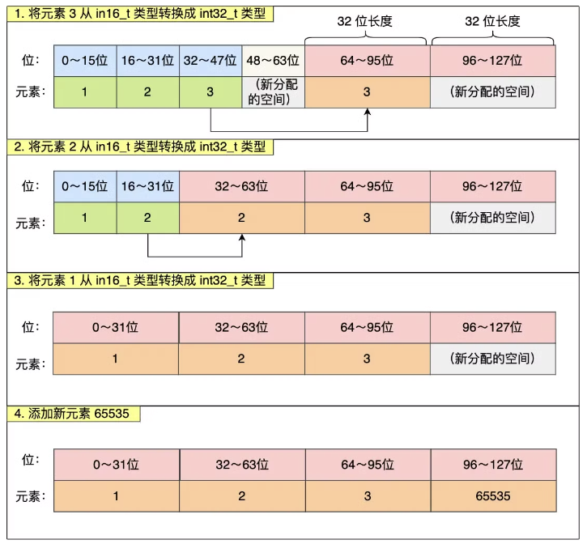
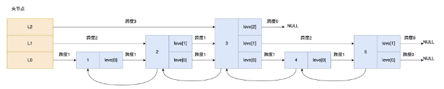

[TOC]


# Redis

## 1 使用场景

### 1.1 缓存穿透及其解决方法

**缓存穿透：**

- 正常使用缓存的流程：查redis可以命中则直接返回，没有命中则访问mysql后返回
- **缓存穿透** ：查询一个**不存在** 的数据，**mysql查询不到数据** 也不会放入缓存中，导致每次请求都会请求数据库

**解决方案1：缓存空数据** ，查询返回的数据为空，也把空结果进行缓存，例如 `{key:1, value:null}`

- 优点：简单
- 缺点：消耗内存，可能会发生不一致的问题


**解决方法2: 布隆过滤器** ，查询布隆过滤器，查询存在才会查询redis；否则直接判断不存在，这样可以在很大程度上避免不存在的key值冲击mysql。

- 注意关键点：**布隆过滤器** 需要提前用redis中的数据进行**预热**

布隆过滤器的底层：

- bitmap：相当于是一个以bit位位单位的数组，数组中每个单元只能存储二进制数0或1
- **存储数据** ：id为1的数据，通过多个hash函数获取hash值，根据hash计算数组对应位置改为1
- **查询数据** ：使用相同hash函数获取hash值，判断对应位置是否都为1

布隆过滤器的优缺点：

- 缺点1：误判，会有一定几率将不存在的数据放过布隆过滤器；数组越大误判率越小，同时带来了更多的内存消耗，可以设置误判率。
- 缺点2: 实现比较复杂
- 优点：内存占用比较少，没有多余的key

**布隆过滤器的工作原理：**


布隆过滤器由**「初始值都为 0 的位图数组」** 和**「 N 个哈希函数」** 两部分组成。

当我们在写入数据库数据时，在布隆过滤器里做个标记，这样下次查询数据是否在数据库时，只需要查询布隆过滤器，如果查询到数据没有被标记，说明不在数据库中。

**布隆过滤器会通过 3 个操作完成标记：**

- 第一步，使用 N 个哈希函数分别对数据做哈希计算，得到 N 个哈希值；
- 第二步，将第一步得到的 N 个哈希值对位图数组的长度取模，得到每个哈希值在位图数组的对应位置。
- 第三步，将每个哈希值在位图数组的对应位置的值设置为 1；

**举个例子，假设有一个位图数组长度为 8，哈希函数 3 个的布隆过滤器：**

1. 在数据库写入数据 x 后，把数据 x 标记在布隆过滤器时，数据 x 会被 3 个哈希函数分别计算出 3 个哈希值，然后在对这 3 个哈希值对 8 取模，假设取模的结果为 1、4、6，然后把位图数组的第 1、4、6 位置的值设置为 1。
2. 当应用要查询数据 x 是否数据库时，通过布隆过滤器只要查到位图数组的第 1、4、6 位置的值是否全为 1，只要有一个为 0，就认为数据 x 不在数据库中。
3. 布隆过滤器由于是基于哈希函数实现查找的，高效查找的同时存在哈希冲突的可能性，比如数据 x 和数据 y 可能都落在第 1、4、6 位置，而事实上，可能数据库中并不存在数据 y，存在误判的情况。
4. 所以，查询布隆过滤器说数据存在，并不一定证明数据库中存在这个数据
5. 但是查询到数据不存在，数据库中一定就不存在这个数据。


### 1.2 缓存击穿及其解决办法


**缓存击穿：**

- 给某一个key设置了过期时间，当key过期的时候，恰好这个时间点对key有大量的并发请求过来
- 并发请求瞬间把db数据库压垮


**解决方法1: 互斥锁，**使用分布式锁来避免多个线程同时 查询数据库-重建缓存数据

- 第一个获取互斥锁成功，查询数据库重建缓存数据
- 其他线程获取互斥锁失败后，休眠一会儿再重试，重试后说不定就命中缓存了
- 优缺点：
  - 优点为保证数据的**强一致性**
  - 缺点为线程需要等待，性能比较差

**解决方法2: 逻辑过期，**使用过期时间字段（expire），不设置过期时间

- 线程1 - 查询缓存后发现逻辑时间已经过期 → 获取互斥锁准备缓存重建 →
  - **新开启**线程2：查询数据库重建缓存 → 重置过期时间 → 释放锁
  - 线程1 直接返回**过期数据**
- 线程3 - 获取锁失败之后直接返回过期时间
- 线程4 - 命中缓存，并且没有过期
- 优缺点：
  - 有点为保证了**高可用性**，线程无需等待，性能比较优秀
  - 缺点为数据不一定是正常数据

[Redis_嗯mua.的博客-CSDN博客](https://blog.csdn.net/decade_faiz/category_12005580.html)


### 1.3 缓存雪崩及其解决方案


**缓存雪崩：**

- **同一时间大量缓存key同时失效**，导致大量请求到达数据库，给数据库带来了巨大压力
- **redis服务宕机**，导致大量请求到达数据库，给数据库带来了巨大压力

**缓存雪崩的解决方案：**

- 解决方案1: 针对大量key过期，肯定和过期时间有关
  - 给不同的 key 设置不同的**过期时间**，添加随机值，防止集体失效
- 解决方案2: 针对 redis 服务宕机
  - 利用 redis 集群提高服务的**可用性**，比如哨兵模式、集群模式
- 解决方案3: 给缓存业务添加降级限流策略、熔断降级
  - nginx、springCloudGateway 添加限流，可以避免有大量的请求同时打到数据库上
  - 降级可以作为系统的保底策略，用于穿透、击穿、雪崩
- 解决方案4: 给业务添加多级缓存，避免redis缓存失效后没有第二屏障
  - 例如本地缓存 Guava 或者 Caffeine


### 1.4 Redis + Mysql 缓存双写一致性

水务项目，允许延迟一致性

回答题之前，一定要介绍自己的业务背景，因为不同的业务背景可以采用不同的双写一致性：

- 一致性要求高
- 允许延迟一致性

**一致性要求比较高的解决方案： 延迟双删 + 读写锁**

**双写一致性**：当修改了数据库的数据时，同时更新缓存的数据，缓存的数据要和数据库的数据保持一致，常规的双写一致性如下：


- **读操作**：命中缓存，直接返回；缓存没有命中数据库，则写入缓存，设定超时时间
- 写操作：延迟双删
  - 删除缓存 → 修改数据库 → 延迟之后再删除一次缓存

**讨论：先删除缓还是先删除数据库？ 答案：都会有问题，分析如下：**

- 先删除缓存，再删除数据库
  - 线程1 - 删除缓存                                                                           -  更新数据库
  - 线程2                     -   未命中缓存，查询数据库   - 写入缓存
  - 出现了**脏数据**的问题
- 先操作数据库，再删除缓存（出现问题的概率比较小）
  - 线程1 - 查询缓存未命中                                                       - 写入缓存
  - 线程2 -                                -  更新数据库  -  删除缓存
  - 还是会出现**脏数据**的问题


**讨论：为什么要删除两次缓存呢？**

- 降低脏数据的出现概率

**讨论：为什么要进行延迟删除？**

- 数据库一般是主从模式，读写分离，所以需要延时双删，使数据同步到从节点后再删除

但是延时双删时间不好控制，还是会有脏数据的风险，做不到强一致性的数据同步。

**讨论：如何保证数据的强一致性呢？答案：分布式锁**

- 改进分布式锁读写性能低的问题，根据redis读多写少的特性，使用读写锁实现控制
  - 读操作代码逻辑中：获取读锁 + 使用读锁进行操作 try-finally
  - 写操作逻辑上：使用写锁 + 使用写锁进行操作 try-finally
  - 优点：强一致性 缺点：性能比较低

**允许延迟一致性的解决方案：双写一致  MQ + 双写一致 Canal**  (常用)


**双写一致：保证数据的最终一致性**

- 修改数据写入Mysql，并发布到MQ中
- redis监听MQ消息，并根据监听到的消息删除缓存，如果删除缓存失败可以定时重试，直到消费掉消息队列的任务
- 需要保证MQ的一致性


**基于Cannel的异步通知保证一致性：**

- 数据写入mysql中，会引起binlog发生变化
- **canal中间件** 监听binlog发生的变化，通知数据变更情况到cache-service
- 利用redis进行缓存的更新

**Redis与Mysql一致性结论：**

- **实时一致性方案** ：采用“先写 MySQL，再删除 Redis”的策略，这种情况虽然也会存在两者不一致，但是需要满足的条件有点苛刻，所以是满足实时性条件下，能尽量满足一致性的最优解。
- **最终一致性方案** ：采用“先写 MySQL，通过 Binlog，异步更新 Redis”，可以通过 Binlog，结合消息队列异步更新 Redis，是最终一致性的最优解。


### 1.5 - 1  Redis 数据持久化 - RDB

Redis持久化有两种方式：RDB和AOF，**Redis 中默认会开启 RDB 快照，但是默认不会开启写 AOF 文件。**  这两种技术都会用各用一个日志文件来记录信息，但是记录的内容是不同的。

- AOF 文件的内容是操作命令；每执行一条写操作命令，就把该命令以追加的方式写入到一个文件里；
- RDB 文件的内容是二进制数据；将某一时刻的内存数据，以二进制的方式写入磁盘。

**RDB 持久化：**

**RDB 全称为 Redis Database Backup file（Redis 数据备份文件）** ， 也叫Redis数据快照，简单来说就是把内存中的所有记录记录到磁盘中。当 Redis 实例故障重启后，**从磁盘读取快照文件，恢复数据**。

- 人工操作RDB - 主动备份
  - save : 由Redis主进程来执行rdb，会阻塞所有命令
  - bgsave : 由Redis开启子进程来执行rdb，避免主进程受到影响
- 默认配置，Redis内部有触发RDB，可以在 redis.conf 文件中找到，格式如下
  - save 900 1. # 900 秒内，如果至少有 1 个key被修改，则执行 bgsave
  - save 300 10 # 300 秒内，如果至少有 10 个key被修改，则执行 bgsave


**RDB的执行原理，关于bgsave：**

bgsave开始时会fork主进程得到子进程，子进程共享主进程的内存数据，完成fork之后读取内存数据并写入RDB文件。

- 在linux系统中，数据A和数据B实际是存放在**物理内存**中的，但是，对于用户线程不允许直接访问物理内存
- 所以，主进程中采用的是虚拟内存地址，其假设数据A和数据B都存在虚拟内存地址中，并且维护一个**页表**来记录**虚拟地址与物理地址的映射关系**。这样就可以完成对物理内存的读写。
- 执行 bgsave 时，内部会克隆一个子进程，其将主进程中的页表拷贝到子进程中。之后，子进程操作相同的**虚拟内存地址**，就可以映射到相同的**物理内存**中。
- 所以，子进程与主进程共享页表数据，将不同的数据**写入到新的RDB文件替换掉旧的RDB文件**。

**RDB方式的缺点：**

- 丢失数据较多：
  - 执行快照是一个比较重的操作，如果频率太频繁，可能会对 Redis 性能产生影响
  - 如果频率太低，服务器故障时，丢失的数据会更多
  - 通常可能设置至少 5 分钟才保存一次快照，这时如果 Redis 出现宕机等情况，则意味着最多可能丢失 5 分钟数据。
- 数据并不是最新的数据：
  - bgsave 快照过程中，如果主线程修改了共享数据，发生了写时复制后，RDB 快照保存的是原本的内存数据
  - 而主线程刚修改的数据，是没办法在这一时间写入 RDB 文件的，只能交由下一次的 bgsave 快照
- 极端情况：
  - 主进程修改了共享内存，当前被修改的数据的物理内存就会被复制一份
  - 如果所有的共享内存都被修改，则此时的内存占用是原先的 2 倍

**RDB如何解决读写冲突和脏数据：**


- 操作系统 fork 时采用的 copy-on-write 技术：
  - 当主进程执行读操作时，会访问共享内存
  - 当主进程执行写操作时，会拷贝一份数据放在新的内存地址，执行写操作（之后读也会读这个新地址）


### 1.5 - 2 ：Redis 数据持久化 - AOF

**其次是 AOF 持久化：**


AOF全称为 Append Only File（追加文件），Redis处理的每一个**写命令**都会记录在AOF文件中，可以看作是**命令日志文件**。

- AOF默认是关闭的，需要修改redis.conf来开启AOF
  - appendonly yes 是否开启AOF功能
  - appendfilename “appendonly.aof”  AOF文件的名称
- AOF命令记录的频率也可以通过 redis.conf 来修改
  - appendfsync always 表示每次执行一次写命令，立即记录到AOF文件
    - **同步刷盘** 
    - 可靠性高，几乎不丢失数据
    - 性能影响比较大
  - appendfsync everysec 写命令执行完先放入 AOF 缓冲区中，每隔1秒将缓冲区数据写入到AOF文件中，是默认方案
    - 每秒刷盘
    - 性能适中
    - 最多丢失1秒数据
  - appendfsync no 写命令执行完先放入 AOF 缓冲区中，操作系统决定何时将缓冲区内容写回磁盘
    - 操作系统控制
    - 性能最好
    - 可靠性较弱，可能丢失大量数据


**Redis 先执行命令还是先写 AOF 日志：**

Redis 是先执行写操作命令后，才将该命令记录到 AOF 日志里的，这么做其实有两个好处。

- 避免额外的检查开销：
  - 先将写操作命令记录到 AOF 日志里，再执行该命令的话，如果当前的命令语法有问题，那么如果不进行命令语法检查，该错误的命令记录到 AOF 日志里后，Redis 在使用日志恢复数据时，就可能会出错。
  - 而如果进行语法检查，又回造成额外的性能开销
- 不会阻塞当前写操作命令的执行：
  - 当写操作命令执行成功后，才会将命令记录到 AOF 日志
  - 可以优先完成用户的当前命令

**AOF缺点：**

- **恢复太慢**： 因为 Redis 执行命令由单线程负责的，而 AOF 日志恢复数据的方式是顺序执行日志里的每一条命令，如果 AOF 日志很大，这个「重放」的过程就会很慢了。
- **文件过大**： 因为AOF是**记录命令**，所以AOF文件会比RDB文件大得多。
- **数据冗余：** AOF 会记录对同一个 key 的多次写操作，但只有最后一次写操作才有意义。
  - 通过 bgrewriteaof命令，可以让AOF文件执行**重写功能**，用最少的命令到达相同的效果。
- **丢失风险**： 执行写操作命令和记录日志是两个过程，那当 Redis 在还没来得及将命令写入到硬盘时，服务器发生宕机了，这个数据就会有丢失的风险。
- **阻塞下一条命令**： 由于写操作命令执行成功后才记录到 AOF 日志，所以不会阻塞当前写操作命令的执行，但是可能会给「下一个」命令带来阻塞风险

**AOF 中的三种写回策略：**


如果在将日志内容写入到硬盘时，服务器的硬盘的 I/O 压力太大，就会导致写硬盘的速度很慢，进而阻塞住了，也就会导致后续的命令无法执行。

认真分析一下，其实这两个风险都有一个共性，都跟「 AOF 日志写回硬盘的时机」有关。

我先来具体说说：**写操作 = 追加到 aof_buf + 通过 write() 写入内核缓冲区**

1. Redis 执行完写操作命令后，会将命令追加到 `server.aof_buf` 缓冲区；然后通过 write() 系统调用，将 aof_buf 缓冲区的数据写入到 AOF 文件，此时数据并没有写入到硬盘，而是拷贝到了内核缓冲区 page cache，等待内核将数据写入硬盘；
2. 具体内核缓冲区的数据什么时候写入到硬盘，由内核决定。

**Redis 提供了 3 种写回硬盘的策略，控制的就是上面说的第三步的过程：**

- Always，每次写操作命令执行完后，同步将 AOF 日志数据写回硬盘
  - 最大程度保证数据不丢失，
  - 每执行一条写操作命令就同步将 AOF 内容写回硬盘，会影响主进程的性能
- Everysec，然后每隔一秒将缓冲区里的内容写回到硬盘
  - 避免了 Always 策略的性能开销
  - 如果上一秒的写操作命令日志没有写回到硬盘，发生了宕机，这一秒内的数据自然也会丢失
- No，操作系统决定何时将缓冲区内容写回硬盘
  - 性能较好
  - 一旦服务器宕机，就会丢失不定数量的数据

**深入到源码后**，你就会发现这三种策略只是在控制 `fsync()` 函数的调用时机。

如果想要应用程序向文件写入数据后，能立马将数据同步到硬盘，就可以调用 `fsync()` 函数，这样内核就会将内核缓冲区的数据直接写入到硬盘，等到硬盘写操作完成后，该函数才会返回。

- Always 策略就是每次写入 AOF 文件数据后，就执行 fsync() 函数；
- Everysec 策略就会创建一个异步任务来执行 fsync() 函数；
- No 策略就是永不执行 fsync() 函数;

------

**AOF 的重写机制：**

Redis也会在触发阈值的时候自动去重写AOF文件，阈值可以在 redis.conf 中配置：

- `auto-aof-rewrite-percentage 100` :  AOF比上次文件，增长超过多少百分比触发重写
- `auto-aof-rewrite-min-size 64mb` ：AOF文件体积**最小**多大以上才会触发重写

AOF 重写机制是在重写时，**读取当前数据库中的所有键值对**，然后将每一个键值对用一条命令记录到「新的 AOF 文件」，等到全部记录完后，就将新的 AOF 文件替换掉现有的 AOF 文件。

- 在没有使用重写机制前，假设前后执行了「*set name xiaolin*」和「*set name xiaolincoding*」这两个命令的话，就会将这两个命令记录到 AOF 文件
- 在使用重写机制后，就会读取 name 最新的 value（键值对） ，然后用一条 「set name xiaolincoding」命令记录到新的 AOF 文件
- 重写工作完成后，就会将新的 AOF 文件覆盖现有的 AOF 文件，这就相当于压缩了 AOF 文件

**为什么不直接复用现有 AOF，而是采用覆盖的方式：**

因为如果 AOF 重写过程中失败了，现有的 AOF 文件就会造成污染，可能无法用于恢复使用。

所以 AOF 重写过程，先重写到新的 AOF 文件，重写失败的话，就直接删除这个文件就好，不会对现有的 AOF 文件造成影响。

**AOF 的后台重写机制：为什么是后台执行？又为什么使用子进程？**


AOF 重写的过程其实是很耗时的，所以重写的操作不能放在主进程里

所以，Redis 的**重写 AOF 过程是由后台子进程  bgrewriteaof 来完成的** ，这么做可以达到两个好处：

- 子进程进行 AOF 重写期间，主进程可以继续处理命令请求，从而避免阻塞主进程；
- 子进程带有主进程的数据副本
  - 使用子进程而不是线程，因为如果是使用线程，多线程之间会共享内存，那么在修改共享内存数据的时候，需要通过加锁来保证数据的安全，而这样就会降低性能。
  - 而使用子进程，创建子进程时，父子进程是共享内存数据的，不过这个共享的内存只能以只读的方式，而当父子进程任意一方修改了该共享内存，就会发生「写时复制」，于是父子进程就有了独立的数据副本，就不用加锁来保证数据安全。
- 当发生写时复制时：
  - 只会复制主进程修改的物理内存数据，没修改物理内存还是与子进程共享的
  - 写一个 big-key 时，复制的物理内存数据的过程就会比较耗时，有阻塞主进程的风险

**AOF 中重写导致的不一致的问题：**


重写 AOF 日志过程中，如果主进程修改了已经存在 key-value，此时这个 key-value 数据在子进程的内存数据就跟主进程的内存数据不一致了

- Redis 设置了一个 **AOF 重写缓冲区**，这个缓冲区在创建 bgrewriteaof 子进程之后开始使用。
- 重写 AOF 期间，当 Redis 执行完一个写命令之后，它会**同时将这个写命令写入到 「AOF 缓冲区」和 「AOF 重写缓冲区」**。

也就是说，在 bgrewriteaof 子进程执行 AOF 重写期间，主进程需要执行以下三个工作:

1. 执行客户端发来的命令；
2. 将执行后的写命令追加到 「AOF 缓冲区」；
3. 将执行后的写命令追加到 「AOF 重写缓冲区」；

当子进程完成 AOF 重写工作后，会向主进程发送一条信号，**信号是进程间通讯的一种方式**，且是异步的。主进程收到该信号后，会调用一个信号处理函数，该函数主要做以下工作：

1. **将 AOF 重写缓冲区中的所有内容追加到新的 AOF 的文件中**，使得新旧两个 AOF 文件所保存的数据库状态一致；
2. 新的 AOF 的文件进行改名，覆盖现有的 AOF 文件。

在整个 AOF 后台重写过程中，除了发生**写时复制**会对主进程造成阻塞，还有**信号处理函数**执行时也会对主进程造成阻塞，在其他时候，AOF 后台重写都不会阻塞主进程。


### 1.5 - 3：RDB 和 AOF 混合使用

尽管 RDB 比 AOF 的数据恢复速度快，但是快照的频率不好把握：

- 如果频率太低，两次快照间一旦服务器发生宕机，就可能会比较多的数据丢失；
- 如果频率太高，频繁写入磁盘和创建子进程会带来额外的性能开销。

**混合使用 AOF 日志和内存快照**，也叫混合持久化，不仅有 RDB 恢复速度快的优点和，又有 AOF 丢失数据少的优点。

开启回合持久化功能，可以在 Redis 配置文件中将下面配置改成 yes：

```java
aof-use-rdb-preamble yes
```

混合持久化工作在 **AOF 日志重写过程：**

- 当开启了混合持久化时，在 AOF 重写日志时，`fork` 出来的重写子进程会先将与主线程共享的内存数据以 RDB 方式写入到 AOF 文件
- 然后主线程处理的操作命令会被记录在重写缓冲区里，重写缓冲区里的增量命令会以 AOF 方式写入到 AOF 文件
- 写入完成后通知主进程将新的含有 RDB 格式和 AOF 格式的 AOF 文件替换旧的的 AOF 文件

也就是说，使用了混合持久化，AOF 文件的**前半部分是 RDB 格式的全量数据，后半部分是 AOF 格式的增量数据**。使用 RDB 和 AOF 的好处：

- 重启 Redis 加载数据的时候，由于前半部分是 RDB 内容，这样加载的时候速度会很快。
- 加载后半部分的 AOF 内容，可以使得数据更少的丢失。

**AOF 和 RDB 持久化的对比（常考）：**

- RDB 文件存储的内容是经过压缩的二进制数据，文件很小；AOF 文件存储的是每一次写命令，类似于 MySQL 的 binlog 日志，通常会比 RDB 文件大很多。因此，传输 RDB 文件更节省带宽，速度也更快。
- 使用 RDB 文件恢复数据，直接解析还原数据即可，不需要一条一条地执行命令，速度非常快。而 AOF 则需要依次执行每个写命令，速度非常慢。也就是说，与 AOF 相比，恢复大数据集的时候，RDB 速度更快。
- AOF 需要选择合适的刷盘策略，如果刷盘策略选择不当，会影响 Redis 运行。并且，根据所使用的刷盘策略，AOF 的速度可能会慢于 RDB。

**AOF与RDB的对比如上，需要牢记！实际开发中结合两者来使用。**

面试：如何用的？回答：结合两者来使用的。


### 1.5 - 4: Redis 中的大 Key 对持久化呀有什么影响

**大 Key 对于 AOF 日志的影响：**

Redis 提供了 3 种 AOF 日志写回硬盘的策略，分别是：

- Always 策略就是每次写入 AOF 文件数据后，就执行 fsync() 函数；
- Everysec 策略就会创建一个异步任务来执行 fsync() 函数；
- No 策略就是永不执行 fsync() 函数;

如果想要应用程序向文件写入数据后，能立马将数据同步到硬盘，就可以调用 fsync() 函数，这样内核就会将内核缓冲区的数据直接写入到硬盘，**等到硬盘写操作完成后**，该函数才会返回。

- Always 策略：
  - 如果写入是一个大 Key，主线程在执行 fsync() 函数的时候，阻塞的时间会比较久，因为当写入的数据量很大的时候，数据同步到硬盘这个过程是很耗时的。
- Everysec 策略：
  - 由于是异步执行 fsync() 函数，大 Key 持久化的过程（数据同步磁盘）不会影响主线程。
- No 策略的时候
  - 由于永不执行 fsync() 函数，所以大 Key 持久化的过程不会影响主线程。

**大 Key 对于 AOF 重写以及RDB的影响：也就是对写时复制 COW 的影响**

- AOF 日志写入了很多的大 Key，AOF 日志文件的大小会很大，很快就会触发 **AOF 重写机制**
- AOF 重写机制和 RDB 快照（bgsave 命令）的过程，都会分别通过  fork() 函数创建一个子进程来处理任务。
  - 第一点 fork复制阻塞：
    - Redis 存在越来越多的大 Key，那么 Redis 就会占用很多内存，对应的页表就会越大；如果页表很大，执行 fork 函数的时候就会发生阻塞现象。
    - fork 函数是由 Redis 主线程调用的，如果 fork 函数发生阻塞，那么意味着就会阻塞 Redis 主线程，那么就会阻塞处理用户命令
  - 第二点 写时复制耗时：
    - 父进程对共享内存中的大 Key 进行了修改，那么内核就会发生写时复制，会把物理内存复制一份
    - 由于大 Key 占用的物理内存是比较大的，那么在复制物理内存这一过程中，也是比较耗时的，于是父进程（主线程）就会发生阻塞

**如果 fork 耗时很大，比如超过1秒，则需要做出优化调整：**

- 单个实例的内存占用控制在 10 GB 以下，这样 fork 函数就能很快返回。
- 如果 Redis 只是当作纯缓存使用，不关心 Redis 数据安全性问题，可以考虑关闭 AOF 和 AOF 重写，这样就不会调用 fork 函数了。
- 在主从架构中，要适当调大 repl-backlog-size，避免因为 repl_backlog_buffer 不够大，导致主节点频繁地使用全量同步的方式，全量同步的时候，是会创建 RDB 文件的，也就是会调用 fork 函数。

**如果写时复制耗时，则需要作出如下优化：**

Linux 内核从 2.6.38 开始支持内存大页机制，该机制支持 2MB 大小的内存页分配，而常规的内存页分配是按 4KB 的粒度来执行的。

如果采用了内存大页，那么即使客户端请求只修改 100B 的数据，在发生写时复制后，Redis 也需要拷贝 2MB 的大页。相反，如果是常规内存页机制，只用拷贝 4KB。

所以，可直接关闭内存大页：

```java
echo never >  /sys/kernel/mm/transparent_hugepage/enabled
```

**大 Key 除了会影响持久化之外，还会有以下的影响：**

- 客户端超时阻塞：
  - 由于 Redis 执行命令是单线程处理，然后在操作大 key 时会比较耗时，那么就会阻塞 Redis，从客户端这一视角看，就是很久很久都没有响应。
- 引发网络阻塞：
  - 每次获取大 key 产生的网络流量较大，如果一个 key 的大小是 1 MB，每秒访问量为 1000，那么每秒会产生 1000MB 的流量，这对于普通千兆网卡的服务器来说是灾难性的。
- 内存分布不均：
  - 集群模型在 slot 分片均匀情况下，会出现数据和查询倾斜情况
  - 部分有大 key 的 Redis 节点占用内存多，QPS 也会比较大

**如何避免 Redis 中的大 Key：设计阶段 + 定期检查删除**

最好在设计阶段，就把大 key 拆分成一个一个小 key。

定时检查 Redis 是否存在大 key ，如果该大 key 是可以删除的，不要使用 DEL 命令删除，因为该命令删除过程会阻塞主线程，而是用 **unlink** 命令（Redis 4.0+）删除大 key，因为该命令的删除过程是异步的，不会阻塞主线程。


### 1.6 Redis数据过期策略


**面试：假如Redis的数据过期之后，会立即进行删除吗？**

数据过期策略：Redis对数据设置的数据有效时间，数据过期之后，就需要将数据从内存中删除掉。但是**可以按照不同的规则进行删除**，这种删除规则就被称之为数据的过期策略。

- **定时删除：**在设置 key 的过期时间时，同时创建一个定时事件，当时间到达时，由事件处理器自动执行 key 的删除操作
  - 优点：可以保证过期 key 会被尽快删除，也就是内存可以被尽快地释放。因此，定时删除对内存是最友好的。
  - 缺点：在过期 key 比较多的情况下，删除过期 key 可能会占用相当一部分 CPU 时间，会对服务器的响应时间和吞吐量造成影响。
- 惰性删除：**需要访问key时，再**检查是否过期；过期则将其删掉，否则返回该key对应的数据
  - 优点：**对CPU比较友好**，只有在使用该key时才会过期检查，不用浪费时间检查用不到的key
  - 缺点：**对内存不友好**，如果一个key已经过期了，但是一直没有使用，该key就会一直存在内存中，内存永远不会释放
- **定期删除：**每隔一段时间，就对一些key进行检查，删除里面的key（取出key进行随机检查，并删除其中的过期key，不会全部进行检查），随机选择 20 个 key 判断是否过期
  - SLOW模式：定时任务，执行频率为10hz（每秒执行十次，间隔100ms），每次不超过25ms，通过redis.conf可以调整该次数
  - FAST模式：执行频率不固定，但是比较随机，两次间隔不低于2ms，每次耗时不超过1ms
  - 优点：可以通过限制删除操作执行时长和频率**减少对CPU的影响**，**有效释放内存**
  - 缺点：难以确定删除操作执行的时长和频率
    - 执行的太频繁，定期删除策略变得和定时删除策略一样，对CPU不友好
    - 执行的太少，那又和惰性删除一样了，过期 key 占用的内存不会及时得到释放

Redis过期策略：Redis采用 **惰性删除 + 定期删除** 两种策略进行配合使用

**Redis 中如何判定 key 已经过期**

每当我们对一个 key 设置了过期时间时，Redis 会把该 key 带上过期时间存储到一个**过期字典**（expires dict）中，也就是说「过期字典」保存了数据库中所有 key 的过期时间。

过期字典数据结构结构如下：

- 过期字典的 key 是一个指针，指向某个键对象；
- 过期字典的 value 是一个 long long 类型的整数，这个整数保存了 key 的过期时间；

字典实际上是哈希表，哈希表的最大好处就是让我们可以用 O(1) 的时间复杂度来快速查找。当我们查询一个 key 时，Redis 首先检查该 key 是否存在于过期字典中：

- 如果不在，则正常读取键值；
- 如果存在，则会获取该 key 的过期时间
  - 然后与当前系统时间进行比对，如果比系统时间大，那就没有过期
  - 否则判定该 key 已过期

**讲一讲 Redis 中的定期删除：**

如何确定定期删除的间隔时间：

- 在 Redis 中，默认**每秒进行 10 次**过期检查一次数据库，此配置可通过 Redis 的配置文件 redis.conf 进行配置，配置键为 hz 它的默认值是 hz 10。
- 特别强调下，每次检查数据库并不是遍历过期字典中的所有 key，而是从数据库中随机抽取一定数量的 key 进行过期检查。

如何确定随机抽查的数量：

- 定期删除的实现在 expire.c 文件下的 `activeExpireCycle` 函数中，其中随机抽查的数量由 `ACTIVE_EXPIRE_CYCLE_LOOKUPS_PER_LOOP` 定义的，它是写死在代码中的，数值是 20

Redis 的定期删除的流程：

1. 从**过期字典中随机抽取 20 个 key**；
2. 检查这 20 个 key 是否过期，并删除已过期的 key；
3. 如果本轮检查的已过期 key 的数量，超过 5 个（20/4），也就是「已过期 key 的数量」占比「随机抽取 key 的数量」**大于 25%**，则继续重复步骤 1；如果已过期的 key 比例小于 25%，则停止继续删除过期 key，然后等待下一轮再检查。

可以看到，定期删除是一个循环的流程。那 Redis 为了保证定期删除不会出现循环过度，导致线程卡死现象，为此增加了定期删除循环流程的**时间上限**，默认不会超过 25ms。


### 1.7 Redis数据淘汰策略

数据淘汰策略主要针对于，**当Redis内存不够时**，此时继续向Redis中添加新的key，那么Redis就会**按照某种规则将内存中的数据删除掉**，这种数据删除规则称为数据淘汰策略。

**Redis中支持8种不同策略来选择要删除的key：**

- 默认配置 **`noeviction`**：不淘汰任何key，内存满的时候不允许写入新数据，默认就是这种策略


**主要理解和准备手撕两种策略：**

- LUR策略 Least Recently Used：最近最少使用策略，用当前时间减去最后一次访问时间，值越大则淘汰优先级最高
- LFU策略 Least Frequently Used 最少频率使用策略，统计每个key的访问频率，值越小则淘汰优先级越高

**数据淘汰策略-实用建议：**

- **有明显的冷热数据区分**，优先使用 `allkeys-lru`：充分利用 LRU 算法的优势，把最近最常访问的数据留在缓存中。
- **没有明显的冷热数据区分**，可以使用`allkeys-random` ，随机选择进行淘汰。
- **业务中有置顶需求**，可以使用 `volatile-ttl` 策略，同时**置顶数据不设置过期时间**，这些数据就一直不会被删除，会淘汰其他设置了过期时间的数据。
- 业务中有短时高频访问的数据，可以使用lfu。

**数据淘汰相关的面试问题：**

- 数据库有1000万数据，Redis中只能缓存20w数据，如何保证Redis中数据都是热点数据？
  - 使用`allkeys-lru`：充分利用 LRU 算法的优势，把最近最常访问的数据留在缓存中。
- Redis内存用完了会发生什么？
  - 主要看设定的数据淘汰策略是什么，**如果使用默认的配置（不允许写入新数据），则会直接报错。**

**讲一讲 Redis 中的 LRU 算法：**

Redis 并没有使用传统方式实现 LRU 算法，因为传统的 LRU 算法存在两个问题：

- 需要用链表管理所有的缓存数据，这会带来额外的空间开销；
- 当有数据被访问时，需要在链表上把该数据移动到头端，如果有大量数据被访问，就会带来很多链表移动操作，会很耗时，进而会降低 Redis 缓存性能。

Redis 实现的是一种**近似 LRU 算法**，目的是为了更好的节约内存：

- 在 Redis 的对象结构体中添加一个额外的字段，用于记录此数据的最后一次访问时间。
- 当 Redis 进行内存淘汰时，**会使用随机采样的方式来淘汰数据，它是随机取 5 个值（此值可配置），然后淘汰最久没有使用的那个。**
- Redis 中 LRU 算法的优点：
  - 不用为所有的数据维护一个大链表，节省了空间占用
  - 不用在每次数据访问时都移动链表项，提升了缓存的性能
- LRU 算法的缺点：
  - **无法解决缓存污染问题**，比如应用一次读取了大量的数据，而这些数据只会被读取这一次，那么这些数据会留存在 Redis 缓存中很长一段时间，造成缓存污染。

**讲一讲 Redis 中的 LFU 算法：**


LFU 全称是 Least Frequently Used 翻译为**最近最不常用**，LFU 算法是根据数据访问次数来淘汰数据的，它的核心思想是“如果数据过去被访问多次，那么将来被访问的频率也更高”。

- ldt 是用来记录 key 的访问时间戳
- logc 是用来记录 key 的访问频次，它的值越小表示使用频率越低，越容易淘汰，每个新加入的 key 的logc 初始值为 5。

logc 并不是单纯的访问次数，而是访问频次（访问频率），因为 **logc 会随时间推移而衰减的：**

- 在每次 key 被访问时，会先对 logc 做一个衰减操作，衰减的值跟前后访问时间的差距有关系
- 如果上一次访问的时间与这一次访问的时间差距很大，那么衰减的值就越大
- 这样实现的 LFU 算法是根据**访问频率**来淘汰数据的，而不只是访问次数

对 logc 做完衰减操作后，就开始对 logc 进行增加操作，增加操作并不是单纯的 + 1，而是根据概率增加，如果 logc 越大的 key，它的 logc 就越难再增加。

所以，Redis 在访问 key 时，对于 logc 是这样变化的：

1. 先按照上次访问距离当前的时长，来对 logc 进行衰减；
2. 然后，再按照一定概率增加 logc 的值


### 1.8 Redis分布式锁 - 使用场景


**抢券场景，不使用使用分布式锁的逻辑：**

- 不使用分布式锁逻辑
  - 获取优惠券数量
  - 判断优惠券是否被抢完
  - 优惠券数量减1
  - 重新设置优惠券数量
- 出现的问题：并发线程之下的**超卖**现象


**为什么不可以使用本地 synchronized 锁？因为只适用于单体项目**

- **synchronized 锁可以将当前对象进行加锁**
- 加锁后访问多个线程同时访问当前对象则不会发生超卖现象
- 出现的问题：一个服务可能通过分布式的方式部署在多个服务器上

**分布式锁的抢券执行流程：**


### 1.9 Redis分布式锁 - 实现原理

**Redis实现分布式锁住要利用Redis的`setnx`命令，`setnx` 是 `set if not exist` 的简写。**

- 获取锁（NX表示互斥，EX表示超时时间，**保证原子性**）： `set lock value nx ex 10`
- 释放锁：`del key`

**如果不设置超时时间会造成什么问题：**

- 不设置超时时间或者不保证原子性都会有可能造成，**业务超时或宕机之后，造成死锁等待**
- 如何合理控制有效时长：
  - **why**：业务执行时间过长，还没执行完，锁自动释放了怎么办？
  - how：
    - 根据业务的执行时间预估（不太靠谱）
    - 给分布式锁进行续期，**开启另外一个线程，**对业务进行监控；如果业务还没有完成，则及时对锁的过期时间进行延长（Redisson中进行了实现）


**Redisson实现的分布式锁，执行流程是什么？**

- 对于第一个线程，假设可以成功获取锁：
  - **Redisson** 加锁成功之后，会开启一个业务相关的新线程Watch-Dog，每隔 `releaseTime/3` 对时间进行续期
  - **Redisson** 手动释放锁之后，通知对应线程的Watch-Dog，不需要继续监听，可以关闭
- 对于第二个线程，假设不能成功获取锁，则有重试机制
  - Redisson 通过while循环，不断尝试获取锁，尝试一定次数
  - 一定次数之后（阈值）不能获取锁的话，则代表获取锁失败，直接结束线程
  - 优势：**高并发情况下可以很大程度上增加Redis的并发性能，因为业务时间通常不会很久**

**具体实现代码：底层基于lua脚本完成**


**Redisson实现的分布式锁 - 可重入**

- 业务比较复杂时候，需要比较细的锁粒度，该方法就起到了作用
- 其内部使用 hash结构记录线程 id 和重入次数
  - key = 锁名，filed = 线程id，value = 持有锁的值
  - 只有同一个线程的情况下才可以实现锁重入


**Redisson实现的分布式锁-不能解决主从一致性**

- 假设现在有一个主节点，两个从节点
  - Java应用对主节点进行写操作，获取一个锁 `set lock thread 1 nx ex 10`
  - 依据 Redis 选择的哨兵模式，选择一个从节点当成主节点
  - 新的Java应用对新的主节点获取同样的锁，`set lock thread 1 nx ex 10`
  - 发生了两个线程同时持有同一把锁，没有互斥性，则可能出现脏数据

**Redission中的红锁可以实现集群的主从一致性：**

- 原理：不能只在一个Redis实例上创建锁，应该是**在多个redis实例上创建锁`(n/2+1)`**，才算创建成功，避免在一个redis实例上加锁。
- 缺点：实现复杂、性能差、运维繁琐

**项目中如何实现主从一致性的概念：**

- Redis服务器宕机的概率比较小，这是一个小概率事件
- Redis主要服从的是AP思想，优先保障**高可用性**和分区性质
- 如果必须保证**强一致性**，则建议使用zookeeper来解决问题

[Redisson 实现分布式锁原理分析](https://zhuanlan.zhihu.com/p/135864820)


### **1.10 如何设计秒杀场景处理高并发以及超卖现象？**

**方案1 : 在数据库层面解决**

- 数据库层面 - 悲观锁: 在事务中线程A通过 select * from goods for where goods_id=#{id} for update 语句给 goods_id 为 #{id} 的数据行上了锁。那么其他线程此时可以使用 select 语句读取数据，但是如果也使用 select for update 语句加锁，或者使用 update，delete 都会阻塞，直到线程A将事务提交（或者回滚），其他线程中的某个线程排在线程A后的线程才能获取到锁。
- 数据库层面 - 乐观锁: 更新数据库减库存的时候，进行库存限制条件 update goods set stock = stock - 1 where goods_id = ？ and stock >0 这种通过数据库加锁来解决的方案，性能不是很好，在高并发的情况下，还可能存在因为获取不到数据库连接或者因为超时等待而报错。

**方案2: 利用分布式锁**

同一个锁key，同一时间只能有一个客户端拿到锁，其他客户端会陷入无限的等待来尝试获取那个锁，只有获取到锁的客户端才能执行下面的业务逻辑。

这种方案的缺点是同一个商品在多用户同时下单的情况下，会基于分布式锁串行化处理，导致没法同时处理同一个商品的大量下单的请求。

**方案3: 利用redis的incr、decr的原子性 + 异步队列**

实现思路:

1. 在系统初始化时，将商品的库存数量加载到redis缓存中

2. 接收到秒杀请求时，在redis中进行预减库存（利用redis decr的原子性），当redis中的库存不足时，直接返回秒杀失败，否则继续进行第3步；

3. 将请求放入异步队列中，返回正在排队中；

4. 服务端异步队列将请求出队（哪些请求可以出队，可以根据业务来判定，比如：判断对应用户是否已经秒杀过对应商品，防止重复秒杀），出队成功的请求可以生成秒杀订单，减少数据库库存（在扣减库存的sql如下，返回秒杀订单详情）

   ```jsx
   update goods set stock = stock - 1 where goods_id = ? and stock >0
   ```

5. 用户在客户端申请秒杀请求后，进行 MQ 轮询，查看是否秒杀成功，秒杀成功则进入秒杀订单详情，否则秒杀失败

这种方案的缺点：由于是通过异步队列写入数据库中，可能存在数据不一致，其次引用多个组件复杂度比较高


## 2 其他面试题

### 2.1 Redis-集群 - 主从复制：全量复制、基于长连接的命令传播、增量复制


由于数据都是存储在一台服务器上，如果出事就完犊子了，比如：

- 如果服务器发生了宕机，由于数据恢复是需要点时间，那么这个期间是无法服务新的请求的；
- 如果这台服务器的硬盘出现了故障，可能数据就都丢失了。

要避免这种单点故障，最好的办法是将数据备份到其他服务器上，让这些服务器也可以对外提供服务，这样即使有一台服务器出现了故障，其他服务器依然可以继续提供服务。

**主从复制的目的 - 提升读并发能力，同时保证一致性**

单节点Redis的并发能力是有上限的，**要进一步提升Redis的并发能力**，就需要搭建主从集群，实现读写分离。

- 主节点为master，主要负责写操作，当发生写操作时自动将写操作同步给从服务器
- 从节点为slave，主要负责读操作，接受主服务器同步过来写操作命令，然后执行这条命令
- 主节点接收到写操作之后，一定要将**主节点的数据同步到从节点**

**主从数据同步的流程以及原理（主从之间如何同步数据）**

**主从全量同步：用于节点新建，第一次同步，基于 SYNC 命令**


主从服务器的第一次同步的过程可以分为三个阶段：

- 第一阶段是建立链接、协商同步：
  - 执行了 replicaof 命令后，从服务器就会给主服务器发送 `psync` 命令，表示要进行数据同步，psync 命令包含两个参数，分别是**主服务器的 runID** 和**复制进度 offset**
  - runID，每个 Redis 服务器在启动时都会自动生产一个随机的 ID 来唯一标识自己
  - offset，表示复制的进度，第一次同步时，其值为 -1
- 第二阶段是主服务器同步数据给从服务器：
  - 主服务器会执行 bgsave 命令来**生成 RDB 文件**，然后把文件发送给从服务器
  - 从服务器收到 RDB 文件后，会先清空当前的数据，然后载入 RDB 文件
  - 那么为了保证主从服务器的数据一致性，主服务器在下面这三个时间间隙中将收到的写操作命令，写入到 replication buffer 缓冲区里：
    - 主服务器生成 RDB 文件期间；
    - 主服务器发送 RDB 文件给从服务器期间；
    - 「从服务器」加载 RDB 文件期间；
- 第三阶段是主服务器发送新写操作命令给从服务器：
  - 主服务器将 **replication buffer 缓冲区**里所记录的写操作命令发送给从服务器
  - 从服务器执行来自主服务器 replication buffer 缓冲区里发来的命令，这时主从服务器的数据就一致了

至此，主从服务器的第一次同步的工作就完成了。

**主从增量同步：主从之间断开连接之后不需要重新全量同步**


- 主从服务器在完成第一次同步后，就会基于长连接进行命令传播。可是，网络总是不按套路出牌的嘛，说延迟就延迟，说断开就断开。
- 如果主从服务器间的网络连接断开了，那么就无法进行命令传播了，这时从服务器的数据就没办法和主服务器保持一致了，客户端就可能从「从服务器」读到旧的数据。

那么问题来了，如果此时断开的网络，又恢复正常了，要怎么继续保证主从服务器的数据一致性呢？

- 所以，从 Redis 2.8 开始，网络断开又恢复后，从主从服务器会采用**增量复制**的方式继续同步，也就是只会把网络断开期间主服务器接收到的写操作命令，同步给从服务器。

主要有三个步骤：

1. 从服务器恢复网络后发送 psync 命令给主服务器， psync 命令里的 offset 参数不是 -1；
2. 主服务器收到该命令后，用 CONTINUE 响应从服务器接下来采用增量复制的方式同步数据；
3. 主服务将主从服务器断线期间，所执行的写命令发送给从服务器，然后从服务器执行这些命令。


那么关键的问题来了，**主服务器怎么知道要将哪些增量数据发送给从服务器呢？**

- repl_backlog_buffer，即复制积压缓冲区，是一个「环形」缓冲区，主从服务器断连后，从中找到差异的数据；
  - 缓冲区中保存着从生成RDB文件开始收到的所有写命令
  - 一个 master 只有一个复制积压缓冲区，所有 slave 共享一个缓冲区
- replication offset，标记上面那个缓冲区的同步进度，主从服务器都有各自的偏移量
  - 主服务器使用 master_repl_offset 来记录自己「*写*」到的位置
  - 从服务器使用 slave_repl_offset 来记录自己「*读*」到的位置。
  - 读取的数据还在 repl_backlog_buffer 缓冲区里，那么主服务器将采用**增量同步**的方式
  - 数据已经不存在 repl_backlog_buffer 缓冲区里，那么主服务器将采用**全量同步**的方式

**因此，为了避免在网络恢复时，主服务器频繁地使用全量同步的方式，我们应该调整下 repl_backlog_buffer 缓冲区大小，尽可能的大一些**

**保证主从同步中的其他措施：**

主从服务器在完成第一次同步后，双方之间就会维护一个 TCP 连接。

- 后续主服务器可以通过这个连接继续将写操作命令传播给从服务器，然后从服务器执行该命令，使得与主服务器的数据库状态相同。
- 而且这个连接是长连接的，目的是避免频繁的 TCP 连接和断开带来的性能开销

**从服务器过多会有什么影响**


主服务器是可以有多个从服务器的，如果从服务器数量非常多，而且都与主服务器进行全量同步的话，就会带来两个问题：

- 由于是通过 bgsave 命令来生成 RDB 文件的，那么主服务器就会忙于使用 fork() 创建子进程，如果主服务器的内存数据非大，在执行 fork() 函数时是会阻塞主线程的，从而使得 Redis 无法正常处理请求；
- 传输 RDB 文件会占用主服务器的网络带宽，会对主服务器响应命令请求产生影响。

Redis 从服务器可以有自己的从服务器，我们可以把拥有从服务器的从服务器当作经理角色，它不仅可以接收主服务器的同步数据，自己也可以同时作为主服务器的形式将数据同步给从服务器。

具体操作也很简单，将从新服务器当作从服务器的从服务器即可。

**怎么判断 Redis 某个节点是否正常工作：**

Redis 判断节点是否正常工作，基本都是通过互相的 ping-pong 心态检测机制，如果有一半以上的节点去 ping 一个节点的时候没有 pong 回应，集群就会认为这个节点挂掉了，会断开与这个节点的连接。

Redis 主从节点发送的心态间隔是不一样的，而且作用也有一点区别：

- Redis 主节点默认每隔 10 秒对从节点发送 ping 命令，判断从节点的存活性和连接状态，可通过参数repl-ping-slave-period控制发送频率。
- Redis 从节点每隔 1 秒发送 replconf ack{offset} 命令，给主节点上报自身当前的复制偏移量，目的是为了：
  - 实时监测主从节点网络状态；
  - 上报自身复制偏移量， 检查复制数据是否丢失， 如果从节点数据丢失， 再从主节点的复制缓冲区中拉取丢失数据。

**主从复制下，从节点点会主动删除过期数据吗？**

类似的问题：

- 主从复制下会读取到过期的数据吗
- 主从复制下如何避免读取到过期的数据

**客户端读取从节点会读取到过期数据吗？答案是：有可能，但要看具体情况**

1. 判断数据过期：
   1. Redis 3.2 版本之前，客户端从库并不会判断数据是否过期，有可能返回过期数据
   2. Redis 3.2 开始，客户端从库会先判断数据是否过期，如果过期的话，就会删除对应的数据并返回空值
2. 执行命令延迟：
   1. 采用 EXPIRE 设置过期时间的话，表示的是从执行这个命令开始往后 TTL 时间过期。如果从节点同步执行命令时由于网络等原因延迟的话，客户端就可能读取到过期的数据。
   2. 解决方案：考虑使用 EXPIREAT 制定绝对时间，但是主从节点的时钟需要保持一致。


### 2.2 - 1 ：Redis-集群 - 哨兵模式


在 Redis 的主从架构中，由于主从模式是读写分离的，如果主节点（master）挂了，那么将没有主节点来服务客户端的写操作请求，也没有主节点给从节点（slave）进行数据同步了。

如果要进行人工介入：

- 选择一个「从节点」切换为「主节点」，然后让其他从节点指向新的主节点
- 还需要通知上游那些连接 Redis 主节点的客户端，将其配置中的主节点 IP 地址更新为「新主节点」的 IP 地址

所以提出了哨兵机制：

- 其主要功能是实现**主从节点故障转移**。
- 它会监测主节点是否存活，如果发现主节点挂了，它就会选举一个从节点切换为主节点，并且把新主节点的相关信息通知给从节点和客户端。

**哨兵模式的目的 - 监控 + 选主 + 通知**

哨兵一般是由多台Redis节点构成的另一个集群（通常为3台Redis集群以上），功能如下

- **监控**：Sentinel 不断检查主节点和从节点是否按预期工作
- **选主**：如果master故障，Sentinel会选择一个新的从节点slave提升为主节点，当故障实例恢复之后也以新的主节点master为主
- **通知**：Sentinel充当Redis客户端的服务发现来源，当集群发生故障转移时，会将最新消息推送给Redis的客户端

**如何判断主节点真的故障了？**


哨兵会每隔 1 秒给所有主从节点发送 PING 命令，当主从节点收到 PING 命令后，会发送一个响应命令给哨兵，这样就可以判断它们是否在正常运行。

**服务状态监控：**Sentinel基于心跳机制检测服务状态，每隔1秒向集群的每个实例发送Ping命令

- 主观下线：
  - 如果某sentinel节点发现某实例未在规定时间响应，则认为该实例主观下线
- 客观下线：
  - 当一个哨兵判断主节点为「主观下线」后，就会向其他哨兵发起命令，其他哨兵收到这个命令后，就会根据自身和主节点的网络状况，做出赞成投票或者拒绝投票的响应
  - 如果超过指定数量（**quorum值** ）的sentinel都认为该实例主观下线，则该实例客观下线。**quorum值** 最好超过 Sentinel 实例数量的一半。

**为什么有了主观下线之后还需要客观下线：最少需要三台机器来部署哨兵集群**

- 有可能「主节点」其实并没有故障，只是因为主节点的系统压力比较大或者网络发送了拥塞，导致主节点没有在规定时间内响应哨兵的 PING 命令。
- 为了减少误判的情况，哨兵集群，通过多个哨兵节点一起判断，就可以就可以避免单个哨兵因为自身网络状况不好，而误判主节点下线的情况。
- 多个哨兵的网络同时不稳定的概率较小，由它们一起做决策，误判率也能降低。

**由哪个哨兵进行主从故障转移（共识算法）？ - 选举不止依靠 quorum 还需要半数以上赞成票**

需要在哨兵集群中选出一个 **leader** ，让 leader 来执行主从切换。选举 leader 的过程其实是一个投票的过程，在投票开始前，肯定得有个「候选者」。

- 哪个哨兵节点判断主节点为「客观下线」，这个哨兵节点就是候选者，所谓的候选者就是想当 Leader 的哨兵。
- 候选者会向其他哨兵发送命令，表明希望成为 Leader 来执行主从切换，并让所有其他哨兵对它进行投票。 当满足下面两个条件时，可以成为 leader：
  - 拿到**半数以上** 的赞成票
  - 拿到的票数同时还需要大于等于哨兵配置文件中的 **quorum** 值

**扩展：为什么哨兵节点至少要有三个？**

如果哨兵集群中只有 2 个哨兵节点，此时如果一个哨兵想要成功成为 Leader，必须获得 2 票，而不是 1 票。

- 如果哨兵集群中有个哨兵挂掉了，那么就只剩一个哨兵了，如果这个哨兵想要成为 Leader，这时票数就没办法达到 2 票，就无法成功成为 Leader，这时是无法进行主从节点切换的。
- 通常我们至少会配置 3 个哨兵节点。如果哨兵集群中有个哨兵挂掉了还是有机会达到 2 票的，不会导致无法进行主从节点切换。

当然，你要问，如果 3 个哨兵节点，挂了 2 个怎么办？这个时候得人为介入了，或者增加多一点哨兵节点。

- Redis 1 主 4 从，5 个哨兵，quorum 设置为 3，如果 2 个哨兵故障，当主节点宕机时，哨兵能否判断主节点“客观下线”？主从能否自动切换？
  - **哨兵集群可以判定主节点客观下线：** 有可能能拿到 3 张赞同票，达到 quorum 的值
  - **哨兵集群可以完成主从切换：** 可以拿到半数以上（5/2+1=3）的票，也达到了 quorum 值，满足了选举 Leader 的两个条件
- 如果 quorum 设置为 2，并且如果有 3 个哨兵故障的话。此时哨兵集群还是可以判定主节点为“客观下线”，但是哨兵不能完成主从切换
- 如果 quorum 设置为 3，并且如果有 3 个哨兵故障的话，哨兵集群即不能判定主节点为“客观下线”，也不能完成主从切换

**所以，quorum 的值建议设置为哨兵个数的二分之一加 1，例如 3 个哨兵就设置 2，5 个哨兵设置为 3，而且哨兵节点的数量应该是奇数。**

**主从故障转移的过程是怎样的？**

**在哨兵集群中通过投票的方式，选举出了哨兵 leader 后，就可以进行主从故障转移的过程：**

- 第一步：选举出新节点
  - 在已下线主节点属下的所有「从节点」里面，挑选出一个从节点，并将其转换为主节点。
- 第二步：将从节点指向新主节点
  - 让已下线主节点属下的所有「从节点」修改复制目标，修改为复制「新主节点」；
- 第三步：通知客户的主节点已更换
  - 将新主节点的 IP 地址和信息，通过「发布者/订阅者机制」通知给客户端；
  - 主从切换完成后，哨兵就会向 `+switch-master` 频道发布新主节点的 IP 地址和端口的消息，这个时候客户端用新主节点的 IP 地址和端口进行通信
- 第四步：将旧主点变为从节点
  - 继续监视旧主节点，当这个旧主节点重新上线时，将它设置为新主节点的从节点；

**哨兵选主规则：slave优先级 + 复制进度 + ID 号**

- 首先判断主从节点断开时间长短，如超过指定值就排除从节点
- 然后判断从节点的 slave-priority 值，越小优先值越高
- **如果 slave-priority 值相同，则判断 slave 节点的 offset 值，越大则优先级越高**
- 最后判断 slave 节点的运行id大小，越小则优先级越高


**哨兵集群是如何组成的？**

在我第一次搭建哨兵集群的时候，当时觉得很诧异。因为在配置哨兵的信息时，竟然只需要填下面这几个参数，设置主节点名字、主节点的 IP 地址和端口号以及 quorum 值。

```java
sentinel monitor <master-name> <ip> <redis-port> <quorum> 
```

不需要填其他哨兵节点的信息，我就好奇它们是如何感知对方的，又是如何组成哨兵集群的？

后面才了解到，**哨兵节点之间是通过 Redis 的发布者/订阅者机制来相互发现的**。


在主从集群中，**主节点**上有一个名为`__sentinel__:hello`的频道，不同哨兵就是通过它来相互发现，实现互相通信的。

- 哨兵 A 把自己的 IP 地址和端口的信息发布到`__sentinel__:hello` 频道上
- 哨兵 B 和 C 订阅了该频道。那么此时，哨兵 B 和 C 就可以从这个频道直接获取哨兵 A 的IP 地址和端口号。
- 然后，哨兵 B、C 可以和哨兵 A 建立网络连接

**哨兵集群会对「从节点」的运行状态进行监控，那哨兵集群如何知道「从节点」的信息？**


- 主节点知道所有「从节点」的信息
- 哨兵给主节点发送 INFO 命令，主节点接受到这个命令后，就会把从节点列表返回给哨兵
- 哨兵就可以根据从节点列表中的连接信息，和每个从节点建立连接
- 建立的连接上持续地对从节点进行监控

正是通过 Redis 的 **发布者/订阅者** 机制，哨兵之间可以**相互感知**，然后组成集群；同时，哨兵又通过 **INFO 命令**，在主节点里获得了所有从节点连接信息，于是能和**从节点**建立连接并进行监控。


### 2.2 - 2 ：Redis-集群 - 脑裂现象

**产生脑裂现象的原因：**

在 Redis 主从架构中，部署方式一般是「一主多从」，主节点提供写操作，从节点提供读操作。但是按照如下的步骤发生了错误：

1. 如果**主节点的网络** 突然发生了问题，它与所有的从节点都失联了
2. 此时的**主节点和客户端** 的网络是正常的，客户端照样的向这个失联的主节点写数据（过程A）
3. 此时这些数据被主节点缓存到了缓冲区里，因为主从节点之间的网络问题，这些数据都是无法同步给从节点的
4. **哨兵** 发现主节点失联了，认为主节点挂了（但实际上主节点正常运行，只是网络出问题了），哨兵就在从节点中选举出一个 leeder 作为主节点，这时集群就有两个主节点了 —— **脑裂出现** 。
5. 这时候网络突然好了，哨兵会把旧主节点降级为从节点，第一次同步是**全量同步** 的方式，此时的从节点（A）会清空掉自己本地的数据，然后再做全量同步。
6. 所以，之前客户端在过程 A 写入的数据就会丢失了，也就是集群产生**脑裂数据丢失** 的问题。

**总结一句话就是：**

- 由于网络问题，集群节点之间失去联系。
- 主从数据不同步；重新平衡选举，产生两个主服务。
- 等网络恢复，旧主节点会降级为从节点，再与新主节点进行同步复制的时候，由于会从节点会清空自己的缓冲区，所以导致之前客户端写入的数据丢失了。

**如何让解决脑裂现象：**

当主节点发现「从节点下线的数量太多」，或者「网络延迟太大」的时候，那么主节点会禁止写操作，直接把错误返回给客户端。redis中有两个参数配置：

- min-slaves-to-write x，用于配置写 master 至少写入的 slave 数量，主节点必须要有**至少 x 个从节点连接** ，如果小于这个数，主节点会禁止写数据。
- min-slaves-max-lag x，用于配置 master 多长时间无法得到从节点的响应，就认为该节点失联，主从数据复制和同步的延迟**不能超过 x 秒** ，如果主从同步的延迟超过 x 秒，主节点会禁止写数据。

我们可以把 min-slaves-to-write 和 min-slaves-max-lag 这两个配置项搭配起来使用，分别给它们设置一定的阈值，假设为 N 和 T。

这两个配置项组合后的要求是，**主节点连接的从节点中至少有 N 个从节点，「并且」主节点进行数据复制时的 ACK 消息延迟不能超过 T 秒** ，否则，主节点就不会再接收客户端的写请求了。

通过上述配置之后：

- min-slaves-to-write 和 min-slaves-max-lag 的组合要求就无法得到满足，原主节点就会被限制接收客户端写请求，客户端也就不能在原主节点中写入新数据了
- 新主节点上线时，只有新主节点能接收和处理客户端请求，新写的数据会直接写到新主节点中。
- 而原主节点会被哨兵降为从节点，即使它的数据被清空了，也不会有新数据丢失。

**防止脑裂的例子：**

- 假设我们将 min-slaves-to-write 设置为 1，把 min-slaves-max-lag 设置为 12s，把哨兵的 down-after-milliseconds 设置为 10s
- 主节点因为某些原因卡住了 15s，导致哨兵判断主节点客观下线，开始进行主从切换
- 原主节点卡住了 15s，没有一个从节点能和原主节点在 12s 内进行数据复制，原主节点也无法接收客户端请求了。

这样一来，主从切换完成后，也只有新主节点能接收请求，不会发生脑裂，也就不会发生数据丢失的问题了。


### 2.3 Redis-集群 - 分片集群

**分片集群 - 集群目的：高并发写 + 海量数据存储**

**主从模式可以解决高并发读的问题，哨兵模式可以解决高可用的问题。但**是依然有两个问题没有解决：

- 海量数据存储问题：实际场景中缓存的数据量可以达到上百G
- 高并发写问题：实际项目中单机 Redis 支持 10w 并发也没法满足系统实际需求

使用**分片集群**可以解决上述问题，分片集群特征：

- 集群中有多个master，每个master保存不同数据；master之间通过ping检测彼此的健康状态
- 每个master本身可以有多个slave节点
- 客户端请求可以访问集群的**任意节点，最终都会被转发到正确节点**

Redis Cluster 的主要优势：

1. 可以横向扩展缓解写压力和存储压力，支持动态扩容和缩容
2. 具备主从复制、故障转移（内置了 Sentinel 机制，无需单独部署 Sentinel 集群）等开箱即用的功能


**一个最基本的 Redis Cluster 架构**

为了保证高可用，Redis Cluster 至少需要 3 个 master 和 3 个 slave，也就是每个 master 必须有 1 个 slave，master 和 slave 之间进行主从复制。

不同于普通的 Redis 主从架构，这里的 slave 不对外提供读服务，主要用来保证 master 的高可用，当 master 出现故障的时候替代它。

**分片集群结构-数据读写：**

Redis分片集群中引入了哈希槽的概念，Redis集群中可以有**16384个哈希槽**，每个key通过**CRC16校验**后再**根据16384来取模**来决定放置在哪个槽，集群的每个节点负责一部分hash槽。

- 16384个哈希槽分布在不同的主节点中
- 当请求key → **CRC+取余** 可以找到放在哪个主节点中
- 可以在key之前添加 {hash} 来指定去同一个master

客户端连接 Redis Cluster 中任意一个 master 节点即可访问 Redis Cluster 的数据，当客户端发送命令请求的时候，需要先根据 key 通过上面的计算公式找到对应的哈希槽，然后再查询哈希槽和节点的映射关系，即可找到目标节点。

**接下来的问题就是，这些哈希槽怎么被映射到具体的 Redis 节点上的呢？有两种方案：**

1. **平均分配：** 在使用 cluster create 命令创建 Redis 集群时，Redis 会自动把所有哈希槽平均分布到集群节点上。比如集群中有 9 个节点，则每个节点上槽的个数为 16384/9 个。
2. **手动分配：** 可以使用 cluster meet 命令手动建立节点间的连接，组成集群，再使用 cluster addslots 命令，指定每个节点上的哈希槽个数。

需要注意的是，在手动分配哈希槽时，需要把 16384 个槽都分配完，否则 Redis 集群无法正常工作。


### 2.4 Redis是单线程还是多线程

**Redis是单线程的，但是为什么那么快呢？如果按照八股文则是如下：**

- Redis是**纯内存** ，执行速度非常快
- 采用单线程，可以避免不必要的**上下文切换** 过程，且多线程还要使用加锁来考虑**线程安全** 问题
- 使用**IO多路复用** 模型，非阻塞IO，可以加快客户端连接的处理速度

**针对第三点，可以解释一下IO多路复用模型吗？**

首先，Redis是一个纯内存操作的数据库，执行速度非常快，它的性能瓶颈一般是**网络延迟**而不是执行速度，所以**IO多路复用主要实现了高效的网络请求** 。要解释清楚这个问题，分三个步骤：

- 用户空间和内核空间
- 常见的IO模型
  - 阻塞IO - Blocking IO
  - 非阻塞IO - Nonblocking IO
  - IO多路复用 - IO Multiplexing
- Redis网络模型

**什么用户空间与内核空间：**


- Linux系统中一个进程使用的内存情况划分为两个部分：**内核空间，用户空间**
- **用户空间** 只能执行受限的命令（Ring3），而且不能直接调用系统资源，必须通过内核提供的接口来访问
- **内核空间** 可以执行特权命令（Ring0），调用一切系统资源

**比如，A发送给B一条消息，分析消息发送的过程：**

- 首先，打开了一个进程，编辑信息 - 点击发送的过程都是在**用户空间**进行

- 进入**内核空间** ，内核空间操作网卡将消息发送出去

- **为了提高IO效率，Linux系统会在用户空间和内核空间都加入缓冲区：**

  - 写数据时，要把用户缓冲数据拷贝到**内核缓冲区** ，之后写入设备
  - 读数据时，要把设备数据读到**内核缓冲区** ，然后拷贝到用户缓冲区

  

**至此，该模型有两个缺点：**

- 用户空间需要数据时，需要去内核缓冲区等待，内核一直没有数据则**一直等待** 是一个缺点
- 内核缓冲区与用户缓冲区之间的**相互拷贝** ，也是非常消耗时间的步骤
- 所以，IO效率的优化主要从这两个点来进行优化

**IO模型针对等待数据就绪来进行优化：**

- **阻塞IO**：阻塞IO就是两个阶段都必须阻塞等待

  - 阶段1: 用户进程尝试读取网卡数据，此时数据尚未到达，内核需要等待数据，**用户也阻塞**
  - 阶段2: 数据到达并拷贝到内核缓冲区，代表已经就绪，拷贝过程中，用户进程依然阻塞等待，等到拷贝完成之后用户进程**接触阻塞，处理数据**
  - 所以，BIO模型中，用户进程在两个阶段都是阻塞状态

  

- **非阻塞IO**：非阻塞IO的recvfrom操作会立即返回结果而不是阻塞用户进程

  - 阶段1：用户尝试读取网卡数据，此时数据尚未到达，**内核需要等待数据，但是内核立即返回异常给用户进程，**用户进程得到异常之后可以循环读取
  - 阶段2：将内核数据拷贝到用户缓冲区，**拷贝过程中用户进程依然等待**，拷贝完成之后，用户进程接触阻塞，开始处理数据
  - 可以看到，非阻塞IO中，用户进程在第一个阶段非阻塞，第二个阶段阻塞
  - 虽然在第一个阶段非阻塞，但是**性能并没有提高，而且CPU在空转会导致CPU使用率暴增**


- IO多路复用：利用单个线程来同时监听多个Socket，并在某个Socket可读、可写的时候得到通知，从而避免无效的等待，充分利用CPU资源。（个人感觉更像阻塞在多个Socket之上）
  - 阶段1:  比较抽象的理解是NIO不能插队，IO多路复用可以插队
    - 用户进程调用**select**，指定要监听的Socket集合
    - 内核监听对应的多个socket
    - 任意一个或多个socket数据就绪则返回readable
    - **此过程中用户进程阻塞**
  - 阶段2:
    - 用户进程一次找到就绪的socket
    - 依次调用recvfrom读取数据
    - 将内核数据拷贝到用户空间
    - 用户数据继续处理数据

**Linux中的IO多路复用实现方式：**

IO多路复用利用单个线程来同时**监听多个Socket，并在某个Socket可读、可写的时候得到通知**，从而避免无效的等待，充分利用CPU资源。常见的有：

- select：
  - select和poll只会通知用户进程有Socket就绪，但是不确定具体是哪个Socket，需要用户进程逐渐遍历Socket来确认
  - 当有人要点餐时，一个一个去循环是不是你刚才说要点餐
- poll：
  - select和poll只会通知用户进程有Socket就绪，但是不确定具体是哪个Socket，需要用户进程逐渐遍历Socket来确认
  - 当有人要点餐时，一个一个去循环是不是你刚才说要点餐
- epoll：
  - epoll则会在通知用户进程Socket就绪的同时，吧已经就绪的Socket写入用户空间
  - 当有人要点餐时，可以直接显示是几号桌想要进行点餐


**Redis中的网络模型：IO多路复用 + 事件派发机制**

- Redis中包含了不同的事件处理器
  - 连接应答处理器
  - 命令回复处理器
  - 命令请求处理器：
    - 接受请求参数
    - 转换Redis命令
    - 选择并执行命令并将结果写入到缓冲对列
    - 调用命令回复处理器进行结果的回复
- Redis中只有两部分内容引入了多线程：
  - 第一部分是请求数据 → **命令 的解析**
  - 第二部分是**命令回复**处理器，向外响应结果
  - **命令执行仍然是单线程执行的 - 串行执行 - 结果放入到缓冲区中**


### 2.5 Redis 双写一致性（详解）

[美团二面：如何保证Redis与Mysql双写一致性？连续两个面试问到了！ - 码农Academy - 博客园](https://www.cnblogs.com/coderacademy/p/18137480)

**双写一致性是什么：**

- 当数据在数据库中发生变更时，能够及时且准确地反映在Redis缓存中，避免出现因缓存与数据库数据不一致导致的业务逻辑错误或用户体验下降。
- 高并发场景下，由于网络延迟、并发控制等因素，保证双写一致性变得更加复杂。

**分布式系统中的一致性有哪些：**

- 强一致性：
  - 任何更新操作都会立即对所有节点可见，所有其他节点都将看到最新的结果。
  - 强一致性通常需要付出更高的代价，例如增加通信开销和降低系统的可用性。
- 弱一致性：
  - 系统中的数据在某些情况下可能会出现不一致的状态，但最终会收敛到一致状态。
  - 弱一致性下的系统允许在一段时间内，不同节点之间看到不同的数据状态。
  - 弱一致性通常用于需要在性能和一致性之间进行权衡的场景，例如缓存系统等。
- 最终一致性：
  - 是弱一致性的一种特例，保证一段时间后系统中的所有节点最终都会达到一致状态。
  - 尽管在数据更新时可能会出现一段时间的不一致，但最终数据会收敛到一致状态。

**解决双写一致性的主要策略有哪些：**

- **旁路缓存策略：**数据库为主存储，缓存作为提升读取效率的辅助手段
  - 读取操作：缓存命中则直接返回；否则从数据库中读取数据并将其放入缓存
  - 更新操作：当需要更新数据时，首先更新数据库，再清除缓存
  - **为什么不是update缓存** ：会导致 update 之后旧数据一直留在 redis 中
  - **为什么不是先删除 redis** ：会有别的线程把旧数据放到 redis 中
  - 缺点：会有短暂的诗句不一致，可以保证最终一致性，但并不是强一致性
- 读写穿透策略：
  - 读穿透：缓存中找不到数据时，缓存系统自动从数据库中加载数据并回填到缓存中的策略
  - 写穿透：在缓存中更新数据时，同时将更新操作同步到持久化存储的策略
  - 注意：虽然有数据一致性，但在高并发或网络不稳定的情况下，仍然需要考虑并发控制和事务处理等问题，以防止数据不一致的情况发生
- 异步缓存写入策略：
  - 当数据在缓存中被更新时，并非立即同步更新到数据库，而是将更新操作暂存起来，随后以异步的方式批量地将缓存中的更改写入持久化存储
  - 无法提供严格的事务性和实时一致性保证

**解决 Redis + Mysql 双写一致性常用的 3 种方案：**

- 延迟双删策略：删除 Redis - 更新 Mysql - 删除 Redis
  - 当更新数据库时，首先删除对应的缓存项，以确保后续的读请求会从数据库加载最新数据
  - 这段时间内的读请求从数据库读取数据后写回缓存，新写入的缓存数据可能还未反映出数据库的最新变更
  - 所以延时双删策略在第一次删除缓存后，设定一段短暂的延迟时间后再次删除
- 先更新 Mysql，再考虑重试方案删除 Redis
  - 设定一个重试策略，确保缓存最终能被正确删除，以维持与数据库的一致性
  - 系统进入重试逻辑，按照预先设定的策略（如指数退避、固定间隔重试等）进行多次尝试。直到缓存删除成功，或者达到最大重试次数为止（一直重试会降低系统性能）。
  - 如果删除失败怎么办：
    - **首选：**通过报警系统发到邮箱里、短信里 → 进行手动删除，不然回滚数据库代价太高
    - **次选：**通过事务回滚策略保证缓存与数据库的一致性
- 监听并读取 binlog 异步删除缓存（或者使用异步 MQ 删除缓存，较为常用）
  - 在数据库发生写操作时，将变更记录在binlog或类似的事务日志中，然后使用异步服务或者监听器订阅binlog的变化（比如Canal）
  - 将更新缓存的数据发送到消息队列，消费者处理消息队列中的事件，异步地删除或更新缓存中的对应数据，确保缓存与数据库保持一致
  - 将缓存的更新操作与主业务流程**解耦**，避免阻塞主线程，同时还能处理数据库更新后由于网络问题或并发问题导致的缓存更新滞后情况


### 2.6 跳表和 B+ 树比较

**1. Mysql的索引为什么使用B+树而不使用跳表**

- 针对读操作：
  - B+树是多叉树结构，每个结点都是一个16k的数据页，能存放较多索引信息，所以扇出很高。三层左右就可以存储2kw左右的数据；也就是说查询一次数据，如果这些数据页都在磁盘里，那么最多需要查询三次磁盘IO。
  - 跳表是链表结构，一条数据一个结点，如果最底层要存放2kw数据，且每次查询都要能达到二分查找的效果，2kw大概在2的24次方左右，所以，跳表大概高度在24层左右。最坏情况下，这24层数据会分散在不同的数据页里，也即是查一次数据会经历24次磁盘IO。
  - 因此存放同样量级的数据，B+树的高度比跳表的要少，如果放在mysql数据库上来说，就是磁盘IO次数更少，因此B+树查询更快。
- 针对写操作：
  - B+树需要拆分合并索引数据页，跳表则独立插入，并根据随机函数确定层数，没有旋转和维持平衡的开销，因此跳表的写入性能会比B+树要好。
  - 事实上，facebook造了个rocksDB的存储引擎，里面就用了跳表。直接说结论，它的写入性能确实是比innodb要好，但读性能确实比innodb要差不少。

**2.Redis为什么使用跳表而不使用B+树或者二叉树**

- redis 是纯纯的内存数据库。进行读写数据都是操作内存，跟磁盘没啥关系，因此也不存在磁盘IO了，所以层高就不再是跳表的劣势了。
- 并且前面也提到B+树是有一系列合并拆分操作的，换成红黑树或者其他AVL树的话也是各种旋转，目的也是为了保持树的平衡。
- 而跳表插入数据时，只需要随机一下，就知道自己要不要往上加索引，根本不用考虑前后结点的感受，也就少了旋转平衡的开销。
- 因此，redis选了跳表，而不是B+树。

上述答案可以参考：

[MySQL的索引为什么使用B+树而不使用跳表？-mysql为什么使用b+树](https://www.51cto.com/article/706701.html)


### 2.7 Redis 为什么快

Redis 的速度⾮常快，单机的 Redis 就可以⽀撑每秒十几万的并发，性能是 MySQL 的⼏⼗倍。速度快的原因主要有⼏点：

- **基于内存的数据存储**，Redis 将数据存储在内存当中，使得数据的读写操作避开了磁盘 I/O。而内存的访问速度远超硬盘，这是 Redis 读写速度快的**根本原因**。
- **单线程模型**，Redis 使用单线程模型来处理客户端的请求，这意味着在任何时刻只有一个命令在执行。这样就**避免了线程切换和锁竞争带来的消耗**。
- **IO 多路复⽤**，基于 Linux 的 select/epoll 机制。该机制允许内核中同时存在多个监听套接字和已连接套接字，内核会一直监听这些套接字上的连接请求或者数据请求，一旦有请求到达，就会交给 Redis 处理，就实现了所谓的 Redis 单个线程处理多个 IO 读写的请求。
- **高效的数据结构**，Redis 提供了多种高效的数据结构，如字符串（String）、列表（List）、集合（Set）、有序集合（Sorted Set）等，这些数据结构经过了高度优化，能够支持快速的数据操作。

**讲一下你理解的 select、poll 和 epoll：**

- select/poll/epoll 是用来实现多路复用的，即一个线程利用它们即可 hold 住多个 socket。
- 任一个 Socket 来数据之后都得告知 select/poll/epoll 线程


**关于 select 逻辑**（注意其中涉及用户态和内核态的转换）：

- 调用 select 会把所有要管理的 socket 的文件描述符 fd 传到内核中
- 在内核中，遍历所有的 socket ，看是否有可以读取的事件发生
  - 如果没有一个 socket 有事件发生，那么 select 的线程就需要让出 cpu 阻塞等待
  - 客户端发送了数据，网卡接收到的数据塞到对应的 socket 的接收队列中，此时 socket 知道来数据了，就可以唤醒 select 线程
- select 的实现不太好，因为唤醒的 select 此时只知道来活了，并不知道具体是哪个 socket 来数据了，只能遍历一次所有的 socket 把可读 socket 封装成事件返回

**关于 poll 逻辑**

poll 这玩意相比于 select 主要就是优化了 fds 的结构，不再是 bit 数组了，而是一个叫 pollfd 的玩意，反正就是不用管啥 1024 的限制了。

**关于 epoll 逻辑：优化拷贝到内核 + 优化遍历全部 socket + 使用 mmp 防止拷贝**

- 主要对 select 和 poll 进行了优化，搞了个 epoll_ctl 的方法，该方法主要用来维护 epoll 所监控的那些 socket。
  - 优化1：为什么每次 select 需要把监控的 fds 传输到内核里 - **mmp 优化**
  - 优化2：为什么 socket 只唤醒 select，不能告诉它是哪个 socket 来数据了 - **ready_list**
- 如果你的 epoll 要新加一个 socket 来管理，那就调用 epoll_ctl，要删除一个 socket 也调用 epoll_ctl，通过不同的入参来控制增删改。
  - 在内核里面就维护了此 epoll 管理的 socket 集合，这样就不用每次调用的时候都得把所有管理的 fds 文件描述符拷贝到内核中
  - 然后和 select 类似，每个 socket 的睡眠队列里都会加个 entry，当每个 socket 来数据之后，同样也会调用 entry 对应的 callback
  - 与 select 不同的是，引入了一个 ready_list 双向链表，callback 里面会把当前的 socket 加入到 ready_list 然后唤醒 epoll
- 同时收集到的可读的 fd 按理是要拷贝到用户空间的，这里又做了个优化，利用了 mmp，让用户空间和内核空间映射到同一块内存中，这样就避免了拷贝。

[彻底搞懂 Select / Poll / Epoll，就这篇了！-51CTO.COM](https://www.51cto.com/article/702199.html)


## 3 Redis 数据结构

### 3.1 Redis 数据结构


**Redis-3.0 之前数据类型与数据结构的关系：**

- String： SDS
- list：双向链表 + 压缩列表
- hash：哈希表 + 压缩列表
- set：整数集合 + 哈希表
- zset：跳表 + 压缩列表

**Redis 最新版本中数据类型与数据结构的关系：**

- String：SDS
- list：quicklist
- hash：哈希表 + liskpack
- set：哈希表 + 整数集合
- zset：跳表 + listpack

Redis 是使用了一个「哈希表」保存所有键值对，哈希表的最大好处就是让我们可以用 O(1) 的时间复杂度来快速查找到键值对。哈希表其实就是一个数组，数组中的元素叫做哈希桶。

我这里画了一张 Redis 保存键值对所涉及到的数据结构：


先大概说下图中涉及到的数据结构的名字和用途：

- redisDb 结构，表示 Redis 数据库的结构，结构体里存放了指向了 dict 结构的指针；
- dict 结构，结构体里存放了 2 个哈希表，正常情况下都是用「哈希表1」，「哈希表2」只有在 rehash 的时候才用，具体什么是 rehash，我在本文的哈希表数据结构会讲；
- ditctht 结构，表示哈希表的结构，结构里存放了哈希表数组，数组中的每个元素都是指向一个哈希表节点结构（dictEntry）的指针；
- dictEntry 结构，表示哈希表节点的结构，结构里存放了 `void * key` 和 `void * value` 指针， key 指向的是 String 对象，而 value 则可以指向 String 对象，也可以指向集合类型的对象，比如 List 对象、Hash 对象、Set 对象和 Zset 对象。

特别说明下，`void * key` 和 `void * value` 指针指向的是 **Redis 对象**，Redis 中的每个对象都由 `redisObject` 结构表示，如下图：


对象结构里包含的成员变量：

- type，标识该对象是什么类型的对象（String 对象、 List 对象、Hash 对象、Set 对象和 Zset 对象）；
- encoding，标识该对象使用了哪种底层的数据结构；
- **ptr，指向底层数据结构的指针（指向底层数据）**。


### 3.2 SDS

**Redis 设计了 SDS 结构来表示字符串，肯定是 C 语言的 char\* 字符数组存在一些缺陷：**

- 获取字符串长度的时间复杂度为 O（N）；
- 字符串的结尾是以 “\0” 字符标识，字符串里面不能包含有 “\0” 字符，因此不能保存二进制数据；
- 字符串操作函数不高效且不安全，比如有缓冲区溢出的风险，有可能会造成程序运行终止

**SDS 结构设计：**


结构中的每个成员变量分别介绍下：

- **len，记录了字符串长度**。获取字符串长度的时候，只需要返回这个成员变量值就行。
- **alloc，分配给字符数组的空间长度**。这样在修改字符串的时候，可以通过 `alloc - len` 计算出剩余的空间大小，可以用来判断空间是否满足修改需求，并自动扩展。
- **flags，用来表示不同类型的 SDS**。
- **buf[]，字符数组，用来保存实际数据**。不仅可以保存字符串，也可以保存二进制数据。

总的来说，Redis 的 SDS 结构在原本字符数组之上，增加了三个元数据：len、alloc、flags，用来解决 C 语言字符串的缺陷。

**SDS的优势：**

- **长度获取：**获取字符串长度的时候，直接返回这个成员变量的值就行，所以复杂度只有 O（1）
- **可以随意存储数据：**有个专门的 len 成员变量来记录长度，所以可存储包含 “\0” 的数据
- **自动扩容机制：**当判断出缓冲区大小不够用时，Redis 会自动将扩大 SDS 的空间大小
- **节省内存空间：**之所以 SDS 设计不同类型的结构体，是为了能灵活保存不同大小的字符串，从而有效节省内存空间
- 除了设计不同类型的结构体，Redis 在编程上还**使用了专门的编译优化来节省内存空间**，即在 struct 声明了 `__attribute__ ((packed))` ，它的作用是：**告诉编译器取消结构体在编译过程中的优化对齐，按照实际占用字节数进行对齐**。


### 3.3 双向链表

Redis 的 List 对象的底层实现之一就是链表。C 语言本身没有链表这个数据结构的，所以 Redis 自己设计了一个链表数据结构。

- 可以使用结构体来封装一个链表节点
- 可以再封装一个结构体作为链表结构的设计

**链表的优势：**

- 获取链表的表头节点和表尾节点的时间复杂度只需O(1)；
- 获取链表中的节点数量的时间复杂度只需O(1)；
- 链表节点可以保存各种不同类型的值

**链表的缺陷：**

- 链表每个节点之间的内存都是不连续的，意味着无法很好利用 CPU 缓存：
  - 能很好利用 CPU 缓存的数据结构就是数组，因为数组的内存是连续的
  - 这样就可以充分利用 CPU 缓存来加速访问
- 节点保存前后指针开销：
  - 保存一个链表节点的值都需要一个链表节点结构头的分配，内存开销较大

因此，Redis 3.0 的 List 对象在数据量比较少的情况下，会采用**「压缩列表」**作为底层数据结构的实现，它的优势是节省内存空间，并且是内存紧凑型的数据结构。

不过，压缩列表存在性能问题，所以 Redis 在 3.2 版本设计了新的数据结构 quicklist，并将 List 对象的底层数据结构改由 quicklist 实现。


### 3.4 压缩列表

压缩列表被设计成一种内存紧凑型的数据结构，占用一块连续的内存空间，不仅可以利用 CPU 缓存，而且会针对不同长度的数据，进行相应编码，有效地节省内存开销。

但是，压缩列表的缺陷也是有的：

- 不能保存过多的元素，否则查询效率就会降低；
- 新增或修改某个元素时，压缩列表占用的内存空间需要重新分配，可能引发连锁更新的问题。

因此，Redis 对象（List 对象、Hash 对象、Zset 对象）包含的元素数量较少，或者元素值不大的情况才会使用压缩列表作为底层数据结构。

**压缩列表结构设计**

压缩列表是 Redis 为了节约内存而开发的，它是**由连续内存块组成的顺序型数据结构**，有点类似于数组。


**压缩列表在表头有三个字段：**

- ***zlbytes***，记录整个压缩列表占用对内存字节数；
- ***zltail***，记录压缩列表「尾部」节点距离起始地址由多少字节，也就是列表尾的偏移量；
- ***zllen***，记录压缩列表包含的节点数量；
- ***zlend***，标记压缩列表的结束点，固定值 0xFF（十进制255）。

在压缩列表中，如果我们要查找定位第一个元素和最后一个元素，可以通过表头三个字段的长度直接定位，复杂度是 O(1)。而**查找其他元素时，就没有这么高效了，只能逐个查找，此时的复杂度就是 O(N) 了，因此压缩列表不适合保存过多的元素**。

**压缩列表节点包含三部分内容：**

- ***prevlen***，记录了「前一个节点」的长度，目的是为了实现从后向前遍历；
- ***encoding***，记录了当前节点实际数据的「类型和长度」，类型主要有两种：字符串和整数。
- ***data***，记录了当前节点的实际数据，类型和长度都由 `encoding` 决定；

当我们往压缩列表中插入数据时，压缩列表就会根据数据类型是字符串还是整数，以及数据的大小，会使用不同空间大小的 prevlen 和 encoding 这两个元素里保存的信息，**这种根据数据大小和类型进行不同的空间大小分配的设计思想，正是 Redis 为了节省内存而采用的**。

压缩列表里的每个节点中的 prevlen 属性都记录了「前一个节点的长度」，而且 prevlen 属性的空间大小跟前一个节点长度值有关，比如：

- 前一个节点的长度小于 254 字节， prevlen 属性需要用 1 字节的空间来保存这个长度值；
- 前一个节点的长度大于等于 254 字节， prevlen 属性需要用 5 字节的空间来保存这个长度；

encoding 属性的空间大小跟数据是字符串还是整数，以及字符串的长度有关：


- 如果当前节点的数据是整数，则 encoding 会使用 1 字节的空间进行编码
- 如果当前节点的数据是字符串，根据字符串的长度大小，encoding 会使用 1 字节/2字节/5字节的空间进行编码

**连锁更新**

**压缩列表新增某个元素或修改某个元素时，如果空间不不够，压缩列表占用的内存空间就需要重新分配。新插入的元素较大时，可能会导致后续元素的 prevlen 占用空间都发生变化，从而引起「连锁更新」问题，导致每个元素的空间都要重新分配，造成访问压缩列表性能的下降**。

前面提到，压缩列表节点的 prevlen 属性会根据前一个节点的长度进行不同的空间大小分配：

- 前一个节点的长度小于 254 字节， prevlen 属性需要用 1 字节的空间来保存这个长度值；
- 前一个节点的长度大于等于 254 字节， prevlen 属性需要用 5 字节的空间来保存这个长度；


**这种在特殊情况下产生的连续多次空间扩展操作就叫做「连锁更新」**，就像多米诺牌的效应一样，第一张牌倒下了，推动了第二张牌倒下；第二张牌倒下，又推动了第三张牌倒下

**压缩列表的缺陷 - 主要就是连锁更新导致的效率降低**

空间扩展操作也就是重新分配内存，因此：

- 连锁更新一旦发生，就会导致压缩列表占用的内存空间要多次重新分配，这就会直接影响到压缩列表的访问性能。
- 虽然压缩列表紧凑型的内存布局能节省内存开销，但是如果保存的元素数量增加了，或是元素变大了，会导致内存重新分配，最糟糕的是会有「连锁更新」的问题。

因此，**压缩列表只会用于保存的节点数量不多的场景**，只要节点数量足够小，即使发生连锁更新，也是能接受的。

虽说如此，Redis 针对压缩列表在设计上的不足，在后来的版本中，新增设计了两种数据结构：quicklist（Redis 3.2 引入） 和 listpack（Redis 5.0 引入）。这两种数据结构的设计目标，就是尽可能地保持压缩列表节省内存的优势，同时解决压缩列表的「连锁更新」的问题。


### 3.5 哈希表


**Redis 采用了「链式哈希」来解决哈希冲突**，在不扩容哈希表的前提下，将具有相同哈希值的数据串起来，形成链接起，以便这些数据在表中仍然可以被查询到。

- **哈希冲突：**当有两个以上数量的 kay 被分配到了哈希表中同一个哈希桶上时，此时称这些 key 发生了冲突
- 哈希冲突的解决方式：
  - 单链表：被分配到同一个哈希桶上的多个节点可以用这个单项链表连接起来
  - rehash 再哈希：
    - 给「哈希表 2」 分配空间，一般会比「哈希表 1」 大一倍
    - 将「哈希表 1 」的数据迁移到「哈希表 2」 中
    - 如果「哈希表 1 」的数据量非常大，那么在迁移至「哈希表 2 」的时候，因为会涉及大量的数据拷贝，此时可能会对 Redis 造成阻塞，无法服务其他请求
  - 渐进式 rehash：
    - 将数据的迁移的工作不再是一次性迁移完成，而是分多次迁移
    - 在 rehash 进行期间，每次哈希表元素进行新增、删除、查找或者更新操作时，Redis 除了会执行对应的操作之外，还会顺序将「哈希表 1 」中索引位置上的所有 key-value 迁移到「哈希表 2」 上
    - 把一次性大量数据迁移工作的开销，分摊到了多次处理请求的过程中，避免了一次性 rehash 的耗时操作
    - 查找一个 key 的值的话，先会在「哈希表 1」 里面进行查找，如果没找到，就会继续到哈希表 2 里面进行找到。
    - 在渐进式 rehash 进行期间，新增一个 key-value 时，会被保存到「哈希表 2 」里面，而「哈希表 1」 则不再进行任何添加操作，这样保证了「哈希表 1 」的 key-value 数量只会减少，随着 rehash 操作的完成，最终「哈希表 1 」就会变成空表。

**rehash 的触发条件是什么：**

rehash 的触发条件和负载因子有关系：负载因子 = 哈希表已保存节点数量 / 哈希表大小

触发 rehash 的操作的条件，主要有两个：

- 当负载因子大于等于 1 ，并且 Redis 没有在执行 bgsave 命令或者 bgrewiteaof 命令，也就是没有执行 RDB 快照或没有进行 AOF 重写的时候，就会进行 rehash 操作。
- 当负载因子大于等于 5 时，此时说明哈希冲突非常严重了，不管有没有有在执行 RDB 快照或 AOF 重写，都会强制进行 rehash 操作。


### 3.6 整数集合

整数集合是 Set 对象的底层实现之一。当一个 Set 对象只包含整数值元素，并且元素数量不大时，就会使用整数集这个数据结构作为底层实现。

**整数集合的结构设计：**

整数集合本质上是一块连续内存空间，它的结构定义如下：

```java
typedef struct intset {
    //编码方式
    uint32_t encoding;
    //集合包含的元素数量
    uint32_t length;
    //保存元素的数组
    int8_t contents[];
} intset;
```

**整数集合的升级操作：**

整数集合会有一个升级规则，就是当我们将一个新元素加入到整数集合里面：

- 如果新元素的类型（int32_t）比整数集合现有所有元素的类型（int16_t）都要长时
- 整数集合需要先进行升级，也就是按新元素的类型（int32_t）扩展 contents 数组的空间大小
- 然后才能将新元素加入到整数集合里，当然升级的过程中，也要维持整数集合的有序性。

整数集合升级的过程不会重新分配一个新类型的数组，而是在原本的数组上扩展空间，然后在将每个元素按间隔类型大小分割，如果 encoding 属性值为 INTSET_ENC_INT16，则每个元素的间隔就是 16 位。

举个例子，假设有一个整数集合里有 3 个类型为 int16_t 的元素。


现在，往这个整数集合中加入一个新元素 65535，这个新元素需要用 int32_t 类型来保存，所以整数集合要进行升级操作，首先需要为 contents 数组扩容，在原本空间的大小之上再扩容多 80 位（4x32-3x16=80），这样就能保存下 4 个类型为 int32_t 的元素。


扩容完 contents 数组空间大小后，需要将之前的三个元素转换为 int32_t 类型，并将转换后的元素放置到正确的位上面，并且需要维持底层数组的有序性不变，整个转换过程如下：



**整数集合升级有什么好处呢？**

- 如果要让一个数组同时保存 int16_t、int32_t、int64_t 类型的元素，简单做法就是使用 int64_t 类型的数组。不过这样的话，当如果元素都是 int16_t 类型的，就会造成内存浪费的情况。
- 整数集合升级就能避免这种情况，如果一直向整数集合添加 int16_t 类型的元素，那么整数集合的底层实现就一直是用 int16_t 类型的数组，只有在我们要将 int32_t 类型或 int64_t 类型的元素添加到集合时，才会对数组进行升级操作。
- 因此，整数集合升级的好处是**节省内存资源**。

**整数集合支持降级操作吗？**

- **不支持降级操作**，一旦对数组进行了升级，就会一直保持升级后的状态。比如前面的升级操作的例子，如果删除了 65535 元素，整数集合的数组还是 int32_t 类型的，并不会因此降级为 int16_t 类型。


### 3.7 跳表

Redis 只有 Zset 对象的底层实现用到了跳表，跳表的优势是能支持平均 O(logN) 复杂度的节点查找。zset 结构体里有两个数据结构：**一个是跳表，一个是哈希表**。

- 这样的好处是既能进行高效的范围查询，也能进行高效单点查询。
- Zset 对象在执行数据插入或是数据更新的过程中，会依次在跳表和哈希表中插入或更新相应的数据，从而保证了跳表和哈希表中记录的信息一致。
- Zset 对象能支持范围查询（如 ZRANGEBYSCORE 操作），这是因为它的数据结构设计采用了跳表，而又能以常数复杂度获取元素权重（如 ZSCORE 操作），这是因为它同时采用了哈希表进行索引。

Zset 是使用由「哈希表+跳表」组成的 struct zset，哈希表只是用于以常数复杂度获取元素权重，大部分操作都是跳表实现的。

跳表结构设计：


**跳表是在链表基础上改进过来的，实现了一种「多层」的有序链表，这样的好处是能快读定位数据。**

图中头节点有 L0~L2 三个头指针，分别指向了不同层级的节点，每个层级的节点都通过指针连接：

- L0 层级共有 5 个节点，分别是节点1、2、3、4、5；
- L1 层级共有 3 个节点，分别是节点 2、3、5；
- L2 层级只有 1 个节点，也就是节点 3 。

如果我们要在链表中查找节点 4 这个元素，只能从头开始遍历链表，需要查找 4 次，而使用了跳表后，只需要查找 2 次就能定位到节点 4，因为可以在头节点直接从 L2 层级跳到节点 3，然后再往前遍历找到节点 4。

可以看到，这个查找过程就是在多个层级上跳来跳去，最后定位到元素。当数据量很大时，跳表的查找复杂度就是 O(logN)。


跳表结构里包含了：

- 跳表的头尾节点，便于在O(1)时间复杂度内访问跳表的头节点和尾节点；
- 跳表的长度，便于在O(1)时间复杂度获取跳表节点的数量；
- 跳表的最大层数，便于在O(1)时间复杂度获取跳表中层高最大的那个节点的层数量；

**跳表节点查询过程：**

查找一个跳表节点的过程时，跳表会从头节点的最高层开始，逐一遍历每一层。

在遍历某一层的跳表节点时，会用跳表节点中的 SDS 类型的元素和元素的权重来进行判断，共有两个判断条件：

- 如果当前节点的权重「小于」要查找的权重时，跳表就会访问该层上的下一个节点。
- 如果当前节点的权重「等于」要查找的权重时，并且当前节点的 SDS 类型数据「小于」要查找的数据时，跳表就会访问该层上的下一个节点。

**跳表节点层数设置：**

跳表的相邻两层的节点数量最理想的比例是 2:1，查找复杂度可以降低到 O(logN)。

Redis 则采用一种巧妙的方法是，**跳表在创建节点的时候，随机生成每个节点的层数**，并没有严格维持相邻两层的节点数量比例为 2 : 1 的情况。

- 跳表在创建节点时候，会生成范围为[0-1]的一个随机数，如果这个随机数小于 0.25（相当于概率 25%），那么层数就增加 1 层
- 然后继续生成下一个随机数，直到随机数的结果大于 0.25 结束，最终确定该节点的层数。
- 跳表的「头节点」都是 3 层高，但是其实如果层高最大限制是 64，那么在创建跳表「头节点」的时候，就会直接创建 64 层高的头节点。

**为什么用跳表不使用平衡树：**

这里插一个常见的面试题：为什么 Zset 的实现用跳表而不用平衡树（如 AVL树、红黑树等）。

- **从内存占用上来比较，跳表比平衡树更灵活一些**：改变关于节点具有给定级别数的概率的参数将使其比 btree 占用更少的内存。
- **在做范围查找的时候，跳表比平衡树操作要简单：**Zset 经常需要执行 ZRANGE 或 ZREVRANGE 的命令，即作为链表遍历跳表。通过此操作，缓存局部性至少与其他类型的平衡树一样好。
- **从算法实现难度上来比较，跳表比平衡树要简单得多：**例如，由于跳表的简单性，其中扩展了跳表，在 O(log(N) 中实现了 ZRANK。它只需要对代码进行少量修改。


### 3.8 quicklist

其实 quicklist 就是「双向链表 + 压缩列表」组合，因为一个 quicklist 就是一个链表，而链表中的每个元素又是一个压缩列表。

- 压缩列表是通过紧凑型的内存布局节省了内存开销，但是压缩列表会有「连锁更新」的风险，会造成性能下降。
- quicklist 解决办法：
  - 通过**控制每个链表节点中的压缩列表的大小或者元素个数** ，来规避连锁更新的问题
  - 因为压缩列表元素越少或越小，连锁更新带来的影响就越小，从而提供了更好的访问性能


在向 quicklist 添加一个元素的时候，不会像普通的链表那样，直接新建一个链表节点。而是会检查插入位置的压缩列表是否能容纳该元素：

- 如果能容纳就直接保存到 quicklistNode 结构里的压缩列表
- 如果不能容纳，才会新建一个新的 quicklistNode 结构

**quicklist 会控制 quicklistNode 结构里的压缩列表的大小或者元素个数，来规避潜在的连锁更新的风险，但是这并没有完全解决连锁更新的问题。**


### 3.9 listpack

quicklist 虽然通过控制 quicklistNode 结构里的压缩列表的大小或者元素个数：

- 减少连锁更新带来的性能影响，但是并没有完全解决连锁更新的问题。
- quicklistNode 还是用了压缩列表来保存元素，压缩列表连锁更新的问题，来源于它的结构设计，所以要想彻底解决这个问题，需要设计一个新的数据结构。

于是，Redis 在 5.0 新设计一个数据结构叫 listpack，目的是替代压缩列表，它最大特点是：

- listpack 中每个节点不再包含前一个节点的长度了
- 压缩列表每个节点正因为需要保存前一个节点的长度字段，就会有连锁更新的隐患。

**估计不久将来，Redis 就会发布一个将压缩列表为 listpack 的发行版本**

**listpack 的结构设计：**

listpack 采用了压缩列表的很多优秀的设计，比如：

- 还是用一块连续的内存空间来紧凑地保存数据
- 为了节省内存的开销，listpack 节点会采用不同的编码方式保存不同大小的数据


主要包含三个方面内容：

- encoding，定义该元素的编码类型，会对不同长度的整数和字符串进行编码；
- data，实际存放的数据；
- len，encoding+data的总长度；

可以看到，**listpack 没有压缩列表中记录前一个节点长度的字段了，listpack 只记录当前节点的长度，当我们向 listpack 加入一个新元素的时候，不会影响其他节点的长度字段的变化，从而避免了压缩列表的连锁更新问题**。


### 3.10 Redis 有哪些数据类型


Redis 中比较常见的数据类型有下面这些：

- **5 种基础数据类型**：String（字符串）、List（列表）、Set（集合）、Hash（散列）、Zset（有序集合）。
- **3 种特殊数据类型**：HyperLogLog（基数统计）、Bitmap （位图）、Geospatial (地理位置)。

**他们的底层结构和应用场景如下：**

1. String：底层结构为 SDS，应用场景为分布式锁、限流、缓存等
2. List：底层结构为 QuickList，应用场景为日志记录、消息队列、流量削弱
3. Set：底层结构为 IntSet、HashTable，应用场景为 白名单、抽奖系统等
4. Hash：底层结构为 ZipList、HashTable，应用场景为 点赞数-收藏数、PV-UV统计等
5. Zset：底层结构为 ZipList、ZSkipList，应用场景为 用户活跃度排行榜
6. HyperLogLog：海量数据基数统计的场景，应用场景为 统计页面uv
7. Bitmap：应用场景为 统计活跃用户, 比如签到、判断用户登陆状态、连续签到用户总数等；
8. Geospatial：应用场景为 地理信息


### **3.11 String 的底层实现是什么?为什么实现了 SDS?**

Redis 是基于 C 语言编写的，但 Redis 的 String 类型的底层实现并不是 C 语言中的字符串（即以空字符 `\\0` 结尾的字符数组），而是自己编写了 SDS（Simple Dynamic String，简单动态字符串） 来作为底层实现。

SDS 不仅包含数组，其主要包含下面四种属性：

- **len，记录了字符串长度**：字符串的长度也就是已经使用的字节数
- **alloc，分配给字符数组的空间长度**：总共可用的字符空间大小，alloc-len 就是 SDS 剩余的空间大小
- **flags，用来表示不同类型的 SDS**。一共设计了 5 种类型，分别是 sdshdr5、sdshdr8、sdshdr16、sdshdr32 和 sdshdr64
- **buf[]，字符数组，用来保存实际数据**：实际存储字符串的数组

**SDS的优势：**

- **长度获取：**获取字符串长度的时候，直接返回这个成员变量的值就行，所以复杂度只有 O（1）
- **可以随意存储数据：**有个专门的 len 成员变量来记录长度，所以可存储包含 “\0” 的数据
- **自动扩容机制, 不会发生缓冲区溢出：**当判断出缓冲区大小不够用时，Redis 会自动将扩大 SDS 的空间大小
- **节省内存空间：**之所以 SDS 设计不同类型的结构体，是为了能灵活保存不同大小的字符串，从而有效节省内存空间


### **3.12 Redis Zset 为什么用跳表，而不用平衡树、红黑树或者B+树?**

Redis 采用跳表（Skip List）数据结构的主要原因是它比红黑树或者 AVL 树等平衡树的实现更为简单，且在大多数情况下性能同样出色。

- 平衡树 vs 跳表：
  - 每一次插入或者删除操作都需要保证整颗树左右节点的绝对平衡，只要不平衡就要通过旋转操作来保持平衡，这个过程是比较耗时的。
- 红黑树 vs 跳表：
  - 跳表的实现也更简单一些，不需要通过旋转和染色（红黑变换）来保证黑平衡
  - 跳表区间查找更方便一些
- B+树 vs 跳表：
  - B+树更适合作为数据库和文件系统中常用的索引结构之一，它的核心思想是通过可能少的 IO 定位到尽可能多的索引来获得查询数据。对于 Redis 这种内存数据库来说，它对这些并不感冒。
  - 不需要像 B+树那样插入时发现失衡时还需要对节点分裂与合并


### **3.14 Redis 为什么使用 ListPack 替代 ZipList?**

压缩列表里的每个节点中的 prevlen 属性都记录了「前一个节点的长度」，而且 prevlen 属性的空间大小跟前一个节点长度值有关，比如：

- 前一个节点的长度小于 254 字节， prevlen 属性需要用 1 字节的空间来保存这个长度值；
- 前一个节点的长度大于等于 254 字节， prevlen 属性需要用 5 字节的空间来保存这个长度；

**压缩列表的缺陷 - 主要就是连锁更新导致的效率降低**

空间扩展操作也就是重新分配内存，因此：

- 连锁更新一旦发生，就会导致压缩列表占用的内存空间要多次重新分配，这就会直接影响到压缩列表的访问性能。
- 虽然压缩列表紧凑型的内存布局能节省内存开销，但是如果保存的元素数量增加了，或是元素变大了，会导致内存重新分配，最糟糕的是会有「连锁更新」的问题。

因此，**压缩列表只会用于保存的节点数量不多的场景**，只要节点数量足够小，即使发生连锁更新，也是能接受的。

虽说如此，Redis 针对压缩列表在设计上的不足，在后来的版本中，新增设计了两种数据结构：quicklist（Redis 3.2 引入） 和 listpack（Redis 5.0 引入）。这两种数据结构的设计目标，就是尽可能地保持压缩列表节省内存的优势，同时解决压缩列表的「连锁更新」的问题。


### **3.15 Zset 的应用场景是什么?项目哪里用到了?**

在业务开发过程中会遇到很多排行榜类似的需求，比如粉丝排行榜，播放排行榜等，排行榜本身含义非常清晰，就是维护一个列表，其中每个条目有一个score，依据score进行排序，形成排行榜。

Zset 由于如下特性，天生支持排行榜需求：

- zset是有序集合类型
- zset支持常用的添加，删除，范围读取操作
- 有序集合的成员是唯一的,但分数(score)却可以重复

**实现一个粉丝Top10排行榜。简单分析该需求，我们可以将用户 id 作为 member，用户粉丝量作为 score，并设置 Redis key 为 fans_rank ：**

1. zset 添加 member：如果用户粉丝数目发生变动，则需要将该用户重新添加到 zset 中进行排序，假定用户id为user_id，粉丝量为score
   1. 命令如下：zadd fans_rank user_id score
2. zset 维持 topN 操作：由于要维持TopN排行榜，所以最好的处理方法是每次 zadd 后执行ZREMRANGEBYRANK，假定要维护TopN榜单
   1. 命令如下：zremrangebyrank fans_rank 0 -(TopN + 1)
3. zset 删除 member：如果某个用户进行注销操作，或者被封号了，这个时候该用户应该从redis zset中被踢掉
   1. 命令如下：zrem fans_rank user_id
4. zset 范围读取：最后是获取排行榜TopN数据
   1. 命令如下：zrevrange fans_rank 0 (TopN-1) withscores


### **3.16 Zset 底层是怎么实现的？**

Zset 类型的底层数据结构是由**压缩列表或跳表**实现的：

1. 如果有序集合的元素个数小于 128 个，并且每个元素的值小于 64 字节时，Redis会使用**压缩列表**作为 Zset 类型的底层数据结构；
2. 如果有序集合的元素不满足上面的条件，Redis 会使用**跳表**作为 Zset 类型的底层数据结构；

**在 Redis 7.0 中，压缩列表数据结构已经废弃了，交由 listpack 数据结构来实现了。**


### **3.17 跳表是怎么实现的?**

链表在查找元素的时候，因为需要逐一查找，所以查询效率非常低，时间复杂度是O(N)，于是就出现了跳表。**跳表是在链表基础上改进过来的，实现了一种「多层」的有序链表**，这样的好处是能快读定位数据。

那跳表长什么样呢？我这里举个例子，下图展示了一个层级为 3 的跳表。


图中头节点有 L0~L2 三个头指针，分别指向了不同层级的节点，然后每个层级的节点都通过指针连接起来：

- L0 层级共有 5 个节点，分别是节点1、2、3、4、5；
- L1 层级共有 3 个节点，分别是节点 2、3、5；
- L2 层级只有 1 个节点，也就是节点 3 。

如果我们要在链表中查找节点 4 这个元素，只能从头开始遍历链表，需要查找 4次，而使用了跳表后，只需要查找 2 次就能定位到节点 4，因为可以在头节点直接从 L2 层级跳到节点 3，然后再往前遍历找到节点 4。

可以看到，这个查找过程就是在多个层级上跳来跳去，最后定位到元素。当数据量很大时，跳表的查找复杂度就是 O(logN)。

那跳表节点是怎么实现多层级的呢？这就需要看「跳表节点」的数据结构了，如下：

```jsx
typedef struct zskiplistNode {
    //Zset 对象的元素值
    sds ele;
    
    //元素权重值
    double score;
    
    //后向指针
    truct zskiplistNode *backward;
    
    //节点的level数组，保存每层上的前向指针和跨度
    struct zskiplistLevel {
		    struct zskiplistNode *forward;
		    unsigned long span;
		} level[];
    
} zskiplistNode;
```

Zset 对象要同时保存「元素」和「元素的权重」，对应到跳表节点结构里就是 sds 类型的 ele 变量和 double 类型的 score 变量。每个跳表节点都有一个后向指针类型的 ele 变量和 double 类型的 score 变量。每个跳表节点都有一个后向指针尾节点开始访问节点，这样倒序查找时很方便。

跳表是一个带有层级关系的链表，而且每一层级可以包含多个节点，每一个节点通过指针连接起来，实现这一特性就是靠跳表节点结构体中的**zskiplistLevel 结构体类型的 level 数组**。

level 数组中的每一个元素代表跳表的一层，也就是由 zskiplistLevel 结构体表示，level 数组中的每一个元素代表跳表的一层，也就是由 zskiplistLevel 结构体表示，「指向下一个跳表节点的指针」和「跨度」，跨度时用来记录两个节点之间的距离。



第一眼看到跨度的时候，以为是遍历操作有关，实际上并没有任何关系，遍历操作只需要用前向指针（struct zskiplistNode *forward）就可以完成了。

- Redis **跳表在创建节点的时候，随机生成每个节点的层数**，并没有严格维持相邻两层的节点数量比例为 2 : 1 的情况。
- **跳表如何设层高:** 跳表在创建节点时候，会生成范围为[0-1]的一个随机数，如果这个随机数小于 0.25（相当于概率 25%），那么层数就增加 1 层，然后继续生成下一个随机数，直到随机数的结果大于 0.25 结束，最终确定该节点的层数。
- 这样的做法，相当于每增加一层的概率不超过 25%，层数越高，概率越低，层高最最大限制是 64。
- 虽然我前面讲解跳表的时候，图中的跳表的「头节点」都是 3 层高，但是其实**如果层高最大限制是 64，那么在创建跳表「头节点」的时候，就会直接创建 64 层高的头节点**。


### **3.18 哈希表是怎么扩容的 ?**

进行 rehash 的时候，需要用上 2 个哈希表了。


在正常服务请求阶段，插入的数据，都会写入到「哈希表 1」，此时的「哈希表 2」 并没有被分配空间。

随着数据逐步增多，触发了 rehash 操作，这个过程分为三步：

1. 给「哈希表 2」 分配空间，一般会比「哈希表 1」 大 2 倍；
2. 将「哈希表 1 」的数据迁移到「哈希表 2」 中；
3. 迁移完成后，「哈希表 1 」的空间会被释放，并把「哈希表 2」 设置为「哈希表1」，然后在「哈希表 2」 新创建一个空白的哈希表，为下次 rehash 做准备。

为了方便你理解，我把 rehash 这三个过程画在了下面这张图：


这个过程看起来简单，但是其实第二步很有问题，**如果「哈希表 1 」的数据量非常大，那么在迁移至「哈希表 2 」的时候，因为会涉及大量的数据拷贝，此时可能会对 Redis 造成阻塞，无法服务其他请求**。

为了避免 rehash 在数据迁移过程中，因拷贝数据的耗时，影响 Redis 性能的情况，所以 Redis 采用了**渐进式 rehash**，也就是将数据的迁移的工作不再是一次性迁移完成，而是**分多次迁移**。

渐进式 rehash 步骤如下：

1. 给「哈希表 2」 分配空间；
2. **在 rehash 进行期间，每次哈希表元素进行新增、删除、查找或者更新操作时，Redis 除了会执行对应的操作之外，还会顺序将「哈希表 1 」中索引位置上的所有 key-value 迁移到「哈希表 2」 上**；
3. 随着处理客户端发起的哈希表操作请求数量越多，最终在某个时间点会把「哈希表 1 」的所有 key-value 迁移到「哈希表 2」，从而完成 rehash 操作。

这样就巧妙地把一次性大量数据迁移工作的开销，分摊到了多次处理请求的过程中，避免了一次性 rehash 的耗时操作。

在进行渐进式 rehash 的过程中，会有两个哈希表，所以在渐进式 rehash 进行期间，哈希表元素的删除、查找、更新等操作都会在这两个哈希表进行。比如，查找一个 key 的值的话，先会在「哈希表 1」 里面进行查找，如果没找到，就会继续到哈希表 2 里面进行找到。

另外，在渐进式 rehash 进行期间，新增一个 key-value 时，**会被保存到「哈希表 2 」里面**，而「哈希表 1」 则不再进行任何添加操作，这样**保证了「哈希表 1 」的 key-value 数量只会减少**，随着 rehash 操作的完成，最终「哈希表 1 」就会变成空表。


### **3.19 哈希表扩容的时候, 有读请求怎么查?**

查找一个 key 的值的话，先会在「哈希表 1」 里面进行查找，如果没找到，就会继续到哈希表 2 里面进行找到。


## 4 Redis 基础

### **4.1 Redis 为什么这么快?**

为什么要使用 Redis：

- 访问速度更快：传统数据库数据保存在磁盘，而 Redis 基于内存，内存的访问速度比磁盘快很多
- 高并发：一般像 MySQL 这类的数据库的 QPS 大概都在 4k 左右（4 核 8g） ，但是使用 Redis 缓存之后很容易达到 5w+，甚至能达到 10w+；
- 功能全面： 除了可以用作缓存之外，还可以用于分布式锁、限流、消息队列、延时队列等场景，功能强大。

Redis 内部做了非常多的性能优化，比较重要的有下面 3 点：

1. Redis 基于内存，内存的访问速度比磁盘快很多；
2. Redis 通信协议实现简单且解析高效：Redis 基于 Reactor 模式设计开发了一套高效的事件处理模型，其 IO 模型主要使用 IO 多路复用；
3. Redis 使用单线程模型，避免了线程创建、销毁以及线程切换的开销。
4. Redis 内置了多种优化过后的数据类型/结构实现，性能非常高。


### **4.2 分布式缓存常⻅的技术选型方案有哪些?说一下 Redis 和 Memcached 的区别和共同点？**

Memcached 是分布式缓存最开始兴起的那会，比较常用的。后来，随着 Redis 的发展，大家慢慢都转而使用更加强大的 Redis 了。

Redis 和 Memcached 的共同点：

1. 都是基于内存的数据库，一般都用来当做缓存使用，两者的性能都非常高。
2. 都有过期策略。

Redis 和 Memcached 的区别：

1. **数据类型**：Redis 支持更丰富的数据类型（支持更复杂的应用场景）。Redis 不仅仅支持简单的 k/v 类型的数据，同时还提供 list，set，zset，hash 等数据结构的存储。Memcached 只支持最简单的 k/v 数据类型。
2. **数据持久化**：Redis 支持数据的持久化，可以将内存中的数据保持在磁盘中，重启的时候可以再次加载进行使用，而 Memcached 把数据全部存在内存之中。也就是说，Redis 有灾难恢复机制而 Memcached 没有。
3. **集群模式支持**：Memcached 没有原生的集群模式，需要依靠客户端来实现往集群中分片写入数据；但是 Redis 自 3.0 版本起是原生支持集群模式的。
4. **线程模型**：Memcached 是多线程，非阻塞 IO 复用的网络模型；Redis 使用单线程的多路 IO 复用模型。 （Redis 6.0 针对网络数据的读写引入了多线程）
5. **特性支持**：Redis 支持发布订阅模型、Lua 脚本、事务等功能，而 Memcached 不支持。并且，Redis 支持更多的编程语言。
6. **过期数据删除**：Memcached 过期数据的删除策略只用了惰性删除，而 Redis 同时使用了惰性删除与定期删除。


### **4.3 本地缓存和分布式缓存有什么区别?如何选择?**

**本地缓存** ：应用中的缓存组件，缓存组件和应用在同一进程中，缓存的读写非常快，没有网络开销。但各应用或集群的各节点都需要维护自己的单独缓存，无法共享缓存。

- 本地缓存 JDK Map
- 本地缓存框架 Ehcache、Caffeine Cache，支持添加缓存统计、过期失效、淘汰策略等功能。
- 本地缓存的明显缺陷：
  - 高并发的场景中，应用重启之后，本地缓存就失效了，系统的负载就比较大，需要花较长的时间才能恢复；
  - 每个应用节点都会维护自己的单独缓存，缓存同步比较头疼。

**分布式缓存**：和应用分离的缓存组件或服务，与本地应用隔离，多个应用可直接共享缓存。

- 分布缓存的优点：
  - 容量和性能可扩展：通过增加集群中的机器数量，可以扩展缓存的容量和并发读写能力；
  - 数据共享：缓存数据对于应用来讲都是共享的；
  - 高可用性：可以使用哨兵和集群等机制， 由于数据被分布在多台机器上，即使其中一台机器故障，缓存服务也能继续提供服务。
- 分布缓存的缺点；
  - 网络延迟：可能会出现网络延迟等问题，响应时间过长；
  - 复杂性：需要考虑序列化、数据分片、缓存大小等问题，相对于本地缓存更加复杂。

**如何选择（使用场景）：**

- 本地缓存：适用于数据量较小且不需要数据共享的访问场景尤其适用于缓存只读数据。
- 分布式缓存：在高并发场景或对于较大其不可预见的用户访问时，采用分布式缓存，如在某些短时热门活动中可以将Redis当做数据库来用。


### **4.4 说一下有缓存情况下查询数据和修改数据的流程。**

查询数据：

- 缓存命中则直接返回数据；
- 缓存未命中，就去数据库中查询该数据：如果数据库中存在，即返回该数据并更新缓存中的数据；数据库不存在的话，就返回空数据。

修改数据：

- 修改数据之后，要删除或者更新缓存数据，以保证数据的一致性。


### **4.5 常⻅的缓存读写策略有哪些?**

1. 旁路缓存模式：服务端需要同时维系 db 和 cache，并且是以 db 的结果为准。
   1. 写操作：先更新 db，然后直接删除 cache 。
   2. 读操作：从 cache 中读取数据，读取到就直接返回；cache 中读取不到的话，就从 db 中读取数据返回，再把数据放到 cache 中。
2. 读写穿透模式：把 cache 视为主要数据存储，从中读取数据并将数据写入其中。cache 服务负责将此数据读取和写入 db，从而减轻了应用程序的职责。
   1. 写操作：先查 cache，cache 中不存在，直接更新 db；cache 中存在，则先更新 cache，然后 cache 服务自己更新 db。
   2. 读操作：从 cache 中读取数据，读取到就直接返回；读取不到的话，先从 db 加载，写入到 cache 后返回响应。
3. 异步缓存模式：读写穿透是同步更新 cache 和 db，而 Write Behind 则是只更新缓存，不直接更新 db，而是改为异步批量的方式来更新 db。
   1. 这种方式对数据一致性带来了更大的挑战，比如 cache 数据可能还没异步更新 db 的话，cache 服务可能就就挂掉了。
   2. 这种策略在我们平时开发过程中也非常非常少见，但是不代表它的应用场景少，比如消息队列中消息的异步写入磁盘、MySQL 的 Innodb Buffer Pool 机制都用到了这种策略。


### **4.6 什么是 Redis Module?有什么用?项目使用过吗?**

Redis 从 4.0 版本开始，支持通过 Module 来扩展其功能以满足特殊的需求。这些 Module 以动态链接库（so 文件）的形式被加载到 Redis 中，这是一种非常灵活的动态扩展功能的实现方式。

我们每个人都可以基于 Redis 去定制化开发自己的 Module，比如实现搜索引擎功能、自定义分布式锁和分布式限流。例如 RedisJson、RedisGraph 等模块。


## 5 Redis 应用

### **5.1 Redis 除了做缓存，还能做什么?**

Redis的常见应用，可以举例如下：

1. **分布式锁**：通过 Redis 来做分布式锁是一种比较常见的方式。通常情况下，我们都是基于   Redisson 来实现分布式锁。
2. **限流**：一般是通过 Redis + Lua 脚本的方式来实现限流。也可以直接利用 Redisson 中的 RateLimiter 来实现分布式限流，其底层实现就是基于 Lua 代码+令牌桶算法。
3. **消息队列**：Redis 自带的 List 数据结构可以作为一个简单的队列使用。
4. **延时队列**：Redisson 内置了延时队列（基于 Sorted Set 实现的）。
5. **分布式 Session** ：利用 String 或者 Hash 保存 Session 数据，所有的服务器都可以访问。
6. **复杂业务场景**：通过 Redis 以及 Redis 扩展（比如 Redisson）提供的数据结构，我们可以很方便地完成很多复杂的业务场景比如通过 Bitmap 统计活跃用户、通过 Sorted Set 维护排行榜。

### **5.2 如何基于 Redis 实现分布式锁?**

加锁：加锁可以使用 set key value nx ex 10 命令来执行

- 过期时间：使用 ex 设置过期时间防止拿到分布式锁的服务后宕机，导致锁无法释放
- Watchdog 监视器：使用 Redission 的功能，来放置过期时间太短导致服务没有完成

解锁：通过 del key 命令来删除对应的分布式锁

- 删除注意事项：删除时首先要验证 value 是否属于自身加锁的value，避免误删除
- 使用 lua 脚本保证校验和解锁操作的原子性

### **5.3 Redis 可以做消息队列么?**

先说结论：可以是可以，但不建议使用 Redis 来做消息队列。和专业的消息队列相比，还是有很多欠缺的地方。

Redis 可以使用 set 来做消息队列，通过 RPUSH 或者 LPUSH 来实现简易版消息队列。但是，set 实现的消息队列功能太简单，像消息确认机制等功能还需要我们自己实现，最要命的是没有广播机制，消息也只能被消费一次。

更多建议使用成熟的中间件如 RabbitMQ、RocketMQ 等。

### **5.4 Redis 可以做搜索引擎么?**

Redis 是可以实现全文搜索引擎功能的，需要借助 **RediSearch**  ，这是一个基于 Redis 的搜索引擎模块。RediSearch 支持中文分词、聚合统计、停用词、同义词、拼写检查、标签查询、向量相似度查询、多关键词搜索、分页搜索等功能，算是一个功能比较完善的全文搜索引擎了。

相比较于 Elasticsearch 来说，RediSearch 主要在下面两点上表现更优异一些：

1. 性能更优秀：依赖 Redis 自身的高性能，基于内存操作（Elasticsearch 基于磁盘）。
2. 较低内存占用实现快速索引：RediSearch 内部使用压缩的倒排索引，所以可以用较低的内存占用来实现索引的快速构建。

对于比较复杂或者数据规模较大的搜索场景还是不太建议使用 RediSearch 来作为搜索引擎，主要是因为下面这些限制和问题：

1. 数据量限制：Elasticsearch 可以支持 PB 级别的数据量，可以轻松扩展到多个节点，利用分片机制提高可用性和性能。RedisSearch 是基于 Redis 实现的，其能存储的数据量受限于 Redis 的内存容量，不太适合存储大规模的数据（内存昂贵，扩展能力较差）。
2. 分布式能力较差：Elasticsearch 是为分布式环境设计的，可以轻松扩展到多个节点。虽然 RedisSearch 支持分布式部署，但在实际应用中可能会面临一些挑战，如数据分片、节点间通信、数据一致性等问题。
3. 聚合功能较弱：Elasticsearch 提供了丰富的聚合功能，而 RediSearch 的聚合功能相对较弱，只支持简单的聚合操作。
4. 生态较差：ElasticSearch 可以轻松和常见的一些系统/软件集成比如 Hadoop、Spark、Kibana，而 RedisSearch 则不具备该优势。

### 5.5 Redis 持久化机制（重要）

**1. 宕机了，Redis 如何避免数据丢失?**

使用缓存的时候，我们经常需要对内存中的数据进行持久化也就是将内存中的数据写入到硬盘中。大部分原因是为了之后重用数据（比如重启机器、机器故障之后恢复数据），或者是为了做数据同步（比如 Redis 集群的主从节点通过 RDB 文件同步数据）。

在 Redis 中，使用两种持久化机制 ：RDB 和 AOF 来避免数据丢失的情况。

**2. 如何选择 RDB 和 AOF?**

简而言之，RDB 更适合宕机之后快速的数据恢复，AOF 更适合保证数据完整性。

1. RDB 文件存储的内容是经过压缩的二进制数据，文件很小；AOF 文件存储的是每一次写命令，类似于 MySQL 的 binlog 日志，通常会比 RDB 文件大很多。因此，传输 RDB 文件更节省带宽，速度也更快。
2. 使用 RDB 文件恢复数据，直接解析还原数据即可，不需要一条一条地执行命令，速度非常快。而 AOF 则需要依次执行每个写命令，速度非常慢。也就是说，与 AOF 相比，恢复大数据集的时候，RDB 速度更快。
3. AOF 需要选择合适的刷盘策略，如果刷盘策略选择不当，会影响 Redis 运行。并且，根据所使用的刷盘策略，AOF 的速度可能会慢于 RDB。

**实际开发中通常结合两者来使用。**


## 6 Redis 线程模型（重要）

### **6.1 Redis 为什么快呢 ?(重要!!!!)**

官方使用基准测试的结果是，**单线程的 Redis 吞吐量可以达到 10W/每秒**

之所以 Redis 采用单线程（网络 I/O 和执行命令）那么快，有如下几个原因：

1. **内存**: Redis 的大部分操作**都在内存中完成**，并且采用了高效的数据结构，因此 Redis 瓶颈可能是机器的内存或者网络带宽，而并非 CPU，既然 CPU 不是瓶颈，那么自然就采用单线程的解决方案了
2. **单线程**: Redis 采用单线程模型可以**避免了多线程之间的竞争**，省去了多线程切换带来的时间和性能上的开销，而且也不会导致死锁问题。
3. **IO 多路复用**: Redis 采用了 **I/O 多路复用机制**处理大量的客户端 Socket 请求，IO 多路复用机制是指一个线程处理多个 IO 流，就是我们经常听到的 select/epoll 机制。简单来说，在 Redis 只运行单线程的情况下，该机制允许内核中，同时存在多个监听Socket 和已连接 Socket。内核会一直监听这些 Socket 上的连接请求或数据请求。一旦有请求到达，就会交给 Redis 线程处理，这就实现了一个 Redis 线程处理多个 IO 流的效果。


### **6.2 Redis 是单线程，那怎么监听大量的客户端连接呢? 即 redis 如何利用 io 多路复用.**

因为 Redis 是跑在「单线程」中的，所有的操作都是按照顺序线性执行的，但是由于读写操作等待用户输入 或 输出都是阻塞的，所以 I/O 操作在一般情况下往往不能直接返回，这会导致某一文件的 I/O 阻塞，致整个进程无法对其它客户提供服务。

为了让单线程(进程)的服务端应用同时处理多个客户端的事件，Redis 采用了 IO 多路复用机制。


**上图对 Redis 的 I/O 多路复用模型进行一下描述说明：** mmp + ready_list

1. 一个 socket 客户端与服务端连接时，会生成对应一个套接字描述符(套接字描述符是文件描述符的一种)，每一个 socket 网络连接其实都对应一个文件描述符。
2. 多个客户端与服务端连接时，Redis 使用 I/O 多路复用程序将客户端 socket 对应的 FD 注册到监听列表(一个队列)中。当客服端执行 read、write 等操作命令时，I/O 多路复用程序会将命令封装成一个事件，并绑定到对应的 FD 上。
3. 文件事件处理器使用 I/O 多路复用模块同时监控多个文件描述符（fd）的读写情况，当 accept、read、write 和 close 文件事件产生时，文件事件处理器就会回调 FD 绑定的事件处理器进行处理相关命令操作。

既然是单线程，那怎么监听大量的客户端连接呢？ - **IO 多路复用**

1. 文件事件处理器使用 I/O 多路复用（multiplexing）程序来同时监听多个套接字，并根据套接字目前执行的任务来为套接字关联不同的事件处理器。
2. 当被监听的套接字准备好执行连接应答（accept）、读取（read）、写入（write）、关 闭（close）等操作时，与操作相对应的文件事件就会产生，这时文件事件处理器就会调用套接字之前关联好的事件处理器来处理这些事件。

这样的好处非常明显：**I/O 多路复用技术的使用让 Redis 不需要额外创建多余的线程来监听客户端的大量连接，降低了资源的消耗**。


### **6.3 Redis6.0 之前为什么不使用多线程?**

虽然说 Redis 是单线程模型，但实际上，**Redis 在 4.0 之后的版本中就已经加入了对多线程的支持。**

不过，Redis 4.0 增加的多线程主要是针对一些大键值对的删除操作的命令，使用这些命令就会使用主线程之外的其他线程来“异步处理”，从而减少对主线程的影响。

总的来说，直到 Redis 6.0 之前，Redis 的主要操作仍然是单线程处理的。

**那 Redis6.0 之前为什么不使用多线程？** 我觉得主要原因有 3 点：

- 单线程编程容易并且更容易维护；
- Redis 的性能瓶颈不在 CPU ，主要在内存和网络；
- 多线程就会存在死锁、线程上下文切换等问题，甚至会影响性能。


### **6.4 Redis6.0 之后为何引入了多线程?**

**Redis 单线程指的是「接收客户端请求->解析请求 ->进行数据读写等操作->发送数据给客户端」这个过程是由一个线程（主线程）来完成的**，这也是我们常说 Redis是单线程的原因。

**Redis6.0 引入多线程主要是为了提高网络 IO 读写性能**，因为这个算是 Redis 中的一个性能瓶颈（Redis 的瓶颈主要受限于内存和网络）。

- 虽然，Redis6.0 引入了多线程，但是 Redis 的多线程只是在网络数据的读写这类耗时操作上使用了，执行命令仍然是单线程顺序执行。因此，你也不需要担心线程安全问题。
- Redis6.0 的多线程默认是禁用的，只使用主线程。

官网描述开启多线程读并不能有太大提升，因此一般情况下并不建议开启


### **6.5 Redis 都是单线程吗？Redis 后台线程了解吗？**

Redis 中的单线程模型主要指的是，Redis 中的主要逻辑是单线程完成的。

但实际还有一些**后台线程**用于执行一些比较耗时的操作：

1. **关闭文件任务队列:** 通过 bio_close_file 后台线程来释放 AOF / RDB 等过程中产生的临时文件资源。
2. **AOF 刷盘任务队列:** 通过 bio_aof_fsync 后台线程调用 fsync 函数将系统内核缓冲区还未同步到到磁盘的数据强制刷到磁盘（ AOF 文件）。
3. **lazy free 任务队列:** 通过 bio_lazy_free后台线程释放大对象（已删除）占用的内存空间.

之所以 Redis 为「关闭文件、AOF 刷盘、释放内存」这些任务创建单独的线程来处理，是因为这些任务的操作都是很耗时的，如果把这些任务都放在主线程来处理，那么 Redis 主线程就很容易发生阻塞，这样就无法处理后续的请求了。

后台线程相当于一个消费者，生产者把耗时任务丢到任务队列中，消费者不停轮询这个队列，拿出任务就去执行对应的方法即可。


虽然 Redis 的主要工作（网络 I/O 和执行命令）一直是单线程模型，但是**在 Redis6.0 版本之后，也采用了多个 I/O 线程来处理网络请求**，**这是因为随着网络硬件的性能提升，Redis 的性能瓶颈有时会出现在网络 I/O 的处理上**。

除此之外, 所以为了提高网络 I/O 的并行度，Redis 6.0 对于网络 I/O 采用多线程来处理。但是对于命令的执行，Redis 仍然使用单线程来处理，所以大家不要误解Redis 有多线程同时执行命令。

> Redis 官方表示，**Redis 6.0 版本引入的多线程 I/O 特性对性能提升至少是一倍以上**。

因此， Redis 6.0 版本之后，Redis 在启动的时候，默认情况下会**额外创建 6 个线程**（这里的线程数不包括主线程）：

1. Redis-server ： Redis的主线程，主要负责执行命令；
2. bio_close_file、bio_aof_fsync、bio_lazy_free：三个后台线程，分别异步处理关闭文件任务、AOF刷盘任务、释放内存任务；
3. io_thd_1、io_thd_2、io_thd_3：三个 I/O 线程，io-threads 默认是 4 ，所以会启动 3（4-1）个 I/O 多线程，用来分担 Redis 网络 I/O 的压力。


### **6.6 Redis的网络模型是怎样的？**

Redis 6.0 版本之前，是用的是单Reactor单线程的模式


单 Reactor 单进程的方案因为全部工作都在同一个进程内完成，所以实现起来比较简单，不需要考虑进程间通信，也不用担心多进程竞争。

但是，这种方案存在 2 个缺点：

1. 第一个缺点，因为只有一个进程，**无法充分利用多核 CPU 的性能**；
2. 第二个缺点，Handler 对象在业务处理时，整个进程是无法处理其他连接的事件的，**如果业务处理耗时比较长，那么就造成响应的延迟**；

所以，单 Reactor 单进程的方案**不适用计算机密集型的场景，只适用于业务处理非常快速的场景** 。

Redis 是由 C 语言实现的，在 Redis 6.0 版本之前采用的正是「单 Reactor 单进程」的方案，因为 Redis 业务处理主要是在内存中完成，操作的速度是很快的，性能瓶颈不在 CPU 上，所以 Redis 对于命令的处理是单进程的方案。

**到 Redis 6.0 之后，就将网络IO的处理改成多线程的方式了** ，目的是为了**这是因为随着网络硬件的性能提升，Redis 的性能瓶颈有时会出现在网络 I/O 的处理上** 。

所以为了提高网络 I/O 的并行度，Redis 6.0 对于网络 I/O 采用多线程来处理。但是对于命令的执行，Redis 仍然使用单线程来处理，所以大家不要误解 Redis 有多线程同时执行命令。


## 7 Redis 内存管理

### **7.1 Redis 给缓存数据设置过期时间有啥用? Redis 是如何判断数据是否过期的呢?过期数据是如何被删除的?**

一般情况下，我们设置保存的缓存数据的时候都会设置一个过期时间。为什么呢？

- **因为内存是有限的**，如果缓存中的所有数据都是一直保存的话，分分钟直接 Out of memory。

Redis 自带了给缓存数据设置过期时间的功能，比如：

```java
127.0.0.1:6379> expire key 60 # 数据在 60s 后过期
(integer) 1
127.0.0.1:6379> setex key 60 value # 数据在 60s 后过期 (setex:[set] + [ex]pire)
OK
127.0.0.1:6379> ttl key # 查看数据还有多久过期
(integer) 56
```

很多时候，我们的业务场景就是需要某个数据只在某一时间段内存在，比如我们的短信验证码可能只在 1 分钟内有效，用户登录的 Token 可能只在 1 天内有效。

如果使用传统的数据库来处理的话，一般都是自己判断过期，这样更麻烦并且性能要差很多。

**Redis 是如何判断数据是否过期的呢？**


Redis 通过一个叫做过期字典（可以看作是 hash 表）来保存数据过期的时间。

- 过期字典的键指向 Redis 数据库中的某个 key(键)，过期字典的值是一个 long long 类型的整数，这个整数保存了 key 所指向的数据库键的过期时间（毫秒精度的 UNIX 时间戳）。
- 在查询一个 key 的时候，Redis 首先检查该 key 是否存在于过期字典中（时间复杂度为 O(1)），如果不在就直接返回，在的话需要判断一下这个 key 是否过期，过期直接删除 key 然后返回 null。

**过期数据是如何被删除的？**

如果假设你设置了一批 key 只能存活 1 分钟，那么 1 分钟后，Redis 是怎么对这批 key 进行删除的呢？常用的过期数据的删除策略就下面这几种：

1. **惰性删除**：只会在取出/查询 key 的时候才对数据进行过期检查。这种方式对 CPU 最友好，但是可能会造成太多过期 key 没有被删除。
2. **定期删除**：周期性地随机从设置了过期时间的 key 中抽查一批，然后逐个检查这些 key 是否过期，过期就删除 key。相比于惰性删除，定期删除对内存更友好，对 CPU 不太友好。
3. **定时删除**：每个设置了过期时间的 key 都会在设置的时间到达时立即被删除。这种方法可以确保内存中不会有过期的键，但是它对 CPU 的压力最大，因为它需要为每个键都设置一个定时器。

Redis 采用的是**定期删除+惰性删除**结合的策略，这也是大部分缓存框架的选择。定期删除对内存更加友好，惰性删除对 CPU 更加友好，结合起来使用既能兼顾 CPU 友好。


### **7.2 介绍一下 Redis 中的定期删除是如何做的？**

Redis 的定期删除过程：

- **周期性**地随机从设置了过期时间的 key 中抽查一批，所以并不保证所有过期键都会被立即删除。这也就解释了为什么有的 key 过期了，并没有被删除。
- Redis 底层会通过**限制**删除操作执行的时长和频率来减少删除操作对 CPU 时间的影响。
- 定期删除还会受到执行时间和过期 key 的比例的影响：
  - 执行时间已经超过了阈值，那么就中断这一次定期删除循环，以避免使用过多的 CPU 时间。
  - 如果这一批过期的 key 比例超过一个比例，就会重复执行此删除流程，以更积极地清理过期 key。相应地，如果过期的 key 比例低于这个比例，就会中断这一次定期删除循环，避免做过多的工作而获得很少的内存回收。

**定期删除的随机抽查数量：**

- expire.c 中定义了每次随机抽查的数量，Redis 7.2 版本为 20 ，也就是说每次会随机选择 20 个设置了过期时间的 key 判断是否过期。

**如何控制定期删除的执行频率：**

- 在 Redis 中，定期删除的频率是由 **hz** 参数控制的。hz 默认为 10，代表每秒执行 10 次，也就是每秒钟进行 10 次尝试来查找并删除过期的 key。

**为什么定期删除不是把所有的 key 都删除呢？**

- 这样会对性能造成太大的影响。如果我们 key 数量非常庞大的话，挨个遍历检查是非常耗时的，会严重影响性能。Redis 设计这种策略的目的是为了平衡内存和性能。

**为什么 key 过期之后不立马删除呢？这样不是会浪费很多内存空间吗？**

- 因为不太好办到，或者说这种删除方式的成本太高了。假如我们使用延迟队列作为删除策略，这样存在下面这些问题：
  - 队列本身的开销可能很大：key 多的情况下，一个延迟队列可能无法容纳。
  - 维护延迟队列太麻烦：修改 key 的过期时间就需要调整期在延迟队列中的位置，并且，还需要引入并发控制。


### **7.3 Redis 内存满了怎么办?Redis 内存淘汰算法除了 LRU 还有哪些?**

Redis 内存满了之后会触发 Redis 的内存淘汰算法。

Redis 的内存淘汰策略只有在运行内存达到了配置的最大内存阈值时才会触发，这个阈值是通过redis.conf的maxmemory参数来定义的。64 位操作系统下，maxmemory 默认为 0 ，表示不限制内存大小。32 位操作系统下，默认的最大内存值是 3GB。

Redis 提供了 8 种内存淘汰策略：


### **7.4 Redis的缓存失效会不会立即删除？ 那为什么我不过期立即删除？**

不会，Redis 的过期删除策略是选择「**惰性删除+定期删除**」这两种策略配和使用。

1. 惰性删除策略的做法是，**不主动删除过期键，每次从数据库访问 key 时，都检测key 是否过期，如果过期则删除该 key。**
2. 定期删除策略的做法是，**每隔一段时间「随机」从数据库中取出一定数量的 key进行检查，并删除其中的过期key。**

在过期 key 比较多的情况下，删除过期 key 可能会占用相当一部分 CPU 时间，在内存不紧张但 CPU 时间紧张的情况下，将 CPU 时间用于删除和当前任务无关的过期键上，无疑会对服务器的响应时间和吞吐量造成影响。所以，定时删除策略对CPU 不友好。


## 8 Redis 事务

### **8.1 Redis 事务支持原子性吗?**

redis 执行一条命令的时候是具备原子性的，因为 redis 执行命令的时候是单线程来处理的，不存在多线程安全的问题。但是如果一些复杂的指令, 分成了多个 redis 操作发送给 redis 执行的话, 会产生其他节点发送来的多线程问题.

- 但是, Redis 事务在运行错误的情况下，除了执行过程中出现错误的命令外，其他命令都能正常执行。并且，Redis 事务是不支持回滚（roll back）操作的。因此，Redis 事务其实是不满足原子性的。
- 如果要保证 2 条命令的原子性的话，可以考虑用 lua 脚本，将多个操作写到一个Lua 脚本中，Redis 会把整个 Lua 脚本作为一个整体执行，在执行的过程中不会被其他命令打断，从而保证了 Lua 脚本中操作的原子性。


### **8.2 Redis 事务支持持久性吗? - 只有 always 可以满足**

Redis 不同于 Memcached 的很重要一点就是，Redis 支持持久化，而且支持 3 种持久化方式:

- 快照（snapshotting，RDB）
- 只追加文件（append-only file, AOF）
- RDB 和 AOF 的混合持久化(Redis 4.0 新增)

与 RDB 持久化相比，AOF 持久化的实时性更好。在 Redis 的配置文件中存在三种不同的 AOF 持久化方式（ fsync策略），它们分别是：

```java
appendfsync always    #每次有数据修改发生时都会调用fsync函数同步AOF文件,fsync完成后线程返回,这样会严重降低Redis的速度
appendfsync everysec  #每秒钟调用fsync函数同步一次AOF文件
appendfsync no        #让操作系统决定何时进行同步，一般为30秒一次
```

AOF 持久化的fsync策略为 no、everysec 时都会存在数据丢失的情况 。always 下可以基本是可以满足持久性要求的，但性能太差，实际开发过程中不会使用。


### **8.3 Redis 事务有什么缺陷?如何解决?**

首先说解决方式：Lua 脚本 + 保证命令正确性

我们可以利用 Lua 脚本来批量执行多条 Redis 命令，这些 Redis 命令会被提交到 Redis 服务器**一次性执行完成，大幅减小了网络开销**。

如果 Lua 脚本运行时出错并中途结束，出错之后的命令是不会被执行的。并且，**出错之前执行的命令是无法被撤销的**，无法实现类似关系型数据库执行失败可以回滚的那种原子性效果。因此，

- 严格来说的话，通过 Lua 脚本来批量执行 Redis 命令实际也是不完全满足原子性的。
- 如果想要让 Lua 脚本中的命令全部执行，必须保证语句语法和命令都是对的。


### **8.4 除了lua有没有什么也能保证redis的原子性？**

redis 事务也可以保证多个操作的原子性。

如果 redis 事务正常执行，没有发生任何错误，那么使用 MULTI 和 EXEC 配合使用，就可以保证多个操作都完成。

但是，如果事务执行发生错误了，就没办法保证原子性了。比如说 2 个操作，第一个操作执行成果了，但是第二个操作执行的时候，命令出错了，那事务并不会回滚，因为Redis 中并没有提供回滚机制。


## 9 Redis 性能优化（重要）

### **9.1 Redis 批量操作的方式有哪些?**

一个 Redis 命令的执行可以简化为以下 4 步：发送命令 - 命令排队 - 命令执行 - 返回结果。

其中，第 1 步和第 4 步耗费时间之和称为 **Round Trip Time (RTT,往返时间)** ，也就是数据在网络上传输的时间。

**批量操作的好处：**

- 使用批量操作可以减少网络传输次数，进而有效减小网络开销，大幅减少 RTT。
- 发送一次命令的 socket I/O 成本也比较高（涉及上下文切换，存在`read()`和`write()`系统调用），批量操作还可以减少 socket I/O 成本。

**批量操作的方式：**

- 批量操作命令：使用 Redis 提供的原生支持批量操作的命令，例如 MGET、HMGET、SADD 等
- pipeline：对于不支持批量操作的命令，我们可以利用 **pipeline（流水线)** 将一批 Redis 命令封装成一组，这些 Redis 命令会被一次性提交到 Redis 服务器，只需要一次网络传输。
- lua 脚本：Lua 脚本同样支持批量操作多条命令。一段 Lua 脚本可以视作一条命令执行，可以看作是原子操作。也就是说，一段 Lua 脚本执行过程中不会有其他脚本或 Redis 命令同时执行，保证了操作不会被其他指令插入或打扰，这是 pipeline 所不具备的。


### **9.2 Redis 大 key 有什么危害?如何排查和处理?**

简单来说，如果一个 key 对应的 value 所占用的内存比较大，那这个 key 就可以看作是 bigkey。具体多大才算大呢？有一个不是特别精确的参考标准：

- String 类型的 value 超过 1MB
- 复合类型（List、Hash、Set、Sorted Set 等）的 value 包含的元素超过 5000 个（不过，对于复合类型的 value 来说，不一定包含的元素越多，占用的内存就越多）。

bigkey 通常是由于下面这些原因产生的：

- 程序设计不当，比如直接使用 String 类型存储较大的文件对应的二进制数据。
- 对于业务的数据规模考虑不周到，比如使用集合类型的时候没有考虑到数据量的快速增长。
- 未及时清理垃圾数据，比如哈希中冗余了大量的无用键值对。

bigkey 除了会消耗更多的内存空间和带宽，还会对性能造成比较大的影响。

**大 Key 的危害：**

1. 客户端超时阻塞：由于 Redis 执行命令是单线程处理，然后在操作大 key 时会比较耗时，那么就会阻塞 Redis，从客户端这一视角看，就是很久很久都没有响应。
2. 网络阻塞：每次获取大 key 产生的网络流量较大，如果一个 key 的大小是 1 MB，每秒访问量为 1000，那么每秒会产生 1000MB 的流量，这对于普通千兆网卡的服务器来说是灾难性的。
3. 工作线程阻塞：如果使用 del 删除大 key 时，会阻塞工作线程，这样就没办法处理后续的命令。
4. 大 key 造成的阻塞问题还会进一步影响到主从同步和集群扩容。

**如何排查大 Key：**

1. 使用 Redis 自带的 —bigkeys 参数来查找
2. 使用 Redis 自带 SCAN 命令可以按照一定的模式和数量返回匹配的 key。

**如何处理大 Key：**

1. **分割 bigkey**：将一个 bigkey 分割为多个小 key。例如，将一个含有上万字段数量的 Hash 按照一定策略（比如二次哈希）拆分为多个 Hash。
2. **手动清理**：Redis 4.0+ 可以使用 `UNLINK` 命令来异步删除一个或多个指定的 key。
3. **采用合适的数据结构**：例如，文件二进制数据不使用 String 保存、使用 HyperLogLog 统计页面 UV、Bitmap 保存状态信息（0/1）。
4. **开启 lazy-free（惰性删除/延迟释放）** ：lazy-free 特性是 Redis 4.0 开始引入的，指的是让 Redis 采用异步方式延迟释放 key 使用的内存，将该操作交给单独的子线程处理，避免阻塞主线程。


### **9.3 如何发现 Redis 热 Key，有哪些解决方案?**

如果一个 key 的访问次数比较多且明显多于其他 key 的话，那这个 key 就可以看作是 **hotkey（热 Key）**。例如在 Redis 实例的每秒处理请求达到 5000 次，而其中某个 key 的每秒访问量就高达 2000 次，那这个 key 就可以看作是 hotkey。

hotkey 出现的原因主要是某个热点数据访问量暴增，如重大的热搜事件、参与秒杀的商品。

**hotkey 的危害：**

- 处理 hotkey 会占用大量的 CPU 和带宽，可能会影响 Redis 实例对其他请求的正常处理。此外，如果突然访问 hotkey 的请求超出了 Redis 的处理能力，Redis 就会直接宕机。这种情况下，大量请求将落到后面的数据库上，可能会导致数据库崩溃。
- 因此，hotkey 很可能成为系统性能的瓶颈点，需要单独对其进行优化，以确保系统的高可用性和稳定性。

**如何发现 hotkey：**

- 使用 Redis 自带的 —hotkeys参数来查找，该参数能够返回所有 key 的被访问次数。
- 使用 monitor 命令来监控 Redis 实例的操作情况，包括读写、删除等操作。

**如何解决hotkey：**

- **读写分离**：主节点处理写请求，从节点处理读请求。
- **使用 Redis Cluster**：将热点数据分散存储在多个 Redis 节点上。
- **二级缓存**：hotkey 采用二级缓存的方式进行处理，将 hotkey 存放一份到 JVM 本地内存中（可以用 Caffeine）。


### **9.4 为什么会有 Redis 内存碎片?如何清理 Redis 内存碎片?**

内存碎片：内存中不可用的空闲内存。

- 举个例子：操作系统为你分配了 32 字节的连续内存空间，而存储数据实际只需要使用 24 字节，如果多余出来的 8 字节内存空间后续没办法再被分配其他数据，则为内存碎片。

**为什么会有 Redis 内存碎片：**

1. Redis 存储数据的时候向操作系统申请的内存空间可能会大于数据实际需要的存储空间。
   1. Redis 使用 `zmalloc` 方法(Redis 自己实现的内存分配方法)进行内存分配的时候，除了要分配 `size` 大小的内存之外，还会多分配 `PREFIX_SIZE` 大小的内存。
2. 频繁修改 Redis 中的数据也会产生内存碎片。
   1. 当 Redis 中的某个数据删除时，Redis 通常不会轻易释放内存给操作系统。

**如何清理 Redis 内存碎片：**

Redis4.0-RC3 版本以后自带了内存整理，可以避免内存碎片率过大的问题。

直接通过 `config set` 命令将 `activedefrag` 配置项设置为 `yes` 即可。

```java
config set activedefrag yes
```

具体什么时候清理需要通过下面两个参数控制：

```java
# 内存碎片占用空间达到 500mb 的时候开始清理
config set active-defrag-ignore-bytes 500mb

# 内存碎片率大于 1.5 的时候开始清理
config set active-defrag-threshold-lower 50
```

通过 Redis 自动内存碎片清理机制可能会对 Redis 的性能产生影响，我们可以通过下面两个参数来减少对 Redis 性能的影响：

```java
# 内存碎片清理所占用 CPU 时间的比例不低于 20%
config set active-defrag-cycle-min 20

# 内存碎片清理所占用 CPU 时间的比例不高于 50%
config set active-defrag-cycle-max 50
```

另外，重启节点可以做到内存碎片重新整理。如果你采用的是高可用架构的 Redis 集群的话，你可以将碎片率过高的主节点转换为从节点，以便进行安全重启。


### **9.5 为什么会有慢查询命令?如何找到慢查询命令?**

一个 Redis 命令的执行可以简化为以下 4 步：发送命令 - 命令排队 - 命令执行 - 返回结果。

Redis 慢查询统计的是命令执行这一步骤的耗时，慢查询命令也就是那些命令执行时间较长的命令。

Redis 中的大部分命令都是 O(1)时间复杂度，但也有少部分 O(n) 时间复杂度的命令，例如：

- `KEYS *`：会返回所有符合规则的 key。
- `HGETALL`：会返回一个 Hash 中所有的键值对。
- `LRANGE`：会返回 List 中指定范围内的元素。
- `SMEMBERS`：返回 Set 中的所有元素。
- `SINTER`/`SUNION`/`SDIFF`：计算多个 Set 的交集/并集/差集。

由于这些命令时间复杂度是 O(n)，有时候也会全表扫描，随着 n 的增大，执行耗时也会越长。

**如何找到慢查询命令？**

1. 在 `redis.conf` 文件中，我们可以使用 `slowlog-log-slower-than` 参数设置耗时命令的阈值，并使用 `slowlog-max-len` 参数设置耗时命令的最大记录条数。
2. 当 Redis 服务器检测到执行时间超过 slowlog-log-slower-than 阈值的命令时，就会将该命令记录在慢查询日志(slow log) 中，这点和 MySQL 记录慢查询语句类似。
3. 当慢查询日志超过设定的最大记录条数之后，Redis 会把最早的执行命令依次舍弃。

SLOWLOG GET 命令默认返回最近 10 条的的慢查询命令，你也自己可以指定返回的慢查询命令的数量 SLOWLOG GET N。


## 10 Redis 生产问题

### **10.1 什么情况会出现缓存穿透?有哪些解决办法?**

缓存穿透说简单点就是大量请求的 key 是不合理的，**根本不存在于缓存中，也不存在于数据库中。**

- 这些请求直接到了数据库上，根本没有经过缓存这一层，对数据库造成了巨大的压力，可能直接就被这么多请求弄宕机了。
- 举个例子：某个黑客故意制造一些非法的 key 发起大量请求，导致大量请求落到数据库，结果数据库上也没有查到对应的数据。请求最终都落到了数据库上，对数据库造成了巨大的压力。

解决办法：

1. 缓存无效的 key
2. 布隆过滤器
3. 接口限流：根据用户或者IP对接口进行限流


### **10.2 什么情况会出现缓存击穿?有哪些解决办法?**

缓存击穿中，请求的 key 对应的是**热点数据**，该数据**存在于数据库中，但不存在于缓存中（通常是因为缓存中的那份数据已经过期）**。可能会导致瞬时大量的请求直接打到了数据库上，对数据库造成了巨大的压力，可能直接就被这么多请求弄宕机了。

解决方法：

1. **永不过期**（不推荐）：设置热点数据永不过期或者过期时间比较长。
2. **提前预热**（推荐）：针对热点数据提前预热，将其存入缓存中并设置合理的过期时间比如秒杀场景下的数据在秒杀结束之前不过期。
3. **分布式锁**（看情况）：在缓存失效后，设置互斥锁确保只有一个请求去查询数据库并更新缓存。
4. **逻辑过期：**与分布式锁类似，但是如果有其他分布式锁获取数据的时候，其他线程直接直接返回逻辑上的旧值。


### **10.3 什么情况会出现缓存雪崩?有哪些解决办法?**

实际上，缓存雪崩描述的就是这样一个简单的场景：**缓存在同一时间大面积的失效，导致大量的请求都直接落到了数据库上，对数据库造成了巨大的压力。**这就好比雪崩一样，摧枯拉朽之势，数据库的压力可想而知，可能直接就被这么多请求弄宕机了。

另外，缓存服务宕机也会导致缓存雪崩现象，导致所有的请求都落到了数据库上。

解决方法：

1. **设置随机失效时间**（可选）：为缓存设置随机的失效时间，例如在固定过期时间的基础上加上一个随机值，这样可以避免大量缓存同时到期，从而减少缓存雪崩的风险
2. **Redis 集群**：采用 Redis 集群，避免单机出现问题整个缓存服务都没办法使用。Redis Cluster 和 Redis Sentinel 是两种最常用的 Redis 集群实现方案。
3. **提前预热**（推荐）：针对热点数据提前预热，将其存入缓存中并设置合理的过期时间比如秒杀场景下的数据在秒杀结束之前不过期。


### **10.4 缓存穿透和缓存击穿有什么区别?缓存雪崩和缓存击穿有什么区别?**

缓存穿透和缓存击穿：

- 缓存穿透中，请求的 key 既不存在于缓存中，也不存在于数据库中。
- 缓存击穿中，请求的 key 对应的是热点数据 ，该数据存在于数据库中，但不存在于缓存中（通常是因为缓存中的那份数据已经过期） 。

缓存击穿和缓存雪崩：

- 缓存击穿导致的原因主要是某个热点数据不存在与缓存中（通常是因为缓存中的那份数据已经过期）；
- 缓存雪崩导致的原因是缓存中的大量或者所有数据失效。


### **10.5 缓存预热如何实现?**

常见的缓存预热方式有两种：

1. 使用定时任务，比如 xxl-job，来定时触发缓存预热的逻辑，将数据库中的热点数据查询出来并存入缓存中。
2. 使用消息队列，比如 Kafka，来异步地进行缓存预热，将数据库中的热点数据的主键或者 ID 发送到消息队列中，然后由缓存服务消费消息队列中的数据，根据主键或者 ID 查询数据库并更新缓存。


## 11 Redis 集群

### **11.1 什么是 Sentinel? 有什么用?**

**哨兵模式的目的 - 监控 + 选主 + 通知**

哨兵一般是由多台Redis节点构成的另一个集群（通常为3台Redis集群以上），功能如下

- **监控**：Sentinel 不断检查主节点和从节点是否按预期工作
- **选主**：如果master故障，Sentinel会选择一个新的从节点slave提升为主节点，当故障实例恢复之后也以新的主节点master为主
- **通知**：Sentinel充当Redis客户端的服务发现来源，当集群发生故障转移时，会将最新消息推送给Redis的客户端


### **11.2 Sentinel 如何检测节点是否下线?主观下线与客观下线的区别?**

哨兵会每隔 1 秒给所有主从节点发送 PING 命令，当主从节点收到 PING 命令后，会发送一个响应命令给哨兵，这样就可以判断它们是否在正常运行。

**服务状态监控：**Sentinel基于心跳机制检测服务状态，每隔1秒向集群的每个实例发送Ping命令

- 主观下线：
  - 如果某sentinel节点发现某实例未在规定时间响应，则认为该实例主观下线
- 客观下线：
  - 当一个哨兵判断主节点为「主观下线」后，就会向其他哨兵发起命令，其他哨兵收到这个命令后，就会根据自身和主节点的网络状况，做出赞成投票或者拒绝投票的响应
  - 如果超过指定数量（**quorum值**）的sentinel都认为该实例主观下线，则该实例客观下线。**quorum值** 最好超过 Sentinel 实例数量的一半。


### **11.3 Sentinel 是如何实现故障转移的?**

**在哨兵集群中通过投票的方式，选举出了哨兵 leader 后，就可以进行主从故障转移的过程：**

- 第一步：选举出新节点
  - 在已下线主节点属下的所有「从节点」里面，挑选出一个从节点，并将其转换为主节点。
- 第二步：将从节点指向新主节点
  - 让已下线主节点属下的所有「从节点」修改复制目标，修改为复制「新主节点」；
- 第三步：通知客户的主节点已更换
  - 将新主节点的 IP 地址和信息，通过「发布者/订阅者机制」通知给客户端；
  - 主从切换完成后，哨兵就会向 `+switch-master` 频道发布新主节点的 IP 地址和端口的消息，这个时候客户端用新主节点的 IP 地址和端口进行通信
- 第四步：将旧主点变为从节点
  - 继续监视旧主节点，当这个旧主节点重新上线时，将它设置为新主节点的从节点；


### **11.4 Sentinel 如何选择出新的 master(选举机制)?**

**哨兵选主规则：slave优先级 + 复制进度 + ID 号**

- 首先判断主从节点断开时间长短，如超过指定值就排除从节点
- 然后判断从节点的 slave-priority 值，越小优先值越高
- **如果 slave-priority 值相同，则判断 slave 节点的 offset 值，越大则优先级越高**
- 最后判断 slave 节点的运行id大小，越小则优先级越高


### **11.5 如何从 Sentinel 集群中选择出 Leader ?**

**由哪个哨兵进行主从故障转移（Leader）？ - 选举不止依靠 quorum 还需要半数以上赞成票**

需要在哨兵集群中选出一个 **leader**，让 leader 来执行主从切换。选举 leader 的过程其实是一个投票的过程，在投票开始前，肯定得有个「候选者」。

- 哪个哨兵节点判断主节点为「客观下线」，这个哨兵节点就是候选者，所谓的候选者就是想当 Leader 的哨兵。
- 候选者会向其他哨兵发送命令，表明希望成为 Leader 来执行主从切换，并让所有其他哨兵对它进行投票。 当满足下面两个条件时，可以成为 leader：
  - 拿到**半数以上**的赞成票
  - 拿到的票数同时还需要大于等于哨兵配置文件中的 **quorum** 值


### **11.6 Sentinel 可以防止脑裂吗?**

Sentinel 不可以防止脑裂，**产生脑裂现象的原因：**

在 Redis 主从架构中，部署方式一般是「一主多从」，主节点提供写操作，从节点提供读操作。但是按照如下的步骤发生了错误：

1. 如果**主节点的网络**突然发生了问题，它与所有的从节点都失联了
2. 此时的**主节点和客户端**的网络是正常的，客户端照样的向这个失联的主节点写数据（过程A）
3. 此时这些数据被主节点缓存到了缓冲区里，因为主从节点之间的网络问题，这些数据都是无法同步给从节点的
4. **哨兵**发现主节点失联了，认为主节点挂了（但实际上主节点正常运行，只是网络出问题了），哨兵就在从节点中选举出一个 leeder 作为主节点，这时集群就有两个主节点了 —— **脑裂出现**。
5. 这时候网络突然好了，哨兵会把旧主节点降级为从节点，第一次同步是**全量同步**的方式，此时的从节点（A）会清空掉自己本地的数据，然后再做全量同步。
6. 所以，之前客户端在过程 A 写入的数据就会丢失了，也就是集群产生**脑裂数据丢失**的问题。

**如何让解决脑裂现象：**

当主节点发现「从节点下线的数量太多」，或者「网络延迟太大」的时候，那么主节点会禁止写操作，直接把错误返回给客户端。redis中有两个参数配置：

- min-slaves-to-write x，用于配置写 master 至少写入的 slave 数量，主节点必须要有**至少 x 个从节点连接**，如果小于这个数，主节点会禁止写数据。
- min-slaves-max-lag x，用于配置 master 多长时间无法得到从节点的响应，就认为该节点失联，主从数据复制和同步的延迟**不能超过 x 秒**，如果主从同步的延迟超过 x 秒，主节点会禁止写数据。

这两个配置项组合后的要求是，**主节点连接的从节点中至少有 N 个从节点，「并且」主节点进行数据复制时的 ACK 消息延迟不能超过 T 秒**，否则，主节点就不会再接收客户端的写请求了。


### **11.7 为什么需要 Redis Cluster?解决了什么问题?有什么优势?**

**主从模式可以解决高并发读的问题，哨兵模式可以解决高可用的问题。**

但是主从模式依然有两个问题没有解决：

- 海量数据存储问题：实际场景中缓存的数据量可以达到上百G
- 高并发写问题：实际项目中单机 Redis 支持 10w 并发也没法满足系统实际需求

使用 **分片集群 Redis Cluster** 可以解决上述问题，分片集群特征：

- 集群中有多个master，每个master保存不同数据；master之间通过ping检测彼此的健康状态
- 每个master本身可以有多个slave节点
- 客户端请求可以访问集群的**任意节点，最终都会被转发到正确节点**

Redis Cluster 的主要优势：

1. 可以横向扩展缓解写压力和存储压力，支持动态扩容和缩容
2. 具备主从复制、故障转移（内置了 Sentinel 机制，无需单独部署 Sentinel 集群）等开箱即用的功能


### **11.8 Redis Cluster 是如何分片的?**

Redis分片集群中引入了哈希槽的概念，Redis集群中可以有**16384个哈希槽**，每个key通过**CRC16校验**后再**根据16384来取模**来决定放置在哪个槽，集群的每个节点负责一部分hash槽。

- 16384个哈希槽分布在不同的主节点中
- 请求key → **CRC+取余** 可以找到放在哪个主节点中
- 可以在key之前添加 {hash} 来指定去同一个master

客户端连接 Redis Cluster 中任意一个 master 节点即可访问 Redis Cluster 的数据，当客户端发送命令请求的时候，需要先根据 key 通过上面的计算公式找到对应的哈希槽，然后再查询哈希槽和节点的映射关系，即可找到目标节点。


### **11.9 为什么 Redis Cluster 的哈希槽是 16384 个?**

Redis 槽位的数量为16384，是因为Redis 的作者认为这个数量**能够在保证负载均衡的同时，又能够避免槽位数量过多带来的额外开销。**

1. 16384 这个数是一个 2 的 14 次方，也比较容易进行二进制位运算，这在 Redis 内部实现上也有很多好处。
2. 正常的心跳包会携带一个节点的完整配置，包括哈希槽，如果哈希槽过多会导致心跳包中这个哈希槽信息占用字节过长，导致网络传输负载过重。
3. 由于设计上的权衡，集群数量不太可能超过 1000 个主节点，所以足够使用。

总的来说，Redis 槽位的数量是经过仔细考虑和测试的，能够在实现分布式存储和负载均衡的同时，保证系统的高性能和可靠性。


### **11.10 如何确定给定 key 的应该分布到哪个哈希槽中?**

请求key → **CRC+取余** 可以找到放在哪个主节点中

在 Redis 集群中，每个 Redis 节点都负责处理一部分槽位。具体而言，每个节点都会维护一个槽位分配表，记录了当前节点负责处理哪些槽位。

当一个客户端发送请求给 Redis 集群时，集群会根据哈希算法计算键值对应的槽位，并将请求路由到负责处理该槽位的节点上。


### **11.11 Redis Cluster 支持重新分配哈希槽吗?**

支持重新分配哈希槽。

如果你想自己手动调整的话，Redis Cluster 也内置了相关的命令：

- `CLUSTER ADDSLOTS slot [slot ...]` : 把一组 hash slots 分配给接收命令的节点，时间复杂度为 O(N)，其中 N 是 hash slot 的总数；
- `CLUSTER ADDSLOTSRANGE start-slot end-slot [start-slot end-slot ...]` （Redis 7.0 后新加的命令）： 把指定范围的 hash slots 分配给接收命令的节点，类似于 `ADDSLOTS` 命令，时间复杂度为 O(N) 其中 N 是起始 hash slot 和结束 hash slot 之间的 hash slot 的总数。
- `CLUSTER DELSLOTS slot [slot ...]` : 从接收命令的节点中删除一组 hash slots；
- `CLUSTER FLUSHSLOTS` ：移除接受命令的节点中的所有 hash slot；
- `CLUSTER SETSLOT slot MIGRATING node-id`： 迁移接受命令的节点的指定 hash slot 到目标节点（node_id 指定）中；
- `CLUSTER SETSLOT slot IMPORTING node-id`： 将目标节点（node_id 指定）中的指定 hash slot 迁移到接受命令的节点中；


### **11.12 Redis Cluster 扩容缩容期间可以提供服务吗?**

**Redis Cluster 扩容和缩容本质是进行重新分片，动态迁移哈希槽。**

为了保证 Redis Cluster 在扩容和缩容期间依然能够对外正常提供服务，Redis Cluster 提供了重定向机制，两种不同的类型：

- ASK 重定向
- MOVED 重定向

**从客户端的角度来看，ASK 重定向是下面这样的：**

1. 客户端发送请求命令，请求的 key 对应的哈希槽还在当前节点的话，就直接响应客户端的请求。
2. 如果客户端请求的 key 对应的哈希槽当前正在迁移至新的节点，就会返回 `ASK` 重定向错误，告知客户端要将请求发送到哈希槽被迁移到的目标节点。
3. 客户端收到 `ASK` 重定向错误后，将会临时（一次性）重定向，自动向目标节点发送一条 ASKING 命令。也就是说，接收到 ASKING 命令的节点会强制执行一次请求。

ASK 重定向并不会同步更新客户端缓存的哈希槽分配信息，也就是说，客户端对正在迁移的相同哈希槽的请求依然会发送到原节点而不是目标节点。

如果客户端请求的 key 对应的哈希槽应该迁移完成的话，就会返回 `-MOVED` 重定向错误，告知客户端当前哈希槽是由哪个节点负责，客户端向目标节点发送请求并更新缓存的哈希槽分配信息。


### **11.13 Redis Cluster 中的节点是怎么进行通信的?**

Redis Cluster 是一个典型的分布式系统，分布式系统中的各个节点需要互相通信。既然要相互通信就要遵循一致的通信协议，Redis Cluster 中的各个节点基于 **Gossip 协议** 来进行通信共享信息，每个 Redis 节点都维护了一份集群的状态信息。

Redis Cluster 的节点之间会相互发送多种 Gossip 消息：

- **MEET** ：在 Redis Cluster 中的某个 Redis 节点上执行 `CLUSTER MEET ip port` 命令，可以向指定的 Redis 节点发送一条 MEET 信息，用于将其添加进 Redis Cluster 成为新的 Redis 节点。
- **PING/PONG** ：Redis Cluster 中的节点都会定时地向其他节点发送 PING 消息，来交换各个节点状态信息，检查各个节点状态，包括在线状态、疑似下线状态 PFAIL 和已下线状态 FAIL。
- **FAIL** ：Redis Cluster 中的节点 A 发现 B 节点 PFAIL ，并且在下线报告的有效期限内集群中半数以上的节点将 B 节点标记为 PFAIL，节点 A 就会向集群广播一条 FAIL 消息，通知其他节点将故障节点 B 标记为 FAIL 。

有了 Redis Cluster 之后，不需要专门部署 Sentinel 集群服务了。Redis Cluster 相当于是内置了 Sentinel 机制，Redis Cluster 内部的各个 Redis 节点通过 Gossip 协议互相探测健康状态，在故障时可以自动切换。

`clusterMsgData` 是一个联合体(union）,可以为 PING，MEET，PONG 、FAIL 等消息类型。当消息为 PING、MEET 和 PONG 类型时，都是 ping 字段是被赋值的，这也就解释了为什么我们上面说 PING 、 PONG 和 MEET 实际上是同一种消息。