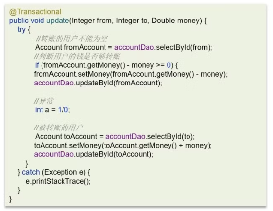
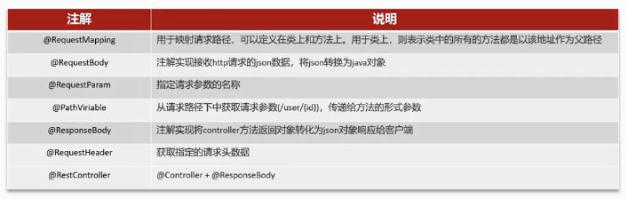

[TOC]

```

```

# Spring-SpringBoot-Mybatis 知识点

## 1 Spring

### 1.1 **说一下你对 Spring 的理解**


Spring框架核心特性包括:

- **IOC 容器：** Spring通过控制反转实现了对象的创建和对象间的依赖关系管理。开发者只需要定义好Bean及其依赖关系，Spring容器负责创建和组装这些对象
- **AOP：** 面向切面编程，允许开发者定义横切关注点，例如事务管理、安全控制等，独立于业务逻辑的代码。通过AOP，可以将这些关注点模块化，提高代码的可维护性和可重用性。
- **事务管理：** Spring提供了一致的事务管理接口，支持声明式和编程式事务。开发者可以轻松地进行事务管理，而无需关心具体的事务API。
- **MVC框架：** SpringMVC是一个基于ServletAPI构建的Web框架，采用了模型-视图-控制器（MVC）架构。它支/持灵活的URL到页面控制器的映射，以及多种视图技术。


### 1.2 **Spring IoC和AOP 介绍一下**

你怎么理解 spring:

1. IOC: 我有一个统一的 ioc 容器, 然后里面保存对象的实例类, 然后想用 → IOC 拿来用

```java
@Component\\@Service\\@Controller\\@Mapper\\@Bean
public class ClassA -> ClassA classa -> IOC 容器 (启动spring)

@Component
public class ClassB{
		@Autowerid
		private ClassA a; // 1. IOC 容器, 找有没有 ClassA 的实例对象 -> 赋值给 a
		
		//...
		
		// ClassB classb -> IOC 容器 (启动spring)
}

// IOC 容器 (ClassA, ClassB)

Context.getBean(classa); // 拿一个bean出来
```

- IOC:

   即控制反转的意思，它是一种创建和获取对象的技术思想，依赖注入DI 是实现这种技术的一种方式。

  - 传统开发过程中，我们需要通过 new 关键字来创建对象。使用 IoC 思想开发方式的话，我们不通过 new 关键字创建对象，而是通过 **loC 容器来帮我们实例化对象**。

    ```java
    new ApplicationContext(..包名)
     // spring启动的时候, 会自动去扫描当前路径下的所有包
     
     //1. 拿到了一个包名
     //2. 就可以遍历包名(文件夹),遍历里面的所有 class 文件
     //3. 挨个拿出来 class 文件, 去看 class 有没有 @Component\\@Service\\@Controller\\@Mapper\\@Bean 注解
    		 (a) 如果有注解, 反射 class.forName(class类名) -> 类的基本信息+方法+变量 -〉 
    				 反射调用构造函数 -> new 实例对象 -> 放入 IOC 容器 (Map<name, Object>)
    		  (b) 如果没有注解,不管了
    ```

  - 通过IoC的方式，可以大大降低对象之间的耦合度。

- **AOP:**  是面向切面编程，能够将那些与业务无关，却为业务模块所共同调用的逻辑封装起来，以减少系统的重复代码，降低模块间的耦合度。

  - SpringAOP 就是基于动态代理的，如果要代理的对象，实现了某个接口，那么SpringAOP会使用JDKProxy，去创建代理对象

    ```java
    class a implements interfaceA -> jdk 代理
    class a -> cglib 代理
    ```

  - 而对于没有实现接口的对象，就无法使用JDKProxy去进行代理了，这时候SpringAOP会使用Cglib生成一个被代理对象的子类来作为代理。

在Spring框架中，IOC和AOP结合使用，可以更好地实现代码的模块化和分层管理。例如：

- 通过 IOC 容器管理对象的依赖关系，然后通过 AOP 将横切关注点统一切入到需要的业务逻辑中。
- 使用 IOC 容器管理 Service 层和 DAO 层的依赖关系，然后通过 AOP 在 Service 层实现事务管理、日志记录等横切功能，使得业务逻辑更加清晰和可维护


### 1.3 什么是 AOP，项目中是否使用过 AOP


Spring AOP是Spring框架中的一个重要模块，用于实现面向切面编程。

我们知道，Java 就是一门面向对象编程的语言，在 OOP 中最小的单元就是“Class对象”，但是在 AOP 中最小的单元是“切面”。一个“切面”可以包含很多种类型和对象，对它们进行模块化管理，例如事务管理。

在面向切面编程的思想里面，把功能分为两种

- **核心业务**：登陆、注册、增、删、改、查、都叫核心业务
- **周边功能**：日志、事务管理这些次要的为周边业务

**AOP 称为面向切面编程：** 将与业务无关，但却对多个对象产生影响的公共行为和逻辑，抽取并封装为一个可以重用的模块。这个模块被命名为切面-Aspect。减少系统中的重复代码，降低模块间的耦合度，同时提高系统的可维护性。

**常见的 AOP 使用场景：**

- 记录操作日志
- 缓存处理
- Spring中内置的事务处理

**AOP 中常见的专业术语：**

1. AspectJ：切面，只是一个概念，没有具体的接口或类与之对应，是 Join point，Advice 和 Pointcut 的一个统称。
2. Join point：连接点，指程序执行过程中的一个点，例如方法调用、异常处理等。在 Spring AOP 中，仅支持方法级别的连接点。
3. Advice：通知，即我们定义的一个切面中的横切逻辑，有“around”，“before”和“after”三种类型。在很多的 AOP 实现框架中，Advice 通常作为一个拦截器，也可以包含许多个拦截器作为一条链路围绕着 Join point 进行处理。
4. Pointcut：切点，用于匹配连接点，一个 AspectJ 中包含哪些 Join point 需要由 Pointcut 进行筛选。
5. Weaving：织入，在有了连接点、切点、通知以及切面，如何将它们应用到程序中呢？没错，就是织入，在切点的引导下，将通知逻辑插入到目标方法上，使得我们的通知逻辑在方法调用时得以执行。
6. AOP proxy：AOP 代理，指在 AOP 实现框架中实现切面协议的对象。在 Spring AOP 中有两种代理，分别是 JDK 动态代理和 CGLIB 动态代理。
7. Target object：目标对象，就是被代理的对象。

**切面 - 切点 - 通知:**

```java
@Aspect // 代表这个类是个切面 = 切点 + 通知
public class aopclass{
		
		// 切点: 可以是包名, 代表我要对所有 com.example.service 包下的类进行 AOP 操作
		// 切点: 可以是注解, 代表我要对所有带 @controllerLog 注解得类进行 AOP 操作
		@Pointcut("execution(* com.example.service.*.*(..))")
		@Pointcut("@annotation(controllerLog)")
		public void run1(){}
		
		
		// 通知 -> 应用在run的注解代表的切点上
		// 前置通知, 我就是在run的注解代表的切点上进行前置的一些操作, 比如现在切点就是 @Pointcut("@annotation(controllerLog)")
		// 1. 对所有带 @controllerLog 注解的类, 如果我要执行 b.run(), 现在有前置通知
					(a) 打印 2222
					(b) 打印 1111
					
		// 2. 对所有带 @controllerLog 注解的类, 如果我要执行 b.run2(), 现在有前置通知
					(a) 打印 2222
					(b) 打印 tttt
 		@Before(value = run1())
    public void boBefore(JoinPoint joinPoint, Log controllerLog) {
		    print("2222")
        TIME_THREADLOCAL.set(System.currentTimeMillis());
    }
    
    
    @After(value = run1())
    public void bo(JoinPoint joinPoint, Log controllerLog) {
		    print("kkk")
        TIME_THREADLOCAL.set(System.currentTimeMillis());
    }
}

@controllerLog
public class b{

	 public void run(
			 print("1111")
	 )
	 
	 public void run2(
			 print("tttt")
	 )
	 
	 // 有100个方法, 想都执行完方法之后, 打印一个 kkkk
}
```

底层为什么就可以实现上面的过程呢? 2222 → tttt → kkkk

**原理就是: 动态代理**

**第一种继承了接口, jdk 代理**

```java
public class b implements bimpl{

	 public void run(
			 print("1111")
	 )
	 
	 public void run2(
			 print("tttt")
	 )
	 
	 // 有100个方法, 想都执行完方法之后, 打印一个 kkkk
}

// c 就是 b 的代理类
**// jdk 代理必须基于接口**
public class c **implements bimpl**{

		// target 就是原来的 b 实例对象
		private bimpl target;
		
		// c 的 run
		public void run(
			 print("2222")
			 // b 的run
			 target.run();
			 print("kkkk")
	 )
	 
	 // c 的 run2
	 public void run2(
			 print("2222")
			 // b 的run
			 target.run2();
			 print("kkkk")
	 )
}

// 你以为: classb b = new classb
// 代理悄悄帮你: class c = new classc(b);

// 你以为你在调用: b.run
// 代理悄悄帮你调用 c.run
```

**没有接口怎么办? cglib 代理**

```java
public class b{

	 public void run(
			 print("1111")
	 )
	 
	 public void run2(
			 print("tttt")
	 )
	 
	 // 有100个方法, 想都执行完方法之后, 打印一个 kkkk
}

// cglib 底层: 字节码的方式生成 b 的子类
public class c **extends b**{

		// target 就是原来的 b 实例对象
		private b target;
		
		// c 的 run
		public void run(
			 print("2222")
			 // b 的run
			 target.run();
			 print("kkkk")
	 )
	 
	 // c 的 run2
	 public void run2(
			 print("2222")
			 // b 的run
			 target.run2();
			 print("kkkk")
	 )
}

// 你以为: classb b = new classb
// 代理悄悄帮你: class c = new classc(b);

// 你以为你在调用: b.run
// 代理悄悄帮你调用 c.run (代理类 c 的run)
```

**重点 override:**

```java
public class c{
	 public void run(
			 print("1111")
	 )
}

public class d extend c{
	 @override
	 public void run(
			 print("dddd")
	 )
	 
	 run() -> dddd
	 super.run() -> dddd
}
```

**AOP 实现有哪些注解: 代理类内部如何去生成代理方法**

- @Aspect：用于定义切面，标注在切面类上。
- @Pointcut：定义切点，标注在方法上，用于指定连接点。
- @Before：在方法执行之前执行通知。
- @After：在方法执行之后执行通知。
- @Around：在方法执行前后都执行通知。
- @AfterReturning：在方法执行后返回结果后执行通知。
- @AfterThrowing：在方法抛出异常后执行通知。
- @Advice：通用的通知类型，可以替代@Before、@After等。

**Spring中的事务是如何实现的？**

Spring支持编程式事务和声明式事务管理两种方式：

- 编程式事务控制：需要使用 Transaction Template 来进行实现，对业务代码有侵入性，项目中很少使用。
- 声明式事务控制：声明式事务管理建立在 AOP 之上，其本质是通过 AOP 功能，对方法前后进行拦截，将事务处理的功能编织到拦截的方法中。
  - 在方法开始前，加入一个事务
  - 在方法执行之后，根据执行情况提交或回滚事务

```java
@Transaction
run()

// 代理类
代理后的 run(){
	begin()
	target.run();
	commit()
}
```

**AOP的底层原理**


Spring AOP的实现依赖于**动态代理技术**。动态代理是在运行时动态生成代理对象，而不是在编译时。它允许开发者在运行时指定要代理的接口和行为，从而实现在不修改源码的情况下增强方法的功能。

Spring AOP支持两种动态代理：

1. 如果要代理的对象，实现了某个接口，那么 Spring AOP 会使用 **JDK Proxy** 去创建代理对象
2. 而对于没有实现接口的对象，就无法使用 JDK Proxy 去进行代理了，这时候 Spring AOP 会使用 **Cglib** 生成一个被代理对象的子类来作为代理


### 1.4 **怎么理解Spring Ioc？IOC 通过什么机制实现的?**

**什么是 IOC 控制反转：**

IoC （Inversion of Control ）即控制反转/反转控制。它是一种思想不是一个技术实现。描述的是：Java 开发领域对象的创建以及管理的问题。

例如：现有类 A 依赖于类 B

- **传统的开发方式** ：往往是在类 A 中手动通过 new 关键字来 new 一个 B 的对象出来
- **使用 IoC 思想的开发方式** ：不通过 new 关键字来创建对象，而是通过 IoC 容器(Spring 框架) 来帮助我们实例化对象。我们需要哪个对象，直接从 IoC 容器里面去取即可。

从以上两种开发方式的对比来看：我们 “**丧失了一个权力** ” (创建、管理对象的权力)，从而**也得到了一个好处** （不用再考虑对象的创建、管理等一系列的事情）

**为什么叫控制反转：**

- 控制：指的是对象创建、初始化、销毁的权力, IOC 解决了繁琐的对象生命周期的操作，解耦了我们的代码。
  - **创建:**  原来是 new 一个，现在是由 Spring 容器创建。
  - **初始化:**  原来是对象自己通过构造器或者 setter 方法给依赖的对象赋值，现在是由 Spring 容器自动注入。
  - **销毁:**  原来是接给对象赋值 null 或做一些销毁操作，现在是 Spring 容器管理生命周期负责销毁对象。
- **反转**  ：控制权交给外部环境（IoC 容器）,前面提到是由 Spring 来控制对象的生命周期，那么对象的控制就完全脱离了我们的控制，控制权交给了 Spring 。

**IOC 解决了什么问题：**

IoC 的思想就是两方之间不互相依赖，由第三方容器来管理相关资源。这样有什么好处呢？

1. 对象之间的耦合度或者说依赖程度降低；
2. 资源变的容易管理；比如你用 Spring 容器提供的话很容易就可以实现一个单例。

------

举个具体的场景：

- 平时new A()时候是要import包地址的，这就已经写死了，以后这个引用就死死的指向了那个类，想改变很麻烦，用ac.getbean(“A”)就没引入包，也就是所谓的不依赖 （就是跟那类A没关系），它只从容器找那个叫A的类，至于你给我的是啥，看容器中咋配置。
  - 比如说是个很常用的dao类，开始你new的很开心，万一以后需求大改
  - 数据库mysql换db2了，这个dao文件基本就得重写，如果这个类已经封装编译为class文件，不能改了怎么办。
  - 使用 Spring 注解注册新的数据库 Bean，注释掉原来的 Bean

**IOC 的实现机制**

1. **反射:**  Spring IOC 容器利用 Java 的反射机制动态地加载类、创建对象实例及调用对象方法。
2. **依赖注入:**  IOC的核心概念是依赖注入，即容器负责管理应用程序组件之间的依赖关系。Spring通过构造函数注入、属性注入或方法注入，将组件之间的依赖关系描述在配置文件中或使用注解。
3. **设计模式-工厂模式:**  Spring IOC 容器通常采用**工厂模式来管理对象的创建和生命周期** 。容器作为工厂负责实例化 Bean 并管理它们的生命周期，将 Bean 的实例化过程交给容器来管理。
4. **IOC 容器实现 :**  Spring IOC 容器是实现IOC的核心，通常使用 **BeanFactory 或ApplicationContext 来管理 Bean** 。BeanFactory 是 IOC 容器的基本形式，提供基本BeanFactory 是 IOC 容器的基本形式，提供基本企业及功能.

**依赖倒置，依赖注入，控制反转分别是什么？**

1. **控制反转：** “控制”指的是对程序执行流程的控制，而“反转”指的是在没有使用框架之前，程序员自己控制整个程序的执行。在使用框架之后，整个程序的执行流程通过框架来控制。流程的控制权从程序员“反转”给了框架。
2. **依赖注入：** 依赖注入和控制反转恰恰相反，它是一种具体的编码技巧。我们不通过 new 的方式在类内部创建依赖类的对象，而是将依赖的类对象在外部创建好之后，通过构造函数、函数参数等方式传递（或注入）给类来使用。
3. **依赖倒置：** 这条原则跟控制反转有点类似，主要用来指导框架层面的设计。高层模块不依赖低层模块，它们共同依赖同一个抽象。抽象不要依赖具体实现细节，具体实现细节依赖抽象。


### 1.5 **如果让你设计一个Spring Ioc，你觉得会从哪些方面考虑这个设计？**

1. Bean 的生命周期管理：需要设计Bean的创建、初始化、销毁等生命周期管理机制，可以考虑使用工厂模式和单例模式来实现。
2. 依赖注入：需要实现依赖注入的功能，包括属性注入、构造函数注入、方法注入等，可以考虑使用反射机制和 XML 配置文件来实现。
3. Bean 的作用域：需要支持多种Bean作用域，比如单例、原型、会话、请求等，可以考虑使用Map 来存储不同作用域的 Bean 实例。
4. 配置文件加载：需要支持从不同的配置文件中加载Bean的相关信息，可以考虑使用 XML、注解或者 Java 配置类来实现。


### 1.6 Spring 中哪些地方用到了反射


```java
Person 类对象有几个 Person.class 
Person a = new Person(); // a 是一个对象
Person b = new Person(); // b 是一个对象

a ---> Person.class ----> person 类数据结构 
b ------/>
反射: 拿到 person.class -> 数据结构找到找到类的信息
```

反射具有以下特性：

1. **运行时类信息访问** ：反射机制允许程序在运行时获取类的完整结构信息，包括类名、包名、父类、实现的接口、构造函数、方法和字段等。
2. **动态对象创建** ：可以使用反射API动态地创建对象实例，即使在编译时不知道具体的类名。这是通过Class类的newInstance()方法或Constructor对象的newInstance()方法实现的。
3. **动态方法调用** ：可以在运行时动态地调用对象的方法，包括私有方法。这通过Method类的invoke()方法实现，允许你传入对象实例和参数值来执行方法。
4. **访问和修改字段值** ：反射还允许程序在运行时访问和修改对象的字段值，即使是私有的。这是通过Field类的get()和set()方法完成的。

**反射的应用场景**

1. Spring框架的依赖注入（DI）和控制反转（IoC）
   1. Spring 使用反射来实现其核心特性：依赖注入。
   2. 在Spring中，开发者可以通过XML配置文件或者基于注解的方式声明组件之间的依赖关系。当应用程序启动时，**Spring容器会扫描这些配置或注解，然后利用反射来实例化Bean（即Java对象），并根据配置自动装配它们的依赖**  。
   3. 例如，当一个Service类需要依赖另一个DAO类时，开发者可以在Service类中使用@Autowired注解，而无需自己编写创建DAO实例的代码。Spring容器会在运行时解析这个注解，通过反射找到对应的DAO类，实例化它，并将其注入到Service类中。这样不仅降低了组件之间的耦合度，也极大地增强了代码的可维护性和可测试性。
2. 动态代理的实现
   1. 为了给所有的服务层方法添加日志记录功能，可以定义一个切面，在这个切面中，Spring会使用JDK动态代理或CGLIB（如果目标类没有实现接口）来创建目标类的代理对象。
   2. 这个代理对象在**调用任何方法前或后** ，都会执行切面中定义的代码逻辑（如记录日志），而这一切都是在运行时**通过反射来动态构建和执行的** ，无需硬编码到每个方法调用中。


### 1.7 Spring框架中的单例Bean是线程安全的吗

**答案：单例 Bean 不是线程安全的，因为一般在spring的bean中都是注入无状态的对象，并不需要考虑线程安全的问题；但是如果在bean中定义了可修改的成员变量，是需要考虑安全问题的，通过加锁或者多例来解决。**

Spring 框架中的 bean 是单例的：

- 如果不进行设置，或设置为 singleton：则bean再每个 IOC 容器中只有一个实例
- 设置为 prototype：一个 bean 的定义可以有多个实例

下面有一个代码的片段：

```java
@Controller
@RequestMapping("/user")
public class UserController{
		private int count;
		
		@Autowired
		private UserService userService;
		
		@GetMapping("/getById/{id}")
		public User getById(@PathVariable("id") Integer id){
			count++;
			return userService.getById(id);
		}
}
```

- 对于类的成员变量 count 来说，每次有用户请求访问 UserController 时，都会返回同一个实例，那么对于 count 的修改就会产生**并发安全的问题** 。
- 对于 userService 来说，如果 Spring bean 中并没有可变的状态（Service类或者DAO类），所以在某种程度上说 Spring 的单例bean**是线程安全的** 。

所以开发过程中：尽量不要在 Spring Bean 中定义可以修改的成员变量

```java
UserController user1 ---
UserController user2 --- 同一个 user-----user1.count++, user2.count++
UserController user3 ---

user3.getcount => 2
```


### 1.8 Spring事务传播机制？Spring中事务失效的场景有哪些？(超级重点!!!)

**什么是事务：**

- 事务是逻辑上的一组操作，要么都执行，要么都不执行。
- 事务能否生效数据库引擎是否支持事务是关键。
  - 比如常用的 MySQL 数据库默认使用支持事务的 innodb引擎。
  - 但是，如果把数据库引擎变为 myisam，那么程序也就不再支持事务了！
- 事务的 ACID 特性：
  - **原子性** （Atomicity）：事务是最小的执行单位，不允许分割。事务的原子性确保动作要么全部完成，要么完全不起作用；
  - **一致性** （Consistency）：执行事务前后，数据保持一致，例如转账业务中，无论事务是否成功，转账者和收款人的总额应该是不变的；
  - **隔离性** （Isolation）：并发访问数据库时，一个用户的事务不被其他事务所干扰，各并发事务之间数据库是独立的；
  - **持久性** （Durability）：一个事务被提交之后。它对数据库中数据的改变是持久的，即使数据库发生故障也不应该对其有任何影响

**Spring 支持两种方式的事务管理：**

- 编程式事务管理：通过 TransactionTemplate或者TransactionManager手动管理事务，实际应用中很少使用，但是对于你理解 Spring 事务管理原理有帮助。
- 声明式事务管理：推荐使用（代码侵入性最小），实际是通过 AOP 实现（基于@Transactional 的全注解方式使用最多）。

**Spring 框架中，事务管理相关最重要的 3 个接口如下：**

- PlatformTransactionManager：（平台）事务管理器，Spring 事务策略的核心；可以被看作是事务上层的管理者。
- TransactionDefinition：事务定义信息(事务隔离级别、传播行为、超时、只读、回滚规则)；可以看作是事务的描述
- TransactionStatus：事务运行状态；可以看作是事务的描述。

我们可以把 PlatformTransactionManager 接口，而 TransactionDefinition 和 TransactionStatus 这两个接口。

**Transactional 中的事务传播行为有哪些？**

事务传播行为是为了解决业务层方法之间互相调用的事务问题。**正确的事务传播机制有以下四种：现在假设 事务A 中调用了 事务B**

```java
@transactional
public void AAAAAA(){
		insert("111111")
		// 是个事务
		BBBBBBB()
		insert("2222222")
}

@transactional
public void BBBBBBB(){

}
```

- REQUIRED（使用最多）：回滚会引起全局回滚
  - 外围方法未开启事务的情况下 Propagation.REQUIRED 修饰的内部方法会新开启自己的事务，且开启的事务相互独立，互不干扰。
  - 外围方法开启事务的情况下 Propagation.REQUIRED 修饰的内部方法会加入到外围方法的事务中，所有 Propagation.REQUIRED 修饰的内部方法和外围方法**均属于同一事务**  ，只要一个方法回滚，整个事务均回滚。
  - 即使内部方法可以通过 try-catch 不被外部方法感知，但是整个事务仍会回滚。
- REQUIRES_NEW：外部回滚，内部没事；内部回滚，不被外部捕获到则外部不回滚
  - 外围方法未开启事务的情况下 Propagation.REQUIRES_NEW 修饰的内部方法会新开启自己的事务，且开启的事务相互独立，互不干扰。
  - 内部方法会新建自己的事务，外部事务回滚，不会导致内部事务回滚
  - 内部回滚抛出异常之后，如果外部事务捕获到了异常，则会引起外部事务的回滚
- NESTED：外部回滚，内部回滚；内部回滚，不被外部捕获则外部不回滚
  - 外围方法未开启事务的情况下，修饰的内部方法都会新开启自己的事务，且开启的事务相互独立，互不干扰。
  - 内部方法属于外部事务的子事务
    - 外围主事务回滚，子事务一定回滚
    - 内部子事务可以单独回滚而不影响外围主事务和其他子事务
- 其他：
  - **MANDATORY：** 如果当前存在事务，则加入该事务；如果当前没有事务，则抛出异常。
  - **TransactionDefinition.PROPAGATION_SUPPORTS** :  如果当前存在事务，则加入该事务；如果当前没有事务，则以非事务的方式继续运行。
  - **TransactionDefinition.PROPAGATION_NOT_SUPPORTED** : 以非事务方式运行，如果当前存在事务，则把当前事务挂起。
  - **TransactionDefinition.PROPAGATION_NEVER** : 以非事务方式运行，如果当前存在事务，则抛出异常。

[太难了~面试官让我结合案例讲讲自己对Spring事务传播行为的理解。](https://mp.weixin.qq.com/s?__biz=Mzg2OTA0Njk0OA==&mid=2247486668&idx=2&sn=0381e8c836442f46bdc5367170234abb&chksm=cea24307f9d5ca11c96943b3ccfa1fc70dc97dd87d9c540388581f8fe6d805ff548dff5f6b5b&token=1776990505&lang=zh_CN#rd)

```java
@transactional
public class A

// 1. A -> 实例化(初始化) =》 A 对象
// 2. B(A) 代理对象 -> IOC 容器里面 -> target.私有
// 3. 你以为调用 a.run -> 其实调用 b.run()
```

**Spring 事务失效场景：**

- 异常捕获处理

  ```java
  public void run(){
  		try{
  			// 异常
  		} catch (e){
  			print(e)
  		}
  }
  ```

- 抛出检查异常

- 非 public 方法

- Spring AOP 自调用问题

  ```java
  public void run(){
  
  }
  
  public void run2(){
  		run();
  }
  ```

- 传播机制

**情况一：异常捕获处理**



- 原因：由于异常捕获处理在内部捕获并进行处理，**没有抛出错误** 则系统认为内部代码可以正常运行，所以导致事务不能回滚。
- 解决：在异常 catch 块中添加 throw new RuntimeException(e) 将异常抛出即可

**情况二：抛出检查（受查）异常**


受检异常是指**在编译时需要处理的异常，也就是需要在代码中进行显式处理的异常** 。 如果不处理受检异常，代码就无法通过编译。 例如，Java中的IOException就是一个受检异常。

- 原因：Spring默认只会回滚非受查异常
- 解决：配置 rollbackFor 属性，@Transactional(rollbackFor = Exception.class)

**情况三：非 public 方法导致的事务失效**


- 原因：Spring为方法创建代理，添加事务通知，前提条件都是该方法是 public 的
- 解决：将方法修改为 public

**@Transactional 事务注解原理 - AOP**

面试中在问 AOP 的时候可能会被问到的一个问题。简单说下吧！

我们知道，`@Transactional` 的工作机制是基于 AOP 实现的，AOP 又是使用动态代理实现的。如果目标对象实现了接口，默认情况下会采用 JDK 的动态代理，如果目标对象没有实现了接口,会使用 CGLIB 动态代理。

- 当一个类有 Transactional 注解的话，Spring 容器就会在启动的时候为其创建一个代理类，在调用被 Transactional 注解的 public 方法的时候，调用的实际是代理类中 invoke() 方法。
- 代理类中的 invoke 方法的大概逻辑就是在目标方法之前开启事务，如果遇到异常的时候回滚事务，方法调用完成之后提交事务。

**Spring AOP 自调用问题如何解决**

自调用问题：当一个方法被标记了`@Transactional` 注解的时候，Spring 事务管理器只会在被其他类方法调用的时候生效，而不会在一个类中方法调用生效。原因：

- Spring AOP 通过动态代理来实现事务的管理，它会在运行的时候为带有 `@Transactional` 注解的方法生成代理对象，并调用事务逻辑。
- 该方法被其他类调用的时候可以拦截方法并进行处理
- 如果在一个方法内部调用的时候，代理对象无法拦截到内部对象，发生事务失效

解决方法：

- 使用 Aspect J 取代 SpringAOP代理
- 通过 `AopContext.currentProxy.method` 来调用当前方法
- 通过 ApplicationContext 获取bean，通过 bean 调用内部方法，就使用了 bean 的代理类。


### 1.9 Spring-bean 的生命周期（超级重点!!!）

```java
@component
public class a{
}

a -> IOC -> 使用 -> 销毁
```

**首先回答 - 分为了四个阶段：实例化、属性赋值、初始化以及销毁**

有助于了解Spring容器是如何管理和创建bean实例，方便调试和解决问题。

**什么是 BeanDefinition**

Spring容器在进行实例化时，**会将 xml 配置的 bean 信息封装成一个 BeanDefinition 对象** ，Spring 根据 BeanDefinition 来创建 Bean 对象，里面有很多的属性来描述 Bean。

- xml bean 信息 → BeanDefinition → Bean 对象
- 相关方法：
  - beanClassName：bean 的类名
  - initMethodName：初始化方法名称
  - propertyValues：bean的属性值
  - scope：bean的作用域
  - lazyinit：延迟初始化
- BeanDefinition 中有很多属性封装起来进行备用，在 Bean 创建的时候被使用


```java
class person{
		age = 3;
		name = tjy;
}

最重要: 用反射去检查类里面存在的 注解、接口
beandefinition(age=3, name=tjy) <- map
实例化: person(age=0,name="")
属性注入: @autowired
aware: BeanNameAware + BeanFactoryAware + ApplicationContextAware
执行
```

从 BeanDefinition 对象创建真正的 Bean 对象需要经历**创建和初始化** 的过程，如下：

- **BeanDefinition：** 通过 BeanDefinition 获取 bean 的定义信息
- **实例化：** 使用对象的构造函数创建对象（在堆中开辟一块空间，这是个半成品）
  - 主要根据类的元数据信息 + 反射来进行构造函数的调用
- **属性注入：** 对对象属性进行注入，可以使用 Autowerid 或者 setter 等注入方法
  - 首先对被注入对象进行实例化和初始化
- **Aware接口：** 若 Spring 检测到 bean 实现了 Aware 接口，则会为其注入相应的依赖。所以通过让bean 实现 Aware 接口，则能在 bean 中获得相应的 Spring 容器资源。
  - BeanNameAware 需要重写 setBeanName 方法，注入当前 bean 对应 beanName
  - BeanFactoryAware 需要重写 setBeanFactory 方法，注入加载当前 bean 的Factory
  - ApplicationContextAware 需要重写 setApplicationContext 方法，注入当前 BeanFactory 容器的引用
- **执行 BeanPostProcessor#before 方法：** 在初始化 Bean 之前的前置方法
  - BeanPostProcessor 是 Spring 为修改  bean  提供的强大扩展点，其可作用于容器中所有 bean
- **执行初始化方法：** InitializingBean 接口、init-method
  - 执行 @PostConstruct 注解的自定义初始化方法
  - 实现 InitializingBean 接口中的 afterPropertiesSet()，也会在当前执行
- **执行 BeanPostProcessor#after 方法：** 在初始化 Bean 之后的后置方法
  - 其中可以使用 AOP 或者动态代理对方法进行增强
  - 放入一级缓存中
- **注册 Destruction 回调接口**
- **执行销毁bean：** DisposableBean 接口、destory-method

**Spring Bean 加载和JVM 类加载的区别与联系：**

1. Spring bean 加载依赖于 JVM 类加载。Spring 中的 bean 通常由类定义,所以必须先由 JVM 加载对应的类,Spring 才可以根据类信息进行 bean 的加载和初始化。
2. Spring bean 加载发生在 JVM 类加载之后。Spring 必须在类加载完成后,才获取到类的元数据信息并进行 bean 的加载。
3. Spring bean 加载可以触发 JVM 类加载。当 Spring 需要加载一个 bean 时,如果对应的类还没有被 JVM 加载,那么会触发该类的加载。
4. Spring bean 加载和 JVM 类加载使用不同的 ClassLoader。Spring 使用 ApplicationContext 自己的 ClassLoader 加载 bean,而不是用 JVM 默认的 ClassLoader。
5. JVM 类加载失败会导致 Spring bean 加载失败。如果 JVM 加载某个类失败,那么 Spring 加载对应的 bean 也会失败。


### 1.10 Spring-Bean 中的循环引用(超级重点!!!)

循环依赖问题在Spring中主要有三种情况：

1. 第一种：通过构造方法进行依赖注入时产生的循环依赖问题。
2. 第二种：通过setter方法进行依赖注入且是在多例（原型）模式下产生的循环依赖问题。
3. 第三种：通过setter方法进行依赖注入且是在单例模式下产生的循环依赖问题。**<被解决>**

循环引用问题：

```java
@Component
public class A{
		@Autowired
		private B b;
}
@Component
public class B{
		@Autowired
		private A a;
}
```


**死循环产生的过程：**

- 实例化A - 即执行构造函数 - 在堆中开辟一块空间，这是个半成品A
- 初始化A：通过依赖注入设置b属性，需要到 Spring 容器中查找 B 对象，发现容器中不存在 B 对象
- 实例化B - 即执行构造函数 - 在堆中开辟一块空间，这是个半成品B
- 初始化B：通过依赖注入设置a属性，需要到 Spring 容器中查找 A 对象，发现容器中不存在A对象
- B 继续实例化 A，循环引用导致发生死循环

**Spring 框架如何解决循环引用 → 三级缓存：**

**知识补充1 : Bean 周期与三级缓存的关系**

三级缓存指的是 Spring 在创建 Bean 的过程中，通过三级缓存来缓存正在创建的 Bean，以及已经创建完成的 Bean 实例。具体步骤如下：

1. **实例化 Bean** ：Spring 在实例化 Bean 时，会先创建一个空的 Bean 对象，并将其放入一级缓存中。
2. **属性赋值** ：Spring 开始对 Bean 进行属性赋值，如果发现循环依赖，会将当前 Bean 对象提前暴露给后续需要依赖的 Bean（通过提前暴露的方式解决循环依赖）。
3. **初始化 Bean** ：完成属性赋值后，Spring 将 Bean 进行初始化，并将其放入二级缓存中。
4. **注入依赖** ：Spring 继续对 Bean 进行依赖注入，如果发现循环依赖，会从二级缓存中获取已经完成初始化的 Bean 实例。

通过三级缓存的机制，Spring 能够在处理循环依赖时，确保及时暴露正在创建的Bean 对象，并能够正确地注入已经初始化的 Bean 实例，从而解决循环依赖问题，保证应用程序的正常运行。

**知识补充2: 三级缓存的数据结构是什么:**

都是 Map类型的缓存，比如Map {k:name; v:bean}。

1. **一级缓存（Singleton Objects）** ：这是一个Map类型的缓存，存储的是已经完全初始化好的bean，即完全准备好可以使用的 bean 实例。键是bean的名称，值是bean的实例。
2. **二级缓存（Early Singleton Objects）** ：这同样是一个Map类型的缓存，存储的是早期的bean引用，即已经实例化但还未完全初始化的bean。这些bean已经被实例化，但是可能**还没有进行属性注入等操作** 。这个缓存在已经被实例化，但是可能还没有进行属性注入等操作。这个缓存在DefaultSingletonBeanRegistry类中的earlySingletonObjects属性中。
3. **三级缓存（Singleton Factories）** ：这也是一个Map类型的缓存，存储的是ObjectFactory对象，这些对象可以生成早期的bean引用。当一个bean正在创建过程中，如果它被其他bean依赖，那么这个正在创建的bean就会通过这个ObjectFactory来创建一个早期引用，从而**解决循环依赖** 的问题。这个缓存在DefaultSingletonBeanRegistry类中的singletonFactories属性中。

**知识补充3 : 三级缓存步骤分析**

Spring 框架中通过三级缓存来解决循环依赖，对应的三级缓存如下图所示：

- 在单实例对象注册器中，定义了三个 Map：
  - 一级缓存 singletonObjects：单例池，缓存已经经历了完整的生命周期并已经初始化完成的 bean 对象
  - 二级缓存 earlySingletonObjects：缓存早期的 bean 对象（生命周期还没走完）
  - 三级缓存 singletonFactories：缓存的是 ObjectFactory有表示对象工厂，用来创建某个对象

如果只使用一级缓存：

- 一级缓存限制 bean 在 beanFactory 中只有一份，即实现 singleton scope，其缓存已经经历了完整的生命周期并已经初始化完成的 bean 对象，不能解决循环依赖。


如果使用一级缓存 + 二级缓存：可以解决部分循环依赖问题

- 如果要打破循环依赖，就需要一个中间人的参与，这个中间人就是二级缓存
  - 实例化 A 对象：将生命周期还没走完的bean对象 A 存储在二级缓存中
  - 开始初始化A → 发现需要注入 B 对象，需要到 Spring 容器中查找 B 对象，发现容器中不存在 B 对象
  - 实例化 B 对象：将生命周期还没走完的bean对象 B 存储在二级缓存中
  - 开始初始化B → 需要注入 A → 发现 A 在二级缓存中 → 注入成功 → B 创建成功，并存储到一级缓存中
  - A 继续执行，将创建成功的 B 对象注入在 A 对象中，所以 A 也可以创建成功，并存储到一级缓存中
- 但是一级缓存 + 二级缓存无法解决代理对象的实例化和初始化

**使用三级缓存解决循环依赖的流程：**


- 三级缓存主要借助了对象工厂来存储或生成代理对象或普通对象
  - 实例化 A 对象：原始对象 A 生成一个ObjectFactory对象将生命周期还没走完的bean对象 A 存储在三级缓存中
  - 开始初始化 A：发现需要注入对象 B，需要在 Spring 容器中查找 B 对象，发现不存在
  - 实例化 B 对象：原始对象 B 生成一个ObjectFactory对象将生命周期还没走完的bean对象 B 存储在三级缓存中
  - 开始初始化 B：需要注入A，突然发现三级缓存中有 A 的创建工厂，则通过 A 的ObjectFactory对象创建 A 的代理对象，并将 A 的代理对象存放在二级缓存中
  - A 的代理对象可以成功注入B，所以 B 可以创建成功，放在一级缓存中
  - 可以成功将 B 注入给A，A 可以创建成功，放在一级缓存中
- 为什么要使用二级缓存，好像一级缓存和三级缓存就可以
  - 因为对象都是**单例** 的，通过 A 的ObjectFactory对象代理创建好的对象 A 必须先放在二级缓存中，之后再将二级缓存中的 A 注入到 B 中来保持单例模式
  - **将 B 注入到 A 时，** A 也必须是从二级缓存中获取的代理对象，最终生成一个完成的对象
    - 如果 A 没有循环依赖，则会继续通过对象工厂（三级缓存） → 代理对象（二级缓存） → 对象（一级缓存）的方式完成初始化

**构造方法出现了循环依赖怎么解决？**

原因：

- 之所以三级缓存可以解决循环依赖问题，是其在原始对象 A 通过构造函数实例化之后存放在了三级缓存中，可以让B提前知道A的存在
- 但是构造方法出现了循环依赖，代表实例化之前就需要进行相互调用，构造函数无法完成

解决方法：

- 在 A 上面加一个(@ Lazy B b) 表示延迟加载，需要对象的再进行 bean 对象的创建，而不是刚开始就将 B 对象注入进来
- **也就是  A 通过构造函数实例化的函数不用注入B**


### 1.11 Spring MVC 的执行流程知道吗


MVC全名是Model View Controller，是模型(model)－视图(view)－控制器(controller)的缩写，一种软件设计典范，用一种业务逻辑、数据、界面显示分离的方法组织代码。

1. **视图(view)：**  为用户提供使用界面，与用户直接进行交互。
2. **模型(model)：**  代表一个存取数据的对象或 JAVA POJO（Plain Old Java Object，简单java对象）。它也可以带有逻辑，主要用于承载数据，并对用户提交请求进行计算的模块。模型分为两类，一类称为数据承载 Bean，一类称为业务处理Bean。所谓数据承载 Bean 是指实体类（如：User类），专门为用户承载业务数据的；而业务处理 Bean 则是指Service 或 Dao 对象， 专门用于处理用户提交请求的。
3. **控制器(controller)：** 用于将用户请求转发给相应的 Model 进行处理，并根据Model 的计算结果向用户提供相应响应。它使视图与模型分离。

**流程步骤：**

1. 用户通过View 页面向服务端提出请求，可以是表单请求、超链接请求、AJAX 请求等；
2. 服务端 Controller 控制器接收到请求后对请求进行解析，找到相应的Model，对用户请求进行处理Model 处理；
3. 将处理结果再交给 Controller（控制器其实只是起到了承上启下的作用）；
4. 根据处理结果找到要作为向客户端发回的响应View 页面，页面经渲染后发送给客户端。

SpringMVC的执行流程是这个框架最核心的内容，流程可以分为两类：

- 视图阶段：老旧JSP
- 前后端分离阶段：接口开发、异步

**视图阶段的执行流程：**


- 浏览器发出一个请求，后台首先拥有一个前端控制器 DispatcherServlet 来接收请求
  - **前端控制器 DispatcherServlet** 相当于调度中心，是被 Tomcat 容器初始化的
  - 前端控制器 DispatcherServlet 会在内部加载一些组建类：
    - **处理器映射器 HandlerMapping: getByid → 包名#方法名(@Contoller)**
    - **(拦截器动作 + 包名#方法名) → 处理器适配器 HandlerAdaptor(策略模式)**
    - 视图解析器 ViewResolver
- 由 DispatcherServlet 向处理器映射器 HandlerMapping 查询 handler，其中保存的信息为
  - key:/user/getById/1 → value：类名#方法名
  - HandlerMapping根据请求信息找到对应的处理器(Controller)
- HandlerMapping 解析完成之后返回给前端控制器 DispatcherServlet 一个处理器执行链
  - 处理器执行链  HandlerExecutionChain 是拦截器 + 执行方法的统一封装
- 由 DispatcherServlet 向处理器适配器 HandlerAdaptor 请求执行Handler
  - 处理器适配器 HandlerAdaptor 请求处理器 Handler（Controller） 进行代码执行
  - HandlerAdapter 根据处理器的类型选择合适的方法来调用处理器
  - 处理器 Handler 完成执行后响应 ModelAndView 给处理器适配器 HandlerAdaptor
  - 处理器适配器 HandlerAdaptor 的作用：处理参数和处理返回值
- 处理器适配器 HandlerAdaptor 返回 ModelAndView 到前端控制器
- 前端控制器将 ModelAndView 交给视图解析器解析
- 视图解析器返回解析后的 View 对象交给前端控制器
- 前端控制器负责渲染视图 + 视图展示 → JSP 页面

**前后端分离阶段的执行流程：**


在前后端分离的执行流程中，可以不考虑上面标注为黄色的部分。

处理器Handler进行代码执行之后，可以通过 HttpMessageConverter 来将返回结果转换为 JSON 并通过 HTTP 进行响应，不需要响应 ModelAndView 给处理器适配器和前端控制器。

**如何理解 Handlermapping 和 handleradapter ?**

HandlerMapping：

1. **作用** ：HandlerMapping负责将请求映射到处理器（Controller）。
2. **功能** ：根据请求的URL、请求参数等信息，找到处理请求的 Controller。
3. **类型** ：Spring提供了多种HandlerMapping实现，如BeanNameUrlHandlerMapping、RequestMappingHandlerMapping等。
4. **工作流程** ：根据请求信息确定要请求的处理器(Controller)。HandlerMapping可以根据URL、请求参数等规则确定对应的处理器。

HandlerAdapter：

1. **作用** ：HandlerAdapter负责调用处理器(Controller)来处理请求。
2. **功能** ：处理器(Controller)可能有不同的接口类型（Controller接口、HttpRequestHandler接口等），HandlerAdapter根据处理器的类型来选择合适的方法来调用处理器。
3. **类型** ：Spring提供了多个HandlerAdapter实现，用于适配不同类型的处理器。
4. **工作流程** ：根据处理器的接口类型，选择相应的HandlerAdapter来调用处理器。

HandlerMapping和HandlerAdapter协同工作，通过将请求映射到处理器，并调用处理器来处理请求，实现了请求处理的流程。它们的灵活性使得在Spring MVC中可以支持多种处理器和处理方式，提高了框架的扩展性和适应性。


### 1.12 Spring 框架常见注解有哪些

**Spring 常见注解有哪些**


**SpringMVC 常见注解有哪些**



**SpringBoot 常见注解有哪些**


### 1.13 Spring bean 有哪些作用域

- **singleton** : IoC 容器中只有唯一的 bean 实例。Spring 中的 bean 默认都是单例的，是对单例设计模式的应用。
- **prototype** : 每次获取都会创建一个新的 bean 实例。也就是说，连续 `getBean()` 两次，得到的是不同的 Bean 实例。
- **request** （仅 Web 应用可用）: 每一次 HTTP 请求都会产生一个新的 bean（请求 bean），该 bean 仅在当前 HTTP request 内有效。
- **session** （仅 Web 应用可用） : 每一次来自新 session 的 HTTP 请求都会产生一个新的 bean（会话 bean），该 bean 仅在当前 HTTP session 内有效。
- **application/global-session** （仅 Web 应用可用）：每个 Web 应用在启动时创建一个 Bean（应用 Bean），该 bean 仅在当前应用启动时间内有效。
- **websocket** （仅 Web 应用可用）：每一次 WebSocket 会话产生一个新的 bean。


### 1.14 **在Spring中，在bean加载/销毁前后，如果想实现某些逻辑，可以怎么做**

在Spring框架中，如果你希望在Bean加载（即实例化、属性赋值、初始化等过程完成后）或销毁前后执行某些逻辑，你可以使用Spring的生命周期回调接口或注解。这些接口和注解允许你定义在Bean生命周期的关键点执行的代码。

- 使用init-method和destroy-method: 使用init-method和destroy-method化后和销毁前需要调用的方法。
- 你的Bean类可以实现.InitializingBean和DisposableBean接口，并分别实现afterPropertiesSet和destroy方法。
- 使用@PostConstruct和@PreDestroy注解
- 使用@Bean注解的initMethod和destroyMethod属性


### 1.15 **Spring给我们提供了很多扩展点，这些有了解吗？**

Spring框架提供了许多扩展点，使得开发者可以根据需求定制和扩展Spring的功能。以下是一些常用的扩展点：

1. BeanFactoryPostProcessor：允许在Spring容器实例化bean之前修改bean的定义。常用于修改bean属性或改变bean的作用域。
2. BeanPostProcessor：可以在bean实例化、配置以及初始化之后对其进行额外处理。常用于代理bean、修改bean属性等。
3. PropertySource：用于定义不同的属性源，如文件、数据库等，以便在Spring应用中使用。
4. ImportSelector和ImportBeanDefinitionRegistrar：用于根据条件动态注册bean定义，实现配置类的模块化。
5. Spring MVC中的HandlerInterceptor：用于拦截处理请求，可以在请求处理前、处理中和处理后执行特定逻辑。
   1. 控制器 + JWT 可以来进行不同 controller 调用之前的鉴权行为
6. Spring MVC中的ControllerAdvice：用于全局处理控制器的异常、数据绑定和数据校验。
7. Spring Boot的自动配置：通过创建自定义的自动配置类，可以实现对框架和第三方库的自动配置。
8. 自定义注解：创建自定义注解，用于实现特定功能或约定，如权限控制、日志记录等。


## 2 Springboot

### 2.1 **为什么使用springboot**

1. **简化开发：** Spring Boot通过提供一系列的开箱即用的组件和自动配置，简化了项目的配置和开发过程，开发人员可以更专注于业务逻辑的实现，而不需要花费过多时间在繁琐的配置上。
2. **快速启动：** Spring Boot提供了快速的应用程序启动方式，可通过内嵌的Tomcat、Jetty或Undertow等容器快速启动应用程序，无需额外的部署步骤，方便快捷。
3. **自动化配置：** Spring Boot通过自动配置功能，根据项目中的依赖关系和约定俗成的规则来配置应用程序，减少了配置的复杂性，使开发者更容易实现应用的最佳实践。


### 2.2 **怎么理解SpringBoot中的约定大于配置**

理解 Spring Boot 中的“约定大于配置”原则，可以从以下几个方面来解释：

1. **自动化配置** ：Spring Boot 提供了大量的自动化配置，通过分析项目的依赖和环境，自动配置应用程序的行为。开发者无需显式地配置每个细节，大部分常用的配置都已经预设好了。例如，Spring Boot 可以根据项目中引入的数据库依赖自动配置数据源。
2. **默认配置** ：Spring Boot 在没有明确配置的情况下，会使用合理的默认值来初始化应用程序。这种默认行为使得开发者可以专注于核心业务逻辑，而无需关心每个细节的配置。
3. **约定优于配置** ：Spring Boot 遵循了约定优于配置的设计哲学，即通过约定好的方式来提供默认行为，减少开发者需要做出的决策。例如，约定了项目结构、Bean 命名规范等，使得开发者可以更快地上手并保持团队间的一致性。

**Spring Boot通过「自动化配置」和「起步依赖」实现了约定大于配置的特性。**

- 自动化配置：Spring Boot根据项目的依赖和环境自动配置应用程序，无需手动配置大量的XML或Java配置文件。例如，如果项目引入了Spring Web MVC依赖，Spring Boot会自动配置一个基本的Web应用程序上下文。
- 起步依赖：Spring Boot提供了一系列起步依赖，这些依赖包含了常用的框架和功能，可以帮助开发者快速搭建项目。通过引入适合项目需求的起步依赖，开发者可以更专注于业务


### 2.3 SpringBoot 自动装配原理(重要!!!!)

Springboot中最高频的一道面试题，也是框架最核心的思想。

1. 什么是 SpringBoot 自动装配？
2. SpringBoot 是如何实现自动装配的？如何实现按需加载？
3. 如何实现一个 Starter？

**在没有 SpringBoot 的时候：**

使用过 Spring 的小伙伴，一定有被 XML 配置统治的恐惧。即使 Spring 后面引入了基于注解的配置，我们在开启某些 Spring 特性或者引入第三方依赖的时候：

- 需要用 XML 显式配置
- 需要使用 配置类 + Bean 的方式现实配置

**但是有了Spring Boot 项目，我们只需要添加相关依赖，无需配置，通过启动下面的 `main` 方法即可。这就是 SpringBoot 的自动装配**

```java
@SpringBootApplication
public class DemoApplication {
    public static void main(String[] args) {
        SpringApplication.run(DemoApplication.class, args);
    }
}
```

**什么是 SpringBoot 自动装配**

没有 Spring Boot 的情况下，如果我们需要引入第三方依赖，需要手动配置，非常麻烦。但是，Spring Boot 中，我们直接引入一个 starter 即可。比如你想要在项目中使用 redis 的话，直接在项目中引入对应的 starter 即可。

```java
<dependency>
    <groupId>org.springframework.boot</groupId>
    <artifactId>spring-boot-starter-data-redis</artifactId>
</dependency>
```

自动装配可以简单理解为：**通过注解或者一些简单的配置就能在 Spring Boot 的帮助下实现某块功能。**

Springboot自动配置原理主要依赖于 **SpringBootApplication** 注解，其包含：

- **SpringBootConfiguration** ：与 Configuration 类似，用来声明当前是一个配置类
- **ComponentScan** ：组件扫描，默认扫描当前引导类所在包及其子包
- **EnableAutoConfiguration：SpringBoot实现自动化配置的核心注解，表示启用自动配置**


**EnableAutoConfiguration 的工作原理：核心是 AutoConfigurationImportSelector**

- EnableAutoConfiguration 中包含一个 Import 注解，用于导入类并放在IOC容器中
  - 导入 AutoConfigurationImportSelector.class 即**自动配置选择器,**
  - 自动配置选择器在启动时会扫描外部引用 jar 包中的META-INF/spring.factories文件，将文件中配置的类型信息加载到 Spring 容器，并执行类中定义的各种操作。
- AutoConfigurationImportSelector 类实现了 **ImportSelector** 接口，同时实现了一个 **selectImports** 方法，该方法主要用于**获取所有符合条件的类的全限定类名，这些类需要被加载到 IoC 容器中**。
- 其中通过函数 getAutoConfigurationEntry 获取所有需要装配的类，其中的执行流程如下：
  - 判断自动装配开关是否打开
  - 获取 EnableAutoConfiguration 注解中的 exclude 和 excludeName
  - 获取需要自动装配的所有配置类，**即读取 META-INF/spring.factories** ，其中有所有可能用到的配置类，配置类的作用就是可以按需加载 Bean（所有组件的 spring.factory 都会被读取到）
  - 但是，**并不是所有配置都会被加载** ：因为在这些配置类中有一个 ConditionOnClass  注解，该注解用来判断其中的条件是否被满足，例如 `@ConditionalOnClass` 就是当类路径下有指定类的条件下才会加载

```java
org.springframework.boot.autoconfigure.EnableAutoConfiguration=\\
  
  com.baomidou.mybatisplus.autoconfigure.MybatisPlusLanguageDriverAutoConfiguration,\\
  com.baomidou.mybatisplus.auoconfigure.MybatisPlusAutoConfiguration

// 对每个全限定类名进行以下的操作
1. 反射拿到 com.baomidou.mybatisplus.autoconfigure.MybatisPlusAutoConfiguration
2. 拿到 MybatisPlusAutoConfiguration 所有的 method 方法 -》 list<method>
// 插入一步: 根据 @ConditionalOnClass 看你有没有引入 jar 包(进入某个类)
3. for list<method> 去看 method 上面有没有 @bean 注解
		(a) 有的话, 我去用spring 生成 bean 对象, 放容器里
@Configuration
// 检查相关的类：RabbitTemplate 和 Channel是否存在
// 存在才会加载
@ConditionalOnClass({ RabbitTemplate.class, Channel.class })
@EnableConfigurationProperties(RabbitProperties.class)
@Import(RabbitAnnotationDrivenConfiguration.class)
public class RabbitAutoConfiguration {
}

// 怎么才会有RabbitTemplate.class? <- pom引入rabbit 依赖后, 就有这个class了
```

**原来: spring**

```java
//1. pom引入rabbit 依赖后
//2. 要么在xml里面定义 rabbitbean, 要么自己用 Configuration+Bean 注解将 rabbitbean 放在容器里
//3. 使用 rabbitbean
```

**自动配置: springboot**

```java
//1. pom引入rabbit 依赖后
// springboot启动的时候, 遍历 factory ,遍历到 RabbitAutoConfiguration , 
// 发现@ConditionalOnClass 成立, 执行  Configuration+Bean  (springboot)
   
//2.使用 rabbitbean
```

**如何实现一个 Starter**

现在就来撸一个 starter，实现自定义线程池

1. 创建一个 threadpool-spring-boot-starter 工程
2. 引入 springboot boot 相关依赖
3. **创建 ThreadPoolAutoConfiguration 以及 ConditionOnClass 注解**
4. **第四步，在 threadpool-spring-boot-starter 工程的 resources 包下创建META-INF/spring.factories 文件**
5. 最后新建工程引入 threadpool-spring-boot-starter


## 3 Mybatis

### 3.1 - 1:  JDBC 执行流程

JDBC接口让Java程序和JDBC驱动实现了松耦合，使得切换不同的数据库变得更加简单。

MyBatis 是对 JDBC 的简易封装，它的出现某种程度了是为了消除 JDBC 代码和参数的手工设置以及结果集的封装问题；不管怎样，JDBC的那一套还是不会变的，只是做了抽象、封装、归类等；所以想要理解MyBatis的执行流程，那就不得不先回顾一下JDBC的执行流程。


**JDBC 驱动执行主要有六个步骤：**

1. **加载数据库驱动程序**：在使用JDBC连接数据库之前，需要加载相应的数据库驱动程序。可以通过Class.forName("com.mysql.jdbc.Driver") 来加载MySQL数据库的驱动程序。不同数据库的驱动类名会有所不同。
2. **建立数据库连接**：使用 DriverManager 类的getConnection(url, username, password) 方法来连接数据库，其中url是数据库的连接字符串（包括数据库类型、主机、端口等）、username是数据库用户名，password是密码。
3. **创建 Statement 对象**：通过 Connection 对象的 createStatement() 方法创建一个 Statement 对象，用于执行 SQL 查询或更新操作。
4. **执行 SQL 查询或更新操作**：使用 Statement 对象的 executeQuery(sql) 方法来执行 SELECT 查询操作，或者使用 executeUpdate(sql) 方法来执行 INSERT、UPDATE 或 DELETE 操作。
5. **处理查询结果**：如果是 SELECT 查询操作，通过 ResultSet 对象来处理查询结果。可以使用 ResultSet 的 next() 方法遍历查询结果集，然后通过 getXXX() 方法获取各个字段的值。
6. **关闭连接**：在完成数据库操作后，需要逐级关闭数据库连接相关对象，即先关闭 ResultSet，再关闭 Statement，最后关闭 Connection。

代码案例：

```java
//STEP 1. 导入包
import java.sql.*;

class JDBCExample {
    // JDBC驱动包名和数据库的URL
    static final String JDBC_DRIVER = "com.mysql.jdbc.Driver";
    static final String DB_URL      = "jdbc:mysql://localhost/test";

    // 数据库名和密码自己修改
    static final String USER = "username";
    static final String PASS = "password";

    public static void main(String[] args) {
        String sql = "SELECT id, first, last, age FROM Employees";

        //STEP 2: 注册JDBC驱动程序
        try {
            Class.forName(JDBC_DRIVER);
        } catch (ClassNotFoundException e) {
            e.printStackTrace();
        }

        // try with resources方式关闭资源。
        //STEP 6: 清理环境资源
        try (Connection conn = DriverManager.getConnection(DB_URL, USER, PASS);
             Statement stmt = conn.createStatement();
             ResultSet rs = stmt.executeQuery(sql)) {

            //STEP 3: 打开一个连接            Connection conn = DriverManager.getConnection(DB_URL, USER, PASS);

            //STEP 4: 执行一个查询
            Statement stmt = conn.createStatement();
			      ResultSet rs = stmt.executeQuery(sql);

            //STEP 5: 从结果集中提取数据
            while (rs.next()) {
                // 根据列名获取数据
                int id = rs.getInt("id");
                
                // 显示结果
                System.out.print("ID: " + id);
            }
        } catch (SQLException se) {
            // 处理可能出现的错误
            se.printStackTrace();
        }
        System.out.println("Goodbye!");
    }
}
```

**JDBC 的最佳实践：**

1. 在代码中必须显式关闭掉 ResultSet，Statement，Connection 如果你用的是连接池的话，连接用完后会放回池里，但是没有关闭的 ResultSet 和 Statement 就会造成资源泄漏了。
2. 在 finally 块中关闭资源，保证即便出了异常也能正常关闭。
3. 大量相似的查询应当使用批处理完成。
4. 尽量使用PreparedStatement而不是Statement，以避免SQL注入，同时还能通过预编译和缓存机制提升执行的效率。
5. 如果你要将大量数据读入到 ResultSet 中，应该合理的设置 fetchSize 以便提升性能。如果你需要长时间对ResultSet进行操作的话，尽量使用离线的RowSet。

**JDBC 如何实现 Java 程序和 JDBC 驱动的松耦合：**

JDBC API 使用 Java 的反射机制来实现 Java 程序和 JDBC 驱动的松耦合。

看一下上文的 JDBC 示例，你会发现所有操作都是通过 JDBC 接口完成的，而驱动只有在通过 Class.forName 反射机制来加载的时候才会出现。

这是Java核心库里反射机制的最佳实践之一，它使得应用程序和驱动程序之间进行了隔离，让迁移数据库的工作变得更简单。

**Statement 和 PreparedStatement 区别：**

- 关系：PreparedStatement 继承自 Statement，两者都是接口
- 区别：PreparedStatement 可以使用占位符，而且是预编译的，批处理比 Statement 效率高

```java
// statement
Statement statement = conn.createStatement();
ResultSet rSet = statement.executeQuery(sql);

// preparedStatement
PreparedStatement preStatement = conn.prepareStatement(sql);
ResultSet pSet = preStatement.executeQuery();
```

由上可以看出：

- PreparedStatement 有预编译的过程，已经绑定 sql ，之后无论执行多少次，都不会再编译
- Statement 不同，如果执行多次，则相应的就要编译多少次 sql
- 所以从这点看，PreparedStatement 的效率会比 Statement 要高一些。PreparedStatement 是预编译的，所以可以有效的防止 SQL 注入等问题。

**PrepareStatement 可以替换变量在 SQL 语句中可以包含 ? ，可以用 ? 替换成变量：**

```java
ps = conn.prepareStatement("select * from Employees where id=?");
int sid = 1001;
ps.setInt(1, sid);
rs = ps.executeQuery();
```

**Statement 只能用字符串拼接：**

```java
int sid = 1001;
Statement stmt = conn.createStatement();
ResultSet rs = stmt.executeQuery("select * from Employees where id=" + sid);
```

**讲一讲 JDBC 的 ResultSet：**

在查询数据库后会返回一个 ResultSet ，它就像是查询结果集的一张数据表。

- ResultSet 对象维护了一个游标，指向当前的数据行。
- 开始的时候这个游标指向的是第一行；如果调用了 ResultSet 的 next() 方法游标会下移一行，如果没有更多的数据了，next() 方法会返回 false ，可以在for循环中用它来遍历数据集。
- 默认的 ResultSet 游标也只能往下移，不过也可以创建可以回滚或者可更新的ResultSet，像下面这样：
  - ResultSet对象有三种类型：
    - ResultSet.TYPE_FORWARD_ONLY：这是默认的类型，它的游标只能往下移。
    - ResultSet.TYPE_SCROLL_INSENSITIVE：游标可以上下移动，一旦它创建后，数据库里的数据再发生修改，对它来说是透明的。
    - ResultSet.TYPE_SCROLL_SENSITIVE：游标可以上下移动，如果生成后数据库还发生了修改操作，它是能够感知到的。
  - ResultSet有两种并发类型：
    - ResultSet.CONCUR_READ_ONLY：ResultSet是只读的，这是默认类型。
    - ResultSet.CONCUR_UPDATABLE：我们可以使用ResultSet的更新方法来更新里面的数据。

```java
Statement stmt = con.createStatement(ResultSet.TYPE_SCROLL_INSENSITIVE, 
																		 ResultSet.CONCUR_UPDATABLE);
```

当生成ResultSet的Statement对象要关闭或者重新执行或是获取下一个ResultSet的时候，ResultSet对象也会自动关闭。可以通过 ResultSet 的 getter 方法，传入列名或者从 1 开始的序号来获取列数据。


### 3.1 - 2 : Mybatis 的优势


**请说一下 Mybatis 执行流程 ：**

1. **读取 Mybatis 配置文件** ：mybatis-config.xml 为 MyBatis 的全局配置文件，用于配置数据库连接、属性、映射文件等信息；这个核心配置文件最终会被封装成一个Configuration对象。
2. **配置Mybatis** ：映射文件即 SQL 映射文件，该文件中配置了操作数据库的SQL语句，映射文件是在 mybatis-config.xml 中加载；可以加载多个映射文件。常见的配置的方式有两种，一种是package 扫描包，一种是 mapper 找到配置文件的位置。

- **构造会话工厂 SqlSessionFactory** ：这个过程其实是用建造者设计模式使用 SqlSessionFactoryBuilder 对象构建的，SqlSessionFactory 的最佳作用域是应用作用域。
- **会话工厂创建 sqlSession 对象** ：SqlSession 对象中包含了执行 SQL 语句的所有方法，**每个线程都应该有它自己的 SqlSession 实例** 。SqlSession的实例不是线程安全的，因此是不能被共享的，所以它的最佳的作用域是请求或方法作用域。
- **Executor 执行器** ：是 MyBatis 的核心，负责 SQL 语句的生成和查询缓存的维护，它将根据SqlSession 传递的参数动态地生成需要执行的 SQL 语句，同时负责查询缓存的维护
- **MappedStatement对象** ：对解析的SQL的语句封装，一个 MappedStatement 代表了一个sql语句标签
- 输入参数映射：可以是基本数据类型，也可以是Map、List、POJO类型复杂数据类型，类似于JDBC的预编译处理参数的过程，有两个属性：
  - parameterType
  - parameterMap
- 封装结果集：可以是基本数据类型，也可以是Map、List、POJO类型复杂数据类型，封装结果集的过程就和JDBC封装结果集是一样的。也有两个常用的属性：
  - resultType
  - resultMap

通过分析Mybatis的执行流程，我们可以发现它和JDBC基本大同小异，比较明显的地方就是：

1. 注册驱动获取链接的部分都抽取到了核心配置文件mybatis-config.xml中。
2. sql语句抽取到了映射文件mapper.xml中。

至于其他的部分，如执行sql预编译、执行查询、封装结果集等都是抽取到了其他的类中来完成这些操作。

**与传统的JDBC相比，MyBatis的优点？**

1. 基于 SQL 语句编程，相当灵活，不会对应用程序或者数据库的现有设计造成任何影响，SQL 写在 XML 里，解除 sql 与程序代码的耦合，便于统一管理；提供XML 标签，支持编写动态 SQL 语句，并可重用。
2. 与 JDBC 相比，减少了 50%以上的代码量，消除了 JDBC 大量冗余的代码，不需要手动开关连接；
3. 很好的与各种数据库兼容，因为 MyBatis 使用 JDBC 来连接数据库，所以只要JDBC 支持的数据库 MyBatis 都支持。
4. 提供映射标签，支持对象与数据库的 ORM 字段关系映射；提供对象关系映射 标签，支持对象关系组件维护。


### 3.2 Mybatis 延迟加载使用及原理

Mybatis支持延迟加载，但默认没有开启

- 加一个 fetchType = lazy 启动即可，好像没什么需要注意的


延迟加载底层的实现：

- 使用 **CGLIB** 创建目标对象的代理对象
- 当调用目标方法 `user.getOrderList()`，进入代理对象的 invoke 方法，**判断 orderList 是否为空**，发现 user.getOrderList() 是 null 值，则执行 sql 查询 order 列表
- 把 order 查询上来，然后调用 user.setOrderList(List<Order> orderList)，接着完成 user.getOrderList 方法的调用


### 3.3 Mybatis 的一级缓存和二级缓存

总结：

- 一级缓存就是 sqlSession 级别的缓存，每次网络请求对应一个 sqlSession
  - 每个 SqlSession 中都有一个 Executor，每个 Executor 中又有一个 LocalCache
- 二级缓存就是 namespace 级别的缓存，多个 SqlSession 之间要共享缓存，则需要用二级缓存
  - 二级缓存一旦开启，进入一级缓存的查询流程之前，先在 CachingExecutor 中进行二级缓存的查询
  - 查询流程：二级缓存 → 一级缓存 → 数据库

MyBatis 内置了一个强大的事务性查询缓存机制，通过它能够十分方便的配置和定制。

MyBatis 默认定义了两级缓存，而且为了提高扩展性，定义了缓存接口 Cache，我们能十分方便的实现 Cache 接口来自定义二级缓存。

- **一级缓存** ：也叫 **本地缓存** ，默认情况下开启的缓存（SqlSession 级别的缓存）；
- **二级缓存** ：基于 namespace 级别的缓存，需要我们手动进行开启和配置；

**什么是一级缓存：SqlSession 级别的缓存**


一级缓存的步骤如下：

- 每个 SqlSession 中都有一个 Executor
- 每个 Executor 中又有一个 LocalCache
- 当我们进行查询操作时，MyBatis 根据当前执行的语句生成 MapperdStatement，然后在 Local Cache 中进行查询
  - 如果存在，直接返回给用户
  - 若缓存中不存在，则和数据库交互查询数据，将结果写入 Local Cache，同时返回给用户

一级缓存即 SqlSession 级别的缓存，和我们之前的 CURD 操作差不多；

```java
// 1. 接口中添加方法
@Select("select * from user where id=#{id}")
User queryUserById(@Param("id") int id);

// 2. 测试一级缓存，使用同一个 sqlSession
@Test
public void testQueryUserById() {
    SqlSession sqlSession = MybatisUtil.getSqlSession();
    UserDao mapper = sqlSession.getMapper(UserDao.class);

    User user1 = mapper.queryUserById(1);
    System.out.println(user1);

    User user2 = mapper.queryUserById(1);
    System.out.println(user2);

    System.out.println(user1 == user2);

    sqlSession.close();
}

// 3.结果返回为 true
```

通过结果可以看出：在一次会话期间内（SqlSession 级别），第二次获取相同结果时，直接从缓存中取结果即可。

**一级缓存失效的原因：**

一级缓存是默认一直开启的，我们是关闭不了的。但是有时候一级缓存会出现失效的情况，主要可能是如下几种原因导致：

1. 每个 SqlSession 中缓存独立：即使用不同 SqlSession 肯定不会共享缓存
2. 当前缓存不存在数据：位于同一个 SqlSession，查询条件不同也会导致缓存失效
3. 其他 CRUD 操作对当前数据造成影响
4. 当 SqlSession 相同时，如果我们手动清除了缓存，那么也会导致缓存失效的情况出现

**什么是二级缓存：全局缓存，基于 namespace 的缓存，一个 namespace 对应一个二级缓存**


- 一级缓存的最大共享范围是一个 SqlSession 内部；若多个 SqlSession 之间要共享缓存，则需要用二级缓存。
- 二级缓存一旦开启，将会有多个 CachingExecutor 来装饰 Executor，进入一级缓存的查询流程之前，先在 CachingExecutor 中进行二级缓存的查询：
  - 二级缓存 → 一级缓存 → 数据库

使用二级缓存，通常需要有如下步骤：

1. 首先在 Mybatis 中配置文件（一般是 mybatis-config.xml ）中开启二级缓存
2. 然后到对应的 xxxMapper.xml 中配置二级缓存：配置之后，xxxMapper.xml 文件中的 select 语句将会被缓存，而 insert、update、delete 则会刷新缓存
3. 清除策略也主要有如下 4 种：LRU、FIFO、SOFT、WEAK


### 3.4 **Mybatis里的 # 和 $ 的区别？**

1. Mybatis 在处理 #{} 时，会创建预编译的 SQL 语句Mybatis 在处理 #{} 时，会创建预编译的 SQL 语句, 调用 PreparedStatement 的 set 方法来赋值，预编译的 SQL 语句执行效率高，并且可以防止SQL 注入，提供更高的安全性，适合传递参数值。

   ```jsx
   <!-- Mapper XML 文件 -->
   <select id="selectUserById" parameterType="int" resultType="User">
       SELECT * FROM users WHERE id = #{id}
   </select>
   
   SELECT * FROM users WHERE id = ?
   ```

2. Mybatis 在处理 ${} 时，只是创建普通的 SQL 语句，然后在执行 SQL 语句时MyBatis 将参数直接拼入到 SQL 里，不能防止 SQL 注入，因为参数直接拼接到SQL 语句中，如果参数未经过验证、过滤，可能会导致安全问题。

   ```jsx
   <!-- Mapper XML 文件 -->
   <select id="selectUserByColumn" parameterType="String" resultType="User">
       SELECT * FROM users WHERE ${columnName} = #{value}
   </select>
   
   // 在这个示例中，${columnName} 表示一个字符串替换，占位符将会被 columnName 的实际值替换。这是用来动态指定列名的。如果 columnName 是 "name"，那么生成的 SQL 语句可能是：
   SELECT * FROM users WHERE name = ?
   ```

总结:

+ 用于预编译参数，MyBatis 自动处理 SQL 注入问题。

- $ 用于字符串替换，不做预编译处理，容易引起 SQL 注入风险，应该谨慎使用。


### 3.5 Mybatis-Plus 和 Mybatis 的区别

MybatisPlus是一个基于MyBatis的增强工具库，旨在简化开发并提高效率。以下是MybatisPlus和MyBatis之间的一些主要区别：

1. CRUD操作：MybatisPlus通过继承BaseMapper接口，提供了一系列内置的快捷方法，使得CRUD操作更加简单，无需编写重复的SQL语句。
2. 代码生成器：MybatisPlus提供了代码生成器功能，可以根据数据库表结构自动生成实体类、Mapper接口以及XML映射文件，减少了手动编写的工作量。
3. 通用方法封装：MybatisPlus封装了许多常用的方法，如条件构造器、排序、分页查询等，简化了开发过程，提高了开发效率。
4. 分页插件：MybatisPlus内置了分页插件，支持各种数据库的分页查询，开发者可以轻松实现分页功能，而在传统的MyBatis中，需要开发者自己手动实现分页逻辑。
5. 多租户支持：MybatisPlus提供了多租户的支持，可以轻松实现多租户数据隔离的功能。
6. 注解支持：MybatisPlus引入了更多的注解支持，使得开发者可以通过注解来配置实体与数据库表之间的映射关系，减少了XML配置文件的编写。


## 4 **SpringCloud**

### 4.1 **了解SpringCloud吗，说一下他和SpringBoot的区别**

Spring Boot是用于构建单个Spring应用的框架，而Spring Cloud则是用于构建分布式系统中的微服务架构的工具，Spring Cloud提供了服务注册与发现、负载均衡、断路器、网关等功能。

两者可以结合使用，通过Spring Boot构建微服务应用，然后用Spring Cloud来实现微服务架构中的各种功能。


### 4.2 用过哪些微服务组件


微服务常用的组件：

1. 注册中心：注册中心是微服务架构最核心的组件。它起到的作用是对新节点的注册与状态维护，解决了「如何发现新节点以及检查各节点的运行状态的问题」。微服务节点在启动时会将自己的服务名称、IP、端口等信息在注册中心登记，注册中心会定时检查该节点的运行状态。注册中心通常会采用心跳机制最大程度保证已登记过的服务节点都是可用的。
   1. SpringCloud Alibaba中使用 **Alibaba Nacos** 组件实现 **注册中心** ，Nacos提供了一组简单易用的特性集，可快速实现动态服务发现、服务配置、服务元数据及流量管理。
   2. 在**API服务网关** 组件中，使用与SpringCloud相同的组件，即：**SpringCloud Gateway** 。
2. 负载均衡：负载均衡解决了「如何发现服务及负载均衡如何实现的问题」，通常微服务在互相调用时，并不是直接通过IP、端口进行访问调用。而是先通过服务名在注册中心查询该服务拥有哪些节点，注册中心将该服务可用节点列表返回给服务调用者，这个过程叫服务发现，因服务高可用的要求，服务调用者会接收到多个节点，必须要从中进行选择。因此服务调用者一端必须内置负载均衡器，通过负载均衡策略选择合适的节点发起实质性的通信请求。
   1. SpringCloud Alibaba 使用**Nacos服务端均衡** 实现负载均衡，与Ribbon在调用端负载不同，Nacos是在服务发现的同时利用负载均衡返回服务节点数据。
3. 服务通信：服务通信组件解决了「服务间如何进行消息通信的问题」，服务间通信采用轻量级协议，通常是HTTP RESTful风格。但因为RESTful风格过于灵活，必须加以约束，通常应用时对其封装。例如在SpringCloud中就提供了Feign和RestTemplate两种技术屏蔽底层的实现细节，所有开发者都是基于封装后统一的SDK进行开发，有利于团队间的相互合作。
   1. SpringCloud Alibaba 使用**Netflix Feign** 和**Alibaba Dubbo** 组件来实现服务通信
4. 配置中心：配置中心主要解决了「如何集中管理各节点配置文件的问题」，在微服务架构下，所有的微服务节点都包含自己的各种配置文件，如jdbc配置、自定义配置、环境配置、运行参数配置等。要知道有的微服务可能可能有几十个节点，如果将这些配置文件分散存储在节点上，发生配置更改就需要逐个节点调整，将给运维人员带来巨大的压力。配置中心便由此而生，通过部署配置中心服务器，将各节点配置文件从服务中剥离，集中转存到配置中心。
   1. SpringCloud Alibaba在配置中心组件中使用**Nacos内置配置中心** ，Nacos内置的配置中心，可将配置信息**存储保存在指定数据库** 中
5. 集中式日志管理：集中式日志主要是解决了「如何收集各节点日志并统一管理的问题」。微服务架构默认将应用日志分别保存在部署节点上，当需要对日志数据和操作数据进行数据分析和数据统计时，必须收集所有节点的日志数据。
   1. SpringCloud Alibaba在原有的**ELK方案** 外，还可以使用阿里云日志服务（LOG）实现日志集中式管理。
6. 分布式链路追踪：分布式链路追踪解决了「如何直观的了解各节点间的调用链路的问题」。系统中一个复杂的业务流程，可能会出现连续调用多个微服务，我们需要了解完整的业务逻辑涉及的每个微服务的运行状态，通过可视化链路图展现，可以帮助开发人员快速分析系统瓶颈及出错的服务。
   1. SpringCloud Alibaba在**分布式链路组件** 中采用与SpringCloud相同的方案，即：**Sleuth/Zipkin Server**  。
7. 服务保护：服务保护主要是解决了「如何对系统进行链路保护，避免服务雪崩的问题」。在业务运行时，微服务间互相调用支撑，如果某个微服务出现高延迟导致线程池满载，或是业务处理失败。这里就需要引入服务保护组件来实现高延迟服务的快速降级，避免系统崩溃。
   1. SpringCloud Alibaba使用 **Alibaba Sentinel** 实现系统保护，Sentinel不仅功能更强大，实现系统保护比Hystrix更优雅，而且还拥有更好的UI界面。


### 4.3 **负载均衡有哪些算法？**

1. 简单轮询：将请求按顺序分发给后端服务器上，不关心服务器当前的状态，比如后端服务器的性能、当前的负载。
2. 加权轮询：根据服务器自身的性能给服务器设置不同的权重，将请求按顺序和权重分发给后端服务器，可以让性能高的机器处理更多的请求
3. 简单随机：将请求随机分发给后端服务器上，请求越多，各个服务器接收到的请求越平均
4. 加权随机：根据服务器自身的性能给服务器设置不同的权重，将请求按各个服务器的权重随机分发给后端服务器
5. 一致性哈希：根据请求的客户端 ip、或请求参数通过哈希算法得到一个数值，利用该数值取模映射出对应的后端服务器，这样能保证同一个客户端或相同参数的请求每次都使用同一台服务器
6. 最小活跃数：统计每台服务器上当前正在处理的请求数，也就是请求活跃数，将请求分发给活跃数最少的后台服务器

**如何实现一直均衡给一个用户?**

可以通过「一致性哈希算法」来实现，根据请求的客户端 ip、或请求参数通过哈希算法得到一个数值，利用该数值取模映射出对应的后端服务器，这样能保证同一个客户端或相同参数的请求每次都使用同一台服务器。


### 4.4 什么是服务熔断

服务熔断是应对微服务雪崩效应的一种**链路保护机制，类似股市、保险丝**。

- 比如说，微服务之间的数据交互是通过远程调用来完成的。服务A调用服务B，服务B调用服务c，某一时间链路上对服务C的调用响应时间过长或者服务C不可用，随着时间的增长，对服务C的调用也越来越多，然后服务C崩溃了，但是链路调用还在，对服务B的调用也在持续增多，然后服务B崩溃，随之A也崩溃，导致雪崩效应。
- 当调用链路的某个微服务不可用或者响应时间太长时，会进行服务熔断，不再有该节点微服务的调用，快速返回错误的响应信息。当检测到该节点微服务调用响应正常后，恢复调用链路。
- 所以，服务熔断的作用类似于我们家用的保险丝，当某服务出现不可用或响应超时的情况时，为了防止整个系统出现雪崩，暂时停止对该服务的调用。


### 4.5 什么是服务降级

服务降级一般是指在服务器压力剧增的时候，根据实际业务使用情况以及流量，对一些服务和页面有策略的不处理或者用一种简单的方式进行处理，从而**释放服务器资源的资源以保证核心业务的正常高效运行。**

1. 服务器的资源是有限的，而请求是无限的。在用户使用即并发高峰期，会影响整体服务的性能，严重的话会导致宕机，以至于某些重要服务不可用。故高峰期为了保证核心功能服务的可用性，就需要对某些服务降级处理。可以理解为舍小保大
2. 服务降级是从整个系统的负荷情况出发和考虑的，对某些负荷会比较高的情况，为了预防某些功能（业务场景）出现负荷过载或者响应慢的情况，在其内部暂时舍弃对一些非核心的接口和数据的请求，而直接返回一个提前准备好的fallback（退路）错误处理信息。这样，虽然提供的是一个有损的服务，但却保证了整个系统的稳定性和可用性。

**服务熔断和服务降级的区别在哪里?**

服务熔断和服务降级都是用来提高系统稳定性和可靠性的重要技术手段，但它们的目的和实现方式有所不同。以下是它们的区别：

- 服务熔断（Circuit Breaker）

  - **目的：** 防止系统出现过多的失败请求导致整个系统崩溃。

  - 工作原理：

    - 断路器的状态：

       服务熔断器通常有三种状态：闭合（Closed）、半开（Half-Open）、和开（Open）。

      - **闭合状态：** 正常状态，所有请求都会正常传递到服务。如果服务的失败率超过设定的阈值，熔断器会切换到开状态。
      - **开状态：** 熔断器会拒绝所有请求，以避免进一步的压力加剧服务故障。此时，系统会定期尝试检查服务是否恢复正常。
      - **半开状态：** 熔断器会允许少量请求通过，以检测服务是否已经恢复。如果恢复正常，熔断器将切换回闭合状态；如果依然失败，熔断器会再次切换到开状态。

  - 使用场景：

    - 当依赖的服务或系统出现问题时，熔断器可以防止这些问题蔓延，保护系统的其他部分不受影响。

- 服务降级（Service Degradation）

  - **目的：** 在系统负载过高或部分功能出现故障时，保证系统仍然能够提供基本服务。

  - 工作原理：

    - 降级策略：

       服务降级通常包括减少某些功能的可用性，或者在服务不可用时返回默认值或备用方案。降级可以是自动的，也可以是手动设置的。

      - **功能降级：** 例如，当用户请求的高级功能不可用时，系统可以提供一些基本功能作为替代。
      - **服务降级：**  如果某个外部服务不可用，系统可以提供一些缓存的响应或返回错误提示。

  - 使用场景：

    - 当系统负载过高或者部分服务出现问题时，可以通过降级策略来确保系统的核心功能仍然可用，从而提升用户体验。

总计:

- **服务熔断(外部)** 主要用于保护系统免受外部服务或组件故障的影响，通过中断请求来防止故障扩散。
- **服务降级(内部)** 主要用于在部分功能出现问题或负载过高时，通过减少功能或提供备选方案来维持服务的可用性和用户体验。


## 5 Spring 常见面试题

### **5.1 什么是 Spring 框架?**

我们一般说 Spring 框架指的都是 Spring Framework，很多模块的集合，可以协助开发：

- Spring 支持 IoC 和 AOP
- 方便地对数据库进行访问
- 方便地集成第三方组件（电子邮件，任务，调度，缓存等等）
- 对单元测试支持比较好
- 支持 RESTful Java 应用程序的开发。

Spring 最核心的思想就是不重新造轮子，开箱即用，提高开发效率。


### **5.2 列举一些重要的 Spring 模块?**

- Core Container：主要提供 IoC 依赖注入功能的支持。
  - spring-core：Spring 框架基本的核心工具类。
  - spring-beans：提供对 bean 的创建、配置和管理等功能的支持。
- AOP：提供 Spring AOP 功能的实现
  - spring-aspects：该模块为与 AspectJ 的集成提供支持。
  - spring-aop：提供了面向切面的编程实现。
- Data Access 模块：
  - spring-jdbc：提供了对数据库访问的抽象 JDBC。
  - spring-tx：提供对事务的支持。
- Spring Web 模块：
  - spring-web：对 Web 功能的实现提供一些最基础的支持。
  - spring-webmvc：提供对 Spring MVC 的实现。
  - spring-websocket：提供了对 WebSocket 的支持，WebSocket 可以让客户端和服务端进行双向通信。
- Spring Test 测试模块

**Spring、Spring MVC 和 Spring Boot 之间关系是什么**

- Spring 框架是很多模块的集合，协助开发，其拥有基础的 AOP 以及 IOC 等功能

- Spring MVC 是 Spring 中的一个很重要的

  模块

  ，主要赋予 Spring 快速构建 MVC 架构的 Web 程序的能力。

  - MVC 是模型(Model)、视图(View)、控制器(Controller)的简写，其核心思想是通过将业务逻辑、数据、显示分离来组织代码。

- SpringBoot 的出现是为了简化 Spring MVC 以及 Spring 的开发，主要是通过减少配置文件，避免使用 XML 和 Java 来优化编程体验


### **5.3 谈谈自己对于 Spring IoC 和 AOP 的理解**

- IOC：控制反转
  - 控制：对于对象的创建、管理、销毁等管理过程
  - 反转：反转交给 IOC 容器去管理，而不是我们在代码中手动通过 new 来实现
- AOP：将横切关注点进行分离出来，通过定义切点和通知，以织入的方式进行实现


### **5.4 Component 和 Bean 的区别是什么**

- 使用位置：
  - @Component 注解作用于类
  - @Bean注解作用于方法。
- 容器注入方式：
  - @Component通常是通过类路径扫描来自动侦测以及自动装配到 Spring 容器中（可以使用 @ComponentScan 注解定义要扫描的路径从中找出标识了需要装配的类自动装配到 Spring 的 bean 容器中）。
  - @Bean 注解通常是我们在标有该注解的方法中定义产生这个 bean, @Bean告诉了 Spring 这是某个类的实例，当我需要用它的时候还给我。
- 引用第三方库中的类需要装配到 Spring容器时，则只能通过 @Bean来实现。


### **5.5 Spring Bean 的生命周期说一下（重点 + 默写）**

**首先回答 - 分为了四个阶段：实例化、属性赋值、初始化以及销毁**

从 BeanDefinition 对象创建真正的 Bean 对象需要经历**创建和初始化**的过程，如下：

- **BeanDefinition**：通过 BeanDefinition 获取 bean 的定义信息
- 实例化 + 构造函数：创建对象，调用构造函数实例化，在堆中开辟一块空间
  - 放入三级缓存
  - 底层原理是 Java 反射
- 属性赋值 + 依赖注入：对对象属性进行注入，使用 Autowerid 或者 setter 等注入方法
  - 首先对被注入对象进行实例化和初始化
  - 注入之前需要先将独享从 三级缓存 创建后放到二级缓存中
  - 或者注入之前需要从二级缓存中直接获取代理对象
- Aware接口：若 Spring 检测到 bean 实现了 Aware 接口，则会为其注入相应的依赖。所以通过让bean 实现 Aware 接口，则能在 bean 中获得相应的 Spring 容器资源。
  - BeanNameAware 需要重写 setBeanName 方法，注入当前 bean 对应 beanName
  - BeanFactoryAware 需要重写 setBeanFactory 方法，注入加载当前 bean 的 ClassLoader
  - ApplicationContextAware 需要重写 setApplicationContext 方法，注入当前 BeanFactory 容器的引用
- 执行 BeanPostProcessor#before 方法：在初始化 Bean 之前的前置方法
  - BeanPostProcessor 是 Spring 为修改  bean  提供的强大扩展点，其可作用于容器中所有 bean
- 执行初始化方法：InitializingBean 接口、init-method
  - 执行 @PostConstruct 注解的自定义初始化方法
  - 实现 InitializingBean 接口中的 afterPropertiesSet()，也会在当前执行
- 执行 BeanPostProcessor#after 方法：在初始化 Bean 之后的后置方法
  - 其中可以使用 AOP 或者动态代理对方法进行增强
  - 放入一级缓存中
- 注册 Destruction 回调接口
- 执行销毁bean：DisposableBean 接口、destory-method

[如何记忆Spring Bean的生命周期 - 草捏子](https://chaycao.github.io/2020/02/15/如何记忆Spring-Bean的生命周期.html)


### **5.6 Autowired 和 Resource 的区别是什么**

- 提供方不同：
  - @Autowired 是 Spring 提供的注解
  - @Resource 是 JDK 提供的注解。
- 注入类型：
  - Autowired 默认的注入方式为byType（根据类型进行匹配）
  - @Resource默认注入方式为 byName（根据名称进行匹配）
- 一个接口存在多个类时：
  - Autowired 可以通过 @Qualifier 注解来显式指定名称
  - @Resource可以通过 name 属性来显式指定名称
- 支持方式：
  - @Autowired 支持在构造函数、方法、字段和参数上使用
  - @Resource 主要用于**字段和方法**上的注入，不支持在构造函数或参数上使用


### **5.7 Spring 中的 bean 的作用域有哪些?**

- singleton : IoC 容器中只有唯一的 bean 实例。Spring 中的 bean 默认都是单例的，是对单例设计模式的应用。
- prototype : 每次获取都会创建一个新的 bean 实例。也就是说，连续 `getBean()` 两次，得到的是不同的 Bean 实例。
- request （仅 Web 应用可用）: 每一次 HTTP 请求都会产生一个新的 bean（请求 bean），该 bean 仅在当前 HTTP request 内有效。
- session （仅 Web 应用可用） : 每一次来自新 session 的 HTTP 请求都会产生一个新的 bean（会话 bean），该 bean 仅在当前 HTTP session 内有效。
- application/global-session （仅 Web 应用可用）：每个 Web 应用在启动时创建一个 Bean（应用 Bean），该 bean 仅在当前应用启动时间内有效。
- websocket （仅 Web 应用可用）：每一次 WebSocket 会话产生一个新的 bean。


### **5.8 Spring MVC 的工作机制**


- 浏览器发出一个请求，后台首先拥有一个前端控制器 DispatcherServlet 来接收请求

  - 前端控制器 DispatcherServlet 相当于调度中心，是被 Tomcat 容器初始化的

- 由 DispatcherServlet 向 HandlerMapping 查询 handler，其中保存的信息为

  - key:/user/getById/1 → value：类名#方法名

- HandlerMapping 解析完成之后返回给前端控制器 DispatcherServlet 一个

  处理器执行链

  - 处理器执行链  HandlerExecutionChain 是**拦截器 + 执行方法** 的统一封装

- 由 DispatcherServlet 向处理器适配器 HandlerAdaptor 请求执行Handler

  - 处理器适配器 HandlerAdaptor 请求处理器 Handler（**Controller**） 进行代码执行
  - 处理器适配器 HandlerAdaptor 的作用：处理参数和处理返回值


### **5.9 Spring 中的异常统一处理怎么做**

注解的方式统一异常处理使用 @ControllerAdvice + @ExceptionHandler 这两个注解 。

```sql
@ControllerAdvice
@ResponseBody
public class GlobalExceptionHandler {

    @ExceptionHandler(BaseException.class)
    public ResponseEntity<?> handleAppException(BaseException ex, HttpServletRequest request) {
      //......
    }

    @ExceptionHandler(value = ResourceNotFoundException.class)
    public ResponseEntity<ErrorReponse> handleResourceNotFoundException(ResourceNotFoundException ex, HttpServletRequest request) {
      //......
    }
}
```

- 给指定的 Controller **织入**异常处理的逻辑（AOP），当 Controller 中的方法抛出异常的时候，由被 @ExceptionHandler **注解** 修饰的方法进行处理。
- **getMappedMethod()** 会首先找到可以匹配处理异常的所有方法信息，然后对其进行从小到大的排序，最后取最小的那一个匹配的方法(即匹配度最高的那个)。


### **5.10 拦截器和过滤器了解么?**


- 实现原理不同：
  - 过滤器 是基于函数回调的
  - 拦截器 则是基于Java的反射机制（动态代理）实现的
- 使用方式不同：
  - 过滤器的配置比较简单，直接实现 Filter 接口即可，也可以通过 @WebFilter 注解实现对特定 URL 拦截，看到 Filter 接口中定义了三个方法。
  - 拦截器它是链式调用，请求的拦截是通过实现 HandlerInterceptor 接口，看到HandlerInterceptor 接口中也定义了三个方法。
- 使用范围不同：
  - 过滤器是在 Servlet 规范中定义的，也就是说过滤器 Filter 的使用要依赖于 Tomcat 等容器，导致它只能在 web 程序中使用。
  - 而拦截器 (Interceptor) 它是一个 Spring 组件，并由 Spring 容器管理，可以单独使用的。不仅能应用在 web 程序中，也可以用于 Application、Swing 等程序中。
- 触发时机不同：
  - 过滤器 Filter 是在请求进入容器后，但在进入 servlet 之前进行预处理，请求结束是在 servlet 处理完以后。
  - 拦截器 Interceptor 是在请求进入 servlet 后，在进入 Controller 之前进行预处理的，Controller 中渲染了对应的视图之后请求结束。

[segmentfault.com](https://segmentfault.com/a/1190000022833940)


### **5.11 Spring 动态代理默认用哪一种**

- Spring 默认使用 JDK 动态代理
- SpringBoot2.4之后统一改成了默认使用 CGLIB 动态代理

原因：JDK 动态代理要求接口，所以没有接口的话会有报错，并且让 CGLIB 作为默认也没什么副作用，特别是 CGLIB 已经被重新打包为 Spring 的一部分了，所以就默认 CGLIB


## 6 Mybatis 面试题

### **6.1 #{} 和 ${} 的区别是什么？**

- ${} 是是 Properties 文件中的变量占位符，它可以用于标签属性值和 sql 内部，属于原样文本替换，可以替换任意内
  - ${driver} 会被原样替换为 `com.mysql.jdbc. Driver`
  - 根据参数按任意字段排序： `select * from users order by ${orderCols}`
- #{} 是 sql 的参数占位符
  - MyBatis 会将 sql 中的`#{}`替换为? 号
  - 在 sql 执行前会使用 PreparedStatement 的参数设置方法，按序给 sql 的? 号占位符设置参数值
  - `#{item.name}` 的取值方式为使用反射从参数对象中获取 item 对象的 name 属性值，相当于 `param.getItem().getName()`。


### **6.2 DAO接口的工作原理是什么？**

DAO 接口通常有一个 xml 映射文件与之对应，DAO 接口通常就是说的 Mapper 接口：

- 接口的全限名，就是 xml 映射文件中的 namespace 的值
- 接口的方法名，就是映射文件中 MappedStatement 的 id 值
- 接口方法内的参数，就是传递给 sql 的参数

Mapper 接口是没有实现类的，当调用接口方法时，接口全限名+方法名拼接字符串作为 key 值，可唯一定位一个 MappedStatement，例如：

- StudentDao.findStudentById 可以定位到 xml 文件中的 MappedStatement
- 在 Mybatis 中，每一个 select、insert、update、delete 标签都会被解析成一个 Mapped Statement 对象

Dao 接口的工作原理是 **JDK 动态代理：**

- MyBatis 运行时会使用 JDK 动态代理为 Dao 接口生成代理 proxy 对象
- 代理对象 proxy 会拦截接口方法，转而执行 MappedStatement 所代表的 sql
- 然后将 sql 执行结果返回。


### **6.3 DAO 接口里的方法，参数不同时，方法可以被重载吗？**

**Dao 接口里的方法可以重载，但是 Mybatis 的 xml 里面的 ID 不允许重复：**

```java
/**
 * Mapper接口里面方法重载
 */
public interface StuMapper {

 List<Student> getAllStu();

 List<Student> getAllStu(@Param("id") Integer id);
}
```

然后在 StuMapper.xml 中利用 Mybatis 的动态 sql 就可以实现：

```java
<select id="getAllStu" resultType="com.pojo.Student">
  select * from student
  <where>
    <if test="id != null">
      id = #{id}
    </if>
  </where>
</select>
```

能正常运行，并能得到相应的结果，这样就实现了在 Dao 接口中写重载方法。

Dao 接口方法可以重载，但是需要满足以下条件：

- 对应的映射必须只有一个
- 仅有一个无参方法和一个有参方法
- 多个有参方法时，参数数量必须一致。且使用相同的 `@Param` ，或者使用 `param1` 这种

**测试如下：**

```java
Person queryById();

Person queryById(@Param("id") Long id);

Person queryById(@Param("id") Long id, @Param("name") String name);
<select id="queryById" resultMap="PersonMap">
    select
      id, name, age, address
    from person
    <where>
        <if test="id != null">
            id = #{id}
        </if>
        <if test="name != null and name != ''">
            name = #{name}
        </if>
    </where>
    limit 1
</select>
```

`DynamicContext. ContextAccessor#getProperty` 方法用于获取 `<if>` 标签中的条件值：

```java
public Object getProperty(Map context, Object target, Object name) {
  Map map = (Map) target;

  Object result = map.get(name);
  if (map.containsKey(name) || result != null) {
    return result;
  }
	
	// parameterObject 为 map，存放的是 Dao 接口中参数相关信息。
  Object parameterObject = map.get(PARAMETER_OBJECT_KEY);
  if (parameterObject instanceof Map) {
    return ((Map)parameterObject).get(name);
  }

  return null;
}
```

`((Map)parameterObject).get(name)` 方法如下：

```java
public V get(Object key) {
  if (!super.containsKey(key)) {
    throw new BindingException("Parameter '" + key + "' not found. Available parameters are " + keySet());
  }
  return super.get(key);
}
```

1. `queryById()`方法执行时，`parameterObject`为 null，`getProperty`方法返回 null 值，`<if>`标签获取的所有条件值都为 null，所有条件不成立，动态 sql 可以正常执行。
2. `queryById(1L)`方法执行时，`parameterObject`为 map，包含了`id`和`param1`两个 key 值。当获取`<if>`标签中`name`的属性值时，进入`((Map)parameterObject).get(name)`方法中，map 中 key 不包含`name`，所以抛出异常。
3. `queryById(1L,"1")`方法执行时，`parameterObject`中包含`id`,`param1`,`name`,`param2`四个 key 值，`id`和`name`属性都可以获取到，动态 sql 正常执行。


### **6.4 Mybatis 如何分页？分页插件原理是什么？**

- MyBatis 使用 RowBounds 对象进行分页，它是针对 ResultSet 结果集执行的内存分页，而非物理分页
- 可以在 sql 内直接书写带有物理分页的参数来完成物理分页功能
- 可以使用分页插件来完成物理分页

分页插件的基本原理是使用 MyBatis 提供的插件接口，拦截待执行的 sql，然后重写 sql，添加对应的物理分页语句和物理分页参数。

例如：select _ from student 拦截 sql 后重写为：`select t._ from （select \\* from student）t limit 0，10`


### **6.5Mybatis 如何将 sql 执行结果封装为目标对象并返回？映射形式？**

- 第一种是使用 `<resultMap>` 标签，逐一定义列名和对象属性名之间的映射关系。
- 第二种是使用 sql 列的别名功能，将列别名书写为对象属性名，比如 T_NAME AS NAME，对象属性名一般是 name，列名不区分大小写。

有了列名与属性名的映射关系后，MyBatis 通过**反射** 创建对象，同时使用反射给对象的属性逐一 **赋值** 并返回，那些找不到映射关系的属性，是无法完成赋值的。


### **6.6 Mybatis 延迟加载？实现原理？**

MyBatis 仅支持 association 关联对象和 collection 关联集合对象的延迟加载：

- association 指的就是一对一，collection 指的就是一对多查询：
- 配置文件中，可以配置是否启用延迟加载 `lazyLoadingEnabled=true|false`

延迟加载的实现原理：

- 使用 `CGLIB` 创建目标对象的代理对象
- 当调用目标方法时，进入拦截器方法，比如调用 `a.getB().getName()`
- 拦截器 `invoke()` 方法发现 `a.getB()` 是 null 值，那么就会单独发送事先保存好的查询关联 B 对象的 sql，把 B 查询上来，然后调用 a.setB(b)，于是 a 的对象 b 属性就有值了
- 接着完成 `a.getB().getName()` 方法的调用


### **6.7 Mybatis 的 xml 映射文件中，不同映射文件 id 是否可以重复？**

不同的 xml 映射文件：

- 如果配置了 namespace，那么 id 可以重复
- 如果没有配置 namespace，那么 id 不能重复

毕竟 namespace 不是必须的，只是最佳实践而已。

原因就是 namespace+id 是作为 `Map<String, MappedStatement>` 的 key 使用的，如果没有 namespace，就剩下 id，那么，id 重复会导致数据互相覆盖。

有了 namespace，自然 id 就可以重复，namespace 不同，namespace+id 自然也就不同。


### **6.8 讲一讲 Mybatis 中的 Executor 执行器**

MyBatis 有三种基本的 Executor 执行器：

- **SimpleExecutor：** 每执行一次 update 或 select，就开启一个 Statement 对象，用完立刻关闭 Statement 对象。
- **ReuseExecutor：** 执行 update 或 select，以 sql 作为 key 查找 Statement 对象，存在就使用，不存在就创建，用完后，不关闭 Statement 对象，而是放置于 Map<String, Statement>内，供下一次使用。简言之，就是重复使用 Statement 对象。
- **BatchExecutor**：执行 update，将所有 sql 都添加到批处理中等待统一执行，它缓存了多个 Statement 对象，每个 Statement 对象都是 addBatch() 完毕后，等待逐一执行 executeBatch()批处理。

作用范围：Executor 的这些特点，都严格限制在 SqlSession 生命周期范围内。

在 MyBatis 配置文件中，可以指定默认的 ExecutorType 执行器类型，也可以手动给 DefaultSqlSessionFactory 的创建 SqlSession 的方法传递 ExecutorType 类型参数。


### **6.9 简述 Mybatis 的 xml 映射文件和其内部数据结构之间的关系**

MyBatis 将所有 xml 配置信息都封装到 All-In-One 重量级对象 Configuration 内部。在 xml 映射文件中：

- <parameterMap> 标签会被解析为 ParameterMap 对象，其每个子元素会被解析为 ParameterMapping 对象
- <resultMap> 标签会被解析为 ResultMap 对象，其每个子元素会被解析为 ResultMapping 对象。
- 每一个 <select>、<insert>、<update>、<delete> 标签均会被解析为 MappedStatement 对象，标签内的 sql 会被解析为 BoundSql 对象。


## 7 SpringBoot 面试题

### **7.1 Spring Boot 和 Spring 的区别**

Spring 实现的主要功能即 IOC 和 AOP，虽然 Spring 的组件代码是**轻量级** 的，但是其配置过程却是**重量级** 的，其中需要大量的 XML 配置。

- 开启某些 Spring 特性时，比如事务管理和 Spring MVC，需要使用 XML 和 Java 显式配置
- 启用第三方库需要显式配置
- 配置 Servlet 和 过滤器 同样需要在 xml 中显式配置

所以，Spring 中相关库的依赖以及大量的 XML 文件占用了大量的时间和精力。

**SpringBoot 旨在简化 Spring 开发过程中的配置文件，开箱即用。**


### **7.2 说出使用 Spring Boot 的主要优点**

- 开发方便，不需要编写大量的样板代码以及 XML 配置文件。
- 遵循约定优于配置，可以减少开发工作。
- 提供嵌入式 HTTP 服务器，可以轻松开发和测试 Web 应用程序
- 提供了多种插件，可以使用内置工具开发和测试 SpringBoot 应用程序。


### **7.3 什么是 Spring Boot Starter?**

Spring Boot Starter 是一系列依赖关系的集合，因为它的存在，项目的依赖关系之间可以变得更加简单。举个例子：

- 在没有 Spring Boot Starter 之前，我们开发 REST 服务或者 Web 应用程序时，我们需要使用 Spring MVC、Tomcat 和 Jackson 这样的库，这些依赖需要我们手动一个一个添加。
- 但是，有了 Spring Boot Starter 之后，我们只需要添加一个 Spring Boot Starter Web 依赖，这个依赖包含的子依赖中拥有开发 REST 服务器需要的所有依赖。


### **7.4 Spring Boot 支持哪些嵌入式 web 容器?**

- Tomcat 9.0
- Jetty 9.4
- Undertow 2.0

还可以将 Spring 引导应用程序部署在任何兼容的 Web 容器中，像运行 Java 项目一样运行 Springboot 项目。例如，当使用 Jetty 而不想使用 TomCat 时候，可以进行如下配置：

- 配置 pom 文件，从 Web 启动器依赖中排出 Tomcat
- 配置 pom 文件，添加 Jetty 依赖


### **7.5 SpringBoot 常用的读取配置？配置优先级：**

常用的读取配置方式（推荐第二种）：

- 通过 @Value 读取比较简单的配置信息
- 通过 Configuration Properties 读取并与 bean 进行绑定，同时可以进行相应的校验（常用）

Spring Boot 加载配置文件的优先级：

- config 文件夹下的 application.yml 优先级最高
- resources 资源中的 config 文件夹下的 application.yml  优先级第二高
- resources 资源中 application.yml  优先级最低