[TOC]

```
计算机网络 知识点
    1 网络分层
        1.1 OSI 与 TCP/IP 各层的结构与功能。
        1.2 为什么网络要分层?
        1.3 OSI 与 TCP/IP 各层都有哪些协议?
        1.4 从输入URL到页面展示发生了什么
    2 HTTP 协议
        2.1 HTTP 状态码有哪些?
        2.2 一次完整的 HTTP 请求所经的步骤
        2.3 HTTP 协议了解么?HTTP 是基于 TCP 还是 UDP 的?
        2.4 HTTP 报文的内容简单说一下! HTTP 请求报文和响应报文中有哪些数据?
        2.5 HTTP 和 HTTPS 的区别了解么?
        2.6 HTTPS 的安全性体现在什么方面?(本质还是在问 HTTPS 原理)
        2.7 HTTPS 加密过程是怎么样的? - SSL/TLS 工作原理
        2.8 HTTP/1.0 和 HTTP/1.1 有什么区别?
        2.9 HTTP/1.1 和 HTTP/2.0 有什么区别?
        2.10 HTTP/2.0 和 HTTP/3.0 有什么区别?
        2.11 HTTP 请求有哪些常⻅的状态码?
        2.12 HTTP ⻓连接和短连接了解么?
        2.13 Cookie 和 Session 的关系
        2.14 URI 和 URL 的区别是什么?
        2.15 GET 和 POST 的区别?
        2.16 HTTP-1.1的长连接和HTTP-2.0的多路复用有什么区别
        2.17 说一下对 HTTP 无状态的理解
        2.18 有了 HTTP 协议，为什么还要有 RPC
        2.19 HTTP-Header中常见的字段有哪些
    3 TCP 和 UDP
        3.1 TCP 的三次握手与四次挥手的内容? TCP 为什么连接是三次握手而断开是四次握手?
        3.2 TCP 与 UDP 的区别及使用场景？
        3.3 为什么 DNS 协议使用 UDP？只使用了 UDP 吗？
        3.4 TCP 是如何保证传输的可靠性? ( 重传机制、流量控制、拥塞控制。大厂面试经常会问的)
        3.5 使用 TCP 的协议有哪些？使用 UDP 的协议有哪些？HTTP 基于 TCP 还是 UDP？
        3.6 TIME_WAIT 状态考察
        3.7 为什么 IP 可以分片，TCP 还需要进行分片
    4 WebSocket
        4.1 什么是 WebSocket?一般用来做什么?
        4.2 WebSocket 和 HTTP 有什么区别?
        4.3 WebSocket 的工作过程是什么样的?
        4.4 SSE 与 WebSocket 该如何选择?
    5 PING
        5.1 PING 命令的作用是什么?
        5.2 什么是 TTL 值
        5.3 什么是ICMP
        5.4 PING 命令的工作原理是什么?
    6 DNS
        6.1 DNS 是什么?解决了什么问题?
        6.2 DNS 能解析端口吗?
        6.3 DNS 服务器有哪些?
        6.4 DNS 解析的过程是什么样的?
        6.5 DNS 劫持了解吗?如何应对?
    7 IP
        7.1 IP 协议的作用是什么?
        7.2 什么是 IP 地址?IP 寻址如何工作?
        7.3 IPv4 和 IPv6 有什么区别?
        7.4 NAT的作用是什么
        7.5 ARP协议是如何工作的
    8 TIME_WAIT 面试题详解
        8.1 TIME_WAIT 发生的场景
        8.2 TIME_WAIT 的作用
        8.3 如何优化 TIME_WAIT
        8.4 为什么要用 MSL
    9 TCP - UDP - IP 头部总结
```

# 计算机网络 知识点

## 1 网络分层

### **1.1 OSI 与 TCP/IP 各层的结构与功能。**

- 七层: 应用层、表示层、会话层、传输层、网络层、数据链路层、物理层
- 四层: 应用层、传输层、网络层、网络接口层


### **1.2 为什么网络要分层?**

- 各层之间相互独立：各层之间不需要关心其他层如何实现
- 提供了灵活性和可替换性：高内聚、低耦合
- 大问题化小：问题易于理解，功能方便实现


### **1.3 OSI 与 TCP/IP 各层都有哪些协议?**

- 应用层：HTTP、SMTP、FTP、DNS、SSH
- 传输层：TCP、UDP
- 网络层：IP、ARP、ICMP、NAT


### **1.4 从输入URL到页面展示发生了什么**

- HTTP：浏览器对 URL 进行解析 → 生成对应的 HTTP 请求信息
- DNS：查询服务器域名对应的 IP 地址
- OS - 协议栈：通过 DNS 获取到 IP 后，就可以把 HTTP 的传输工作交给操作系统中的协议栈。
- 可靠传输 - TCP：通过 TCP 三次握手建立连接，保证双方都有发送和接受的能力
- 远程定位 - IP：TCP 模块在执行连接、收发、断开等各阶段操作时，都需要委托 IP 模块将数据封装成网络包发送给通信对象。
- 两点传输 - MAC：ARP 地址解析协议。
- 出口 - 网卡：将数字信息转换为电信号，通过网线发送出去。
- 送别者 - 交换机：交换机根据 MAC 地址表查找 MAC 地址，然后将信号发送到相应的端口
- 出境大门 - 路由器：源 IP 和目标 IP 始终是不会变的，一直变化的是 MAC 地址，因为需要 MAC 地址在以太网内进行两个设备之间的包传输。


## 2 HTTP 协议

### **2.1 HTTP 状态码有哪些?**

- 1xx：提示信息，目前是处理的中间状态，还需要后续操作
- 2xx：成功，报文被成功收到并正确处理
- 3xx：重定向，资源位置发生变动，需要客户端重新发送请求
- 4xx：客户端错误，请求报文有错误，服务器无法处理
- 5xx：服务器错误，服务器在处理请求时内部发生了错误


### **2.2 一次完整的 HTTP 请求所经的步骤**

- URL → HTTP → DNS → OS协议栈 → TCP → IP → MAC → 网卡 → 交换机 → 路由器


### **2.3 HTTP 协议了解么?HTTP 是基于 TCP 还是 UDP 的?**

- HTTP-1.0，HTTP-1.1，HTTP-2.0 基于 TCP
- HTTP-3.0 基于 UDP 的 QUIC 协议，QUIC 协议的优点有很多，这里举例几个，比如：
  - 无队头阻塞：QUIC 连接上的多个 Stream 之间并没有依赖，都是独立的，某个流发生丢包了，只会影响该流，其他流不受影响。
  - 更快的连接建立：QUIC 内部包含了 TLS，它在自己的帧会携带 TLS 里的“记录”，仅需 1 个 RTT 就可以「同时」完成建立连接与密钥协商。
  - 连接迁移：而 QUIC 协议没有用四元组的方式来“绑定”连接，而是通过**连接 ID** 来标记通信的两个端点，可以消除重连的成本。


### **2.4 HTTP 报文的内容简单说一下! HTTP 请求报文和响应报文中有哪些数据?**

```java
POST /user HTTP/1.1                       // 请求行
Host: www.user.com
Content-Type: application/x-www-form-urlencoded
Connection: Keep-Alive
User-agent: Mozilla/5.0.                  // 以上是请求头
（此处必须有一空行 |                         // 空行分割header和请求内容 
name=world                                // 请求体(可选，如get请求时可选)
```

- HTTP 请求报文
  - 请求行：请求方法、请求URL、HTTP协议版本
  - 请求头部：User-Agent、Host、Content-Type、Connection、Cookie、Accept-Encoding、Content-Length
    - Content-Type：text/html、application/json、text/xml、multipart/form-data
  - 空行：分割请求头部和请求体
  - 请求体：GET没有请求数据，POST有。

```java
HTTP/1.1 304 Not Modified
Date：Sat, 15 Oct 2011 15:39:29
(空行)                                      
(空响应体)
```

- HTTP 响应报文
  - 状态行：服务器HTTP协议版本，响应状态码，状态码的文本描述
  - 响应头部：Date、Age、Server、Location、Content-Length、Content-Type
  - 空行
  - 响应实体


### **2.5 HTTP 和 HTTPS 的区别了解么?**

- 端口号：
  - HTTP 默认是 80
  - HTTPS 默认是 443。
- URL 前缀：
  - HTTP 的 URL 前缀是 `http://`
  - HTTPS 的 URL 前缀是 `https://`
- 安全性和资源消耗：
  - HTTP 协议运行在 TCP 之上，所有传输的内容都是明文，客户端和服务器端都无法验证对方的身份。
  - HTTPS 是运行在 SSL/TLS 之上的 HTTP 协议，SSL/TLS 运行在 TCP 之上。所有传输的内容都经过加密，加密采用对称加密，但对称加密的密钥用服务器方的证书进行了非对称加密。
  - 所以说，HTTP 安全性没有 HTTPS 高，但是 HTTPS 比 HTTP 耗费更多服务器资源。
- SEO（搜索引擎优化）：
  - 搜索引擎通常会更青睐使用 HTTPS 协议的网站，因为 HTTPS 能够提供更高的安全性和用户隐私保护。HTTPS 容易被优先展示。


### **2.6 HTTPS 的安全性体现在什么方面?(本质还是在问 HTTPS 原理)**

HTTP 由于是明文传输，所以安全上存在以下三个风险：

- **窃听风险** ，比如明文传输信息，通信链路上可以获取通信内容。
- **篡改风险** ，如果中间有人篡改了传输信息，HTTP无法校验内容是否被更改。
- **冒充风险** ，无法证明对面的网站是否为真的服务器，中间人服务器。

**HTTPS** 在 HTTP 与 TCP 层之间加入了 `SSL/TLS` 协议，很好的解决了上述的风险：

- 混合加密：使用非对称加密算法加密信息，解决了窃听风险。
- 摘要算法：为数据生成指纹，用于校验数据的完整性，解决了篡改风险。
  - 通过「私钥加密，公钥解密」的方式，来确认消息的身份
- 数字证书：将服务器公钥放在数字证书中，解决了冒充风险。
  - **「个人信息 + 公钥 + 数字签名」打包成一个数字证书，放在权威机构CA。**


### **2.7 HTTPS 加密过程是怎么样的? - SSL/TLS 工作原理**

基于 RSA 算法的 TLS 握手过程：

- ClientHello：客户端向服务器发起加密通信请求。
  - 客户端支持的 TLS 协议版本，如 TLS 1.2 版本。
  - 客户端生产的**随机数-1** （`Client Random`），后面用于生成「会话秘钥」条件之一。
  - 客户端支持的密码套件列表，如 RSA 加密算法。
- SeverHello：服务器收到客户端请求后，向客户端发出响应。
  - 确认 TLS 协议版本，如果浏览器不支持，则关闭加密通信。
  - 服务器生产的**随机数-2** （`Server Random`），也是后面用于生产「会话秘钥」条件之一。
  - 确认的密码套件列表，如 RSA 加密算法。
  - **服务器的数字证书** 。证书中包含的公钥用于加密信息或验证签名。公钥配对的私钥由证书持有者安全地保管。
- 客户端回应：通过浏览器或者操作系统中的 CA 公钥，确认服务器的数字证书的真实性，并取出公钥，然后使用它加密报文，向服务器发送如下信息：
  - 一个**随机数-3** （`pre-master key`），该随机数会被服务器公钥加密。
  - 加密通信算法改变通知，表示随后的信息都将用「会话秘钥」加密通信。
  - 客户端握手结束通知，表示客户端的握手阶段已经结束。
- 服务器的最后回应：
  - **通过协商的加密算法，计算出本次通信的「会话秘钥」**
  - 加密通信算法改变通知，表示随后的信息都将用「会话秘钥」加密通信
  - 服务器握手结束通知，表示服务器的握手阶段已经结束。这一项同时把之前所有内容的发生的数据做个摘要，用来供客户端校验


### **2.8 HTTP/1.0 和 HTTP/1.1 有什么区别?**

- **连接方式 :**
  - HTTP/1.0 为短连接
  - HTTP/1.1 支持长连接。
  - HTTP 协议的长连接和短连接，实质上是 TCP 协议的长连接和短连接。
- **状态响应码:**
  - HTTP/1.1 中新加入了大量的状态码，光是错误响应状态码就新增了 24 种。
    - `100 (Continue)`——在请求大资源前的预热请求
    - `206 (Partial Content)`——部分传输
    - `409 (Conflict)`——请求与当前资源的规定冲突
    - `410 (Gone)`——资源已被永久转移，而且没有任何已知的转发地址。
- **带宽：**
  - HTTP/1.0 中，存在一些浪费带宽的现象，例如客户端只是需要某个对象的一部分，而服务器却将整个对象送过来了，并且不支持断点续传功能，
  - HTTP/1.1 则在请求头引入了 range 头域，它允许只请求资源的某个部分，即返回码是 206（Partial Content）。
- **Host 头（Host Header）处理 :**
  - HTTP/1.1 引入了 Host 头字段，允许在同一 IP 地址上托管多个域名，从而支持虚拟主机的功能。
  - 而 HTTP/1.0 没有 Host 头字段，无法实现虚拟主机
- **管道网络传输：** 只要第一个请求发出去了，不必等其回来，就可以发第二个请求出去，可以减少整体的响应时间。

**HTTP-1.1 还有什么性能瓶颈：**

- **头部数据太大** ：请求 / 响应头部（Header）未经压缩就发送，首部信息越多延迟越大。只能压缩 `Body` 的部分；且每次发送相同的首部造成的浪费比较多。
- **服务器按照请求顺序响应** ：服务器响应慢，会招致客户端一直请求不到数据，也就是队头阻塞。
- **并发连接有限且耗时** ：浏览器通常对同一域名的 HTTP 连接最大只能是 6 个，而且每一个连接都要经过 TCP 和 TLS 握手耗时，以及 TCP 慢启动过程给流量带来的影响
- **请求只能从客户端开始，服务器只能被动响应。**


### **2.9 HTTP/1.1 和 HTTP/2.0 有什么区别?**

**区别：**

- 头部压缩：减少数据大小
  - HTTP/1.1 支持`Body`压缩，`Header`不支持压缩。
  - HTTP/2.0 支持对`Header`压缩，使用了专门为`Header`压缩而设计的 HPACK 算法，减少了网络开销。
- 二进制帧：
  - HTTP/1.1 则使用文本格式的报文
  - HTTP/2.0 使用二进制帧进行数据传输
- 并发传输：减少请求次数
  - HTTP/1.1 则使用串行方式，每个请求和响应都需要独立的连接，而浏览器为了控制资源会有 6-8 个 TCP 连接都限制。
  - HTTP/2.0 在同一连接上可以同时传输多个请求和响应。
- 消息推送：
  - HTTP/1.1 需要客户端自己发送请求来获取相关资源。
  - HTTP/2.0 支持服务器推送，可以在客户端请求一个资源时，将其他相关资源一并推送给客户端

**HTTP-2.0 的解决方案：**

- **头部压缩：** HTTP/2 会压缩头（Header）如果你同时发出多个请求，他们的头是一样的或是相似的，那么，协议会帮你消除重复的部分。
  - 常见请求：静态表 + Huffman 编码
  - 动态请求：动态表
- **二进制格式：** 头信息帧（Headers Frame）和数据帧（Data Frame）使用二进制
- **并发传输：** 针对不同的 HTTP 请求用独一无二的 Stream ID 来区分
  - 多个 Stream 复用一个 TCP 连接
- **服务推送: **  服务端不再是被动地响应，可以主动向客户端发送消息。

**HTTP-2有什么缺点：**

- 队头阻塞：TCP 丢包时，整个 TCP 都要等待重传，那么就会阻塞该 TCP 连接中的所有请求。
- TCP 与 TLS 的握手时延迟：需要经过 TCP 三次握手和 TLS 四次握手（TLS 1.2）的过程，因此共需要 3 个 RTT 的时延才能发出请求数据。
- 网络迁移需要重新连接： IP 地址或者端口变动了，就会导致需要 TCP 与 TLS 重新握手

这些问题都是 TCP 协议固有的问题，无论应用层的 HTTP/2 在怎么设计都无法逃脱。要解决这个问题，就必须把**传输层协议替换成 UDP**  ，这个大胆的决定，HTTP/3 做了！


### **2.10 HTTP/2.0 和 HTTP/3.0 有什么区别?**

HTTP/2 是基于 TCP 协议来传输数据的，TCP 是字节流协议，TCP 层必须保证收到的字节数据是完整且连续的，这样内核才会将缓冲区里的数据返回给 HTTP 应用，那么当「前 1 个字节数据」没有到达时，后收到的字节数据只能存放在内核缓冲区里，只有等到这 1 个字节数据到达时，HTTP/2 应用层才能从内核中拿到数据，这就是 HTTP/2 队头阻塞问题。

**HTTP 2.0 和 HTTP 3.0 的区别：**

- 传输协议 + 加密方式：
  - HTTP/2.0 是基于 TCP 协议实现的，使用 TLS 协议进行加密
  - HTTP/3.0 新增了 QUIC（Quick UDP Internet Connections） 协议来实现可靠的传输，包含了内置的加密和身份验证机制。
- 队头阻塞：
  - TTP/2.0 多请求复用一个 TCP 连接，一旦发生丢包，就会阻塞住所有的 HTTP 请求
  - 于 QUIC 协议的特性，HTTP/3.0 在一定程度上解决了队头阻塞（多路复用+轮询）
- 更快的连接建立：
  - HTTP/2.0 需要经过经典的 TCP 三次握手过程（由于安全的 HTTPS 连接建立还需要 TLS 握手，共需要大约 3 个 RTT）
  - 由于 QUIC 协议的特性，HTTP/3.0 连接建立仅需 0-RTT 或者 1-RTT
- 连接迁移：
  - HTTP/2.0 使用四元组的方式来“绑定”连接
  - HTTP/3.0中QUIC 协议通过**连接 ID** 来标记通信的两个端点

------

**HTTP-3.0的解决方案：** 基于 UDP 的 **QUIC 协议** 可以实现类似 TCP 的可靠性传输。

HTTP/3 不仅仅只是简单将传输协议替换成了 UDP，还基于 UDP 协议在「应用层」实现了 **QUIC 协议**，它具有类似 TCP 的连接管理、拥塞窗口、流量控制的网络特性，相当于将不可靠传输的 UDP 协议变成“可靠”的了，所以不用担心数据包丢失的问题。

- **队头阻塞：** QUIC 有自己的一套机制可以保证传输的可靠性的。当某个流发生丢包时，只会阻塞这个流，其他流不会受到影响，因此不存在队头阻塞问题。
- **更快的连接建立：** QUIC 内部包含了 TLS，它在自己的帧会携带 TLS 里的记录，仅需要 1 个RTT就可以同时完成建立连接与密钥协商
- **连接迁移：**  而 QUIC 协议没有用四元组的方式来“绑定”连接，而是通过连接 ID 来标记通信的两个端点


### **2.11 HTTP 请求有哪些常⻅的状态码?**

成功：

- 200 OK：请求被成功处理。
- 201 Created：请求被成功处理并且在服务端创建了一个新的资源。

重定向：

- 301 Moved Permanently：资源被永久重定向了，比如你的网站的网址更换了。
- 302 Found：资源被临时重定向了，比如你的网站的某些资源被暂时转移到另外一个网址。

客户端错误（请求错误）：

- **400 Bad Request：发送的 HTTP 请求存在问题。比如请求参数不合法、请求方法错误。**
- **401 Unauthorized：未认证却请求需要认证之后才能访问的资源。**
- **403 Forbidden：直接拒绝 HTTP 请求，不处理。一般用来针对非法请求。**
- 404 Not Found：你请求的资源未在服务端找到。比如你请求某个用户的信息，服务端并没有找到指定的用户。

服务端错误：

- **500 Internal Server Error：服务端出问题了（通常是服务端出 Bug 了）。**
- **501（Not Implemented）：客户端发起的请求超出服务器的能力范围。**
- **502（Bad Gateway）：无法为请求的对象提供服务，因为它无法连接到源服务器**
- **503（Service Unavailable）：说明服务器现在无法为请求提供服务，将来可以。**
- **504（Gateway Timeout）：如果完成请求所花时间太长，服务器可以返回此状态码。**
- 505（HTTP Version Not Support）：服务器收到的请求使用了它无法或不愿意支持的协议版本。


### **2.12 HTTP ⻓连接和短连接了解么?**

- **短连接**：每次请求都需要重新建立 TCP 连接
- **长连接：** 同一个域名访问同一个文件的多个请求都可以复用一个 TCP 连接
  - 多个请求只能被串行处理（数据基于文本，只能按顺序传输）；
  - 访问多个不同的文件依然会建立多个请求。

[了解 HTTP/1.x 的 keep-alive 吗？它与 HTTP/2 多路复用的区别是什么？ - 掘金](https://juejin.cn/post/6989985247836241957)


### **2.13 Cookie 和 Session 的关系**

- 保存位置：
  - Cookie 数据保存在客户端(浏览器端)
  - Session 数据保存在服务器端
- 安全性：
  - Cookie 安全性较差，敏感信息不要写入 Cookie 中，最好能将 Cookie 信息加密然后使用到的时候再去服务器端解密。
  - Session 安全性更高，因为 Session 保存在服务端
- 存储大小和方式：
  - Cookie 只能保存 ASCII，保存数据不能超过 4K
  - Session 可以存任意数据类型，且可存储数据远超过 Cookie


### **2.14 URI 和 URL 的区别是什么?**

- URI (Uniform Resource Identifier) 是统一资源标志符，可以唯一**标识**一个资源。
- URL (Uniform Resource Locator) 是统一资源定位符，可以提供该资源的**路径**。它是一种具体的 URI，即 URL 可以用来标识一个资源，而且还指明了如何 locate 这个资源。

URL 是一种具体的 URI，它不仅唯一标识资源，而且还提供了定位该资源的信息。


### **2.15 GET 和 POST 的区别?**

- 语义（主要区别）：
  - GET 通常用于获取或查询资源
  - POST 通常用于创建或修改资源
- 幂等：
  - GET 请求是幂等的，即多次重复执行不会改变资源的状态
  - 而 POST 请求是不幂等的，每次执行可能会产生不同的结果或影响资源的状态
- 格式：
  - GET 请求的参数通常放在 URL 中，形成查询字符串
  - 而 POST 请求的参数通常放在请求体（body）中，可以有多种编码格式


### **2.16 HTTP-1.1的长连接和HTTP-2.0的多路复用有什么区别**

- 长连接：**同一个域名访问**同一个文件

  的多个请求都可以复用一个tcp连接（不用像1.0一样 每次请求都需要重新建立连接）

  - 多个请求只能被串行处理（数据基于文本，只能按顺序传输）；
  - 访问多个不同的文件依然会建立多个请求。

- 多路复用：**同一域名访问**多个文件

  的请求可以复用一个tcp连接，且多个请求可以被并行处理。

  - HTTP-2.0 引入二进制数据帧和流的概念（数据帧对每一个数据进行标识，可以不按顺序传输，从而实现并行


### **2.17 说一下对 HTTP 无状态的理解**

HTTP 是一种不保存状态，即无状态（stateless）协议。也就是说 HTTP 协议自身不对请求和响应之间的通信状态进行保存。典型的场景是购物车，当你要添加商品到购物车的时候，系统不知道是哪个用户操作的，因为 HTTP 协议是无状态的。

如何保存用户状态呢:

- 服务端给特定的用户创建特定的 Session 之后标识这个用户并且跟踪这个用户。
- 在服务端保存 Session 的方法很多，最常用的就是内存和数据库。
- 既然 Session 存放在服务器端，那么我们如何实现 Session 跟踪呢？
  - 大部分情况下，我们都是通过在 Cookie 中附加一个 Session ID 来方式来跟踪。

**Cookie 被禁用怎么办?**

最常用的就是利用 URL 重写把 Session ID 直接附加在 URL 路径的后面。


### **2.18 有了 HTTP 协议，为什么还要有 RPC**

作为一个程序员，假设我们需要在 A 电脑的进程发一段数据到 B 电脑的进程，我们一般会在代码里使用 Socket 进行编程，

- 我们可选项一般也就 TCP 和 UDP 二选一：TCP 可靠，UDP 不可靠。
- 只要稍微对可靠性有些要求，普通人一般无脑选 TCP 就对了

在定义了 Socket 之后，我们就可以愉快的对这个 Socket 进行操作，比如用 `bind()` 绑定 IP 端口，用 `connect()` 发起建连。在连接建立之后，我们就可以使用 `send()` 发送数据，`recv()` 接收数据。

**TCP的三个特点：面向连接、可靠、基于字节流**

- 字节流可以理解为一个双向的通道里流淌的数据，这个**数据**其实就是我们常说的二进制数据，简单来说就是一大堆 **01 串**。
- 纯裸 TCP 收发的这些 01 串之间是**没有任何边界**的，根本不知道到哪个地方才算一条完整消息。

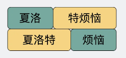

**粘包问题：**

- 正因为字节流没有**任何边界**的特点，当我们选择使用 TCP 发送"夏洛"和"特烦恼"的时候，接收端收到的就是"夏洛特烦恼"，这时候接收端没发区分你是想要表达"夏洛"+"特烦恼"还是"夏洛特"+"烦恼"。
- 说这个的目的是为了告诉大家，纯裸 TCP 是不能直接拿来用的，你需要在这个基础上加入一些自定义的规则，用于区分消息边界。
  - 可以对数据进行包装，如加入**消息头**，**消息头里写清楚一个完整的包长度是多少**
  - 根据这个长度可以继续接收数据，截取出来后它们就是我们真正要传输的**消息体**
  - **消息头**可以放各种东西，比如消息体是否被压缩过和消息体格式之类的，只要上下游都约定好了，互相都认就可以了，这就是所谓的**协议。**

**于是基于 TCP，就衍生了非常多的协议，比如 HTTP 和 RPC。**

- **HTTP** 协议用的比较多，平时上网在浏览器上敲个网址就能访问网页，用到的就是 HTTP 协议。
- **RPC** 又叫做**远程过程调用** ，它本身并不是一个具体的协议，而是一种调用方式。

**有了 HTTP 协议，为什么还需要有 RPC 协议：**

- 从发展历史来说，**HTTP 主要用于 B/S 架构，而 RPC 更多用于 C/S 架构。但现在其实已经没分那么清了，B/S 和 C/S 在慢慢融合** 。很多软件同时支持多端，所以**对外**一般用 HTTP 协议，而**内部集群的微服务** 之间则采用 RPC 协议进行通讯。
- RPC 其实比 HTTP 出现的要早，且比目前主流的 HTTP/1.1 **性能**要更好，所以大部分公司内部都还在使用 RPC。
- **HTTP/2.0** 在 **HTTP/1.1** 的基础上做了优化，性能可能比很多 RPC 协议都要好，但由于是这几年才出来的，所以也不太可能取代掉 RPC。


### **2.19 HTTP-Header中常见的字段有哪些**

HTTP 头部包含了请求或响应的元信息，它可以携带各种字段来描述请求或响应的属性。常见的 HTTP 头部字段包括：

**通用字段**

- **Cache-Control**：控制缓存的行为，如 max-age、no-cache 等。
- **Connection**：控制是否保持连接，如 keep-alive、close 等。

**请求字段**

- **Host**：请求的主机名。
- **User-Agent**：客户端的用户代理字符串。
- **Accept**：客户端能够接收的内容类型。
- **Accept-Encoding**：客户端能够接收的编码类型，如 gzip、deflate 等。
- **Referer**：引荐页面的地址。
- **Cookie**：客户端的 Cookie 信息。
- **Authorization**：用于 HTTP 认证的凭据信息。

**响应字段**

- **Server**：服务器的信息。
- **Set-Cookie**：服务器通过这个头部字段向客户端设置 Cookie。
- **Content-Type**：响应内容的类型，如 text/html、application/json 等。
- **Content-Length**：响应内容的长度。
- **Location**：重定向的目标地址。
- **Last-Modified**：资源的最后修改时间。


## 3 TCP 和 UDP

### **3.1 TCP 的三次握手与四次挥手的内容? TCP 为什么连接是三次握手而断开是四次握手?**

**三次握手相关内容：**

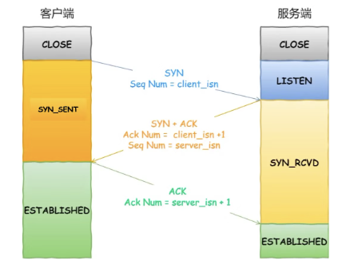

**TCP 必须先建立连接，而建立连接是通过三次握手来进行的：**

- 一开始，客户端和服务端都处于 CLOSE 状态。先是服务端主动监听某个端口，处于 LISTEN 状态
- 客户端会随机初始化序号（client_isn），同时把 SYN 标志位置为 1，表示 SYN 报文。把SYN 报文发送给服务端后，客户端处于 SYN-SENT 状态。
- 服务端收到客户端的 SYN 报文后，首先服务端也随机初始化自己的序号（server_isn），其次把 TCP 首部的「确认应答号」字段填入 client_isn + 1, 接着把 SYN 和 ACK 标志位置为 client+1。把该报文发给客户端，该报文也不包含应用层数据，之后服务端处于 SYN-RCVD 状态。
- 客户端收到服务端报文后，将TCP 首部 ACK 标志位置为 1 ，其次「确认应答号」字段填入 server_isn + 1 ，最后把报文发送给服务端，这次报文可以携带客户到服务端的数据，之后客户端处于 ESTABLISHED 状态。
- 服务端收到客户端的应答报文后，也进入 ESTABLISHED 状态。

**为什么是三次握手而不是两次握手或者四次握手：**

- 不使用「两次握手」和「四次握手」的原因：
  - 「两次握手」：无法防止历史连接的建立，会造成双方资源的浪费，也无法可靠的同步双方序列号；
  - 「四次握手」：三次握手就已经理论上最少可靠连接建立，所以不需要使用更多的通信次数。
- 只有三次握手才可以初始化 Socket、序列号和窗口大小，建立 TCP：
  - 三次握手才可以阻止重复历史连接的初始化（主要原因）
    - 客户端发送 SYN = 90 和 SYN = 100 的两个 SYN 连接请求，则旧的 SYN 报文由于 ACK 确认号不符合会被释放掉（RST请求）。
    - 两次握手无法阻止历史连接，因为服务端没有中间状态给客户端来阻止历史连接，导致服务器创建一个新的历史连接，造成资源浪费。
  - 三次握手才可以同步双方的初始序列号
    - 两次握手只保证了一方的初始序列号能被对方成功接收，没办法保证双方的初始序列号都能被确认接收。
  - 三次握手才可以避免资源浪费
    - 由于没有第三次握手，服务端不清楚客户端是否收到了自己回复的 `ACK` 报文，所以服务端每收到一个 `SYN` 就只能先主动建立一个连接

[4.1 TCP 三次握手与四次挥手面试题](https://xiaolincoding.com/network/3_tcp/tcp_interview.html#为什么是三次握手-不是两次、四次)

**四次挥手相关内容：**

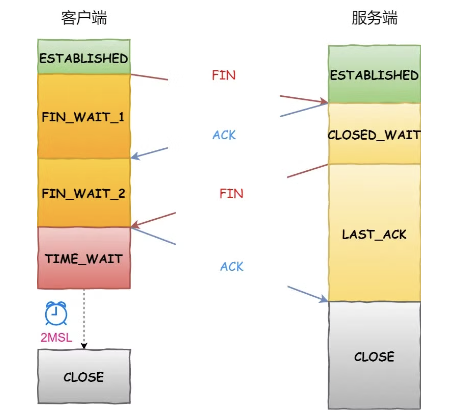

- 客户端打算关闭连接，此时会发送一个 TCP 首部 `FIN` 标志位被置为 `1` 的报文，也即 `FIN` 报文，之后客户端进入 `FIN_WAIT_1` 状态。
- 服务端收到该报文后，就向客户端发送 `ACK` 应答报文，接着服务端进入 `CLOSE_WAIT` 状态。
- 客户端收到服务端的 `ACK` 应答报文后，之后进入 `FIN_WAIT_2` 状态。
- 等待服务端处理完数据后，也向客户端发送 `FIN` 报文，之后服务端进入 `LAST_ACK` 状态。
- 客户端收到服务端的 `FIN` 报文后，回一个 `ACK` 应答报文，之后进入 `TIME_WAIT` 状态
- 服务端收到了 `ACK` 应答报文后，就进入了 `CLOSE` 状态，至此服务端已经完成连接的关闭。
- 客户端在经过 `2MSL` 一段时间后，自动进入 `CLOSE` 状态，至此客户端也完成连接的关闭。

**为什么是四次挥手而不是三次挥手**

从上面过程可知，服务端通常需要等待完成数据的发送和处理，所以服务端的 `ACK` 和 `FIN` 一般都会分开发送，因此是需要四次挥手。

**为什么连接是三次握手而断开是四次握手**

从上面过程可知，服务端通常需要等待完成数据的发送和处理，所以服务端的 `ACK` 和 `FIN` 一般都会分开发送，因此是需要四次挥手。

**四次挥手可以变成三次吗（美团二面）**

- 服务端没有数据要发送并且开启了 TCP 延迟确认机制
- 当被动关闭方在 TCP 挥手过程中，如果「没有数据要发送」，同时「没有开启 TCP_QUICKACK（默认情况就是没有开启，没有开启 TCP_QUICKACK，等于就是在使用 TCP 延迟确认机制）」，那么第二和第三次挥手就会合并传输，这样就出现了三次挥手。
- **所以，出现三次挥手现象，是因为 TCP 延迟确认机制导致的。**


### **3.2 TCP 与 UDP 的区别及使用场景？**

**TCP 与 UDP 的区别：**

- 连接：
  - TCP 是面向连接的传输层协议，传输数据前先要建立连接。
  - UDP 是不需要连接，即刻传输数据。
- 服务对象：
  - TCP 是一对一的两点服务，即一条连接只有两个端点。
  - UDP 支持一对一、一对多、多对多的交互通信
- 可靠性：
  - TCP 是可靠交付数据的，数据可以无差错、不丢失、不重复、按序到达。
  - UDP 是尽最大努力交付，不保证可靠交付数据。
- 拥塞控制、流量控制：
  - TCP 有拥塞控制和流量控制机制，保证数据传输的安全性。
  - UDP 则没有，即使网络非常拥堵了，也不会影响 UDP 的发送速率。
- 首部开销：
  - TCP 首部长度较长，会有一定的开销，首部在没有使用「选项」字段时是 20 个字节，如果使用了「选项」字段则会变长的。
  - UDP 首部只有 8 个字节，并且是固定不变的，开销较小。
- 传输方式：
  - TCP 是流式传输，没有边界，但保证顺序和可靠。
  - UDP 是一个包一个包的发送，是有边界的，但可能会丢包和乱序。
- 分片不同：
  - TCP 的数据大小如果大于 MSS 大小，则会在传输层进行分片，目标主机收到后，也同样在传输层组装 TCP 数据包，如果中途丢失了一个分片，只需要传输丢失的这个分片。
  - UDP 的数据大小如果大于 MTU 大小，则会在 IP 层进行分片，目标主机收到后，在 IP 层组装完数据，接着再传给传输层。

**TCP 与 UDP 的应用场景：**

- TCP 应用场景：FTP 文件传输、HTTP 以及 HTTPS
- UDP 应用场景：DNS、视频音频等多媒体通信，广播通信

**MTU 和 MSS 区别是什么 ：**

- MTU：Maximum Transmit Unit，最大传输单元，即物理链路层提供给上层的最大一次传输数据的大小，如果 IP 层有 ≤ 1500 bytes 需要发送，则一个 IP 包就可以完成发送任务；否则需要分片才能完成发送。
- MSS ：Max Segment Size，最大报文段长度，是 TCP 提交给 IP 层的最大数据长度，由 TCP 协议进行分片。例如，如果底层物理接口 MTU = 1500 bytes，则 MSS = 1500 - 20（IP Header）- 20（TCP Header）。
- 计算关系：MSS + IP Header + TCP Header = MTU


### **3.3 为什么 DNS 协议使用 UDP？只使用了 UDP 吗？**

- 一般DNS报文都很短，比如查询某域名对应的A记录或者AAAA记录，长度为几十到几百字节，很少有超过512字节的情况。
- TCP的优点是可靠传输任意长度的数据（流式传输），但代价必须先创建会话，这需要双方依次发送 sync、sync/ack、ack三个IP包。如果一次通信的延迟是T，那么基于TCP的DNS查询最小耗时为4T。而直接使用UDP的耗时为2T。
- DNS查询和响应数据都足够小，使用UDP完全没问题。如果数据丢失，超时重发就好。TCP的优势完全发挥不出来。


### **3.4 TCP 是如何保证传输的可靠性? ( 重传机制、流量控制、拥塞控制。大厂面试经常会问的)**

TCP 是**面向连接的、可靠的、基于字节流** 的传输层通信协议。

- 重传机制：TCP 实现可靠传输的方式之一，是通过序列号与确认应答。

  - 超时重传：
    - 如何设置超时重传时间 RTO：根据动态收集 RTT 的值
    - 每当遇到一次超时重传的时候，都会将下一次超时时间间隔设为先前值的两倍。两次超时，就说明网络环境差，不宜频繁反复发送。
  - 快速重传：
    - 收到三次同样的 ACK 会触发重传机制，会在定时器过期之前，重传丢失的报文段。
    - 问题：重传的时候，是重传一个，还是重传所有的问题。
  - SACK 方法-选择性确认：
    - TCP 头部「选项」字段里加一个 `SACK` 的东西，它可以将已收到的数据的信息发送给「发送方」
    - 只重传丢失的数据
  - Duplicate SACK 方法：
    - 使用了 SACK 来告诉「发送方」有哪些数据被重复接收了
    - 可以让「发送方」知道，是发出去的包丢了，还是回应的 ACK 包丢了

- 滑动窗口：

  - 窗口大小就是指无需等待确认应答，而可以继续发送数据的最大值。
  - 窗口的实现实际上是操作系统开辟的一个缓存空间，发送方主机在等到确认应答返回之前，必须在缓冲区中保留已发送的数据。如果按期收到确认应答，此时数据就可以从缓存区清除。
  - 累计确认机制：不需要每个数据包都需要ACK应答

- 流量控制：

  - 滑动窗口控制流量、窗口关闭、窗口探测、糊涂窗口综合症

  - 如何避免糊涂窗口综合症：

    接收方得满足「不通告小窗口给发送方」+ 发送方开启 Nagle 算法，才能避免糊涂窗口综合症。

    - 让接收方不通告小窗口给发送方
    - 让发送方避免发送小数据

- 拥塞控制：

  - 发送窗口 = 接收窗口和拥塞窗口的最小值

    - 网络中没有发生阻塞，拥塞窗口就会变大
    - 网络中出现了拥塞，拥塞窗口就会变小
    - 发送方没有在规定时间内接收到ACK应答报文，就是发生了超时重传，就会认为网络出现了拥塞

  - **慢启动**

    - 当发送方每收到一个 ACK，拥塞窗口 cwnd 的大小就会加 1。
    - 慢启动算法，发包的个数是指数性的增长。
    - 当 `cwnd` >= `ssthresh` 时，就会使用「拥塞避免算法」，一般为65535字节

  - **拥塞避免**

    - 每当收到一个 ACK 时，cwnd 增加 1/cwnd
    - 慢启动算法的指数增长变成了线性增长

  - 拥塞发生

    - 当发生了「超时重传」，则就会使用拥塞发生算法，`ssthresh` 设为 `cwnd/2` ，cwnd 恢复为 cwnd 初始化值
    - 当发生了「快速重传算法」，TCP 认为这种情况不严重，因为大部分没丢，只丢了一小部分，则 `cwnd = cwnd/2` ，`sthresh = cwnd` ，进入快速恢复算法。

    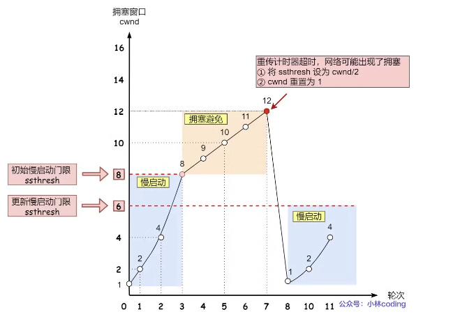

  - **快速恢复**

    - 进入快速恢复之前，设置 `cwnd = cwnd/2` ，`ssthresh = cwnd`
    - 快速恢复开始，将拥塞窗口设置为 `cwnd = ssthresh + 3`
    - 重传丢失的数据包
    - 如果再收到重复的 ACK，那么 cwnd 增加 1
    - 如果收到新数据的 ACK 后，把 cwnd 设置为第一步中的 ssthresh 的值，原因是该 ACK 确认了新的数据

    

[4.2 TCP 重传、滑动窗口、流量控制、拥塞控制](https://xiaolincoding.com/network/3_tcp/tcp_feature.html#快速重传)


### **3.5 使用 TCP 的协议有哪些？使用 UDP 的协议有哪些？HTTP 基于 TCP 还是 UDP？**

**使用 TCP 的协议：** HTTP、HTTPS、FTP、SSH、SMTP、POP

**使用UDP的协议：** HTTP、DHCP、DNS

HTTP 1.1/2.0 基于TCP，HTTP 3.0 使用基于 UDP 的QUIC协议。


### **3.6 TIME_WAIT 状态考察**

- 为什么 TIME_WAIT 等待的时间是 2MSL
  - Linux 中 MSL 时间为30s，其认为30s是报文在网络中的最大生存时间。一来一回就是 2 MSL，如果 ACK 请求丢失，那么服务端重新发送 FIN 的时间不会超出 2 MSL；超出了 2MSL 可以证明 ACK 已经被服务端接收到了。
- 为什么需要 TIME_WAIT 状态
  - 防止历史连接中的数据，被后面相同四元组的连接错误的接收；
  - 保证「被动关闭连接」的一方，能被正确的关闭；
- TIME_WAIT 过多有什么危害
  - 服务端发起的四次挥手：占用系统资源，比如文件描述符、内存资源、CPU 资源、线程资源等。
  - 客户端发起的四次挥手：占用端口资源，端口资源也是有限的，一般可以开启的端口为 `32768～61000`，也可以通过 `net.ipv4.ip_local_port_range`参数指定范围。
- 如何优化 TIME_WAIT
  - 复用处于 TIME_WAIT 的socket为新的连接：打开 `net.ipv4.tcp_tw_reuse` 和 `net.ipv4.tcp_timestamps` 选项
  - 重置处于 TIME_WAIT 的链接：`net.ipv4.tcp_max_tw_buckets`
- 服务器出现大量 TIME_WAIT 的原因
  - 首先要知道 TIME_WAIT 状态是主动关闭连接方才会出现的状态，所以如果服务器出现大量的 TIME_WAIT 状态的 TCP 连接，就是说明服务器主动断开了很多 TCP 连接。
  - HTTP 没有使用长连接（**排查下是否客户端和服务端都开启了 HTTP Keep-Alive**）
  - HTTP 长连接超时（可以往网络问题的方向排查，比如是否是因为网络问题，导致客户端发送的数据一直没有被服务端接收到，以至于 HTTP 长连接超时）
  - HTTP 长连接的请求数量达到上限（调大 nginx 的 keepalive_requests 参数就行）
- 服务器出现大量 CLOSE_WAIT 的原因
  - 当服务端出现大量 CLOSE_WAIT 状态的连接的时候，通常都是代码的问题，这时候我们需要针对具体的代码一步一步的进行排查和定位，主要分析的方向就是服务端为什么没有**调用 close**


### **3.7 为什么 IP 可以分片，TCP 还需要进行分片**

- 假设有一份数据，较大，且在TCP层不分段，如果这份数据在发送的过程中出现**丢包**现象，TCP会发生重传，那么重传的就是这一大份数据
- 如果TCP把这份数据，分段为N个小于等于MSS长度的数据包，那么TCP重传的时候也只是重传那一小部分的MSS段。效率会比TCP不分段时更高。

[动图图解！既然IP层会分片，为什么TCP层也还要分段？](https://zhuanlan.zhihu.com/p/372863051)

**8.阐述一下客户端 connect() 方法和服务端的 accept() 方法**

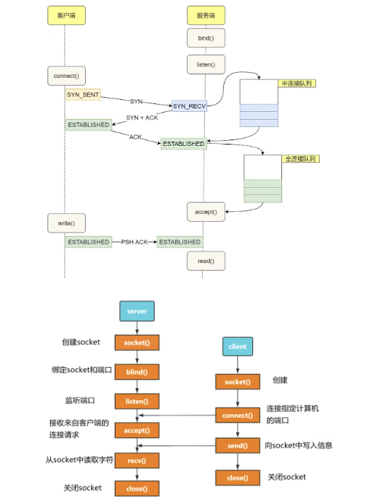

- 第一步：在客户端和服务端都要创建 socket，服务端来调用 bind 来绑定socket 和 端口

- 第二步：服务器调用 **listen()** 开始监听连接

- 第三步：当客户端调用 

  connect()

   连接对应的端口时，开始三次握手阶段

  - 客户端发送 SYN
  - 服务端发送 SYN + ACK 并将 socket 放入半连接队列
  - 客户端发送 ACK， 服务端收到 socket 这之后将连接放入全连接队列

- 第四步：服务端调用 **accept()** 阻塞等待来自客户端的连接请求

- 第五步：双方之间开始通信

```java
public class Server {
   public static void main(String[] args) {
         ServerSocket ss = new ServerSocket(8888);
         System.out.println("启动服务器....");
         
         Socket s = ss.accept();
         System.out.println("客户端:"+s.getInetAddress().getLocalHost()
         +"已连接到服务器");
   }
}

public class Client {
   public static void main(String[] args) {
         Socket s = new Socket("127.0.0.1",8888);
      }
   }
}
```


## 4 WebSocket

首先考虑一个问题：前端页面展示二维码之后，如何返回给前端用户：

- 前端使用 HTTP 请求不断轮询
- 使用长连接，只要在连接时间内收到了扫码请求，就立即返回给客户端网页；如果超时，就立马发起下一次请求（百度网盘使用的方式）
- 可以使用服务器推送技术，利用 WebSocket 将数据推送给前端


### **4.1 什么是 WebSocket?一般用来做什么?**

WebSocket 是一种基于 TCP 连接的全双工通信协议，即客户端和服务器可以同时发送和接收数据。

- WebSocket 协议本质上是应用层的协议
- **用于弥补 HTTP 协议在持久通信能力上的不足**
- 持久性的进行双向数据传输

WebSocket 的常见应用场景：

- 视频弹幕
- 实时消息推送
- 实时游戏对战
- 多用户协同编辑
- 社交聊天


### **4.2 WebSocket 和 HTTP 有什么区别?**

**WebSocket 和 HTTP 两者都是基于 TCP 的应用层协议，都可以在网络中传输数据。**

下面是二者的主要区别：

- 通信类别：
  - WebSocket 是一种双向实时通信协议
  - HTTP 是一种单向通信协议
- 请求地址前缀：
  - WebSocket 使用 ws:// 或 wss://
  - HTTP 使用 http:// 或 https:// 作为协议前缀
- 通信格式：
  - WebSocket 通信数据格式比较轻量，网络开销小
  - HTTP 通信每次都要携带完整的头部，网络开销较大（HTTP2.0减小了头部压缩）


### **4.3 WebSocket 的工作过程是什么样的?**

WebSocket 的工作过程可以分为以下几个步骤：

- 客户端向服务器发送一个 HTTP 请求，请求头中包含 `Upgrade: websocket` 和 `Sec-WebSocket-Key` 等字段，表示要求升级协议为 WebSocket；
- 服务器收到这个请求后，会进行升级协议的操作，如果支持 WebSocket，它将回复一个 HTTP 101 状态码，响应头中包含 ，`Connection: Upgrade`和 `Sec-WebSocket-Accept: xxx` 等字段、表示成功升级到 WebSocket 协议。
- 客户端和服务器之间建立了一个 WebSocket 连接，可以进行双向的数据传输。数据以帧（frames）的形式进行传送，WebSocket 的每条消息可能会被切分成多个数据帧（最小单位）。发送端会将消息切割成多个帧发送给接收端，接收端接收消息帧，并将关联的帧重新组装成完整的消息。
- 客户端或服务器可以主动发送一个关闭帧，表示要断开连接。另一方收到后，也会回复一个关闭帧，然后双方关闭 TCP 连接。

另外，建立 WebSocket 连接之后，通过心跳机制来保持 WebSocket 连接的稳定性和活跃性。


### **4.4 SSE 与 WebSocket 该如何选择?**

SE 与 WebSocket 作用相似，都可以建立服务端与浏览器之间的通信，实现服务端向客户端推送消息，但还是有些许不同：

- 服务器支持：
  - SSE 是基于 HTTP 协议的，它们不需要特殊的协议或服务器实现即可工作；
  - WebSocket 需单独服务器来处理协议。
- 通信方向：
  - SSE 单向通信，只能由服务端向客户端单向通信；
  - WebSocket 全双工通信，即通信的双方可以同时发送和接受信息。
- 断线重连：
  - SSE 默认支持断线重连；
  - WebSocket 则需要自己实现。
- 消息格式：
  - SSE 只能传送文本消息，二进制数据需要经过编码后传送；
  - WebSocket 默认支持传送二进制数据。

不需要从客户端发送数据。而你只需要一些服务器操作的更新。比如：站内信、未读消息数、状态更新、股票行情、监控数量等场景，SEE更有优势。


## 5 PING

### **5.1 PING 命令的作用是什么?**

PING 命令是一种常用的网络诊断工具，经常用来测试网络中主机之间的连通性和网络延迟。PING 命令的输出结果通常包括以下几部分信息：

- **ICMP Echo Request（请求报文）信息** ：序列号、TTL（Time to Live）值。
- **目标主机的域名或 IP 地址**：输出结果的第一行。
- **往返时间（RTT，Round-Trip Time）** ：从发送 ICMP Echo Request（请求报文）到接收到 ICMP Echo Reply（响应报文）的总时间，用来衡量网络连接的延迟。
- **统计结果（Statistics）** ：包括发送的 ICMP 请求数据包数量、接收到的 ICMP 响应数据包数量、丢包率、往返时间（RTT）的最小、平均、最大和标准偏差值。

如果 PING 对应的目标主机无法得到正确的响应，则表明这两个主机之间的连通性存在问题（有些主机或网络管理员可能禁用了对 ICMP 请求的回复，这样也会导致无法得到正确的响应）。如果往返时间（RTT）过高，则表明网络延迟过高。


### **5.2 什么是 TTL 值**

存活时间（英语：Time To Live，简写TTL）是电脑网络技术的一个术语：

- 一个数据包在经过一个路由器时，可传递的最长距离（跃点数）。
- 每当数据包经过一个路由器时，其存活次数就会被减一。当其存活次数为0时，路由器便会取消该数据包转发，IP网络的话，会向原数据包的发出者发送一个ICMP TTL数据包以告知跃点数超限。
- 其设计目的是防止数据包因不正确的路由表等原因造成的无限循环而无法送达及耗尽网络资源。


### **5.3 什么是ICMP**

ICMP 全称是 **Internet Control Message Protocol**，也就是**互联网控制报文协议**。

网络包在复杂的网络传输环境里，常常会遇到各种问题。所以需要传出消息，报告遇到了什么问题，这样才可以调整传输策略，以此来控制整个局面。

ICMP 的主要功能：

- 确认IP包是否成功送达目标地址
- 报告发送过程中IP包被废弃的原因和改善网络设置

ICMP 的这种通知消息会使用 IP 进行发送 。ICMP通常分为两类：

- **查询报文类型**：向目标主机发送请求并期望得到响应。
- **差错报文类型**：向源主机发送错误信息，用于报告网络中的错误情况。


### **5.4 PING 命令的工作原理是什么?**

PING 基于网络层的 **ICMP（Internet Control Message Protocol，互联网控制报文协议）**，其主要原理就是通过在网络上发送和接收 ICMP 报文实现的。

PING 用到的 ICMP Echo Request（类型为 8 ） 和 ICMP Echo Reply（类型为 0） 属于查询报文类型 。

- PING 命令会向目标主机发送 ICMP Echo Request。
- 如果两个主机的连通性正常，目标主机会返回一个对应的 ICMP Echo Reply。

**PING 命令的工作流程：由主机 A → 发送 PING → 主机 B  **

- ping 命令执行的时候，源主机首先会构建一个 ICMP 回送请求消息数据包。ICMP 数据包内包含多个字段，最重要的是三个：
  - 第一个是**类型**，对于回送请求消息而言该字段为 `8`；
  - 另外一个是**序号**，主要用于区分连续 ping 的时候发出的多个数据包。
  - 为了能够计算往返时间 `RTT`，它会在报文的数据部分插入发送时间。
- 由 ICMP 协议将这个数据包连同地址 192.168.1.2 一起交给 IP 层。接下来，需要加入 `MAC` 头，依据以太网的介质访问规则，将它们传送出去。
- 主机 B 会构建一个 ICMP 回送响应消息数据包：
  - 回送响应数据包的**类型** 字段为 `0`
  - **序号**为接收到的请求数据包中的序号，然后再发送出去给主机 A
- 在规定的时候间内，源主机如果没有接到 ICMP 的应答包，则说明目标主机不可达；如果接收到了 ICMP 回送响应消息，则说明目标主机可达。


## 6 DNS

### **6.1 DNS 是什么?解决了什么问题?**

DNS（Domain Name System）域名管理系统，是当用户使用浏览器访问网址之后，使用的第一个重要协议。

- DNS 要解决的是**域名和 IP 地址的映射问题**。
- 目前 DNS 的设计采用的是分布式、层次数据库结构，**DNS 是应用层协议，它可以在 UDP 或 TCP 协议之上运行，端口为 53** 。


### **6.2 DNS 能解析端口吗?**

- 在DNS解析中，只能将域名解析为IP地址，并不能指定端口号。
- 端口号是在TCP/IP协议中的概念，用于区分同一台主机上不同的网络应用程序。 如果你希望访问的是非默认端口（比如非80端口）的服务，需要在访问IP地址后面加上端口号。


### **6.3 DNS 服务器有哪些?**

DNS 服务器自底向上可以依次分为以下几个层级:

- 根 DNS 服务器。根 DNS 服务器提供 TLD 服务器的 IP 地址。
- 顶级域 DNS 服务器（TLD 服务器）。顶级域是指域名的后缀，如`com`、`org`、`net`和`edu`等。
- 权威 DNS 服务器。在因特网上具有公共可访问主机的组织机构必须提供公共可访问的 DNS 记录，这些记录将这些主机的名字映射为 IP 地址。
- 本地 DNS 服务器。每个 ISP（互联网服务提供商）都有一个自己的本地 DNS 服务器。


### **6.4 DNS 解析的过程是什么样的?**

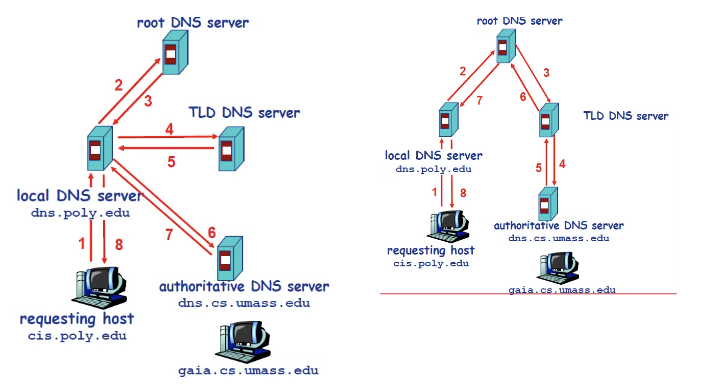

DNS 的查询解析过程分为两种模式：左边为迭代方式，右边为递归方式

- 迭代：
  - 由各个路过的 DNS 服务器通过递归调用查询 IP 地址。
- 递归：
  - 由本地 DNS 服务器分别向其他服务器寻找对应的 IP 地址。
- 实践中从请求主机到本地 DNS 服务器的查询是递归的，其余的查询时迭代的。

本地 DNS 通常已经缓存了很多 TLD DNS 服务器，所以在实际查找过程中，无需访问根服务器。根服务器通常是被跳过的，不请求的。这样可以提高 DNS 查询的效率和速度，减少对根服务器和 TLD 服务器的负担。


### **6.5 DNS 劫持了解吗?如何应对?**

DNS 劫持是一种网络攻击，它通过修改 DNS 服务器的解析结果，使用户访问的域名指向错误的 IP 地址，从而导致用户无法访问正常的网站，或者被引导到恶意的网站。DNS 劫持有时也被称为 DNS 重定向、DNS 欺骗或 DNS 污染。

DNS 劫持的应对方法：

- 防火墙，网络安全措施
- 基于 HTTPS 构建 DNS 信息的安全传输


## 7 **IP**

### **7.1 IP 协议的作用是什么?**

**IP（Internet Protocol，网际协议）** 是 TCP/IP 协议中最重要的协议之一，属于网络层的协议，主要作用是：**实现主机与主机之间的通信，也叫点对点（end to end）通信**。

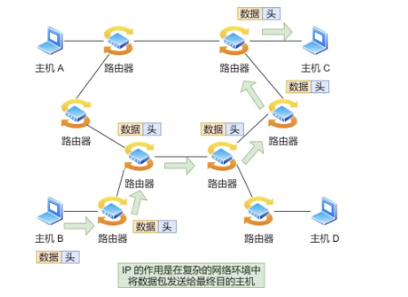

**网络层与数据链路层有什么关系呢？**

- **MAC 的作用则是实现「直连」的两个设备之间通信（相连传输）**
- **IP 则负责在「没有直连」的两个网络之间进行通信传输（远程定位）**

**IP 则负责在「没有直连」的两个网络之间进行通信传输**

在网络中数据包传输中：

- 源IP地址和目标IP地址在传输过程中是不会变化的（前提：没有使用 NAT 网络）
- 源 MAC 地址和目标 MAC 一直在变化


### **7.2 什么是 IP 地址?IP 寻址如何工作?**

每个连入互联网的设备都被分配一个 **IP 地址作为唯一标识符：**

- 网络设备发送 IP 数据包时，数据包中包含了 **源 IP 地址** 和 **目的 IP 地址** 。
- 网络设备根据目的 IP 地址来判断数据包的目的地，并将数据包转发到正确的目的地网络或子网络，从而实现了设备间的通信。

IP 地址（IPv4 地址）由 `32` 位正整数来表示：

- 最大允许 43 亿台计算机连接到网络
- IP 地址并不是根据主机台数来配置的，而是以网卡。像服务器、路由器等设备都是有 2 个以上的网卡，也就是它们会有 2 个以上的 IP 地址。
- 根据与子网掩码进行比较，IP地址又可以划分为 网络号 + 主机号 的形式。

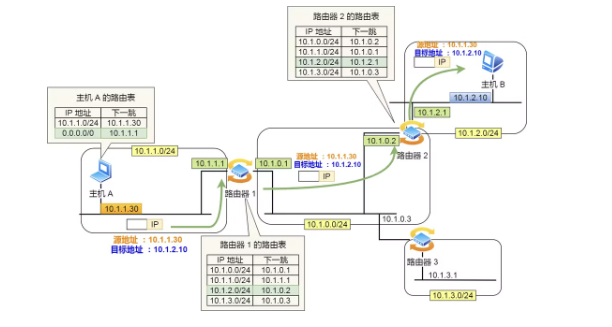

在发送 IP 包时，首先要确定 IP 包首部中的目标地址，再从路由控制表中找到与该地址具有**相同网络地址**的记录，根据该记录将 IP 包转发给相应的下一个路由器。如果路由控制表中存在多条相同网络地址的记录，就选择相同位数最多的网络地址，也就是**最长匹配**。

1. 主机 A 要发送一个 IP 包，其源地址是 `10.1.1.30` 和目标地址是 `10.1.2.10`，由于没有在主机 A 的路由表找到与目标地址 `10.1.2.10` 相同的网络地址，于是包被转发到默认路由（路由器 `1` ）
2. 路由器 `1` 收到 IP 包后，也在路由器 `1` 的路由表匹配与目标地址相同的网络地址记录，发现匹配到了，于是就把 IP 数据包转发到了 `10.1.0.2` 这台路由器 `2`
3. 路由器 `2` 收到后，同样对比自身的路由表，发现匹配到了，于是把 IP 包从路由器 `2` 的 `10.1.2.1` 这个接口出去，最终经过交换机把 IP 数据包转发到了目标主机


### **7.3 IPv4 和 IPv6 有什么区别?**

- 地址长度：
  - IPv4 的地址是 32 位的，大约可以提供 42 亿个地址
  - IPv6 的地址是 `128` 位的，可以保证地球上的每粒沙子都能被分配到一个 IP 地址。
- 自动配置：
  - IPv4 分配地址需要 DCHP 服务器
  - IPv6 地址根据接口标识和网络前缀生成全局唯一的，而无需依赖 DHCP服务器，简化了网络配置和管理。
- NAT成为可选项：
  - IPv4 通过NAT技术扩展可用接入设备
  - IPv6 地址资源充足，可以给全球每个设备一个独立的地址。
- 对标头结构进行了改进：
  - IPv6 标头结构相较于 IPv4 更加简化和高效
- 可选的扩展头：
  - 允许在 IPv6 标头中添加不同的扩展头（Extension Headers），用于实现不同类型的功能和选项。
- ICMPv6：
  - IPv6 中的 ICMP 有了一些改进，如邻居发现、路径 MTU 发现等功能的改进，从而提升了网络的可靠性和性能。

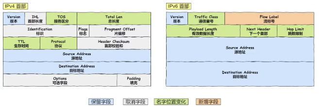

IPv6 相比 IPv4 的首部改进：

- **取消了首部校验和字段。** 因为在数据链路层和传输层都会校验，因此 IPv6 直接取消了 IP 的校验。
- **取消了分片/重新组装相关字段。** 分片与重组是耗时的过程，IPv6 不允许在中间路由器进行分片与重组，这种操作只能在源与目标主机，这将大大提高了路由器转发的速度。
- **取消选项字段。** 选项字段不再是标准 IP 首部的一部分了，但它并没有消失，而是可能出现在 IPv6 首部中的「下一个首部」指出的位置上。删除该选项字段使的 IPv6 的首部成为固定长度的 `40` 字节。


### **7.4 NAT的作用是什么**

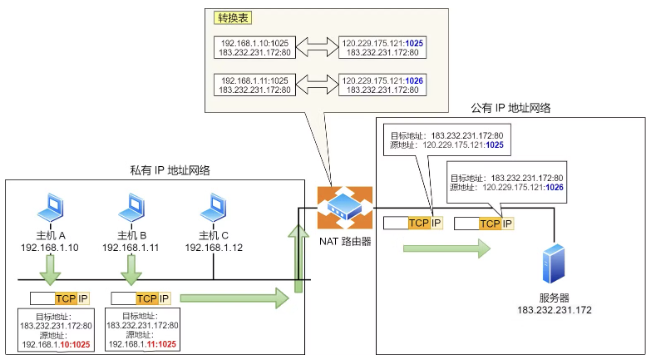

**NAT（Network Address Translation，网络地址转换）** 主要用于在不同网络之间转换 IP 地址。

- 将私有 IP 地址（如在局域网中使用的 IP 地址）映射为公有 IP 地址（在互联网中使用的 IP 地址）或者反向映射
- 实现局域网内的多个设备通过单一公有 IP 地址访问互联网。

NAT 不光可以缓解 IPv4 地址资源短缺的问题，还可以隐藏内部网络的实际拓扑结构，使得外部网络无法直接访问内部网络中的设备，从而提高了内部网络的安全性。


### **7.5 ARP协议是如何工作的**

主机的路由表中可以找到下一跳的 IP 地址，所以可以通过 **ARP 协议**，求得下一跳的 MAC 地址。ARP 的工作原理将分两种场景讨论：

- 同一局域网内的 MAC 寻址：广播问询，单播响应
  - 检索自己的 ARP 表，发现 ARP 表中并无主机 B 的 IP 地址对应的映射条目
  - 主机 A 将构造一个 ARP 查询分组，并将其广播到所在的局域网中
    - MAC 广播地址：FF-FF-FF-FF-FF-FF
  - 每一个设备都会收到该分组，并检查查询分组的接收 IP 地址是否为自己的 IP 地址，不是的话丢弃。
  - 主机 B 收到了查询分组之后，构造 ARP 响应分组发送给主机 A。
  - 主机 A 终将收到主机 B 的响应分组，提取出该分组中的 IP 地址和 MAC 地址后，构造映射信息，加入到自己的 ARP 表中。
- 从一个局域网到另一个局域网中的网络设备的寻址
  - 主机 A 查询 ARP 表，期望寻找到目标路由器的本子网接口的 MAC 地址
  - 主机 A 未能找到目标路由器的本子网接口的 MAC 地址，将采用 ARP 协议，问询到该 MAC 地址，由于目标接口与主机 A 在同一个子网内，该过程与同一局域网内的 MAC 寻址相同
  - 主机 A 通过 IP 协议将数据包发送给路由器。
  - 目标接口接收到了主机 A 发过来的链路层帧，解析，根据目的 IP 地址，查询转发表，将该 IP 数据报转发到与主机 B 所在子网相连的接口上。
  - 路由器接口查询 ARP 表，期望寻找到主机 B 的 MAC 地址。
  - 路由器接口如未能找到主机 B 的 MAC 地址，将采用 ARP 协议，广播问询，单播响应，获取到主机 B 的 MAC 地址。
  - 路由器接口将对 IP 数据报重新封装成链路层帧，目标 MAC 地址为主机 B 的 MAC 地址，单播发送，直到目的地。

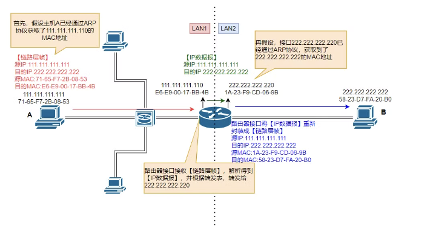

注意：路由器作为互联设备，具有多个接口，每个接口同样也应该具备不重复的 IP 地址和 MAC 地址。在讨论 ARP 表时，路由器的多个接口都各自维护一个 ARP 表，而非一个路由器只维护一个 ARP 表。

[交换机和路由器有什么区别？网关和路由又是什么意思？简单说网络2-交换机与路由器_哔哩哔哩_bilibili](https://www.bilibili.com/video/BV1fU4y1t7Ju/?spm_id_from=333.337.search-card.all.click&vd_source=9a47b26e060b09ee3b6edc173c4809ea)


## 8 TIME_WAIT 面试题详解

了解了 TCP 四次挥手，在四次挥手的过程中，发起连接断开的一方会有一段时间处于 TIME_WAIT 的状态，你知道 TIME_WAIT 是用来做什么的么？

### **8.1 TIME_WAIT 发生的场景**

在一次升级线上应用服务之后，我们发现该服务的可用性变得时好时坏：

- 一段时间可以对外提供服务，一段时间突然又不可以
- 使用 netstat 命令查看后才发现，主机上有成千上万处于 TIME_WAIT 状态的连接

**上述场景产生的原因分析：**

- 每个连接会占用一个本地端口，当在高并发的情况下，**TIME_WAIT 状态的连接过多，多到把本机可用的端口耗尽**，应用服务对外表现的症状，就是不能正常工作了。
- 当过了一段时间之后，处于 **TIME_WAIT 的连接被系统回收并关闭后**，释放出本地端口可供使用，应用服务对外表现为，可以正常工作。
- 周而复始，便会出现了一会儿不可以，过一两分钟又可以正常工作的现象

**为什么会产生很多 TIME_WAIT 状态呢：**

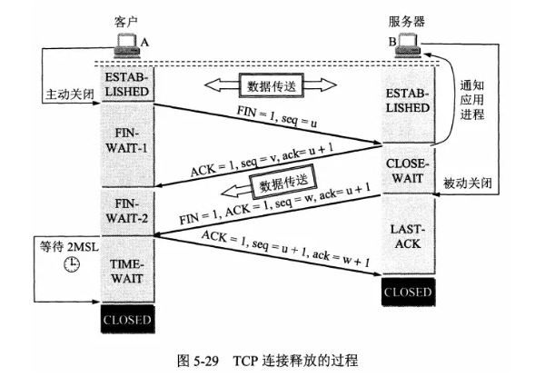

这需要根据 TCP 的四次挥手机制来分析：

- 主机 1 先发送 FIN 报文，主机 2 进入 CLOSE_WAIT 状态，并发送一个 ACK 应答

- 主机 2 通过 read 调用获得 EOF，并将此结果**通知应用程序进行主动关闭操作**，发送 FIN 报文

- 主机 1 在接收到 FIN 报文后发送 ACK 应答，此时主机 1 进入 **TIME_WAIT** 状态

- 主机 1 在 TIME_WAIT 停留持续时间是固定的，是最长

  分节

  生命期 MSL（maximum segment lifetime）的两倍，一般称之为 2MSL

  - Linux 系统里有一个硬编码的字段，名称为**TCP_TIMEWAIT_LEN**，其值为 60 秒。也就是说，Linux 系统停留在 TIME_WAIT 的时间为固定的 **60** 秒。

**面试牢记：你一定要记住一点，只有【发起连接终止的一方】会进入 TIME_WAIT 状态。**


### **8.2 TIME_WAIT 的作用**

为什么不直接进入 CLOSED 状态，而要停留在 TIME_WAIT 这个状态？

**TIME_WAITED 的优点：**

- 确保最后的 ACK 能让被动关闭方接收，从而帮助其正常关闭
  - 如果图中主机 1 的 ACK 报文没有传输成功，那么主机 2 就会重新发送 FIN 报文。如果主机 1 没有维护 TIME_WAIT 状态，而直接进入 CLOSED 状态，它就失去了当前状态的上下文，只能回复一个 RST 操作，从而导致被动关闭方出现错误。
- 和连接“化身”、报文迷走有关系，为了让旧连接的重复分节在网络中自然消失（之前走丢的旧的传输ACK）
  - 在网络中，经常会发生报文经过一段时间才能到达目的地的情况，产生的原因是多种多样的，如路由器重启，链路突然出现故障等。
  - 如果迷走报文到达时，发现 **TCP 连接四元组（源 IP，源端口，目的 IP，目的端口）** 所代表的连接不复存在，那么很简单，这个报文自然丢弃。
  - 我们考虑这样一个场景，在原连接中断后，又重新创建了一个相同的 TCP 四元组，如果迷失报文经过一段时间也到达，那么这个报文会被误认为是新连接的一个 **TCP 分节**，这样就会对 TCP 通信产生影响。
  - **TCP 就设计出了这么一个机制，经过 2MSL 这个时间，足以让两个方向上的分组都被丢弃，使得原来连接的分组在网络中都自然消失，再出现的分组一定都是新化身所产生的。**

**TIME_WAITED 的缺点：**

- 内存资源占用过多，目前看来不是太严重，基本可以忽略
- 对端口资源的占用过多，一个TCP连接至少消耗一个本地端口
  - 端口资源也是有限的，一般可以开启的端口为 32768～61000


### **8.3 如何优化 TIME_WAIT**

在高并发的情况下，如果我们想对 TIME_WAIT 做一些优化，来解决我们一开始提到的例子，该如何办呢？

- 调低 TCP_TIMEWAIT_LEN，重新编译系统
  - 这个方法是一个不错的方法，缺点是需要“一点”内核方面的知识，能够重新编译内核。
  - 我想这个不是大多数人能接受的方式。
- net.ipv4.tcp_tw_reuse：更安全的设置，可以复用 TIME_WAIT 的状态给其他连接
  - 从协议角度理解如果是安全可控的，可以复用处于 TIME_WAIT 的套接字为新的连接所用。
    - 只适用于连接发起方（C/S 模型中的客户端）
    - 对应的 TIME_WAIT 状态的连接创建时间超过 1 秒才可以被复用
  - 使用这个选项，还有一个前提，需要打开**对 TCP 时间戳**的支持，即**net.ipv4.tcp_timestamps=1**（默认即为 1）


### **8.4 为什么要用 MSL**

**最大分组 MSL 是 TCP 分组在网络中存活的最长时间，你知道这个最长时间是如何达成的？换句话说，是怎么样的机制，可以保证在 MSL 达到之后，报文就自然消亡了呢？**

- 数据报文可能在发送途中延迟但最终会到达，因此要等老的“迷路”的重复报文段在网络中过期失效，这样可以避免用相同源端口和目标端口创建新连接时收到旧连接姗姗来迟的数据包，造成数据错乱。
- TIME_WAIT 等待时间是 2 个 MSL：
  - 1 个 MSL 确保四次挥手中主动关闭方最后的 ACK 报文最终能达到对端
  - 1 个 MSL 确保对端没有收到 ACK 重传的 FIN 报文可以到达
  - 最坏情况下，这个 ACK 在 1MSL 时到达 B；此时 B 在收到这个 ACK 的前一刹那，一直在重传 FIN，这个 FIN 最坏会在 1MSL 时间内消失。因此从 A 发送 ACK 的那一刹那开始，等待 2MSL 可以保证 A 发送的最后一个 ACK，和 B 发送的最后一个 FIN 都在网络中消失

**SO_REUSEADDR 和 SO_REUSEPORT 可以详细说下作用吗？**

- 这是为了解决如何快速复用处于TIME_WAIT的连接
- 不设置这个选项，处于TIME_WAIT的连接是不能被快速复用的，必须等待系统回收连接才可以，如果这个时候开启服务器端口，会报地址已被占用的错误。

**这个SO_REUSEADDR，是复用端口的意思吗？不过复用端口数据不混乱了？**

- 不是端口复用，是复用处于 TIME_WAIT 的套接字为新的连接所用。可以通过TCP时间戳来解决2MSL的问题
- 处于 TIME_WAIT 的套接字为新的连接所用，通过时间戳可以知道旧连接的FIN是一个无效的FIN，从而直接回复RST，让旧连接直接出错退出。


## 9 TCP - UDP - IP 头部总结

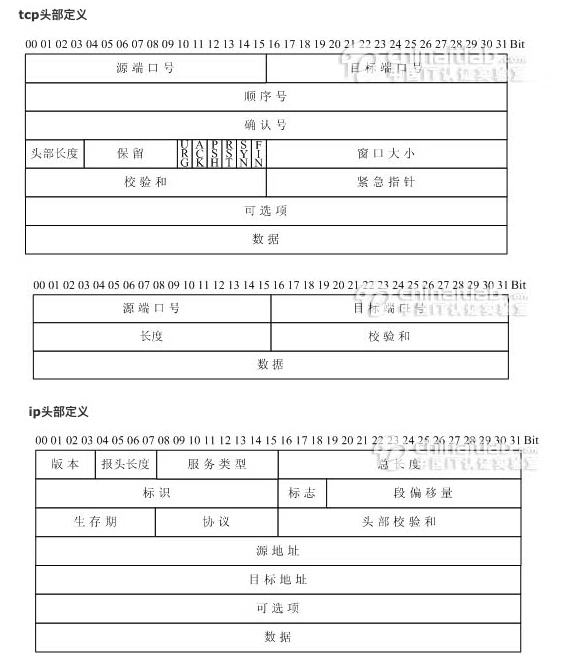