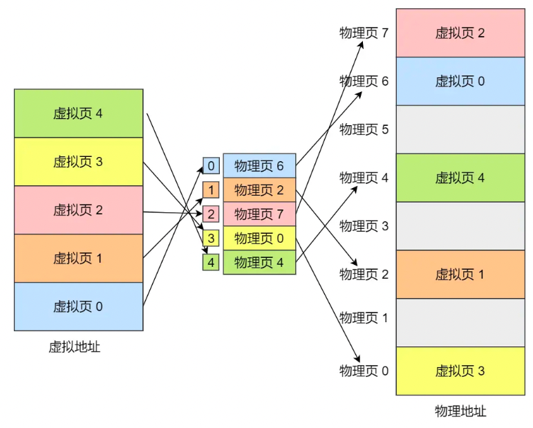
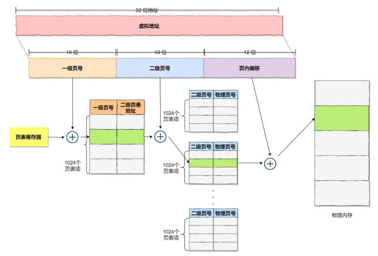
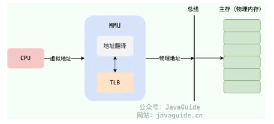

[TOC]

```
操作系统 知识点
    1 进程和线程
        1.1 进程和线程的区别
        1.2 什么是上下文 - 上下文 = 依赖的环境
        1.3 什么是 CPU 中断
        1.4 进程有哪几种状态? （更多的考线程）
        1.5 进程间的通信方式
        1.6 线程间的同步的方式
        1.7 PCB是什么？包含哪些信息？
        1.8 进程的调度算法
        1.9 什么是用户态和内核态
        1.10 什么是系统调用
        1.11 什么是僵尸进程和孤儿进程？如何查看僵尸进程？
        1.12 什么是守护线程
        1.13 什么是 DMA 技术? 为什么要有 DMA 技术?
        1.14 传统的文件传输有多糟糕
        1.15 什么是零拷贝? 如何实现零拷贝?
        1.16 PageCache 有什么作用
        1.17 对于大文件传输, 用什么方式实现
    2 死锁
        2.1 什么是死锁?
        2.2 能列举一个操作系统发生死锁的例子吗?
        2.3 死锁的四个必要条件，解决死锁的方法
    3 内存管理
        3.1 常⻅的内存管理机制
        3.2 内存碎片
        3.3 什么是虚拟内存
        3.4 分段机制和分⻚机制的区别和共同点
        3.5 分段机制和分⻚机制下的地址翻译过程分别是怎样的
        3.6单级⻚表有什么问题?为什么需要多级⻚表?
        3.7 TLB 有什么用?使用 TLB 之后的地址翻译流程是怎样的?
        3.8 什么是换页机制
        3.9 ⻚缺失，常⻅的⻚面置换算法有哪些?
        3.10 分页机制和分段机制又哪些共同点和区别
        3.11 段页机制
        3.12 局部性原理
    4 文件系统
        4.1 硬链接和软链接有什么区别?
        4.2 硬链接为什么不能跨文件系统?
        4.3 提高文件系统性能的方式有哪些?
        4.4 常⻅的磁盘调度算法有哪些?
    5 Linux 命令
        5.1 进程相关的命令（最常用）
        5.2 Linux 日志分析命令（常用）
        5.3 文件和目录相关
        5.4 文本处理命令
        5.5 打包和压缩文件
```

# 操作系统 知识点


**操作系统有哪些功能：**

1. **进程和线程的管理** ： 进程的创建、撤销、阻塞、唤醒，进程间的通信等。
2. **内存管理** ：内存的分配和管理、外存（磁盘等）的分配和管理等。
3. **文件管理** ：文件的读、写、创建及删除等。
4. **设备管理** ：完成设备（输入输出设备和外部存储设备等）的请求或释放，以及设备启动等功能。
5. **网络管理** ：操作系统负责管理计算机网络的使用。网络是计算机系统中连接不同计算机的方式，操作系统需要管理计算机网络的配置、连接、通信和安全等，以提供高效可靠的网络服务。
6. **安全管理** ：用户的身份认证、访问控制、文件加密等，防止非法用户对系统资源的访问和操作。

## 1 进程和线程

### **1.1 进程和线程的区别**


**首先明确什么是进程和线程：**

- **进程（Process）** 是指计算机中正在运行的一个程序实例。举例：当运行一个 Java 程序、启动一个 SpringBoot 应用时，就是开启了一个进程。
- 线程（Thread）也被称为轻量级进程，更加轻量。
  - 多个线程可以在同一个进程中同时执行
  - 共享进程的资源比如内存空间、文件句柄、网络连接等。
    - 举例：Java 进程中可以使用多线程加速任务执行，原理是线程是执行 CPU 的最小单位。

**进程和线程的区别：**

- 本质区别：进程是操作系统资源分配的基本单位，而线程是任务调度和执行的基本单位
- 在开销方面：
  - 每个进程都有独立的代码和数据空间（程序上下文），程序之间的切换会有较大的开销
  - 线程可以看做轻量级的进程，同一类线程共享代码和数据空间，每个线程都有自己独立的运行栈和程序计数器（PC），线程之间切换的开销小
- 稳定性方面：进程中某个线程如果崩溃了，可能会导致整个进程都崩溃。而进程中的子进程崩溃，并不会影响其他进程。
- 内存分配方面：
  - 系统在运行的时候会为每个进程分配不同的内存空间；
  - 而对线程而言，除了CPU外，系统不会为线程分配内存（线程所使用的资源来自其所属进程的资源），线程组之间只能共享资源
- 包含关系：没有线程的进程可以看做是单线程的，如果一个进程内有多个线程，则执行过程不是一条线的，而是多条线（线程）共同完成的；线程是进程的一部分，所以线程也被称为轻权进程或者轻量级进程


### **1.2 什么是上下文 - 上下文 = 依赖的环境**


任务是交给 CPU 运行的，那么在每个任务运行前，CPU 需要知道任务从哪里加载，又从哪里开始运行所以，操作系统需要事先帮 CPU 设置好 **CPU 寄存器和程序计数器**。

- CPU 寄存器和程序计数器是 CPU 在运行任何任务前，所必须依赖的环境，这些环境就叫做 **CPU 上下文**。
- CPU 上下文切换就是先把前一个任务的 CPU 上下文（CPU 寄存器和程序计数器）保存起来，然后加载新任务的上下文到这些寄存器和程序计数器，最后再跳转到程序计数器所指的新位置，运行新任务。
- 进程是由内核管理和调度的，所以进程的切换只能发生在内核态。
  - **进程的上下文切换不仅包含了虚拟内存、栈、全局变量等用户空间的资源**
  - **还包括了内核堆栈、寄存器等内核空间的资源。**
  - 交换的信息保存在进程的 PCB，当要运行另外一个进程的时候，我们需要从这个进程的 PCB 取出上下文，然后恢复到 CPU 中，这使得这个进程可以继续执行。
- 线程上下文切换时：
  - 虚拟内存等资源保持不变
  - 只需要切换线程的私有数据、寄存器等不共享的数据


### **1.3 什么是 CPU 中断**

**CPU停下当前的工作任务，去处理其他事情，处理完后回来继续执行刚才的任务**，这一过程便是中断。中断分为外部中断和内部中断：

**外部中断分为可屏蔽中断和不可屏蔽中断：**

- **可屏蔽中断：通过INTR线向CPU请求的中断，** 主要来自外部设备如硬盘，打印机，网卡等。此类中断并不会影响系统运行，可随时处理，甚至不处理，所以名为可屏蔽。
- **不可屏蔽中断：通过NMI线向CPU请求的中断**，如电源掉电，硬件线路故障等。这里不可屏蔽的意思不是不可以屏蔽，不建议屏蔽，而是问题太大，屏蔽不了，不能屏蔽的意思。
- 注：INTR和NMI都是CPU的引脚

**内部中断分为陷阱、故障、终止：**

- 陷阱：
  - **是一种有意的，预先安排的异常事件**，一般是在编写程序时故意设下的陷阱指令
  - CPU将会调用特定程序进行相应的处理，处理结束后返回到陷阱指令的下一条指令。
  - 如**printf函数，最底层的实现中会有一条int 0x80指令**，这就是一条陷阱指令，使用0x80号中断进行系统调用。
- 故障：
  - 故障是在引起故障的指令被执行，但还没有执行结束时，CPU检测到的一类的意外事件。
  - 如果能处理修正这个错误，就将控制返回到引起故障的指令即CPU重新执这条指令
  - 例如常见的故障为缺页中断
- 终止：
  - 执行指令的过程中发生了致命错误，不可修复，程序无法继续运行，只能终止，通常会是一些硬件的错误。


### **1.4 进程有哪几种状态? （更多的考线程）**


我们一般把进程大致分为 5 种状态：

- 创建状态(new) ：进程正在被创建，尚未到就绪状态。
- 就绪状态(ready)：进程已处于准备运行状态，即进程获得了除了处理器之外的一切所需资源，一旦得到处理器资源(处理器分配的时间片)即可运行。
- 运行状态(running)：进程正在处理器上运行(单核 CPU 下任意时刻只有一个进程处于运行状态)。
- 阻塞状态(waiting)：又称为等待状态，进程正在等待某一事件而暂停运行如等待某资源为可用或等待 IO 操作完成。即使处理器空闲，该进程也不能运行。
- 结束状态(terminated)：进程正在从系统中消失。可能是进程正常结束或其他原因中断退出运行。


### **1.5 进程间的通信方式**


**进程间通信的概念：**

- 每个进程各自有不同的用户地址空间，任何一个进程的全局变量在另一个进程中都看不到，所以进程之间要交换数据必须通过内核
- 在内核中开辟一块缓冲区，进程1把数据从用户空间拷到内核缓冲区，进程2再从内核缓冲区把数据读走
- 内核提供的这种机制称为**进程间通信（IPC，InterProcess Communication）**

**进程间通信的方式：**

- 方法 1  - 匿名管道：
  - 用于具有亲缘关系的父子进程间或者兄弟进程之间的通信。
  - 半双工，数据只能向一个方向流动。
  - 管实质是一个内核缓冲区，管道一端的进程顺序的将数据写入缓冲区，另一端的进程则顺序的读出数据。
- 方法 2 - 有名管道：
  - 匿名管道由于没有名字，只能用于亲缘关系的进程间通信。
  - 有名管道以磁盘文件的方式存在，可以实现本机任意两个进程通信。
- 方法3 - 信号：
  - 比较复杂的通信方式，用于通知接收进程某个事件已经发生
  - 硬件来源：用户按键输入`Ctrl+C`退出、硬件异常如无效的存储访问等。
  - 软件终止：终止进程信号、其他进程调用kill函数、软件异常产生信号。
- 方法 4 -消息队列：
  - 消息队列是消息的链表, 具有特定的格式, 存放在内存中并由消息队列标识符标识
  - 消息队列存放在内核中，只有在内核重启或者显式时，才会被真正的删除
  - 随机查询、类型读取，不只是 FIFIO
- 方法 5 - 信号量：
  - 信号量是一个计数器，用于多进程对共享数据的访问，意图在于进程间同步。
  - 这种通信方式主要用于解决与同步相关的问题并避免竞争条件
    - P 操作：信号量 - 1，信号量如果小于 0，就阻塞
    - V 操作：将信号量的值加
- 方法 6 - 共享内存：
  - 最有用的进程间通信方式，多个进程可以访问同一块内存空间
  - 这种方式需要依靠某种同步操作，如互斥锁和信号量等

[进程间通信IPC (InterProcess Communication)](https://www.jianshu.com/p/c1015f5ffa74)


### **1.6 线程间的同步的方式**

线程**同步**是两个或多个共享关键资源的线程的并发执行应该同步线程以避免关键的资源使用冲突：

- **互斥锁(Mutex)** ：采用互斥对象机制，只有拥有互斥对象的线程才有访问公共资源的权限，如 Java 中的 `synchronized` 关键词和各种 `Lock` 都是这种机制。
- **信号量(Semaphore)** ：它允许同一时刻多个线程访问同一资源，但是需要控制同一时刻访问此资源的最大线程数量。
- **屏障（Barrier）** ：屏障是一种同步原语，用于等待多个线程到达某个点再一起继续执行。比如 Java 中的 `CyclicBarrier` 是这种机制。
- **事件(Event)**  : Wait/Notify 通过通知操作的方式来保持多线程同步，还可以方便的实现多线程优先级的比较操作。


### **1.7 PCB是什么？包含哪些信息？**

**PCB（Process Control Block） 即进程控制块：**

- 是操作系统中用来**管理和跟踪**进程的数据结构
- 每个进程都对应着一个独立的 PCB。你可以将 PCB 视为进程的大脑。

**当操作系统创建一个新进程时：**

- 会为该进程分配一个唯一的进程 ID，
- 为该进程创建一个对应的进程控制块 PCB。
- 当进程执行时，PCB 中的信息会不断变化，操作系统会 PCB 信息来管理和调度进程。

**PCB 主要包含下面几部分的内容：描述、调度、资源、文件、寄存器**

- 进程的描述信息，包括进程的名称、标识符等；
- 进程的调度信息，包括进程阻塞原因、进程状态、进程优先级等；
- 进程对资源的需求情况，包括 CPU 时间、内存空间、I/O 设备等。
- 进程打开的文件信息，包括文件描述符、文件类型、打开模式等。
- 处理机的状态信息，包括通用寄存器、指令计数器、程序状态字 PSW、用户栈指针。


### **1.8 进程的调度算法**

确定首先执行哪个进程以及最后执行哪个进程以实现**最大 CPU 利用率**：

- 先到先服务调度算法(FCFS，First Come, First Served)
- 短作业优先的调度算法(SJF，Shortest Job First)
- 时间片轮转调度算法（RR，Round-Robin）
- 优先级调度算法（Priority）
- 多级反馈队列调度算法（MFQ，Multi-level Feedback Queue）：
  - 既能使高优先级的作业得到响应
  - 又能使短作业（进程）迅速完成。
  - 因而它是目前被公认的一种较好的进程调度算法，UNIX 操作系统采取的便是这种调度算法。


### **1.9 什么是用户态和内核态**

**核心逻辑：**

1. **当进程运行在 CPU 上，只能访问部分寄存器和内存空间；**
2. **如果想要访问操作系统的底层资源，必须将 CPU 上的标识为置为3（表示内核态），CPU只有在内核态才可以访问底层资源；**
3. **而只有系统调用、中断、异常才可以将CPU置为内核态。**


根据进程访问资源的特点，我们可以把**进程在系统上的运行**分为两个级别：

- 用户态：用户态运行的进程可以直接读取用户程序的数据、执行大部分的功能。
  - 当应用程序需要执行某些需要特殊权限的功能，例如读写磁盘、网络通信等，就需要向操作系统发起请求调用，进入内核态。
- 内核态：内核态运行的程序可以访问计算机的任何资源，拥有最高权限。
  - 当操作系统收到进程的系统调用请求时，从用户态切换到内核态，执行相应的系统调用，并将结果返回给进程。

**用户态切换到内核态的 3 种方式：只有使用规定方式才可以进入内核态**

- **系统调用（Trap）**：用户态进程 **主动** 要求切换到内核态的一种方式
- **中断（Interrupt）**：外围设备完成用户请求的操作后，会向 CPU 发出中断信号，这时 CPU 会去执行与中断信号对应的处理程序
- **异常（Exception）**：当 CPU 在执行运行在用户态下的程序时，发生异常会触发处理此异常的内核相关程序，也就转到了内核态，比如缺页异常。

**更全面的了解用户态和内核态：**

[Linux系统中，为什么需要区分内核空间与用户空间？](https://zhuanlan.zhihu.com/p/266950886)

**用户态到内核态的转换为什么会更消耗时间:**

1. **上下文切换** ：上下文切换涉及保存当前进程的上下文（如寄存器值、栈指针等）并加载另一个进程的上下文。用户态到内核态的转换通常涉及这种上下文切换，因为内核需要保存和恢复进程状态。上下文切换不仅涉及保存和恢复**寄存器** 的内容，还包括**缓存和内存管理的状态** ，这些都会增加开销。
2. **内存保护和地址空间切换** ：内核态和用户态的内存空间通常是隔离的。在用户态到内核态的切换过程中，系统需要切换内存保护设置和地址空间。这些操作会导致缓存失效（例如，TLB失效），从而增加了处理器对内存的访问延迟。


### **1.10 什么是系统调用**

- 我们运行的程序基本都是在用户态：
  - 如果调用操作系统提供的内核态级别的子功能咋办呢 - 则需要系统调用
  - 凡是与系统态级别的资源有关的操作（如文件管理、进程控制、内存管理等)，都必须通过**系统调用**方式向操作系统提出服务请求，并由**操作系统代为完成**。
- 系统调用的分类：
  - 设备管理：完成设备（输入输出设备和外部存储设备等）的请求或释放，以及设备启动等功能。
  - 文件管理：完成文件的读、写、创建及删除等功能。
  - 进程管理：进程的创建、撤销、阻塞、唤醒，进程间的通信等功能。
  - 内存管理：完成内存的分配、回收以及获取作业占用内存区大小及地址等功能。

**总结，什么是系统调用：**

- 系统调用是**应用程序与操作系统**之间进行交互的一种方式，通过系统调用，应用程序可以访问操作系统底层资源例如文件、设备、网络等。
- 系统调用和普通库函数调用非常相似，只是系统调用由操作系统内核提供，运行于内核态。


### **1.11 什么是僵尸进程和孤儿进程？如何查看僵尸进程？**

**Linux中的创建进程：**

- 在 Unix/Linux 系统中，子进程通常是通过 fork () 系统调用创建的，该调用会创建一个新的进程，该进程是原有进程的一个副本。
- 子进程和父进程的运行是相互独立的，它们各自拥有自己的 PCB，即使父进程结束了，子进程仍然可以继续运行。

**Linux中的进程结束：**

- 当一个进程调用 exit()系统调用结束自己的生命时，内核会释放该进程的所有资源，包括打开的文件、占用的内存等
- **但是该子进程对应的 PCB 依然存在于系统中。**
- 这些信息只有在父进程调用 wait()或 waitpid()系统调用时才会被释放，以便让父进程得到子进程的状态信息。

**这样的设计可以让父进程在子进程结束时得到子进程的状态信息：**

- 僵尸进程：进程的 PCB 依然存在于系统中。
  - 当一个进程终止后，它的进程控制块（PCB）仍然保留在系统中，以便父进程可以获取子进程的退出状态。
  - 如果父进程没有调用 `wait()` 或 `waitpid()` 等系统调用来获取子进程的状态信息，子进程的 PCB 依然存在于系统中，这种进程称为僵尸进程。
- 孤儿进程：一个进程的父进程已经终止或者不存在，但是该进程仍在运行。孤儿进程产生的原因：
  - 孤儿进程通常是由于父进程意外终止
  - 未调用 wait() 或 waitpid() 等系统调用来回收子进程导致的。
  - 为了避免孤儿进程占用系统资源，操作系统会将孤儿进程的父进程设置为 init 进程（进程号为 1），由 init 进程来回收孤儿进程的资源。

**如何查看僵尸进程：**

- Linux 下可以使用 Top 命令查找，`zombie` 值表示僵尸进程的数量，为 0 则代表没有僵尸进程。
- Top 可以查看进程状态，状态为 Z 的就是僵尸进程。

**总结:**

**僵尸进程** 是已终止但未被父进程回收的进程。

**孤儿进程** 是父进程终止后仍在运行的进程，且由 `init` 进程接管。


### **1.12 什么是守护线程**

在 Java 中，可以对线程的分类分为两种：

- 守护线程：比如垃圾回收线程，就是最典型的守护线程
- 用户线程：就是应用程序里的自定义线程

守护线程的主要功能如下：

- 程序运行的时候在后台提供一种通用服务的线程，例如垃圾回收线程就是一种守护线程
  - 当所有非守护线程结束时，程序就终止了，同时会杀死进程中所有守护线程
  - 守护线程在 JVM 退出时，会自动销毁

**守护线程和用户线程的区别：**

- 如果用户线程已经全部退出运行，只剩下守护线程存在了，JVM 也就退出了
- 需要手动设置 setDaemon(true) 才可以设置一个守护线程，并且如果在守护线程中创建了其他线程，那么这些新产生的线程默认还是守护线程


### **1.13 什么是 DMA 技术? 为什么要有 DMA 技术?**


在没有 DMA 技术前，I/O 的过程是这样的：

1. CPU 发出对应的指令给磁盘控制器，然后返回；
2. 磁盘控制器收到指令后，于是就开始准备数据，会把数据放入到磁盘控制器的内部缓冲区中，然后产生一个**中断**；
3. CPU 收到中断信号后，停下手头的工作，接着把磁盘控制器的缓冲区的数据一次一个字节地读进自己的寄存器，然后再把寄存器里的数据写入到内存，而在**数据传输的期间 CPU 是无法执行其他任务的** 。

整个数据的传输过程，都要需要 CPU 亲自参与搬运数据的过程，而且这个过程，CPU 是不能做其他事情的。于是就发明了 DMA 技术，也就是**直接内存访问（Direct Memory Access）** 技术。

**DMA 技术：在进行 I/O 设备和内存的数据传输的时候，数据搬运的工作全部交给 DMA 控制器，而 CPU 不再参与任何与数据搬运相关的事情，这样 CPU 就可以去处理别的事务**。


具体过程：

1. 用户进程调用 read 方法，向操作系统发出 I/O 请求，请求读取数据到自己的内存缓冲区中，进程进入阻塞状态；
2. 操作系统收到请求后，进一步将 I/O 请求发送 DMA，然后让 CPU 执行其他任务；
3. DMA 进一步将 I/O 请求发送给磁盘；
4. 磁盘收到 DMA 的 I/O 请求，把数据从磁盘读取到磁盘控制器的缓冲区中，当磁盘控制器的缓冲区被读满后，向 DMA 发起中断信号，告知自己缓冲区已满；
5. **DMA 收到磁盘的信号，将磁盘控制器缓冲区中的数据拷贝到内核缓冲区中，此时不占用 CPU，CPU 可以执行其他任务**；
6. 当 DMA 读取了足够多的数据，就会发送中断信号给 CPU；
7. CPU 收到 DMA 的信号，知道数据已经准备好，于是将数据从内核拷贝到用户空间，系统调用返回；

可以看到， **CPU 不再参与「将数据从磁盘控制器缓冲区搬运到内核空间」的工作，这部分工作全程由 DMA 完成** 。但是 CPU 在这个过程中也是必不可少的，因为传输什么数据，从哪里传输到哪里，都需要 CPU 来告诉 DMA 控制器。

早期 DMA 只存在在主板上，如今由于 I/O 设备越来越多，数据传输的需求也不尽相同，所以每个 I/O 设备里面都有自己的 DMA 控制器。


### 1.14 传统的文件传输有多糟糕

如果服务端要提供文件传输的功能，我们能想到的最简单的方式是：将磁盘上的文件读取出来，然后通过网络协议发送给客户端。

传统 I/O 的工作方式是，数据读取和写入是从用户空间到内核空间来回复制，而内核空间的数据是通过操作系统层面的 I/O 接口从磁盘读取或写入。

使用代码的逻辑如下：

```java
read(file, tmp_buf, len);
write(socket, tmp_buf, len);
```


首先，期间共**发生了 4 次用户态与内核态的上下文切换** ，因为发生了两次系统调用，一次是 `read()` ，一次是 `write()`，每次系统调用都得先从用户态切换到内核态，等内核完成任务后，再从内核态切换回用户态。

其次，还**发生了 4 次数据拷贝** ，其中两次是 DMA 的拷贝，另外两次则是通过 CPU 拷贝的，下面说一下这个过程：

这种简单又传统的文件传输方式，存在冗余的上文切换和数据拷贝，在高并发系统里是非常糟糕的，多了很多不必要的开销，会严重影响系统性能。所以，**要想提高文件传输的性能，就需要减少「用户态与内核态的上下文切换」和「内存拷贝」的次数** 。

**如何优化文件传输的性能:**

+ 如何减少「用户态与内核态的上下文切换」的次数：

  - 读取磁盘数据的时候，之所以要发生上下文切换，这是因为用户空间没有权限操作磁盘或网卡，内核的权限最高

  - 这些操作设备的过程都需要交由操作系统内核来完成，所以一般要通过内核去完成某些任务的时候，就需要使用操作系统提供的系统调用函数。

  - 所以，要想减少上下文切换到次数，就要减少系统调用的次数。

+ 如何减少「数据拷贝」的次数：

  - 传统的文件传输方式会历经 4 次数据拷贝，而且这里面，「从内核的读缓冲区拷贝到用户的缓冲区里，再从用户的缓冲区里拷贝到 socket 的缓冲区里」，这个过程是没有必要的

  - 因为文件传输的应用场景中，在用户空间我们并不会对数据「再加工」

  - 所以数据实际上可以不用搬运到用户空间，因此用户的缓冲区是没有必要存在的


### 1.15 什么是零拷贝? 如何实现零拷贝?

零拷贝技术的文件传输方式相比传统文件传输的方式，减少了 2 次上下文切换和数据拷贝次数，只需要 2 次上下文切换和数据拷贝次数，就可以完成文件的传输，而且 2 次的数据拷贝过程，都不需要通过 CPU，2 次都是由 DMA 来搬运。

零拷贝技术实现的方式通常有 2 种：

- **mmap + write**
- **sendfile**

**首先是 mmap + write 的策略：**


在前面我们知道，`read()` 系统调用的过程中会把内核缓冲区的数据拷贝到用户的缓冲区里，于是为了减少这一步开销，我们可以用 `mmap()` 替换 `read()` 系统调用函数。

- `mmap()` 系统调用函数会直接把内核缓冲区里的数据「**映射**」到用户空间，这样，操作系统内核与用户空间就不需要再进行任何的数据拷贝操作。
- 具体过程如下：
  - 应用进程调用了 `mmap()` 后，DMA 会把磁盘的数据拷贝到内核的缓冲区里。接着，应用进程跟操作系统内核「共享」这个缓冲区；
  - 应用进程再调用 `write()`，操作系统直接将内核缓冲区的数据拷贝到 socket 缓冲区中，这一切都发生在内核态，由 CPU 来搬运数据；
  - 最后，把内核的 socket 缓冲区里的数据，拷贝到网卡的缓冲区里，这个过程是由 DMA 搬运的。

我们可以得知，通过使用 `mmap()` 来代替 `read()`， 可以减少一次数据拷贝的过程。

但这还不是最理想的零拷贝，因为仍然需要通过 CPU 把内核缓冲区的数据拷贝到 socket 缓冲区里，而且仍然需要 4 次上下文切换，因为系统调用还是 2 次。

**其次是 sendfile 的策略：**


在 Linux 内核版本 2.1 中，提供了一个专门发送文件的系统调用函数 `sendfile()`

- 它可以替代前面的 `read()` 和 `write()` 这两个系统调用，这样就可以减少一次系统调用，也就减少了 2 次上下文切换的开销。
- 该系统调用，可以直接把内核缓冲区里的数据拷贝到 socket 缓冲区里，不再拷贝到用户态，这样就只有 2 次上下文切换，和 3 次数据拷贝。如下图：

**但是这还不是真正的零拷贝技术** ，如果网卡支持 SG-DMA 技术（和普通的 DMA 有所不同），我们可以进一步减少通过 CPU 把内核缓冲区里的数据拷贝到 socket 缓冲区的过程。


具体流程如下：

- 第一步，通过 DMA 将磁盘上的数据拷贝到内核缓冲区里；
- 第二步，缓冲区描述符和数据长度传到 socket 缓冲区，这样网卡的 SG-DMA 控制器就可以直接将内核缓存中的数据拷贝到网卡的缓冲区里，此过程不需要将数据从操作系统内核缓冲区拷贝到 socket 缓冲区中，这样就减少了一次数据拷贝；

这就是所谓的**零拷贝（Zero-copy）技术，因为我们没有在内存层面去拷贝数据，也就是说全程没有通过 CPU 来搬运数据，所有的数据都是通过 DMA 来进行传输的**

零拷贝技术的文件传输方式相比传统文件传输的方式，减少了 2 次上下文切换和数据拷贝次数，**只需要 2 次上下文切换和数据拷贝次数，就可以完成文件的传输，而且 2 次的数据拷贝过程，都不需要通过 CPU，2 次都是由 DMA 来搬运。**

所以，总体来看，**零拷贝技术可以把文件传输的性能提高至少一倍以上**。

**使用零拷贝技术的项目**

事实上，Kafka 这个开源项目，就利用了「零拷贝」技术，从而大幅提升了 I/O 的吞吐率，这也是 Kafka 在处理海量数据为什么这么快的原因之一。

- 如果你追溯 Kafka 文件传输的代码，你会发现，最终它调用了 Java NIO 里的 `transferTo` 方法
- 如果 Linux 系统支持 `sendfile()` 系统调用，那么 `transferTo()` 实际上最后就会使用到 `sendfile()` 系统调用函数。
- 在同样的硬件条件下，传统文件传输和零拷拷贝文件传输的性能差异，你可以看到下面这张测试数据图，使用了零拷贝能够缩短 `65%` 的时间，大幅度提升了机器传输数据的吞吐量。

sendfile 配置的具体意思:

- 设置为 on 表示，使用零拷贝技术来传输文件：sendfile ，这样只需要 2 次上下文切换，和 2 次数据拷贝。
- 设置为 off 表示，使用传统的文件传输技术：read + write，这时就需要 4 次上下文切换，和 4 次数据拷贝。

当然，要使用 sendfile，Linux 内核版本必须要 2.1 以上的版本。


### 1.16 PageCache 有什么作用

回顾前面说道文件传输过程，其中第一步都是先需要先把磁盘文件数据拷贝「内核缓冲区」里，这个「内核缓冲区」实际上是**磁盘高速缓存（PageCache）** 。

- 可以用 **PageCache 来缓存最近被访问的数据** ，当空间不足时淘汰最久未被访问的缓存
- 所以，PageCache 的优点主要是两个：
  - 缓存最近被访问的数据；
  - 预读功能；

**但是，在传输大文件（GB 级别的文件）的时候，PageCache 会不起作用，那就白白浪费 DMA 多做的一次数据拷贝，造成性能的降低，即使使用了 PageCache 的零拷贝也会损失性能**


### 1.17 对于大文件传输, 用什么方式实现

那针对大文件的传输，我们应该使用什么方式呢？

我们先来看看最初的例子，当调用 read 方法读取文件时，进程实际上会阻塞在 read 方法调用，因为要等待磁盘数据的返回，如下图


具体过程：

- 当调用 read 方法时，会阻塞着，此时内核会向磁盘发起 I/O 请求，磁盘收到请求后，便会寻址，当磁盘数据准备好后，就会向内核发起 I/O 中断，告知内核磁盘数据已经准备好；
- 内核收到 I/O 中断后，就将数据从磁盘控制器缓冲区拷贝到 PageCache 里；
- 最后，内核再把 PageCache 中的数据拷贝到用户缓冲区，于是 read 调用就正常返回了。

对于阻塞的问题，可以用异步 I/O 来解决，它工作方式如下图：


它把读操作分为两部分：

- 前半部分，内核向磁盘发起读请求，但是可以**不等待数据就位就可以返回** ，于是进程此时可以处理其他任务；
- 后半部分，当内核将磁盘中的数据拷贝到进程缓冲区后，进程将接收到内核的**通知**，再去处理数据；

于是，**在高并发的场景下，针对大文件的传输的方式，应该使用「异步 I/O + 直接 I/O」来替代零拷贝技术** 。


## 2 死锁

### **2.1 什么是死锁?**

死锁（Deadlock）描述的是这样一种情况：

- 多个进程/线程同时被阻塞，它们中的一个或者全部都在等待某个资源被释放。
- 由于进程/线程被无限期地阻塞，因此程序不可能正常终止


### **2.2 能列举一个操作系统发生死锁的例子吗?**

假设有两个进程 A 和 B，以及两个资源 X 和 Y，它们的分配情况如下：

| 进程 | 占用资源 | 需求资源 |
| ---- | -------- | -------- |
| A    | X        | Y        |
| B    | Y        | X        |

此时，进程 A 占用资源 X 并且请求资源 Y，而进程 B 已经占用了资源 Y 并请求资源 X。两个进程都在等待对方释放资源，无法继续执行，陷入了死锁状态。


### **2.3 死锁的四个必要条件，解决死锁的方法**

**死锁的四个必要条件：一般破坏红色的两个条件**

- 互斥：资源必须处于非共享模式，即一次只有一个进程可以使用
- 非抢占：资源不能被抢占，只能在持有资源的进程完成任务后，该资源才会被释放
- 持有等待：一个进程至少应该占有一个资源，并等待另一资源
- 循环等待：A 等待 B，B 等待 A

**解决死锁的方法：预防、避免、检测、解除**

- 预防：采用某种策略，限制并发进程对资源的请求，从而使得死锁的必要条件在系统执行的任何时间上都不满足。
  - 静态分配：一次性占用所有资源
  - 层次分配：一个进程得到某一次的一个资源后，它只能再申请较高一层的资源
- 避免：系统在分配资源时，根据资源的使用情况提前做出预测，从而避免死锁的发生
  - 银行家算法：提前规划是否处于安全状态
- 检测：指系统设有专门的机构，当死锁发生时，该机构能够检测死锁的发生，并精确地确定与死锁有关的进程和资源。
  - 图论：死锁检测算法，发生死锁之后自动回退
- 解除：与检测相配套的一种措施，用于将进程从死锁状态下解脱出来。
  - 撤销所有死锁的线程(可以是超时撤回)
  - 逐个撤销线程，回收其资源直到死锁接触


## 3 内存管理

内存管理主要做了什么？

- **内存的分配与回收**：对进程所需的内存进行分配和释放，malloc 函数：申请内存，free 函数：释放内存。
- **地址转换**：将程序中的虚拟地址转换成内存中的物理地址。
- **内存扩充**：当系统没有足够的内存时，利用虚拟内存技术或自动覆盖技术，从逻辑上扩充内存。
- **内存映射**：将一个文件直接映射到进程的进程空间中，这样可以通过内存指针用读写内存的办法直接存取文件内容，速度更快。
- **内存优化**：通过调整内存分配策略和回收算法来优化内存使用效率。
- **内存安全**：保证进程之间使用内存互不干扰，避免一些恶意程序通过修改内存来破坏系统的安全性。

------

### **3.1 常⻅的内存管理机制**

- 连续内存管理：为一个用户程序分配一个连续的内存空间，内存利用率一般不高。
  - 内存分为固定大小的内存块，这种方式存在内存碎片问题
  - 伙伴系统
- 非连续内存管理：允许一个程序使用的内存分布在离散或者说不相邻的内存中，相对更加灵活一些。
  - 段式管理：以段(—段连续的物理内存)的形式管理/分配物理内存。应用程序的虚拟地址空间被分为大小不等的段，段是有实际意义的，每个段定义了一组逻辑信息，例如有主程序段 MAIN、子程序段 X、数据段 D 及栈段 S 等。
  - 页式管理：把物理内存分为连续等长的物理页，应用程序的虚拟地址空间也被划分为连续等长的虚拟页，是现代操作系统广泛使用的一种内存管理方式。
  - 段页式管理机制：结合了段式管理和页式管理的一种内存管理机制，把物理内存先分成若干段，每个段又继续分成若干大小相等的页。


### **3.2 内存碎片**

内存碎片是由内存的申请和释放产生的，通常分为下面两种：

- 内部内存碎片(Internal Memory Fragmentation，简称为内存碎片)：已经分配给进程使用但未被使用的内存。
  - 导致内部内存碎片的主要原因是：
    - 采用固定比例比如 2 的幂次方进行内存分配时，进程所分配的内存可能会比其实际所需要的大。
    - 举个例子，一个进程只需要 65 字节的内存，但为其分配了 128（2^7） 大小的内存，那 63 字节的内存就成为了内部内存碎片。
- 外部内存碎片(External Memory Fragmentation，简称为外部碎片)：
  - 由于未分配的连续内存区域太小，以至于不能满足任意进程所需要的内存分配请求，这些小片段且不连续的内存空间被称为外部碎片。
  - 外部内存碎片指的是那些并未分配给进程但又不能使用的内存。


### **3.3 什么是虚拟内存**

**虚拟内存(Virtual Memory)** 是计算机系统内存管理非常重要的一个技术，本质上来说它只是逻辑存在的，是一个假想出来的内存空间，主要作用是作为进程访问主存（物理内存）的桥梁并简化内存管理。

- **隔离进程，简化内存管理** ：物理内存通过虚拟地址空间访问，虚拟地址空间与进程一一对应。每个进程都认为自己拥有了整个物理内存，进程之间彼此隔离，一个进程中的代码无法更改正在由另一进程或操作系统使用的物理内存。
- **提升物理内存利用率** ：有了虚拟地址空间后，操作系统只需要将进程当前正在使用的部分数据或指令加载入物理内存。
- **多个进程共享物理内存** ：进程在运行过程中，会加载许多操作系统的动态库。库对于每个进程而言都是公用的，它们在内存中实际只会加载一份，这部分称为共享内存。
- **提供更大的可使用内存空间** ：可以让程序拥有超过系统物理内存大小的可用内存空间。这是因为当物理内存不够用时，可以利用磁盘充当，将物理内存页保存到磁盘文件，数据或代码页会根据需要在物理内存与磁盘之间移动。

**没有虚拟内存有什么问题？**

如果没有虚拟内存的话，程序直接访问和操作的都是物理内存，看似少了一层中介，但多了很多问题。

1. 用户程序可以访问任意物理内存，可能会不小心操作到系统运行必需的内存，进而造成操作系统崩溃，严重影响系统的安全。
2. 同时运行多个程序容易崩溃。比如你想同时运行一个微信和一个 QQ 音乐，微信在运行的时候给内存地址 1xxx 赋值后，QQ 音乐也同样给内存地址 1xxx 赋值，这就可能会造成微信这个程序会崩溃。

**什么是虚拟地址和物理地址？**


- **物理地址（Physical Address）** 是真正的物理内存中地址。程序中访问的内存地址不是物理地址，而是虚拟地址（Virtual Address） 。
  - 编程开发的时候实际就是在和虚拟地址打交道。比如在 C 语言中，指针里面存储的数值就可以理解成为内存里的一个地址，这个地址也就是我们说的虚拟地址
- OS 一般通过 CPU 芯片中的一个重要组件 **MMU(内存管理单元)**  将虚拟地址转换为物理地址，这个过程被称为 **地址翻译/地址转换（Address Translation）**  。

通过 MMU 将虚拟地址转换为物理地址后，再通过总线传到物理内存设备，进而完成相应的物理内存读写请求。

MMU 将虚拟地址翻译为物理地址的主要机制有两种: **分段机制** 和 **分页机制** 。

- 虚拟地址空间是虚拟地址的集合，是虚拟内存的范围。每一个进程都有一个一致且私有的虚拟地址空间。
- 物理地址空间是物理地址的集合，是物理内存的范围。


### **3.4 分段机制和分⻚机制的区别和共同点**


**分段机制（Segmentation）** 以段的形式管理/分配物理内存。应用程序的虚拟地址空间被分为大小不等的段，段是有实际意义的，每个段定义了一组逻辑信息，例如有主程序段 MAIN、子程序段 X、数据段 D 及栈段 S 等。

- 分段管理通过 **段表（Segment Table）** 映射虚拟地址和物理地址。
- 分段机制下的虚拟地址由两部分组成：
  - **段号**：标识着该虚拟地址属于整个虚拟地址空间中的哪一个段。
  - **段内偏移量**：相对于该段起始地址的偏移量。
- 分段机制：没有固定大小，容易出现外部碎片

------




**分页机制（Paging）** 把主存（物理内存）分为连续等长的物理页，应用程序的虚拟地址空间划也被分为连续等长的虚拟页。现代操作系统广泛采用分页机制。

- 在分页机制下，应用程序虚拟地址空间中的任意虚拟页可以被映射到物理内存中的任意物理页上，因此可以实现物理内存资源的**离散分配**。
- 分页机制按照固定页大小分配物理内存，使得物理内存资源易于管理，可有效避免分段机制中外部**内存碎片**的问题。

在分页机制下，应用程序都会有一个对应的页表。分页机制下的虚拟地址由两部分组成：

- **页号**：通过虚拟页号可以从页表中取出对应的物理页号；
- **页内偏移量**：物理页起始地址+页内偏移量=物理内存地址。

具体的地址翻译过程如下：

- MMU 首先解析得到虚拟地址中的虚拟页号；
- 通过虚拟页号去该应用程序的页表中取出对应的物理页号（找到对应的页表项）；
- 用该物理页号对应的物理页起始地址（物理地址）加上虚拟地址中的页内偏移量得到最终的物理地址。


### **3.5 分段机制和分⻚机制下的地址翻译过程分别是怎样的**

**分段机制：**

1. MMU 首先解析得到虚拟地址中的段号；
2. 通过段号去该应用程序的段表中取出对应的段信息（找到对应的段表项）；
3. 从段信息中取出该段的起始地址（物理地址）加上虚拟地址中的段内偏移量得到最终的物理地址。

**分页机制：**

1. MMU 首先解析得到虚拟地址中的虚拟页号；
2. 通过虚拟页号去该应用程序的页表中取出对应的物理页号（找到对应的页表项）；
3. 用该物理页号对应的物理页起始地址（物理地址）加上虚拟地址中的页内偏移量得到最终的物理地址。

**为什么分段有碎片但是分页没有碎片:**

- 内部碎片：
  - 分页技术中的内部碎片主要来源于页的大小。如果一个页面的实际数据量小于页面的大小，那么页面中未使用的部分就是内部碎片。例如，如果一个页面大小为4KB，但实际只用到3KB，那么剩下的1KB就是内部碎片。
  - 然而，这种内部碎片通常很小，因为页面大小通常被选择为适应大多数应用程序的需求。
- 外部碎片：
  - 分页技术中不存在外部碎片。由于页面是固定大小的，因此在物理内存中，无论如何分配页面，总能有效利用内存。即使物理内存中存在一些空闲的页面，这些页面也可以被用来分配新的页面，不会因为分散的空闲区域无法满足分配需求而导致外部碎片。


### 3.6**单级⻚表有什么问题?为什么需要多级⻚表?**



- 以 32 位的环境为例，虚拟地址空间范围共有 2^32（4G）。假设 一个页的大小是 2^12（4KB），那页表项共有 4G / 4K = 2^20 个。
- 每个页表项为一个地址，占用 4 字节，2^20 * 2^2 / 1024 * 1024= 4MB。也就是说一个程序啥都不干，页表大小就得占用 4M。

为了解决这个问题，操作系统引入了 **多级页表** ，多级页表对应多个页表，每个页表也前一个页表相关联。32 位系统一般为二级页表，64 位系统一般为四级页表。

- 一级页表共有 1024 个页表项，一级页表又关联二级页表
- 二级页表同样共有 1024 个页表项。二级页表按需加载（只会用到很少一部分二级页表），进而节省空间占用。

假设只需要 2 个二级页表，那两级页表的内存占用情况为: 4KB（一级页表占用） + 4KB * 2（二级页表占用） = 12 KB。


### **3.7 TLB 有什么用?使用 TLB 之后的地址翻译流程是怎样的?**



为了提高虚拟地址到物理地址的转换速度，操作系统在 **页表方案** 基础之上引入了 **转址旁路缓存(Translation Lookaside Buffer，TLB，也被称为快表)** 。

使用 TLB 之后的地址翻译流程是这样的：

1. 用虚拟地址中的虚拟页号作为 key 去 TLB 中查询；
2. 如果能查到对应的物理页的话，就不用再查询页表了，这种情况称为 TLB 命中（TLB hit)。
3. 如果不能查到对应的物理页的话，还是需要去查询主存中的页表，同时将页表中的该映射表项添加到 TLB 中，这种情况称为 TLB 未命中（TLB miss)。
4. 当 TLB 填满后，又要登记新页时，就按照一定的淘汰策略淘汰掉快表中的一个页。


### **3.8 什么是换页机制**

换页机制的思想是当物理内存不够用的时候，操作系统选择将一些物理页的内容放到磁盘上去，等要用到的时候再将它们读取到物理内存中。也就是说，换页机制利用磁盘这种较低廉的存储设备扩展的物理内存。

- 电脑常见的问题：为什么操作系统中所有进程运行所需的物理内存即使比真实的物理内存要大一些，这些进程也是可以正常运行的，只是运行速度会变慢。
- 这同样是一种时间换空间的策略，你用 CPU 的计算时间，页的调入调出花费的时间，换来了一个虚拟的更大的物理内存空间来支持程序的运行。


### **3.9 ⻚缺失，常⻅的⻚面置换算法有哪些?**

**页缺失：** 又名硬错误、硬中断、分页错误、寻页缺失、缺页中断、页故障等。指的是当软件试图访问已映射在虚拟地址空间中，但是目前并未被加载在物理内存中的一个分页时，由 MMU 所发出的中断。

常见的页缺失有下面这两种：

- **硬性页缺失（Hard Page Fault）** ：物理内存中没有对应的物理页。于是，Page Fault Handler 会指示 CPU 从已经打开的磁盘文件中读取相应的内容到物理内存，而后交由 MMU 建立相应的虚拟页和物理页的映射关系。
- **软性页缺失（Soft Page Fault）**：物理内存中有对应的物理页，但虚拟页还未和物理页建立映射。于是，Page Fault Handler 会指示 MMU 建立相应的虚拟页和物理页的映射关系。

发生上面这两种缺页错误的时候，应用程序访问的是有效的物理内存，只是出现了物理页缺失或者虚拟页和物理页的映射关系未建立的问题。如果应用程序访问的是无效的物理内存的话，还会出现 **无效缺页错误（Invalid Page Fault）** 。

**常见的页面置换算法：**

- 最佳页面置换算法（OPT，Optimal）：优先选择淘汰的页面是以后永不使用的，或者是在最长时间内不再被访问的页面，这样可以保证获得最低的缺页率。
- 先进先出页面置换算法（FIFO，First In First Out）
- 最近最久未使用页面置换算法（LRU ，Least Recently Used）
- 最少使用页面置换算法（LFU，Least Frequently Used）
- 时钟页面置换算法（Clock）

**FIFO 页面置换算法性能为何不好？**

- 经常访问或者需要长期存在的页面会被频繁调入调出：较早调入的页往往是经常被访问或者需要长期存在的页，这些页会被反复调入和调出。
- 存在 Belady 现象：被置换的页面并不是进程不会访问的，有时就会出现分配的页面数增多但缺页率反而提高的异常现象。出现该异常的原因是因为 FIFO 算法只考虑了页面进入内存的顺序，而没有考虑页面访问的频率和紧迫性。

**哪一种页面置换算法实际用的比较多**

LRU 算法是实际使用中应用的比较多，也被认为是最接近 OPT 的页面置换算法。


### **3.10 分页机制和分段机制又哪些共同点和区别**

**共同点**：

- 都是非连续内存管理的方式。
- 都采用了地址映射的方法，将虚拟地址映射到物理地址，以实现对内存的管理和保护。

**区别**：

- 分配空间大小：页的大小是固定的，由操作系统决定，通常为 2 的幂次方。而段的大小不固定，取决于我们当前运行的程序。
- 页是物理单位，段是逻辑单位。
- 分段机制容易出现外部内存碎片；分页机制解决了外部内存碎片的问题，但仍然可能会出现内部内存碎片。
- 段表和页表：
  - 分页机制采用了页表来完成虚拟地址到物理地址的映射，页表通过一级页表和二级页表来实现多级映射；
  - 而分段机制则采用了段表来完成虚拟地址到物理地址的映射，每个段表项中记录了该段的起始地址和长度信息。
- 访问要求：
  - 分页机制对程序没有任何要求，程序只需要按照虚拟地址进行访问即可
  - 而分段机制需要程序员将程序分为多个段，并且显式地使用段寄存器来访问不同的段


### **3.11 段页机制**

结合了段式管理和页式管理的一种内存管理机制，把物理内存先分成若干段，每个段又继续分成若干大小相等的页。

在段页式机制下，地址翻译的过程分为两个步骤：

1. 段式地址映射。
2. 页式地址映射。


### **3.12 局部性原理**

局部性原理是指在程序执行过程中，数据和指令的访问存在一定的空间和时间上的局部性特点。在分页机制中，页表的作用是将虚拟地址转换为物理地址，从而完成内存访问。在这个过程中，局部性原理的作用体现在两个方面：

- 时间局部性：由于程序中存在一定的循环或者重复操作，因此会反复访问同一个页或一些特定的页，这就体现了时间局部性的特点。
  - 为了利用时间局部性，分页机制中通常采用缓存机制来提高页面的命中率，即将最近访问过的一些页放入缓存中，如果下一次访问的页已经在缓存中，就不需要再次访问内存，而是直接从缓存中读取。
- 空间局部性：由于程序中数据和指令的访问通常是具有一定的空间连续性的，因此当访问某个页时，往往会顺带访问其相邻的一些页。
  - 为了利用空间局部性，分页机制中通常采用预取技术来预先将相邻的一些页读入内存缓存中，以便在未来访问时能够直接使用，从而提高访问速度。


## 4 文件系统

文件系统主要负责管理和组织计算机存储设备上的文件和目录，其功能包括以下几个方面：

1. **存储管理**：将文件数据存储到物理存储介质中，并且管理空间分配，以确保每个文件都有足够的空间存储，并避免文件之间发生冲突。
2. **文件管理**：文件的创建、删除、移动、重命名、压缩、加密、共享等等。
3. **目录管理**：目录的创建、删除、移动、重命名等等。
4. **文件访问控制**：管理不同用户或进程对文件的访问权限，以确保用户只能访问其被授权访问的文件，以保证文件的安全性和保密性。


### **4.1 硬链接和软链接有什么区别?**


在 Linux/类 Unix 系统上，文件链接（File Link）是一种特殊的文件类型，可以在文件系统中指向另一个文件。常见的文件链接类型有两种：

硬链接：

- 具有相同inode节点号的多个文件互为硬链接文件；
- 删除硬链接文件或者删除源文件任意之一，文件实体并未被删除；只有删除了源文件和所有对应的硬链接文件，文件实体才会被删除；
- 硬链接文件是文件的另一个入口；可以通过给文件设置硬链接文件来防止重要文件被误删；
- 硬链接文件是普通文件，可以用rm删除；
- 对于静态文件（没有进程正在调用），当硬链接数为0时文件就被删除。注意：如果有进程正在调用，则无法删除或者即使文件名被删除但空间不会释放
- `ln` 命令用于创建硬链接。

软链接：

- 软链接和源文件的 inode 节点号不同，而是指向一个文件路径。
- 源文件删除后，软链接依然存在，但是指向的是一个无效的文件路径。
- 软连接类似于 Windows 系统中的快捷方式。
- 不同于硬链接，可以对目录或者不存在的文件创建软链接，并且，软链接可以跨越文件系统。
- `ln -s` 命令用于创建软链接。


### **4.2 硬链接为什么不能跨文件系统?**

我们之前提到过，硬链接是通过 inode 节点号建立连接的，而硬链接和源文件共享相同的 inode 节点号。然而：

- 每个文件系统都有自己的独立 inode 表
- 每个 inode 表只维护该文件系统内的 inode。

如果在不同的文件系统之间创建硬链接，可能会导致 inode 节点号冲突的问题，即目标文件的 inode 节点号已经在该文件系统中被使用。


### **4.3 提高文件系统性能的方式有哪些?**

- 优化硬件：使用高速硬件设备（如 SSD、NVMe）替代传统的机械硬盘，使用 RAID（Redundant Array of Inexpensive Disks）等技术提高磁盘性能。
- 选择合适的文件系统选型：不同的文件系统具有不同的特性，对于不同的应用场景选择合适的文件系统可以提高系统性能。
- 运用缓存：访问磁盘的效率比较低，可以运用缓存来减少磁盘的访问次数。不过，需要注意缓存命中率，缓存命中率过低的话，效果太差。
- 避免磁盘过度使用：注意磁盘的使用率，避免将磁盘用满，尽量留一些剩余空间，以免对文件系统的性能产生负面影响。
- 对磁盘进行合理的分区：合理的磁盘分区方案，能够使文件系统在不同的区域存储文件，从而减少文件碎片，提高文件读写性能。


### **4.4 常⻅的磁盘调度算法有哪些?**

- 先来先服务算法（First-Come First-Served，FCFS）：按照请求到达磁盘调度器的顺序进行处理，先到达的请求的先被服务。
- 最短寻道时间优先算法（Shortest Seek Time First，SSTF）：也被称为最佳服务优先（Shortest Service Time First，SSTF）算法，优先选择距离当前磁头位置最近的请求进行服务。
- 扫描算法（SCAN）：也被称为电梯（Elevator）算法，基本思想和电梯非常类似。
- 循环扫描算法（Circular Scan，C-SCAN）：SCAN 算法的变体，只在磁盘的一侧进行扫描，并且只按照一个方向扫描，直到到达磁盘边界，然后回到磁盘起点，重新开始循环。
- 边扫描边观察算法（LOOK）：LOOK 算法对 SCAN 算法进行了改进，如果磁头移动方向上已经没有别的请求，就可以立即改变磁头移动方向，依此往复。
- 均衡循环扫描算法（C-LOOK）：C-LOOK 算法对 C-SCAN 算法进行了改进，如果磁头移动的方向上已经没有磁道访问请求了，就可以立即让磁头返回。


## 5 Linux 命令

### **5.1 进程相关的命令（最常用）**

- jps 命令：显示当前系统的java进程情况，及其id号
- ps -aux 命令：查看系统所有的进程数据
- kill pid 命令：暂停进程
- top 命令：能够实时显示系统中各个进程的资源占用状况
- 查看进程占用端口号：`netstat -tunlp|grep 端口号`

Linux 网络性能命令（常用）：

- 查看网络配置： ifconfig
- 查看 socket 的信息：ss -ltnp 或者使用 netstat -ltnp
- 查看网络吞吐量和 PPS：
  - sar -n DEV，显示网口的统计数据
  - sar -n EDEV，显示关于网络错误的统计数据
  - sar -n TCP，显示 TCP 的统计数据
- 查看连通性和延时：
  - ping ip -c 5 查看 icmp 包的时延


### **5.2 Linux 日志分析命令（常用）**

很多时候，我们观察程序是否如期运行，或者是否有错误，最直接的方式就是看运行**日志**，当然要想从日志快速查到我们想要的信息，前提是程序打印的日志要精炼、精准。

- 比如对于 nginx 的 access.log 日志，我们可以根据日志信息**分析用户行为**。
- 什么用户行为呢？比如分析出哪个页面访问次数（PV）最多，访问人数（UV）最多，以及哪天访问量最多，哪个请求访问最多等等。

**分析过程：**

- ```
  ls -lh access.log
  ```

   命令查看日志文件的大小

  - 如果日志文件比较小的话，可以直接用 cat 进行分析
  - 如果日志文件比较大的话，可以使用 scp 传输到空闲的服务器分析：`scp access.log root@192.168.1.100:/home/`

- 慎用 cat ：cat 会导致日志文件读取卡死

  - 使用 less 去分批次读取：`less acccess.log`
  - 如果想查看最新的日志部分，可以使用 tail 命令：`tail -n 5 access.log`
  - 实时查看日志内容：`tail -f`

- PV 分析（即分析页面的点击量）：

  - 对于 access.log 来说，有多少条日志就有多少访问记录，可以使用：`wc -l access.log`
  - PV 分组可以查看每天的总PV：
    - awk 命令默认是以「空格」为分隔符，由于访问时间在日志里的第 4 列，因此可以使用 `awk '{print $4}' access.log` 命令把访问时间的信息过滤出来，
    - 使用 awk 抽取每行 log 的访问时间信息：`awk ‘{oprint substr($4, 2, 11)}’ access.log`
    - 使用 sort 对日期进行排序，并使用 uniq -c 进行统计：`awk ‘{print substr($4, 2, 11)}’ access.log | sort | uniq -c`

- UV 分析，代表用户访问人数，可以使用 IP 来近似统计 UV：

  - UV 统计：`awk ‘{print $1}’ access.log | sort | uniq ｜ wc -l`
  - UV 分组统计：`awk ‘{print substr($4, 2, 11) " " $1}’ access.log | sort | uniq`

- 分析 Top 3 的请求(背会)：

  - `awk ‘{print $7}’ access.log | sort | uniq -c | sort -rn | head -n 3`


### **5.3 文件和目录相关**

- cd 命令：用于切换当前目录，它的参数是要切换到的目录的路径
  - 使用 `cd /` 会进入根目录，所有用户共享的目录；使用 `cd ~` 进入的是当前用户的目录，一般是属于自己的用户空间，操作也都在该目录下
  - `cd /home` 进入 /home 目录
  - `cd ..` 返回上一层目录
  - `cd ../..` 返回上两级目录
  - `cd` 进入个人的主目录
  - `cd ~user1` 进入个人的主目录
  - `cd -` 返回上次所在的目录
- **pwd 命令：显示工作路径**
- ls 命令：查看文件与目录的命令
  - `ls` 查看目录中的文件
  - `ls -l` 显示文件和目录的详细资料
  - `ls -a` 列出全部文件，包含隐藏文件
  - `ls -R` 连同子目录的内容一起列出（递归列出），等于该目录下的所有文件都会显示出来
  - `ls [0-9]` 显示包含数字的文件名和目录名
- cp命令：用于复制文件，copy之意，它还可以把多个文件一次性地复制到一个目录下
  - `-a` 将文件的特性一起复制
  - `-p` 连同文件的属性一起复制，而非使用默认方式，与-a相似，常用于备份
  - `-i` 若目标文件已经存在时，在覆盖时会先询问操作的进行
  - `-r` 递归持续复制，用于目录的复制行为
  - `-u` 目标文件与源文件有差异时才会复制
- mv命令：用于移动文件、目录或更名，move之意
  - `f`  force强制的意思，如果目标文件已经存在，不会询问而直接覆盖
  - `i`  若目标文件已经存在，就会询问是否覆盖
  - `u`  若目标文件已经存在，且比目标文件新，才会更新
- rm命令：用于删除文件或目录，remove之意
  - `f` 就是force的意思，忽略不存在的文件，不会出现警告消息
  - `i` 互动模式，在删除前会询问用户是否操作
  - `r` 递归删除，最常用于目录删除，它是一个非常危险的参数

**查看文件内容：**

- cat 命令：查看文本文件的内容，后接要查看的文件名，通常可用管道与more和less一起使用
  - `cat file1` 从第一个字节开始正向查看文件的内容
  - `tac file1` 从最后一行开始反向查看一个文件的内容
  - `cat -n file1` 标示文件的行数
  - `more file1` 查看一个长文件的内容
  - `head -n 2 file1` 查看一个文件的前两行
  - `tail -n 2 file1` 查看一个文件的最后两行
  - `tail -n +1000 file1`  从1000行开始显示，显示1000行以后的
  - `cat filename | head -n 3000 | tail -n +1000`  显示1000行到3000行
  - `cat filename | tail -n +3000 | head -n 1000`  从第3000行开始，显示1000(即显示3000~3999行)

**文件搜索命令：**

- find 命令：找到对应的命令
  - `find / -name file1` 从 '/' 开始进入根文件系统搜索文件和目录
  - `find / -user user1` 搜索属于用户 'user1' 的文件和目录
  - `find /usr/bin -type f -atime +100` 搜索在过去100天内未被使用过的执行文件
  - `find /usr/bin -type f -mtime -10` 搜索在10天内被创建或者修改过的文件
  - `whereis halt` 显示一个二进制文件、源码或man的位置
  - `which halt` 显示一个二进制文件或可执行文件的完整路径

**如何删除大于 50M 的文件：**`find /var/mail/ -size +50M -exec rm {} ＼;`

**文件的权限 ：使用 + 设置权限，使用 - 用于取消**

- chmod 命令
  - `ls -lh` 显示权限
  - `chmod ugo+rwx directory1` 设置目录的所有人(u)、群组(g)以及其他人(o)以读（r，4 ）、写(w，2)和执行(x，1)的权限
  - `chmod go-rwx directory1` 删除群组(g)与其他人(o)对目录的读写执行权限
- chown 命令
  - `chown user1 file1` 改变一个文件的所有人属性
  - `chown -R user1 directory1` 改变一个目录的所有人属性并同时改变改目录下所有文件的属性
  - `chown user1:group1 file1` 改变一个文件的所有人和群组属性
- chgrp 命令
  - `chgrp group1 file1` 改变文件的群组


### **5.4 文本处理命令**

- grep 命令：分析一行的信息，若当中有我们所需要的信息，就将该行显示出来，该命令通常与管道命令一起使用，用于对一些命令的输出进行筛选加工等等
  - `grep Aug /var/log/messages`  在文件 '/var/log/messages'中查找关键词"Aug"
  - `grep ^Aug /var/log/messages` 在文件 '/var/log/messages'中查找以"Aug"开始的词汇
  - `grep [0-9] /var/log/messages` 选择 '/var/log/messages' 文件中所有包含数字的行
  - `grep Aug -R /var/log/*` 在目录 '/var/log' 及随后的目录中搜索字符串"Aug"
  - `sed 's/stringa1/stringa2/g' example.txt` 将example.txt文件中的 "string1" 替换成 "string2"
  - `sed '/^$/d' example.txt` 从 example.txt 文件中删除所有空白行
- paste 命令：
  - `paste file1 file2` 合并两个文件或两栏的内容
  - `paste -d '+' file1 file2` 合并两个文件或两栏的内容，中间用"+"区分
- sort 命令：
  - `sort file1 file2` 排序两个文件的内容
  - `sort file1 file2 | uniq` 取出两个文件的并集(重复的行只保留一份)
  - `sort file1 file2 | uniq -u` 删除交集，留下其他的行
  - `sort file1 file2 | uniq -d` 取出两个文件的交集(只留下同时存在于两个文件中的文件)
- comm 命令：
  - `comm -1 file1 file2` 比较两个文件的内容只删除 'file1' 所包含的内容
  - `comm -2 file1 file2` 比较两个文件的内容只删除 'file2' 所包含的内容
  - `comm -3 file1 file2` 比较两个文件的内容只删除两个文件共有的部分


### **5.5 打包和压缩文件**

- tar 命令：对文件进行打包
  - 压缩：`tar -jcv -f filename.tar.bz2` 要被处理的文件或目录名称
  - 查询：`tar -jtv -f filename.tar.bz2`
  - 解压：`tar -jxv -f filename.tar.bz2 -C` 欲解压缩的目录